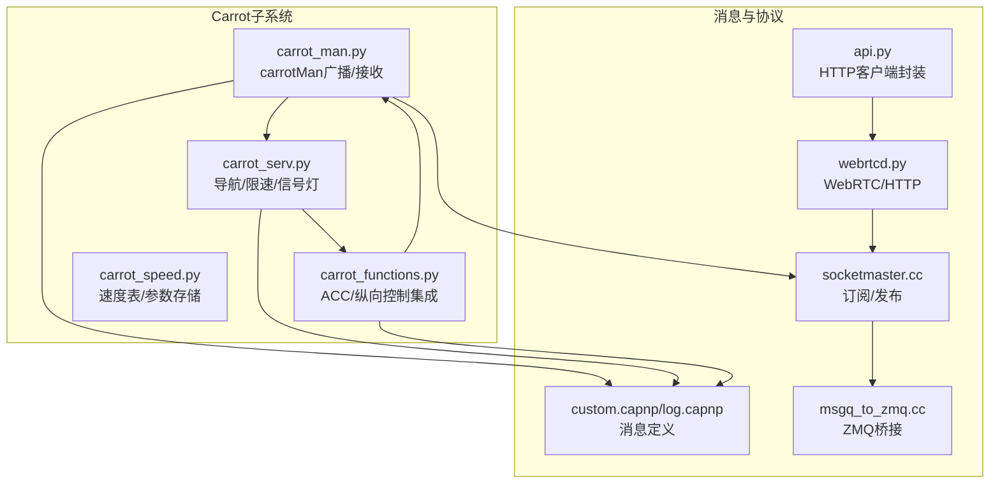
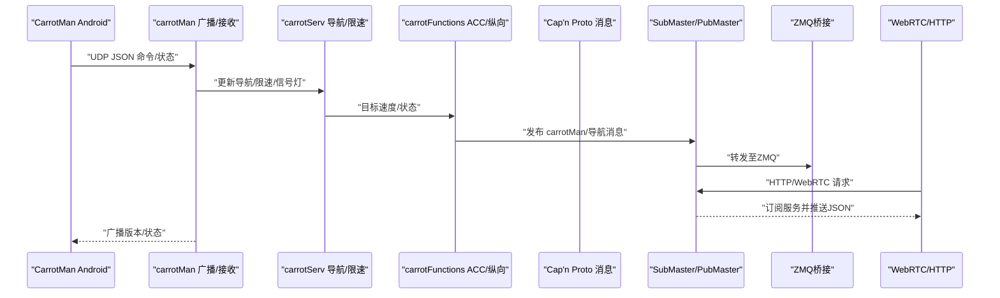
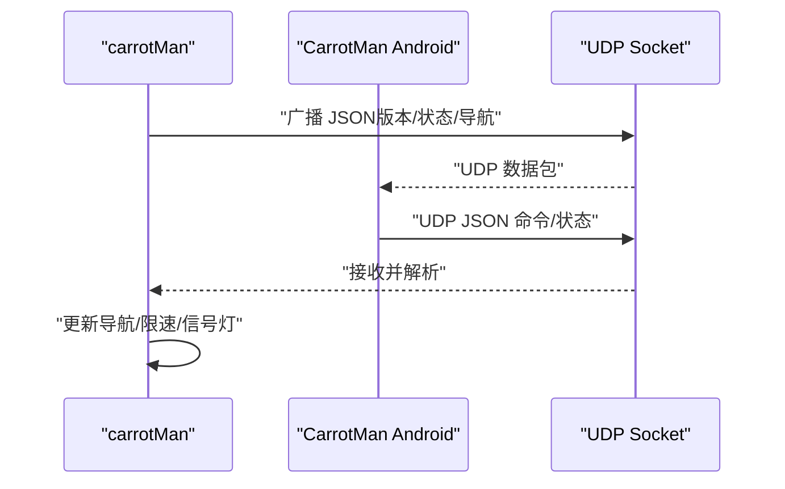
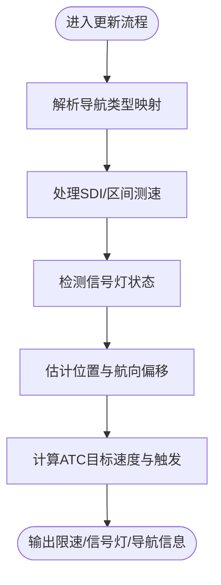
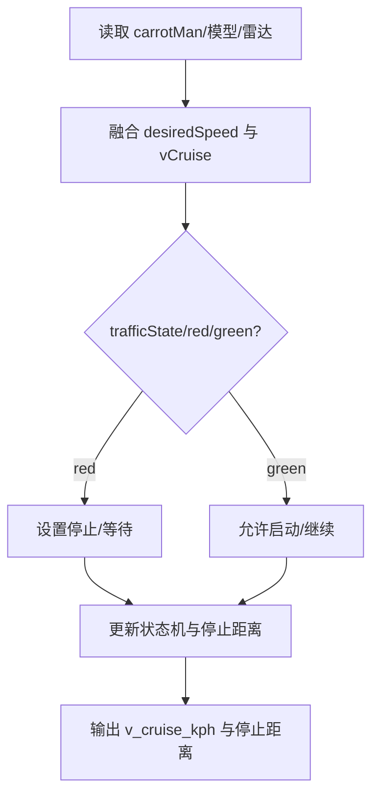
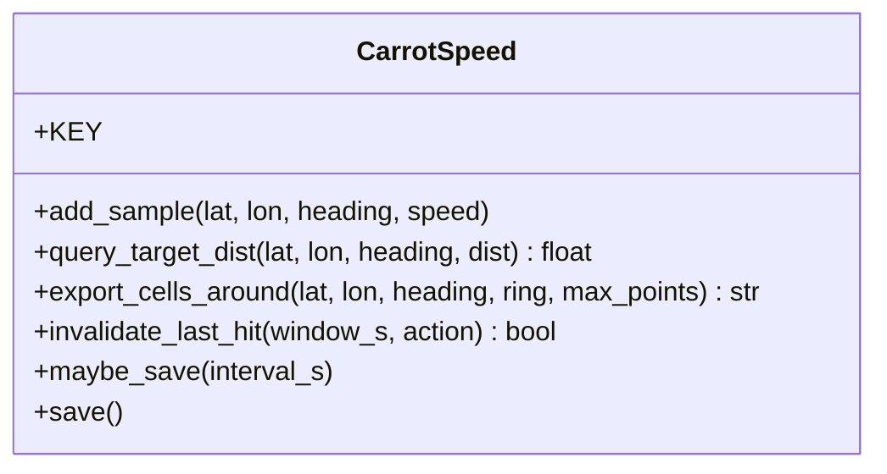
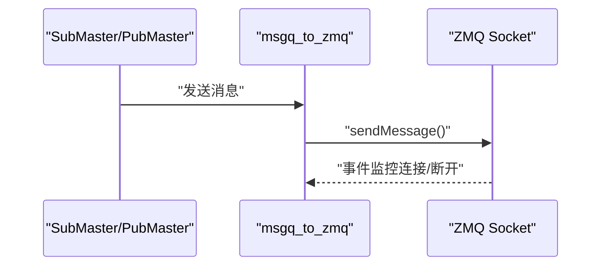
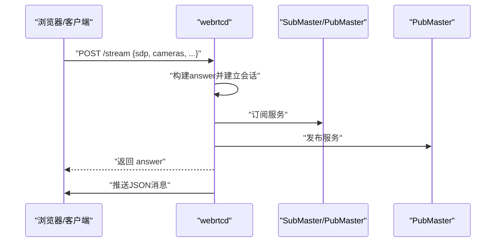
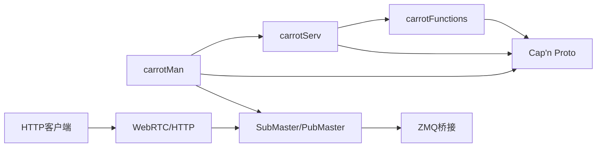

# API参考

<cite>
**本文引用的文件**
- [carrot_man.py](file://selfdrive/carrot/carrot_man.py)
- [carrot_serv.py](file://selfdrive/carrot/carrot_serv.py)
- [carrot_functions.py](file://selfdrive/carrot/carrot_functions.py)
- [carrot_speed.py](file://selfdrive/carrot/carrot_speed.py)
- [custom.capnp](file://cereal/custom.capnp)
- [log.capnp](file://cereal/log.capnp)
- [socketmaster.cc](file://cereal/messaging/socketmaster.cc)
- [msgq_to_zmq.cc](file://cereal/messaging/msgq_to_zmq.cc)
- [webrtcd.py](file://system/webrtc/webrtcd.py)
- [api.py](file://common/api.py)
- [swaglog.cc](file://common/swaglog.cc)
- [test_swaglog.cc](file://common/tests/test_swaglog.cc)
- [launch_openpilot.sh](file://launch_openpilot.sh)
</cite>

## 目录
1. [简介](#简介)
2. [项目结构](#项目结构)
3. [核心组件](#核心组件)
4. [架构总览](#架构总览)
5. [详细组件分析](#详细组件分析)
6. [依赖分析](#依赖分析)
7. [性能考量](#性能考量)
8. [故障排查指南](#故障排查指南)
9. [结论](#结论)
10. [附录](#附录)

## 简介
本文件为 Carrot2-v9-ACC 的 API 参考文档，聚焦于以下协议与通信机制：
- carrotMan 消息协议（HTTP/REST、UDP 广播与单播）
- WebSocket/WebRTC 实时消息桥接
- 内部消息总线（ZMQ/共享内存）与 IPC/管道
- 安全与认证、速率限制与版本信息
- 常见用例、客户端实现指南与性能优化建议
- 调试工具与监控方法，以及向后兼容性说明

## 项目结构
围绕 carrotMan 的关键模块与文件如下：
- carrotMan 消息协议与广播：selfdrive/carrot/carrot_man.py
- 导航与限速/信号灯逻辑：selfdrive/carrot/carrot_serv.py
- ACC/纵向控制与 carrotMan 集成：selfdrive/carrot/carrot_functions.py
- 速度表与参数化存储：selfdrive/carrot/carrot_speed.py
- 消息定义（Cap’n Proto）：cereal/custom.capnp、cereal/log.capnp
- 消息总线与 ZMQ 桥接：cereal/messaging/socketmaster.cc、cereal/messaging/msgq_to_zmq.cc
- WebRTC/HTTP 服务：system/webrtc/webrtcd.py
- HTTP API 客户端封装：common/api.py
- 日志与 IPC：common/swaglog.cc、common/tests/test_swaglog.cc
- 启动与主机配置：launch_openpilot.sh

图表来源
- [carrot_man.py:204-407](file://selfdrive/carrot/carrot_man.py#L204-L407)
- [carrot_serv.py:83-237](file://selfdrive/carrot/carrot_serv.py#L83-L237)
- [carrot_functions.py:49-522](file://selfdrive/carrot/carrot_functions.py#L49-L522)
- [carrot_speed.py:63-402](file://selfdrive/carrot/carrot_speed.py#L63-L402)
- [custom.capnp:14-48](file://cereal/custom.capnp#L14-L48)
- [log.capnp:1-120](file://cereal/log.capnp#L1-L120)
- [socketmaster.cc:46-104](file://cereal/messaging/socketmaster.cc#L46-L104)
- [msgq_to_zmq.cc:23-66](file://cereal/messaging/msgq_to_zmq.cc#L23-L66)
- [webrtcd.py:25-104](file://system/webrtc/webrtcd.py#L25-L104)

章节来源
- [carrot_man.py:204-407](file://selfdrive/carrot/carrot_man.py#L204-L407)
- [carrot_serv.py:83-237](file://selfdrive/carrot/carrot_serv.py#L83-L237)
- [carrot_functions.py:49-522](file://selfdrive/carrot/carrot_functions.py#L49-L522)
- [carrot_speed.py:63-402](file://selfdrive/carrot/carrot_speed.py#L63-L402)
- [custom.capnp:14-48](file://cereal/custom.capnp#L14-L48)
- [log.capnp:1-120](file://cereal/log.capnp#L1-L120)
- [socketmaster.cc:46-104](file://cereal/messaging/socketmaster.cc#L46-L104)
- [msgq_to_zmq.cc:23-66](file://cereal/messaging/msgq_to_zmq.cc#L23-L66)
- [webrtcd.py:25-104](file://system/webrtc/webrtcd.py#L25-L104)

## 核心组件
- carrotMan 广播与接收：负责以 JSON 文本通过 UDP 广播版本、运行状态、导航与限速信息，并接收来自 CarrotMan Android 的命令与状态更新。
- carrotServ 导航与限速：解析导航指令、限速/区间测速、信号灯状态、TBT（Towards-Before-Turn）信息，并计算目标速度。
- carrotFunctions ACC/纵向控制：将 carrotMan 提供的目标速度与状态整合到纵向控制策略中，支持不同驾驶模式与人性化参数。
- carrotSpeed 速度表：以参数化方式存储/查询速度建议，支持邻域查找与老化策略，用于可视化与决策。
- Cap’n Proto 消息定义：carrotMan 结构体字段、事件枚举与设备状态等。
- 消息总线与 ZMQ 桥接：SubMaster/PubMaster 的订阅/发布模型，以及 msgq_to_zmq 的 ZMQ 监控与桥接。
- WebRTC/HTTP：提供 HTTP 接口与 WebRTC 信令/媒体通道，实现浏览器侧的实时消息桥接。

章节来源
- [carrot_man.py:204-407](file://selfdrive/carrot/carrot_man.py#L204-L407)
- [carrot_serv.py:83-237](file://selfdrive/carrot/carrot_serv.py#L83-L237)
- [carrot_functions.py:49-522](file://selfdrive/carrot/carrot_functions.py#L49-L522)
- [carrot_speed.py:63-402](file://selfdrive/carrot/carrot_speed.py#L63-L402)
- [custom.capnp:14-48](file://cereal/custom.capnp#L14-L48)
- [log.capnp:1-120](file://cereal/log.capnp#L1-L120)
- [socketmaster.cc:46-104](file://cereal/messaging/socketmaster.cc#L46-L104)
- [msgq_to_zmq.cc:23-66](file://cereal/messaging/msgq_to_zmq.cc#L23-L66)
- [webrtcd.py:25-104](file://system/webrtc/webrtcd.py#L25-L104)

## 架构总览
下图展示 carrotMan 相关组件与消息总线、WebRTC/HTTP 的交互关系。

图表来源
- [carrot_man.py:321-407](file://selfdrive/carrot/carrot_man.py#L321-L407)
- [carrot_serv.py:238-318](file://selfdrive/carrot/carrot_serv.py#L238-L318)
- [carrot_functions.py:290-323](file://selfdrive/carrot/carrot_functions.py#L290-L323)
- [socketmaster.cc:73-104](file://cereal/messaging/socketmaster.cc#L73-L104)
- [msgq_to_zmq.cc:23-66](file://cereal/messaging/msgq_to_zmq.cc#L23-L66)
- [webrtcd.py:221-232](file://system/webrtc/webrtcd.py#L221-L232)

## 详细组件分析

### carrotMan 消息协议（HTTP/REST、UDP 广播与单播）
- 协议类型：UDP（广播与单播）、JSON 文本
- 广播端口：7705（广播 IP 地址动态获取）
- 单播端口：7706（监听来自 CarrotMan Android 的命令）
- 发送内容：版本号、是否在路、导航激活、IP/端口、车速/巡航状态、TBT/限速距离、控制状态等
- 接收内容：CarrotMan Android 发来的 JSON 命令，包含激活状态、限速/区间测速、TBT、导航路径等
- 更新频率：约 20Hz（由广播循环控制）

图表来源
- [carrot_man.py:321-407](file://selfdrive/carrot/carrot_man.py#L321-L407)
- [carrot_man.py:636-692](file://selfdrive/carrot/carrot_man.py#L636-L692)

章节来源
- [carrot_man.py:204-407](file://selfdrive/carrot/carrot_man.py#L204-L407)
- [carrot_man.py:636-692](file://selfdrive/carrot/carrot_man.py#L636-L692)

### carrotServ 导航与限速逻辑
- 导航类型映射：将导航指令编码转换为导航类型/修饰词/转向信息
- 限速/区间测速：根据 SDI（区间测速）与减速标志计算限速与距离
- 信号灯检测：基于检测到的红绿灯状态与置信度，更新交通状态
- 位置与航向：结合设备 GPS 与手机 GPS，估计当前位置与航向偏移
- ATC（自适应转向控制）：根据距离与速度计算目标速度与触发时机

图表来源
- [carrot_serv.py:336-397](file://selfdrive/carrot/carrot_serv.py#L336-L397)
- [carrot_serv.py:623-646](file://selfdrive/carrot/carrot_serv.py#L623-L646)
- [carrot_serv.py:647-722](file://selfdrive/carrot/carrot_serv.py#L647-L722)
- [carrot_serv.py:724-796](file://selfdrive/carrot/carrot_serv.py#L724-L796)

章节来源
- [carrot_serv.py:83-237](file://selfdrive/carrot/carrot_serv.py#L83-L237)
- [carrot_serv.py:336-397](file://selfdrive/carrot/carrot_serv.py#L336-L397)
- [carrot_serv.py:623-646](file://selfdrive/carrot/carrot_serv.py#L623-L646)
- [carrot_serv.py:647-722](file://selfdrive/carrot/carrot_serv.py#L647-L722)
- [carrot_serv.py:724-796](file://selfdrive/carrot/carrot_serv.py#L724-L796)

### carrotFunctions ACC/纵向控制集成
- 目标速度融合：将 carrotMan 的 desiredSpeed 与当前巡航速度比较，取较小者
- 交通状态：根据 carrotMan 的 trafficState 与模型预测，切换停止/启动状态
- 驾驶模式：根据 Eco/Safe/Normal/High 模式调整舒适刹车与加速度上限
- 动态跟随：根据前车距离与加速度，动态调整 t-follow 与急率因子

图表来源
- [carrot_functions.py:290-323](file://selfdrive/carrot/carrot_functions.py#L290-L323)
- [carrot_functions.py:414-498](file://selfdrive/carrot/carrot_functions.py#L414-L498)

章节来源
- [carrot_functions.py:49-522](file://selfdrive/carrot/carrot_functions.py#L49-L522)

### carrotSpeed 速度表与参数化存储
- 存储格式：参数键 "CarrotSpeedTable"，JSON+gzip，网格精度 1e-4°，8 个方向桶
- 写入策略：正负速度采用不同策略，负值（紧急减速）优先覆盖
- 查询策略：按航向桶与邻域 ring 查找，支持老化阈值过滤
- 可视化导出：导出周围网格的速度点集，供前端渲染

图表来源
- [carrot_speed.py:63-402](file://selfdrive/carrot/carrot_speed.py#L63-L402)

章节来源
- [carrot_speed.py:63-402](file://selfdrive/carrot/carrot_speed.py#L63-L402)

### Cap’n Proto 消息定义（carrotMan 字段）
- 消息类型：CarrotMan（custom.capnp）
- 主要字段：激活状态、限速/区间测速、TBT/导航、经纬度/航向、交通状态、剩余时间等
- 版本与频率：消息版本常量、约 20Hz 广播

章节来源
- [custom.capnp:14-48](file://cereal/custom.capnp#L14-L48)
- [log.capnp:10-120](file://cereal/log.capnp#L10-L120)

### 消息总线与 ZMQ 桥接
- SubMaster/PubMaster：订阅/发布服务，支持 alive/valid/updated 状态
- msgq_to_zmq：将内部消息队列桥接到 ZMQ，支持连接/断开监控与轮询
- 日志 IPC：Swaglog 通过 ZMQ PUSH/PULL 与 IPC 通道进行日志传输

图表来源
- [socketmaster.cc:73-104](file://cereal/messaging/socketmaster.cc#L73-L104)
- [msgq_to_zmq.cc:23-66](file://cereal/messaging/msgq_to_zmq.cc#L23-L66)
- [swaglog.cc:18-41](file://common/swaglog.cc#L18-L41)

章节来源
- [socketmaster.cc:46-104](file://cereal/messaging/socketmaster.cc#L46-L104)
- [msgq_to_zmq.cc:23-66](file://cereal/messaging/msgq_to_zmq.cc#L23-L66)
- [swaglog.cc:18-41](file://common/swaglog.cc#L18-L41)
- [test_swaglog.cc:24-43](file://common/tests/test_swaglog.cc#L24-L43)

### WebRTC/HTTP 实时桥接
- HTTP 接口：/stream（获取 SDP 应答）、/schema（获取服务 schema）
- WebRTC：接收/发送 JSON 消息，桥接 cereal 服务
- 会话管理：动态添加服务、清理资源、异常处理

图表来源
- [webrtcd.py:221-232](file://system/webrtc/webrtcd.py#L221-L232)
- [webrtcd.py:118-211](file://system/webrtc/webrtcd.py#L118-L211)

章节来源
- [webrtcd.py:25-104](file://system/webrtc/webrtcd.py#L25-L104)
- [webrtcd.py:118-211](file://system/webrtc/webrtcd.py#L118-L211)
- [webrtcd.py:221-232](file://system/webrtc/webrtcd.py#L221-L232)

### HTTP API 客户端封装
- 支持 GET/POST 请求，自动附加 JWT Token 与 User-Agent
- 默认 Host 来自环境变量（API_HOST），默认值为 https://api.commadotai.com

章节来源
- [api.py:10-46](file://common/api.py#L10-L46)

### 启动与主机配置
- 启动脚本根据 EnableConnect 参数设置 API_HOST 与 Athena WebSocket 地址

章节来源
- [launch_openpilot.sh:1-6](file://launch_openpilot.sh#L1-L6)

## 依赖分析
- 组件耦合
  - carrotMan 与 carrotServ：强耦合（carrotMan 作为输入源）
  - carrotServ 与 carrotFunctions：强耦合（目标速度/状态输入）
  - 消息总线：与 WebRTC/HTTP 解耦，通过 ZMQ 桥接
- 外部依赖
  - Cap’n Proto（消息序列化）
  - ZMQ（消息桥接）
  - WebSocket/WebRTC（浏览器实时桥接）
  - JWT（HTTP 认证）

图表来源
- [carrot_man.py:204-407](file://selfdrive/carrot/carrot_man.py#L204-L407)
- [carrot_serv.py:83-237](file://selfdrive/carrot/carrot_serv.py#L83-L237)
- [carrot_functions.py:49-522](file://selfdrive/carrot/carrot_functions.py#L49-L522)
- [custom.capnp:14-48](file://cereal/custom.capnp#L14-L48)
- [socketmaster.cc:46-104](file://cereal/messaging/socketmaster.cc#L46-L104)
- [msgq_to_zmq.cc:23-66](file://cereal/messaging/msgq_to_zmq.cc#L23-L66)
- [webrtcd.py:25-104](file://system/webrtc/webrtcd.py#L25-L104)
- [api.py:10-46](file://common/api.py#L10-L46)

章节来源
- [carrot_man.py:204-407](file://selfdrive/carrot/carrot_man.py#L204-L407)
- [carrot_serv.py:83-237](file://selfdrive/carrot/carrot_serv.py#L83-L237)
- [carrot_functions.py:49-522](file://selfdrive/carrot/carrot_functions.py#L49-L522)
- [custom.capnp:14-48](file://cereal/custom.capnp#L14-L48)
- [socketmaster.cc:46-104](file://cereal/messaging/socketmaster.cc#L46-L104)
- [msgq_to_zmq.cc:23-66](file://cereal/messaging/msgq_to_zmq.cc#L23-L66)
- [webrtcd.py:25-104](file://system/webrtc/webrtcd.py#L25-L104)
- [api.py:10-46](file://common/api.py#L10-L46)

## 性能考量
- carrotMan 广播频率：约 20Hz，避免过高的 CPU 占用
- 消息总线轮询：MAX_MESSAGES_PER_SOCKET 限制每轮处理数量，降低阻塞风险
- ZMQ 监控：连接/断开事件异步处理，减少主线程负担
- WebRTC：音频/视频轨道按需启用，避免不必要的解码/编码
- 速度表：邻域 ring 与老化阈值可调，平衡准确性与性能

章节来源
- [carrot_man.py:321-407](file://selfdrive/carrot/carrot_man.py#L321-L407)
- [msgq_to_zmq.cc:9-66](file://cereal/messaging/msgq_to_zmq.cc#L9-L66)
- [webrtcd.py:118-211](file://system/webrtc/webrtcd.py#L118-L211)
- [carrot_speed.py:63-402](file://selfdrive/carrot/carrot_speed.py#L63-L402)

## 故障排查指南
- UDP 广播/接收
  - 检查网络接口与广播地址动态获取逻辑
  - 确认端口 7705/7706 开放且无冲突
- WebRTC/HTTP
  - 检查 /stream 与 /schema 接口返回的 SDP/Schema
  - 关注连接/断开事件日志
- ZMQ 桥接
  - 监控连接事件与轮询状态，确保消息正常转发
- 日志与 IPC
  - Swaglog 通过 ZMQ PUSH/PULL 传输，检查连接与超时设置
- 认证与主机
  - 确认 API_HOST 与 JWT Token 生成逻辑

章节来源
- [carrot_man.py:321-407](file://selfdrive/carrot/carrot_man.py#L321-L407)
- [webrtcd.py:221-232](file://system/webrtc/webrtcd.py#L221-L232)
- [msgq_to_zmq.cc:68-135](file://cereal/messaging/msgq_to_zmq.cc#L68-L135)
- [swaglog.cc:18-41](file://common/swaglog.cc#L18-L41)
- [test_swaglog.cc:24-43](file://common/tests/test_swaglog.cc#L24-L43)
- [launch_openpilot.sh:1-6](file://launch_openpilot.sh#L1-L6)

## 结论
本文档梳理了 Carrot2-v9-ACC 中 carrotMan 消息协议、WebRTC/HTTP 实时桥接、消息总线与 ZMQ 桥接、以及安全与性能方面的要点。通过明确的协议规范、组件职责与依赖关系，开发者可以快速实现客户端接入、调试与优化。

## 附录

### 协议与字段参考（carrotMan）
- 消息类型：CarrotMan（custom.capnp）
- 主要字段：激活状态、限速/区间测速、TBT/导航、经纬度/航向、交通状态、剩余时间等
- 发送频率：约 20Hz
- 广播端口：7705
- 单播端口：7706

章节来源
- [custom.capnp:14-48](file://cereal/custom.capnp#L14-L48)
- [carrot_man.py:321-407](file://selfdrive/carrot/carrot_man.py#L321-L407)

### 安全与认证
- HTTP：JWT Token（RS256），User-Agent 包含版本信息
- 主机配置：API_HOST 可通过环境变量覆盖

章节来源
- [api.py:10-46](file://common/api.py#L10-L46)
- [launch_openpilot.sh:1-6](file://launch_openpilot.sh#L1-L6)

### 版本信息
- 日志消息版本常量：logVersion
- 软件版本：通过 User-Agent 注入

章节来源
- [log.capnp:10-120](file://cereal/log.capnp#L10-L120)
- [api.py:44-46](file://common/api.py#L44-L46)

### 常见用例与实现建议
- 实时监控：使用 WebRTC/HTTP 订阅服务，解析 JSON 消息
- 本地调试：直接订阅 ZMQ 消息或查看 Params 中的可视化数据
- 性能优化：合理设置邻域 ring 与老化阈值，避免过度查询

章节来源
- [webrtcd.py:221-232](file://system/webrtc/webrtcd.py#L221-L232)
- [carrot_speed.py:138-179](file://selfdrive/carrot/carrot_speed.py#L138-L179)