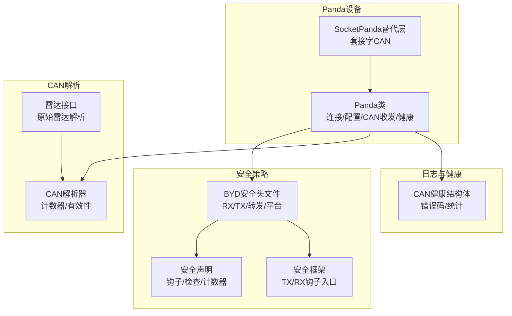
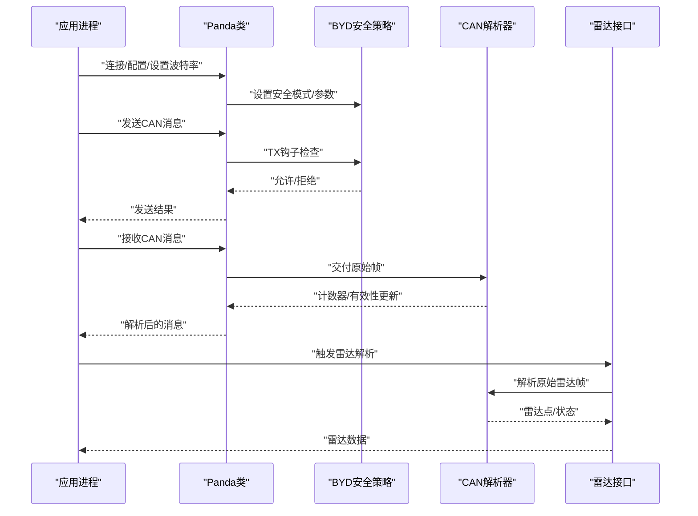
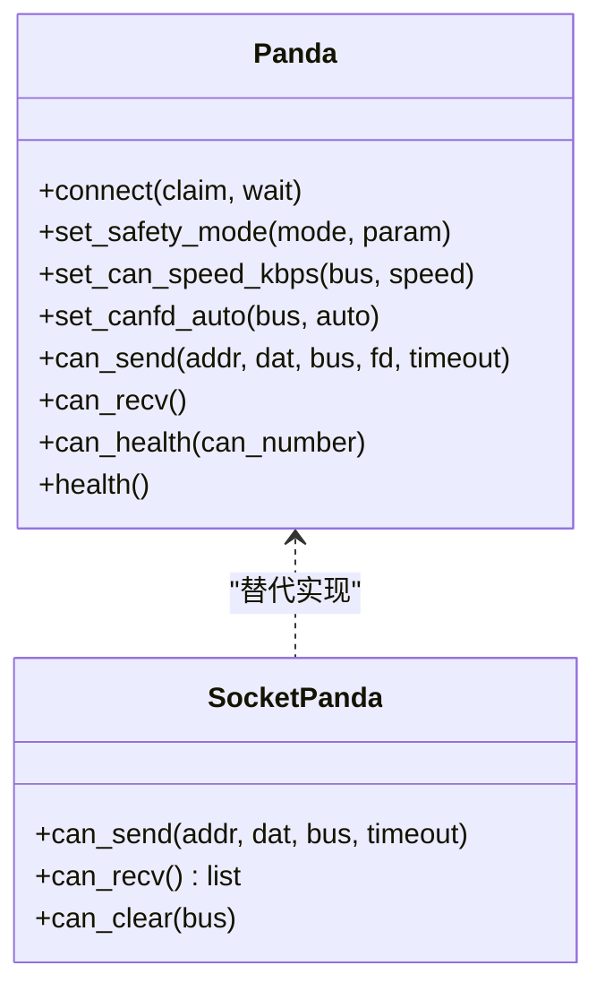
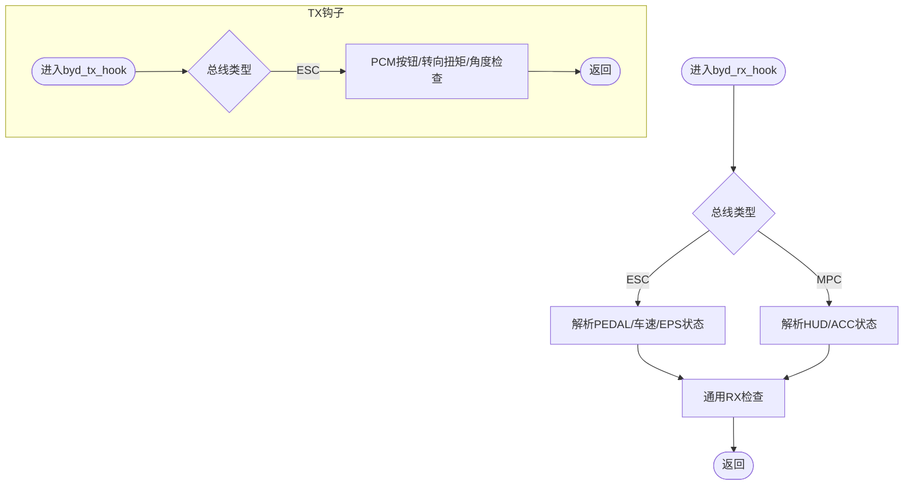
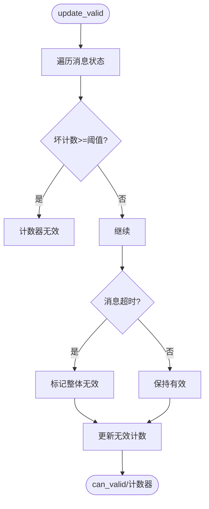
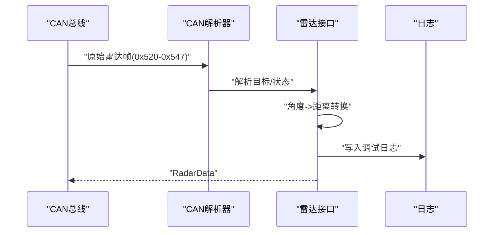
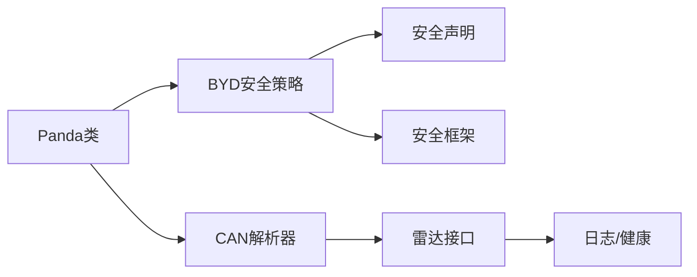

# CAN接口

<cite>
**本文引用的文件**
- [panda/python/__init__.py](file://panda/python/__init__.py)
- [panda/README.md](file://panda/README.md)
- [panda/python/socketpanda.py](file://panda/python/socketpanda.py)
- [panda/examples/can_logger.py](file://panda/examples/can_logger.py)
- [opendbc_repo/opendbc/safety/safety/safety_byd.h](file://opendbc_repo/opendbc/safety/safety/safety_byd.h)
- [opendbc_repo/opendbc/safety/safety_declarations.h](file://opendbc_repo/opendbc/safety/safety_declarations.h)
- [opendbc_repo/opendbc/safety/safety.h](file://opendbc_repo/opendbc/safety/safety.h)
- [opendbc_repo/opendbc/can/parser.py](file://opendbc_repo/opendbc/can/parser.py)
- [opendbc_repo/opendbc/car/byd/radar_interface.py](file://opendbc_repo/opendbc/car/byd/radar_interface.py)
- [docs/byd_radar_integration.md](file://docs/byd_radar_integration.md)
- [cereal/log.capnp](file://cereal/log.capnp)
</cite>

## 目录
1. [简介](#简介)
2. [项目结构](#项目结构)
3. [核心组件](#核心组件)
4. [架构总览](#架构总览)
5. [详细组件分析](#详细组件分析)
6. [依赖分析](#依赖分析)
7. [性能考虑](#性能考虑)
8. [故障排查指南](#故障排查指南)
9. [结论](#结论)
10. [附录](#附录)

## 简介
本文件面向Carrot2-v9-ACC项目中的CAN接口，聚焦于基于Panda设备的CAN通信能力、BYD车辆CAN消息解析与安全策略、以及雷达数据接入流程。内容涵盖：
- Panda设备的CAN通信协议、波特率设置与数据帧格式
- BYD车辆CAN消息解析规则、信号映射与数据转换
- CAN总线通信的安全机制、错误检测与故障处理
- CAN接口初始化配置、设备连接与状态监控
- CAN消息发送接收示例、调试工具与性能优化建议

## 项目结构
围绕CAN接口的关键目录与文件：
- Panda Python库：提供USB/SPI连接、CAN收发、健康状态查询、波特率与FD配置等
- 安全策略：BYD安全钩子、RX/TX检查、转发策略与平台区分
- CAN解析与有效性判断：消息计数器与超时判定、有效性统计
- 雷达数据集成：原始雷达CAN消息解析与状态监控
- 日志与健康：CAN健康状态结构体、错误码与统计指标

**图示来源**
- [panda/python/__init__.py:105-800](file://panda/python/__init__.py#L105-L800)
- [panda/python/socketpanda.py:47-95](file://panda/python/socketpanda.py#L47-L95)
- [opendbc_repo/opendbc/safety/safety/safety_byd.h:44-203](file://opendbc_repo/opendbc/safety/safety/safety_byd.h#L44-L203)
- [opendbc_repo/opendbc/safety/safety_declarations.h:161-195](file://opendbc_repo/opendbc/safety/safety_declarations.h#L161-L195)
- [opendbc_repo/opendbc/safety/safety.h:258-264](file://opendbc_repo/opendbc/safety/safety.h#L258-L264)
- [opendbc_repo/opendbc/can/parser.py:196-223](file://opendbc_repo/opendbc/can/parser.py#L196-L223)
- [opendbc_repo/opendbc/car/byd/radar_interface.py:8-56](file://opendbc_repo/opendbc/car/byd/radar_interface.py#L8-L56)
- [cereal/log.capnp:695-732](file://cereal/log.capnp#L695-L732)

**章节来源**
- [panda/python/__init__.py:105-800](file://panda/python/__init__.py#L105-L800)
- [panda/python/socketpanda.py:47-95](file://panda/python/socketpanda.py#L47-L95)
- [opendbc_repo/opendbc/safety/safety/safety_byd.h:44-203](file://opendbc_repo/opendbc/safety/safety/safety_byd.h#L44-L203)
- [opendbc_repo/opendbc/can/parser.py:196-223](file://opendbc_repo/opendbc/can/parser.py#L196-L223)
- [opendbc_repo/opendbc/car/byd/radar_interface.py:8-56](file://opendbc_repo/opendbc/car/byd/radar_interface.py#L8-L56)
- [cereal/log.capnp:695-732](file://cereal/log.capnp#L695-L732)

## 核心组件
- Panda设备接口：提供USB/SPI连接、CAN收发、波特率与FD配置、健康状态查询、安全模式设置等
- 安全策略（BYD）：针对ESC/MPC总线的消息进行RX/TX检查与转发策略，支持多平台参数化
- CAN解析器：维护消息计数器与有效性，统计无效计数与超时
- 雷达接口：解析原始雷达CAN消息，生成点云与状态监控
- 健康与错误：CAN健康结构体提供错误码、统计计数与速率指标

**章节来源**
- [panda/python/__init__.py:105-800](file://panda/python/__init__.py#L105-L800)
- [opendbc_repo/opendbc/safety/safety/safety_byd.h:44-203](file://opendbc_repo/opendbc/safety/safety/safety_byd.h#L44-L203)
- [opendbc_repo/opendbc/can/parser.py:196-223](file://opendbc_repo/opendbc/can/parser.py#L196-L223)
- [opendbc_repo/opendbc/car/byd/radar_interface.py:8-56](file://opendbc_repo/opendbc/car/byd/radar_interface.py#L8-L56)
- [cereal/log.capnp:695-732](file://cereal/log.capnp#L695-L732)

## 架构总览
下图展示Panda设备、安全策略、CAN解析与雷达接口之间的交互关系。

**图示来源**
- [panda/python/__init__.py:755-800](file://panda/python/__init__.py#L755-L800)
- [opendbc_repo/opendbc/safety/safety/safety_byd.h:92-175](file://opendbc_repo/opendbc/safety/safety/safety_byd.h#L92-L175)
- [opendbc_repo/opendbc/can/parser.py:196-223](file://opendbc_repo/opendbc/can/parser.py#L196-L223)
- [opendbc_repo/opendbc/car/byd/radar_interface.py:21-56](file://opendbc_repo/opendbc/car/byd/radar_interface.py#L21-L56)

## 详细组件分析

### Panda设备CAN接口
- 连接与选择：支持USB与SPI两种连接方式；可自动选择设备或由用户指定序列号
- 波特率与FD：支持设置CAN与CANFD数据速率、非ISO模式、自动切换等
- 收发：提供批量发送与接收，内部封装帧打包/解包与校验
- 健康状态：查询总线状态、错误计数、速率与复位次数等
- 安全模式：设置安全模型与参数，配合opendbc安全策略

**图示来源**
- [panda/python/__init__.py:105-800](file://panda/python/__init__.py#L105-L800)
- [panda/python/socketpanda.py:47-95](file://panda/python/socketpanda.py#L47-L95)

**章节来源**
- [panda/python/__init__.py:105-800](file://panda/python/__init__.py#L105-L800)
- [panda/README.md:44-107](file://panda/README.md#L44-L107)
- [panda/python/socketpanda.py:47-95](file://panda/python/socketpanda.py#L47-L95)

### BYD车辆CAN消息解析与安全策略
- 平台与总线：定义ESC/MPC/Radar总线编号与关键消息地址
- RX钩子：解析油门/刹车/车速/转向角/电机扭矩等，更新通用状态
- TX钩子：对转向扭矩/角度指令进行限值检查，结合巡航激活状态
- 转发策略：根据消息类型在ESC/MPC总线间转发或阻断
- 参数化平台：通过参数位选择不同平台配置

**图示来源**
- [opendbc_repo/opendbc/safety/safety/safety_byd.h:44-175](file://opendbc_repo/opendbc/safety/safety/safety_byd.h#L44-L175)

**章节来源**
- [opendbc_repo/opendbc/safety/safety/safety_byd.h:44-203](file://opendbc_repo/opendbc/safety/safety/safety_byd.h#L44-L203)
- [opendbc_repo/opendbc/safety/safety_declarations.h:161-195](file://opendbc_repo/opendbc/safety/safety_declarations.h#L161-L195)
- [opendbc_repo/opendbc/safety/safety.h:258-264](file://opendbc_repo/opendbc/safety/safety.h#L258-L264)

### CAN解析与有效性判断
- 计数器与超时：维护消息状态，统计坏计数阈值，超过阈值标记为无效
- 有效性更新：综合计数器与超时，决定整体有效性
- 控制准备：在有效性变化时输出告警与计数

**图示来源**
- [opendbc_repo/opendbc/can/parser.py:196-223](file://opendbc_repo/opendbc/can/parser.py#L196-L223)

**章节来源**
- [opendbc_repo/opendbc/can/parser.py:196-223](file://opendbc_repo/opendbc/can/parser.py#L196-L223)

### 雷达数据解析与集成
- 原始雷达消息：使用0x520-0x547范围的40个目标消息，解析距离/速度/角度/状态
- 角度到距离转换：计算纵向与横向相对距离
- 状态监控：解析雷达状态与错误码，记录调试日志
- 接口实现：基于CANParser解析MRR消息，生成RadarData

**图示来源**
- [docs/byd_radar_integration.md:9-57](file://docs/byd_radar_integration.md#L9-L57)
- [opendbc_repo/opendbc/car/byd/radar_interface.py:21-56](file://opendbc_repo/opendbc/car/byd/radar_interface.py#L21-L56)

**章节来源**
- [docs/byd_radar_integration.md:1-149](file://docs/byd_radar_integration.md#L1-L149)
- [opendbc_repo/opendbc/car/byd/radar_interface.py:8-56](file://opendbc_repo/opendbc/car/byd/radar_interface.py#L8-L56)

## 依赖分析
- Panda类依赖USB/SPI句柄与底层协议版本校验
- 安全策略依赖安全声明与安全框架，按平台参数构建RX/TX消息集与转发规则
- CAN解析器依赖消息计数器与有效性阈值，影响整体有效性
- 雷达接口依赖DBC与CAN解析器，输出RadarData供上层使用

**图示来源**
- [panda/python/__init__.py:105-800](file://panda/python/__init__.py#L105-L800)
- [opendbc_repo/opendbc/safety/safety/safety_byd.h:206-262](file://opendbc_repo/opendbc/safety/safety/safety_byd.h#L206-L262)
- [opendbc_repo/opendbc/safety/safety_declarations.h:161-195](file://opendbc_repo/opendbc/safety/safety_declarations.h#L161-L195)
- [opendbc_repo/opendbc/safety/safety.h:258-264](file://opendbc_repo/opendbc/safety/safety.h#L258-L264)
- [opendbc_repo/opendbc/can/parser.py:196-223](file://opendbc_repo/opendbc/can/parser.py#L196-L223)
- [opendbc_repo/opendbc/car/byd/radar_interface.py:8-56](file://opendbc_repo/opendbc/car/byd/radar_interface.py#L8-L56)

**章节来源**
- [panda/python/__init__.py:105-800](file://panda/python/__init__.py#L105-L800)
- [opendbc_repo/opendbc/safety/safety/safety_byd.h:206-262](file://opendbc_repo/opendbc/safety/safety/safety_byd.h#L206-L262)
- [opendbc_repo/opendbc/can/parser.py:196-223](file://opendbc_repo/opendbc/can/parser.py#L196-L223)
- [opendbc_repo/opendbc/car/byd/radar_interface.py:8-56](file://opendbc_repo/opendbc/car/byd/radar_interface.py#L8-L56)

## 性能考虑
- 批量收发：使用批量发送与接收减少系统调用开销
- 缓冲区大小：合理设置接收缓冲区，避免溢出与丢包
- 计数器与超时：通过计数器与超时阈值快速判定有效性，降低无效处理成本
- 安全检查：在TX钩子中尽早拒绝非法消息，减少总线负载
- 雷达解析：仅在触发消息到达后解析，避免不必要的CPU消耗

[本节为通用指导，无需具体文件分析]

## 故障排查指南
- 设备连接
  - 确认USB/SPI连接成功，必要时重连与固件版本匹配
  - 检查udev规则（Linux）或驱动安装
- 波特率与FD
  - 设置CAN与CANFD速率，确认非ISO模式与自动切换策略
- 健康状态
  - 读取CAN健康状态，关注总线关闭、错误计数、速率与复位次数
- 安全模式
  - 设置安全模式与参数，确保TX钩子允许合法消息
- 解析有效性
  - 关注计数器异常与超时导致的有效性下降
- 雷达数据
  - 检查原始雷达消息是否到达，确认角度到距离转换与状态解析

**章节来源**
- [panda/python/__init__.py:547-624](file://panda/python/__init__.py#L547-L624)
- [panda/python/__init__.py:755-800](file://panda/python/__init__.py#L755-L800)
- [opendbc_repo/opendbc/can/parser.py:196-223](file://opendbc_repo/opendbc/can/parser.py#L196-L223)
- [docs/byd_radar_integration.md:121-137](file://docs/byd_radar_integration.md#L121-L137)

## 结论
本文梳理了Carrot2-v9-ACC项目中基于Panda的CAN接口实现，覆盖设备连接与配置、波特率与FD设置、消息收发与健康监控、BYD车辆安全策略与雷达数据集成。通过明确的数据流与安全约束，可在保证安全性的同时高效解析与处理CAN数据。

[本节为总结，无需具体文件分析]

## 附录

### CAN接口初始化与配置要点
- 连接与选择：自动或手动选择设备序列号
- 安全模式：设置安全模型与参数
- 波特率：设置CAN与CANFD速率
- FD与非ISO：按需启用FD与非ISO模式
- 健康查询：定期读取CAN健康状态

**章节来源**
- [panda/python/__init__.py:153-260](file://panda/python/__init__.py#L153-L260)
- [panda/python/__init__.py:719-744](file://panda/python/__init__.py#L719-L744)
- [panda/python/__init__.py:582-624](file://panda/python/__init__.py#L582-L624)

### CAN消息发送接收示例与调试
- 示例脚本：使用Panda进行CAN日志记录，输出CSV文件
- 调试建议：结合健康状态与有效性统计定位问题

**章节来源**
- [panda/examples/can_logger.py:7-44](file://panda/examples/can_logger.py#L7-L44)

### BYD车辆CAN消息与雷达数据要点
- BYD安全消息与总线：ESC/MPC/Radar总线编号与关键消息地址
- RX/TX检查：油门/刹车/车速/EPS状态、转向扭矩/角度、按钮控制
- 雷达原始消息：40个目标消息与状态监控
- 角度到距离转换：纵向与横向相对距离计算

**章节来源**
- [opendbc_repo/opendbc/safety/safety/safety_byd.h:6-24](file://opendbc_repo/opendbc/safety/safety/safety_byd.h#L6-L24)
- [opendbc_repo/opendbc/safety/safety/safety_byd.h:44-175](file://opendbc_repo/opendbc/safety/safety/safety_byd.h#L44-L175)
- [docs/byd_radar_integration.md:9-57](file://docs/byd_radar_integration.md#L9-L57)
- [opendbc_repo/opendbc/car/byd/radar_interface.py:36-51](file://opendbc_repo/opendbc/car/byd/radar_interface.py#L36-L51)

### CAN健康状态与错误码
- 错误码：总线关闭、错误警告/被动、最后错误类型、接收/发送错误计数、丢失计数、总发送/接收计数、转发计数、速率与中断频率、复位计数
- 用途：监控总线健康状况与异常行为

**章节来源**
- [cereal/log.capnp:695-732](file://cereal/log.capnp#L695-L732)