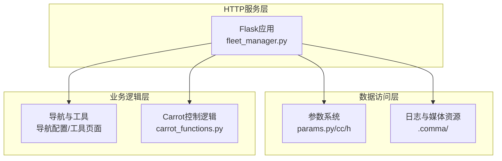
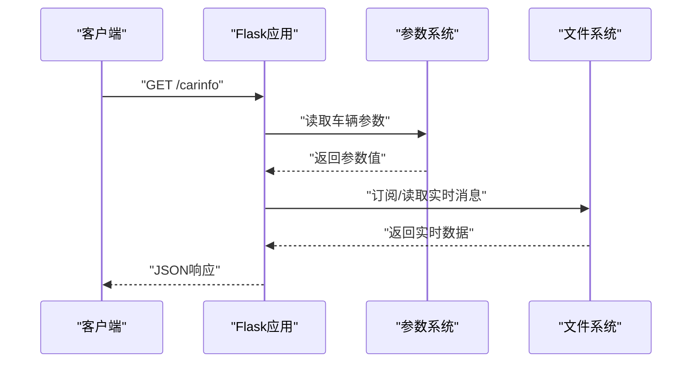
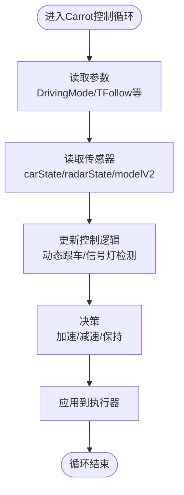
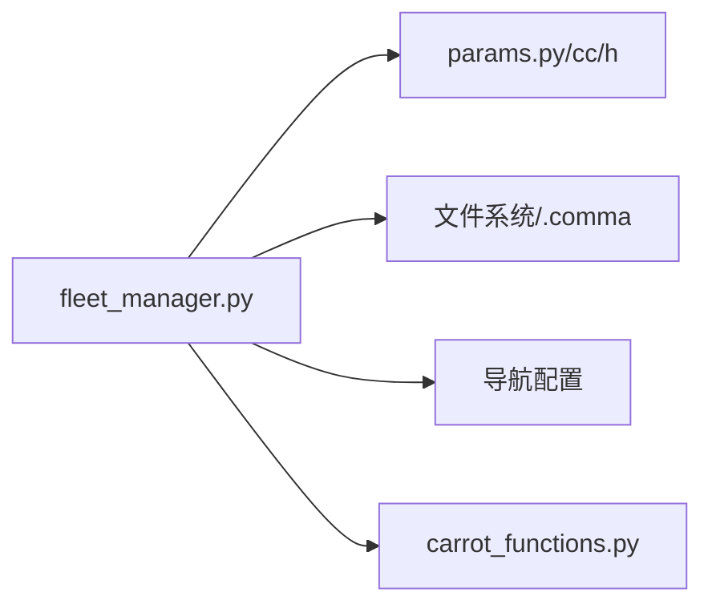

# HTTP API

<cite>
**本文引用的文件**
- [fleet_manager.py](file://selfdrive/frogpilot/fleetmanager/fleet_manager.py)
- [params.py](file://common/params.py)
- [params.cc](file://common/params.cc)
- [params.h](file://common/params.h)
- [params_reference.md](file://docs/params_reference.md)
- [launch_openpilot.sh](file://launch_openpilot.sh)
- [api.py](file://tools/lib/api.py)
- [carrot_functions.py](file://selfdrive/carrot/carrot_functions.py)
- [carrot_setting.py](file://selfdrive/carrot_setting.py)
- [carrot_set.py](file://selfdrive/carrot_set.py)
- [carrotman_analysis_0000007c--f94aa29a97.txt](file://carrotman_analysis_0000007c--f94aa29a97.txt)
- [carrotman_data_0000007c--f94aa29a97.json](file://carrotman_data_0000007c--f94aa29a97.json)
- [byd_radar_analysis_report.md](file://byd_radar_analysis_report.md)
- [radar_analysis_report.md](file://radar_analysis_report.md)
- [radar_pointcloud_visualizer.py](file://radar_pointcloud_visualizer.py)
- [radar_to_pointcloud.py](file://radar_to_pointcloud.py)
- [check_carrot_man.py](file://check_carrot_man.py)
- [check_carrot_fields.py](file://check_carrot_fields.py)
- [check_carrot_struct.py](file://check_carrot_struct.py)
- [AGENTS.md](file://AGENTS.md)
</cite>

## 目录
1. [简介](#简介)
2. [项目结构](#项目结构)
3. [核心组件](#核心组件)
4. [架构总览](#架构总览)
5. [详细组件分析](#详细组件分析)
6. [依赖分析](#依赖分析)
7. [性能考虑](#性能考虑)
8. [故障排除指南](#故障排除指南)
9. [结论](#结论)
10. [附录](#附录)

## 简介
本文件面向Carrot2-v9-ACC系统的HTTP API，聚焦于以下目标：
- 记录HTTP端点的URL模式、请求方法与参数规范
- 详述参数设置接口的GET/POST方法、参数校验与返回格式
- 覆盖系统状态查询、配置读取与实时数据获取的API
- 明确HTTP状态码、错误响应格式与异常处理机制
- 提供API调用示例、SDK使用指南与集成最佳实践

本项目中的HTTP服务由Flask应用提供，主要运行于本地端口8082，提供视频拼接、日志下载、参数读取、导航与工具页面等功能。

## 项目结构
与HTTP API直接相关的模块与文件包括：
- Flask Web应用：提供静态页面与REST风格接口
- 参数系统：提供参数读取与写入能力
- 日志与媒体资源：提供视频拼接、截图生成与文件下载
- 工具与分析：提供参数备份、设置与日志分析脚本

图表来源
- [fleet_manager.py:49-707](file://selfdrive/frogpilot/fleetmanager/fleet_manager.py#L49-L707)
- [params.py:1-18](file://common/params.py#L1-L18)
- [params.cc:122-191](file://common/params.cc#L122-L191)
- [params.h:22-54](file://common/params.h#L22-L54)

章节来源
- [fleet_manager.py:49-707](file://selfdrive/frogpilot/fleetmanager/fleet_manager.py#L49-L707)

## 核心组件
- Flask Web应用：提供路由注册、静态文件服务、模板渲染与JSON响应
- 参数系统：提供键值读取、写入与批量读取能力
- 日志与媒体：提供视频拼接、截图生成、文件下载与目录浏览
- 导航与工具：提供导航配置、令牌输入、地址解析与工具页面

章节来源
- [fleet_manager.py:49-707](file://selfdrive/frogpilot/fleet_manager.py#L49-L707)
- [params.py:1-18](file://common/params.py#L1-L18)
- [params.cc:122-191](file://common/params.cc#L122-L191)
- [params.h:22-54](file://common/params.h#L22-L54)

## 架构总览
HTTP API采用Flask轻量框架，路由集中在单个应用实例中，通过装饰器注册端点。参数系统以文件形式持久化，Web应用通过参数读取接口提供配置查询；日志与媒体资源通过文件系统访问，支持视频拼接与下载。

图表来源
- [fleet_manager.py:568-699](file://selfdrive/frogpilot/fleet_manager.py#L568-L699)
- [params.py:1-18](file://common/params.py#L1-L18)
- [params.cc:170-191](file://common/params.cc#L170-L191)

## 详细组件分析

### 1) 参数设置接口
- GET /get_toggle_values
  - 功能：读取所有切换类参数的当前值
  - 请求方式：GET
  - 查询参数：无
  - 成功响应：JSON数组，包含参数名与对应值
  - 失败响应：JSON对象，包含错误信息
  - 状态码：200/400
- POST /store_toggle_values
  - 功能：批量更新切换类参数
  - 请求方式：POST
  - 请求体：JSON对象，键为参数名，值为新值
  - 成功响应：JSON对象，包含成功信息
  - 失败响应：JSON对象，包含错误详情与状态码
  - 状态码：200/400

参数读取与写入
- 读取：通过参数系统提供的get/get_int/get_float/get_bool等方法读取
- 写入：通过put方法写入，内部采用原子写入策略，确保数据一致性

章节来源
- [fleet_manager.py:554-567](file://selfdrive/frogpilot/fleet_manager.py#L554-L567)
- [params.py:1-18](file://common/params.py#L1-L18)
- [params.cc:122-191](file://common/params.cc#L122-L191)
- [params.h:42-53](file://common/params.h#L42-L53)

### 2) 系统状态查询接口
- GET /carinfo
  - 功能：聚合车辆状态、巡航信息、轮速、转向、制动、灯光等信息
  - 请求方式：GET
  - 查询参数：无
  - 成功响应：HTML模板渲染结果
  - 失败响应：HTML错误页
  - 状态码：200/500
- GET /CurrentStep.json
  - 功能：下载当前步骤配置文件
  - 请求方式：GET
  - 查询参数：无
  - 成功响应：JSON文件流
  - 失败响应：404
  - 状态码：200/404
- GET /navdirections.json
  - 功能：下载导航方向配置文件
  - 请求方式：GET
  - 查询参数：无
  - 成功响应：JSON文件流
  - 失败响应：404
  - 状态码：200/404

章节来源
- [fleet_manager.py:568-699](file://selfdrive/frogpilot/fleet_manager.py#L568-L699)
- [fleet_manager.py:513-523](file://selfdrive/frogpilot/fleet_manager.py#L513-L523)

### 3) 导航与工具接口
- GET /locations
  - 功能：返回已保存的导航地点列表
  - 请求方式：GET
  - 查询参数：无
  - 成功响应：JSON字符串
  - 状态码：200
- POST /set_destination
  - 功能：设置目的地
  - 请求方式：POST
  - 请求体：JSON对象，包含经纬度与地址信息
  - 成功响应：JSON对象，包含success字段
  - 失败响应：JSON对象，包含success字段
  - 状态码：200
- GET /tools
  - 功能：返回工具页面
  - 请求方式：GET
  - 查询参数：无
  - 成功响应：HTML模板
  - 状态码：200

章节来源
- [fleet_manager.py:525-539](file://selfdrive/frogpilot/fleet_manager.py#L525-L539)
- [fleet_manager.py:550-557](file://selfdrive/frogpilot/fleet_manager.py#L550-L557)

### 4) 文件与媒体接口
- GET /footage/full/<cameratype>/<route>
  - 功能：拼接并流式输出指定摄像头类型与路线的视频
  - 请求方式：GET
  - 路径参数：cameratype（qcamera/fcamera/dcamera/ecamera）、route（路线标识）
  - 成功响应：MP4视频流
  - 失败响应：404
  - 状态码：200/404
- GET /footage/full/rlog/<route>/<segment>
  - 功能：下载指定分段的rlog压缩包
  - 请求方式：GET
  - 路径参数：route、segment
  - 成功响应：ZST压缩包
  - 失败响应：404
  - 状态码：200/404
- GET /footage/<cameratype>/<segment>
  - 功能：将单一分段转换为MP4并返回
  - 请求方式：GET
  - 路径参数：cameratype、segment
  - 成功响应：MP4视频流
  - 失败响应：404
  - 状态码：200/404
- GET /footage/<route>
  - 功能：列出指定路线的所有分段并生成预览
  - 请求方式：GET
  - 路径参数：route
  - 成功响应：HTML模板
  - 失败响应：404
  - 状态码：200/404
- GET /file-size
  - 功能：查询文件大小
  - 请求方式：GET
  - 查询参数：path（文件绝对路径）
  - 成功响应：JSON对象，包含size与status
  - 失败响应：JSON对象，包含错误信息与状态码
  - 状态码：200/404

章节来源
- [fleet_manager.py:61-101](file://selfdrive/frogpilot/fleet_manager.py#L61-L101)
- [fleet_manager.py:265-270](file://selfdrive/frogpilot/fleet_manager.py#L265-L270)
- [fleet_manager.py:273-298](file://selfdrive/frogpilot/fleet_manager.py#L273-L298)
- [fleet_manager.py:256-263](file://selfdrive/frogpilot/fleet_manager.py#L256-L263)

### 5) 参数备份与设置接口
- GET /get_toggle_values（同上）
- POST /store_toggle_values（同上）
- GET /carrot_params_backup
  - 功能：备份当前参数集合并输出JSON
  - 请求方式：GET
  - 查询参数：无
  - 成功响应：JSON文件
  - 状态码：200
- CLI参数设置
  - 脚本：carrot_set.py
  - 用法：传入参数名与值进行设置
  - 效果：通过参数系统写入

章节来源
- [fleet_manager.py:554-567](file://selfdrive/frogpilot/fleet_manager.py#L554-L567)
- [carrot_setting.py:1-28](file://selfdrive/carrot_setting.py#L1-L28)
- [carrot_set.py:1-15](file://selfdrive/carrot_set.py#L1-L15)

### 6) 错误处理与状态码
- 404：资源不存在（如文件、分段、路线）
- 500：服务器内部错误（模板渲染异常、参数读取异常）
- 200：成功响应（JSON、HTML、视频流）

章节来源
- [fleet_manager.py:55-59](file://selfdrive/frogpilot/fleet_manager.py#L55-L59)
- [fleet_manager.py:149-186](file://selfdrive/frogpilot/fleet_manager.py#L149-L186)
- [fleet_manager.py:212-216](file://selfdrive/frogpilot/fleet_manager.py#L212-L216)
- [fleet_manager.py:256-263](file://selfdrive/frogpilot/fleet_manager.py#L256-L263)

### 7) 实时数据获取与Carrot控制
- 车辆状态：通过订阅carState消息获取实时状态
- CarrotMan：通过carrotMan消息获取目标速度、跟车距离、信号灯状态等
- 控制逻辑：基于驾驶模式、跟车距离、信号灯状态与用户输入综合决策

图表来源
- [carrot_functions.py:143-184](file://selfdrive/carrot/carrot_functions.py#L143-L184)
- [carrot_functions.py:290-323](file://selfdrive/carrot/carrot_functions.py#L290-L323)
- [carrot_functions.py:346-521](file://selfdrive/carrot/carrot_functions.py#L346-L521)

章节来源
- [carrot_functions.py:143-184](file://selfdrive/carrot/carrot_functions.py#L143-L184)
- [carrot_functions.py:290-323](file://selfdrive/carrot/carrot_functions.py#L290-L323)
- [carrot_functions.py:346-521](file://selfdrive/carrot/carrot_functions.py#L346-L521)

## 依赖分析
- Flask应用依赖参数系统进行配置读取
- 日志与媒体接口依赖文件系统与外部工具（FFmpeg/FFplay）
- 导航接口依赖外部服务（高德/谷歌地图），需配置密钥与令牌
- 参数系统提供线程安全的异步写入机制，保证并发安全性

图表来源
- [fleet_manager.py:49-707](file://selfdrive/frogpilot/fleet_manager.py#L49-L707)
- [params.py:1-18](file://common/params.py#L1-L18)
- [params.cc:227-234](file://common/params.cc#L227-L234)

章节来源
- [params.cc:227-234](file://common/params.cc#L227-L234)

## 性能考虑
- 视频拼接采用流式输出，避免一次性加载大文件
- 参数读取采用阻塞读取，确保数据一致性
- 异步写入机制减少写入阻塞，提高并发性能
- 建议对高频接口增加缓存与限流策略

## 故障排除指南
- 404错误：检查路径参数是否正确，确认文件是否存在
- 500错误：查看服务器日志，定位模板渲染或参数读取异常
- 参数写入失败：检查权限与磁盘空间，确认参数键名有效
- 导航接口失败：检查密钥与令牌配置，确认网络连通性

章节来源
- [fleet_manager.py:55-59](file://selfdrive/frogpilot/fleet_manager.py#L55-L59)
- [params.cc:122-191](file://common/params.cc#L122-L191)

## 结论
本HTTP API围绕Flask应用构建，提供参数管理、系统状态查询、导航与工具、日志与媒体等核心能力。通过参数系统与文件系统实现数据持久化与访问，结合Carrot控制逻辑提供实时数据支撑。建议在生产环境中完善鉴权、限流与监控机制，并提供统一的SDK封装以简化集成。

## 附录

### A. API端点一览表
- GET /get_toggle_values → 返回所有切换类参数
- POST /store_toggle_values → 批量更新切换类参数
- GET /carinfo → 返回车辆状态与配置
- GET /CurrentStep.json → 下载当前步骤配置
- GET /navdirections.json → 下载导航方向配置
- GET /locations → 返回导航地点列表
- POST /set_destination → 设置目的地
- GET /tools → 返回工具页面
- GET /footage/full/<cameratype>/<route> → 流式输出拼接视频
- GET /footage/full/rlog/<route>/<segment> → 下载rlog压缩包
- GET /footage/<cameratype>/<segment> → 转换并返回MP4
- GET /footage/<route> → 列出路线路段与预览
- GET /file-size → 查询文件大小
- GET /carrot_params_backup → 备份参数集

章节来源
- [fleet_manager.py:554-567](file://selfdrive/frogpilot/fleet_manager.py#L554-L567)
- [fleet_manager.py:568-699](file://selfdrive/frogpilot/fleet_manager.py#L568-L699)
- [fleet_manager.py:61-101](file://selfdrive/frogpilot/fleet_manager.py#L61-L101)
- [fleet_manager.py:265-270](file://selfdrive/frogpilot/fleet_manager.py#L265-L270)
- [fleet_manager.py:273-298](file://selfdrive/frogpilot/fleet_manager.py#L273-L298)
- [fleet_manager.py:256-263](file://selfdrive/frogpilot/fleet_manager.py#L256-L263)

### B. 参数系统接口规范
- 读取：get(key)、get_int(key)、get_float(key)、get_bool(key)
- 写入：put(key, value)
- 批量：readAll()、allKeys()

章节来源
- [params.py:1-18](file://common/params.py#L1-L18)
- [params.cc:106-191](file://common/params.cc#L106-L191)
- [params.h:42-53](file://common/params.h#L42-L53)

### C. SDK使用指南
- Python SDK：使用requests库调用HTTP端点，注意处理JSON响应与错误状态码
- 鉴权：导航接口需配置令牌与密钥，确保请求头包含Authorization
- 最佳实践：对高频接口添加缓存，限制并发请求，记录请求日志

章节来源
- [api.py:1-35](file://tools/lib/api.py#L1-L35)
- [launch_openpilot.sh:1-6](file://launch_openpilot.sh#L1-L6)

### D. 集成最佳实践
- 在启动时读取参数并初始化配置
- 对视频拼接接口使用流式传输，避免内存溢出
- 对参数写入操作进行幂等性校验，防止重复写入
- 对外部服务接口增加超时与重试机制

章节来源
- [params.cc:122-191](file://common/params.cc#L122-L191)
- [AGENTS.md:380-467](file://AGENTS.md#L380-L467)