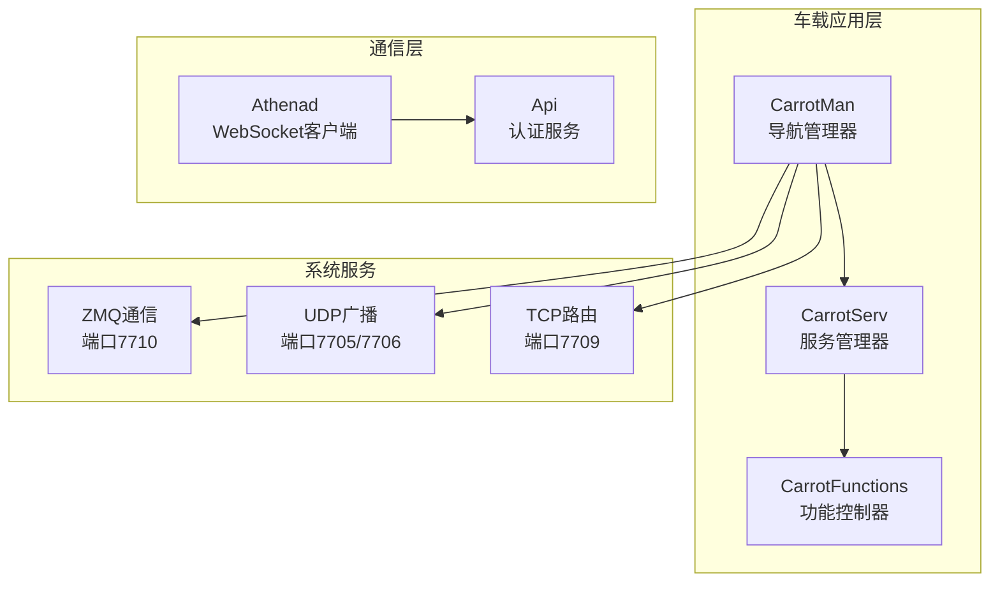
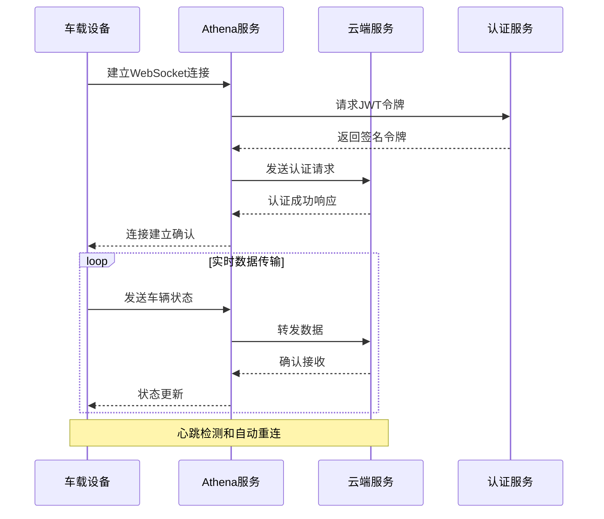
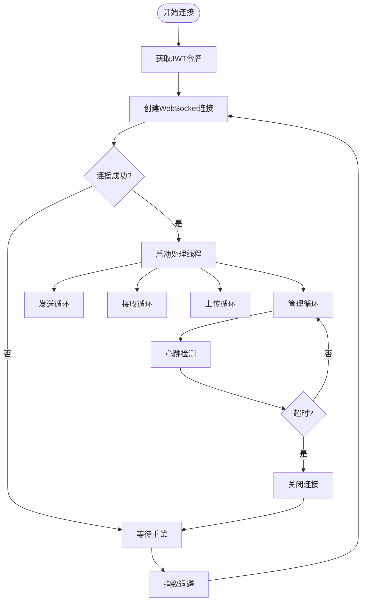
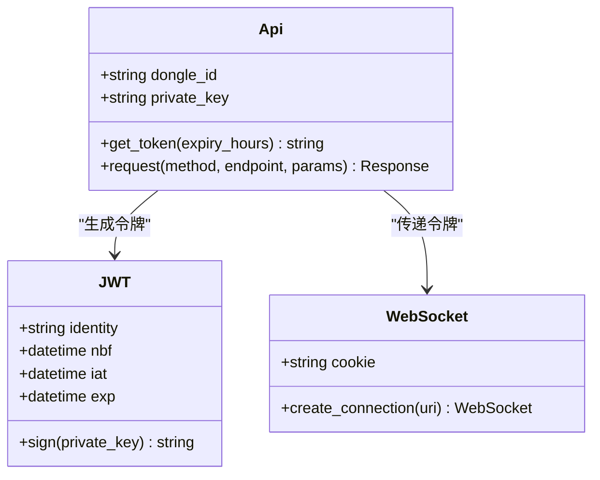
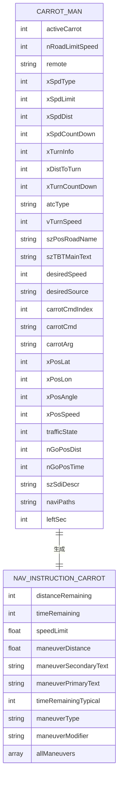
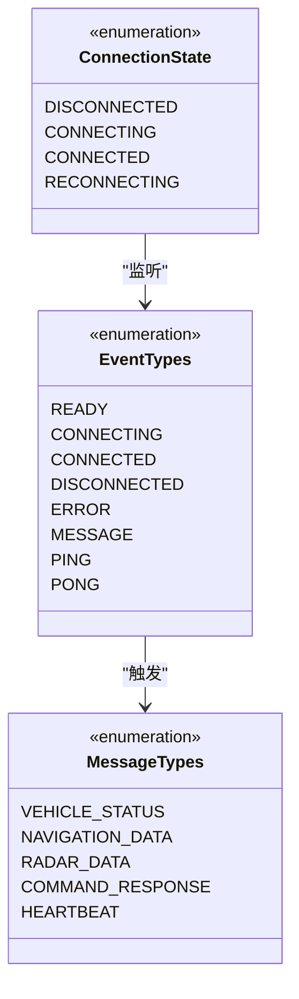
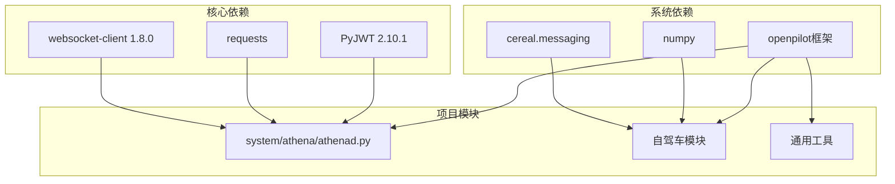

# WebSocket API

<cite>
**本文档引用的文件**
- [athenad.py](file://system/athena/athenad.py)
- [api.py](file://common/api.py)
- [carrot_serv.py](file://selfdrive/carrot/carrot_serv.py)
- [carrot_man.py](file://selfdrive/carrot/carrot_man.py)
- [carrot_functions.py](file://selfdrive/carrot/carrot_functions.py)
- [launch_openpilot.sh](file://launch_openpilot.sh)
- [uv.lock](file://uv.lock)
</cite>

## 目录
1. [简介](#简介)
2. [项目结构](#项目结构)
3. [核心组件](#核心组件)
4. [架构概览](#架构概览)
5. [详细组件分析](#详细组件分析)
6. [依赖分析](#依赖分析)
7. [性能考虑](#性能考虑)
8. [故障排除指南](#故障排除指南)
9. [结论](#结论)

## 简介

Carrot2-v9-ACC 项目中的 WebSocket API 主要用于车载设备与云端服务之间的实时通信。该系统基于 openpilot 框架构建，提供了完整的车载设备管理、数据传输和实时状态同步功能。

本项目实现了以下关键功能：
- 车载设备与云端的双向 WebSocket 通信
- 实时车辆状态数据推送
- 导航和雷达数据的实时传输
- 设备管理和配置同步
- 错误处理和重连机制

## 项目结构

Carrot2-v9-ACC 项目采用模块化架构，主要分为以下几个核心模块：

**图表来源**
- [carrot_man.py:204-260](file://selfdrive/carrot/carrot_man.py#L204-L260)
- [carrot_serv.py:83-200](file://selfdrive/carrot/carrot_serv.py#L83-L200)
- [athenad.py:43-50](file://system/athena/athenad.py#L43-L50)

**章节来源**
- [carrot_man.py:204-260](file://selfdrive/carrot/carrot_man.py#L204-L260)
- [carrot_serv.py:83-200](file://selfdrive/carrot/carrot_serv.py#L83-L200)
- [athenad.py:43-50](file://system/athena/athenad.py#L43-L50)

## 核心组件

### WebSocket 客户端 (Athenad)

Athenad 是项目中的核心 WebSocket 客户端，负责与云端服务建立和维护 WebSocket 连接。

**主要特性：**
- 支持多线程处理
- 自动重连机制
- 心跳检测和超时处理
- JSON-RPC 方法调用支持

**章节来源**
- [athenad.py:152-183](file://system/athena/athenad.py#L152-L183)
- [athenad.py:828-838](file://system/athena/athenad.py#L828-L838)

### 认证服务 (Api)

Api 类负责生成和管理 JWT 认证令牌，确保 WebSocket 连接的安全性。

**主要功能：**
- RSA-SHA256 签名算法
- 自动令牌过期处理
- 用户身份验证

**章节来源**
- [api.py:25-36](file://common/api.py#L25-L36)

### 导航管理器 (CarrotMan)

CarrotMan 是导航系统的主控制器，负责处理导航数据和实时状态更新。

**核心功能：**
- UDP 广播通信
- TCP 路由数据传输
- ZMQ 命令处理
- 实时位置跟踪

**章节来源**
- [carrot_man.py:204-260](file://selfdrive/carrot/carrot_man.py#L204-L260)
- [carrot_man.py:636-692](file://selfdrive/carrot/carrot_man.py#L636-L692)

### 服务管理器 (CarrotServ)

CarrotServ 提供导航服务的详细信息和状态管理。

**主要职责：**
- 车辆状态数据处理
- 导航指令生成
- 实时数据同步

**章节来源**
- [carrot_serv.py:861-1102](file://selfdrive/carrot/carrot_serv.py#L861-L1102)

## 架构概览

Carrot2-v9-ACC 的 WebSocket 架构采用分层设计，确保了系统的可扩展性和可靠性：

**图表来源**
- [athenad.py:802-824](file://system/athena/athenad.py#L802-L824)
- [api.py:25-36](file://common/api.py#L25-L36)

**章节来源**
- [athenad.py:802-824](file://system/athena/athenad.py#L802-L824)
- [launch_openpilot.sh:1-6](file://launch_openpilot.sh#L1-L6)

## 详细组件分析

### WebSocket 连接管理

WebSocket 连接管理是整个系统的核心，负责建立、维护和恢复连接。

**图表来源**
- [athenad.py:802-838](file://system/athena/athenad.py#L802-L838)
- [athenad.py:724-744](file://system/athena/athenad.py#L724-L744)

**章节来源**
- [athenad.py:802-838](file://system/athena/athenad.py#L802-L838)
- [athenad.py:724-744](file://system/athena/athenad.py#L724-L744)

### 认证机制

系统采用 JWT (JSON Web Token) 作为认证机制，确保通信安全。

**图表来源**
- [api.py:10-36](file://common/api.py#L10-L36)
- [athenad.py:813-816](file://system/athena/athenad.py#L813-L816)

**章节来源**
- [api.py:10-36](file://common/api.py#L10-L36)
- [athenad.py:813-816](file://system/athena/athenad.py#L813-L816)

### 实时数据推送

系统支持多种类型的数据推送，包括车辆状态、导航信息和雷达数据。

**图表来源**
- [carrot_serv.py:1063-1102](file://selfdrive/carrot/carrot_serv.py#L1063-L1102)
- [carrot_serv.py:1104-1147](file://selfdrive/carrot/carrot_serv.py#L1104-L1147)

**章节来源**
- [carrot_serv.py:1063-1102](file://selfdrive/carrot/carrot_serv.py#L1063-L1102)
- [carrot_serv.py:1104-1147](file://selfdrive/carrot/carrot_serv.py#L1104-L1147)

### 事件类型定义

系统定义了多种事件类型来处理不同的业务场景：

**图表来源**
- [carrot_functions.py:15-44](file://selfdrive/carrot/carrot_functions.py#L15-L44)

**章节来源**
- [carrot_functions.py:15-44](file://selfdrive/carrot/carrot_functions.py#L15-L44)

### 客户端连接管理

系统提供了完整的客户端连接管理机制，包括连接状态监控和资源清理。

**章节来源**
- [athenad.py:152-183](file://system/athena/athenad.py#L152-L183)
- [carrot_man.py:636-692](file://selfdrive/carrot/carrot_man.py#L636-L692)

## 依赖分析

Carrot2-v9-ACC 项目的依赖关系相对简洁，主要依赖于 openpilot 生态系统：

**图表来源**
- [uv.lock:5035-5042](file://uv.lock#L5035-L5042)
- [uv.lock:1793-1805](file://uv.lock#L1793-L1805)

**章节来源**
- [uv.lock:5035-5042](file://uv.lock#L5035-L5042)
- [uv.lock:1793-1805](file://uv.lock#L1793-L1805)

## 性能考虑

### 连接优化

系统采用了多项性能优化措施：

1. **指数退避重连**：避免频繁重连造成网络拥塞
2. **线程池管理**：合理分配处理线程，避免资源浪费
3. **心跳检测**：及时发现连接异常，减少无效连接占用

### 数据传输优化

1. **分帧传输**：WebSocket 帧大小限制为 4096 字节
2. **优先级队列**：重要数据优先传输
3. **压缩机制**：对大文件进行压缩传输

### 内存管理

1. **连接池**：复用 WebSocket 连接
2. **垃圾回收**：定期清理无用对象
3. **内存监控**：实时监控内存使用情况

## 故障排除指南

### 常见连接问题

**问题：无法建立 WebSocket 连接**
- 检查网络连接状态
- 验证认证令牌有效性
- 确认服务器地址配置正确

**问题：连接频繁断开**
- 检查心跳检测配置
- 验证防火墙设置
- 监控网络延迟

**问题：数据传输失败**
- 检查队列状态
- 验证数据格式
- 确认服务器负载

### 调试方法

1. **日志分析**：查看系统日志了解错误详情
2. **网络监控**：使用网络工具检测连接状态
3. **性能分析**：监控系统资源使用情况

**章节来源**
- [athenad.py:828-838](file://system/athena/athenad.py#L828-L838)
- [carrot_man.py:824-838](file://selfdrive/carrot/carrot_man.py#L824-L838)

## 结论

Carrot2-v9-ACC 项目的 WebSocket API 设计体现了现代车载系统的特点：

1. **安全性**：采用 JWT 认证机制，确保通信安全
2. **可靠性**：完善的重连和错误处理机制
3. **实时性**：高效的实时数据传输能力
4. **可扩展性**：模块化设计便于功能扩展

该系统为车载设备与云端服务之间的通信提供了稳定可靠的基础设施，支持车辆状态监控、导航数据传输和远程控制等多种应用场景。