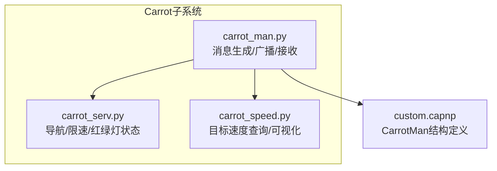
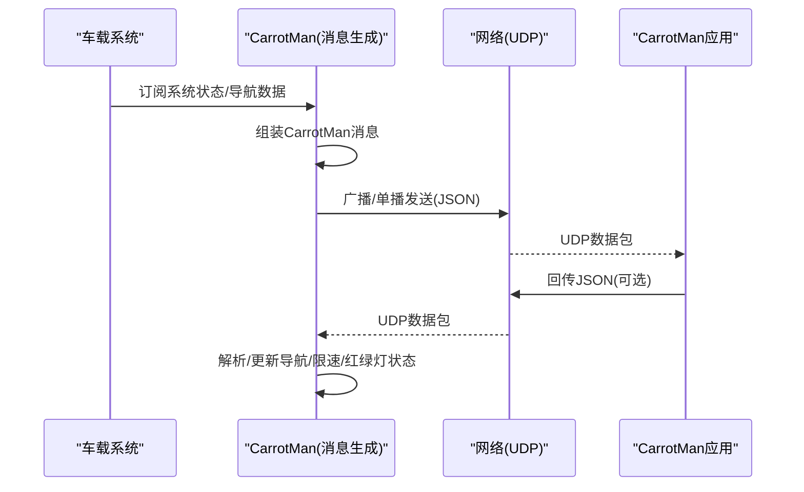
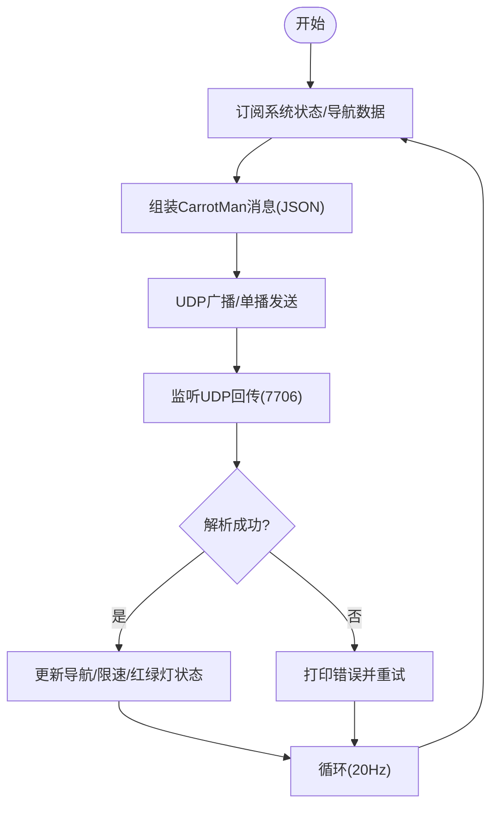
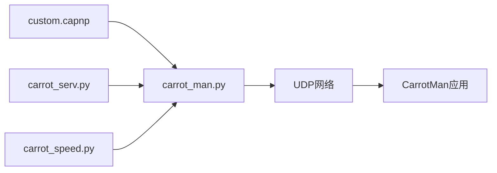

# 消息协议定义

<cite>
**本文引用的文件**   
- [cereal/custom.capnp](file://cereal/custom.capnp)
- [selfdrive/carrot/carrot_man.py](file://selfdrive/carrot/carrot_man.py)
- [selfdrive/carrot/carrot_serv.py](file://selfdrive/carrot/carrot_serv.py)
- [selfdrive/carrot/carrot_speed.py](file://selfdrive/carrot/carrot_speed.py)
- [原车acc增强系统设计.md](file://原车acc增强系统设计.md)
- [check_carrot_fields.py](file://check_carrot_fields.py)
- [check_carrot_man.py](file://check_carrot_man.py)
</cite>

## 目录
1. [简介](#简介)
2. [项目结构](#项目结构)
3. [核心组件](#核心组件)
4. [架构总览](#架构总览)
5. [详细组件分析](#详细组件分析)
6. [依赖关系分析](#依赖关系分析)
7. [性能考量](#性能考量)
8. [故障排查指南](#故障排查指南)
9. [结论](#结论)
10. [附录](#附录)

## 简介
本文件面向Carrot2-v9-ACC消息协议，聚焦CarrotMan消息结构及其扩展机制，系统梳理字段定义、数据类型、用途与典型使用场景，并给出序列化格式、网络传输协议、数据完整性校验、版本兼容与迁移策略、使用示例、错误处理与调试方法。重点字段包括但不限于：activeCarrot、nRoadLimitSpeed、desiredSpeed、xSpdType/xSpdLimit/xSpdDist/xSpdCountDown、xTurnInfo/vTurnSpeed、trafficState、naviPaths、szSdiDescr等。

## 项目结构
围绕CarrotMan消息协议的相关代码与文档分布于如下模块：
- 协议定义：cereal/custom.capnp
- 消息生成与广播：selfdrive/carrot/carrot_man.py
- 导航/限速/红绿灯等状态服务：selfdrive/carrot/carrot_serv.py
- 目标速度查询与可视化：selfdrive/carrot/carrot_speed.py
- 字段参考与使用示例：原车acc增强系统设计.md
- 字段检查脚本：check_carrot_fields.py、check_carrot_man.py

图表来源
- [selfdrive/carrot/carrot_man.py:204-260](file://selfdrive/carrot/carrot_man.py#L204-L260)
- [selfdrive/carrot/carrot_serv.py:83-200](file://selfdrive/carrot/carrot_serv.py#L83-L200)
- [selfdrive/carrot/carrot_speed.py:63-90](file://selfdrive/carrot/carrot_speed.py#L63-L90)
- [cereal/custom.capnp:14-48](file://cereal/custom.capnp#L14-L48)

章节来源
- [selfdrive/carrot/carrot_man.py:204-260](file://selfdrive/carrot/carrot_man.py#L204-L260)
- [selfdrive/carrot/carrot_serv.py:83-200](file://selfdrive/carrot/carrot_serv.py#L83-L200)
- [selfdrive/carrot/carrot_speed.py:63-90](file://selfdrive/carrot/carrot_speed.py#L63-L90)
- [cereal/custom.capnp:14-48](file://cereal/custom.capnp#L14-L48)

## 核心组件
- CarrotMan结构（Cap'n Proto）
  - 定义于cereal/custom.capnp，包含激活状态、道路限速、远程信息、限速/转弯/导航文本、目标速度来源、GPS位置与航向、交通灯状态、导航路径、剩余时间等字段。
- CarrotMan消息生成器（carrot_man.py）
  - 负责订阅系统状态、组装CarrotMan消息、通过UDP广播/单播发送，并处理来自CarrotMan应用的回传数据。
- 导航与状态服务（carrot_serv.py）
  - 维护限速、TBT导航、红绿灯状态、SDI提示、命令索引与参数等状态，供CarrotMan消息填充。
- 目标速度查询与可视化（carrot_speed.py）
  - 提供基于参数存储的目标速度表查询、可视化导出与持久化能力。

章节来源
- [cereal/custom.capnp:14-48](file://cereal/custom.capnp#L14-L48)
- [selfdrive/carrot/carrot_man.py:204-260](file://selfdrive/carrot/carrot_man.py#L204-L260)
- [selfdrive/carrot/carrot_serv.py:83-200](file://selfdrive/carrot/carrot_serv.py#L83-L200)
- [selfdrive/carrot/carrot_speed.py:63-90](file://selfdrive/carrot/carrot_speed.py#L63-L90)

## 架构总览
CarrotMan消息在车载侧由carrot_man.py生成，经UDP广播/单播发送至CarrotMan应用；应用侧可回传JSON数据，carrot_man.py解析后更新导航与限速状态，再驱动后续控制策略。

图表来源
- [selfdrive/carrot/carrot_man.py:321-406](file://selfdrive/carrot/carrot_man.py#L321-L406)
- [selfdrive/carrot/carrot_man.py:636-692](file://selfdrive/carrot/carrot_man.py#L636-L692)

章节来源
- [selfdrive/carrot/carrot_man.py:321-406](file://selfdrive/carrot/carrot_man.py#L321-L406)
- [selfdrive/carrot/carrot_man.py:636-692](file://selfdrive/carrot/carrot_man.py#L636-L692)

## 详细组件分析

### CarrotMan结构字段定义与用途
- 结构体：CarrotMan（标识符见custom.capnp）
- 关键字段（含单位与说明）
  - activeCarrot：激活状态（0=未激活, 1=CarrotMan激活, 2=SDI激活, 3=减速激活, 4=路段激活, 5=颠簸路段, 6=限速激活）
  - nRoadLimitSpeed：道路限速（km/h）
  - remote：远程IP地址
  - xSpdType/xSpdLimit/xSpdDist/xSpdCountDown：限速类型/具体限速/到限速点距离/倒计时
  - xTurnInfo/vTurnSpeed：转弯类型/转弯建议速度（km/h，250表示无效）
  - xDistToTurn/xTurnCountDown：到转弯点距离/转弯倒计时
  - atcType：ATC类型（字符串）
  - szPosRoadName/szTBTMainText：当前道路名称/TBT导航指引文本
  - desiredSpeed/desiredSource：目标速度（km/h）/速度来源（cam/road/vturn/atc）
  - carrotCmdIndex/carrotCmd/carrotArg：命令索引/命令类型/命令参数（如LANECHANGE/LEFT/RIGHT）
  - xPosLat/xPosLon/xPosAngle/xPosSpeed：GPS坐标/航向角/当前速度
  - trafficState：交通灯状态（0=无, 1=红灯, 2=绿灯, 3=左转）
  - nGoPosDist/nGoPosTime：到目的地距离/时间
  - szSdiDescr：SDI安全驾驶提示
  - naviPaths：导航路径坐标（JSON字符串）
  - leftSec：剩余秒数
  - 其他：redLightCountDown/greenLightLastSecond/xTurnInfoNext/xDistToTurnNext等

字段来源与示例
- 字段清单与说明来源于cereal/custom.capnp与设计文档
- 使用示例与注意事项（如vTurnSpeed单位、特殊值过滤）来源于设计文档

章节来源
- [cereal/custom.capnp:14-48](file://cereal/custom.capnp#L14-L48)
- [原车acc增强系统设计.md:52-82](file://原车acc增强系统设计.md#L52-L82)
- [原车acc增强系统设计.md:128-159](file://原车acc增强系统设计.md#L128-L159)

### CarrotMan消息生成与网络传输
- 广播与单播
  - 使用UDP广播端口7705发送版本/状态信息；同时监听7706端口接收CarrotMan应用回传数据。
  - 广播周期：约20Hz（由速率控制器控制）。
- 消息内容
  - JSON格式，包含版本、是否在途、导航是否激活、本机IP、端口、控制状态、xState、trafficState、v_ego等。
- 接收与解析
  - 从UDP接收JSON，解析后更新导航/限速/红绿灯等状态；异常时打印错误并重试。

图表来源
- [selfdrive/carrot/carrot_man.py:321-406](file://selfdrive/carrot/carrot_man.py#L321-L406)
- [selfdrive/carrot/carrot_man.py:636-692](file://selfdrive/carrot/carrot_man.py#L636-L692)

章节来源
- [selfdrive/carrot/carrot_man.py:321-406](file://selfdrive/carrot/carrot_man.py#L321-L406)
- [selfdrive/carrot/carrot_man.py:636-692](file://selfdrive/carrot/carrot_man.py#L636-L692)

### 导航/限速/红绿灯状态服务
- 维护限速、TBT导航、SDI提示、命令索引与参数、红绿灯状态队列等。
- 提供导航路径、限速、转弯建议速度等数据给CarrotMan消息生成器使用。

章节来源
- [selfdrive/carrot/carrot_serv.py:83-200](file://selfdrive/carrot/carrot_serv.py#L83-L200)

### 目标速度查询与可视化
- 基于参数存储的目标速度表（JSON+gzip），支持按经纬度与航向查询、导出可视化点集、邻域旧数据过滤与保存。
- 用于在导航路径上为不同方向（8个桶）提供目标速度建议。

章节来源
- [selfdrive/carrot/carrot_speed.py:63-90](file://selfdrive/carrot/carrot_speed.py#L63-L90)
- [selfdrive/carrot/carrot_speed.py:138-179](file://selfdrive/carrot/carrot_speed.py#L138-L179)

### 自定义保留消息与扩展机制
- CustomReserved1–19：在cereal/custom.capnp中预留的空结构体，保留标识符不变，可在分支中自由扩展。
- 扩展建议
  - 保持标识符不变，仅重命名结构体名称，避免主干冲突。
  - 通过版本号/字段版本字段实现向后兼容。

章节来源
- [cereal/custom.capnp:50-106](file://cereal/custom.capnp#L50-L106)

## 依赖关系分析
- carrot_man.py依赖carrot_serv.py提供的导航/限速/红绿灯状态，以及carrot_speed.py的目标速度查询。
- CarrotMan结构定义位于cereal/custom.capnp，供消息序列化/反序列化使用。
- 字段检查脚本用于验证日志中字段是否存在与取值范围。

图表来源
- [cereal/custom.capnp:14-48](file://cereal/custom.capnp#L14-L48)
- [selfdrive/carrot/carrot_man.py:204-260](file://selfdrive/carrot/carrot_man.py#L204-L260)
- [selfdrive/carrot/carrot_serv.py:83-200](file://selfdrive/carrot/carrot_serv.py#L83-L200)
- [selfdrive/carrot/carrot_speed.py:63-90](file://selfdrive/carrot/carrot_speed.py#L63-L90)

章节来源
- [cereal/custom.capnp:14-48](file://cereal/custom.capnp#L14-L48)
- [selfdrive/carrot/carrot_man.py:204-260](file://selfdrive/carrot/carrot_man.py#L204-L260)
- [selfdrive/carrot/carrot_serv.py:83-200](file://selfdrive/carrot/carrot_serv.py#L83-L200)
- [selfdrive/carrot/carrot_speed.py:63-90](file://selfdrive/carrot/carrot_speed.py#L63-L90)

## 性能考量
- 广播频率：约20Hz，保证导航/限速/红绿灯状态的实时性。
- 网络开销：JSON消息体积较小，UDP广播可覆盖局域网；单播用于定向通信。
- 计算开销：路径曲率/目标速度查询采用轻量算法，必要时进行缓存与邻域查询优化。
- 稳定性：异常时重试与清空状态，避免阻塞主循环。

## 故障排查指南
- 字段缺失/异常
  - 使用字段检查脚本验证日志中字段是否存在与取值范围是否合理。
- 网络问题
  - 检查广播端口/单播地址是否可达；确认防火墙与网络接口状态。
- 速度异常
  - 关注vTurnSpeed特殊值（250表示无效）、desiredSpeed有效范围（通常10–180 km/h）。
- 红绿灯处理
  - 确认trafficState与距离阈值；无前车时的红绿灯处理需谨慎，避免误触发。

章节来源
- [check_carrot_fields.py:1-34](file://check_carrot_fields.py#L1-L34)
- [check_carrot_man.py:56-98](file://check_carrot_man.py#L56-L98)
- [原车acc增强系统设计.md:175-182](file://原车acc增强系统设计.md#L175-L182)

## 结论
CarrotMan消息协议通过清晰的字段定义与稳定的UDP传输机制，实现了导航限速、转弯建议、红绿灯状态与目标速度等关键信息的实时共享。结合carrot_serv与carrot_speed的服务，可为ACC增强提供可靠的数据支撑。保留结构体CustomReserved1–19为未来扩展提供了安全路径，建议遵循标识符不变、版本化演进的原则。

## 附录

### 字段参考表（节选）
- activeCarrot：激活状态（0–6）
- nRoadLimitSpeed：道路限速（km/h）
- xSpdType/xSpdLimit/xSpdDist/xSpdCountDown：限速类型/限速值/距离/倒计时
- xTurnInfo/vTurnSpeed：转弯类型/建议速度（km/h，250无效）
- desiredSpeed/desiredSource：目标速度（km/h）/来源（cam/road/vturn/atc）
- trafficState：交通灯状态（0–3）
- naviPaths：导航路径坐标（JSON字符串）
- szSdiDescr：SDI安全提示
- leftSec：剩余秒数

章节来源
- [cereal/custom.capnp:14-48](file://cereal/custom.capnp#L14-L48)
- [原车acc增强系统设计.md:52-82](file://原车acc增强系统设计.md#L52-L82)

### 使用示例（基于设计文档）
- 读取carrotMan消息并提取限速、转弯建议速度、道路名称、SDI提示与交通灯状态。

章节来源
- [原车acc增强系统设计.md:128-159](file://原车acc增强系统设计.md#L128-L159)