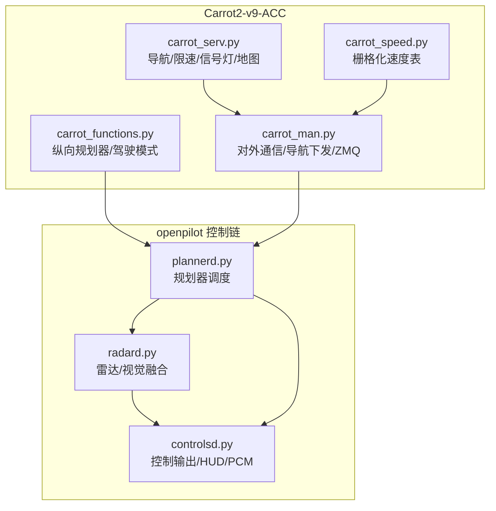
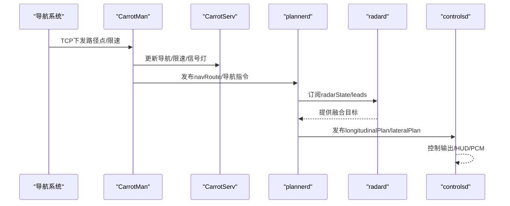
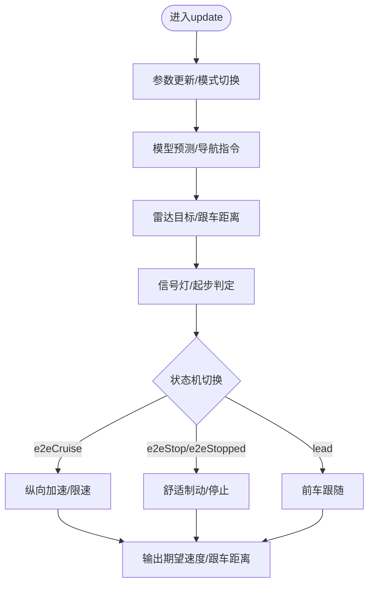
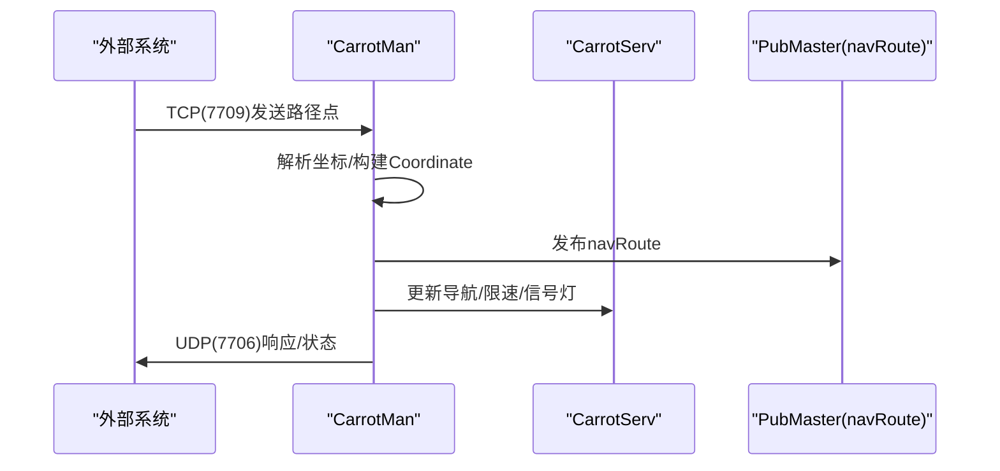
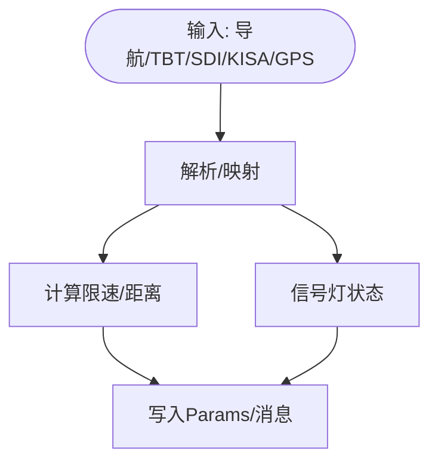
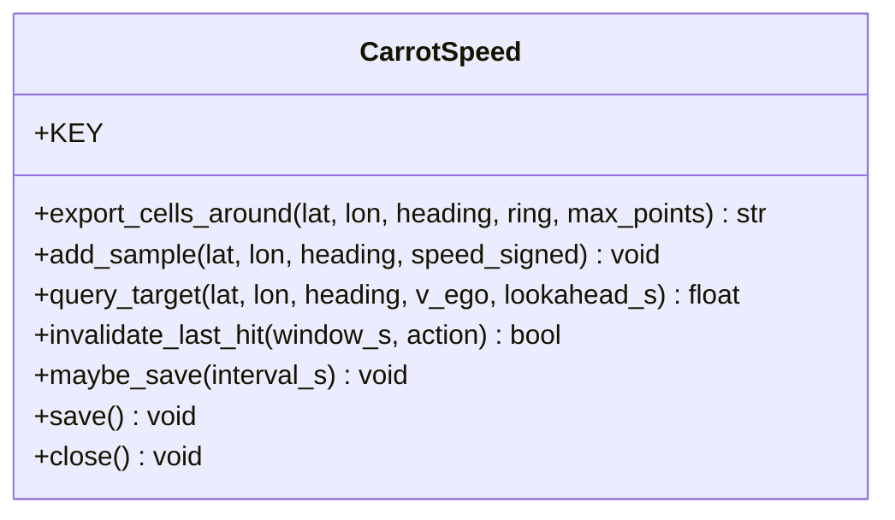
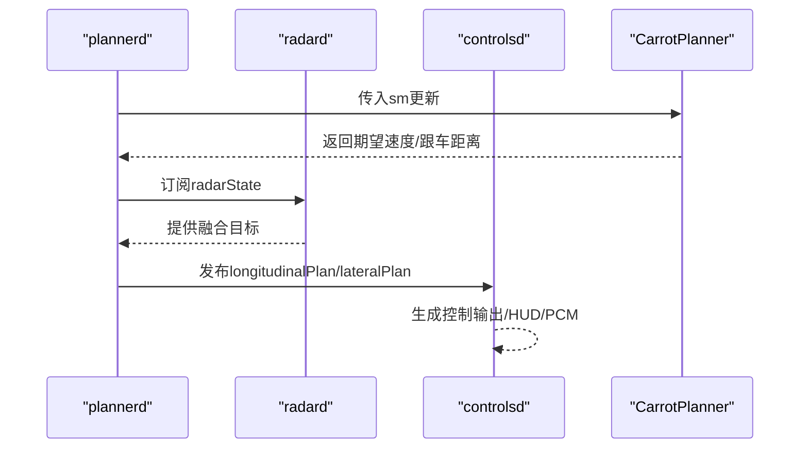
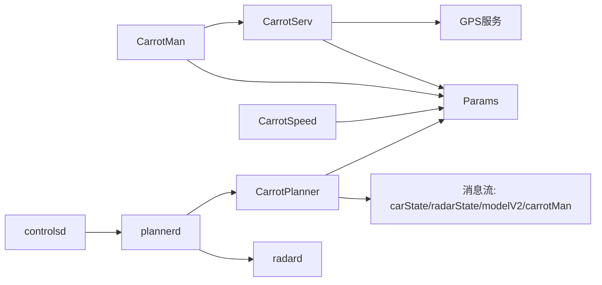

# 集成示例

<cite>
**本文引用的文件**
- [README.md](file://README.md)
- [INTEGRATION.md](file://docs/INTEGRATION.md)
- [carrot_functions.py](file://selfdrive/carrot/carrot_functions.py)
- [carrot_man.py](file://selfdrive/carrot/carrot_man.py)
- [carrot_serv.py](file://selfdrive/carrot/carrot_serv.py)
- [carrot_speed.py](file://selfdrive/carrot/carrot_speed.py)
- [controlsd.py](file://selfdrive/controls/controlsd.py)
- [plannerd.py](file://selfdrive/controls/plannerd.py)
- [radard.py](file://selfdrive/controls/radard.py)
</cite>

## 目录
1. [简介](#简介)
2. [项目结构](#项目结构)
3. [核心组件](#核心组件)
4. [架构总览](#架构总览)
5. [详细组件分析](#详细组件分析)
6. [依赖关系分析](#依赖关系分析)
7. [性能考量](#性能考量)
8. [故障排除指南](#故障排除指南)
9. [结论](#结论)
10. [附录](#附录)

## 简介
本文件面向“Carrot2-v9-ACC集成示例”，提供面向工程落地的完整API文档与集成指南。内容涵盖：
- 系统集成步骤与部署流程
- 参数配置与运行时行为
- 与openpilot各子系统的接口与数据交换
- 第三方系统集成方法、API适配与兼容性处理
- 完整集成示例代码路径、测试用例与故障排除建议
- 集成开发最佳实践、性能优化与安全注意事项

## 项目结构
本仓库为openpilot生态下的扩展功能模块，围绕Carrot2-v9-ACC实现“自适应巡航增强”能力，主要涉及以下目录与文件：
- selfdrive/carrot：Carrot2-v9-ACC核心逻辑与服务
  - carrot_functions.py：纵向规划器与驾驶模式决策
  - carrot_man.py：对外通信、导航下发、ZMQ/UDP服务
  - carrot_serv.py：导航指令解析、GPS融合、限速/信号灯等策略
  - carrot_speed.py：基于Params的栅格化速度表（用于自适应曲线限速）
- selfdrive/controls：openpilot控制链路
  - controlsd.py：控制输出与HUD/PCM交互
  - plannerd.py：纵向/横向规划器调度，接入CarrotPlanner
  - radard.py：雷达/视觉融合跟踪，提供lead目标
- docs/INTEGRATION.md：与原厂功能的集成说明

图表来源
- [carrot_functions.py:49-522](file://selfdrive/carrot/carrot_functions.py#L49-L522)
- [carrot_man.py:204-407](file://selfdrive/carrot/carrot_man.py#L204-L407)
- [carrot_serv.py:83-237](file://selfdrive/carrot/carrot_serv.py#L83-L237)
- [carrot_speed.py:63-402](file://selfdrive/carrot/carrot_speed.py#L63-L402)
- [plannerd.py:13-44](file://selfdrive/controls/plannerd.py#L13-L44)
- [radard.py:386-482](file://selfdrive/controls/radard.py#L386-L482)
- [controlsd.py:38-210](file://selfdrive/controls/controlsd.py#L38-L210)

章节来源
- [README.md:1-144](file://README.md#L1-L144)
- [INTEGRATION.md:1-12](file://docs/INTEGRATION.md#L1-L12)

## 核心组件
- CarrotPlanner（纵向规划器）
  - 负责根据驾驶模式、模型预测、雷达目标与导航指令，计算期望车速与跟车距离，并输出状态机（e2eCruise/e2eStop/lead等）
  - 关键参数：驾驶模式因子、动态跟车时间窗、舒适减速度、eco控制等
- CarrotMan（对外服务）
  - 提供UDP广播、TCP路由接收、ZMQ命令通道、FTP日志上传、KISA数据接收等
  - 与导航系统对接，下发路径点与限速信息
- CarrotServ（导航/限速/信号灯）
  - 解析导航指令（TBT/SDI）、融合GPS/手机GPS、计算自适应转速、处理信号灯检测
- CarrotSpeed（栅格化速度表）
  - 基于Params存储的速度表，支持查询/写入/可视化，用于自适应曲线限速

章节来源
- [carrot_functions.py:49-522](file://selfdrive/carrot/carrot_functions.py#L49-L522)
- [carrot_man.py:204-407](file://selfdrive/carrot/carrot_man.py#L204-L407)
- [carrot_serv.py:83-237](file://selfdrive/carrot/carrot_serv.py#L83-L237)
- [carrot_speed.py:63-402](file://selfdrive/carrot/carrot_speed.py#L63-L402)

## 架构总览
Carrot2-v9-ACC通过plannerd.py接入openpilot纵向/横向规划器，radard.py提供融合后的前车目标，controlsd.py负责最终控制输出与HUD/PCM交互。CarrotMan作为对外服务枢纽，承载导航下发、ZMQ命令、UDP广播等功能。

图表来源
- [carrot_man.py:940-1034](file://selfdrive/carrot/carrot_man.py#L940-L1034)
- [carrot_serv.py:201-237](file://selfdrive/carrot/carrot_serv.py#L201-L237)
- [plannerd.py:25-44](file://selfdrive/controls/plannerd.py#L25-L44)
- [radard.py:476-482](file://selfdrive/controls/radard.py#L476-L482)
- [controlsd.py:246-360](file://selfdrive/controls/controlsd.py#L246-L360)

## 详细组件分析

### CarrotPlanner（纵向规划器）
- 输入：carState、radarState、modelV2、carrotMan、controlsState
- 输出：纵向期望速度、跟车距离、状态机（xState/trafficState）
- 关键逻辑
  - 驾驶模式自动切换（拥堵→安全模式；畅通→普通模式）
  - 动态跟车时间窗与舒适减速度
  - 信号灯/导航指令触发的启停控制
  - eco模式限速控制
- 参数来源：Params（MyDrivingMode、TFollowGapX、DynamicTFollow、CruiseMaxValsX、StopDistanceCarrot、JLeadFactor3、AutoNaviSpeedDecelRate等）

图表来源
- [carrot_functions.py:143-521](file://selfdrive/carrot/carrot_functions.py#L143-L521)

章节来源
- [carrot_functions.py:49-522](file://selfdrive/carrot/carrot_functions.py#L49-L522)

### CarrotMan（对外服务与导航）
- 主要职责
  - UDP广播版本/状态信息
  - TCP路由接收（经纬度序列）
  - ZMQ命令通道（echo_cmd、tmux_send等）
  - FTP日志上传（异常/在途）
  - KISA数据接收（信号灯检测）
- 通信接口
  - UDP广播：端口7705，周期广播
  - UDP接收：端口7706，接收导航/指令
  - TCP路由：端口7709，接收路径点
  - ZMQ：端口7710，请求-响应
- 导航下发
  - 接收路径点后发布navRoute消息
  - 同步导航指令（TBT/SDI）到Params

图表来源
- [carrot_man.py:940-1034](file://selfdrive/carrot/carrot_man.py#L940-L1034)
- [carrot_man.py:320-407](file://selfdrive/carrot/carrot_man.py#L320-L407)
- [carrot_serv.py:201-237](file://selfdrive/carrot/carrot_serv.py#L201-L237)

章节来源
- [carrot_man.py:204-407](file://selfdrive/carrot/carrot_man.py#L204-L407)
- [carrot_man.py:850-921](file://selfdrive/carrot/carrot_man.py#L850-L921)
- [carrot_man.py:940-1034](file://selfdrive/carrot/carrot_man.py#L940-L1034)

### CarrotServ（导航/限速/信号灯）
- 导航指令解析
  - TBT（转向/分岔/环岛等）映射到内部类型
  - SDI（区间测速/信号限速/减速带等）解析与生效
- GPS融合
  - 内部GPS与外部导航/GPS信号融合，估计当前位置与航向
- 自适应转速
  - 基于模型横摆角速度与目标曲率计算限速
- 信号灯检测
  - 基于KISA数据或模型预测进行红绿灯触发

图表来源
- [carrot_serv.py:201-237](file://selfdrive/carrot/carrot_serv.py#L201-L237)
- [carrot_serv.py:336-402](file://selfdrive/carrot/carrot_serv.py#L336-L402)
- [carrot_serv.py:647-722](file://selfdrive/carrot/carrot_serv.py#L647-L722)

章节来源
- [carrot_serv.py:83-237](file://selfdrive/carrot/carrot_serv.py#L83-L237)
- [carrot_serv.py:238-318](file://selfdrive/carrot/carrot_serv.py#L238-L318)
- [carrot_serv.py:319-386](file://selfdrive/carrot/carrot_serv.py#L319-L386)

### CarrotSpeed（栅格化速度表）
- 存储格式：Params键“CarrotSpeedTable”，JSON+gzip，1e-4°栅格，8方向桶
- 查询/写入策略：当前点+左右邻近点，按方向桶写入，支持老化与可视化导出
- 用途：自适应曲线限速，结合模型横摆角速度与目标曲率

图表来源
- [carrot_speed.py:63-402](file://selfdrive/carrot/carrot_speed.py#L63-L402)

章节来源
- [carrot_speed.py:1-402](file://selfdrive/carrot/carrot_speed.py#L1-L402)

### 与openpilot控制链的集成
- plannerd.py
  - 订阅carState/modelV2/radarState等，调度纵向/横向规划器，并将CarrotPlanner注入
- radard.py
  - 提供融合后的leadOne/leadTwo与多路目标集合
- controlsd.py
  - 根据纵向计划与横向计划生成控制输出，更新HUD/PCM，读取carrotMan中的限速/转向提示

图表来源
- [plannerd.py:25-44](file://selfdrive/controls/plannerd.py#L25-L44)
- [radard.py:476-482](file://selfdrive/controls/radard.py#L476-L482)
- [controlsd.py:124-210](file://selfdrive/controls/controlsd.py#L124-L210)

章节来源
- [plannerd.py:13-48](file://selfdrive/controls/plannerd.py#L13-L48)
- [radard.py:386-482](file://selfdrive/controls/radard.py#L386-L482)
- [controlsd.py:38-210](file://selfdrive/controls/controlsd.py#L38-L210)

## 依赖关系分析
- 组件耦合
  - CarrotPlanner依赖Params与消息流（carState/radarState/modelV2/carrotMan）
  - CarrotMan依赖CarrotServ与Params，提供对外通信
  - CarrotServ依赖GPS服务与Params，解析导航/限速/信号灯
  - CarrotSpeed独立于消息流，仅依赖Params
  - plannerd与radard为标准openpilot组件，与CarrotPlanner形成弱耦合注入
- 外部依赖
  - ZMQ（命令通道）
  - UDP/TCP（导航/状态）
  - FTP（日志上传）
  - KISA协议（信号灯检测）

图表来源
- [carrot_functions.py:143-184](file://selfdrive/carrot/carrot_functions.py#L143-L184)
- [carrot_man.py:204-225](file://selfdrive/carrot/carrot_man.py#L204-L225)
- [carrot_serv.py:83-96](file://selfdrive/carrot/carrot_serv.py#L83-L96)
- [carrot_speed.py:86-87](file://selfdrive/carrot/carrot_speed.py#L86-L87)
- [plannerd.py:25-36](file://selfdrive/controls/plannerd.py#L25-L36)
- [radard.py:476-482](file://selfdrive/controls/radard.py#L476-L482)
- [controlsd.py:49-70](file://selfdrive/controls/controlsd.py#L49-L70)

章节来源
- [carrot_functions.py:143-184](file://selfdrive/carrot/carrot_functions.py#L143-L184)
- [carrot_man.py:204-225](file://selfdrive/carrot/carrot_man.py#L204-L225)
- [carrot_serv.py:83-96](file://selfdrive/carrot/carrot_serv.py#L83-L96)
- [carrot_speed.py:86-87](file://selfdrive/carrot/carrot_speed.py#L86-L87)
- [plannerd.py:25-36](file://selfdrive/controls/plannerd.py#L25-L36)
- [radard.py:476-482](file://selfdrive/controls/radard.py#L476-L482)
- [controlsd.py:49-70](file://selfdrive/controls/controlsd.py#L49-L70)

## 性能考量
- 实时性
  - plannerd/controlsd/radard均采用高优先级实时进程，帧率稳定
  - CarrotPlanner参数更新按帧节流（params_count），避免频繁读取Params
- 计算复杂度
  - CarrotSpeed查询/写入为常数级（栅格+方向桶），适合高频调用
  - CarrotServ的GPS融合与曲率限速计算为轻量级
- I/O与存储
  - Params读写为内存级访问，建议批量/节流写入
  - CarrotSpeed支持gzip压缩与定时保存，降低磁盘压力

## 故障排除指南
- 无法接收导航路径
  - 检查TCP端口7709是否正常监听与接收
  - 确认路径点格式与长度字段正确
  - 参考：[carrot_man.py:965-1034](file://selfdrive/carrot/carrot_man.py#L965-L1034)
- UDP广播未生效
  - 确认广播IP与端口7705
  - 检查网络接口与防火墙
  - 参考：[carrot_man.py:320-407](file://selfdrive/carrot/carrot_man.py#L320-L407)
- ZMQ命令无响应
  - 确认端口7710与请求格式
  - 检查echo_cmd执行权限与返回编码
  - 参考：[carrot_man.py:850-921](file://selfdrive/carrot/carrot_man.py#L850-L921)
- 信号灯误判
  - 检查KISA数据格式与频率
  - 调整autoNaviSpeedSafetyFactor等参数
  - 参考：[carrot_serv.py:238-318](file://selfdrive/carrot/carrot_serv.py#L238-L318)
- 日志上传失败
  - 检查FTP凭据与网络连通性
  - 参考：[carrot_man.py:777-822](file://selfdrive/carrot/carrot_man.py#L777-L822)

章节来源
- [carrot_man.py:777-822](file://selfdrive/carrot/carrot_man.py#L777-L822)
- [carrot_man.py:850-921](file://selfdrive/carrot/carrot_man.py#L850-L921)
- [carrot_man.py:965-1034](file://selfdrive/carrot/carrot_man.py#L965-L1034)
- [carrot_serv.py:238-318](file://selfdrive/carrot/carrot_serv.py#L238-L318)

## 结论
Carrot2-v9-ACC通过清晰的模块划分与openpilot标准消息总线实现了与原厂功能的无缝集成。其对外服务（CarrotMan）提供了丰富的通信接口，便于第三方系统对接；内部算法（CarrotPlanner/CarrotServ/CarrotSpeed）具备良好的可配置性与可维护性。遵循本文档的集成步骤与最佳实践，可在保证安全与稳定的前提下快速完成部署与优化。

## 附录

### 集成步骤与部署流程
- 准备阶段
  - 确认硬件与设备支持（参见README中的法律与硬件说明）
  - 安装openpilot并确保各进程正常运行
- 配置参数
  - 驾驶模式与跟车策略：MyDrivingMode、TFollowGapX、DynamicTFollow、CruiseMaxValsX、StopDistanceCarrot、JLeadFactor3、AutoNaviSpeedDecelRate
  - 导航/限速/信号灯：AutoNaviSpeedBumpSpeed、AutoNaviSpeedCtrlMode、AutoNaviSpeedSafetyFactor、TurnSpeedControlMode、MapTurnSpeedFactor、AutoTurnControlSpeedTurn、AutoCurveSpeedFactor、AutoCurveSpeedAggressiveness
  - 参考：[carrot_functions.py:143-184](file://selfdrive/carrot/carrot_functions.py#L143-L184)、[carrot_serv.py:201-237](file://selfdrive/carrot/carrot_serv.py#L201-L237)
- 部署与启动
  - 启动plannerd/controlsd/radard
  - 启动CarrotMan（包含UDP/TCP/ZMQ/FTP/KISA线程）
  - 通过TCP端口7709下发导航路径，或通过UDP端口7706接收导航/指令
  - 参考：[plannerd.py:13-48](file://selfdrive/controls/plannerd.py#L13-L48)、[controlsd.py:361-378](file://selfdrive/controls/controlsd.py#L361-L378)、[carrot_man.py:1097-1115](file://selfdrive/carrot/carrot_man.py#L1097-L1115)

### 与其他openpilot组件的集成方式
- 与原厂功能
  - 在支持的车型上，原厂LKA/LDW被替换为openpilot对应功能；原厂ACC被openpilot ACC替代（参见INTEGRATION.md）
  - 参考：[INTEGRATION.md:1-12](file://docs/INTEGRATION.md#L1-L12)
- 与radard
  - plannerd订阅radarState/leads，CarrotPlanner据此计算期望速度与跟车距离
  - 参考：[plannerd.py:25-44](file://selfdrive/controls/plannerd.py#L25-L44)、[radard.py:476-482](file://selfdrive/controls/radard.py#L476-L482)
- 与controlsd
  - controlsd根据纵向/横向计划生成控制输出，读取carrotMan中的限速/转向提示
  - 参考：[controlsd.py:124-210](file://selfdrive/controls/controlsd.py#L124-L210)

### 第三方系统集成方法
- API适配
  - TCP 7709：下发路径点（经纬度序列）
  - UDP 7706：接收导航/指令（JSON）
  - ZMQ 7710：命令请求（echo_cmd/tmux_send）
  - UDP 7705：状态广播
  - FTP：异常/在途日志上传
  - 参考：[carrot_man.py:320-407](file://selfdrive/carrot/carrot_man.py#L320-L407)、[carrot_man.py:850-921](file://selfdrive/carrot/carrot_man.py#L850-L921)、[carrot_man.py:940-1034](file://selfdrive/carrot/carrot_man.py#L940-L1034)
- 兼容性处理
  - 对外接口采用异步/非阻塞设计，避免影响主控制循环
  - 参数化配置，便于不同场景快速切换

### 测试用例与验证
- 单元测试参考
  - openpilot通用测试框架（pytest）与工具集
  - 参考：[README.md:111-121](file://README.md#L111-L121)
- 集成测试建议
  - 路径下发与导航显示一致性验证（TCP 7709）
  - 信号灯检测与启停响应（UDP 7706/KISA）
  - ZMQ命令执行与返回（ZMQ 7710）
  - FTP上传成功与日志完整性（异常/在途）

### 最佳实践与安全考虑
- 最佳实践
  - 参数变更采用节流写入（Params），避免频繁I/O
  - 对外接口增加超时与重试机制
  - 使用ZMQ REQ/REP模式保证命令幂等性
- 安全考虑
  - 严格校验外部输入（路径点/指令）格式与范围
  - 限制FTP凭据与网络访问权限
  - 法律合规：严格遵守当地法律法规，仅用于研究/实验/仿真目的