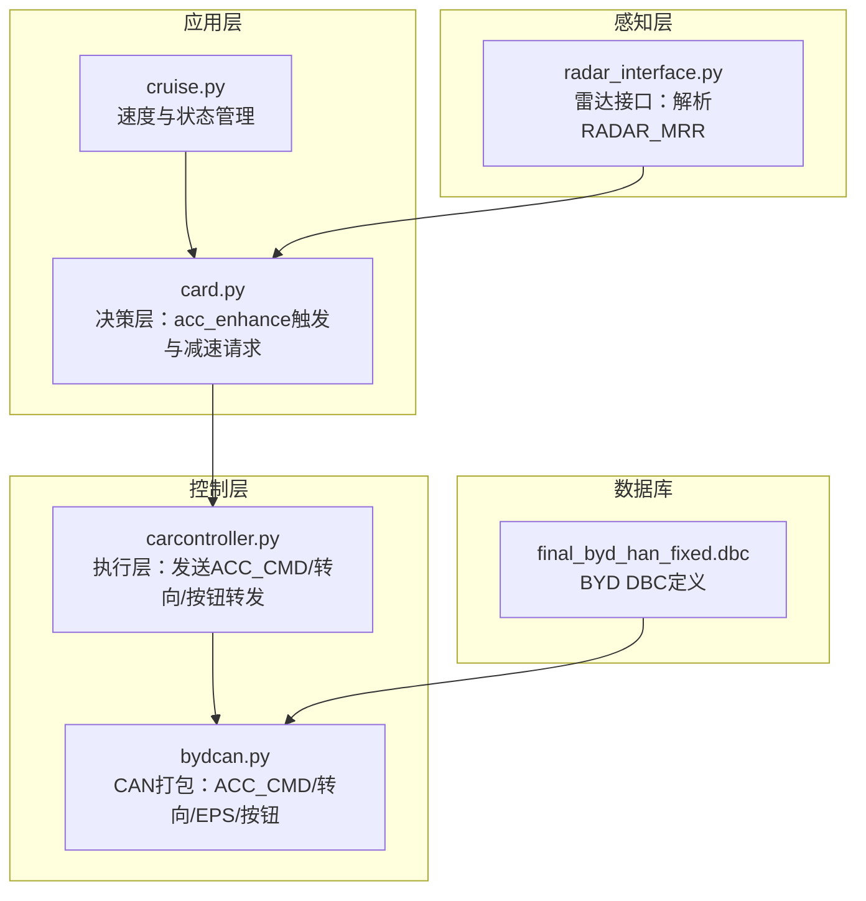
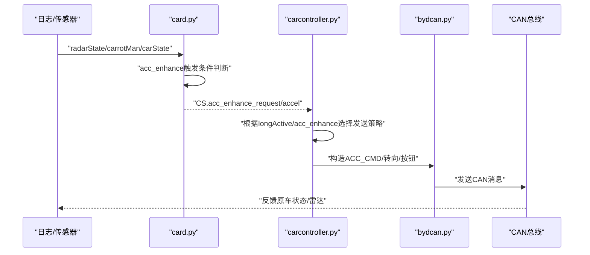
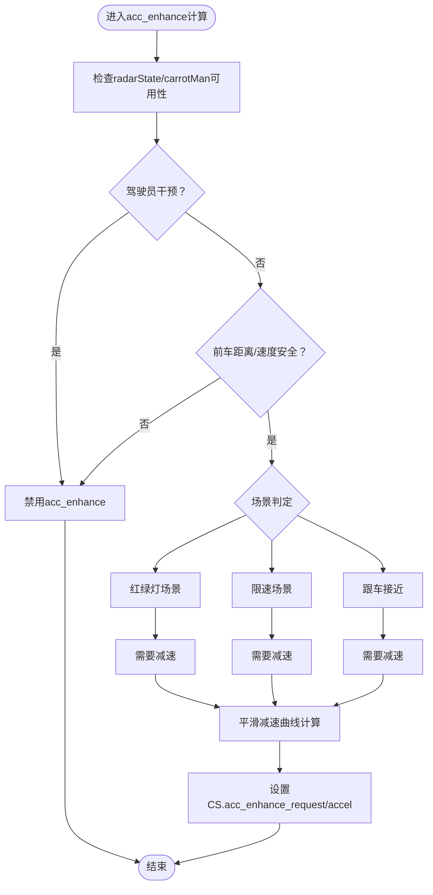
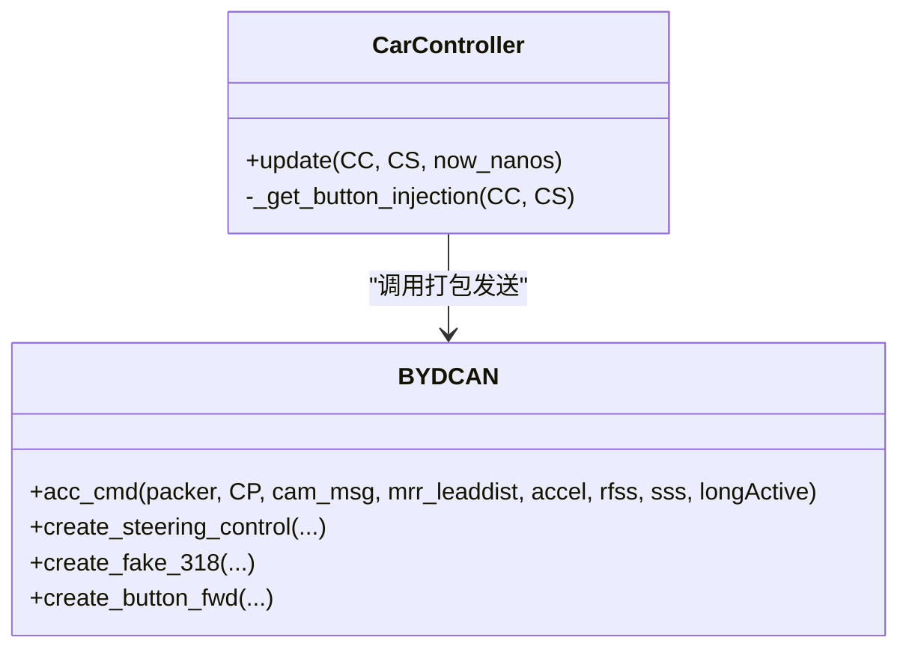
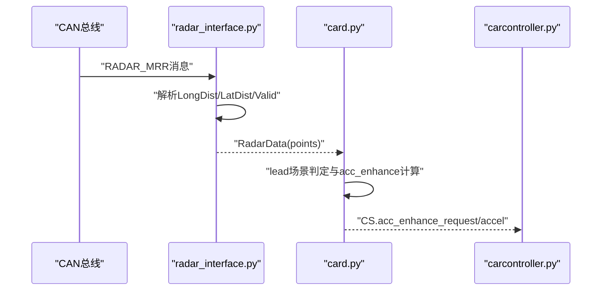
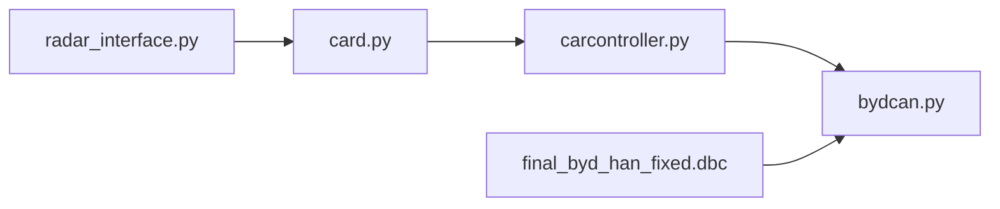

# BYD集成模块

<cite>
**本文引用的文件**
- [byd_acc_analysis_guide.md](file://docs/byd_acc_analysis_guide.md)
- [byd_radar_integration.md](file://docs/byd_radar_integration.md)
- [byd_radar_vehicle_control.md](file://docs/byd_radar_vehicle_control.md)
- [card.py](file://selfdrive/car/card.py)
- [carcontroller.py](file://opendbc_repo/opendbc/car/byd/carcontroller.py)
- [bydcan.py](file://opendbc_repo/opendbc/car/byd/bydcan.py)
- [radar_interface.py](file://opendbc_repo/opendbc/car/byd/radar_interface.py)
- [cruise.py](file://selfdrive/car/cruise.py)
- [final_byd_han_fixed.dbc](file://final_byd_han_fixed.dbc)
- [byd_radar_analysis_complete_report.md](file://tools/byd_radar_analysis_complete_report.md)
- [byd_dbc_validation_final_report.md](file://byd_dbc_validation_final_report.md)
- [原车acc增强系统设计.md](file://原车acc增强系统设计.md)
- [原车acc增强系统重构文档.md](file://原车acc增强系统重构文档.md)
</cite>

## 目录
1. [简介](#简介)
2. [项目结构](#项目结构)
3. [核心组件](#核心组件)
4. [架构总览](#架构总览)
5. [详细组件分析](#详细组件分析)
6. [依赖关系分析](#依赖关系分析)
7. [性能考量](#性能考量)
8. [故障排查指南](#故障排查指南)
9. [结论](#结论)
10. [附录](#附录)

## 简介
本文件面向BYD集成模块的工程师与使用者，系统化阐述CAN总线信号解析、ACC增强机制、车辆控制策略（制动/加速/转向）、雷达数据处理与车辆状态监测，并结合OpenDBC数据库的集成关系给出可操作的配置、参数与返回值说明。文档兼顾初学者易读性与资深开发者的深度需求，提供流程图、类图与序列图帮助理解。

## 项目结构
本仓库围绕BYD车辆的纵向控制增强（acc_enhance）、雷达数据解析与DBC集成展开，核心涉及：
- 文档与分析：BYD ACC分析指南、雷达集成与控制应用、雷达分析报告
- 控制核心：card.py（决策层）、carcontroller.py（执行层）、bydcan.py（CAN打包）
- 雷达接口：radar_interface.py（雷达解析）
- 巡航与状态：cruise.py（速度与状态管理）
- DBC与验证：final_byd_han_fixed.dbc、byd_radar_analysis_complete_report.md、byd_dbc_validation_final_report.md

**图表来源**
- [card.py:278-384](file://selfdrive/car/card.py#L278-L384)
- [carcontroller.py:53-243](file://opendbc_repo/opendbc/car/byd/carcontroller.py#L53-L243)
- [bydcan.py:75-137](file://opendbc_repo/opendbc/car/byd/bydcan.py#L75-L137)
- [radar_interface.py:21-55](file://opendbc_repo/opendbc/car/byd/radar_interface.py#L21-L55)
- [final_byd_han_fixed.dbc:162-178](file://final_byd_han_fixed.dbc#L162-L178)

**章节来源**
- [byd_acc_analysis_guide.md:1-260](file://docs/byd_acc_analysis_guide.md#L1-L260)
- [byd_radar_integration.md:1-149](file://docs/byd_radar_integration.md#L1-L149)
- [byd_radar_vehicle_control.md:1-407](file://docs/byd_radar_vehicle_control.md#L1-L407)

## 核心组件
- 决策层（card.py）：基于导航限速、红绿灯、跟车接近等场景计算acc_enhance请求与目标加速度，写入CarState供执行层使用。
- 执行层（carcontroller.py + bydcan.py）：根据longActive或acc_enhance状态，构造并发送ACC_CMD、转向指令与按钮转发，同时处理刹车增强与舒适性控制。
- 雷达接口（radar_interface.py）：解析RADAR_MRR消息，输出RadarData供上层使用。
- 巡航与状态（cruise.py）：管理目标速度、按钮事件、软保持与自动巡航逻辑。
- DBC（final_byd_han_fixed.dbc）：提供ACC_CMD等消息的信号定义与校验规则。

**章节来源**
- [card.py:291-384](file://selfdrive/car/card.py#L291-L384)
- [carcontroller.py:145-203](file://opendbc_repo/opendbc/car/byd/carcontroller.py#L145-L203)
- [bydcan.py:75-137](file://opendbc_repo/opendbc/car/byd/bydcan.py#L75-L137)
- [radar_interface.py:21-55](file://opendbc_repo/opendbc/car/byd/radar_interface.py#L21-L55)
- [cruise.py:282-383](file://selfdrive/car/cruise.py#L282-L383)
- [final_byd_han_fixed.dbc:162-178](file://final_byd_han_fixed.dbc#L162-L178)

## 架构总览
BYD集成采用“原车ACC + openpilot纵向增强”的混合控制策略：
- openpilotLongitudinalControl关闭，使用原车ACC系统；
- card.py在满足条件时生成acc_enhance请求与目标加速度；
- carcontroller.py根据longActive或acc_enhance状态发送ACC_CMD；
- radar_interface.py提供雷达状态，支撑决策与安全控制。

**图表来源**
- [card.py:278-384](file://selfdrive/car/card.py#L278-L384)
- [carcontroller.py:145-203](file://opendbc_repo/opendbc/car/byd/carcontroller.py#L145-L203)
- [bydcan.py:75-137](file://opendbc_repo/opendbc/car/byd/bydcan.py#L75-L137)

## 详细组件分析

### ACC增强机制（按键模式增强）
- 触发条件：BYD品牌、原车ACC开启、无驾驶员干预、radarState与carrotMan可用。
- 场景判定：
  - 红绿灯场景：radarState无近距离前车时减速；
  - 弯道限速/导航限速：当vEgo超过限速时按平滑曲线减速；
  - 跟车接近：dRel较小且相对速度为负时按速度比例减速。
- 滞后与退出策略：激活后保持最小减速，退出时限制AccelCmd为非正值，避免与原车ACC冲突。
- 参数与返回值：
  - 返回CS.acc_enhance_request（bool）与CS.acc_enhance_accel（float，m/s²）。

**图表来源**
- [card.py:291-384](file://selfdrive/car/card.py#L291-L384)
- [byd_acc_analysis_guide.md:83-161](file://docs/byd_acc_analysis_guide.md#L83-L161)

**章节来源**
- [card.py:291-384](file://selfdrive/car/card.py#L291-L384)
- [byd_acc_analysis_guide.md:83-161](file://docs/byd_acc_analysis_guide.md#L83-L161)
- [原车acc增强系统设计.md:938-978](file://原车acc增强系统设计.md#L938-L978)

### ACC_CMD发送与刹车增强（执行层）
- 发送时机：当acc_enhance激活、退出或原车ACC接管时。
- ACC_CMD字段：AccelCmd、ComfortBand、JerkLimit、ResumeFromStandstill、StandstillState、AccControlActive、AccReqNotStandstill、Counter、Checksum等。
- 刹车增强策略：
  - 三段式舒适性控制：轻-重-轻，结合速度差与舒适等级动态调节；
  - 场景增益：弯道、限速、跟车接近分别采用不同增益；
  - 平滑处理与安全限制，避免突变与超限。

**图表来源**
- [carcontroller.py:53-243](file://opendbc_repo/opendbc/car/byd/carcontroller.py#L53-L243)
- [bydcan.py:75-137](file://opendbc_repo/opendbc/car/byd/bydcan.py#L75-L137)

**章节来源**
- [carcontroller.py:145-203](file://opendbc_repo/opendbc/car/byd/carcontroller.py#L145-L203)
- [bydcan.py:75-137](file://opendbc_repo/opendbc/car/byd/bydcan.py#L75-L137)
- [原车acc增强系统设计.md:2342-2511](file://原车acc增强系统设计.md#L2342-L2511)

### 雷达数据解析与车辆状态监测
- 原始雷达数据：RADAR_MRR消息（地址0x374）包含目标索引、纵向/横向距离、相对速度、有效性等。
- 接口实现：radar_interface.py解析RADAR_MRR，填充RadarData.RadarPoint（dRel/yRel/vRel/aRel等），并维护目标跟踪。
- 车辆状态监测：结合radarState与CarState，监控前车距离、相对速度、自车速度与加速度，作为ACC与FCW的基础。

**图表来源**
- [radar_interface.py:21-55](file://opendbc_repo/opendbc/car/byd/radar_interface.py#L21-L55)
- [card.py:304-367](file://selfdrive/car/card.py#L304-L367)

**章节来源**
- [radar_interface.py:21-55](file://opendbc_repo/opendbc/car/byd/radar_interface.py#L21-L55)
- [byd_radar_integration.md:18-94](file://docs/byd_radar_integration.md#L18-L94)
- [byd_radar_vehicle_control.md:33-90](file://docs/byd_radar_vehicle_control.md#L33-L90)

### 巡航与速度管理（cruise.py）
- 速度来源：优先使用原车ACC速度；支持按钮/手势/导航命令更新目标速度；
- 自动巡航：根据导航限速、前车距离、交通状态等自动启停与速度调整；
- 参数与行为：支持多种按钮模式、长按加速/减速、软保持、自动提速至限速等。

**章节来源**
- [cruise.py:282-383](file://selfdrive/car/cruise.py#L282-L383)
- [cruise.py:502-633](file://selfdrive/car/cruise.py#L502-L633)

### OpenDBC数据库集成与验证
- ACC_CMD DBC定义：包含AccelCmd、ComfortBand、JerkLimit、Counter、Checksum等字段；
- 雷达DBC定义：RADAR_MRR与原始雷达目标消息（0x520-0x547）；
- 验证报告：对距离/速度/角度解码公式进行统计分析，提出修正建议（系统偏差、零速准确率等）。

**章节来源**
- [final_byd_han_fixed.dbc:162-178](file://final_byd_han_fixed.dbc#L162-L178)
- [byd_radar_analysis_complete_report.md:48-99](file://tools/byd_radar_analysis_complete_report.md#L48-L99)
- [byd_dbc_validation_final_report.md:1-58](file://byd_dbc_validation_final_report.md#L1-L58)

## 依赖关系分析
- 决策层依赖感知层（radarState）与导航数据（carrotMan），并向执行层输出控制请求；
- 执行层依赖bydcan的CAN打包能力，发送ACC_CMD与转向/按钮消息；
- DBC定义为CAN消息提供信号语义与校验规则，确保跨模块一致性。

**图表来源**
- [card.py:278-384](file://selfdrive/car/card.py#L278-L384)
- [carcontroller.py:53-243](file://opendbc_repo/opendbc/car/byd/carcontroller.py#L53-L243)
- [bydcan.py:75-137](file://opendbc_repo/opendbc/car/byd/bydcan.py#L75-L137)
- [radar_interface.py:21-55](file://opendbc_repo/opendbc/car/byd/radar_interface.py#L21-L55)
- [final_byd_han_fixed.dbc:162-178](file://final_byd_han_fixed.dbc#L162-L178)

**章节来源**
- [card.py:278-384](file://selfdrive/car/card.py#L278-L384)
- [carcontroller.py:53-243](file://opendbc_repo/opendbc/car/byd/carcontroller.py#L53-L243)
- [bydcan.py:75-137](file://opendbc_repo/opendbc/car/byd/bydcan.py#L75-L137)
- [radar_interface.py:21-55](file://opendbc_repo/opendbc/car/byd/radar_interface.py#L21-L55)
- [final_byd_han_fixed.dbc:162-178](file://final_byd_han_fixed.dbc#L162-L178)

## 性能考量
- CAN消息频率与带宽：确保ACC_CMD与转向消息在周期内稳定发送，避免丢帧；
- 雷达数据处理：RADAR_MRR解析需在实时性要求内完成，必要时引入缓存与去抖；
- 控制平滑性：刹车三段式与加加速度限制减少乘客不适，提升系统鲁棒性；
- DBC校准：针对系统偏差与零速偏移进行修正，提高感知精度。

[本节为通用指导，无需特定文件引用]

## 故障排查指南
- 减速不及时
  - 检查carrotMan导航限速是否有效（0-200），确认CS.cruiseState.enabled与无驾驶员干预；
  - 检查radarState前车距离是否触发禁用条件（dRel过近/快速接近）。
- ACC_CMD未发送
  - 确认acc_enhance_request/acc_enhance_active状态；
  - 核对CAN地址0x32E（ACC_CMD）与字段拼装逻辑。
- 减速效果不明显
  - 对比实际车速变化与ACC_CMD加速度值；
  - 检查是否存在坡道/风阻等外部因素影响。
- DBC解码异常
  - 参考验证报告的系统偏差与零速偏移修正建议；
  - 校准距离/速度/角度解码公式并重新验证。

**章节来源**
- [byd_acc_analysis_guide.md:162-185](file://docs/byd_acc_analysis_guide.md#L162-L185)
- [byd_dbc_validation_final_report.md:36-58](file://byd_dbc_validation_final_report.md#L36-L58)

## 结论
BYD集成模块通过“原车ACC + openpilot纵向增强”实现了安全可控的纵向控制：card.py负责场景化减速请求，carcontroller.py与bydcan确保ACC_CMD与转向/按钮的可靠发送，radar_interface提供稳定的雷达状态输入。配合OpenDBC的DBC定义与验证，系统在可接受范围内实现了平滑、安全的纵向控制与雷达感知。

[本节为总结性内容，无需特定文件引用]

## 附录

### 配置选项与参数
- ACC增强参数（来源于决策层配置字典）：
  - lead_dist_critical：前车距离临界值（m）
  - lead_dist_caution：前车距离注意值（m）
  - traffic_light_distance：红绿灯减速距离阈值（m）
  - brake_accel_min：最大减速限制（m/s²）
  - decel_k_base/sqrt/quad：平滑减速曲线系数
- 刹车增强参数（来源于刹车算法）：
  - 舒适等级、Ramp时间、Ramp阈值、保持阶段增益与限制等

**章节来源**
- [card.py:292-300](file://selfdrive/car/card.py#L292-L300)
- [原车acc增强系统设计.md:2342-2511](file://原车acc增强系统设计.md#L2342-L2511)

### 返回值与接口摘要
- ACC_CMD字段（示例）：
  - AccelCmd：加速度指令（m/s²）
  - AccControlActive：ACC控制激活标志
  - JerkUpperLimit/JerkLowerLimit：加加速度上下限
  - Counter/Checksum：消息计数与校验
- RadarData.RadarPoint字段（示例）：
  - dRel：纵向距离（m）
  - yRel：横向距离（m）
  - vRel：相对速度（m/s）
  - measured：测量有效标志
  - trackId：目标跟踪ID

**章节来源**
- [final_byd_han_fixed.dbc:162-178](file://final_byd_han_fixed.dbc#L162-L178)
- [byd_radar_vehicle_control.md:9-19](file://docs/byd_radar_vehicle_control.md#L9-L19)