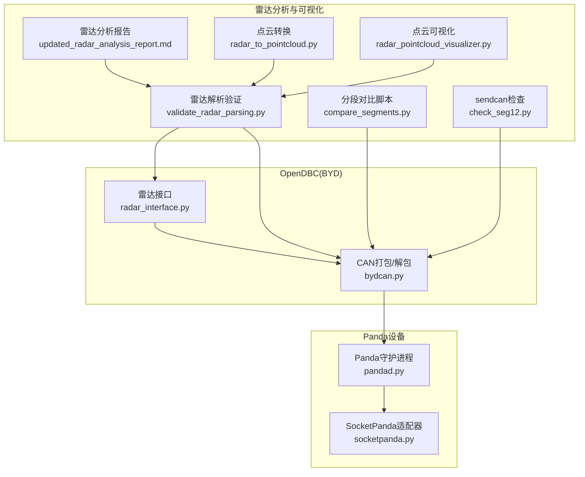
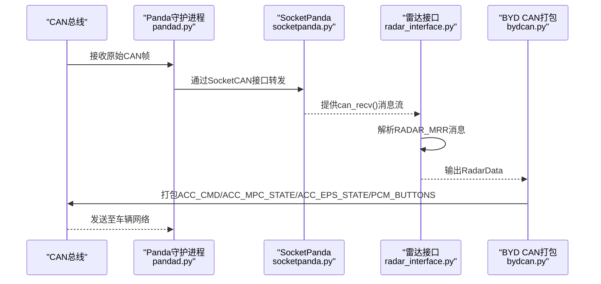
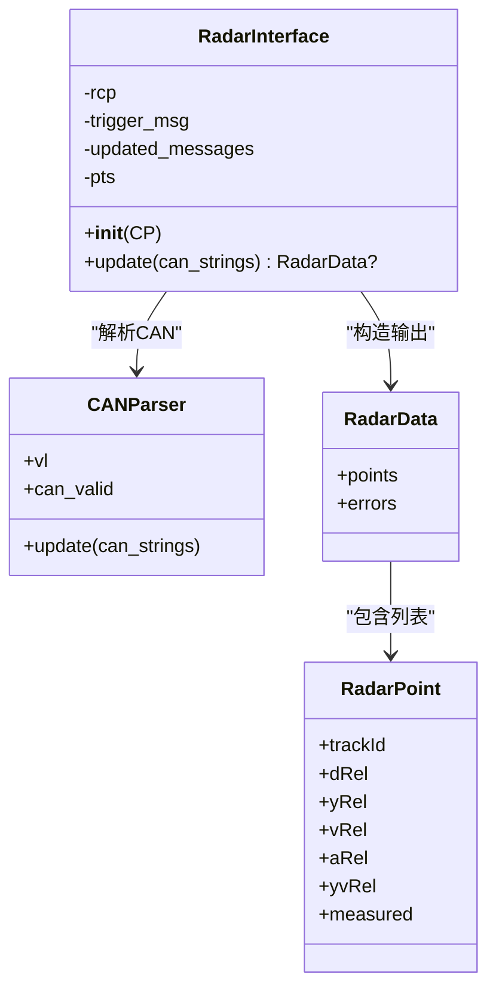
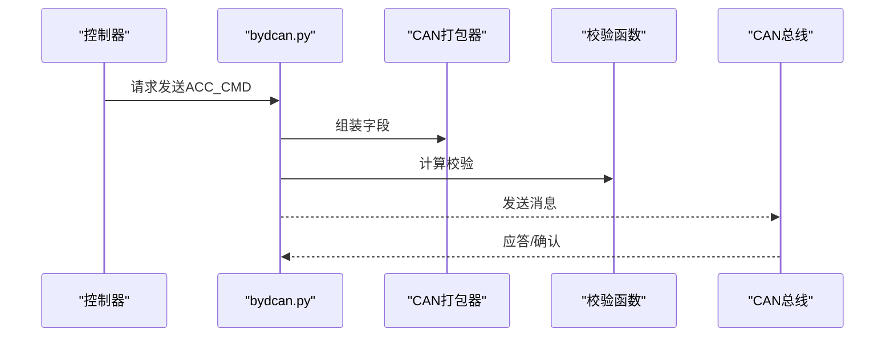
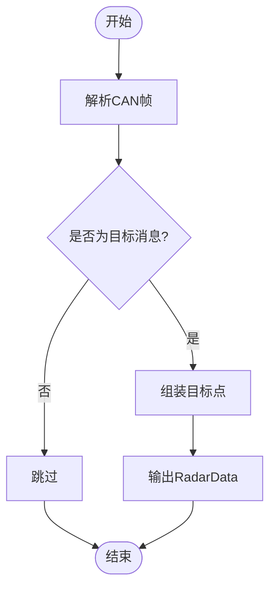
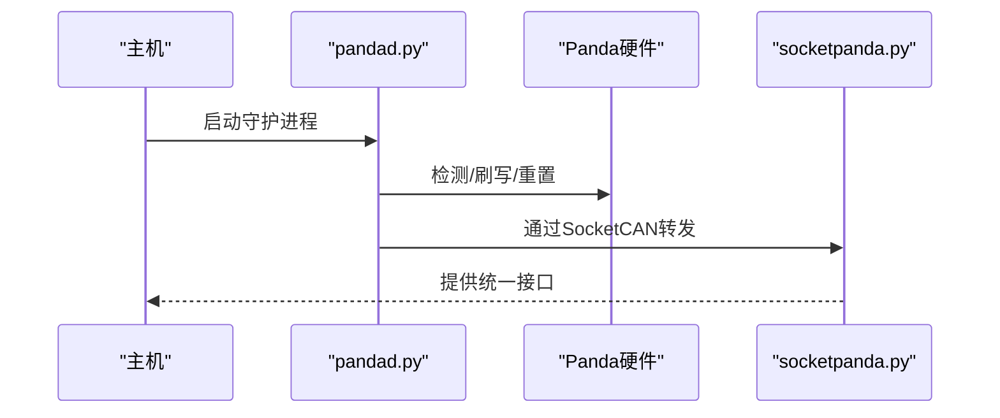
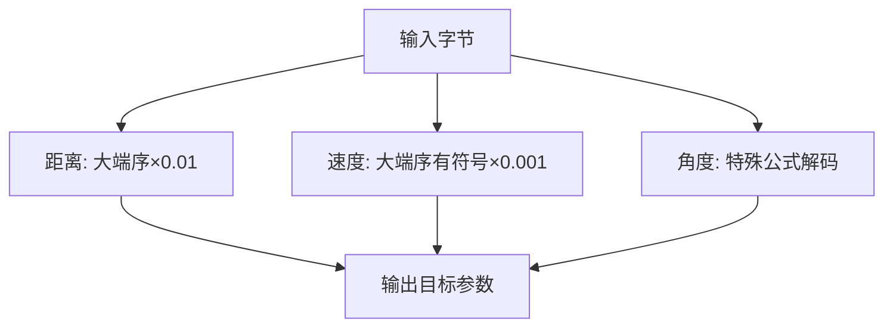
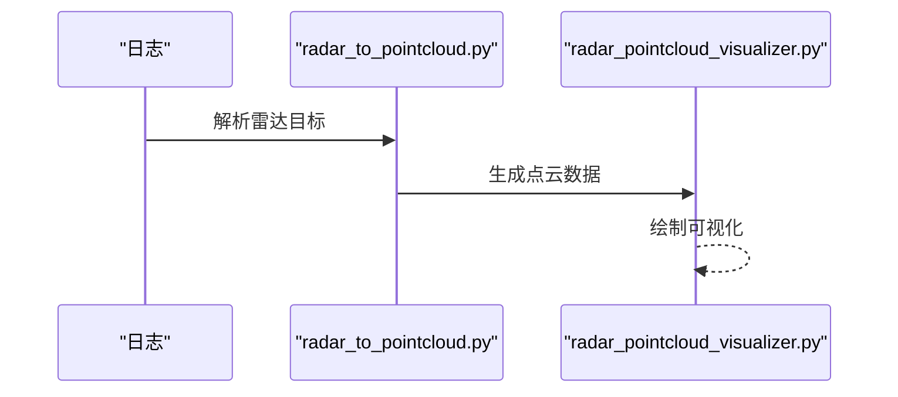
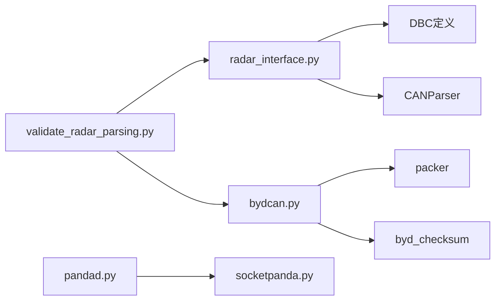

# CAN总线通信接口

<cite>
**本文引用的文件**
- [opendbc_repo/opendbc/car/byd/radar_interface.py](file://opendbc_repo/opendbc/car/byd/radar_interface.py)
- [opendbc_repo/opendbc/car/byd/bydcan.py](file://opendbc_repo/opendbc/car/byd/bydcan.py)
- [selfdrive/pandad/pandad.py](file://selfdrive/pandad/pandad.py)
- [panda/python/socketpanda.py](file://panda/python/socketpanda.py)
- [validate_radar_parsing.py](file://validate_radar_parsing.py)
- [updated_radar_analysis_report.md](file://updated_radar_analysis_report.md)
- [comprehensive_radar_analysis.py](file://comprehensive_radar_analysis.py)
- [check_seg12.py](file://check_seg12.py)
- [compare_segments.py](file://compare_segments.py)
- [byd_dbc_validation_final_report.md](file://byd_dbc_validation_final_report.md)
- [radar_to_pointcloud.py](file://radar_to_pointcloud.py)
- [radar_pointcloud_visualizer.py](file://radar_pointcloud_visualizer.py)
</cite>

## 目录
1. [引言](#引言)
2. [项目结构](#项目结构)
3. [核心组件](#核心组件)
4. [架构总览](#架构总览)
5. [详细组件分析](#详细组件分析)
6. [依赖关系分析](#依赖关系分析)
7. [性能考虑](#性能考虑)
8. [故障排查指南](#故障排查指南)
9. [结论](#结论)
10. [附录](#附录)

## 引言
本文件面向BYD车辆的CAN总线通信接口，围绕雷达数据解析、信号值转换、数据完整性验证、雷达接口类实现、CAN消息收发流程、与Panda设备交互以及与其他系统组件的数据交换进行系统化说明。文档基于仓库中的实际代码与分析脚本，提供可追溯的来源路径，并辅以图示帮助理解。

## 项目结构
与BYD CAN通信相关的关键位置如下：
- 雷达接口与CAN打包/解包逻辑位于 opendbc 的 BYD 车型目录
- Panda 设备固件更新与连接管理位于 selfdrive/pandad
- Panda 本地SocketCAN适配器位于 panda/python
- 雷达数据解析与验证脚本位于根目录工具集合
- 雷达可视化与点云转换工具位于根目录

**图表来源**
- [opendbc_repo/opendbc/car/byd/radar_interface.py:1-56](file://opendbc_repo/opendbc/car/byd/radar_interface.py#L1-L56)
- [opendbc_repo/opendbc/car/byd/bydcan.py:1-198](file://opendbc_repo/opendbc/car/byd/bydcan.py#L1-L198)
- [selfdrive/pandad/pandad.py:1-180](file://selfdrive/pandad/pandad.py#L1-L180)
- [panda/python/socketpanda.py:1-95](file://panda/python/socketpanda.py#L1-L95)
- [validate_radar_parsing.py:1-120](file://validate_radar_parsing.py#L1-L120)
- [updated_radar_analysis_report.md:1-47](file://updated_radar_analysis_report.md#L1-L47)
- [compare_segments.py:1-60](file://compare_segments.py#L1-L60)
- [check_seg12.py:1-80](file://check_seg12.py#L1-L80)
- [radar_to_pointcloud.py:1-120](file://radar_to_pointcloud.py#L1-L120)
- [radar_pointcloud_visualizer.py:1-120](file://radar_pointcloud_visualizer.py#L1-L120)

**章节来源**
- [opendbc_repo/opendbc/car/byd/radar_interface.py:1-56](file://opendbc_repo/opendbc/car/byd/radar_interface.py#L1-L56)
- [opendbc_repo/opendbc/car/byd/bydcan.py:1-198](file://opendbc_repo/opendbc/car/byd/bydcan.py#L1-L198)
- [selfdrive/pandad/pandad.py:1-180](file://selfdrive/pandad/pandad.py#L1-L180)
- [panda/python/socketpanda.py:1-95](file://panda/python/socketpanda.py#L1-L95)
- [validate_radar_parsing.py:1-120](file://validate_radar_parsing.py#L1-L120)
- [updated_radar_analysis_report.md:1-47](file://updated_radar_analysis_report.md#L1-L47)
- [compare_segments.py:1-60](file://compare_segments.py#L1-L60)
- [check_seg12.py:1-80](file://check_seg12.py#L1-L80)
- [radar_to_pointcloud.py:1-120](file://radar_to_pointcloud.py#L1-L120)
- [radar_pointcloud_visualizer.py:1-120](file://radar_pointcloud_visualizer.py#L1-L120)

## 核心组件
- 雷达接口类：负责解析RADAR_MRR消息，构建RadarData并输出目标点
- BYD CAN打包器：封装ACC_CMD、ACC_MPC_STATE、ACC_EPS_STATE、PCM_BUTTONS等消息，含校验计算
- Panda守护进程：自动检测、刷写、健康检查与重启，确保设备可用
- SocketPanda适配器：提供SocketCAN风格的发送/接收接口，便于在无Panda硬件时仿真
- 雷达解析验证与可视化：提供多版本解析方法对比、统计与可视化输出

**章节来源**
- [opendbc_repo/opendbc/car/byd/radar_interface.py:8-56](file://opendbc_repo/opendbc/car/byd/radar_interface.py#L8-L56)
- [opendbc_repo/opendbc/car/byd/bydcan.py:9-198](file://opendbc_repo/opendbc/car/byd/bydcan.py#L9-L198)
- [selfdrive/pandad/pandad.py:64-180](file://selfdrive/pandad/pandad.py#L64-L180)
- [panda/python/socketpanda.py:47-95](file://panda/python/socketpanda.py#L47-L95)
- [validate_radar_parsing.py:39-108](file://validate_radar_parsing.py#L39-L108)

## 架构总览
下图展示了从CAN消息采集到雷达目标输出的整体链路，以及与Panda设备的交互：

**图表来源**
- [selfdrive/pandad/pandad.py:160-180](file://selfdrive/pandad/pandad.py#L160-L180)
- [panda/python/socketpanda.py:77-95](file://panda/python/socketpanda.py#L77-L95)
- [opendbc_repo/opendbc/car/byd/radar_interface.py:21-56](file://opendbc_repo/opendbc/car/byd/radar_interface.py#L21-L56)
- [opendbc_repo/opendbc/car/byd/bydcan.py:75-138](file://opendbc_repo/opendbc/car/byd/bydcan.py#L75-L138)

## 详细组件分析

### 雷达接口类（RadarInterface）
职责与流程：
- 初始化：根据配置选择是否启用雷达解析；注册RADAR_MRR消息（周期约60Hz）
- 触发条件：等待特定触发消息到达后才生成雷达数据
- 数据构建：提取目标ID、纵向距离、横向距离，构造RadarPoint并返回RadarData

**图表来源**
- [opendbc_repo/opendbc/car/byd/radar_interface.py:8-56](file://opendbc_repo/opendbc/car/byd/radar_interface.py#L8-L56)

**章节来源**
- [opendbc_repo/opendbc/car/byd/radar_interface.py:8-56](file://opendbc_repo/opendbc/car/byd/radar_interface.py#L8-L56)

### BYD CAN消息打包与发送
- ACC_CMD：纵向加速度、舒适带上下限、急动率上下限、起步状态等，支持在ACC激活时覆盖原车控制
- ACC_MPC_STATE：LKAS输出、状态机切换、计数器与校验
- ACC_EPS_STATE：伪造扭矩反馈，维持安全功能可用
- PCM_BUTTONS：按键转发

**图表来源**
- [opendbc_repo/opendbc/car/byd/bydcan.py:75-138](file://opendbc_repo/opendbc/car/byd/bydcan.py#L75-L138)
- [opendbc_repo/opendbc/car/byd/bydcan.py:194-198](file://opendbc_repo/opendbc/car/byd/bydcan.py#L194-L198)

**章节来源**
- [opendbc_repo/opendbc/car/byd/bydcan.py:20-198](file://opendbc_repo/opendbc/car/byd/bydcan.py#L20-L198)

### CAN消息ID映射与数据打包/解包
- RADAR_MRR：目标ID、纵向距离、横向距离等
- ACC_CMD/ACC_MPC_STATE/ACC_EPS_STATE/PCM_BUTTONS：对应消息ID与字段布局由DBC定义并通过打包器生成
- 校验：byd_checksum按固定算法计算

**图表来源**
- [opendbc_repo/opendbc/car/byd/radar_interface.py:21-56](file://opendbc_repo/opendbc/car/byd/radar_interface.py#L21-L56)
- [opendbc_repo/opendbc/car/byd/bydcan.py:9-18](file://opendbc_repo/opendbc/car/byd/bydcan.py#L9-L18)

**章节来源**
- [opendbc_repo/opendbc/car/byd/radar_interface.py:21-56](file://opendbc_repo/opendbc/car/byd/radar_interface.py#L21-L56)
- [opendbc_repo/opendbc/car/byd/bydcan.py:9-18](file://opendbc_repo/opendbc/car/byd/bydcan.py#L9-L18)

### 与Panda设备的交互
- 自动刷写与健康检查：pandad负责固件签名比对、必要时重刷、心跳丢失与SoM复位检测
- SocketCAN适配：SocketPanda提供与Panda一致的发送/接收接口，便于仿真与测试

**图表来源**
- [selfdrive/pandad/pandad.py:24-150](file://selfdrive/pandad/pandad.py#L24-L150)
- [panda/python/socketpanda.py:47-95](file://panda/python/socketpanda.py#L47-L95)

**章节来源**
- [selfdrive/pandad/pandad.py:24-150](file://selfdrive/pandad/pandad.py#L24-L150)
- [panda/python/socketpanda.py:47-95](file://panda/python/socketpanda.py#L47-L95)

### 雷达数据解析与验证
- 距离：大端序两字节 × 缩放因子
- 速度：大端序两字节有符号 × 缩放因子（经验修正）
- 角度：采用特殊解码公式，避免线性变换导致的不合理范围
- 验证：通过多组样本对比原始与修正解析，评估误差与合理性

**图表来源**
- [validate_radar_parsing.py:39-64](file://validate_radar_parsing.py#L39-L64)
- [validate_radar_parsing.py:66-108](file://validate_radar_parsing.py#L66-L108)

**章节来源**
- [validate_radar_parsing.py:39-108](file://validate_radar_parsing.py#L39-L108)
- [updated_radar_analysis_report.md:1-47](file://updated_radar_analysis_report.md#L1-L47)
- [comprehensive_radar_analysis.py:122-196](file://comprehensive_radar_analysis.py#L122-L196)

### 实时处理与调试方法
- 雷达点云转换：将极坐标转笛卡尔坐标，便于可视化
- 可视化：生成鸟瞰图与3D点云图，辅助定位异常
- 日志分析：通过LogReader统计sendcan ACC_CMD数量，对比不同分段发送方式

**图表来源**
- [radar_to_pointcloud.py:51-103](file://radar_to_pointcloud.py#L51-L103)
- [radar_pointcloud_visualizer.py:71-94](file://radar_pointcloud_visualizer.py#L71-L94)

**章节来源**
- [radar_to_pointcloud.py:51-103](file://radar_to_pointcloud.py#L51-L103)
- [radar_pointcloud_visualizer.py:71-94](file://radar_pointcloud_visualizer.py#L71-L94)
- [check_seg12.py:64-73](file://check_seg12.py#L64-L73)
- [compare_segments.py:43-56](file://compare_segments.py#L43-L56)

## 依赖关系分析
- 雷达接口依赖CANParser与DBC定义，输出RadarData供上层使用
- BYD CAN打包器依赖packer与校验函数，生成标准消息
- Panda守护进程负责设备生命周期管理，SocketPanda提供抽象接口
- 雷达解析验证脚本与分析报告为接口实现提供回归保障

**图表来源**
- [opendbc_repo/opendbc/car/byd/radar_interface.py:1-20](file://opendbc_repo/opendbc/car/byd/radar_interface.py#L1-L20)
- [opendbc_repo/opendbc/car/byd/bydcan.py:1-20](file://opendbc_repo/opendbc/car/byd/bydcan.py#L1-L20)
- [selfdrive/pandad/pandad.py:1-20](file://selfdrive/pandad/pandad.py#L1-L20)
- [panda/python/socketpanda.py:1-20](file://panda/python/socketpanda.py#L1-L20)
- [validate_radar_parsing.py:1-20](file://validate_radar_parsing.py#L1-L20)

**章节来源**
- [opendbc_repo/opendbc/car/byd/radar_interface.py:1-20](file://opendbc_repo/opendbc/car/byd/radar_interface.py#L1-L20)
- [opendbc_repo/opendbc/car/byd/bydcan.py:1-20](file://opendbc_repo/opendbc/car/byd/bydcan.py#L1-L20)
- [selfdrive/pandad/pandad.py:1-20](file://selfdrive/pandad/pandad.py#L1-L20)
- [panda/python/socketpanda.py:1-20](file://panda/python/socketpanda.py#L1-L20)
- [validate_radar_parsing.py:1-20](file://validate_radar_parsing.py#L1-L20)

## 性能考虑
- 解析效率：雷达接口按触发消息聚合更新，减少无效计算
- 传输开销：BYD CAN打包器仅在ACC激活时覆盖原车控制，避免冗余发送
- 设备稳定性：pandad定期健康检查与自动恢复，降低通信中断风险
- 可视化成本：点云转换与绘图在离线分析阶段执行，不影响实时环路

[本节为通用指导，无需具体文件分析]

## 故障排查指南
常见问题与对策：
- 雷达数据异常（距离/速度/角度越界）
  - 对策：参考解析验证脚本，确认缩放因子与角度解码公式是否正确应用
  - 参考来源：[validate_radar_parsing.py:66-108](file://validate_radar_parsing.py#L66-L108)
- CAN消息未被识别
  - 对策：检查RADAR_MRR消息ID与DBC定义一致性；确认触发消息是否存在
  - 参考来源：[opendbc_repo/opendbc/car/byd/radar_interface.py:15-30](file://opendbc_repo/opendbc/car/byd/radar_interface.py#L15-L30)
- ACC_CMD发送异常
  - 对策：核对ACC_CMD字段与校验；确认分段内发送方式（sendcan vs 其他）
  - 参考来源：[check_seg12.py:64-73](file://check_seg12.py#L64-L73), [compare_segments.py:43-56](file://compare_segments.py#L43-L56)
- Panda通信中断
  - 对策：查看pandad健康状态与心跳丢失标志；必要时重置或恢复内部Panda
  - 参考来源：[selfdrive/pandad/pandad.py:142-150](file://selfdrive/pandad/pandad.py#L142-L150)

**章节来源**
- [validate_radar_parsing.py:66-108](file://validate_radar_parsing.py#L66-L108)
- [opendbc_repo/opendbc/car/byd/radar_interface.py:15-30](file://opendbc_repo/opendbc/car/byd/radar_interface.py#L15-L30)
- [check_seg12.py:64-73](file://check_seg12.py#L64-L73)
- [compare_segments.py:43-56](file://compare_segments.py#L43-L56)
- [selfdrive/pandad/pandad.py:142-150](file://selfdrive/pandad/pandad.py#L142-L150)

## 结论
本实现以BYD雷达接口为核心，结合BYD CAN打包器与Panda设备管理，形成完整的CAN通信闭环。通过严格的信号值转换与数据完整性验证，确保雷达数据的准确性与鲁棒性；通过SocketPanda适配器与可视化工具，提升开发与调试效率。建议在实际部署中持续监控Panda健康状态与雷达解析指标，以保障系统长期稳定运行。

[本节为总结性内容，无需具体文件分析]

## 附录

### 配置参数与通信超时
- 雷达接口更新周期：约60Hz（由消息注册决定）
- ACC_CMD发送策略：仅在ACC激活时覆盖原车控制，否则回退原车控制
- Panda健康检查：心跳丢失与SoM复位检测，异常时上报参数并尝试恢复

**章节来源**
- [opendbc_repo/opendbc/car/byd/radar_interface.py:15-16](file://opendbc_repo/opendbc/car/byd/radar_interface.py#L15-L16)
- [opendbc_repo/opendbc/car/byd/bydcan.py:109-133](file://opendbc_repo/opendbc/car/byd/bydcan.py#L109-L133)
- [selfdrive/pandad/pandad.py:142-149](file://selfdrive/pandad/pandad.py#L142-L149)

### 错误恢复策略
- Panda协议不匹配：自动进入DFU恢复流程
- 心跳丢失：标记参数并尝试重置
- SoM复位：记录事件并继续运行

**章节来源**
- [selfdrive/pandad/pandad.py:27-31](file://selfdrive/pandad/pandad.py#L27-L31)
- [selfdrive/pandad/pandad.py:147-149](file://selfdrive/pandad/pandad.py#L147-L149)