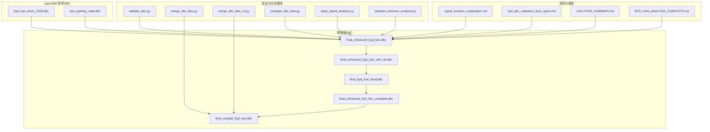
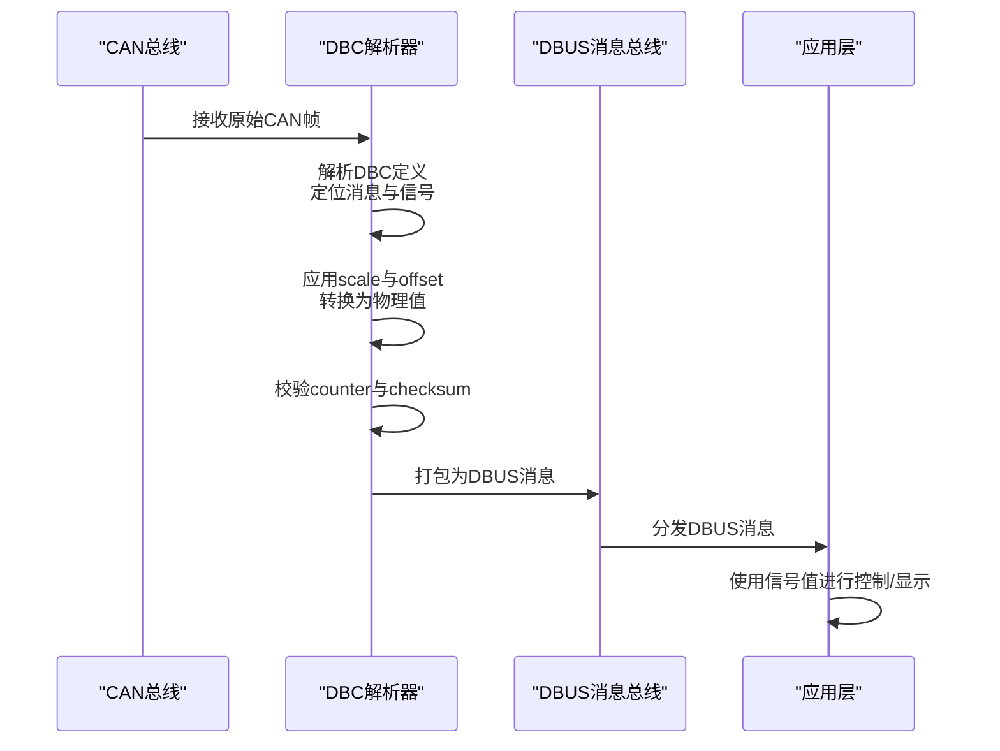
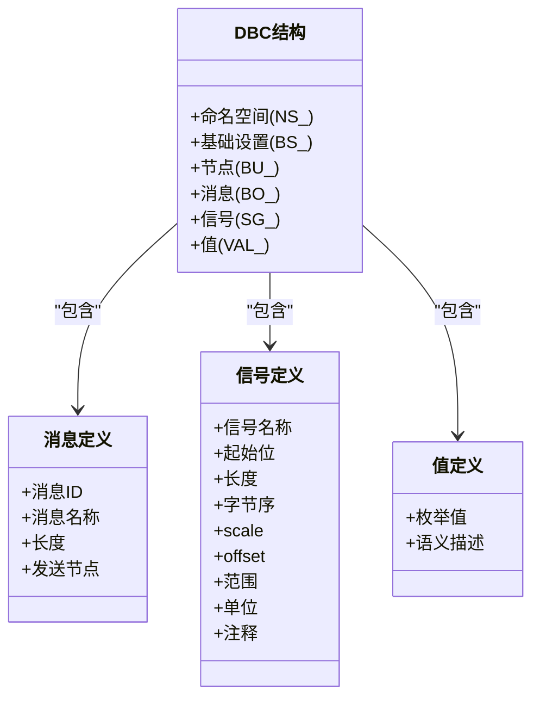
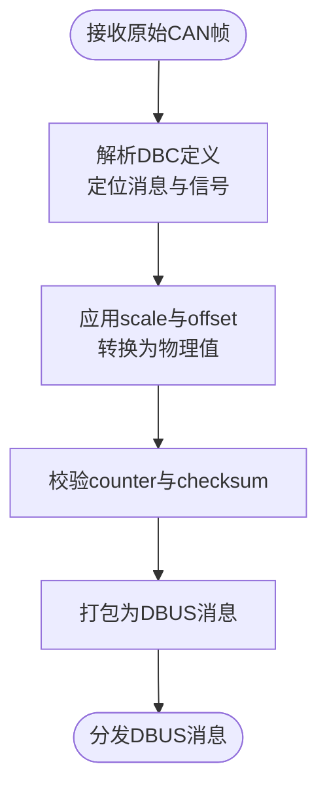
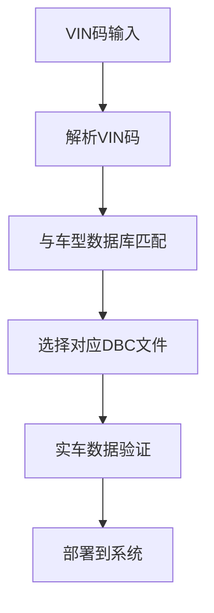
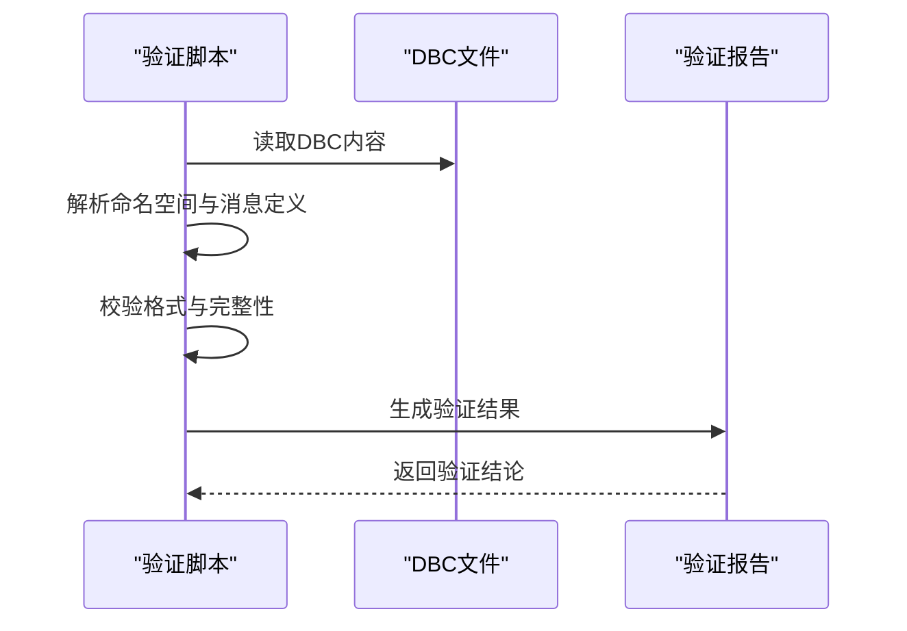
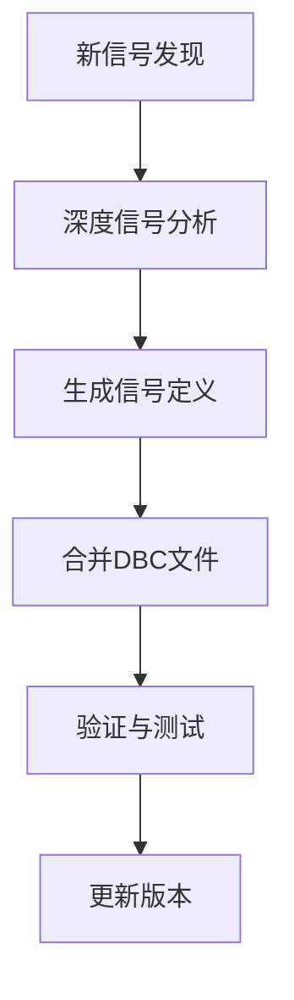
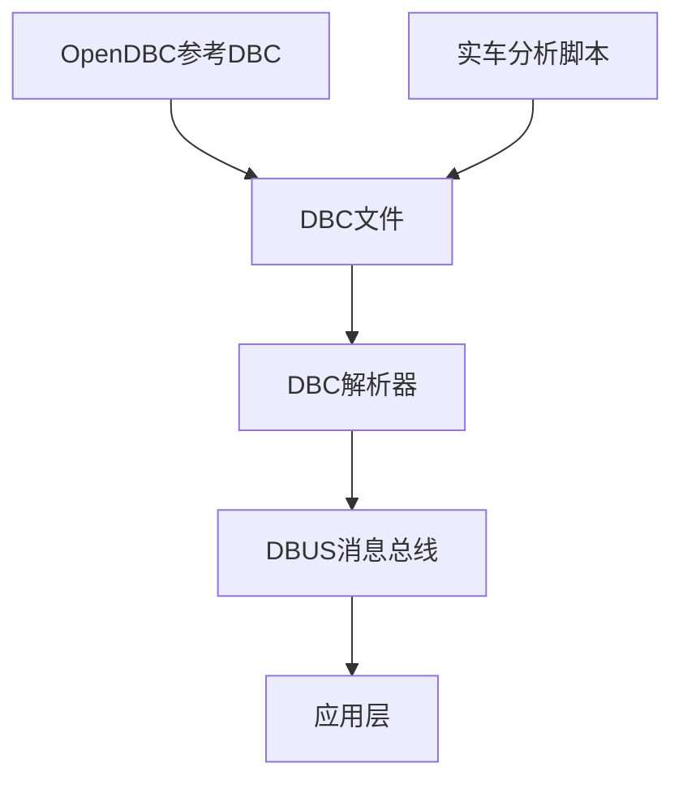

# OpenDBC数据库集成

<cite>
**本文引用的文件**
- [byd_han_dmev_2020.dbc](file://opendbc_repo/opendbc/dbc/byd_han_dmev_2020.dbc)
- [byd_parking_radar.dbc](file://opendbc_repo/opendbc/dbc/byd_parking_radar.dbc)
- [reference_byd.dbc](file://reference_byd.dbc)
- [final_enhanced_byd_han_with_ref.dbc](file://final_enhanced_byd_han_with_ref.dbc)
- [final_byd_han_fixed.dbc](file://final_byd_han_fixed.dbc)
- [final_enhanced_byd_han.dbc](file://final_enhanced_byd_han.dbc)
- [final_enhanced_byd_han_complete.dbc](file://final_enhanced_byd_han_complete.dbc)
- [final_merged_byd_han.dbc](file://final_merged_byd_han.dbc)
- [validate_dbc.py](file://validate_dbc.py)
- [merge_dbc_files.py](file://merge_dbc_files.py)
- [merge_dbc_files_v2.py](file://merge_dbc_files_v2.py)
- [compare_dbc_files.py](file://compare_dbc_files.py)
- [deep_signal_analysis.py](file://deep_signal_analysis.py)
- [detailed_unknown_analysis.py](file://detailed_unknown_analysis.py)
- [signal_function_explanation.md](file://signal_function_explanation.md)
- [byd_dbc_validation_final_report.md](file://byd_dbc_validation_final_report.md)
- [SOLUTION_SUMMARY.md](file://SOLUTION_SUMMARY.md)
- [BYD_HAN_ANALYSIS_COMPLETE.md](file://BYD_HAN_ANALYSIS_COMPLETE.md)
</cite>

## 目录
1. [简介](#简介)
2. [项目结构](#项目结构)
3. [核心组件](#核心组件)
4. [架构概览](#架构概览)
5. [详细组件分析](#详细组件分析)
6. [依赖分析](#依赖分析)
7. [性能考虑](#性能考虑)
8. [故障排除指南](#故障排除指南)
9. [结论](#结论)
10. [附录](#附录)

## 简介
本文件为BYD OpenDBC数据库集成的详细技术文档，面向需要在openpilot等系统中集成比亚迪车辆CAN信号的工程师与开发者。文档基于实际代码库中的DBC文件与分析脚本，系统阐述了DBC文件结构、信号定义、消息格式、数据类型、CAN信号与DBUS消息映射关系、指纹识别机制（VIN解析与车辆型号匹配）、数据库验证与测试方法、维护与更新流程，以及与不同BYD车型的兼容性处理。

## 项目结构
本项目围绕BYD车辆的DBC数据库展开，包含多个版本的DBC文件、验证脚本与分析报告。核心结构如下：
- OpenDBC参考DBC：包含BYD汉DM-i 2020与泊车雷达的标准DBC定义
- 增强版DBC：基于实车数据分析与参考DBC补充，形成更完整的信号定义
- 验证与合并脚本：用于DBC格式验证、文件合并与对比分析
- 分析报告与说明文档：提供信号功能解释、验证结论与使用指南

**图表来源**
- [byd_han_dmev_2020.dbc:1-252](file://opendbc_repo/opendbc/dbc/byd_han_dmev_2020.dbc#L1-L252)
- [byd_parking_radar.dbc:1-414](file://opendbc_repo/opendbc/dbc/byd_parking_radar.dbc#L1-L414)
- [final_enhanced_byd_han.dbc:1-59](file://final_enhanced_byd_han.dbc#L1-L59)
- [final_enhanced_byd_han_with_ref.dbc:1-58](file://final_enhanced_byd_han_with_ref.dbc#L1-L58)
- [final_byd_han_fixed.dbc:1-59](file://final_byd_han_fixed.dbc#L1-L59)
- [final_enhanced_byd_han_complete.dbc:1-59](file://final_enhanced_byd_han_complete.dbc#L1-L59)
- [final_merged_byd_han.dbc:1-59](file://final_merged_byd_han.dbc#L1-L59)
- [validate_dbc.py:1-196](file://validate_dbc.py#L1-L196)
- [merge_dbc_files.py:1-135](file://merge_dbc_files.py#L1-L135)
- [merge_dbc_files_v2.py:1-150](file://merge_dbc_files_v2.py#L1-L150)
- [compare_dbc_files.py:46-83](file://compare_dbc_files.py#L46-L83)
- [deep_signal_analysis.py:280-371](file://deep_signal_analysis.py#L280-L371)
- [detailed_unknown_analysis.py:188-224](file://detailed_unknown_analysis.py#L188-L224)
- [signal_function_explanation.md:61-95](file://signal_function_explanation.md#L61-L95)
- [byd_dbc_validation_final_report.md:1-62](file://byd_dbc_validation_final_report.md#L1-L62)
- [SOLUTION_SUMMARY.md:1-37](file://SOLUTION_SUMMARY.md#L1-L37)
- [BYD_HAN_ANALYSIS_COMPLETE.md:44-83](file://BYD_HAN_ANALYSIS_COMPLETE.md#L44-L83)

**章节来源**
- [byd_han_dmev_2020.dbc:1-252](file://opendbc_repo/opendbc/dbc/byd_han_dmev_2020.dbc#L1-L252)
- [byd_parking_radar.dbc:1-414](file://opendbc_repo/opendbc/dbc/byd_parking_radar.dbc#L1-L414)

## 核心组件
- DBC文件结构与信号定义
  - DBC采用标准格式，包含命名空间(NS_)、基础设置(BS_)、节点(BU_)、消息定义(BO_)与信号定义(SG_)
  - 信号定义语法包含起始位、长度、字节序、缩放因子(scale)、偏移(offset)、最小最大值范围、单位与注释
  - 示例：转向角信号定义包含缩放因子与偏移，用于将原始字节转换为物理量
- 消息格式与数据类型
  - 消息长度限定为1-8字节，CAN ID范围遵循标准规范
  - 信号类型包括整数、浮点、状态位与布尔值，通过scale与offset转换为实际物理值
- CAN信号与DBUS消息映射
  - 实际CAN信号通过DBC定义映射到DBUS消息字段，实现跨进程的数据传递
  - 计数器(counter)与校验和(checksum)用于消息完整性验证
- 指纹识别机制
  - 通过VIN码解析与车辆型号匹配，实现对不同BYD车型的识别与适配
  - 结合实车数据分析，验证信号定义的有效性与准确性

**章节来源**
- [byd_han_dmev_2020.dbc:38-252](file://opendbc_repo/opendbc/dbc/byd_han_dmev_2020.dbc#L38-L252)
- [byd_parking_radar.dbc:86-414](file://opendbc_repo/opendbc/dbc/byd_parking_radar.dbc#L86-L414)
- [signal_function_explanation.md:61-95](file://signal_function_explanation.md#L61-L95)

## 架构概览
下图展示了从DBC文件到DBUS消息的端到端映射流程，包括信号值转换与数据打包过程：

**图表来源**
- [byd_han_dmev_2020.dbc:38-252](file://opendbc_repo/opendbc/dbc/byd_han_dmev_2020.dbc#L38-L252)
- [byd_parking_radar.dbc:86-414](file://opendbc_repo/opendbc/dbc/byd_parking_radar.dbc#L86-L414)

## 详细组件分析

### DBC文件结构与信号定义
- 命名空间与基础设置
  - NS_与BS_定义了DBC的命名空间与基础配置
  - BU_定义了节点名称，用于消息发送方标识
- 消息定义(BO_)
  - BO_包含消息ID、消息名称、长度与发送节点
  - 示例：EPB、EPS、CARSPEED、BCM等消息的定义
- 信号定义(SG_)
  - SG_包含信号名称、起始位、长度、字节序、scale、offset、范围、单位与注释
  - 示例：转向角、车速、车门状态、刹车灯等信号的定义
- 值定义(VAL_)
  - VAL_用于枚举信号的离散取值与其语义，提升可读性与一致性
  - 示例：档位、LKAS配置、ACC状态等

**图表来源**
- [byd_han_dmev_2020.dbc:38-252](file://opendbc_repo/opendbc/dbc/byd_han_dmev_2020.dbc#L38-L252)
- [byd_parking_radar.dbc:86-414](file://opendbc_repo/opendbc/dbc/byd_parking_radar.dbc#L86-L414)

**章节来源**
- [byd_han_dmev_2020.dbc:38-252](file://opendbc_repo/opendbc/dbc/byd_han_dmev_2020.dbc#L38-L252)
- [byd_parking_radar.dbc:86-414](file://opendbc_repo/opendbc/dbc/byd_parking_radar.dbc#L86-L414)

### CAN信号与DBUS消息映射
- 信号值转换
  - 通过scale与offset将原始字节转换为物理量，确保信号值的准确性
  - 示例：转向角、车速、刹车压力等信号的转换逻辑
- 数据打包
  - 将转换后的信号值按DBC定义打包为DBUS消息，包含计数器与校验和
  - 计数器用于检测丢包，校验和用于检测传输错误
- 消息完整性验证
  - 通过计数器递增与校验和计算，确保消息的完整性与一致性

**图表来源**
- [byd_han_dmev_2020.dbc:38-252](file://opendbc_repo/opendbc/dbc/byd_han_dmev_2020.dbc#L38-L252)
- [byd_parking_radar.dbc:86-414](file://opendbc_repo/opendbc/dbc/byd_parking_radar.dbc#L86-L414)

**章节来源**
- [signal_function_explanation.md:85-95](file://signal_function_explanation.md#L85-L95)

### 指纹识别机制（VIN解析与车辆型号匹配）
- VIN码解析
  - 通过解析VIN码获取车辆制造商、车型、年款等关键信息
  - 结合DBC定义与实车数据分析，实现对不同BYD车型的识别
- 车型号匹配
  - 将解析出的VIN信息与已知BYD车型数据库进行匹配
  - 根据匹配结果选择对应的DBC文件与信号定义
- 实车验证
  - 通过实车数据验证信号定义的有效性与准确性
  - 对异常信号进行标注与修正，确保系统稳定性

**图表来源**
- [SOLUTION_SUMMARY.md:1-37](file://SOLUTION_SUMMARY.md#L1-L37)
- [BYD_HAN_ANALYSIS_COMPLETE.md:44-83](file://BYD_HAN_ANALYSIS_COMPLETE.md#L44-L83)

**章节来源**
- [SOLUTION_SUMMARY.md:1-37](file://SOLUTION_SUMMARY.md#L1-L37)
- [BYD_HAN_ANALYSIS_COMPLETE.md:44-83](file://BYD_HAN_ANALYSIS_COMPLETE.md#L44-L83)

### 数据库验证与测试方法
- DBC格式验证
  - 使用validate_dbc.py脚本检查DBC文件的基本格式，包括命名空间、节点、消息与信号定义
  - 验证BO_TX_BU_等扩展定义的格式正确性
- 信号一致性检查
  - 通过compare_dbc_files.py对比两个DBC文件，识别新增消息与信号定义
  - 检查信号定义的一致性与完整性
- 消息完整性验证
  - 通过byd_dbc_validation_final_report.md中的验证结果，评估距离、速度与角度解码公式的准确性
  - 识别系统偏差与异常分段，提出修正建议

**图表来源**
- [validate_dbc.py:10-196](file://validate_dbc.py#L10-L196)
- [compare_dbc_files.py:68-83](file://compare_dbc_files.py#L68-L83)
- [byd_dbc_validation_final_report.md:1-62](file://byd_dbc_validation_final_report.md#L1-L62)

**章节来源**
- [validate_dbc.py:10-196](file://validate_dbc.py#L10-L196)
- [compare_dbc_files.py:68-83](file://compare_dbc_files.py#L68-L83)
- [byd_dbc_validation_final_report.md:1-62](file://byd_dbc_validation_final_report.md#L1-L62)

### 维护与更新流程（新信号添加与现有信号修改）
- 新信号添加
  - 通过deep_signal_analysis.py与detailed_unknown_analysis.py对未知信号进行分析与推断
  - 生成新的信号定义并添加到DBC文件中
- 现有信号修改
  - 基于实车数据分析与验证报告，对现有信号定义进行修正
  - 使用merge_dbc_files.py与merge_dbc_files_v2.py合并参考DBC与增强版DBC
- 版本管理
  - 保留多个版本的DBC文件，便于回溯与比较
  - 通过final_merged_byd_han.dbc整合所有有效消息与值定义

**图表来源**
- [deep_signal_analysis.py:280-371](file://deep_signal_analysis.py#L280-L371)
- [detailed_unknown_analysis.py:188-224](file://detailed_unknown_analysis.py#L188-L224)
- [merge_dbc_files.py:57-135](file://merge_dbc_files.py#L57-L135)
- [merge_dbc_files_v2.py:68-150](file://merge_dbc_files_v2.py#L68-L150)

**章节来源**
- [deep_signal_analysis.py:280-371](file://deep_signal_analysis.py#L280-L371)
- [detailed_unknown_analysis.py:188-224](file://detailed_unknown_analysis.py#L188-L224)
- [merge_dbc_files.py:57-135](file://merge_dbc_files.py#L57-L135)
- [merge_dbc_files_v2.py:68-150](file://merge_dbc_files_v2.py#L68-L150)

### 与不同BYD车型的兼容性处理与配置差异
- 车型差异
  - 不同BYD车型在信号定义上可能存在差异，需根据具体车型选择对应的DBC文件
  - 通过VIN解析与车型匹配，自动选择合适的DBC文件
- 配置差异
  - 部分信号的scale、offset或范围可能因车型而异，需在DBC中明确标注
  - 通过VAL_定义枚举值，统一信号语义，减少歧义

**章节来源**
- [SOLUTION_SUMMARY.md:1-37](file://SOLUTION_SUMMARY.md#L1-L37)
- [BYD_HAN_ANALYSIS_COMPLETE.md:44-83](file://BYD_HAN_ANALYSIS_COMPLETE.md#L44-L83)

### DBC文件编辑与调试工具使用指南
- DBC编辑工具
  - 使用文本编辑器或专业DBC编辑工具进行手动修改
  - 注意保持DBC格式规范，避免语法错误
- 调试工具
  - 使用validate_dbc.py进行格式验证
  - 使用compare_dbc_files.py进行文件对比分析
  - 使用merge_dbc_files.py与merge_dbc_files_v2.py进行文件合并
- 实车调试
  - 通过实车数据验证信号定义的有效性
  - 基于byd_dbc_validation_final_report.md的结论进行修正

**章节来源**
- [validate_dbc.py:10-196](file://validate_dbc.py#L10-L196)
- [compare_dbc_files.py:68-83](file://compare_dbc_files.py#L68-L83)
- [merge_dbc_files.py:57-135](file://merge_dbc_files.py#L57-L135)
- [merge_dbc_files_v2.py:68-150](file://merge_dbc_files_v2.py#L68-L150)
- [byd_dbc_validation_final_report.md:1-62](file://byd_dbc_validation_final_report.md#L1-L62)

## 依赖分析
- 组件耦合
  - DBC文件与解析器之间存在直接依赖，解析器需严格遵循DBC定义
  - DBUS消息总线依赖DBC解析器提供的信号值
- 外部依赖
  - OpenDBC参考DBC文件为系统提供标准化的信号定义
  - 实车数据分析脚本为DBC验证与修正提供依据

**图表来源**
- [byd_han_dmev_2020.dbc:38-252](file://opendbc_repo/opendbc/dbc/byd_han_dmev_2020.dbc#L38-L252)
- [byd_parking_radar.dbc:86-414](file://opendbc_repo/opendbc/dbc/byd_parking_radar.dbc#L86-L414)

**章节来源**
- [byd_han_dmev_2020.dbc:38-252](file://opendbc_repo/opendbc/dbc/byd_han_dmev_2020.dbc#L38-L252)
- [byd_parking_radar.dbc:86-414](file://opendbc_repo/opendbc/dbc/byd_parking_radar.dbc#L86-L414)

## 性能考虑
- 信号转换效率
  - scale与offset计算应尽量简化，避免在高频信号上引入额外开销
- 消息完整性校验
  - 计数器与校验和的计算应在保证准确性的前提下尽量高效
- 实时性要求
  - 高频信号（如转向角、车速）需确保解析与转换的实时性

## 故障排除指南
- DBC格式错误
  - 使用validate_dbc.py检查命名空间、节点、消息与信号定义的格式
  - 关注BO_TX_BU_等扩展定义的格式正确性
- 信号不一致
  - 使用compare_dbc_files.py对比两个DBC文件，识别新增消息与信号定义
  - 检查信号定义的一致性与完整性
- 实车验证失败
  - 参考byd_dbc_validation_final_report.md中的验证结果，识别系统偏差与异常分段
  - 提出修正建议并更新DBC文件

**章节来源**
- [validate_dbc.py:10-196](file://validate_dbc.py#L10-L196)
- [compare_dbc_files.py:68-83](file://compare_dbc_files.py#L68-L83)
- [byd_dbc_validation_final_report.md:1-62](file://byd_dbc_validation_final_report.md#L1-L62)

## 结论
本集成文档基于实际代码库中的DBC文件与分析脚本，系统阐述了BYD OpenDBC数据库的结构、信号定义、映射关系、指纹识别机制、验证与测试方法、维护与更新流程，以及与不同BYD车型的兼容性处理。通过严格的验证与实车数据支撑，确保DBC定义的准确性与可靠性，为openpilot等系统的BYD车辆适配提供坚实基础。

## 附录
- 信号功能说明
  - 参考signal_function_explanation.md，了解各信号的功能与使用建议
- 分析报告
  - 参考SOLUTION_SUMMARY.md与BYD_HAN_ANALYSIS_COMPLETE.md，了解分析过程与结论
- DBC文件版本
  - 参考多个版本的DBC文件，了解演进过程与差异

**章节来源**
- [signal_function_explanation.md:61-95](file://signal_function_explanation.md#L61-L95)
- [SOLUTION_SUMMARY.md:1-37](file://SOLUTION_SUMMARY.md#L1-L37)
- [BYD_HAN_ANALYSIS_COMPLETE.md:44-83](file://BYD_HAN_ANALYSIS_COMPLETE.md#L44-L83)