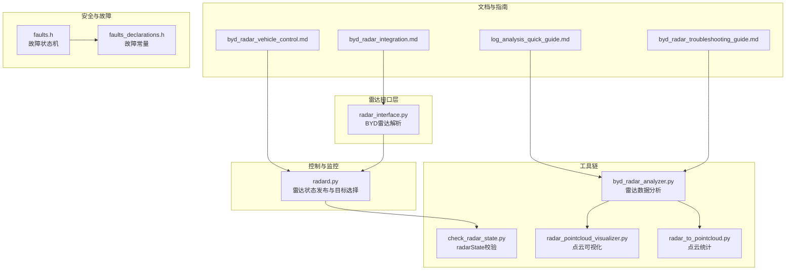
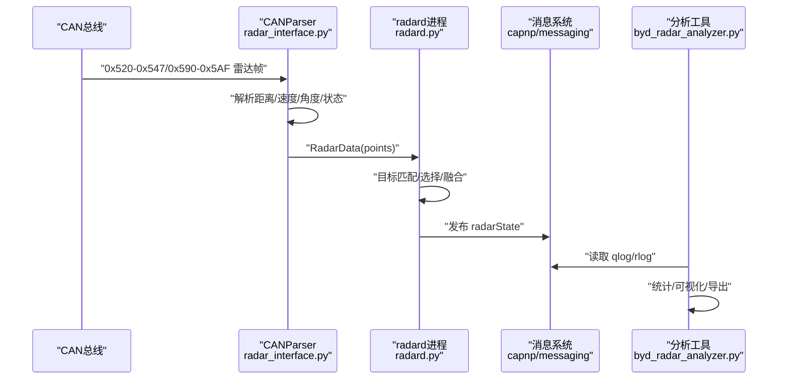
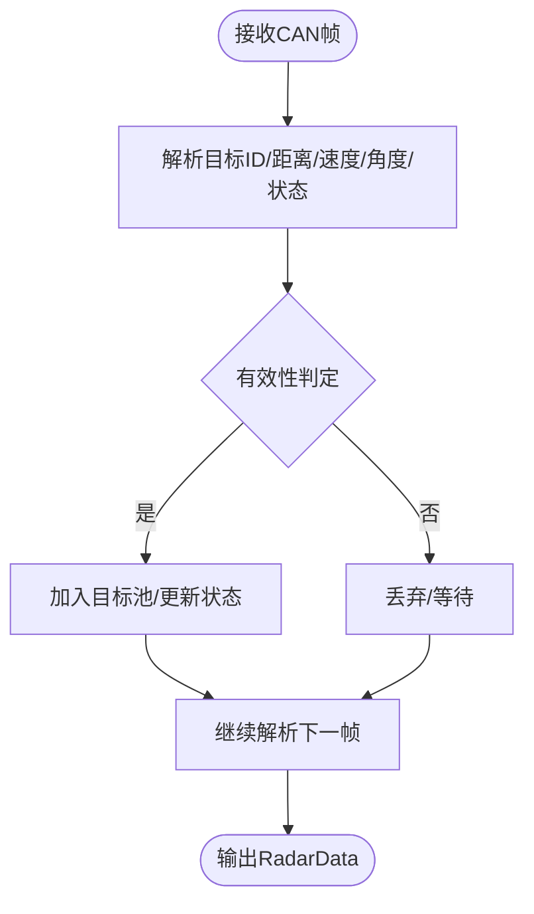
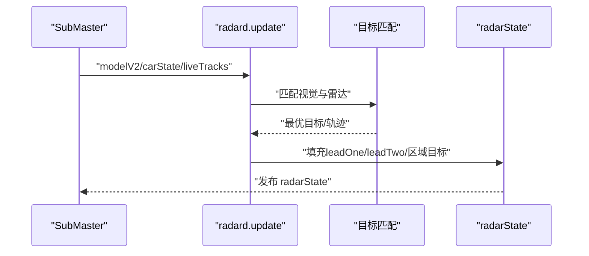
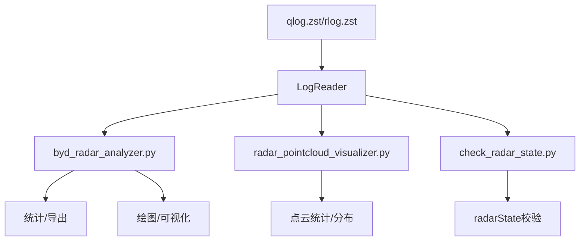
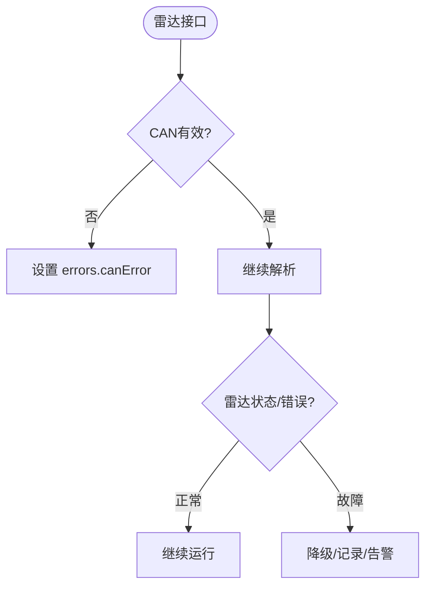
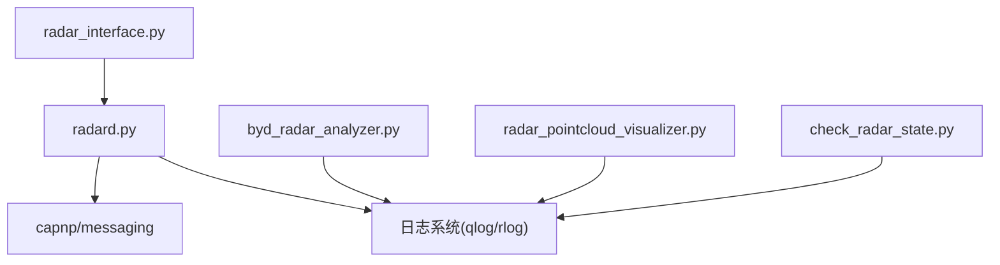

# 诊断监控系统

<cite>
**本文引用的文件**
- [byd_radar_integration.md](file://docs/byd_radar_integration.md)
- [byd_radar_vehicle_control.md](file://docs/byd_radar_vehicle_control.md)
- [log_analysis_quick_guide.md](file://docs/log_analysis_quick_guide.md)
- [byd_radar_troubleshooting_guide.md](file://tools/byd_radar_troubleshooting_guide.md)
- [radar_interface.py](file://opendbc_repo/opendbc/car/byd/radar_interface.py)
- [radard.py](file://selfdrive/controls/radard.py)
- [byd_radar_analyzer.py](file://tools/byd_radar_analyzer.py)
- [check_radar_state.py](file://tools/check_radar_state.py)
- [radar_pointcloud_visualizer.py](file://radar_pointcloud_visualizer.py)
- [radar_to_pointcloud.py](file://radar_to_pointcloud.py)
- [updated_radar_analysis_report.md](file://updated_radar_analysis_report.md)
- [faults.h](file://opendbc_repo/opendbc/safety/board/faults.h)
- [faults_declarations.h](file://opendbc_repo/opendbc/safety/board/faults_declarations.h)
</cite>

## 目录
1. [简介](#简介)
2. [项目结构](#项目结构)
3. [核心组件](#核心组件)
4. [架构总览](#架构总览)
5. [详细组件分析](#详细组件分析)
6. [依赖关系分析](#依赖关系分析)
7. [性能考量](#性能考量)
8. [故障排查指南](#故障排查指南)
9. [结论](#结论)
10. [附录](#附录)

## 简介
本文件面向BYD诊断监控系统，围绕雷达状态监控与诊断展开，涵盖工作状态检测、故障诊断机制、诊断日志生成与分析、车辆健康状态指标、故障诊断与错误处理流程、调试工具使用以及与车载诊断系统的集成方式与数据交换协议。文档以代码库中的实际实现为依据，提供可操作的分析方法与排障建议。

## 项目结构
本项目围绕openpilot生态构建，涉及雷达数据采集、解析、融合与可视化等多个环节。关键模块包括：
- 文档与指南：雷达集成、车辆控制应用、日志分析与故障排查
- 雷达接口：BYD雷达数据解析与有效性判定
- 控制与监控：radard进程负责雷达状态发布与目标选择
- 工具链：日志读取、雷达数据分析与可视化
- 安全与故障：故障状态机与错误处理

**图表来源**
- [byd_radar_integration.md:1-109](file://docs/byd_radar_integration.md#L1-L109)
- [byd_radar_vehicle_control.md:1-407](file://docs/byd_radar_vehicle_control.md#L1-L407)
- [log_analysis_quick_guide.md:1-146](file://docs/log_analysis_quick_guide.md#L1-L146)
- [byd_radar_troubleshooting_guide.md:1-503](file://tools/byd_radar_troubleshooting_guide.md#L1-L503)
- [radar_interface.py:1-56](file://opendbc_repo/opendbc/car/byd/radar_interface.py#L1-L56)
- [radard.py:1-722](file://selfdrive/controls/radard.py#L1-L722)
- [byd_radar_analyzer.py:1-243](file://tools/byd_radar_analyzer.py#L1-L243)
- [check_radar_state.py:1-121](file://tools/check_radar_state.py#L1-L121)
- [radar_pointcloud_visualizer.py:1-649](file://radar_pointcloud_visualizer.py#L1-L649)
- [radar_to_pointcloud.py:1-256](file://radar_to_pointcloud.py#L1-L256)
- [faults.h:1-25](file://opendbc_repo/opendbc/safety/board/faults.h#L1-L25)
- [faults_declarations.h:1-18](file://opendbc_repo/opendbc/safety/board/faults_declarations.h#L1-L18)

**章节来源**
- [byd_radar_integration.md:1-109](file://docs/byd_radar_integration.md#L1-L109)
- [byd_radar_vehicle_control.md:1-407](file://docs/byd_radar_vehicle_control.md#L1-L407)
- [log_analysis_quick_guide.md:1-146](file://docs/log_analysis_quick_guide.md#L1-L146)
- [byd_radar_troubleshooting_guide.md:1-503](file://tools/byd_radar_troubleshooting_guide.md#L1-L503)

## 核心组件
- BYD雷达数据集成与解析
  - 使用原始雷达CAN消息范围0x520-0x547与0x590-0x5AF，对应短/长程雷达目标；状态消息0x250用于工作状态与错误状态监测。
  - 雷达接口实现负责从CAN解析目标距离、速度、角度与状态，并进行有效性判定与目标跟踪。
- 雷达状态发布与目标选择
  - radard进程订阅模型与车辆状态，基于雷达点与视觉信息进行目标匹配与选择，生成radarState消息供上层控制使用。
- 日志分析与可视化
  - 提供雷达数据分析脚本与可视化工具，支持统计分析、点云图与距离/速度/角度分布分析。
- 故障诊断与安全
  - 安全板级故障状态机记录临时/永久故障，配合上层错误处理与恢复策略。

**章节来源**
- [byd_radar_integration.md:1-109](file://docs/byd_radar_integration.md#L1-L109)
- [radar_interface.py:1-56](file://opendbc_repo/opendbc/car/byd/radar_interface.py#L1-L56)
- [radard.py:1-722](file://selfdrive/controls/radard.py#L1-L722)
- [byd_radar_analyzer.py:1-243](file://tools/byd_radar_analyzer.py#L1-L243)
- [radar_pointcloud_visualizer.py:1-649](file://radar_pointcloud_visualizer.py#L1-L649)
- [faults.h:1-25](file://opendbc_repo/opendbc/safety/board/faults.h#L1-L25)
- [faults_declarations.h:1-18](file://opendbc_repo/opendbc/safety/board/faults_declarations.h#L1-L18)

## 架构总览
下图展示了从CAN总线到radarState发布的整体流程，以及与日志分析工具的衔接。

**图表来源**
- [radar_interface.py:1-56](file://opendbc_repo/opendbc/car/byd/radar_interface.py#L1-L56)
- [radard.py:1-722](file://selfdrive/controls/radard.py#L1-L722)
- [byd_radar_analyzer.py:1-243](file://tools/byd_radar_analyzer.py#L1-L243)

## 详细组件分析

### BYD雷达接口与数据解析
- 数据来源与格式
  - 短程雷达：0x520-0x547，共40个目标消息；长程雷达：0x590-0x5AF，最大检测距离可达156.12米。
  - 状态消息0x250包含工作状态与错误状态，用于雷达健康监控。
- 解析与有效性判定
  - 接口实现基于CANParser，对目标ID、距离、横向距离与有效性进行判定，生成RadarPoint列表。
  - 通过有效性计数与目标状态判断，确保输出数据的可靠性。
- 双格式传输与优化
  - 针对BYD ACC雷达的双格式传输（Type1/Type2），实现格式识别与距离缓存策略，提升远距离目标稳定性。

**图表来源**
- [radar_interface.py:1-56](file://opendbc_repo/opendbc/car/byd/radar_interface.py#L1-L56)
- [byd_radar_troubleshooting_guide.md:405-461](file://tools/byd_radar_troubleshooting_guide.md#L405-L461)

**章节来源**
- [byd_radar_integration.md:1-109](file://docs/byd_radar_integration.md#L1-L109)
- [radar_interface.py:1-56](file://opendbc_repo/opendbc/car/byd/radar_interface.py#L1-L56)
- [updated_radar_analysis_report.md:1-47](file://updated_radar_analysis_report.md#L1-L47)
- [byd_radar_troubleshooting_guide.md:405-461](file://tools/byd_radar_troubleshooting_guide.md#L405-L461)

### 雷达状态发布与目标选择（radard）
- 目标匹配与选择
  - 基于视觉模型概率与雷达点特征（距离、横向距离、相对速度）进行匹配打分，选择最优前车目标。
  - 支持左右两侧与中心区域目标分类，以及变道切入检测。
- 状态输出
  - 生成radarState消息，包含leadOne/leadTwo、各区域目标列表、路径预测等，供上层纵向/横向控制使用。
- 参数化控制
  - 通过参数启用雷达跟踪、角雷达辅助、反应因子与横向因子，影响目标选择与轨迹预测。

**图表来源**
- [radard.py:1-722](file://selfdrive/controls/radard.py#L1-L722)

**章节来源**
- [radard.py:1-722](file://selfdrive/controls/radard.py#L1-L722)

### 诊断日志生成与分析
- 日志类型与读取
  - qlog.zst：包含关键消息（radarState、carState、controlsState等），适合快速分析。
  - rlog.zst：包含完整消息与CAN总线，适合深度调试。
- 分析工具
  - byd_radar_analyzer.py：读取radarState/liveTracks/can，统计目标数量、测量比例、距离分布，并可导出CSV与绘制图表。
  - radar_pointcloud_visualizer.py：点云可视化与统计分析，支持短/长程雷达分离与缺失雷达地址分析。
  - radar_to_pointcloud.py：打印统计信息与可视化参数设置。
  - check_radar_state.py：验证radarState消息内容与新解析方法的合理性。

**图表来源**
- [log_analysis_quick_guide.md:1-146](file://docs/log_analysis_quick_guide.md#L1-L146)
- [byd_radar_analyzer.py:1-243](file://tools/byd_radar_analyzer.py#L1-L243)
- [radar_pointcloud_visualizer.py:1-649](file://radar_pointcloud_visualizer.py#L1-L649)
- [radar_to_pointcloud.py:1-256](file://radar_to_pointcloud.py#L1-L256)
- [check_radar_state.py:1-121](file://tools/check_radar_state.py#L1-L121)

**章节来源**
- [log_analysis_quick_guide.md:1-146](file://docs/log_analysis_quick_guide.md#L1-L146)
- [byd_radar_analyzer.py:1-243](file://tools/byd_radar_analyzer.py#L1-L243)
- [radar_pointcloud_visualizer.py:1-649](file://radar_pointcloud_visualizer.py#L1-L649)
- [radar_to_pointcloud.py:1-256](file://radar_to_pointcloud.py#L1-L256)
- [check_radar_state.py:1-121](file://tools/check_radar_state.py#L1-L121)

### 车辆健康状态监控指标
- 传感器状态
  - 雷达目标有效性比例、测量目标比例、目标ID唯一性与跟踪稳定性。
- 通信质量
  - CAN消息计数、总线分布、地址活动情况（缺失雷达地址分析）。
- 系统性能
  - 距离/速度/角度分布、目标分布区间、正前方目标比例、雷达状态消息活性。

**章节来源**
- [radar_pointcloud_visualizer.py:386-649](file://radar_pointcloud_visualizer.py#L386-L649)
- [byd_radar_analyzer.py:93-134](file://tools/byd_radar_analyzer.py#L93-L134)
- [updated_radar_analysis_report.md:1-47](file://updated_radar_analysis_report.md#L1-L47)

### 故障诊断与错误处理流程
- 雷达状态与错误
  - radarState包含errors字段，用于上报CAN错误、雷达故障与临时不可用状态。
  - radar_interface.py中对CAN有效性进行检查，必要时设置错误标志。
- 安全板级故障
  - 故障状态机区分临时/永久故障，记录故障类型并影响系统状态。
- 恢复策略
  - 当雷达不可用时，可降级为视觉主导控制，降低功能等级并记录故障日志。

**图表来源**
- [radar_interface.py:1-56](file://opendbc_repo/opendbc/car/byd/radar_interface.py#L1-L56)
- [radard.py:440-450](file://selfdrive/controls/radard.py#L440-L450)
- [faults.h:1-25](file://opendbc_repo/opendbc/safety/board/faults.h#L1-L25)
- [faults_declarations.h:1-18](file://opendbc_repo/opendbc/safety/board/faults_declarations.h#L1-L18)

**章节来源**
- [radar_interface.py:1-56](file://opendbc_repo/opendbc/car/byd/radar_interface.py#L1-L56)
- [radard.py:440-450](file://selfdrive/controls/radard.py#L440-L450)
- [faults.h:1-25](file://opendbc_repo/opendbc/safety/board/faults.h#L1-L25)
- [faults_declarations.h:1-18](file://opendbc_repo/opendbc/safety/board/faults_declarations.h#L1-L18)

### 调试工具使用方法
- 实时监控界面
  - radar_pointcloud_visualizer.py：3D点云与鸟瞰视图，支持显示雷达目标、跟踪ID与雷达状态。
  - radar_to_pointcloud.py：打印统计信息与可视化参数。
- 数据分析工具
  - byd_radar_analyzer.py：读取日志，统计雷达目标、测量比例与导出CSV。
  - check_radar_state.py：验证radarState消息字段与新解析方法的合理性。
- 日志读取与参数
  - log_analysis_quick_guide.md：提供读取整条路线、常用消息类型与参数读取示例。

**章节来源**
- [radar_pointcloud_visualizer.py:1-649](file://radar_pointcloud_visualizer.py#L1-L649)
- [radar_to_pointcloud.py:1-256](file://radar_to_pointcloud.py#L1-L256)
- [byd_radar_analyzer.py:1-243](file://tools/byd_radar_analyzer.py#L1-L243)
- [check_radar_state.py:1-121](file://tools/check_radar_state.py#L1-L121)
- [log_analysis_quick_guide.md:1-146](file://docs/log_analysis_quick_guide.md#L1-L146)

### 与车载诊断系统的集成与数据交换协议
- 数据交换
  - 雷达接口通过capnp消息系统发布RadarData，radard再封装为radarState供上层消费。
  - 日志系统提供qlog/rlog，便于离线分析与回归验证。
- 协议与格式
  - BYD雷达采用CAN协议，消息ID范围明确；状态消息0x250承载工作与错误状态。
  - radarState消息包含目标状态、相对运动学参数与路径预测信息。

**章节来源**
- [byd_radar_integration.md:1-109](file://docs/byd_radar_integration.md#L1-L109)
- [radard.py:1-722](file://selfdrive/controls/radard.py#L1-L722)

## 依赖关系分析
- 组件耦合
  - radar_interface.py与radard.py通过RadarData/radarState消息耦合，radard依赖模型与车辆状态进行目标选择。
  - 工具链（byd_radar_analyzer.py、radar_pointcloud_visualizer.py）依赖日志系统读取qlog/rlog。
- 外部依赖
  - capnp/messaging用于消息传递；numpy/pandas/matplotlib用于数据分析与可视化。
- 潜在风险
  - 日志分析需覆盖整条路线与参数上下文，避免片段化结论。
  - 雷达解析依赖正确的字节序与信号定义，否则会导致异常数值。

**图表来源**
- [radar_interface.py:1-56](file://opendbc_repo/opendbc/car/byd/radar_interface.py#L1-L56)
- [radard.py:1-722](file://selfdrive/controls/radard.py#L1-L722)
- [byd_radar_analyzer.py:1-243](file://tools/byd_radar_analyzer.py#L1-L243)
- [radar_pointcloud_visualizer.py:1-649](file://radar_pointcloud_visualizer.py#L1-L649)
- [check_radar_state.py:1-121](file://tools/check_radar_state.py#L1-L121)

**章节来源**
- [radar_interface.py:1-56](file://opendbc_repo/opendbc/car/byd/radar_interface.py#L1-L56)
- [radard.py:1-722](file://selfdrive/controls/radard.py#L1-L722)
- [byd_radar_analyzer.py:1-243](file://tools/byd_radar_analyzer.py#L1-L243)
- [radar_pointcloud_visualizer.py:1-649](file://radar_pointcloud_visualizer.py#L1-L649)
- [check_radar_state.py:1-121](file://tools/check_radar_state.py#L1-L121)

## 性能考量
- 目标有效性与稳定性
  - 通过有效性计数与状态判断减少误检；对远距离目标采用更长平滑窗口与动态阈值，提升跟踪稳定性。
- 数据范围与异常值处理
  - 对距离、速度、角度设置合理范围，过滤异常值；对缺失/无效目标采用缓存策略。
- 可视化与统计
  - 使用点云与分布直方图快速定位异常场景；按短/长程雷达分离分析，识别潜在硬件缺失。

[本节为通用指导，无需具体文件来源]

## 故障排查指南
- 雷达检测不到前车
  - 检查rlog中0x520-0x547/0x250是否存在；确认radarState中points与正前方目标数量。
  - 核对CAN总线与有效性阈值、数据范围限制、目标跟踪与保持逻辑。
- 过度刹车/跟车不稳
  - 分析radarState与longitudinalPlan一致性；检查距离跳变、数据平滑与PID参数。
- ACC雷达双格式问题
  - 检查b4字节判断Type1/Type2；验证距离缓存与角度解码；确认radar_interface已更新。
- 日志分析最佳实践
  - 使用整条路线分段合并读取；结合当前参数设置进行分析；优先使用qlog进行快速分析，rlog用于深度调试。

**章节来源**
- [byd_radar_troubleshooting_guide.md:1-503](file://tools/byd_radar_troubleshooting_guide.md#L1-L503)
- [log_analysis_quick_guide.md:1-146](file://docs/log_analysis_quick_guide.md#L1-L146)

## 结论
本监控体系以BYD雷达数据为核心，通过接口解析、radard状态发布与多维日志分析工具，实现了对雷达工作状态、通信质量与系统性能的全面监控。配合安全板级故障状态机与参数化控制，系统能够在异常情况下进行降级与恢复。建议在日常维护中坚持整路线分析与参数上下文结合，持续优化雷达解析与目标选择策略，提升ACC与相关ADAS功能的稳定性与可靠性。

[本节为总结，无需具体文件来源]

## 附录
- 参考文档与资源
  - BYD雷达集成与解析：[byd_radar_integration.md:1-109](file://docs/byd_radar_integration.md#L1-L109)
  - 车辆控制应用与算法：[byd_radar_vehicle_control.md:1-407](file://docs/byd_radar_vehicle_control.md#L1-L407)
  - 日志分析快速指南：[log_analysis_quick_guide.md:1-146](file://docs/log_analysis_quick_guide.md#L1-L146)
  - BYD雷达故障排查：[byd_radar_troubleshooting_guide.md:1-503](file://tools/byd_radar_troubleshooting_guide.md#L1-L503)
- 工具与脚本
  - 雷达数据分析：[byd_radar_analyzer.py:1-243](file://tools/byd_radar_analyzer.py#L1-L243)
  - radarState校验：[check_radar_state.py:1-121](file://tools/check_radar_state.py#L1-L121)
  - 点云可视化：[radar_pointcloud_visualizer.py:1-649](file://radar_pointcloud_visualizer.py#L1-L649)
  - 点云统计：[radar_to_pointcloud.py:1-256](file://radar_to_pointcloud.py#L1-L256)
- 安全与故障
  - 故障状态机：[faults.h:1-25](file://opendbc_repo/opendbc/safety/board/faults.h#L1-L25)
  - 故障声明：[faults_declarations.h:1-18](file://opendbc_repo/opendbc/safety/board/faults_declarations.h#L1-L18)

[本节为补充材料，无需具体文件来源]