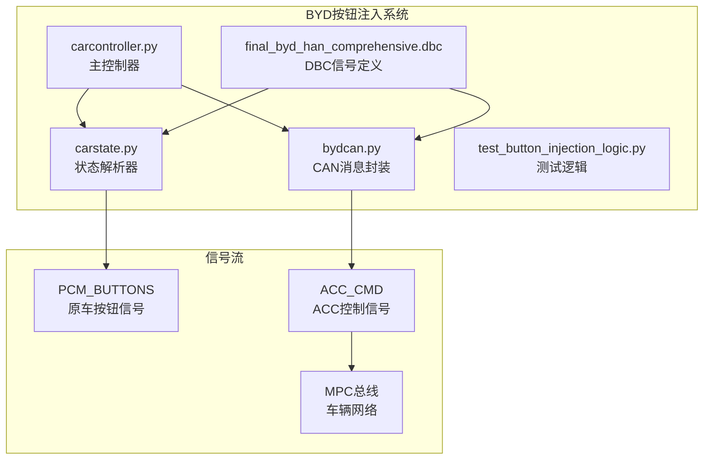
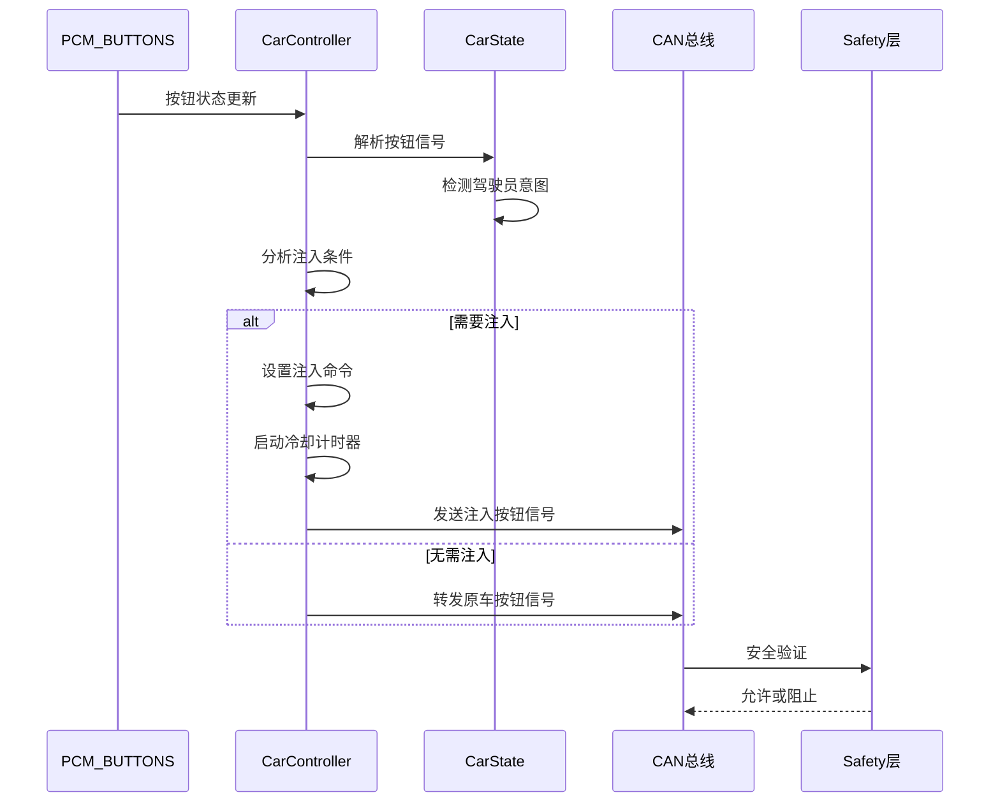
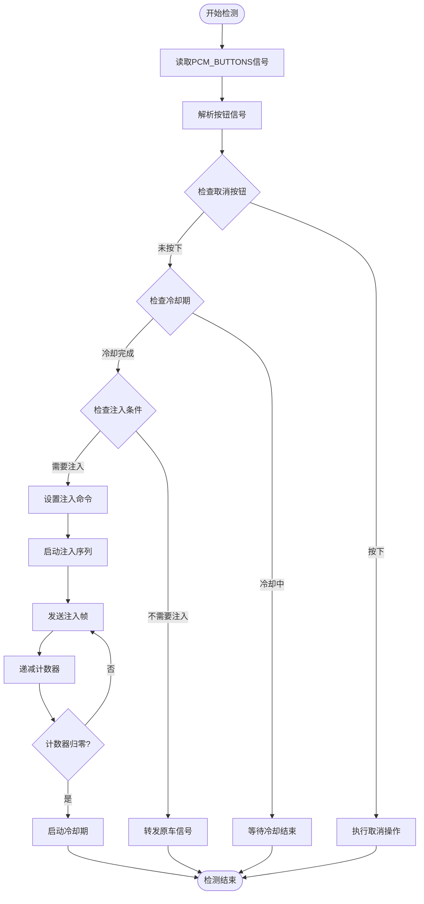
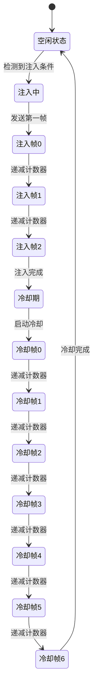
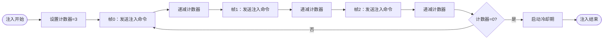
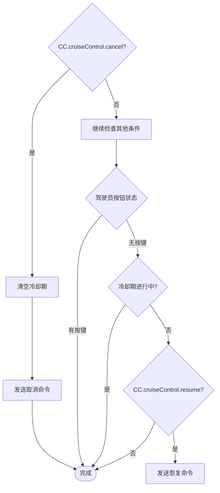
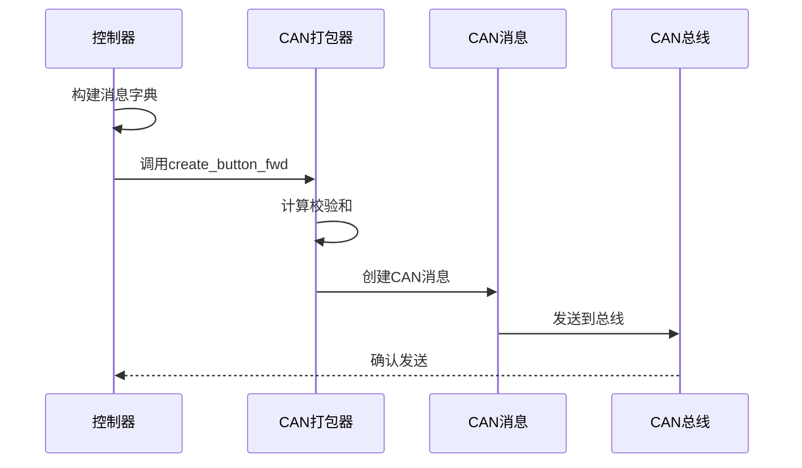
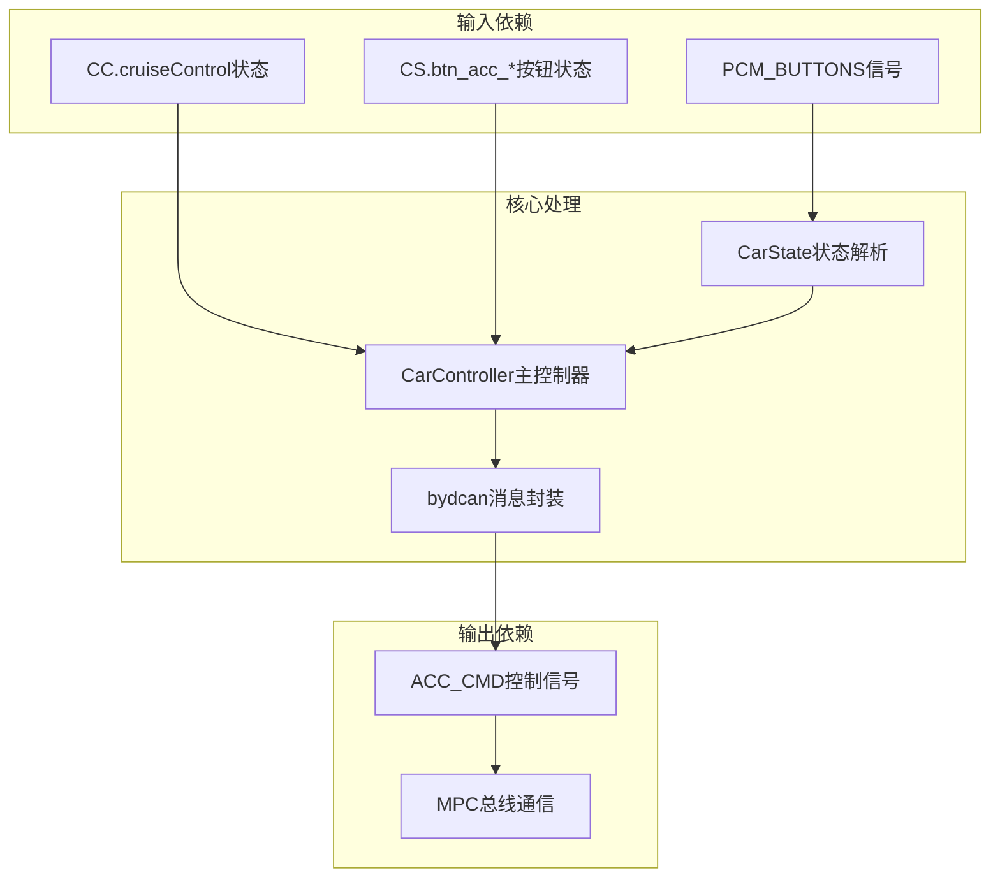
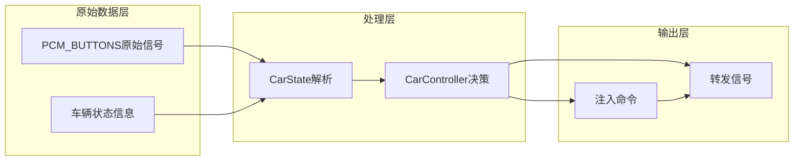
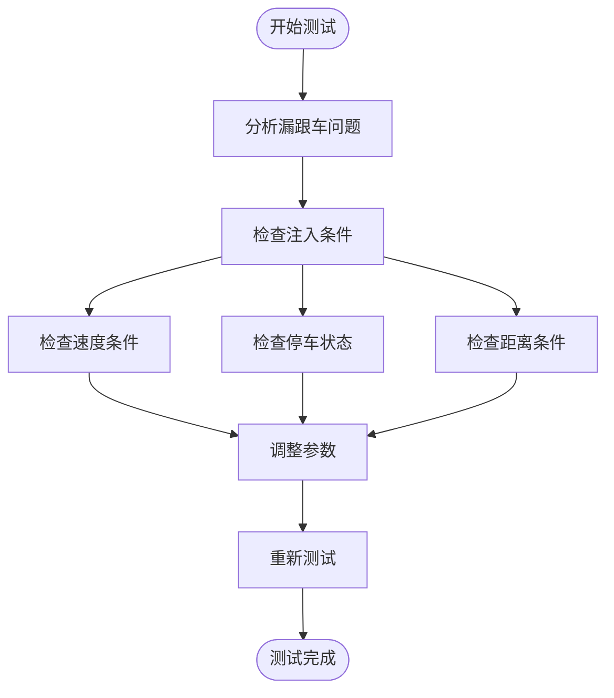

# 按钮注入机制

<cite>
**本文档引用的文件**
- [carcontroller.py](file://opendbc_repo/opendbc/car/byd/carcontroller.py)
- [carstate.py](file://opendbc_repo/opendbc/car/byd/carstate.py)
- [bydcan.py](file://opendbc_repo/opendbc/car/byd/bydcan.py)
- [final_byd_han_comprehensive.dbc](file://final_byd_han_comprehensive.dbc)
- [test_button_injection_logic.py](file://test_button_injection_logic.py)
- [原车acc增强系统设计.md](file://原车acc增强系统设计.md)
</cite>

## 目录
1. [简介](#简介)
2. [项目结构](#项目结构)
3. [核心组件](#核心组件)
4. [架构概览](#架构概览)
5. [详细组件分析](#详细组件分析)
6. [依赖关系分析](#依赖关系分析)
7. [性能考虑](#性能考虑)
8. [故障排除指南](#故障排除指南)
9. [结论](#结论)

## 简介

本文档详细阐述了BYD车辆的按钮注入机制，这是一个复杂的控制系统，负责在特定条件下模拟驾驶员按键操作来增强车辆的自适应巡航控制(ACC)功能。该机制通过检测原车PCM_BUTTONS信号，分析驾驶员意图，并在必要时生成相应的按钮命令来实现更智能的车辆控制。

按钮注入机制的核心价值在于它能够在保持原车ACC功能完整性的同时，提供额外的智能化控制能力。该系统通过精确的时间控制和状态管理，确保不会与原车的ACC系统产生冲突，同时能够响应复杂的驾驶场景需求。

## 项目结构

BYD按钮注入机制涉及多个关键文件和模块：



**图表来源**
- [carcontroller.py:1-260](file://opendbc_repo/opendbc/car/byd/carcontroller.py#L1-L260)
- [carstate.py:1-291](file://opendbc_repo/opendbc/car/byd/carstate.py#L1-L291)
- [bydcan.py:1-198](file://opendbc_repo/opendbc/car/byd/bydcan.py#L1-L198)

**章节来源**
- [carcontroller.py:1-260](file://opendbc_repo/opendbc/car/byd/carcontroller.py#L1-L260)
- [carstate.py:1-291](file://opendbc_repo/opendbc/car/byd/carstate.py#L1-L291)
- [bydcan.py:1-198](file://opendbc_repo/opendbc/car/byd/bydcan.py#L1-L198)

## 核心组件

### 主控制器组件
主控制器负责整个按钮注入逻辑的协调和执行，包括状态管理、条件判断和消息转发。

### 状态解析组件
状态解析器负责从CAN总线接收和解析各种信号，特别是PCM_BUTTONS中的按钮状态信息。

### CAN消息封装组件
CAN消息封装器负责将内部数据结构转换为标准的CAN消息格式，包括适当的校验和计算。

### 信号定义组件
DBC文件定义了所有相关的CAN信号及其语义，为整个系统提供了标准化的通信协议基础。

**章节来源**
- [carcontroller.py:49-52](file://opendbc_repo/opendbc/car/byd/carcontroller.py#L49-L52)
- [carstate.py:76-123](file://opendbc_repo/opendbc/car/byd/carstate.py#L76-L123)
- [bydcan.py:194-198](file://opendbc_repo/opendbc/car/byd/bydcan.py#L194-L198)

## 架构概览

按钮注入机制采用分层架构设计，确保各个组件职责明确且相互独立：



**图表来源**
- [carcontroller.py:205-234](file://opendbc_repo/opendbc/car/byd/carcontroller.py#L205-L234)
- [carstate.py:104-123](file://opendbc_repo/opendbc/car/byd/carstate.py#L104-L123)

该架构的关键特点包括：
- **非侵入式设计**：只在需要时进行按钮注入，其他时间完全透传原车信号
- **安全优先**：所有注入操作都经过安全层验证
- **实时响应**：基于帧计数器的精确时间控制
- **状态隔离**：各组件职责明确，便于维护和调试

## 详细组件分析

### 按钮状态检测机制

按钮状态检测是整个系统的核心，负责准确识别驾驶员的按键意图：



**图表来源**
- [carcontroller.py:245-259](file://opendbc_repo/opendbc/car/byd/carcontroller.py#L245-L259)
- [carstate.py:104-123](file://opendbc_repo/opendbc/car/byd/carstate.py#L104-L123)

### 按钮注入实现逻辑

按钮注入的实现遵循严格的时序控制和状态管理：

#### 注入命令格式
系统支持四种主要的按钮操作，每种都有特定的数值编码：

| 按钮类型 | 数值编码 | 功能描述 |
|---------|---------|----------|
| BTN_AccUpDown_Cmd | 0 | NOTPRESSED（未按下） |
| BTN_AccUpDown_Cmd | 1 | DOWN_SETSPEED（降速） |
| BTN_AccUpDown_Cmd | 3 | UP_RESETSPEED（升速） |
| BTN_AccCancel | 0/1 | 取消按钮（0=未按下，1=按下） |
| BTN_AccDistanceIncrease | 0/1 | 距离增加（0=未按下，1=按下） |
| BTN_AccDistanceDecrease | 0/1 | 距离减少（0=未按下，1=按下） |

#### 注入时序控制
注入操作严格按照预定义的时序执行：

```mermaid
timelineDiagram
title 按钮注入时序图
section 帧0-2：注入脉冲
帧0 : BTN_AccUpDown_Cmd=1<br/>发送降速命令
帧1 : BTN_AccUpDown_Cmd=1<br/>重复降速命令
帧2 : BTN_AccUpDown_Cmd=1<br/>重复降速命令
section 帧3-9：冷却期700ms
帧3-9 : 等待原车处理
section 帧10+：可再次注入
帧10+ : 准备新的注入操作
```

**图表来源**
- [carcontroller.py:214-227](file://opendbc_repo/opendbc/car/byd/carcontroller.py#L214-L227)
- [原车acc增强系统设计.md:2921-2932](file://原车acc增强系统设计.md#L2921-L2932)

### 冷却机制设计

按钮冷却机制是防止系统过度注入的关键安全措施：

#### 冷却计时器管理
冷却机制通过`btn_cooldown_frames`变量实现，确保每次注入后有足够的冷却时间：



**图表来源**
- [carcontroller.py:211-222](file://opendbc_repo/opendbc/car/byd/carcontroller.py#L211-L222)

#### 冷却时间计算
冷却期长度为7帧，按10Hz的帧率计算约为700毫秒。这个时间窗口足以让原车的电子稳定程序(ESP)处理之前的注入操作。

### 注入帧计数器机制

注入帧计数器(`btn_inject_frames_left`)控制着单次注入操作的持续时间：

#### 计数器生命周期


**图表来源**
- [carcontroller.py:213-227](file://opendbc_repo/opendbc/car/byd/carcontroller.py#L213-L227)

### 按钮注入条件分析

系统通过多种条件来确定何时执行按钮注入：

#### 取消操作处理
当检测到驾驶员主动取消ACC时，系统立即清空冷却期并执行取消注入：



**图表来源**
- [carcontroller.py:245-259](file://opendbc_repo/opendbc/car/byd/carcontroller.py#L245-L259)

#### 恢复操作处理
当系统检测到合适的恢复条件时，发送恢复按钮命令：

| 恢复条件 | 按钮编码 | 功能说明 |
|---------|---------|----------|
| CC.cruiseControl.resume | (3, 0, 0, 0) | 发送升速命令 |
| 速度从停止恢复 | (3, 0, 0, 0) | 恢复巡航速度 |

### CAN消息封装和转发

系统使用专门的函数来封装和转发CAN消息：

#### 消息封装流程


**图表来源**
- [bydcan.py:194-198](file://opendbc_repo/opendbc/car/byd/bydcan.py#L194-L198)

#### 校验和计算
系统使用专用的校验和函数确保消息的完整性：

**章节来源**
- [carcontroller.py:205-234](file://opendbc_repo/opendbc/car/byd/carcontroller.py#L205-L234)
- [carstate.py:104-123](file://opendbc_repo/opendbc/car/byd/carstate.py#L104-L123)
- [bydcan.py:9-17](file://opendbc_repo/opendbc/car/byd/bydcan.py#L9-L17)

## 依赖关系分析

按钮注入机制涉及多个组件之间的复杂依赖关系：



**图表来源**
- [carcontroller.py:53-243](file://opendbc_repo/opendbc/car/byd/carcontroller.py#L53-L243)
- [carstate.py:88-255](file://opendbc_repo/opendbc/car/byd/carstate.py#L88-L255)

### 关键依赖关系

1. **状态依赖**：CarController依赖CarState提供的按钮状态信息
2. **控制依赖**：CarController根据CC对象的状态决定注入策略
3. **封装依赖**：bydcan模块提供标准化的消息封装接口
4. **信号依赖**：系统依赖DBC文件中定义的标准信号格式

### 数据流分析

系统的数据流遵循严格的层次结构：



**图表来源**
- [carstate.py:88-255](file://opendbc_repo/opendbc/car/byd/carstate.py#L88-L255)
- [carcontroller.py:53-243](file://opendbc_repo/opendbc/car/byd/carcontroller.py#L53-L243)

**章节来源**
- [carcontroller.py:1-260](file://opendbc_repo/opendbc/car/byd/carcontroller.py#L1-L260)
- [carstate.py:1-291](file://opendbc_repo/opendbc/car/byd/carstate.py#L1-L291)

## 性能考虑

按钮注入机制在设计时充分考虑了性能和实时性要求：

### 时间复杂度分析
- **状态检测**：O(1) - 每帧固定数量的信号读取和解析
- **注入决策**：O(1) - 基于简单条件判断的常量时间操作
- **消息封装**：O(n) - n为消息字段数量，通常很小常数

### 内存使用优化
- **状态缓存**：仅存储必要的按钮状态和计数器
- **消息重用**：使用字典复制避免重复创建对象
- **计数器管理**：使用整数计数器而非复杂数据结构

### 实时性保证
- **帧率同步**：所有计数器基于10Hz的帧率运行
- **时间片分配**：每个组件都有明确的时间片分配
- **中断处理**：关键状态变化立即响应

## 故障排除指南

### 常见问题诊断

#### 注入不生效
**症状**：系统检测到需要注入但实际没有发送按钮信号

**排查步骤**：
1. 检查`btn_inject_frames_left`计数器是否正确设置
2. 验证`btn_cooldown_frames`是否处于冷却状态
3. 确认`_get_button_injection`返回值是否为None

#### 冷却期过长
**症状**：注入后需要很长时间才能再次操作

**排查步骤**：
1. 检查冷却期计数器的递减逻辑
2. 验证帧率是否稳定在10Hz
3. 确认计数器初始化值是否正确

#### 按钮状态错误
**症状**：系统错误识别驾驶员的按键意图

**排查步骤**：
1. 检查PCM_BUTTONS信号的解析逻辑
2. 验证按钮状态的去抖动处理
3. 确认信号值的范围和含义

### 调试工具和方法

#### 测试逻辑分析
系统提供了专门的测试脚本来分析按钮注入逻辑：



**图表来源**
- [test_button_injection_logic.py:8-53](file://test_button_injection_logic.py#L8-L53)

#### 参数优化建议
基于测试结果，系统建议以下参数调整：

| 参数名称 | 当前值 | 建议值 | 调整理由 |
|---------|--------|--------|----------|
| CruiseOnDist | 250 | 200 | 更快触发巡航 |
| StopDistanceCarrot | 400 | 350 | 减少停车距离 |
| VEgoStopping | 20 | 15 | 降低停止检测阈值 |

**章节来源**
- [test_button_injection_logic.py:1-80](file://test_button_injection_logic.py#L1-L80)
- [carcontroller.py:245-259](file://opendbc_repo/opendbc/car/byd/carcontroller.py#L245-L259)

## 结论

BYD按钮注入机制是一个精心设计的控制系统，它成功地在保持原车ACC功能完整性的同时，提供了额外的智能化控制能力。该系统的主要成就包括：

### 技术优势
1. **非侵入式设计**：通过精确的时机控制，避免与原车系统产生冲突
2. **安全优先**：完整的冷却机制和状态管理确保系统安全性
3. **实时响应**：基于帧计数器的精确时序控制
4. **可扩展性**：模块化设计便于功能扩展和维护

### 设计亮点
- **智能注入条件**：基于驾驶员意图和车辆状态的综合判断
- **精确时序控制**：3帧注入脉冲和700ms冷却期的平衡设计
- **状态隔离**：各组件职责明确，便于调试和维护
- **标准化接口**：基于DBC定义的标准化信号格式

### 应用价值
该机制为BYD车辆提供了：
- 更智能的ACC控制体验
- 更好的跟车性能
- 更高的驾驶安全性
- 更流畅的驾驶感受

通过持续的测试和优化，按钮注入机制将继续改进，为用户提供更好的驾驶辅助体验。