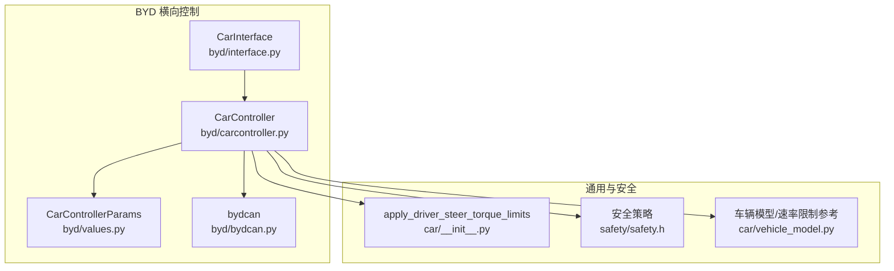
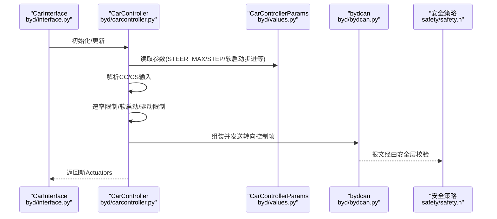
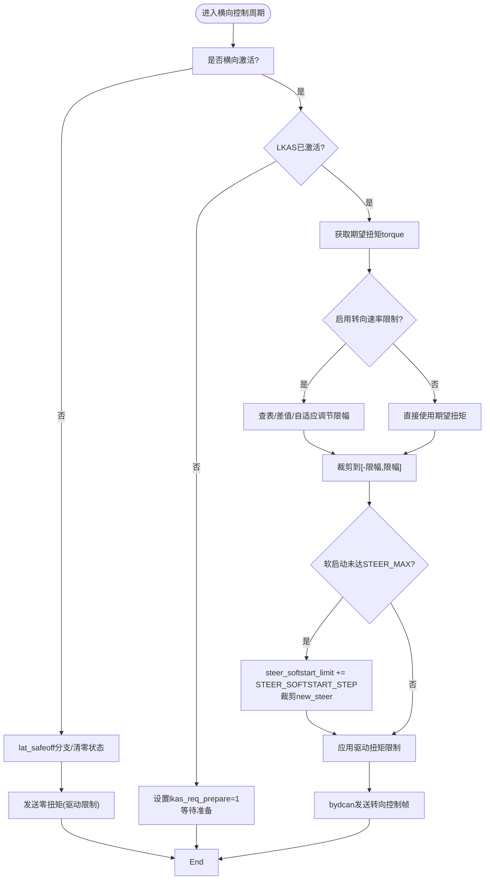
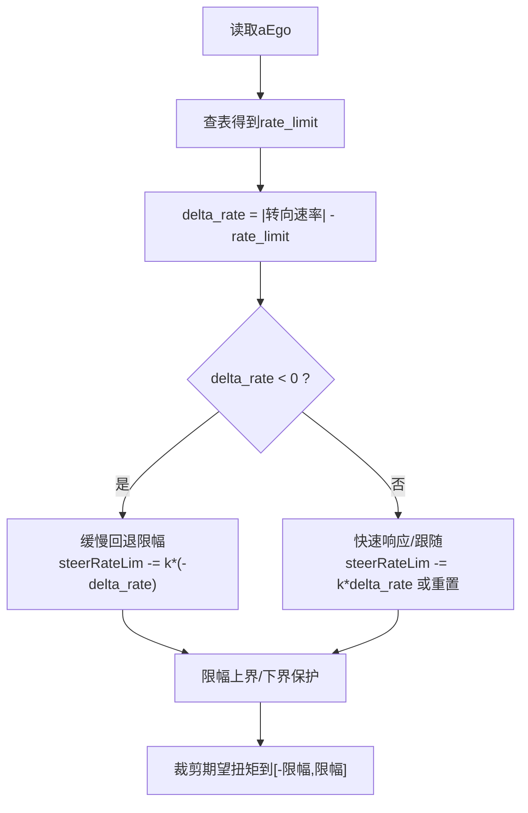
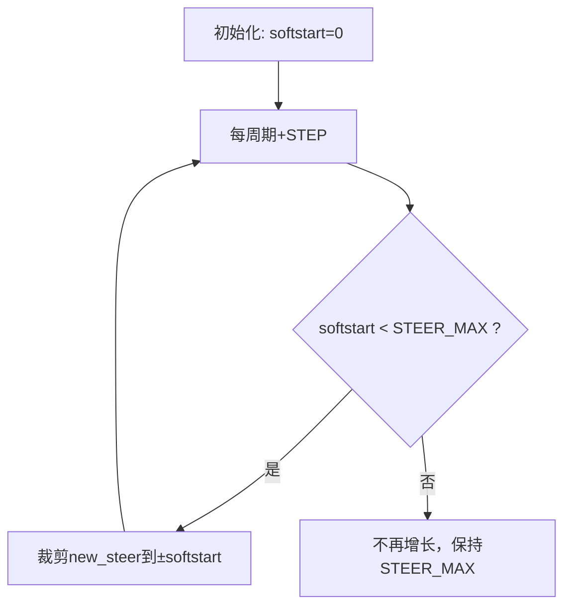
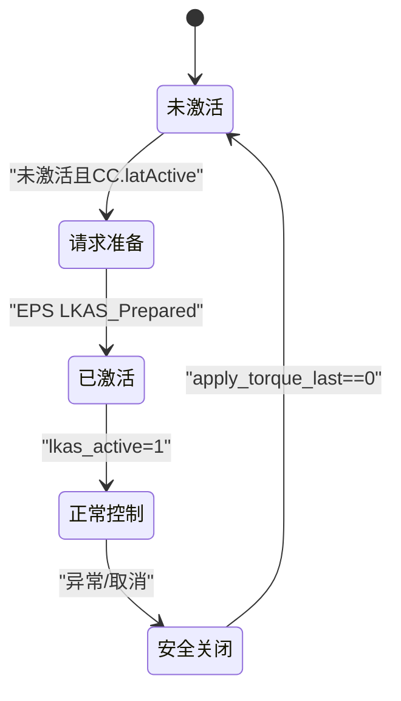
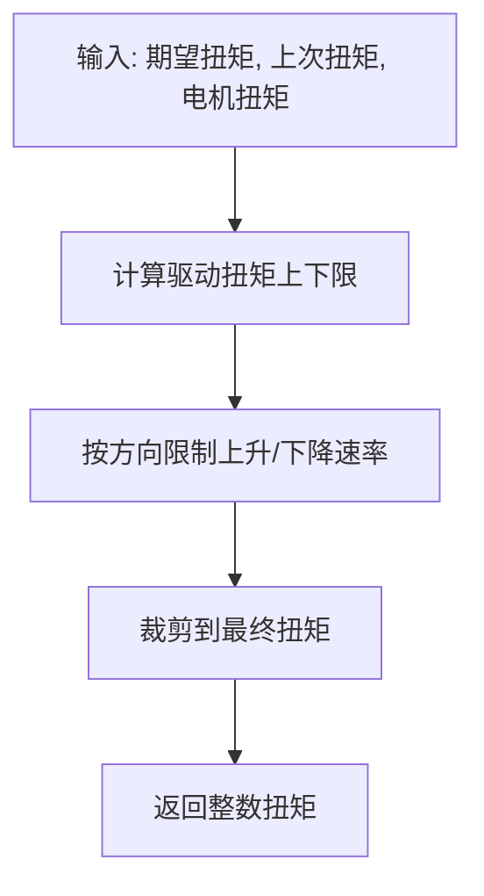
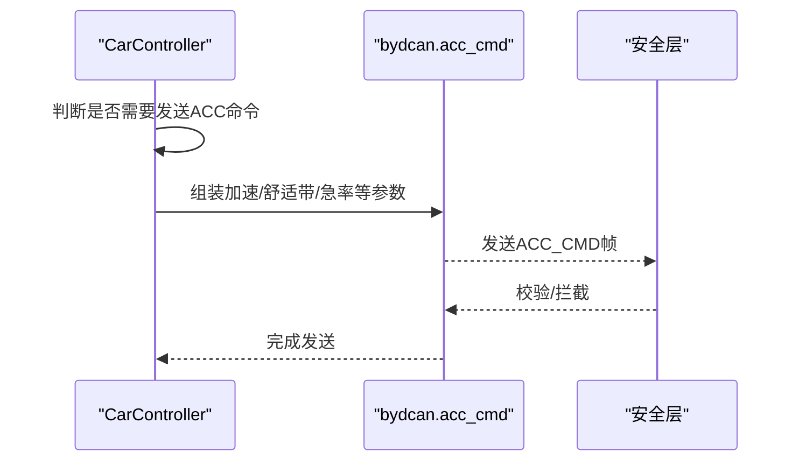
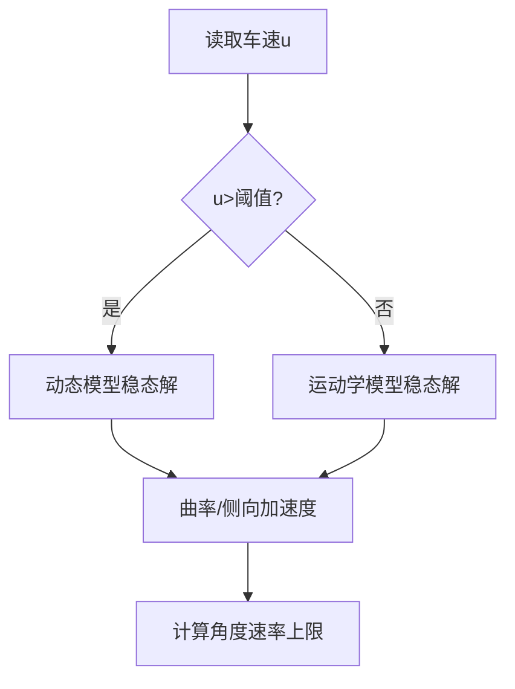
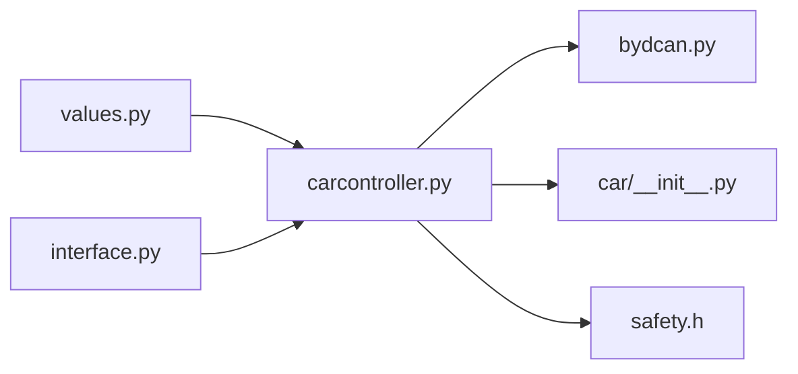

# 横向控制

<cite>
**本文引用的文件**
- [carcontroller.py](file://opendbc_repo/opendbc/car/byd/carcontroller.py)
- [values.py](file://opendbc_repo/opendbc/car/byd/values.py)
- [bydcan.py](file://opendbc_repo/opendbc/car/byd/bydcan.py)
- [interface.py](file://opendbc_repo/opendbc/car/byd/interface.py)
- [__init__.py](file://opendbc_repo/opendbc/car/__init__.py)
- [vehicle_model.py](file://opendbc_repo/opendbc/car/vehicle_model.py)
- [safety.h](file://opendbc_repo/opendbc/safety/safety.h)
</cite>

## 目录
1. [简介](#简介)
2. [项目结构](#项目结构)
3. [核心组件](#核心组件)
4. [架构总览](#架构总览)
5. [详细组件分析](#详细组件分析)
6. [依赖分析](#依赖分析)
7. [性能考量](#性能考量)
8. [故障排查指南](#故障排查指南)
9. [结论](#结论)
10. [附录](#附录)

## 简介
本文件面向BYD横向控制模块，聚焦以下目标：
- 转向控制算法：方向盘扭矩计算与执行器控制流程
- 转向速率限制机制：USE_STEERING_SPEED_LIMITER 参数作用与动态速率限制算法
- 软启动机制：steer_softstart_limit 与 STEER_SOFTSTART_STEP 的影响
- LKAS 状态管理：lkas_active、lkas_req_prepare、lat_safeoff 的作用与流转
- 转向扭矩限制函数 apply_driver_steer_torque_limits 的应用场景
- 与纵向控制的协调：ACC 命令发送与安全层交互
- 转向角与车速关系处理：基于车辆动力学模型的速率限制思路

## 项目结构
BYD横向控制位于 opendbc 的 BYD 平台子模块中，关键文件如下：
- 控制器实现：opendbc_repo/opendbc/car/byd/carcontroller.py
- 参数与平台配置：opendbc_repo/opendbc/car/byd/values.py
- CAN 报文封装：opendbc_repo/opendbc/car/byd/bydcan.py
- 接口与调参：opendbc_repo/opendbc/car/byd/interface.py
- 通用限制函数与安全策略：opendbc_repo/opendbc/car/__init__.py、opendbc_repo/opendbc/safety/safety.h
- 车辆动力学模型（速率限制参考）：opendbc_repo/opendbc/car/vehicle_model.py

**图示来源**
- [carcontroller.py:53-243](file://opendbc_repo/opendbc/car/byd/carcontroller.py#L53-L243)
- [values.py:10-40](file://opendbc_repo/opendbc/car/byd/values.py#L10-L40)
- [bydcan.py:21-71](file://opendbc_repo/opendbc/car/byd/bydcan.py#L21-L71)
- [interface.py:36-154](file://opendbc_repo/opendbc/car/byd/interface.py#L36-L154)
- [__init__.py:106-121](file://opendbc_repo/opendbc/car/__init__.py#L106-L121)
- [vehicle_model.py:48-149](file://opendbc_repo/opendbc/car/vehicle_model.py#L48-L149)
- [safety.h:782-806](file://opendbc_repo/opendbc/safety/safety.h#L782-L806)

**章节来源**
- [carcontroller.py:53-243](file://opendbc_repo/opendbc/car/byd/carcontroller.py#L53-L243)
- [values.py:10-40](file://opendbc_repo/opendbc/car/byd/values.py#L10-L40)
- [bydcan.py:21-71](file://opendbc_repo/opendbc/car/byd/bydcan.py#L21-L71)
- [interface.py:36-154](file://opendbc_repo/opendbc/car/byd/interface.py#L36-L154)

## 核心组件
- 转向控制主循环：在控制器 update 中按 STEER_STEP 周期处理横向请求
- 速率限制器：USE_STEERING_SPEED_LIMITER 开关与基于车速的动态速率限制
- 软启动：steer_softstart_limit 逐步提升至 STEER_MAX，平滑起步
- LKAS 状态机：lkas_req_prepare、lkas_active、lat_safeoff 的三态流转
- 执行器输出：通过 bydcan 将 LKAS 输出与状态写入 CAN
- 驱动扭矩限制：apply_driver_steer_torque_limits 综合多约束裁剪输出

**章节来源**
- [carcontroller.py:53-129](file://opendbc_repo/opendbc/car/byd/carcontroller.py#L53-L129)
- [values.py:10-40](file://opendbc_repo/opendbc/car/byd/values.py#L10-L40)
- [bydcan.py:21-71](file://opendbc_repo/opendbc/car/byd/bydcan.py#L21-L71)
- [__init__.py:106-121](file://opendbc_repo/opendbc/car/__init__.py#L106-L121)

## 架构总览
BYD横向控制采用“控制器-参数-报文封装-安全策略”的分层设计。控制器根据 CC/CS 输入生成转向扭矩，并通过 bydcan 发送至 EPS；同时受驱动扭矩限制与安全策略约束。

**图示来源**
- [interface.py:36-154](file://opendbc_repo/opendbc/car/byd/interface.py#L36-L154)
- [carcontroller.py:53-243](file://opendbc_repo/opendbc/car/byd/carcontroller.py#L53-L243)
- [values.py:10-40](file://opendbc_repo/opendbc/car/byd/values.py#L10-L40)
- [bydcan.py:21-71](file://opendbc_repo/opendbc/car/byd/bydcan.py#L21-L71)
- [safety.h:782-806](file://opendbc_repo/opendbc/safety/safety.h#L782-L806)

## 详细组件分析

### 转向控制算法与执行器控制
- 输入来源：CC.actuators.torque（期望扭矩）、CS（传感器状态）
- 处理步骤：
  1) 若启用 USE_STEERING_SPEED_LIMITER，则根据车速 aEgo 查表得到速率上限，计算当前转向速率与上限差值，动态调整内部限幅系数 steerRateLim
  2) 对期望扭矩进行裁剪与量化，得到 new_steer
  3) 软启动阶段逐步提升 steer_softstart_limit 至 STEER_MAX，进一步裁剪 new_steer
  4) 应用驱动扭矩限制 apply_driver_steer_torque_limits，综合历史扭矩与驾驶员扭矩约束
  5) 通过 bydcan.create_steering_control 发送 LKAS 控制帧，包含 LKAS_Active/LKAS_State/LKAS_Output 等字段
- 输出：apply_torque 写入 CAN，供 EPS 执行

**图示来源**
- [carcontroller.py:65-129](file://opendbc_repo/opendbc/car/byd/carcontroller.py#L65-L129)
- [bydcan.py:21-71](file://opendbc_repo/opendbc/car/byd/bydcan.py#L21-L71)
- [__init__.py:106-121](file://opendbc_repo/opendbc/car/__init__.py#L106-L121)

**章节来源**
- [carcontroller.py:65-129](file://opendbc_repo/opendbc/car/byd/carcontroller.py#L65-L129)
- [bydcan.py:21-71](file://opendbc_repo/opendbc/car/byd/bydcan.py#L21-L71)
- [__init__.py:106-121](file://opendbc_repo/opendbc/car/__init__.py#L106-L121)

### 转向速率限制机制（USE_STEERING_SPEED_LIMITER）
- 参数开关：USE_STEERING_SPEED_LIMITER（values.py 中当前为 False，但算法已在 carcontroller.py 中实现）
- 动态算法：
  - 基于车速 aEgo 在区间 [8.3, 27.8] 上查表得到速率上限 rate_limit
  - 计算 delta_rate = 当前转向速率绝对值 - rate_limit
  - 若 delta_rate < 0，缓慢回退限幅；若 delta_rate ≥ 0，按比例快速响应，保证跟随性
  - 限幅范围 [0, 1]，最终裁剪期望扭矩
- 作用：抑制低速大速率输入带来的不稳定，提升循迹稳定性

**图示来源**
- [carcontroller.py:69-95](file://opendbc_repo/opendbc/car/byd/carcontroller.py#L69-L95)
- [values.py](file://opendbc_repo/opendbc/car/byd/values.py#L30)

**章节来源**
- [carcontroller.py:69-95](file://opendbc_repo/opendbc/car/byd/carcontroller.py#L69-L95)
- [values.py](file://opendbc_repo/opendbc/car/byd/values.py#L30)

### 软启动机制（steer_softstart_limit 与 STEER_SOFTSTART_STEP）
- 目标：避免起步瞬间扭矩突增，改善人机感受与执行器冲击
- 工作方式：
  - 初始化 steer_softstart_limit = 0
  - 每个 STEER_STEP 周期增加 STEER_SOFTSTART_STEP，逐步提升上限
  - 将 new_steer 裁剪到 [-steer_softstart_limit, steer_softstart_limit]
  - 当达到 STEER_MAX 后停止增长
- 参数影响：
  - STEER_SOFTSTART_STEP 越大，软启动越快完成
  - STEER_MAX 决定最终上限

**图示来源**
- [carcontroller.py:99-101](file://opendbc_repo/opendbc/car/byd/carcontroller.py#L99-L101)
- [values.py](file://opendbc_repo/opendbc/car/byd/values.py#L21)

**章节来源**
- [carcontroller.py:99-101](file://opendbc_repo/opendbc/car/byd/carcontroller.py#L99-L101)
- [values.py](file://opendbc_repo/opendbc/car/byd/values.py#L21)

### LKAS 状态管理（lkas_active/lkas_req_prepare/lat_safeoff）
- 状态机流转：
  - 未激活：lkas_req_prepare=1（请求准备），等待 EPS LKAS_Prepared
  - LKAS 准备就绪：lkas_active=1，清除限幅，进入正常控制
  - 安全关闭：lat_safeoff=1，等待 apply_torque_last 清零后退出
  - 退出：清空 prepare/active/softstart 等标志
- 作用：确保与 EPS 的 LKAS 协同，避免误触发与安全风险

**图示来源**
- [carcontroller.py:105-127](file://opendbc_repo/opendbc/car/byd/carcontroller.py#L105-L127)
- [bydcan.py:141-191](file://opendbc_repo/opendbc/car/byd/bydcan.py#L141-L191)

**章节来源**
- [carcontroller.py:105-127](file://opendbc_repo/opendbc/car/byd/carcontroller.py#L105-L127)
- [bydcan.py:141-191](file://opendbc_repo/opendbc/car/byd/bydcan.py#L141-L191)

### 转向扭矩限制函数（apply_driver_steer_torque_limits）
- 场景：
  - 驱动扭矩约束：防止超过电机允许的最大扭矩与驾驶员扭矩叠加限制
  - 速率约束：对扭矩变化率进行上下限限制，避免突变
- 流程要点：
  - 基于 STEER_MAX 与驾驶员扭矩、允许余量、因子与倍数计算上下限
  - 根据上次扭矩方向与幅度，分别限制上升/下降速率
  - 最终四舍五入为整数输出

**图示来源**
- [__init__.py:106-121](file://opendbc_repo/opendbc/car/__init__.py#L106-L121)

**章节来源**
- [__init__.py:106-121](file://opendbc_repo/opendbc/car/__init__.py#L106-L121)

### 与纵向控制的协调（ACC 命令与安全层）
- 横向控制周期内，控制器按 ACC_STEP 发送 ACC 命令（如需要），并通过 bydcan.acc_cmd 组装报文
- 安全层通过 CheckSum 校验与安全参数拦截/放行，避免与原车 ACC 冲突
- 当退出增强模式时，仅允许减速或保持，禁止正向加速度

**图示来源**
- [carcontroller.py:145-203](file://opendbc_repo/opendbc/car/byd/carcontroller.py#L145-L203)
- [bydcan.py:75-137](file://opendbc_repo/opendbc/car/byd/bydcan.py#L75-L137)
- [safety.h:782-806](file://opendbc_repo/opendbc/safety/safety.h#L782-L806)

**章节来源**
- [carcontroller.py:145-203](file://opendbc_repo/opendbc/car/byd/carcontroller.py#L145-L203)
- [bydcan.py:75-137](file://opendbc_repo/opendbc/car/byd/bydcan.py#L75-L137)

### 转向角与车速的关系处理
- 速率限制参考：车辆模型提供基于车速的速度域切换与稳态解，可作为角度模式下的速率限制依据
- 实际 BYD 算法采用“基于转向速率的动态限幅”，而非直接角度速率限制
- 若未来扩展为角度模式，可借鉴 vehicle_model 的曲线/侧向加速度与角度速率关系，结合安全层 ISO 11270 限制

**图示来源**
- [vehicle_model.py:48-149](file://opendbc_repo/opendbc/car/vehicle_model.py#L48-L149)
- [safety.h:798-806](file://opendbc_repo/opendbc/safety/safety.h#L798-L806)

**章节来源**
- [vehicle_model.py:48-149](file://opendbc_repo/opendbc/car/vehicle_model.py#L48-L149)
- [safety.h:798-806](file://opendbc_repo/opendbc/safety/safety.h#L798-L806)

## 依赖分析
- 控制器依赖参数模块提供的 STEER_MAX、STEER_SOFTSTART_STEP、USE_STEERING_SPEED_LIMITER 等
- 报文封装依赖 CAN 字段映射与校验函数
- 限制函数与安全策略共同保障输出安全边界
- 接口负责平台差异与调参入口

**图示来源**
- [values.py:10-40](file://opendbc_repo/opendbc/car/byd/values.py#L10-L40)
- [carcontroller.py:53-243](file://opendbc_repo/opendbc/car/byd/carcontroller.py#L53-L243)
- [bydcan.py:21-71](file://opendbc_repo/opendbc/car/byd/bydcan.py#L21-L71)
- [__init__.py:106-121](file://opendbc_repo/opendbc/car/__init__.py#L106-L121)
- [interface.py:36-154](file://opendbc_repo/opendbc/car/byd/interface.py#L36-L154)
- [safety.h:782-806](file://opendbc_repo/opendbc/safety/safety.h#L782-L806)

**章节来源**
- [values.py:10-40](file://opendbc_repo/opendbc/car/byd/values.py#L10-L40)
- [carcontroller.py:53-243](file://opendbc_repo/opendbc/car/byd/carcontroller.py#L53-L243)
- [bydcan.py:21-71](file://opendbc_repo/opendbc/car/byd/bydcan.py#L21-L71)
- [__init__.py:106-121](file://opendbc_repo/opendbc/car/__init__.py#L106-L121)
- [interface.py:36-154](file://opendbc_repo/opendbc/car/byd/interface.py#L36-L154)
- [safety.h:782-806](file://opendbc_repo/opendbc/safety/safety.h#L782-L806)

## 性能考量
- 控制周期：STEER_STEP=2（50Hz），兼顾响应性与功耗
- 软启动时间：STEER_SOFTSTART_STEP=6，约在 1 秒内达到 STEER_MAX，平衡平顺性与响应性
- 速率限制：USE_STEERING_SPEED_LIMITER 已实现，建议在低速场景开启以提升稳定性
- 安全边界：驱动扭矩限制与安全层共同作用，避免超限与误动作

[本节为通用指导，无需具体文件引用]

## 故障排查指南
- LKAS 无法激活
  - 检查 lkas_req_prepare 是否持续置位，确认 EPS LKAS_Prepared 信号
  - 参考路径：[carcontroller.py:105-114](file://opendbc_repo/opendbc/car/byd/carcontroller.py#L105-L114)
- 转向抖动或突变
  - 检查 STEER_SOFTSTART_STEP 是否过大，或驱动扭矩限制是否频繁触发
  - 参考路径：[carcontroller.py:99-103](file://opendbc_repo/opendbc/car/byd/carcontroller.py#L99-L103)、[__init__.py:106-121](file://opendbc_repo/opendbc/car/__init__.py#L106-L121)
- 低速不稳定
  - 建议启用 USE_STEERING_SPEED_LIMITER，检查速率限制参数
  - 参考路径：[carcontroller.py:69-95](file://opendbc_repo/opendbc/car/byd/carcontroller.py#L69-L95)、[values.py](file://opendbc_repo/opendbc/car/byd/values.py#L30)
- 安全层拦截ACC命令
  - 检查 bydcan.acc_cmd 的参数与校验，确保仅在需要时发送
  - 参考路径：[bydcan.py:75-137](file://opendbc_repo/opendbc/car/byd/bydcan.py#L75-L137)、[safety.h:782-806](file://opendbc_repo/opendbc/safety/safety.h#L782-L806)

**章节来源**
- [carcontroller.py:69-114](file://opendbc_repo/opendbc/car/byd/carcontroller.py#L69-L114)
- [bydcan.py:75-137](file://opendbc_repo/opendbc/car/byd/bydcan.py#L75-L137)
- [__init__.py:106-121](file://opendbc_repo/opendbc/car/__init__.py#L106-L121)
- [safety.h:782-806](file://opendbc_repo/opendbc/safety/safety.h#L782-L806)

## 结论
BYD横向控制通过参数化速率限制、软启动与驱动扭矩限制，实现了稳定且可调的转向控制。LKAS 状态机与 CAN 报文封装确保与 EPS 的协同与安全。纵向控制通过 ACC 命令与安全层配合，避免与原车系统冲突。建议在低速场景启用转向速率限制，并根据实车特性微调 STEER_SOFTSTART_STEP 与 STEER_MAX，以获得更佳的人机体验与安全性。

[本节为总结，无需具体文件引用]

## 附录
- 参数速览（摘自 values.py）
  - STEER_MAX：最大转向扭矩
  - STEER_SOFTSTART_STEP：软启动步进
  - STEER_STEP：横向控制周期
  - USE_STEERING_SPEED_LIMITER：是否启用转向速率限制
- CAN 报文要点（摘自 bydcan.py）
  - create_steering_control：包含 LKAS_Active/LKAS_State/LKAS_Output/LKAS_ReqPrepare/Counter 等
  - create_fake_318：伪造 EPS 信号，维持安全功能可用
  - acc_cmd：ACC 命令帧，含舒适带与急率参数

**章节来源**
- [values.py:10-40](file://opendbc_repo/opendbc/car/byd/values.py#L10-L40)
- [bydcan.py:21-71](file://opendbc_repo/opendbc/car/byd/bydcan.py#L21-L71)
- [bydcan.py:141-191](file://opendbc_repo/opendbc/car/byd/bydcan.py#L141-L191)
- [bydcan.py:75-137](file://opendbc_repo/opendbc/car/byd/bydcan.py#L75-L137)