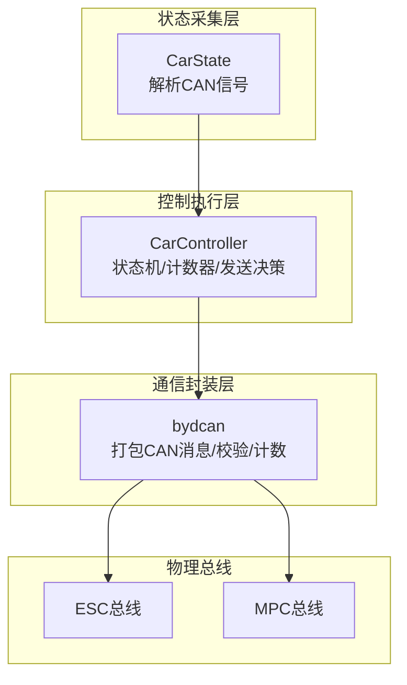
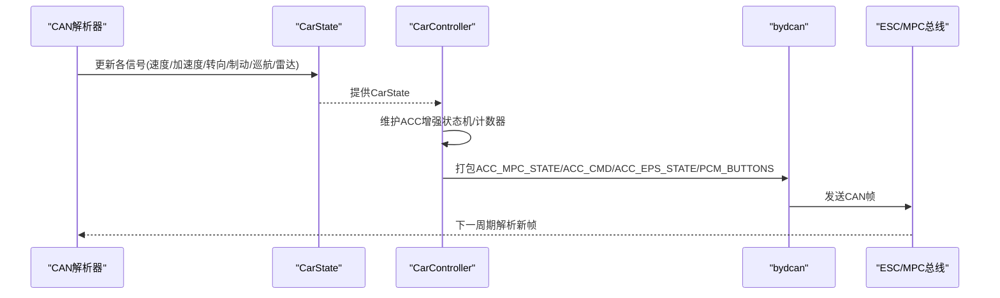
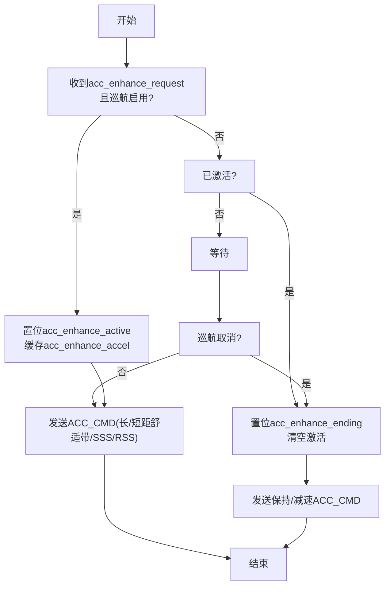
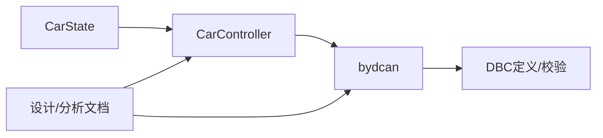

# 状态监测

<cite>
**本文引用的文件**
- [opendbc_repo/opendbc/car/byd/carstate.py](file://opendbc_repo/opendbc/car/byd/carstate.py)
- [opendbc_repo/opendbc/car/byd/carcontroller.py](file://opendbc_repo/opendbc/car/byd/carcontroller.py)
- [opendbc_repo/opendbc/car/byd/bydcan.py](file://opendbc_repo/opendbc/car/byd/bydcan.py)
- [docs/byd_acc_analysis_guide.md](file://docs/byd_acc_analysis_guide.md)
- [原车acc增强系统设计.md](file://原车acc增强系统设计.md)
- [原车acc增强系统重构文档.md](file://原车acc增强系统重构文档.md)
- [docs/byd_radar_integration.md](file://docs/byd_radar_integration.md)
</cite>

## 目录
1. [简介](#简介)
2. [项目结构](#项目结构)
3. [核心组件](#核心组件)
4. [架构总览](#架构总览)
5. [详细组件分析](#详细组件分析)
6. [依赖关系分析](#依赖关系分析)
7. [性能考量](#性能考量)
8. [故障排查指南](#故障排查指南)
9. [结论](#结论)
10. [附录](#附录)

## 简介
本文件面向BYD状态监测模块，聚焦车辆状态的实时监测与反馈机制，覆盖速度、位置、姿态及各类传感器数据；重点阐述ACC增强状态管理（acc_enhance_active、acc_enhance_ending等）、计数器机制（mpc_lkas_counter、mpc_acc_counter、eps_fake318_counter）以及关键状态标志位（如standstill、lkas_prepared、lat_safeoff）的含义与转换逻辑。文档结合实际代码库中的实现路径，给出状态监测对控制算法的影响与状态变化对车辆行为的控制作用。

## 项目结构
BYD状态监测涉及三层协同：
- 状态采集层：从CAN总线解析各信号，构建CarState对象，提供速度、加速度、角速度、制动/油门、转向角/率、巡航状态、雷达目标等。
- 控制执行层：CarController基于CarState与控制意图，生成转向与纵向控制CAN帧，维护ACC增强状态机与计数器。
- 通信封装层：bydcan负责将控制参数打包为具体CAN消息（ACC_MPC_STATE、ACC_CMD、ACC_EPS_STATE、PCM_BUTTONS等），并计算校验与计数。

图表来源
- [opendbc_repo/opendbc/car/byd/carstate.py:88-255](file://opendbc_repo/opendbc/car/byd/carstate.py#L88-L255)
- [opendbc_repo/opendbc/car/byd/carcontroller.py:53-243](file://opendbc_repo/opendbc/car/byd/carcontroller.py#L53-L243)
- [opendbc_repo/opendbc/car/byd/bydcan.py:21-197](file://opendbc_repo/opendbc/car/byd/bydcan.py#L21-L197)

章节来源
- [opendbc_repo/opendbc/car/byd/carstate.py:88-255](file://opendbc_repo/opendbc/car/byd/carstate.py#L88-L255)
- [opendbc_repo/opendbc/car/byd/carcontroller.py:53-243](file://opendbc_repo/opendbc/car/byd/carcontroller.py#L53-L243)
- [opendbc_repo/opendbc/car/byd/bydcan.py:21-197](file://opendbc_repo/opendbc/car/byd/bydcan.py#L21-L197)

## 核心组件
- CarState：负责从多路CAN解析并聚合车辆状态，包括速度、加速度、角速度、制动/油门、转向角/率、巡航状态、雷达目标等；同时维护ACC增强相关标志位与计数器来源。
- CarController：维护ACC增强状态机（acc_enhance_active/ending）、纵向控制决策（长/短距舒适带、急加减速度限制、停止/启动态标记）、计数器同步与递增、按钮注入转发。
- bydcan：封装CAN消息打包、校验与计数，生成ACC_MPC_STATE、ACC_CMD、ACC_EPS_STATE、PCM_BUTTONS等消息。

章节来源
- [opendbc_repo/opendbc/car/byd/carstate.py:26-86](file://opendbc_repo/opendbc/car/byd/carstate.py#L26-L86)
- [opendbc_repo/opendbc/car/byd/carcontroller.py:13-52](file://opendbc_repo/opendbc/car/byd/carcontroller.py#L13-L52)
- [opendbc_repo/opendbc/car/byd/bydcan.py:9-197](file://opendbc_repo/opendbc/car/byd/bydcan.py#L9-L197)

## 架构总览
BYD状态监测以“状态采集—控制执行—通信封装”为主线，形成闭环：
- 状态采集：从ESC/MPC总线解析关键信号，构建CarState。
- 控制执行：CarController依据CarState与控制意图，更新ACC增强状态机与计数器，决定是否发送纵向控制帧。
- 通信封装：bydcan按DBC定义打包消息，设置Counter与Checksum，经Panda转发至对应总线。

图表来源
- [opendbc_repo/opendbc/car/byd/carstate.py:88-255](file://opendbc_repo/opendbc/car/byd/carstate.py#L88-L255)
- [opendbc_repo/opendbc/car/byd/carcontroller.py:53-243](file://opendbc_repo/opendbc/car/byd/carcontroller.py#L53-L243)
- [opendbc_repo/opendbc/car/byd/bydcan.py:21-197](file://opendbc_repo/opendbc/car/byd/bydcan.py#L21-L197)

## 详细组件分析

### CarState：状态采集与标志位
- 速度与加速度
  - 采用仪表显示速度换算为vEgo，并融合轴向/横向加速度与角速度，提供稳定的纵向/横向动态输入。
- 巡航状态与HUD/MPU状态
  - 依据ACC_HUD_ADAS与PCM_BUTTONS信号综合判断cruiseState.enabled与AccState，考虑AccOn1辅助字段以识别AccState=4的激活情形。
- 传感器与安全状态
  - 从EPS/AXAY/YAW_RATE/BCM/PEDAL等信号提取转向角/率、制动/油门、驻车/门状态等；设置临时/永久性转向故障标志。
- ACC增强相关标志位
  - acc_enhance_request/acc_enhance_accel/acc_enhance_scene/acc_enhance_ending：由上层决策模块写入，CarController据此驱动ACC增强状态机。
- 计数器来源
  - 从ACC_HUD_ADAS、ACC_MPC_STATE、ACC_CMD、ACC_EPS_STATE等消息中读取Counter，用于后续同步与递增。

章节来源
- [opendbc_repo/opendbc/car/byd/carstate.py:88-255](file://opendbc_repo/opendbc/car/byd/carstate.py#L88-L255)
- [原车acc增强系统设计.md:1858-1896](file://原车acc增强系统设计.md#L1858-L1896)

### CarController：ACC增强状态机与计数器
- ACC增强状态机
  - acc_enhance_active：指示当前是否处于ACC增强减速阶段。
  - acc_enhance_ending：指示增强阶段即将结束，需发送“保持/减速”帧以避免与原车ACC冲突。
  - 状态转换条件：
    - 收到CS.acc_enhance_request且巡航启用：若未激活则置位acc_enhance_active，并缓存CS.acc_enhance_accel。
    - 未收到请求且已激活：置位acc_enhance_ending并清空激活。
    - 巡航取消：若仍激活则置位acc_enhance_ending。
- 纵向控制决策
  - longActive为真时，使用CC.actuators.accel并设置rfss/sss以表达停止/启动态；否则在增强模式下使用缓存的CS.acc_enhance_accel并设置ss为是否停车态。
  - ACC_CMD中AccControlActive=1以触发安全层阻断原车ACC_CMD，实现openpilot纵向控制接管。
- 计数器机制
  - mpc_lkas_counter、eps_fake318_counter按帧周期递增并按0xF掩码循环；首帧根据CS中Counter初始值对齐，确保与原车信号一致。
  - mpc_acc_counter用于ACC_CMD计数，同样在首帧对齐。

图表来源
- [opendbc_repo/opendbc/car/byd/carcontroller.py:145-203](file://opendbc_repo/opendbc/car/byd/carcontroller.py#L145-L203)

章节来源
- [opendbc_repo/opendbc/car/byd/carcontroller.py:131-165](file://opendbc_repo/opendbc/car/byd/carcontroller.py#L131-L165)
- [opendbc_repo/opendbc/car/byd/carcontroller.py:165-203](file://opendbc_repo/opendbc/car/byd/carcontroller.py#L165-L203)

### bydcan：消息打包、校验与计数
- ACC_MPC_STATE：封装LKAS相关字段，按需设置ReqPrepare/Active/State/Lane状态，携带Counter与Checksum。
- ACC_CMD：根据长/短距舒适带、急加减速度限制、停止/启动态标记与AccControlActive，打包纵向控制命令。
- ACC_EPS_STATE：伪造扭矩反馈以欺骗MPC，维持AEB等安全功能可用。
- PCM_BUTTONS：转发按键状态，必要时注入恢复/取消等指令。

章节来源
- [opendbc_repo/opendbc/car/byd/bydcan.py:21-197](file://opendbc_repo/opendbc/car/byd/bydcan.py#L21-L197)

### 关键状态标志位与含义
- standstill：基于仪表显示车速为0判定，用于纵向控制与ACC_CMD的停止态标记。
- lkas_prepared：EPS侧LKAS准备就绪信号，影响横向控制进入与安全保护。
- lat_safeoff：横向控制安全保护标志，防止在特定条件下施加转向力矩。
- acc_enhance_request/acc_enhance_accel/acc_enhance_scene/acc_enhance_ending：ACC增强状态机的输入与中间状态，分别表示是否请求增强、目标减速度、场景编号与结束阶段。

章节来源
- [opendbc_repo/opendbc/car/byd/carstate.py:147-148](file://opendbc_repo/opendbc/car/byd/carstate.py#L147-L148)
- [opendbc_repo/opendbc/car/byd/carstate.py:94-94](file://opendbc_repo/opendbc/car/byd/carstate.py#L94-L94)
- [opendbc_repo/opendbc/car/byd/carcontroller.py:31-31](file://opendbc_repo/opendbc/car/byd/carcontroller.py#L31-L31)
- [opendbc_repo/opendbc/car/byd/carcontroller.py:45-47](file://opendbc_repo/opendbc/car/byd/carcontroller.py#L45-L47)

### 计数器机制与更新逻辑
- mpc_lkas_counter：每帧递增并按0xF掩码循环，首帧根据CS.acc_mpc_state_counter对齐。
- mpc_acc_counter：每帧递增并按0xF掩码循环，首帧根据CS.acc_cmd_counter对齐。
- eps_fake318_counter：每帧递增并按0xF掩码循环，首帧根据CS.eps_state_counter对齐。
- 作用：确保与原车信号的计数一致性，避免MPC/安全系统误判。

章节来源
- [opendbc_repo/opendbc/car/byd/carcontroller.py:56-61](file://opendbc_repo/opendbc/car/byd/carcontroller.py#L56-L61)
- [opendbc_repo/opendbc/car/byd/carcontroller.py:131-132](file://opendbc_repo/opendbc/car/byd/carcontroller.py#L131-L132)

### 状态转换触发条件与处理逻辑
- ACC增强激活
  - 条件：CS.cruiseState.enabled为真且CS.acc_enhance_request为真。
  - 处理：置位acc_enhance_active并缓存CS.acc_enhance_accel；同时设置rfss/sss以表达停止/启动态。
- ACC增强结束
  - 条件：CS.acc_enhance_request为假或巡航取消。
  - 处理：置位acc_enhance_ending，发送保持/减速ACC_CMD，随后清空ending与缓存。
- 纵向控制接管
  - 条件：CC.longActive为真或增强模式激活。
  - 处理：设置AccControlActive=1以阻断原车ACC_CMD，发送ACC_CMD并更新apply_accel_last。

章节来源
- [opendbc_repo/opendbc/car/byd/carcontroller.py:145-203](file://opendbc_repo/opendbc/car/byd/carcontroller.py#L145-L203)
- [opendbc_repo/opendbc/car/byd/bydcan.py:109-133](file://opendbc_repo/opendbc/car/byd/bydcan.py#L109-L133)

### 状态监测对控制算法的影响
- 速度/加速度/角速度：为纵向与横向控制提供基础输入，影响舒适带与急加减速度限制。
- 巡航状态：决定ACC增强是否可触发与ACC_CMD发送策略。
- 传感器数据：制动/油门、转向角/率、EPS故障等直接影响安全边界与控制策略。
- ACC增强状态：通过AccControlActive与rfss/sss标记，协调openpilot纵向控制与原车ACC的关系，避免冲突并保证安全。

章节来源
- [opendbc_repo/opendbc/car/byd/carstate.py:135-146](file://opendbc_repo/opendbc/car/byd/carstate.py#L135-L146)
- [opendbc_repo/opendbc/car/byd/bydcan.py:109-133](file://opendbc_repo/opendbc/car/byd/bydcan.py#L109-L133)

## 依赖关系分析
- CarController依赖CarState提供的状态与标志位，以及bydcan的消息打包能力。
- bydcan依赖DBC定义与校验函数，确保消息字段与计数器符合规范。
- 文档与设计说明为实现提供约束与验证依据。

图表来源
- [opendbc_repo/opendbc/car/byd/carstate.py:88-255](file://opendbc_repo/opendbc/car/byd/carstate.py#L88-L255)
- [opendbc_repo/opendbc/car/byd/carcontroller.py:53-243](file://opendbc_repo/opendbc/car/byd/carcontroller.py#L53-L243)
- [opendbc_repo/opendbc/car/byd/bydcan.py:9-197](file://opendbc_repo/opendbc/car/byd/bydcan.py#L9-L197)
- [docs/byd_acc_analysis_guide.md:1-260](file://docs/byd_acc_analysis_guide.md#L1-L260)
- [原车acc增强系统设计.md:1211-1237](file://原车acc增强系统设计.md#L1211-L1237)
- [原车acc增强系统重构文档.md:394-470](file://原车acc增强系统重构文档.md#L394-L470)

章节来源
- [opendbc_repo/opendbc/car/byd/carstate.py:88-255](file://opendbc_repo/opendbc/car/byd/carstate.py#L88-L255)
- [opendbc_repo/opendbc/car/byd/carcontroller.py:53-243](file://opendbc_repo/opendbc/car/byd/carcontroller.py#L53-L243)
- [opendbc_repo/opendbc/car/byd/bydcan.py:9-197](file://opendbc_repo/opendbc/car/byd/bydcan.py#L9-L197)
- [docs/byd_acc_analysis_guide.md:1-260](file://docs/byd_acc_analysis_guide.md#L1-L260)
- [原车acc增强系统设计.md:1211-1237](file://原车acc增强系统设计.md#L1211-L1237)
- [原车acc增强系统重构文档.md:394-470](file://原车acc增强系统重构文档.md#L394-L470)

## 性能考量
- 计数器按帧递增并掩码循环，开销极低，但需在首帧与原车信号对齐，避免瞬态误判。
- ACC_CMD发送频率受ACC_STEP节制，兼顾实时性与总线负载。
- 横向控制软启动与速率限制在不同车速区间插值，提升舒适性与安全性。

## 故障排查指南
- 问题：ACC_CMD未发送
  - 排查要点：确认CS.acc_enhance_request为真、acc_enhance_active已置位、cruiseState.enabled为真；检查bydcan打包与发送路径。
- 问题：减速不及时或不稳定
  - 排查要点：检查carrotMan导航限速有效性（0-200范围内）、前车距离与相对速度、是否存在驾驶员干预（gas/brake pressed）。
- 问题：状态机频繁切换
  - 排查要点：确认导航限速滤波生效、有效值更新与无效值保持逻辑、滞留机制（保持最小减速）是否按预期。
- 问题：EPS/MPC交互异常
  - 排查要点：核对mpc_lkas_counter与eps_fake318_counter的首帧对齐与递增逻辑，确保Counter与Checksum正确。

章节来源
- [docs/byd_acc_analysis_guide.md:162-184](file://docs/byd_acc_analysis_guide.md#L162-L184)
- [opendbc_repo/opendbc/car/byd/carcontroller.py:145-203](file://opendbc_repo/opendbc/car/byd/carcontroller.py#L145-L203)
- [opendbc_repo/opendbc/car/byd/bydcan.py:9-197](file://opendbc_repo/opendbc/car/byd/bydcan.py#L9-L197)

## 结论
BYD状态监测模块通过CarState、CarController与bydcan的协同，实现了对速度、位置、姿态与传感器数据的实时监控，并以ACC增强状态机与计数器机制保障与原车ACC系统的安全协作。标志位（如standstill、lkas_prepared、lat_safeoff）与计数器（mpc_lkas_counter、mpc_acc_counter、eps_fake318_counter）共同构成状态反馈闭环，使控制算法能够根据实时状态做出稳健的纵向与横向决策。

## 附录
- 雷达数据集成：支持原始雷达CAN消息（0x520-0x547）与状态消息（0x250），便于进一步融合目标距离与速度信息。
- 文档与脚本：提供日志分析流程、ACC_CMD识别方法、减速场景识别与分析脚本示例，便于验证与调试。

章节来源
- [docs/byd_radar_integration.md:1-57](file://docs/byd_radar_integration.md#L1-L57)
- [docs/byd_acc_analysis_guide.md:186-249](file://docs/byd_acc_analysis_guide.md#L186-L249)