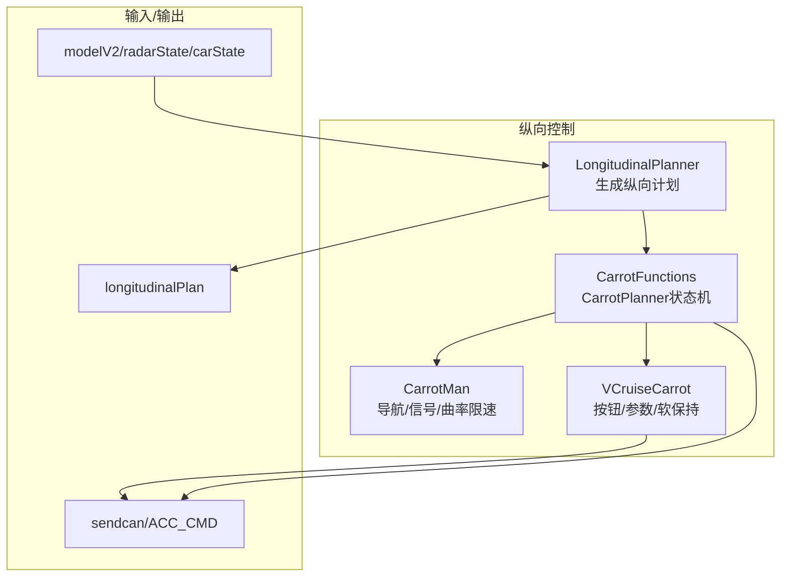
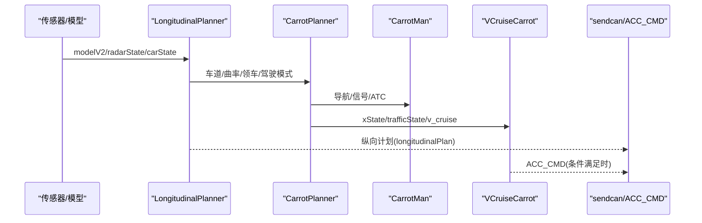
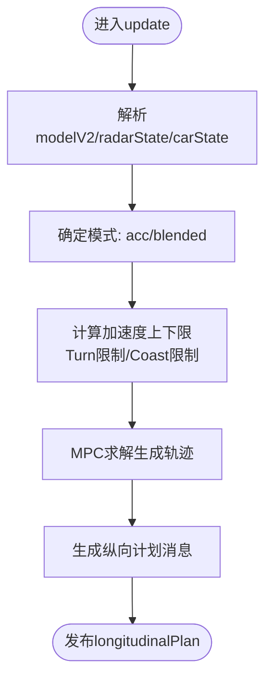
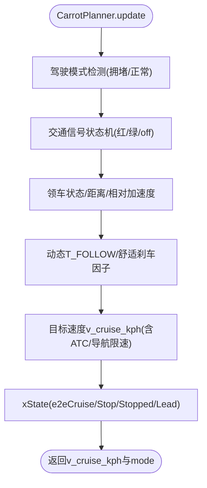
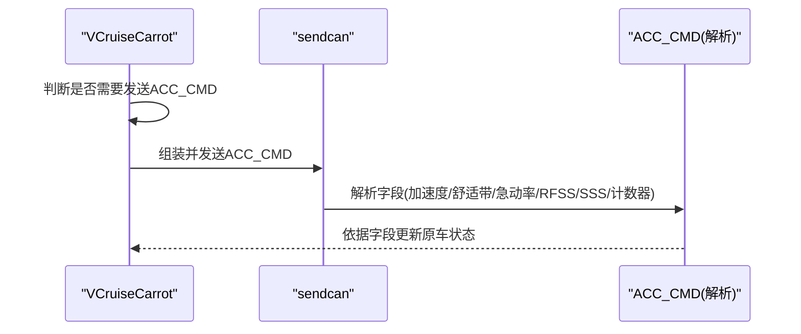
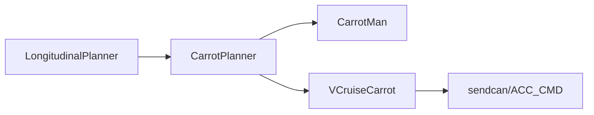

# 纵向控制

<cite>
**本文引用的文件**
- [selfdrive/controls/lib/longitudinal_planner.py](file://selfdrive/controls/lib/longitudinal_planner.py)
- [selfdrive/carrot/carrot_functions.py](file://selfdrive/carrot/carrot_functions.py)
- [selfdrive/carrot/carrot_man.py](file://selfdrive/carrot/carrot_man.py)
- [selfdrive/car/cruise.py](file://selfdrive/car/cruise.py)
- [parse_acc_cmd_fields.py](file://parse_acc_cmd_fields.py)
- [check_acc_cmd_logic.py](file://check_acc_cmd_logic.py)
- [check_longitudinal.py](file://check_longitudinal.py)
- [check_longitudinal_msg.py](file://check_longitudinal_msg.py)
</cite>

## 目录
1. [简介](#简介)
2. [项目结构](#项目结构)
3. [核心组件](#核心组件)
4. [架构总览](#架构总览)
5. [详细组件分析](#详细组件分析)
6. [依赖分析](#依赖分析)
7. [性能考虑](#性能考虑)
8. [故障排查指南](#故障排查指南)
9. [结论](#结论)
10. [附录](#附录)

## 简介
本文件面向BYD纵向控制模块，聚焦于以下目标：
- 深入解释纵向控制算法的实现细节，包括加速度控制、制动控制与加速策略
- 详细说明ACC增强机制的工作原理，包括与原车系统的集成方式与控制逻辑
- 解释加速度限制机制，包括ACCEL_MIN与ACCEL_MAX参数的作用
- 说明停止与启动状态的处理逻辑，包括stopping与starting状态的判断条件
- 记录RFSS与SSS参数的作用与应用场景
- 提供来自实际代码库的具体示例，展示纵向控制命令的生成与发送流程
- 解释与横向控制的协调机制与控制命令优先级处理

## 项目结构
纵向控制相关的关键模块分布如下：
- 纵向规划器：负责基于模型预测与交通状态生成期望速度/加速度轨迹，并输出纵向计划消息
- BYD增强逻辑：在纵向规划基础上，结合Carrot Planner与Carrot Man的状态机，实现更贴近BYD驾驶行为的纵向控制
- 参数与按钮逻辑：提供速度设定、按钮事件处理、软保持等逻辑
- ACC命令解析与发送：解析ACC_CMD字段并根据条件决定是否发送CAN消息

图示来源
- [selfdrive/controls/lib/longitudinal_planner.py](file://selfdrive/controls/lib/longitudinal_planner.py)
- [selfdrive/carrot/carrot_functions.py](file://selfdrive/carrot/carrot_functions.py)
- [selfdrive/carrot/carrot_man.py](file://selfdrive/carrot/carrot_man.py)
- [selfdrive/car/cruise.py](file://selfdrive/car/cruise.py)

章节来源
- [selfdrive/controls/lib/longitudinal_planner.py](file://selfdrive/controls/lib/longitudinal_planner.py)
- [selfdrive/carrot/carrot_functions.py](file://selfdrive/carrot/carrot_functions.py)
- [selfdrive/carrot/carrot_man.py](file://selfdrive/carrot/carrot_man.py)
- [selfdrive/car/cruise.py](file://selfdrive/car/cruise.py)

## 核心组件
- LongitudinalPlanner：基于模型预测控制器（MPC）生成纵向轨迹，结合Turn限制、 coast加速度、用户意图与参数，输出纵向计划消息
- CarrotPlanner：在ACC模式下融合交通信号、曲率、领车状态与驾驶模式，动态调整巡航目标速度与跟车距离，生成xState与trafficState
- CarrotMan：提供导航、曲率限速、交通信号联动与ATC（自适应转向控制）触发逻辑，辅助CarrotPlanner决策
- VCruiseCarrot：处理按钮事件、软保持、自动恢复、速度表等，与CarrotPlanner协同决定v_cruise_kph
- ACC_CMD解析与发送：解析ACC_CMD字段，依据条件决定是否发送CAN消息

章节来源
- [selfdrive/controls/lib/longitudinal_planner.py](file://selfdrive/controls/lib/longitudinal_planner.py)
- [selfdrive/carrot/carrot_functions.py](file://selfdrive/carrot/carrot_functions.py)
- [selfdrive/carrot/carrot_man.py](file://selfdrive/carrot/carrot_man.py)
- [selfdrive/car/cruise.py](file://selfdrive/car/cruise.py)

## 架构总览
纵向控制从感知输入开始，经由纵向规划与BYD增强逻辑，最终形成纵向计划与ACC命令，再由发送模块下发至车辆。

图示来源
- [selfdrive/controls/lib/longitudinal_planner.py](file://selfdrive/controls/lib/longitudinal_planner.py)
- [selfdrive/carrot/carrot_functions.py](file://selfdrive/carrot/carrot_functions.py)
- [selfdrive/carrot/carrot_man.py](file://selfdrive/carrot/carrot_man.py)
- [selfdrive/car/cruise.py](file://selfdrive/car/cruise.py)

## 详细组件分析

### LongitudinalPlanner（纵向规划器）
- 角度/曲率限制：在转弯时对纵向加速度进行限制，避免侧翻或失控
- coast加速度：根据车身姿态计算coast加速度，用于抑制误 throttle
- 速度/加速度目标：根据CarrotPlanner提供的v_cruise_kph与Turn限制生成目标轨迹
- 输出：纵向计划消息包含速度、加速度、期望速度、是否允许刹车/油门、是否应停车等

图示来源
- [selfdrive/controls/lib/longitudinal_planner.py](file://selfdrive/controls/lib/longitudinal_planner.py)

章节来源
- [selfdrive/controls/lib/longitudinal_planner.py](file://selfdrive/controls/lib/longitudinal_planner.py)

### CarrotPlanner（BYD增强逻辑）
- 交通信号与起步：基于模型预测的红绿灯识别，实现红灯停、绿灯启；支持软保持与用户触发
- 驾驶模式：根据拥堵检测切换安全/经济/高速模式，影响最大加速度与舒适刹车
- 跟车距离：动态调整T_FOLLOW，结合领车相对加速度与距离微调
- 速度上限：结合导航曲率、限速、ATC等，动态下调目标速度

图示来源
- [selfdrive/carrot/carrot_functions.py](file://selfdrive/carrot/carrot_functions.py)

章节来源
- [selfdrive/carrot/carrot_functions.py](file://selfdrive/carrot/carrot_functions.py)

### CarrotMan（导航/信号/曲率限速）
- 导航曲率限速：基于GPS路径与曲率查询限速表，结合加速度限制反推可允许速度
- 交通信号联动：与CarrotPlanner共享trafficState，支持ATC左转触发后的起步
- 实时广播：向CarrotMan服务广播当前状态，便于手机端/上位机交互

章节来源
- [selfdrive/carrot/carrot_man.py](file://selfdrive/carrot/carrot_man.py)

### VCruiseCarrot（按钮/参数/软保持）
- 按钮事件：处理加减速、间距调节、取消等按钮，长按/短按区分
- 软保持：在特定条件下维持速度，避免频繁启停
- 自动恢复：在刹车后或特定场景下自动恢复巡航
- 参数驱动：CruiseSpeedUnit、AutoCruiseControl、AutoRoadSpeedLimitOffset等参数影响行为

章节来源
- [selfdrive/car/cruise.py](file://selfdrive/car/cruise.py)

### ACC增强机制与CAN命令
- ACC_CMD字段解析：包含加速度指令、舒适带、急动率上下限、RFSS/SSS、刹车行为、计数器等
- 发送条件：根据参数与状态决定是否发送ACC_CMD，例如speed_from_pcm为1或brake_enhance激活时
- 与原车集成：通过解析原车ACC命令字段，理解原车意图并在此基础上增强（如软保持、起步逻辑）

图示来源
- [parse_acc_cmd_fields.py](file://parse_acc_cmd_fields.py)
- [check_acc_cmd_logic.py](file://check_acc_cmd_logic.py)

章节来源
- [parse_acc_cmd_fields.py](file://parse_acc_cmd_fields.py)
- [check_acc_cmd_logic.py](file://check_acc_cmd_logic.py)

## 依赖分析
纵向控制模块之间的耦合关系如下：
- LongitudinalPlanner依赖CarrotPlanner提供的v_cruise_kph与mode
- CarrotPlanner依赖CarrotMan提供的导航/曲率/信号信息
- VCruiseCarrot与CarrotPlanner共同决定v_cruise_kph与软保持
- ACC_CMD发送受VCruiseCarrot与参数控制

图示来源
- [selfdrive/controls/lib/longitudinal_planner.py](file://selfdrive/controls/lib/longitudinal_planner.py)
- [selfdrive/carrot/carrot_functions.py](file://selfdrive/carrot/carrot_functions.py)
- [selfdrive/carrot/carrot_man.py](file://selfdrive/carrot/carrot_man.py)
- [selfdrive/car/cruise.py](file://selfdrive/car/cruise.py)

章节来源
- [selfdrive/controls/lib/longitudinal_planner.py](file://selfdrive/controls/lib/longitudinal_planner.py)
- [selfdrive/carrot/carrot_functions.py](file://selfdrive/carrot/carrot_functions.py)
- [selfdrive/carrot/carrot_man.py](file://selfdrive/carrot/carrot_man.py)
- [selfdrive/car/cruise.py](file://selfdrive/car/cruise.py)

## 性能考虑
- MPC求解与轨迹插值：注意solver执行时间与轨迹插值开销，避免在高频循环中重复计算
- Turn限制与coast加速度：在低速/急弯场景下，Turn限制会显著降低纵向加速度上限，需平衡安全性与舒适性
- 参数更新频率：部分参数按帧更新，建议减少不必要的写入与重算
- 交通信号识别：基于模型的速度/位置滤波有助于稳定xState切换，但需注意滤波窗口长度与延迟

## 故障排查指南
- 纵向计划缺失或异常
  - 检查longitudinalPlan消息是否正常发布与存活
  - 对比carState与controlsState中的standstill标志
- ACC_CMD未发送
  - 检查speed_from_pcm参数与brake_enhance状态
  - 确认CC.longActive与should_send_acc_cmd条件
- 停止/启动状态异常
  - 关注CarrotPlanner的trafficState与xState变化
  - 检查软保持与用户刹车/油门事件的影响

章节来源
- [check_longitudinal.py](file://check_longitudinal.py)
- [check_longitudinal_msg.py](file://check_longitudinal_msg.py)
- [check_acc_cmd_logic.py](file://check_acc_cmd_logic.py)

## 结论
BYD纵向控制通过LongitudinalPlanner与CarrotPlanner的协同，实现了对加速度、制动与加速的精细化控制，并在转弯、交通信号、导航曲率等场景下进行动态调整。ACC增强机制在保留原车意图的同时，增强了软保持、起步与跟车体验。通过参数化配置与状态机管理，系统在安全性与舒适性之间取得平衡。

## 附录

### 加速度限制机制与参数
- ACCEL_MIN/ACCEL_MAX：全局加速度上下限，用于约束纵向动作
- A_CRUISE_MIN/A_CRUISE_MAX：巡航模式下的加速度上下限，随车速分段插值
- Turn限制：基于v_ego与曲率/转向角，限制纵向加速度上限，避免侧翻
- coast加速度：根据姿态计算coast加速度，抑制误 throttle

章节来源
- [selfdrive/controls/lib/longitudinal_planner.py](file://selfdrive/controls/lib/longitudinal_planner.py)

### 停止与启动状态处理
- stopping：基于交通信号与模型预测，进入e2eStop并计算实际停止距离
- starting：在绿灯/安全距离满足时，从e2eStopped或e2eStop切换到e2eCruise
- 软保持：在特定条件下维持停止状态，等待信号变化或用户触发

章节来源
- [selfdrive/carrot/carrot_functions.py](file://selfdrive/carrot/carrot_functions.py)

### RFSS与SSS参数
- RFSS（ResumeFromStandstill）：从停止状态恢复时的控制策略标志
- SSS（StandstillState）：当前是否处于停止状态的指示
- 字段解析：参考ACC_CMD字段解析脚本，确认这两个bit位的含义与取值

章节来源
- [parse_acc_cmd_fields.py](file://parse_acc_cmd_fields.py)

### 纵向控制命令生成与发送示例
- 纵向计划生成：LongitudinalPlanner根据模型与CarrotPlanner输出生成longitudinalPlan
- ACC_CMD发送：VCruiseCarrot根据按钮/参数/状态决定是否发送ACC_CMD
- 日志分析：使用工具脚本检查controlsState/longitudinalPlan与sendcan消息

章节来源
- [selfdrive/controls/lib/longitudinal_planner.py](file://selfdrive/controls/lib/longitudinal_planner.py)
- [selfdrive/car/cruise.py](file://selfdrive/car/cruise.py)
- [check_longitudinal.py](file://check_longitudinal.py)
- [check_longitudinal_msg.py](file://check_longitudinal_msg.py)
- [check_acc_cmd_logic.py](file://check_acc_cmd_logic.py)