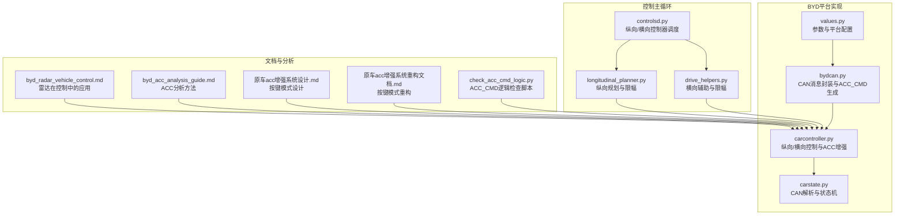
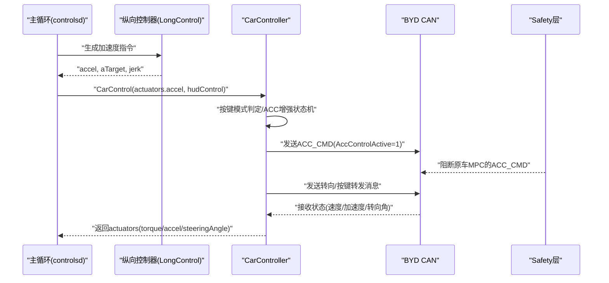
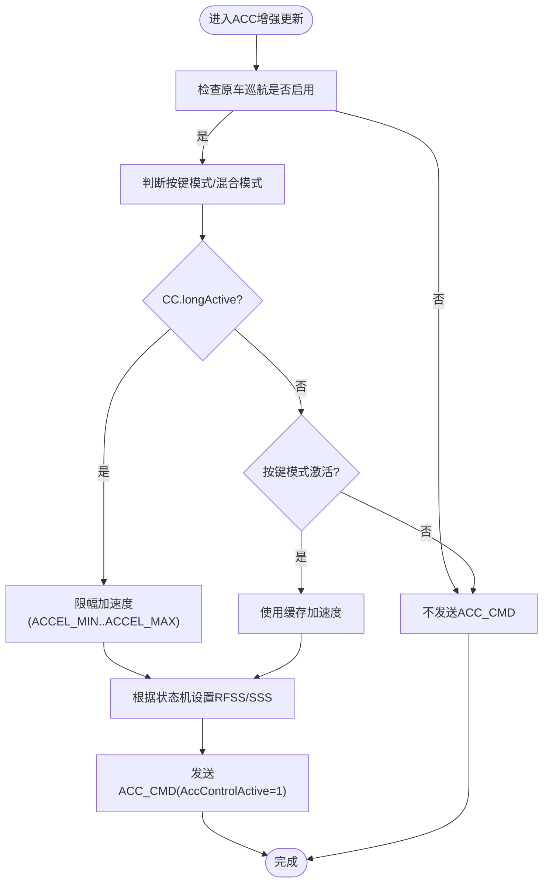
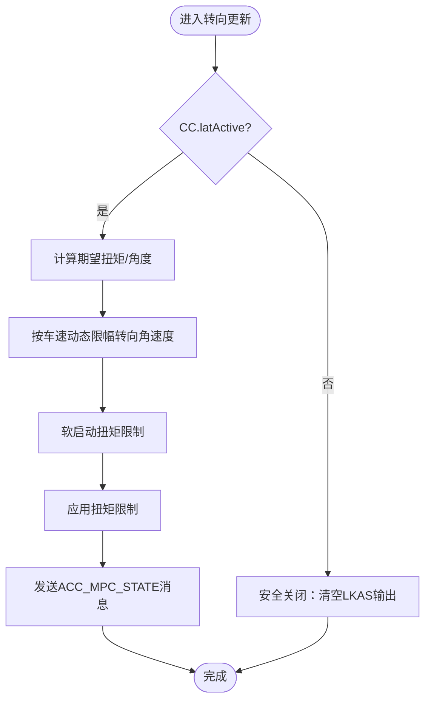
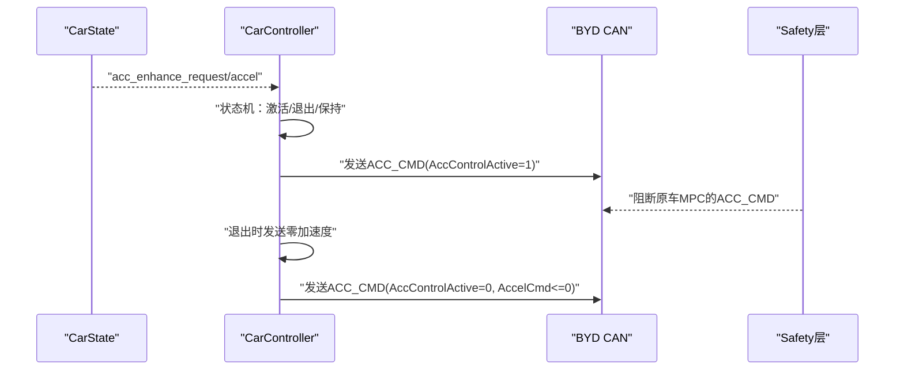
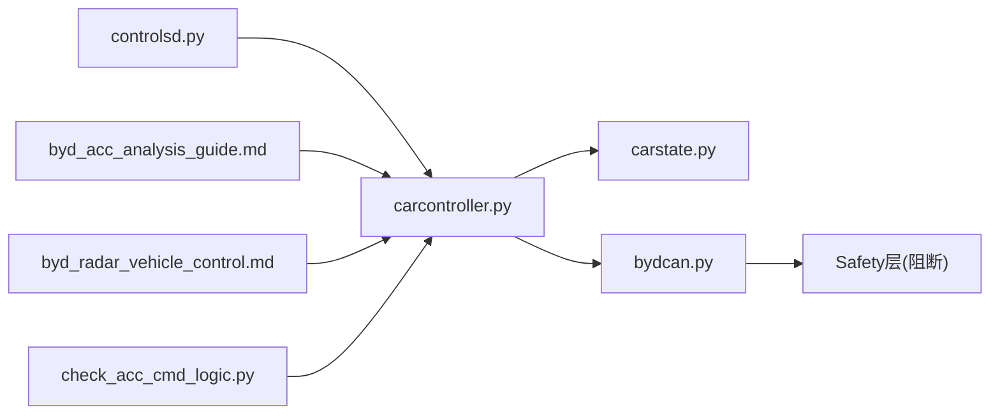

# 车辆控制策略

<cite>
**本文引用的文件**
- [opendbc_repo/opendbc/car/byd/carcontroller.py](file://opendbc_repo/opendbc/car/byd/carcontroller.py)
- [opendbc_repo/opendbc/car/byd/carstate.py](file://opendbc_repo/opendbc/car/byd/carstate.py)
- [opendbc_repo/opendbc/car/byd/bydcan.py](file://opendbc_repo/opendbc/car/byd/bydcan.py)
- [opendbc_repo/opendbc/car/byd/values.py](file://opendbc_repo/opendbc/car/byd/values.py)
- [selfdrive/controls/controlsd.py](file://selfdrive/controls/controlsd.py)
- [selfdrive/controls/lib/longitudinal_planner.py](file://selfdrive/controls/lib/longitudinal_planner.py)
- [selfdrive/controls/lib/drive_helpers.py](file://selfdrive/controls/lib/drive_helpers.py)
- [docs/byd_radar_vehicle_control.md](file://docs/byd_radar_vehicle_control.md)
- [docs/byd_acc_analysis_guide.md](file://docs/byd_acc_analysis_guide.md)
- [原车acc增强系统设计.md](file://原车acc增强系统设计.md)
- [原车acc增强系统重构文档.md](file://原车acc增强系统重构文档.md)
- [check_acc_cmd_logic.py](file://check_acc_cmd_logic.py)
</cite>

## 目录
1. [引言](#引言)
2. [项目结构](#项目结构)
3. [核心组件](#核心组件)
4. [架构总览](#架构总览)
5. [详细组件分析](#详细组件分析)
6. [依赖关系分析](#依赖关系分析)
7. [性能考量](#性能考量)
8. [故障排查指南](#故障排查指南)
9. [结论](#结论)
10. [附录](#附录)

## 引言
本文件面向BYD车辆的控制策略，聚焦于纵向控制（加减速）与横向控制（转向）的实现细节，特别是“按键模式”下的ACC增强机制。文档基于仓库中的真实代码与分析文档，系统阐述：
- 纵向控制策略：包含与原车ACC的协作、减速请求生成、加速度限幅与舒适性控制。
- 横向控制策略：包含转向执行与安全限制、速率限制、软启动等。
- ACC增强机制：按键模式下由openpilot侧计算减速请求并通过ACC_CMD发送给原车系统，由Safety层阻断原车ACC_CMD，避免冲突。
- 制动与加速控制：加速度命令生成、舒适性（Jerk上下限）与安全限制。
- 转向控制：方向盘角度映射、执行器控制与安全保护。
- 状态监测与反馈：速度、加速度、横摆角速度、转向角与转向角速度等实时监控。
- 安全约束与保护：最大加速度、最大制动力、最大减速度、转向角限制等。
- 参数调优与性能测试：参数来源、调优建议与测试方法。

## 项目结构
本项目采用模块化分层组织，BYD相关控制位于opendbc的BYD平台实现，控制主循环位于selfdrive/controls，文档与分析工具位于docs与tools目录。与BYD控制直接相关的文件如下：

图示来源
- [opendbc_repo/opendbc/car/byd/values.py:10-41](file://opendbc_repo/opendbc/car/byd/values.py#L10-L41)
- [opendbc_repo/opendbc/car/byd/bydcan.py:75-137](file://opendbc_repo/opendbc/car/byd/bydcan.py#L75-L137)
- [opendbc_repo/opendbc/car/byd/carcontroller.py:53-243](file://opendbc_repo/opendbc/car/byd/carcontroller.py#L53-L243)
- [opendbc_repo/opendbc/car/byd/carstate.py:88-255](file://opendbc_repo/opendbc/car/byd/carstate.py#L88-L255)
- [selfdrive/controls/controlsd.py:38-210](file://selfdrive/controls/controlsd.py#L38-L210)
- [selfdrive/controls/lib/longitudinal_planner.py:34-182](file://selfdrive/controls/lib/longitudinal_planner.py#L34-L182)
- [selfdrive/controls/lib/drive_helpers.py:1-37](file://selfdrive/controls/lib/drive_helpers.py#L1-L37)
- [docs/byd_radar_vehicle_control.md:1-407](file://docs/byd_radar_vehicle_control.md#L1-L407)
- [docs/byd_acc_analysis_guide.md:1-260](file://docs/byd_acc_analysis_guide.md#L1-L260)
- [原车acc增强系统设计.md:1211-1900](file://原车acc增强系统设计.md#L1211-L1900)
- [原车acc增强系统重构文档.md:394-471](file://原车acc增强系统重构文档.md#L394-L471)
- [check_acc_cmd_logic.py:45-67](file://check_acc_cmd_logic.py#L45-L67)

章节来源
- [opendbc_repo/opendbc/car/byd/values.py:10-41](file://opendbc_repo/opendbc/car/byd/values.py#L10-L41)
- [opendbc_repo/opendbc/car/byd/bydcan.py:75-137](file://opendbc_repo/opendbc/car/byd/bydcan.py#L75-L137)
- [opendbc_repo/opendbc/car/byd/carcontroller.py:53-243](file://opendbc_repo/opendbc/car/byd/carcontroller.py#L53-L243)
- [opendbc_repo/opendbc/car/byd/carstate.py:88-255](file://opendbc_repo/opendbc/car/byd/carstate.py#L88-L255)
- [selfdrive/controls/controlsd.py:38-210](file://selfdrive/controls/controlsd.py#L38-L210)
- [selfdrive/controls/lib/longitudinal_planner.py:34-182](file://selfdrive/controls/lib/longitudinal_planner.py#L34-L182)
- [selfdrive/controls/lib/drive_helpers.py:1-37](file://selfdrive/controls/lib/drive_helpers.py#L1-L37)
- [docs/byd_radar_vehicle_control.md:1-407](file://docs/byd_radar_vehicle_control.md#L1-L407)
- [docs/byd_acc_analysis_guide.md:1-260](file://docs/byd_acc_analysis_guide.md#L1-L260)
- [原车acc增强系统设计.md:1211-1900](file://原车acc增强系统设计.md#L1211-L1900)
- [原车acc增强系统重构文档.md:394-471](file://原车acc增强系统重构文档.md#L394-L471)
- [check_acc_cmd_logic.py:45-67](file://check_acc_cmd_logic.py#L45-L67)

## 核心组件
- BYD参数与平台配置：定义最大加速度/减速度、加速度舒适性Jerk上下限、CAN总线映射、平台规格等。
- CAN消息封装：封装ACC_CMD、转向消息、按键转发等。
- 控制器：纵向（ACC增强）与横向（转向）控制，包含状态机与安全限制。
- 状态机：解析原车CAN，维护巡航状态、雷达目标、按钮事件等。
- 控制主循环：调度纵向/横向控制器，生成actuators并发布carControl。

章节来源
- [opendbc_repo/opendbc/car/byd/values.py:10-41](file://opendbc_repo/opendbc/car/byd/values.py#L10-L41)
- [opendbc_repo/opendbc/car/byd/bydcan.py:75-137](file://opendbc_repo/opendbc/car/byd/bydcan.py#L75-L137)
- [opendbc_repo/opendbc/car/byd/carcontroller.py:53-243](file://opendbc_repo/opendbc/car/byd/carcontroller.py#L53-L243)
- [opendbc_repo/opendbc/car/byd/carstate.py:88-255](file://opendbc_repo/opendbc/car/byd/carstate.py#L88-L255)
- [selfdrive/controls/controlsd.py:38-210](file://selfdrive/controls/controlsd.py#L38-L210)

## 架构总览
BYD控制采用“原车ACC + openpilot协助”的模式。openpilot通过按键模式下的ACC增强，在需要减速时发送ACC_CMD并设置AccControlActive=1，由Safety层阻断原车MPC的ACC_CMD，从而实现“减速请求”。纵向控制由openpilot纵向控制器生成加速度指令，横向控制由转向控制器生成扭矩/角度指令。

图示来源
- [selfdrive/controls/controlsd.py:156-210](file://selfdrive/controls/controlsd.py#L156-L210)
- [opendbc_repo/opendbc/car/byd/carcontroller.py:165-201](file://opendbc_repo/opendbc/car/byd/carcontroller.py#L165-L201)
- [opendbc_repo/opendbc/car/byd/bydcan.py:109-137](file://opendbc_repo/opendbc/car/byd/bydcan.py#L109-L137)
- [原车acc增强系统设计.md:1211-1900](file://原车acc增强系统设计.md#L1211-L1900)

## 详细组件分析

### 纵向控制（加减速）与ACC增强
- ACC增强触发条件：原车巡航启用且按键模式激活；或处于长控制状态（混合模式）。
- 加速度生成：对actuators.accel进行限幅（ACCEL_MIN/ACCEL_MAX），并根据状态机设置RFSS/SSS。
- ACC_CMD发送：当需要减速或退出时发送；退出时限制AccelCmd为非正值，避免与原车ACC冲突。
- Safety层阻断：AccControlActive=1时阻断原车MPC的ACC_CMD，避免冲突。
- 舒适性：根据前车距离插值计算Jerk上下限，保证加加速度平滑。

图示来源
- [opendbc_repo/opendbc/car/byd/carcontroller.py:165-201](file://opendbc_repo/opendbc/car/byd/carcontroller.py#L165-L201)
- [opendbc_repo/opendbc/car/byd/bydcan.py:109-137](file://opendbc_repo/opendbc/car/byd/bydcan.py#L109-L137)
- [原车acc增强系统设计.md:1211-1900](file://原车acc增强系统设计.md#L1211-L1900)

章节来源
- [opendbc_repo/opendbc/car/byd/carcontroller.py:165-201](file://opendbc_repo/opendbc/car/byd/carcontroller.py#L165-L201)
- [opendbc_repo/opendbc/car/byd/bydcan.py:75-137](file://opendbc_repo/opendbc/car/byd/bydcan.py#L75-L137)
- [opendbc_repo/opendbc/car/byd/values.py:25-38](file://opendbc_repo/opendbc/car/byd/values.py#L25-L38)
- [docs/byd_acc_analysis_guide.md:83-185](file://docs/byd_acc_analysis_guide.md#L83-L185)
- [原车acc增强系统设计.md:1211-1900](file://原车acc增强系统设计.md#L1211-L1900)

### 横向控制（转向）策略
- 转向执行：根据CC.latActive与LKAS状态，构造ACC_MPC_STATE消息，设置ReqPrepare/LKAS_Active等。
- 速率限制：根据车速动态限制转向角速度，避免过大转向输入。
- 软启动：扭矩软启动限制，平滑提升至最大值，避免突变。
- 安全关闭：在横向控制失效时，清空LKAS输出并保持安全状态。

图示来源
- [opendbc_repo/opendbc/car/byd/carcontroller.py:63-129](file://opendbc_repo/opendbc/car/byd/carcontroller.py#L63-L129)
- [opendbc_repo/opendbc/car/byd/bydcan.py:21-71](file://opendbc_repo/opendbc/car/byd/bydcan.py#L21-L71)

章节来源
- [opendbc_repo/opendbc/car/byd/carcontroller.py:63-129](file://opendbc_repo/opendbc/car/byd/carcontroller.py#L63-L129)
- [opendbc_repo/opendbc/car/byd/bydcan.py:21-71](file://opendbc_repo/opendbc/car/byd/bydcan.py#L21-L71)

### ACC增强机制（按键模式）
- 触发与状态机：按键模式激活后，缓存减速加速度；退出时发送零加速度并清除缓存。
- Safety层阻断：AccControlActive=1时阻断原车MPC的ACC_CMD，避免冲突。
- 退出策略：退出时限制AccelCmd为非正值，避免加速与减速冲突。
- 场景检测：结合导航限速、弯道限速、前车接近等场景，综合判断是否启用。

图示来源
- [opendbc_repo/opendbc/car/byd/carcontroller.py:145-203](file://opendbc_repo/opendbc/car/byd/carcontroller.py#L145-L203)
- [opendbc_repo/opendbc/car/byd/bydcan.py:109-137](file://opendbc_repo/opendbc/car/byd/bydcan.py#L109-L137)
- [原车acc增强系统设计.md:1211-1900](file://原车acc增强系统设计.md#L1211-L1900)

章节来源
- [opendbc_repo/opendbc/car/byd/carcontroller.py:145-203](file://opendbc_repo/opendbc/car/byd/carcontroller.py#L145-L203)
- [opendbc_repo/opendbc/car/byd/bydcan.py:109-137](file://opendbc_repo/opendbc/car/byd/bydcan.py#L109-L137)
- [原车acc增强系统设计.md:1211-1900](file://原车acc增强系统设计.md#L1211-L1900)
- [原车acc增强系统重构文档.md:394-471](file://原车acc增强系统重构文档.md#L394-L471)

### 制动与加速控制（扭矩/加速度）
- 加速度限幅：ACCEL_MIN/ACCEL_MAX定义最大加速度与最大减速度。
- 舒适性Jerk：根据前车距离插值计算Jerk上下限，保证加加速度平滑。
- 退出时加速限制：退出ACC增强时，限制AccelCmd为非正值，避免与原车ACC冲突。
- 安全层阻断：AccControlActive=1时阻断原车ACC_CMD，避免冲突。

章节来源
- [opendbc_repo/opendbc/car/byd/values.py:25-38](file://opendbc_repo/opendbc/car/byd/values.py#L25-L38)
- [opendbc_repo/opendbc/car/byd/bydcan.py:99-137](file://opendbc_repo/opendbc/car/byd/bydcan.py#L99-L137)
- [原车acc增强系统设计.md:1211-1900](file://原车acc增强系统设计.md#L1211-L1900)

### 转向控制算法（方向盘角度映射与执行器控制）
- 方向盘角度映射：将期望转向角转换为执行器扭矩，考虑车速与转向角速度限制。
- 执行器控制：构造ACC_MPC_STATE消息，设置LKAS输出、状态与计数器。
- 安全保护：在横向控制失效时，清空LKAS输出，避免误触发。

章节来源
- [opendbc_repo/opendbc/car/byd/carcontroller.py:63-129](file://opendbc_repo/opendbc/car/byd/carcontroller.py#L63-L129)
- [opendbc_repo/opendbc/car/byd/bydcan.py:21-71](file://opendbc_repo/opendbc/car/byd/bydcan.py#L21-L71)

### 车辆状态监测与反馈
- 速度与加速度：从底盘传感器获取纵向/横向加速度，结合车速与加速度估计。
- 姿态与角速度：从YAW_RATE获取横摆角速度。
- 转向角与角速度：从EPS获取转向角与转向角速度。
- 巡航状态：从ACC_HUD_ADAS与PCM_BUTTONS解析ACC状态与按钮事件。
- 雷达数据：可选启用MRR雷达，用于前车距离与目标筛选。

章节来源
- [opendbc_repo/opendbc/car/byd/carstate.py:134-255](file://opendbc_repo/opendbc/car/byd/carstate.py#L134-L255)
- [docs/byd_radar_vehicle_control.md:1-407](file://docs/byd_radar_vehicle_control.md#L1-L407)

### 安全约束与保护机制
- 最大加速度/减速度：ACCEL_MAX/ACCEL_MIN限制。
- 最大减速度：在按键模式下，退出时限制AccelCmd为非正值，避免加速。
- 转向角限制：STEER_MAX与软启动步长限制扭矩输出。
- 转向角速度限制：USE_STEERING_SPEED_LIMITER与动态限幅。
- Safety层阻断：AccControlActive=1时阻断原车MPC的ACC_CMD。
- 前车距离安全：场景检测前检查雷达，避免在近距离/接近时启用按键模式。

章节来源
- [opendbc_repo/opendbc/car/byd/values.py:11-27](file://opendbc_repo/opendbc/car/byd/values.py#L11-L27)
- [opendbc_repo/opendbc/car/byd/bydcan.py:109-137](file://opendbc_repo/opendbc/car/byd/bydcan.py#L109-L137)
- [原车acc增强系统设计.md:2774-2801](file://原车acc增强系统设计.md#L2774-L2801)
- [原车acc增强系统设计.md:3055-3060](file://原车acc增强系统设计.md#L3055-L3060)

### 参数调优指南与性能测试
- 参数来源：values.py中定义的ACCEL上下限、Jerk曲线、STEER相关参数。
- 调优建议：
  - 根据实车特性调整ACCEL_MAX/ACCEL_MIN与Jerk上下限。
  - 在弯道/坡道场景下，评估转向角速度限制与软启动步长。
  - 按键模式下，结合导航限速与前车距离，优化场景检测阈值。
- 性能测试：
  - 使用日志分析脚本统计ACC_CMD发送次数与减速范围。
  - 对比不同场景下的车速变化与加速度命令，评估舒适性与响应性。

章节来源
- [opendbc_repo/opendbc/car/byd/values.py:25-38](file://opendbc_repo/opendbc/car/byd/values.py#L25-L38)
- [docs/byd_acc_analysis_guide.md:186-250](file://docs/byd_acc_analysis_guide.md#L186-L250)
- [check_acc_cmd_logic.py:45-67](file://check_acc_cmd_logic.py#L45-L67)

## 依赖关系分析
- 控制主循环依赖纵向/横向控制器与车辆模型，生成CarControl并发布。
- CarController依赖CarState解析CAN状态，封装bydcan消息并发送。
- Safety层依赖ACC_CMD中的AccControlActive字段，阻断原车MPC的ACC_CMD。
- 文档与分析脚本为工程实践提供依据与验证手段。

图示来源
- [selfdrive/controls/controlsd.py:38-210](file://selfdrive/controls/controlsd.py#L38-L210)
- [opendbc_repo/opendbc/car/byd/carcontroller.py:53-243](file://opendbc_repo/opendbc/car/byd/carcontroller.py#L53-L243)
- [opendbc_repo/opendbc/car/byd/carstate.py:88-255](file://opendbc_repo/opendbc/car/byd/carstate.py#L88-L255)
- [opendbc_repo/opendbc/car/byd/bydcan.py:75-137](file://opendbc_repo/opendbc/car/byd/bydcan.py#L75-L137)
- [docs/byd_acc_analysis_guide.md:1-260](file://docs/byd_acc_analysis_guide.md#L1-L260)
- [docs/byd_radar_vehicle_control.md:1-407](file://docs/byd_radar_vehicle_control.md#L1-L407)
- [check_acc_cmd_logic.py:45-67](file://check_acc_cmd_logic.py#L45-L67)

章节来源
- [selfdrive/controls/controlsd.py:38-210](file://selfdrive/controls/controlsd.py#L38-L210)
- [opendbc_repo/opendbc/car/byd/carcontroller.py:53-243](file://opendbc_repo/opendbc/car/byd/carcontroller.py#L53-L243)
- [opendbc_repo/opendbc/car/byd/carstate.py:88-255](file://opendbc_repo/opendbc/car/byd/carstate.py#L88-L255)
- [opendbc_repo/opendbc/car/byd/bydcan.py:75-137](file://opendbc_repo/opendbc/car/byd/bydcan.py#L75-L137)
- [docs/byd_acc_analysis_guide.md:1-260](file://docs/byd_acc_analysis_guide.md#L1-L260)
- [docs/byd_radar_vehicle_control.md:1-407](file://docs/byd_radar_vehicle_control.md#L1-L407)
- [check_acc_cmd_logic.py:45-67](file://check_acc_cmd_logic.py#L45-L67)

## 性能考量
- 控制周期：ACC/Steer步长为50Hz，需确保纵向/横向控制器在该频率下稳定。
- 舒适性：Jerk上下限随前车距离插值，避免急刹/急加；转向角速度动态限幅，提升人机共驾体验。
- 安全性：按键模式下仅在必要时发送ACC_CMD，退出时限制为非正值，避免与原车ACC冲突。
- 雷达融合：可选启用MRR雷达，提升前车距离与目标筛选精度，但需注意数据有效性校验与融合策略。

## 故障排查指南
- ACC_CMD未发送：
  - 检查按键模式是否激活与原车巡航状态。
  - 检查日志中ACC_CMD地址与AccControlActive字段。
- 减速不明显：
  - 分析实际车速变化与ACC_CMD加速度值。
  - 检查是否存在前车接近或导航限速异常导致的场景禁用。
- ACC自动取消：
  - 检查AccState=4时是否误判为非激活；确认AccOn1字段。
- 转向异常：
  - 检查转向角速度限幅与软启动步长设置。
  - 确认EPS状态与LKAS状态一致性。

章节来源
- [原车acc增强系统设计.md:1858-1896](file://原车acc增强系统设计.md#L1858-L1896)
- [原车acc增强系统设计.md:1211-1900](file://原车acc增强系统设计.md#L1211-L1900)
- [原车acc增强系统重构文档.md:394-471](file://原车acc增强系统重构文档.md#L394-L471)
- [check_acc_cmd_logic.py:45-67](file://check_acc_cmd_logic.py#L45-L67)

## 结论
本控制策略以“原车ACC + openpilot协助”为核心，通过按键模式下的ACC增强实现减速请求，并由Safety层阻断原车ACC_CMD，避免冲突。纵向控制在舒适性与安全性之间取得平衡，横向控制具备速率限制与软启动保护。参数与测试方法明确，便于在不同场景下进行调优与验证。

## 附录
- 相关文档与脚本路径：
  - [byd_acc_analysis_guide.md:1-260](file://docs/byd_acc_analysis_guide.md#L1-L260)
  - [byd_radar_vehicle_control.md:1-407](file://docs/byd_radar_vehicle_control.md#L1-L407)
  - [原车acc增强系统设计.md:1211-1900](file://原车acc增强系统设计.md#L1211-L1900)
  - [原车acc增强系统重构文档.md:394-471](file://原车acc增强系统重构文档.md#L394-L471)
  - [check_acc_cmd_logic.py:45-67](file://check_acc_cmd_logic.py#L45-L67)