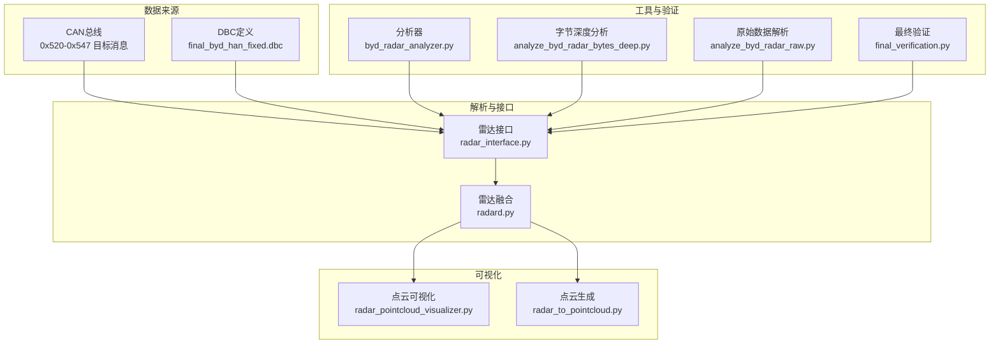
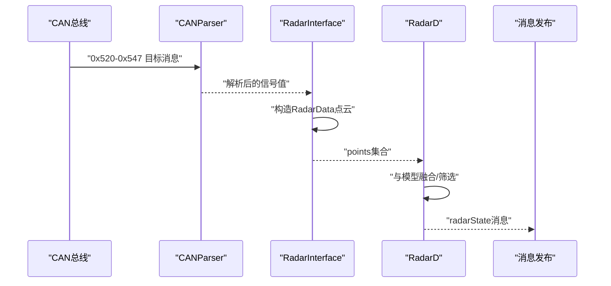
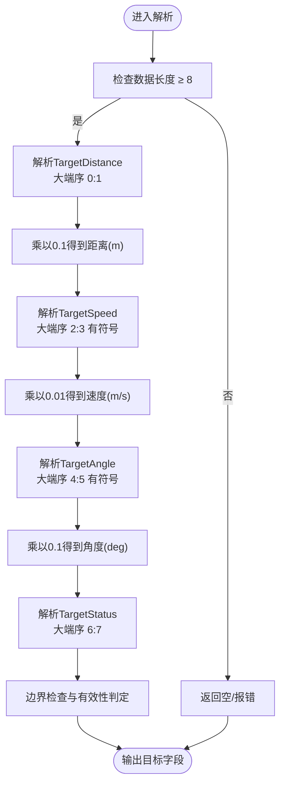
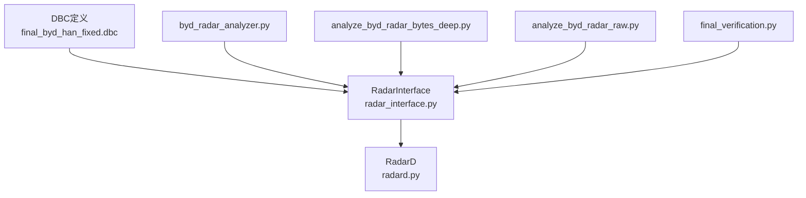

# 原始雷达数据解析

<cite>
**本文引用的文件**
- [byd_radar_integration.md](file://docs/byd_radar_integration.md)
- [radar_interface.py](file://opendbc_repo/opendbc/car/byd/radar_interface.py)
- [final_byd_han_fixed.dbc](file://final_byd_han_fixed.dbc)
- [radard.py](file://selfdrive/controls/radard.py)
- [byd_radar_analyzer.py](file://tools/byd_radar_analyzer.py)
- [analyze_byd_radar_bytes_deep.py](file://tools/analyze_byd_radar_bytes_deep.py)
- [analyze_byd_radar_raw.py](file://tools/analyze_byd_radar_raw.py)
- [final_verification.py](file://final_verification.py)
- [radar_pointcloud_visualizer.py](file://radar_pointcloud_visualizer.py)
- [radar_to_pointcloud.py](file://radar_to_pointcloud.py)
</cite>

## 目录
1. [简介](#简介)
2. [项目结构](#项目结构)
3. [核心组件](#核心组件)
4. [架构总览](#架构总览)
5. [详细组件分析](#详细组件分析)
6. [依赖分析](#依赖分析)
7. [性能考虑](#性能考虑)
8. [故障排查指南](#故障排查指南)
9. [结论](#结论)
10. [附录](#附录)

## 简介
本文件面向原始雷达数据解析模块，聚焦于BYD车辆CAN ID范围0x520-0x547的40个雷达目标消息（BYD_RADAR_TARGET_0至BYD_RADAR_TARGET_39）的解析实现，涵盖：
- DBC信号位布局与数据编码方式
- TargetDistance（0.1米单位）、TargetSpeed（0.01米/秒单位）、TargetAngle（0.1度单位）的解码算法
- TargetStatus状态枚举值及其应用场景
- RADAR_STATUS_250消息的解析逻辑与故障诊断机制
- 数据包解析流程（字节序、数值转换、边界检查）
- 常见解析错误与调试方法

## 项目结构
围绕原始雷达数据解析的关键文件与职责如下：
- 文档与规范：docs/byd_radar_integration.md 提供DBC定义、信号值映射与集成要点
- 雷达接口：opendbc_repo/opendbc/car/byd/radar_interface.py 实现雷达接口与触发消息
- DBC定义：final_byd_han_fixed.dbc 包含目标消息与状态消息的信号定义
- 控制层融合：selfdrive/controls/radard.py 将雷达点云与模型融合，输出radarState
- 工具链与验证：tools/... 提供原始数据解析、字节级相关性分析与验证脚本
- 可视化：radar_pointcloud_visualizer.py、radar_to_pointcloud.py 展示短/长距雷达目标

图示来源
- [radar_interface.py](file://opendbc_repo/opendbc/car/byd/radar_interface.py)
- [final_byd_han_fixed.dbc](file://final_byd_han_fixed.dbc)
- [radard.py](file://selfdrive/controls/radard.py)
- [byd_radar_analyzer.py](file://tools/byd_radar_analyzer.py)
- [analyze_byd_radar_bytes_deep.py](file://tools/analyze_byd_radar_bytes_deep.py)
- [analyze_byd_radar_raw.py](file://tools/analyze_byd_radar_raw.py)
- [final_verification.py](file://final_verification.py)
- [radar_pointcloud_visualizer.py](file://radar_pointcloud_visualizer.py)
- [radar_to_pointcloud.py](file://radar_to_pointcloud.py)

章节来源
- [byd_radar_integration.md](file://docs/byd_radar_integration.md)
- [radar_interface.py](file://opendbc_repo/opendbc/car/byd/radar_interface.py)
- [final_byd_han_fixed.dbc](file://final_byd_han_fixed.dbc)
- [radard.py](file://selfdrive/controls/radard.py)
- [byd_radar_analyzer.py](file://tools/byd_radar_analyzer.py)
- [analyze_byd_radar_bytes_deep.py](file://tools/analyze_byd_radar_bytes_deep.py)
- [analyze_byd_radar_raw.py](file://tools/analyze_byd_radar_raw.py)
- [final_verification.py](file://final_verification.py)
- [radar_pointcloud_visualizer.py](file://radar_pointcloud_visualizer.py)
- [radar_to_pointcloud.py](file://radar_to_pointcloud.py)

## 核心组件
- 雷达接口（RadarInterface）
  - 通过CANParser订阅RADAR_MRR（0x374）作为触发消息，解析目标ID与目标距离/横向距离/有效性等字段，构建RadarData点云
  - 输出points集合，供radard.py进一步融合与发布
- DBC定义
  - BYD_RADAR_TARGET_0至BYD_RADAR_TARGET_39：TargetDistance（0|16@1+ (0.1,0)）、TargetSpeed（16|16@1- (0.01,0)）、TargetAngle（32|16@1- (0.1,0)）、TargetStatus（48|16@1+ (1,0)）
  - RADAR_STATUS_250：Status（0|8@0+ (1,0)）、Error（8|8@0+ (1,0)）
- 控制层雷达融合（RadarD）
  - 将雷达点云与模型预测融合，输出radarState，包含leadOne/leadTwo等目标状态
- 工具与验证
  - byd_radar_analyzer.py：从日志提取radarState/liveTracks/can，统计雷达性能与导出数据
  - analyze_byd_radar_bytes_deep.py / analyze_byd_radar_raw.py：字节级相关性分析与原始CAN帧解析
  - final_verification.py：对比旧/新解析方法，验证速度缩放因子修正

章节来源
- [radar_interface.py](file://opendbc_repo/opendbc/car/byd/radar_interface.py)
- [final_byd_han_fixed.dbc](file://final_byd_han_fixed.dbc)
- [radard.py](file://selfdrive/controls/radard.py)
- [byd_radar_analyzer.py](file://tools/byd_radar_analyzer.py)
- [analyze_byd_radar_bytes_deep.py](file://tools/analyze_byd_radar_bytes_deep.py)
- [analyze_byd_radar_raw.py](file://tools/analyze_byd_radar_raw.py)
- [final_verification.py](file://final_verification.py)

## 架构总览
下图展示了从原始CAN消息到radarState的端到端流程，以及各模块间的交互关系。

图示来源
- [radar_interface.py](file://opendbc_repo/opendbc/car/byd/radar_interface.py)
- [radard.py](file://selfdrive/controls/radard.py)

## 详细组件分析

### DBC信号位布局与数据编码
- BYD_RADAR_TARGET_n（n=0..39）
  - TargetDistance：0|16@1+ (0.1,0) —— 大端序，16位无符号，缩放0.1，偏移0，单位米
  - TargetSpeed：16|16@1- (0.01,0) —— 大端序，16位有符号，缩放0.01，偏移0，单位米/秒
  - TargetAngle：32|16@1- (0.1,0) —— 大端序，16位有符号，缩放0.1，偏移0，单位度
  - TargetStatus：48|16@1+ (1,0) —— 大端序，16位无符号，枚举值见下节
- RADAR_STATUS_250
  - Status：0|8@0+ (1,0) —— 8位无符号，枚举值：RADAR_OFF、RADAR_STANDBY、RADAR_ACTIVE、RADAR_FAULT
  - Error：8|8@0+ (1,0) —— 8位无符号，枚举值：NO_ERROR、SOFT_ERROR、HARD_ERROR、COMM_ERROR

章节来源
- [byd_radar_integration.md](file://docs/byd_radar_integration.md)
- [final_byd_han_fixed.dbc](file://final_byd_han_fixed.dbc)

### TargetStatus状态枚举与应用场景
- 枚举值（示例，按DBC VAL_定义）
  - TARGET_INVALID：无效目标
  - TARGET_VALID：有效目标
  - TARGET_TRACKED：已跟踪目标
  - TARGET_STATIONARY：静止目标
- 应用场景
  - 用于区分目标的生命周期与稳定性，指导ACC、FCW等决策模块的置信度与动作策略

章节来源
- [byd_radar_integration.md](file://docs/byd_radar_integration.md)

### RADAR_STATUS_250解析与故障诊断
- Status字段
  - RADAR_OFF：雷达关闭
  - RADAR_STANDBY：待机
  - RADAR_ACTIVE：工作正常
  - RADAR_FAULT：故障
- Error字段
  - NO_ERROR：无错误
  - SOFT_ERROR：软件错误
  - HARD_ERROR：硬件错误
  - COMM_ERROR：通信错误
- 故障诊断机制
  - 结合radarState.errors.canError、radarFault、radarUnavailableTemporary等标志进行综合判断
  - 在radard.py中，若雷达不可用或触发消息缺失，可标记错误并抑制输出

章节来源
- [byd_radar_integration.md](file://docs/byd_radar_integration.md)
- [radard.py](file://selfdrive/controls/radard.py)

### 数据包解析流程（字节序、数值转换、边界检查）
- 字节序
  - 所有信号均为大端序（@1+），需按MSB在前的方式读取
- 数值转换
  - TargetDistance：raw × 0.1
  - TargetSpeed：raw × 0.01（注意：历史实现中存在缩放因子错误，详见“最终验证”章节）
  - TargetAngle：raw × 0.1
- 边界检查
  - 16位有符号字段需进行符号扩展与范围校验
  - 16位无符号字段需确保在DBC定义的物理范围之内
- 触发与聚合
  - radar_interface.py以0x374（RADAR_MRR）为触发消息，解析目标ID与目标距离/横向距离/有效性等字段，构建RadarData点云

图示来源
- [final_byd_han_fixed.dbc](file://final_byd_han_fixed.dbc)
- [radar_interface.py](file://opendbc_repo/opendbc/car/byd/radar_interface.py)

章节来源
- [final_byd_han_fixed.dbc](file://final_byd_han_fixed.dbc)
- [radar_interface.py](file://opendbc_repo/opendbc/car/byd/radar_interface.py)

### 代码示例：数据包解析流程（路径引用）
- DBC信号定义与枚举值
  - [DBC定义（目标消息与状态消息）](file://final_byd_han_fixed.dbc)
  - [TargetStatus枚举值](file://docs/byd_radar_integration.md)
- 雷达接口实现（触发消息与点云构建）
  - [雷达接口（RadarInterface）](file://opendbc_repo/opendbc/car/byd/radar_interface.py)
- 控制层融合（radarState输出）
  - [雷达融合（RadarD）](file://selfdrive/controls/radard.py)
- 工具与验证
  - [原始数据解析与字节相关性分析](file://tools/analyze_byd_radar_raw.py)
  - [字节深度分析](file://tools/analyze_byd_radar_bytes_deep.py)
  - [最终验证（速度缩放因子修正）](file://final_verification.py)

章节来源
- [final_byd_han_fixed.dbc](file://final_byd_han_fixed.dbc)
- [byd_radar_integration.md](file://docs/byd_radar_integration.md)
- [radar_interface.py](file://opendbc_repo/opendbc/car/byd/radar_interface.py)
- [radard.py](file://selfdrive/controls/radard.py)
- [analyze_byd_radar_raw.py](file://tools/analyze_byd_radar_raw.py)
- [analyze_byd_radar_bytes_deep.py](file://tools/analyze_byd_radar_bytes_deep.py)
- [final_verification.py](file://final_verification.py)

## 依赖分析
- 模块耦合
  - radar_interface.py依赖DBC定义与CANParser，负责将原始CAN消息转换为RadarData
  - radard.py依赖RadarData与模型预测，负责融合与输出radarState
  - tools/...脚本独立运行，用于验证与分析
- 外部依赖
  - DBC文件提供信号位布局与标定量
  - 日志系统（LogReader）用于工具链的数据输入

图示来源
- [final_byd_han_fixed.dbc](file://final_byd_han_fixed.dbc)
- [radar_interface.py](file://opendbc_repo/opendbc/car/byd/radar_interface.py)
- [radard.py](file://selfdrive/controls/radard.py)
- [byd_radar_analyzer.py](file://tools/byd_radar_analyzer.py)
- [analyze_byd_radar_bytes_deep.py](file://tools/analyze_byd_radar_bytes_deep.py)
- [analyze_byd_radar_raw.py](file://tools/analyze_byd_radar_raw.py)
- [final_verification.py](file://final_verification.py)

章节来源
- [final_byd_han_fixed.dbc](file://final_byd_han_fixed.dbc)
- [radar_interface.py](file://opendbc_repo/opendbc/car/byd/radar_interface.py)
- [radard.py](file://selfdrive/controls/radard.py)
- [byd_radar_analyzer.py](file://tools/byd_radar_analyzer.py)
- [analyze_byd_radar_bytes_deep.py](file://tools/analyze_byd_radar_bytes_deep.py)
- [analyze_byd_radar_raw.py](file://tools/analyze_byd_radar_raw.py)
- [final_verification.py](file://final_verification.py)

## 性能考虑
- 解析效率
  - 使用大端序直接读取16位字段，避免不必要的位运算
  - 在radar_interface.py中仅在触发消息到达时更新，减少CPU占用
- 融合性能
  - radard.py通过FirstOrderFilter与卡尔曼滤波平滑加速度，降低抖动
  - 通过参数（如RadarLatFactor、RadarReactionFactor）调节响应特性
- 可靠性
  - 对16位有符号字段进行符号扩展与范围校验，防止溢出
  - radarState.errors中记录CAN错误与雷达故障，便于上层快速降级

## 故障排查指南
- 常见错误类型
  - 速度异常大：检查速度缩放因子是否为0.01而非0.001（历史实现问题）
  - 角度/距离越界：检查字节序与符号扩展是否正确
  - 目标ID缺失：确认触发消息（0x374）是否到达，以及目标ID范围是否在预期
  - RADAR_FAULT：检查Status/Error枚举值，定位软/硬件/通信问题
- 调试方法
  - 使用byd_radar_analyzer.py从日志提取radarState与liveTracks，统计目标数量与分布
  - 使用analyze_byd_radar_bytes_deep.py/analyze_byd_radar_raw.py进行字节级相关性分析，验证信号位布局
  - 使用final_verification.py对比旧/新解析方法，快速定位缩放因子问题
  - radar_pointcloud_visualizer.py/radar_to_pointcloud.py可视化短/长距雷达目标，辅助定位异常

章节来源
- [byd_radar_analyzer.py](file://tools/byd_radar_analyzer.py)
- [analyze_byd_radar_bytes_deep.py](file://tools/analyze_byd_radar_bytes_deep.py)
- [analyze_byd_radar_raw.py](file://tools/analyze_byd_radar_raw.py)
- [final_verification.py](file://final_verification.py)
- [radar_pointcloud_visualizer.py](file://radar_pointcloud_visualizer.py)
- [radar_to_pointcloud.py](file://radar_to_pointcloud.py)

## 结论
通过对BYD原始雷达数据解析模块的系统化梳理，明确了：
- DBC信号位布局与数据编码规则
- TargetDistance/TargetSpeed/TargetAngle的解码算法与字节序要求
- TargetStatus与RADAR_STATUS_250的枚举值与故障诊断机制
- 从原始CAN消息到radarState的完整流程与关键优化点
- 基于工具链的验证与调试方法，确保解析结果的准确性与鲁棒性

## 附录
- 相关文件路径引用
  - [byd_radar_integration.md](file://docs/byd_radar_integration.md)
  - [radar_interface.py](file://opendbc_repo/opendbc/car/byd/radar_interface.py)
  - [final_byd_han_fixed.dbc](file://final_byd_han_fixed.dbc)
  - [radard.py](file://selfdrive/controls/radard.py)
  - [byd_radar_analyzer.py](file://tools/byd_radar_analyzer.py)
  - [analyze_byd_radar_bytes_deep.py](file://tools/analyze_byd_radar_bytes_deep.py)
  - [analyze_byd_radar_raw.py](file://tools/analyze_byd_radar_raw.py)
  - [final_verification.py](file://final_verification.py)
  - [radar_pointcloud_visualizer.py](file://radar_pointcloud_visualizer.py)
  - [radar_to_pointcloud.py](file://radar_to_pointcloud.py)