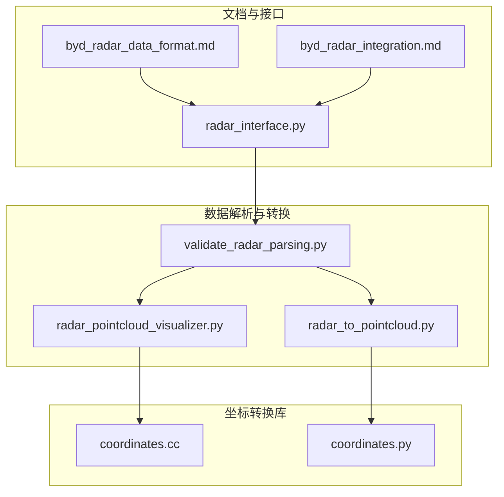
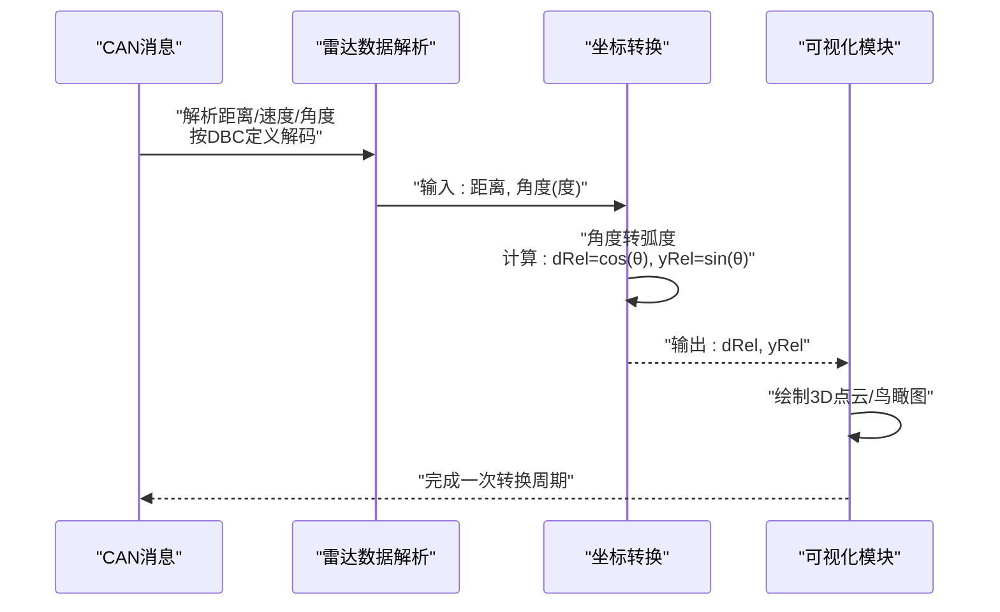
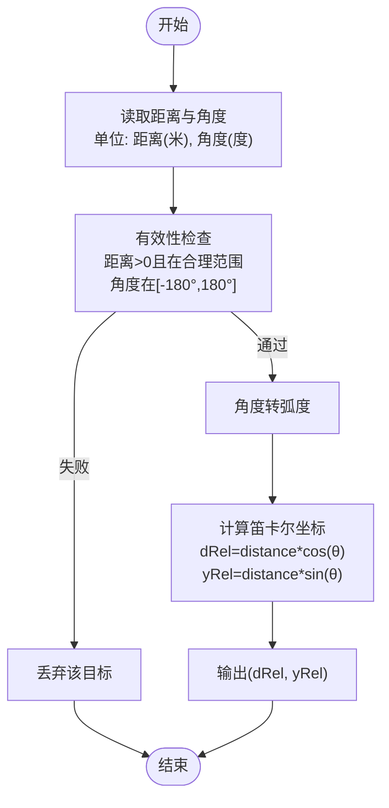

# 坐标转换算法

<cite>
**本文引用的文件**
- [byd_radar_data_format.md](file://docs/byd_radar_data_format.md)
- [byd_radar_integration.md](file://docs/byd_radar_integration.md)
- [radar_pointcloud_visualizer.py](file://radar_pointcloud_visualizer.py)
- [radar_to_pointcloud.py](file://radar_to_pointcloud.py)
- [validate_radar_parsing.py](file://validate_radar_parsing.py)
- [radar_interface.py](file://opendbc_repo/opendbc/car/byd/radar_interface.py)
- [coordinates.cc](file://common/transformations/coordinates.cc)
- [coordinates.py](file://common/transformations/coordinates.py)
</cite>

## 目录
1. [引言](#引言)
2. [项目结构](#项目结构)
3. [核心组件](#核心组件)
4. [架构概览](#架构概览)
5. [详细组件分析](#详细组件分析)
6. [依赖关系分析](#依赖关系分析)
7. [性能考虑](#性能考虑)
8. [故障排查指南](#故障排查指南)
9. [结论](#结论)

## 引言
本文件围绕雷达坐标转换算法，系统阐述从极坐标到笛卡尔坐标的转换流程，重点解释公式 yRel = distance × sin(angle_rad) 与 dRel = distance × cos(angle_rad) 的物理意义与几何关系，并结合项目中的实际实现，说明角度单位转换（DBC定义的0.1度单位到弧度）、坐标系定义（纵向距离 dRel 沿车辆前进方向，横向距离 yRel 相对于车辆中心的偏移）、精度处理与数值稳定性、以及可视化示例与性能优化建议。

## 项目结构
与雷达坐标转换相关的核心文件分布如下：
- 文档层：提供数据格式、单位换算与转换公式的说明
- 可视化脚本：将雷达目标从极坐标转换为笛卡尔坐标并在3D/鸟瞰图中展示
- 接口层：解析DBC定义的CAN消息，提取距离、速度、角度等信号
- 坐标转换库：提供地理坐标与局部坐标之间的转换能力（用于更广泛的导航/定位场景）

**图表来源**
- [byd_radar_data_format.md](file://docs/byd_radar_data_format.md)
- [byd_radar_integration.md](file://docs/byd_radar_integration.md)
- [radar_interface.py](file://opendbc_repo/opendbc/car/byd/radar_interface.py)
- [validate_radar_parsing.py](file://validate_radar_parsing.py)
- [radar_pointcloud_visualizer.py](file://radar_pointcloud_visualizer.py)
- [radar_to_pointcloud.py](file://radar_to_pointcloud.py)
- [coordinates.cc](file://common/transformations/coordinates.cc)
- [coordinates.py](file://common/transformations/coordinates.py)

**章节来源**
- [byd_radar_data_format.md](file://docs/byd_radar_data_format.md)
- [byd_radar_integration.md](file://docs/byd_radar_integration.md)
- [radar_pointcloud_visualizer.py](file://radar_pointcloud_visualizer.py)
- [radar_to_pointcloud.py](file://radar_to_pointcloud.py)
- [validate_radar_parsing.py](file://validate_radar_parsing.py)
- [radar_interface.py](file://opendbc_repo/opendbc/car/byd/radar_interface.py)
- [coordinates.cc](file://common/transformations/coordinates.cc)
- [coordinates.py](file://common/transformations/coordinates.py)

## 核心组件
- 极坐标到笛卡尔坐标转换模块：负责将雷达检测的极坐标（距离、角度）转换为笛卡尔坐标（纵向距离 dRel、横向距离 yRel），并进行角度单位换算（度到弧度）。
- 雷达数据解析模块：从CAN消息中解析距离、速度、角度等信号，依据DBC定义的缩放因子与字节序进行解码。
- 可视化模块：将转换后的笛卡尔坐标在3D空间与鸟瞰图中进行可视化展示，标注车辆轮廓与方向指示。
- 坐标转换库：提供地理坐标与局部坐标之间的转换（ECEF/NED/geodetic），用于更广泛的导航/定位场景。

**章节来源**
- [byd_radar_data_format.md](file://docs/byd_radar_data_format.md)
- [radar_pointcloud_visualizer.py](file://radar_pointcloud_visualizer.py)
- [radar_to_pointcloud.py](file://radar_to_pointcloud.py)
- [validate_radar_parsing.py](file://validate_radar_parsing.py)
- [coordinates.cc](file://common/transformations/coordinates.cc)
- [coordinates.py](file://common/transformations/coordinates.py)

## 架构概览
下图展示了从CAN消息到笛卡尔坐标再到可视化的端到端流程：

**图表来源**
- [validate_radar_parsing.py](file://validate_radar_parsing.py)
- [radar_pointcloud_visualizer.py](file://radar_pointcloud_visualizer.py)
- [radar_to_pointcloud.py](file://radar_to_pointcloud.py)

## 详细组件分析

### 极坐标到笛卡尔坐标转换（数学与实现）
- 物理意义与几何关系
  - dRel（纵向距离）：沿车辆前进方向的相对距离，正值表示目标在车头方向，负值表示在车尾方向。
  - yRel（横向距离）：相对于车辆中心的横向偏移，正值表示目标在车辆右侧，负值表示在左侧。
  - 角度定义：以车辆正前方为0°，顺时针为正，逆时针为负；角度范围通常为[-180°, 180°]。
- 数学公式
  - 角度单位换算：将DBC定义的0.1度单位转换为弧度。
  - 坐标转换：dRel = distance × cos(angle_rad)，yRel = distance × sin(angle_rad)。
- 实现要点
  - 角度到弧度：使用标准库的弧度转换函数。
  - 有效范围过滤：对距离与角度进行合理范围检查，避免异常数据影响可视化与后续处理。
  - 稳定性考虑：当距离为0或角度接近0时，注意数值稳定性与边界条件处理。

**图表来源**
- [radar_pointcloud_visualizer.py](file://radar_pointcloud_visualizer.py)
- [radar_to_pointcloud.py](file://radar_to_pointcloud.py)
- [validate_radar_parsing.py](file://validate_radar_parsing.py)

**章节来源**
- [byd_radar_data_format.md](file://docs/byd_radar_data_format.md)
- [radar_pointcloud_visualizer.py](file://radar_pointcloud_visualizer.py)
- [radar_to_pointcloud.py](file://radar_to_pointcloud.py)
- [validate_radar_parsing.py](file://validate_radar_parsing.py)

### 雷达数据解析与单位换算
- DBC定义与缩放因子
  - TargetDistance：缩放因子0.1，偏移0，单位米。
  - TargetSpeed：缩放因子0.01（在部分解析脚本中为0.001），偏移0，单位米/秒。
  - TargetAngle：缩放因子0.1，偏移0，单位度。
- 字节序与有符号性
  - 距离与速度采用大端/小端组合，速度为有符号整数。
  - 角度采用特殊解码：(b4-128) + (b5-128) × 0.1，得到以度为单位的角度。
- 实现示例路径
  - [解析函数路径:39-64](file://validate_radar_parsing.py#L39-L64)
  - [解析与转换流程路径:53-88](file://radar_pointcloud_visualizer.py#L53-L88)

**章节来源**
- [byd_radar_data_format.md](file://docs/byd_radar_data_format.md)
- [validate_radar_parsing.py](file://validate_radar_parsing.py)
- [radar_pointcloud_visualizer.py](file://radar_pointcloud_visualizer.py)

### 可视化模块（3D与鸟瞰图）
- 功能特性
  - 将雷达目标转换为笛卡尔坐标后，在3D空间中绘制点云，并叠加车辆轮廓与方向指示。
  - 提供鸟瞰图视角，便于观察横向分布与目标密度。
  - 支持保存图像与统计分析。
- 关键实现路径
  - [3D可视化与车辆框架绘制:128-258](file://radar_pointcloud_visualizer.py#L128-L258)
  - [鸟瞰图与车辆框架绘制:260-374](file://radar_pointcloud_visualizer.py#L260-L374)
  - [统计与性能分析:376-447](file://radar_pointcloud_visualizer.py#L376-L447)

**图表来源**
- [radar_pointcloud_visualizer.py](file://radar_pointcloud_visualizer.py)

**章节来源**
- [radar_pointcloud_visualizer.py](file://radar_pointcloud_visualizer.py)
- [radar_to_pointcloud.py](file://radar_to_pointcloud.py)

### 坐标转换库（地理坐标与局部坐标）
- 适用场景
  - 提供ECEF（地心惯性坐标）、NED（东北天局部坐标）、Geodetic（大地坐标）之间的转换，用于更高精度的导航/定位需求。
- 关键实现路径
  - [ECEF↔Geodetic转换:28-62](file://common/transformations/coordinates.cc#L28-L62)
  - [NED↔ECEF与Geodetic转换:64-100](file://common/transformations/coordinates.cc#L64-L100)
  - [NumPy包装类:7-19](file://common/transformations/coordinates.py#L7-L19)

**章节来源**
- [coordinates.cc](file://common/transformations/coordinates.cc)
- [coordinates.py](file://common/transformations/coordinates.py)

## 依赖关系分析
- 文档与接口层
  - 文档定义了DBC信号的缩放因子、字节序与单位，接口层根据这些定义解析CAN消息。
- 数据解析与转换层
  - 解析模块依赖DBC定义；转换模块依赖解析模块输出的距离与角度；可视化模块依赖转换模块输出的笛卡尔坐标。
- 坐标转换库
  - 与上层模块解耦，仅在需要地理坐标转换时使用。

**图表来源**
- [byd_radar_data_format.md](file://docs/byd_radar_data_format.md)
- [byd_radar_integration.md](file://docs/byd_radar_integration.md)
- [radar_interface.py](file://opendbc_repo/opendbc/car/byd/radar_interface.py)
- [validate_radar_parsing.py](file://validate_radar_parsing.py)
- [radar_pointcloud_visualizer.py](file://radar_pointcloud_visualizer.py)
- [coordinates.cc](file://common/transformations/coordinates.cc)

**章节来源**
- [byd_radar_data_format.md](file://docs/byd_radar_data_format.md)
- [byd_radar_integration.md](file://docs/byd_radar_integration.md)
- [radar_interface.py](file://opendbc_repo/opendbc/car/byd/radar_interface.py)
- [validate_radar_parsing.py](file://validate_radar_parsing.py)
- [radar_pointcloud_visualizer.py](file://radar_pointcloud_visualizer.py)
- [coordinates.cc](file://common/transformations/coordinates.cc)

## 性能考虑
- 数据结构与内存
  - 使用列表存储雷达目标，建议在大规模数据时采用NumPy数组或预分配缓冲区以减少动态扩容开销。
- 角度单位换算
  - 避免重复的单位换算，可在解析阶段一次性完成，减少后续计算中的重复转换。
- 三角函数调用
  - 对大量目标进行三角函数计算时，优先使用向量化操作（如NumPy）以提升性能。
- 有效范围过滤
  - 在解析阶段尽早过滤异常数据，减少后续转换与渲染的负担。
- 可视化优化
  - 对于大量点云，可采用降采样或颜色映射优化渲染性能。

## 故障排查指南
- 角度单位异常
  - 症状：目标分布在不合理区域或对称性异常。
  - 排查：确认角度解码是否正确（特殊解码：(b4-128)+(b5-128)×0.1），并核对单位换算（度→弧度）。
  - 参考路径：[角度解码与单位换算:54-57](file://validate_radar_parsing.py#L54-L57)
- 距离与速度异常
  - 症状：目标距离过大或速度超出合理范围。
  - 排查：检查缩放因子（距离0.01 vs 0.1，速度0.001 vs 0.01）是否与DBC一致。
  - 参考路径：[速度缩放因子修正](file://validate_radar_parsing.py#L52)
- 坐标系方向不一致
  - 症状：横向偏移方向与预期相反。
  - 排查：确认yRel = distance × sin(angle_rad)的正负号与角度定义一致；检查可视化中坐标轴标注。
  - 参考路径：[坐标转换公式:80-84](file://docs/byd_radar_data_format.md#L80-L84)
- 可视化显示异常
  - 症状：3D图中目标集中在某象限或无目标显示。
  - 排查：检查有效性过滤条件（距离范围、角度范围）与坐标转换逻辑。
  - 参考路径：[有效性过滤与转换:69-88](file://radar_pointcloud_visualizer.py#L69-L88)

**章节来源**
- [validate_radar_parsing.py](file://validate_radar_parsing.py)
- [byd_radar_data_format.md](file://docs/byd_radar_data_format.md)
- [radar_pointcloud_visualizer.py](file://radar_pointcloud_visualizer.py)

## 结论
本文基于项目中的实际实现，系统梳理了从极坐标到笛卡尔坐标的转换流程，明确了角度单位换算、坐标系定义与数值稳定性处理的关键点，并提供了可视化示例与性能优化建议。通过严格遵循DBC定义与单位换算，配合有效的数据过滤与向量化计算，可确保雷达坐标转换的准确性与实时性。