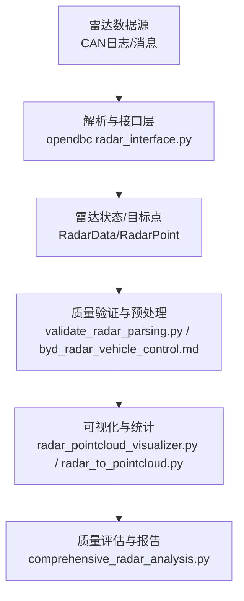
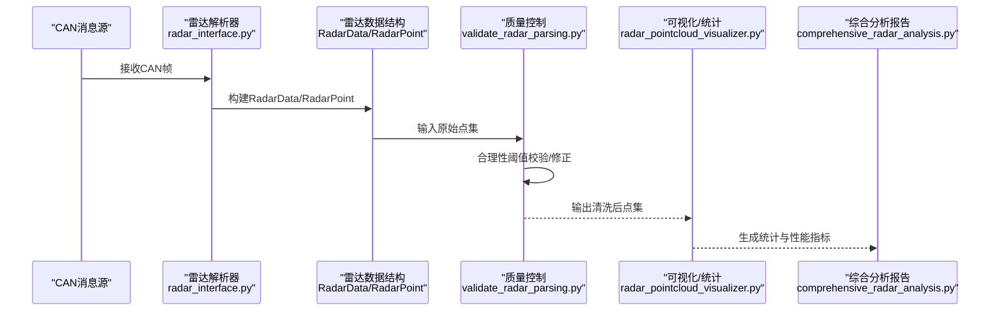
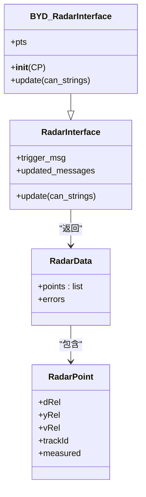
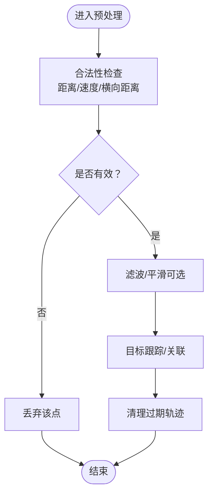
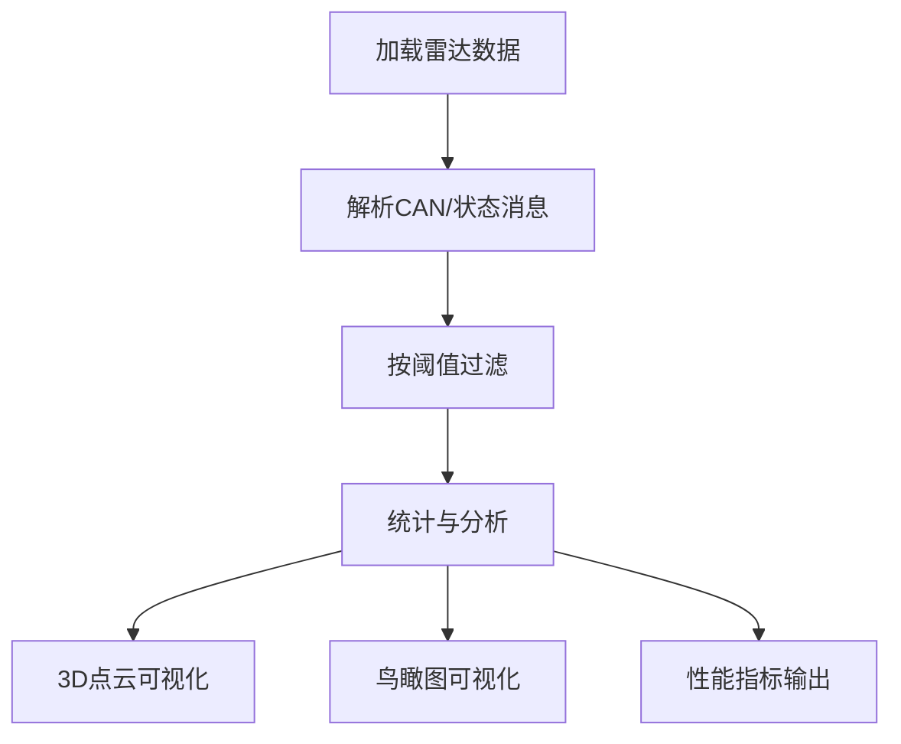
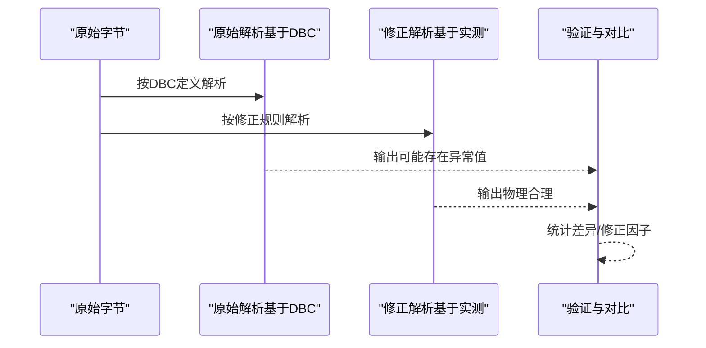
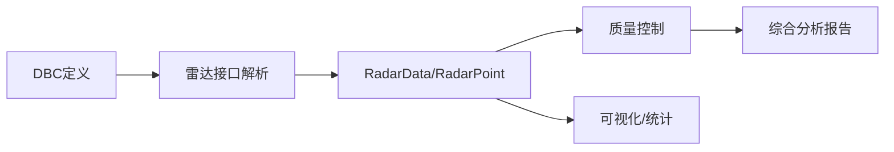
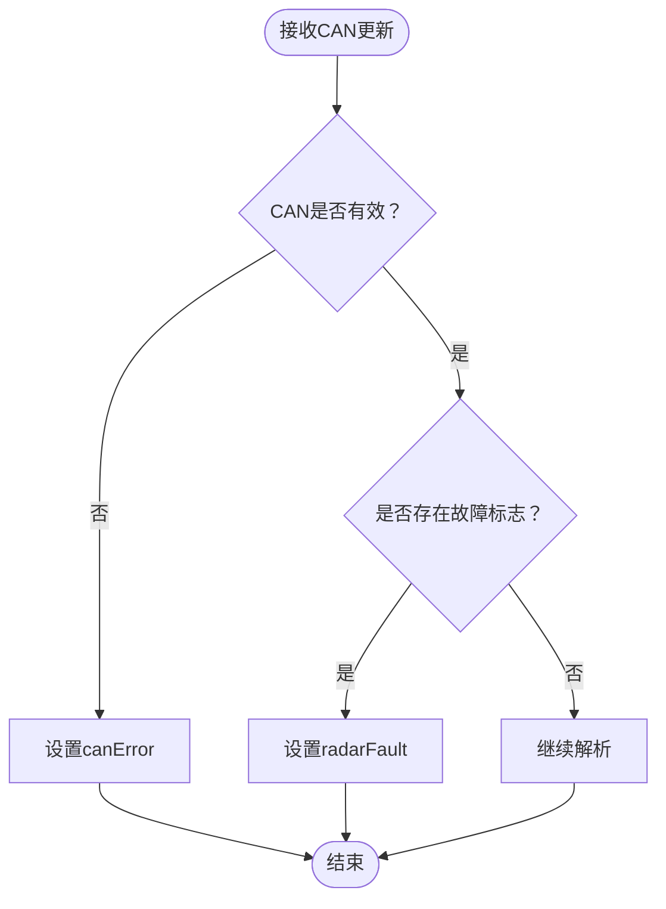

# 数据质量控制

<cite>
**本文引用的文件**
- [byd_radar_vehicle_control.md](file://docs/byd_radar_vehicle_control.md)
- [radar_pointcloud_visualizer.py](file://radar_pointcloud_visualizer.py)
- [radar_to_pointcloud.py](file://radar_to_pointcloud.py)
- [validate_radar_parsing.py](file://validate_radar_parsing.py)
- [comprehensive_radar_analysis.py](file://comprehensive_radar_analysis.py)
- [radar_interface.py](file://opendbc_repo/opendbc/car/byd/radar_interface.py)
- [radar_interface.py](file://opendbc_repo/opendbc/car/toyota/radar_interface.py)
- [radar_interface.py](file://opendbc_repo/opendbc/car/ford/radar_interface.py)
- [radar_interface.py](file://opendbc_repo/opendbc/car/gm/radar_interface.py)
- [radar_interface.py](file://opendbc_repo/opendbc/car/hyundai/radar_interface.py)
</cite>

## 目录
1. [引言](#引言)
2. [项目结构](#项目结构)
3. [核心组件](#核心组件)
4. [架构总览](#架构总览)
5. [详细组件分析](#详细组件分析)
6. [依赖分析](#依赖分析)
7. [性能考虑](#性能考虑)
8. [故障诊断与错误处理](#故障诊断与错误处理)
9. [数据清洗与预处理](#数据清洗与预处理)
10. [质量监控与自动化测试](#质量监控与自动化测试)
11. [最佳实践](#最佳实践)
12. [实际案例分析](#实际案例分析)
13. [结论](#结论)

## 引言
本文件面向“雷达数据质量控制系统”，围绕原始数据完整性检查、信号值合理性验证、异常数据过滤、质量评估指标、故障诊断与错误处理、数据清洗与预处理、质量监控与自动化测试、最佳实践以及实际案例展开，帮助读者全面理解并实施多层级的质量保障机制。

## 项目结构
本仓库中与雷达数据质量控制直接相关的模块主要分布在以下位置：
- 文档与规范：docs/byd_radar_vehicle_control.md
- 可视化与统计：radar_pointcloud_visualizer.py、radar_to_pointcloud.py
- 解析与验证：validate_radar_parsing.py、comprehensive_radar_analysis.py
- DBC与雷达接口：opendbc_repo/opendbc/car/*/radar_interface.py（BYD、丰田、福特、通用、现代等）

图表来源
- [radar_interface.py](file://opendbc_repo/opendbc/car/byd/radar_interface.py)
- [validate_radar_parsing.py](file://validate_radar_parsing.py)
- [byd_radar_vehicle_control.md](file://docs/byd_radar_vehicle_control.md)
- [radar_pointcloud_visualizer.py](file://radar_pointcloud_visualizer.py)
- [radar_to_pointcloud.py](file://radar_to_pointcloud.py)
- [comprehensive_radar_analysis.py](file://comprehensive_radar_analysis.py)

章节来源
- [radar_interface.py](file://opendbc_repo/opendbc/car/byd/radar_interface.py)
- [validate_radar_parsing.py](file://validate_radar_parsing.py)
- [byd_radar_vehicle_control.md](file://docs/byd_radar_vehicle_control.md)
- [radar_pointcloud_visualizer.py](file://radar_pointcloud_visualizer.py)
- [radar_to_pointcloud.py](file://radar_to_pointcloud.py)
- [comprehensive_radar_analysis.py](file://comprehensive_radar_analysis.py)

## 核心组件
- 雷达数据接口与解析
  - BYD雷达接口：从CAN消息提取目标距离、横向距离、有效性标记等，并生成RadarPoint集合。
  - 通用雷达接口模式：触发消息、有效性计数、故障标志、目标数量等。
- 数据验证与预处理
  - 合理性阈值校验（距离、速度、横向距离）。
  - 预处理流程（过滤无效点、平滑/滤波）。
- 可视化与统计
  - 3D点云与鸟瞰图展示，统计分布与性能指标。
- 解析验证
  - 对比DBC定义与实际数据，修正速度/角度解析因子，确保物理合理性。

章节来源
- [radar_interface.py](file://opendbc_repo/opendbc/car/byd/radar_interface.py)
- [byd_radar_vehicle_control.md](file://docs/byd_radar_vehicle_control.md)
- [radar_pointcloud_visualizer.py](file://radar_pointcloud_visualizer.py)
- [validate_radar_parsing.py](file://validate_radar_parsing.py)

## 架构总览
下图展示了从CAN消息到质量控制与可视化的整体流程：

图表来源
- [radar_interface.py](file://opendbc_repo/opendbc/car/byd/radar_interface.py)
- [validate_radar_parsing.py](file://validate_radar_parsing.py)
- [radar_pointcloud_visualizer.py](file://radar_pointcloud_visualizer.py)
- [comprehensive_radar_analysis.py](file://comprehensive_radar_analysis.py)

## 详细组件分析

### 组件A：雷达接口与数据结构
- BYD雷达接口负责：
  - 设置触发消息与解析器。
  - 从CAN消息中提取目标ID、纵向距离、横向距离、有效性标记。
  - 生成RadarPoint并填充到RadarData。
- 通用接口模式（以丰田/福特/通用/现代为例）：
  - 基于触发消息判断是否产生雷达数据。
  - 使用有效性计数或状态字段评估目标有效性。
  - 故障标志位（如CAN错误、传感器故障）统一写入错误域。

图表来源
- [radar_interface.py](file://opendbc_repo/opendbc/car/byd/radar_interface.py)
- [radar_interface.py](file://opendbc_repo/opendbc/car/toyota/radar_interface.py)
- [radar_interface.py](file://opendbc_repo/opendbc/car/ford/radar_interface.py)
- [radar_interface.py](file://opendbc_repo/opendbc/car/gm/radar_interface.py)
- [radar_interface.py](file://opendbc_repo/opendbc/car/hyundai/radar_interface.py)

章节来源
- [radar_interface.py](file://opendbc_repo/opendbc/car/byd/radar_interface.py)
- [radar_interface.py](file://opendbc_repo/opendbc/car/toyota/radar_interface.py)
- [radar_interface.py](file://opendbc_repo/opendbc/car/ford/radar_interface.py)
- [radar_interface.py](file://opendbc_repo/opendbc/car/gm/radar_interface.py)
- [radar_interface.py](file://opendbc_repo/opendbc/car/hyundai/radar_interface.py)

### 组件B：数据验证与预处理
- 合法性检查：
  - 距离范围：0.5m 至 200m。
  - 速度绝对值：不超过50m/s。
  - 横向距离：不超过15m。
- 预处理：
  - 过滤无效点后，可选应用滤波（如卡尔曼滤波）进行平滑。
  - 目标跟踪：基于关联距离匹配轨迹，清理过期轨迹。

图表来源
- [byd_radar_vehicle_control.md](file://docs/byd_radar_vehicle_control.md)

章节来源
- [byd_radar_vehicle_control.md](file://docs/byd_radar_vehicle_control.md)

### 组件C：可视化与统计
- 功能：
  - 3D点云与鸟瞰图展示雷达目标。
  - 统计指标：目标总数、唯一ID、有效目标比例、距离/速度/角度范围与均值。
  - 双雷达系统分析：短/长程雷达分别统计与覆盖分析。
  - 雷达位置推断：基于角度与坐标分布推断安装位置。
- 性能评估：
  - 距离分布统计、最大探测距离、ACC雷达能力评估。

图表来源
- [radar_pointcloud_visualizer.py](file://radar_pointcloud_visualizer.py)
- [radar_to_pointcloud.py](file://radar_to_pointcloud.py)

章节来源
- [radar_pointcloud_visualizer.py](file://radar_pointcloud_visualizer.py)
- [radar_to_pointcloud.py](file://radar_to_pointcloud.py)

### 组件D：解析验证与修正
- 目标：
  - 对比DBC定义与实际数据，定位解析偏差。
  - 修正速度缩放因子（由0.01修正为0.001），修正角度解码公式。
  - 验证距离解析与字节序一致性。
- 行为分析：
  - 短/长程雷达职责划分与合理范围评估。
  - ACC雷达性能评估（最大探测距离与适用场景）。

图表来源
- [validate_radar_parsing.py](file://validate_radar_parsing.py)
- [comprehensive_radar_analysis.py](file://comprehensive_radar_analysis.py)

章节来源
- [validate_radar_parsing.py](file://validate_radar_parsing.py)
- [comprehensive_radar_analysis.py](file://comprehensive_radar_analysis.py)

## 依赖分析
- 组件耦合：
  - radar_interface.py依赖DBC与CAN解析器，输出RadarData。
  - 质量控制依赖RadarData/RadarPoint结构。
  - 可视化依赖雷达点集与状态消息。
- 外部依赖：
  - DBC文件定义信号位宽、字节序与缩放因子。
  - 日志读取工具（LogReader）用于加载rlog/qlog。
- 潜在风险：
  - DBC定义与实际数据不一致会导致解析偏差。
  - 缺失触发消息或有效性计数异常会引发数据缺失或误判。

图表来源
- [radar_interface.py](file://opendbc_repo/opendbc/car/byd/radar_interface.py)
- [validate_radar_parsing.py](file://validate_radar_parsing.py)
- [radar_pointcloud_visualizer.py](file://radar_pointcloud_visualizer.py)
- [comprehensive_radar_analysis.py](file://comprehensive_radar_analysis.py)

章节来源
- [radar_interface.py](file://opendbc_repo/opendbc/car/byd/radar_interface.py)
- [validate_radar_parsing.py](file://validate_radar_parsing.py)
- [radar_pointcloud_visualizer.py](file://radar_pointcloud_visualizer.py)
- [comprehensive_radar_analysis.py](file://comprehensive_radar_analysis.py)

## 性能考虑
- 解析效率：
  - 采用大端序与整型转换，避免浮点运算开销。
  - 仅在触发消息到达时构建雷达数据，减少无效计算。
- 数据规模：
  - 通过阈值过滤与统计聚合，降低后续处理负载。
- 可视化性能：
  - 3D散点图与颜色映射在大数据量下需注意采样或降采样策略。

## 故障诊断与错误处理
- 雷达故障检测：
  - 通用接口中通过CAN有效性与传感器故障标志位设置错误域。
  - 有效性计数（如valid_cnt）用于判定目标连续有效性。
- 错误处理：
  - 当CAN无效或存在故障标志时，设置错误标记并回退至安全状态。
  - 对缺失触发消息或目标数量为0的情况进行早返回，避免空数据流。

图表来源
- [radar_interface.py](file://opendbc_repo/opendbc/car/gm/radar_interface.py)
- [radar_interface.py](file://opendbc_repo/opendbc/car/toyota/radar_interface.py)
- [radar_interface.py](file://opendbc_repo/opendbc/car/ford/radar_interface.py)

章节来源
- [radar_interface.py](file://opendbc_repo/opendbc/car/gm/radar_interface.py)
- [radar_interface.py](file://opendbc_repo/opendbc/car/toyota/radar_interface.py)
- [radar_interface.py](file://opendbc_repo/opendbc/car/ford/radar_interface.py)

## 数据清洗与预处理
- 噪声抑制与异常值剔除：
  - 基于阈值过滤（距离/速度/横向距离）。
  - 基于有效性标记与触发消息过滤无效帧。
- 数据插值与轨迹管理：
  - 通过目标跟踪与关联距离匹配，维持轨迹连续性。
  - 清理长时间未更新的轨迹，避免漂移累积。

章节来源
- [byd_radar_vehicle_control.md](file://docs/byd_radar_vehicle_control.md)
- [radar_pointcloud_visualizer.py](file://radar_pointcloud_visualizer.py)

## 质量监控与自动化测试
- 回归测试：
  - 对比不同解析方法（原始DBC定义 vs 修正解析）的输出差异。
  - 验证速度/角度修正因子对物理合理性的改善。
- 性能基准测试：
  - 统计距离分布、最大探测距离、覆盖率等指标，形成性能基线。
- 稳定性评估：
  - 可视化与统计模块定期运行，输出趋势报告，识别异常波动。

章节来源
- [validate_radar_parsing.py](file://validate_radar_parsing.py)
- [comprehensive_radar_analysis.py](file://comprehensive_radar_analysis.py)
- [radar_pointcloud_visualizer.py](file://radar_pointcloud_visualizer.py)

## 最佳实践
- 参数调优：
  - 距离/速度/横向距离阈值应结合实车场景与法规要求设定。
  - 有效性计数阈值应平衡灵敏度与抗抖动。
- 阈值设置：
  - 距离：0.5m 至 200m；速度：±50m/s；横向：±15m。
  - 长/短程雷达职责明确，避免交叉干扰。
- 报警机制：
  - CAN错误与雷达故障标志触发分级告警。
  - 数据质量指标偏离基线时触发预警。

## 实际案例分析
- 案例1：速度缩放因子修正
  - 现象：DBC定义速度缩放因子为0.01，导致速度值异常偏大。
  - 处理：依据实测数据修正为0.001，使速度值落在合理范围。
  - 结果：解析输出与物理现实一致，ACC雷达性能评估更可靠。
- 案例2：角度解码公式修正
  - 现象：DBC角度范围过大，实际使用特殊编码。
  - 处理：采用(b4-128) + (b5-128)*0.1的解码公式。
  - 结果：角度范围收敛至-180°到+180°，方位角更准确。

章节来源
- [validate_radar_parsing.py](file://validate_radar_parsing.py)
- [comprehensive_radar_analysis.py](file://comprehensive_radar_analysis.py)

## 结论
本质量控制体系通过“接口解析—合法性校验—预处理—可视化统计—综合分析”的闭环流程，实现了对雷达数据的多层次质量保障。结合DBC修正、阈值设定、故障标志与可视化统计，能够有效提升数据可靠性与系统稳定性，并为ACC等上层功能提供坚实基础。