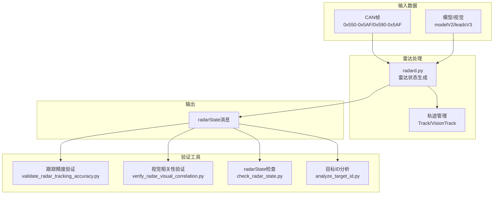
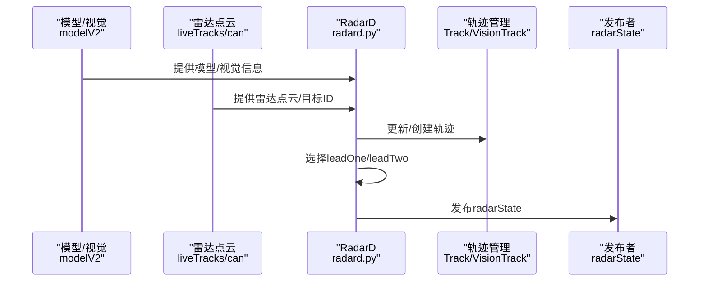
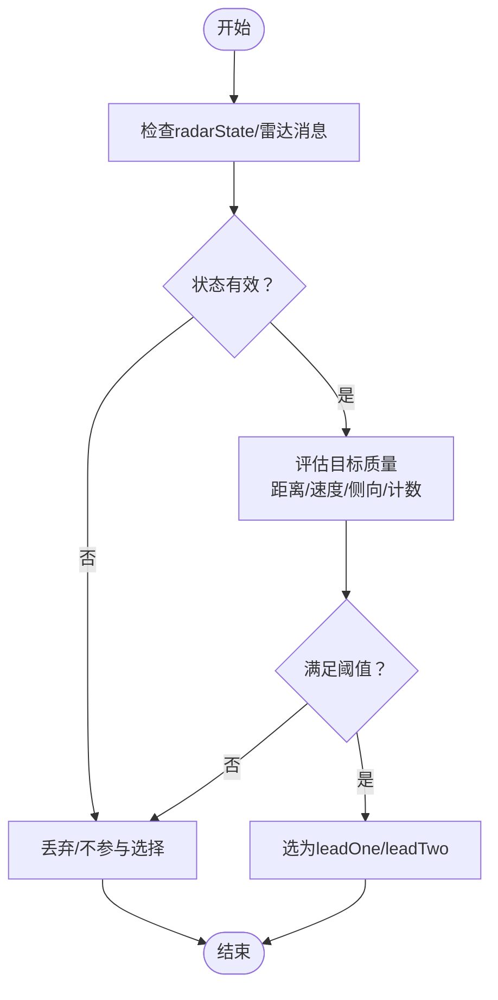
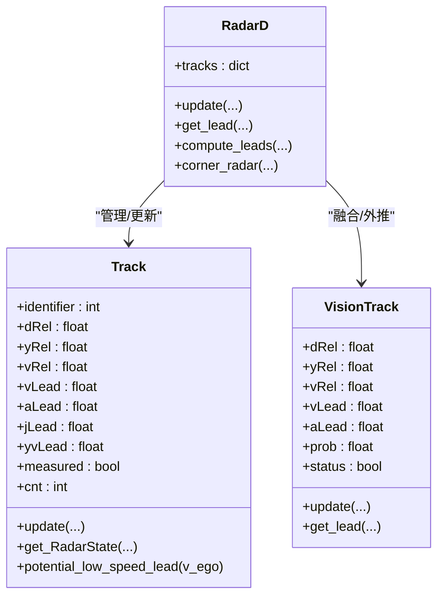
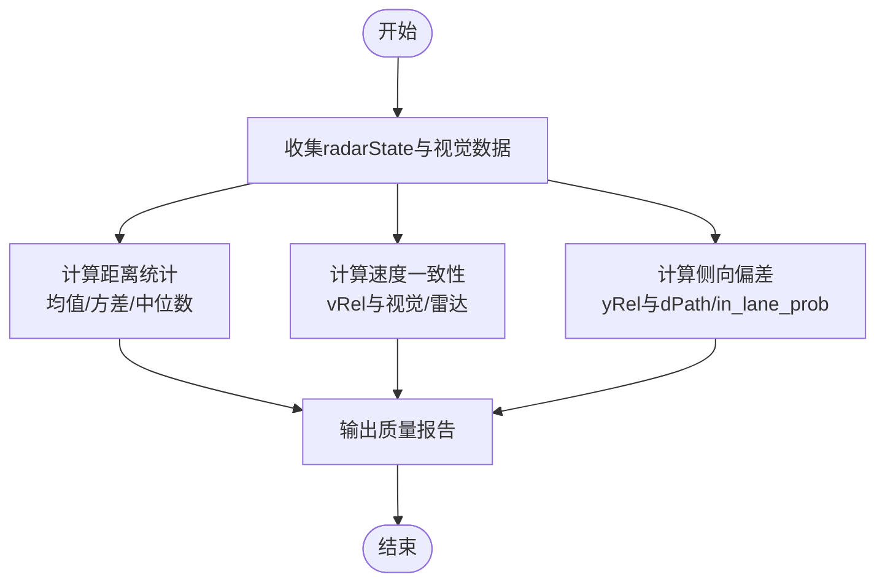
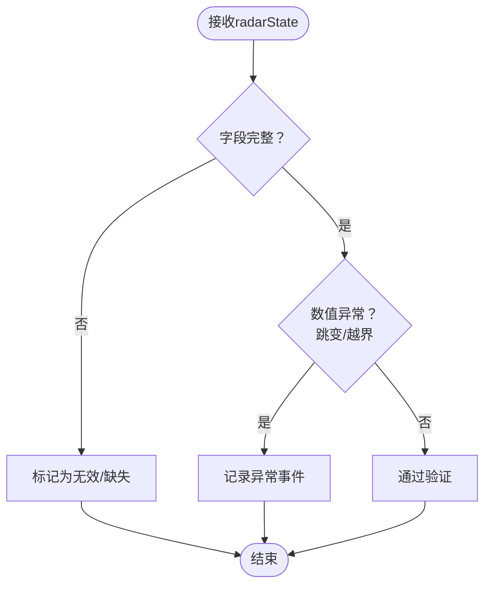
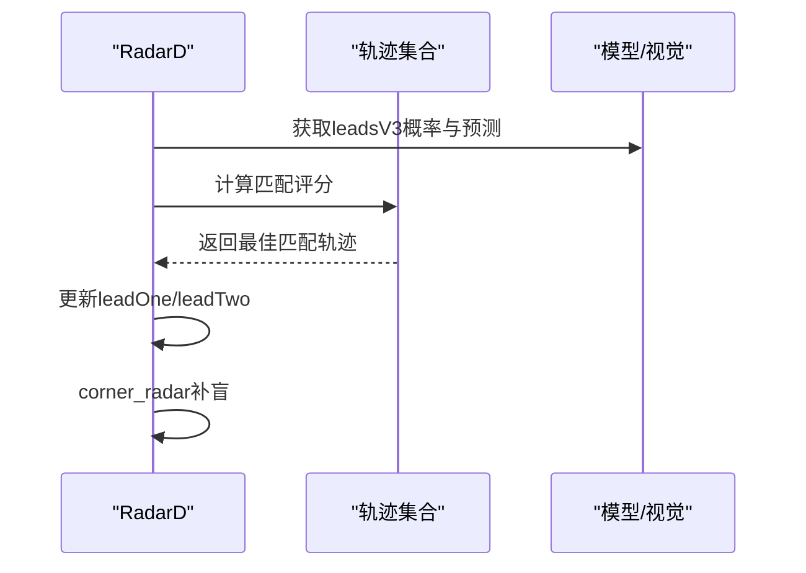
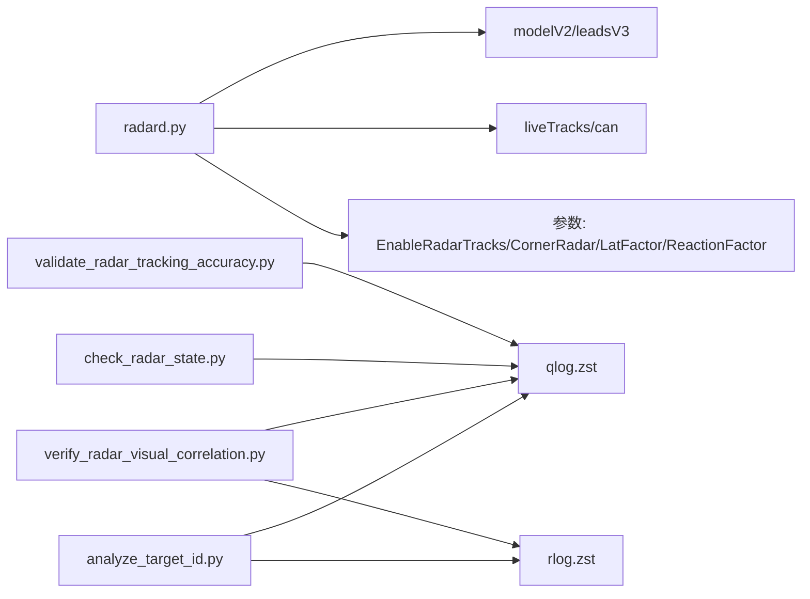

# 目标跟踪与验证

<cite>
**本文引用的文件**
- [selfdrive/controls/radard.py](file://selfdrive/controls/radard.py)
- [tools/validate_radar_tracking_accuracy.py](file://tools/validate_radar_tracking_accuracy.py)
- [tools/verify_radar_visual_correlation.py](file://tools/verify_radar_visual_correlation.py)
- [tools/check_radar_state.py](file://tools/check_radar_state.py)
- [tools/analyze_target_id.py](file://tools/analyze_target_id.py)
- [docs/BYD_ACC_Lead_Target_Analysis.md](file://docs/BYD_ACC_Lead_Target_Analysis.md)
- [docs/byd_radar_vehicle_control.md](file://docs/byd_radar_vehicle_control.md)
- [000000a0_0994738059_analyzed_dbc.dbc](file://000000a0_0994738059_analyzed_dbc.dbc)
</cite>

## 目录
1. [简介](#简介)
2. [项目结构](#项目结构)
3. [核心组件](#核心组件)
4. [架构总览](#架构总览)
5. [详细组件分析](#详细组件分析)
6. [依赖关系分析](#依赖关系分析)
7. [性能考量](#性能考量)
8. [故障排查指南](#故障排查指南)
9. [结论](#结论)
10. [附录](#附录)

## 简介
本文件面向“目标跟踪与验证”系统，围绕以下目标展开：目标状态判断机制（含TargetStatus信号有效性与跟踪状态评估）、目标跟踪ID的分配与管理（生命周期与算法）、目标质量评估指标（距离精度、速度可靠性、角度定位准确性）、数据验证与异常检测（无效目标过滤、异常值检测、数据完整性检查）、目标关联算法（多帧匹配与轨迹延续）、性能验证方法（跟踪精度、稳定性、误检率）、以及验证工具使用与调试技巧。文档同时给出可视化流程与时序图，帮助读者快速理解系统行为。

## 项目结构
本仓库包含雷达数据采集、解析、融合与验证的完整链路：
- 控制与融合层：radard.py负责雷达点云到目标状态的转换、轨迹管理、与视觉数据融合、角雷达补盲等。
- 工具链：多套验证脚本用于跟踪稳定性、雷达与视觉一致性、radarState内容检查、目标ID与角度关系分析。
- 文档与DBC：BYD ACC前车目标分析、雷达车辆控制设计文档、TargetStatus枚举定义等。

**图表来源**
- [selfdrive/controls/radard.py](file://selfdrive/controls/radard.py)
- [tools/validate_radar_tracking_accuracy.py](file://tools/validate_radar_tracking_accuracy.py)
- [tools/verify_radar_visual_correlation.py](file://tools/verify_radar_visual_correlation.py)
- [tools/check_radar_state.py](file://tools/check_radar_state.py)
- [tools/analyze_target_id.py](file://tools/analyze_target_id.py)

**章节来源**
- [selfdrive/controls/radard.py](file://selfdrive/controls/radard.py)
- [tools/validate_radar_tracking_accuracy.py](file://tools/validate_radar_tracking_accuracy.py)
- [tools/verify_radar_visual_correlation.py](file://tools/verify_radar_visual_correlation.py)
- [tools/check_radar_state.py](file://tools/check_radar_state.py)
- [tools/analyze_target_id.py](file://tools/analyze_target_id.py)

## 核心组件
- Track类：封装单个雷达目标的内部状态（距离、相对速度、加速度、侧向位置、未来路径估计、测量标记、计数等），并提供与模型/视觉融合的接口。
- VisionTrack类：在视觉可用时，对目标进行平滑与外推，补充速度/加速度估计，并与雷达数据进行概率融合。
- RadarD类：主控模块，负责接收雷达点云、更新轨迹、选择lead目标（leadOne/leadTwo）、与视觉/模型数据融合、角雷达补盲、生成radarState消息。
- 验证工具：跟踪稳定性、雷达与视觉一致性、radarState字段检查、目标ID与角度关系分析。

**章节来源**
- [selfdrive/controls/radard.py](file://selfdrive/controls/radard.py)

## 架构总览
radard进程从模型与雷达数据中提取目标，维护目标轨迹，融合视觉信息，最终输出radarState消息供上层控制使用。radarState包含目标距离、相对速度、加速度、侧向位置、未来路径、是否雷达/模型来源、置信度等字段。

**图表来源**
- [selfdrive/controls/radard.py](file://selfdrive/controls/radard.py)

**章节来源**
- [selfdrive/controls/radard.py](file://selfdrive/controls/radard.py)

## 详细组件分析

### 目标状态判断与TargetStatus信号有效性
- TargetStatus信号在DBC中定义为枚举值，涵盖“无效/有效/跟踪中/静止”。该信号用于指示目标状态，便于上层进行有效性筛选与跟踪状态评估。
- 在radard.py中，目标状态通过Track对象的内部字段与计数来间接反映：如cnt计数、measured标记、potential_low_speed_lead判定等，这些逻辑共同构成“目标是否有效且可被选为lead”的依据。

**图表来源**
- [000000a0_0994738059_analyzed_dbc.dbc](file://000000a0_0994738059_analyzed_dbc.dbc)
- [selfdrive/controls/radard.py](file://selfdrive/controls/radard.py)

**章节来源**
- [000000a0_0994738059_analyzed_dbc.dbc](file://000000a0_0994738059_analyzed_dbc.dbc)
- [selfdrive/controls/radard.py](file://selfdrive/controls/radard.py)

### 目标跟踪ID的分配与管理（生命周期与算法）
- 目标ID来源于CAN帧地址范围（0x590-0x5AF），每个ID对应一个雷达点云目标。radard.py按trackId建立轨迹字典，新增/更新/删除轨迹，形成目标生命周期管理。
- 轨迹生命周期的关键点：
  - 新增：首次出现trackId时创建Track实例。
  - 更新：根据模型/视觉/雷达点云更新状态（距离、速度、侧向、计数）。
  - 删除：若某帧不再出现该trackId，则从轨迹集合移除。
  - 选择：在多轨迹情况下，结合模型概率与距离/速度一致性选择leadOne/leadTwo。

**图表来源**
- [selfdrive/controls/radard.py](file://selfdrive/controls/radard.py)

**章节来源**
- [selfdrive/controls/radard.py](file://selfdrive/controls/radard.py)
- [tools/analyze_target_id.py](file://tools/analyze_target_id.py)

### 目标质量评估指标
- 距离精度：radarState中的dRel与视觉/雷达高精度源（如RADAR_MRR）对比，统计均值、方差、中位数；远距离目标稳定性通过标准差衡量。
- 速度测量可靠性：相对速度vRel与视觉/雷达速度源一致性；速度外推采用平滑与微分策略，降低噪声。
- 角度定位准确性：yRel与车道线/模型路径估计的偏差；未来路径dPath与in_lane_prob用于评估是否在车道内。

**图表来源**
- [tools/validate_radar_tracking_accuracy.py](file://tools/validate_radar_tracking_accuracy.py)
- [tools/verify_radar_visual_correlation.py](file://tools/verify_radar_visual_correlation.py)
- [selfdrive/controls/radard.py](file://selfdrive/controls/radard.py)

**章节来源**
- [tools/validate_radar_tracking_accuracy.py](file://tools/validate_radar_tracking_accuracy.py)
- [tools/verify_radar_visual_correlation.py](file://tools/verify_radar_visual_correlation.py)
- [selfdrive/controls/radard.py](file://selfdrive/controls/radard.py)

### 数据验证与异常检测
- 无效目标过滤：radarState中status字段为False或dRel<=0时视为无效；目标ID不在当前帧时及时清理。
- 异常值检测：radarState消息中dRel/vRel/yRel的突变（如>5m的跳变）作为异常事件记录；远距离目标的标准差过大亦视为不稳定。
- 数据完整性检查：radarState字段齐全性（status/valid/fcw/modelProb等）；radarState时间戳与模型时间戳对齐检查。

**图表来源**
- [tools/check_radar_state.py](file://tools/check_radar_state.py)
- [tools/validate_radar_tracking_accuracy.py](file://tools/validate_radar_tracking_accuracy.py)

**章节来源**
- [tools/check_radar_state.py](file://tools/check_radar_state.py)
- [tools/validate_radar_tracking_accuracy.py](file://tools/validate_radar_tracking_accuracy.py)

### 目标关联算法（多帧匹配与轨迹延续）
- 多帧目标匹配：基于laplacian概率模型，综合距离、侧向、速度的一致性评分，选择最佳匹配；支持“停止车”与“切入”场景的宽松阈值。
- 轨迹延续：cnt计数用于判断轨迹是否稳定；in_lane_prob与future估计用于左右/中心车道目标的延续与cut-in检测。
- 角雷达补盲：corner_radar在特定横向/纵向距离条件下，将角雷达信息注入radarState，提升近侧目标的鲁棒性。

**图表来源**
- [selfdrive/controls/radard.py](file://selfdrive/controls/radard.py)

**章节来源**
- [selfdrive/controls/radard.py](file://selfdrive/controls/radard.py)

### 性能验证方法
- 跟踪精度测试：统计radarState中dRel与视觉/雷达高精度源的均值差与标准差；远距离目标稳定性通过标准差衡量。
- 稳定性评估：记录radarState消息中dRel/vRel/yRel的跳变次数与幅度，评估连续性。
- 误检率分析：通过radarState中status与模型概率阈值的对比，统计误检/漏检比例。

**章节来源**
- [tools/validate_radar_tracking_accuracy.py](file://tools/validate_radar_tracking_accuracy.py)
- [tools/verify_radar_visual_correlation.py](file://tools/verify_radar_visual_correlation.py)

### 验证工具使用指南与调试技巧
- validate_radar_tracking_accuracy.py：读取qlog中的radarState，统计远距离目标稳定性、跳变事件与有效跟踪率，生成稳定性图。
- verify_radar_visual_correlation.py：对比雷达与视觉数据的分布与均值差异，验证解析方法的合理性。
- check_radar_state.py：检查radarState字段内容，验证新解析方法改进。
- analyze_target_id.py：分析目标ID与角度、距离的对应关系，辅助理解ID分配策略。

调试要点：
- 确认radarState时间戳与模型时间戳对齐。
- 关注leadOne/leadTwo的选择阈值与模型概率权重。
- 在corner_radar开启时，关注近侧目标的补盲效果。
- 使用目标ID分析工具排查ID与角度/距离的异常映射。

**章节来源**
- [tools/validate_radar_tracking_accuracy.py](file://tools/validate_radar_tracking_accuracy.py)
- [tools/verify_radar_visual_correlation.py](file://tools/verify_radar_visual_correlation.py)
- [tools/check_radar_state.py](file://tools/check_radar_state.py)
- [tools/analyze_target_id.py](file://tools/analyze_target_id.py)

## 依赖关系分析
- radard.py依赖模型/视觉数据（modelV2/leadsV3）与雷达数据（liveTracks/can），并通过参数（EnableRadarTracks、EnableCornerRadar、RadarLatFactor、RadarReactionFactor）控制行为。
- 验证工具依赖日志读取库（tools/lib/logreader），从qlog/rlog中抽取radarState/can数据进行统计与可视化。

**图表来源**
- [selfdrive/controls/radard.py](file://selfdrive/controls/radard.py)
- [tools/validate_radar_tracking_accuracy.py](file://tools/validate_radar_tracking_accuracy.py)
- [tools/verify_radar_visual_correlation.py](file://tools/verify_radar_visual_correlation.py)
- [tools/check_radar_state.py](file://tools/check_radar_state.py)
- [tools/analyze_target_id.py](file://tools/analyze_target_id.py)

**章节来源**
- [selfdrive/controls/radard.py](file://selfdrive/controls/radard.py)
- [tools/validate_radar_tracking_accuracy.py](file://tools/validate_radar_tracking_accuracy.py)
- [tools/verify_radar_visual_correlation.py](file://tools/verify_radar_visual_correlation.py)
- [tools/check_radar_state.py](file://tools/check_radar_state.py)
- [tools/analyze_target_id.py](file://tools/analyze_target_id.py)

## 性能考量
- 距离精度：优先使用高精度雷达源（如RADAR_MRR），在低精度或丢失时回退至其他数据源。
- 速度可靠性：结合视觉/雷达的速度估计，采用平滑与微分策略减少噪声。
- 角度定位：利用车道线/模型路径估计，结合in_lane_prob与future估计，提升侧向定位准确性。
- 轨迹稳定性：通过cnt计数、概率阈值与角雷达补盲，提升远距离与复杂场景下的跟踪稳定性。

[本节为通用指导，无需具体文件引用]

## 故障排查指南
- radarState字段缺失或异常：检查日志读取与字段访问逻辑，确认radarState结构与字段命名一致。
- 目标跳变频繁：检查radarState中dRel/vRel/yRel的跳变事件，定位异常帧并分析上游数据。
- 角雷达补盲无效：确认corner_radar参数与横向/纵向距离阈值设置，验证radarState中是否正确注入。
- 目标ID异常：使用analyze_target_id.py分析ID与角度/距离的映射关系，排查ID分配策略。

**章节来源**
- [tools/check_radar_state.py](file://tools/check_radar_state.py)
- [tools/validate_radar_tracking_accuracy.py](file://tools/validate_radar_tracking_accuracy.py)
- [tools/analyze_target_id.py](file://tools/analyze_target_id.py)

## 结论
本系统通过radard.py实现从雷达/视觉数据到radarState的高质量目标状态输出，结合多套验证工具实现对跟踪精度、稳定性与一致性的全面评估。TargetStatus信号与Track/VisionTrack的状态机共同保证了目标有效性与可选性；通过参数化控制与角雷达补盲，系统在复杂场景下仍能维持良好的鲁棒性。建议在实际部署中持续使用验证工具进行回归测试，并根据场景调整参数阈值。

[本节为总结，无需具体文件引用]

## 附录
- BYD ACC前车识别机制与RADAR_MRR高精度解码方法详见文档，可作为radarState质量评估的重要参考。
- 雷达车辆控制设计文档提供了目标跟踪与数据融合的高层思路，有助于理解radard.py的实现动机与边界条件。

**章节来源**
- [docs/BYD_ACC_Lead_Target_Analysis.md](file://docs/BYD_ACC_Lead_Target_Analysis.md)
- [docs/byd_radar_vehicle_control.md](file://docs/byd_radar_vehicle_control.md)