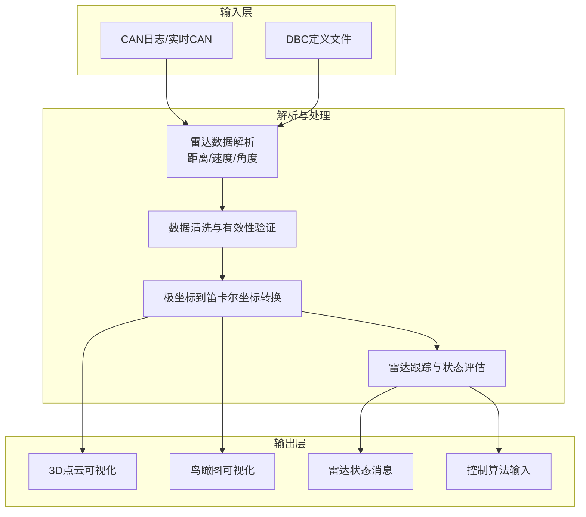
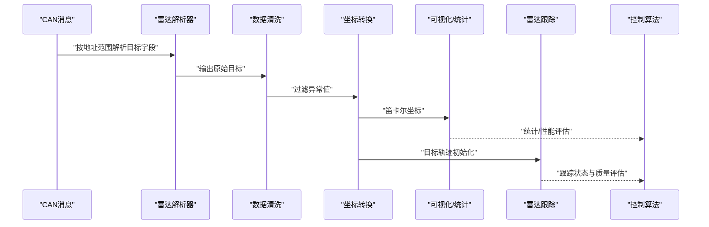
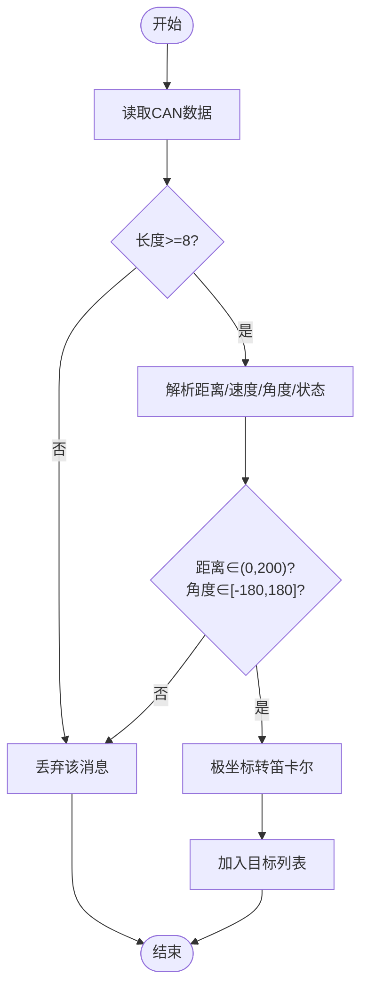
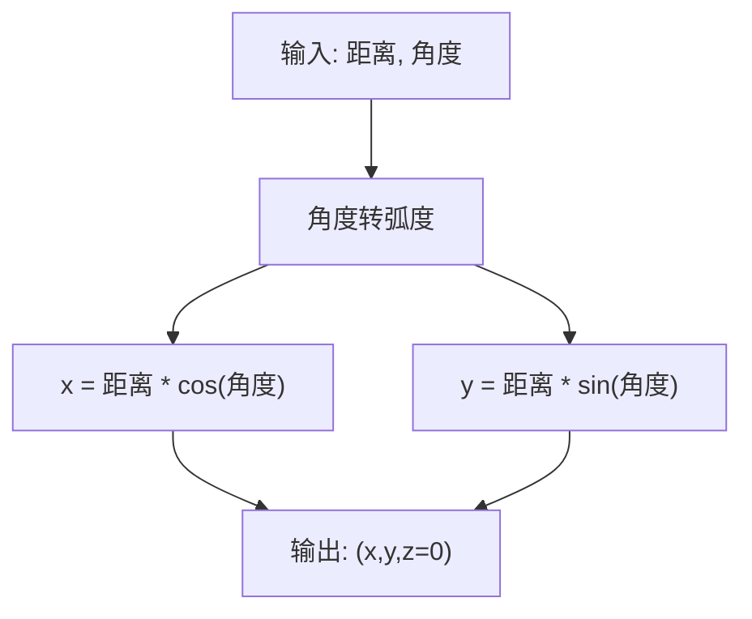
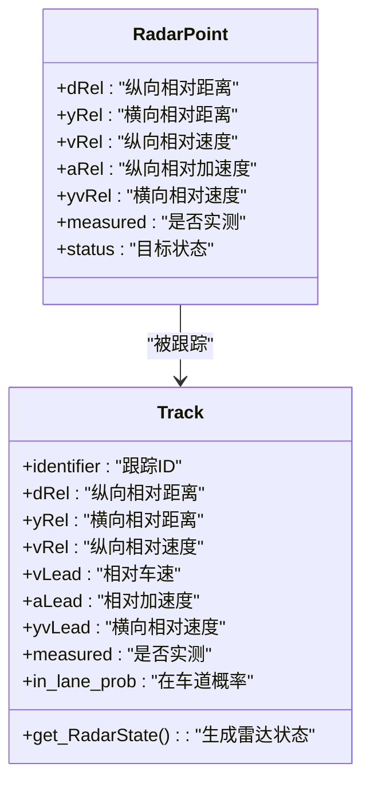
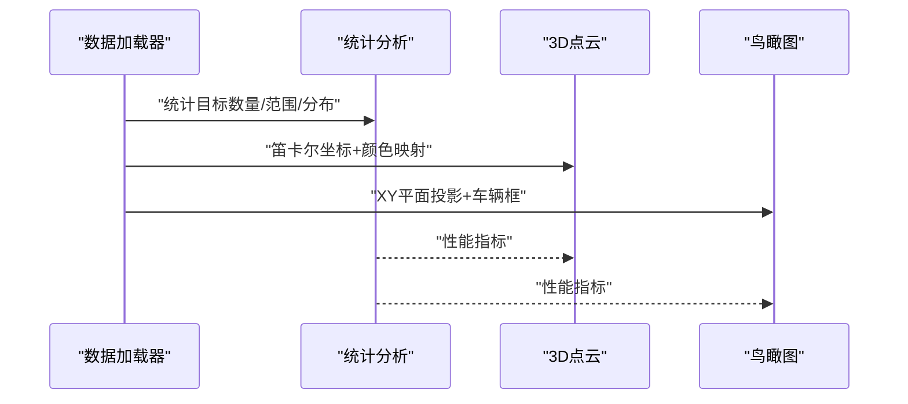
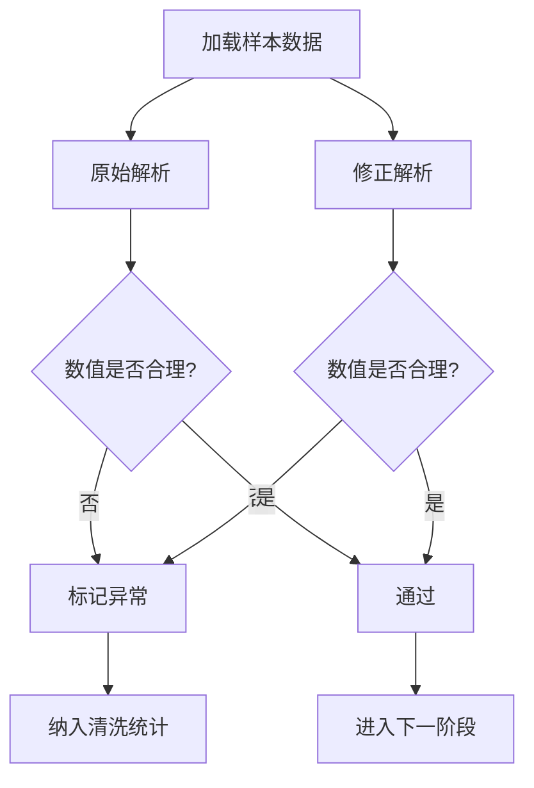
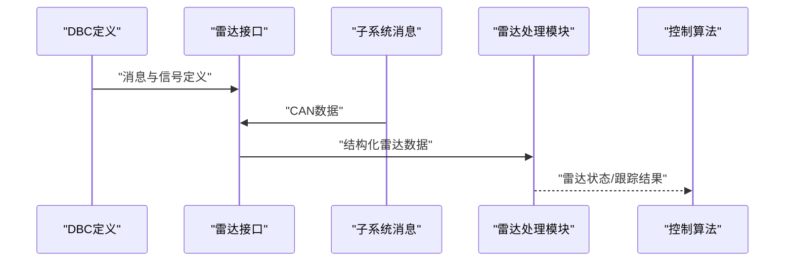
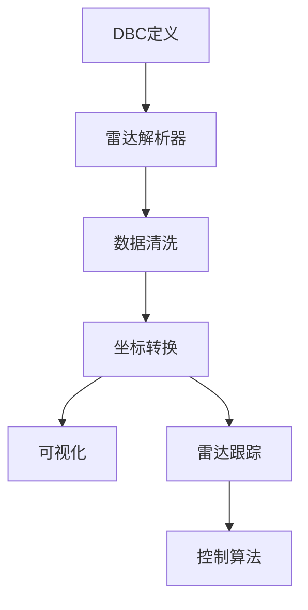

# 雷达数据处理系统

<cite>
**本文引用的文件**
- [radar_pointcloud_visualizer.py](file://radar_pointcloud_visualizer.py)
- [radar_to_pointcloud.py](file://radar_to_pointcloud.py)
- [validate_radar_parsing.py](file://validate_radar_parsing.py)
- [radard.py](file://selfdrive/controls/radard.py)
- [radar_interface.py](file://opendbc_repo/opendbc/car/byd/radar_interface.py)
- [reference_byd.dbc](file://reference_byd.dbc)
- [updated_radar_analysis_report.md](file://updated_radar_analysis_report.md)
- [complete_radar_reanalysis_report.md](file://complete_radar_reanalysis_report.md)
- [final_verification.py](file://final_verification.py)
</cite>

## 目录
1. [简介](#简介)
2. [项目结构](#项目结构)
3. [核心组件](#核心组件)
4. [架构总览](#架构总览)
5. [详细组件分析](#详细组件分析)
6. [依赖关系分析](#依赖关系分析)
7. [性能考虑](#性能考虑)
8. [故障排查指南](#故障排查指南)
9. [结论](#结论)
10. [附录](#附录)

## 简介
本文件面向BYD雷达数据处理系统，围绕原始雷达CAN消息解析、40个目标消息处理、角度到距离转换、目标状态与有效性验证、雷达点云生成与可视化、数据验证与质量控制、与车辆控制算法的数据接口与格式、以及性能优化与内存管理策略进行系统化说明。文档以仓库中现有实现与分析报告为依据，结合可视化脚本与控制侧雷达处理模块，给出可操作的技术细节与调试建议。

## 项目结构
本项目围绕雷达数据的采集、解析、融合与可视化展开，主要涉及以下模块：
- 可视化与统计分析：将雷达CAN数据转换为3D点云与鸟瞰图，并输出统计信息与性能评估。
- 控制侧雷达处理：对雷达目标进行跟踪、状态判定与质量评估，输出给上层控制算法。
- DBC与接口：通过DBC文件定义信号位宽、字节序与标定参数，雷达接口负责解析与触发消息。
- 数据验证：对解析方法进行对比验证，确保速度与角度解码的准确性。

**图表来源**
- [radar_pointcloud_visualizer.py:33-120](file://radar_pointcloud_visualizer.py#L33-L120)
- [radard.py:386-419](file://selfdrive/controls/radard.py#L386-L419)

**章节来源**
- [radar_pointcloud_visualizer.py:33-120](file://radar_pointcloud_visualizer.py#L33-L120)
- [radard.py:386-419](file://selfdrive/controls/radard.py#L386-L419)

## 核心组件
- 雷达数据解析器：负责从CAN消息中提取目标距离、相对速度、角度与状态信息；支持短/长距雷达地址范围。
- 数据清洗与有效性验证：过滤异常距离与角度范围，剔除无效目标。
- 坐标转换：将极坐标（距离、角度）转换为笛卡尔坐标（纵向、横向、高度），用于可视化与后续处理。
- 雷达跟踪与状态评估：基于控制侧模块对目标进行持续跟踪、状态判定与质量评估。
- 可视化工具：提供3D点云与鸟瞰图，叠加实时跟踪与雷达状态信息。

**章节来源**
- [radar_pointcloud_visualizer.py:33-120](file://radar_pointcloud_visualizer.py#L33-L120)
- [radar_to_pointcloud.py:31-112](file://radar_to_pointcloud.py#L31-L112)
- [validate_radar_parsing.py:10-64](file://validate_radar_parsing.py#L10-L64)
- [radard.py:31-123](file://selfdrive/controls/radard.py#L31-L123)

## 架构总览
雷达数据处理链路自下而上分为：CAN输入 → DBC解析 → 数据清洗 → 坐标转换 → 可视化/统计 → 控制侧跟踪 → 上层控制算法。其中，解析与清洗阶段是保证数据质量的关键，坐标转换与可视化用于理解感知效果，控制侧跟踪则将单帧目标整合为稳定轨迹。

**图表来源**
- [radar_pointcloud_visualizer.py:33-120](file://radar_pointcloud_visualizer.py#L33-L120)
- [radard.py:386-419](file://selfdrive/controls/radard.py#L386-L419)

## 详细组件分析

### 组件A：雷达数据解析与清洗
- 地址范围与目标数量
  - 短距雷达：0x520-0x547，共40个目标消息，用于近距泊车辅助。
  - 长距雷达：0x590-0x5AF，用于ACC等远距检测。
- 字段解析规则
  - 距离：大端序，16位，缩放因子0.01。
  - 相对速度：大端序，16位，有符号，缩放因子0.001（经实证分析修正）。
  - 角度：采用特殊公式(b4-128)+(b5-128)*0.1，范围约±180°。
  - 状态：高8位保留，低8位为目标状态位。
- 有效性验证
  - 距离范围：0~200m。
  - 角度范围：-180°~180°。
  - 仅保留有效目标，避免异常值进入后续处理。

**图表来源**
- [radar_pointcloud_visualizer.py:44-88](file://radar_pointcloud_visualizer.py#L44-L88)
- [validate_radar_parsing.py:10-64](file://validate_radar_parsing.py#L10-L64)

**章节来源**
- [radar_pointcloud_visualizer.py:44-88](file://radar_pointcloud_visualizer.py#L44-L88)
- [validate_radar_parsing.py:10-64](file://validate_radar_parsing.py#L10-L64)
- [updated_radar_analysis_report.md:6-32](file://updated_radar_analysis_report.md#L6-L32)

### 组件B：角度到距离的转换与坐标系变换
- 角度到距离转换
  - 将角度从度转换为弧度，再用三角函数计算纵向与横向坐标。
  - 假设雷达位于地面水平面，Z轴为0。
- 坐标系
  - 纵向：前进方向为正。
  - 横向：左侧为负，右侧为正。
  - 高度：地面水平，Z=0。

**图表来源**
- [radar_pointcloud_visualizer.py:71-76](file://radar_pointcloud_visualizer.py#L71-L76)

**章节来源**
- [radar_pointcloud_visualizer.py:71-76](file://radar_pointcloud_visualizer.py#L71-L76)

### 组件C：目标状态判断与有效性验证
- 状态位定义
  - 目标状态位在DBC中定义，常见取值包括“无效”、“有效”、“已跟踪”、“静止”等。
- 有效性阈值
  - 距离：0~200m。
  - 速度：根据修正后的缩放因子，范围应符合实际车辆速度。
  - 角度：-180°~180°。
- 控制侧质量评估
  - 控制侧模块对目标进行持续跟踪，更新相对位置、速度、加速度等状态，并输出质量评估（如是否在车道内、潜在碰撞风险等）。

**图表来源**
- [radard.py:31-123](file://selfdrive/controls/radard.py#L31-L123)

**章节来源**
- [radard.py:31-123](file://selfdrive/controls/radard.py#L31-L123)
- [000000a0_0994738059_analyzed_dbc.dbc:2820-2834](file://000000a0_0994738059_analyzed_dbc.dbc#L2820-L2834)

### 组件D：雷达点云生成与可视化
- 3D点云
  - 按目标ID着色，区分不同雷达单元。
  - 叠加实时跟踪点与雷达状态主导航点。
- 鸟瞰图
  - 展示目标在车辆中心视角的相对分布。
  - 叠加车辆轮廓与方向指示，便于理解方位关系。
- 性能评估
  - 输出距离分布、平均距离、标准差等指标。
  - 对长短距雷达分别统计，评估ACC能力。

**图表来源**
- [radar_pointcloud_visualizer.py:128-178](file://radar_pointcloud_visualizer.py#L128-L178)
- [radar_pointcloud_visualizer.py:260-374](file://radar_pointcloud_visualizer.py#L260-L374)
- [radar_pointcloud_visualizer.py:376-447](file://radar_pointcloud_visualizer.py#L376-L447)

**章节来源**
- [radar_pointcloud_visualizer.py:128-178](file://radar_pointcloud_visualizer.py#L128-L178)
- [radar_pointcloud_visualizer.py:260-374](file://radar_pointcloud_visualizer.py#L260-L374)
- [radar_pointcloud_visualizer.py:376-447](file://radar_pointcloud_visualizer.py#L376-L447)

### 组件E：数据验证与质量控制
- 解析方法对比
  - 基于DBC定义的原始解析与基于实证分析的修正解析对比，确认速度缩放因子与角度解码公式。
- 异常值检测
  - 距离/角度超出合理范围的目标直接丢弃。
  - 速度异常或角度畸变的目标标记为无效。
- 质量指标
  - 距离分布直方图、平均值与标准差。
  - 长/短距雷达的最大探测距离与覆盖范围。

**图表来源**
- [validate_radar_parsing.py:66-108](file://validate_radar_parsing.py#L66-L108)
- [final_verification.py:58-82](file://final_verification.py#L58-L82)

**章节来源**
- [validate_radar_parsing.py:66-108](file://validate_radar_parsing.py#L66-L108)
- [final_verification.py:58-82](file://final_verification.py#L58-L82)

### 组件F：与车辆控制算法的数据接口与数据格式
- DBC与接口
  - DBC定义了雷达目标消息的信号位宽、字节序与标定参数。
  - 雷达接口模块负责解析指定消息并生成雷达数据结构。
- 控制侧输入
  - 控制侧模块接收dRel/yRel/vRel/aRel/yvRel/measured等字段，进行跟踪与状态评估。
  - 输出雷达状态（含是否在车道内、潜在碰撞风险等）供上层控制算法使用。

**图表来源**
- [radar_interface.py:8-56](file://opendbc_repo/opendbc/car/byd/radar_interface.py#L8-L56)
- [radard.py:386-419](file://selfdrive/controls/radard.py#L386-L419)

**章节来源**
- [radar_interface.py:8-56](file://opendbc_repo/opendbc/car/byd/radar_interface.py#L8-L56)
- [radard.py:386-419](file://selfdrive/controls/radard.py#L386-L419)

## 依赖关系分析
- 解析器依赖DBC定义的信号位宽与字节序，同时依赖实证分析修正的角度与速度解码规则。
- 控制侧雷达处理模块依赖解析器提供的目标状态与测量标志，进一步进行跟踪与质量评估。
- 可视化模块依赖解析器与控制侧输出，形成闭环反馈。

**图表来源**
- [reference_byd.dbc:1-189](file://reference_byd.dbc#L1-L189)
- [radar_pointcloud_visualizer.py:33-120](file://radar_pointcloud_visualizer.py#L33-L120)
- [radard.py:386-419](file://selfdrive/controls/radard.py#L386-L419)

**章节来源**
- [reference_byd.dbc:1-189](file://reference_byd.dbc#L1-L189)
- [radar_pointcloud_visualizer.py:33-120](file://radar_pointcloud_visualizer.py#L33-L120)
- [radard.py:386-419](file://selfdrive/controls/radard.py#L386-L419)

## 性能考虑
- 解析效率
  - 使用大端序整型解析，避免浮点运算开销；角度解码采用整数与乘法，复杂度低。
  - 批量处理时优先使用列表推导与Numpy数组，减少Python循环。
- 内存管理
  - 及时清理无效目标与历史缓存，避免长期累积导致内存膨胀。
  - 控制侧跟踪模块使用队列与滑动窗口，限制历史长度。
- 可视化优化
  - 在非交互环境使用非GUI后端，避免图形库阻塞。
  - 对点云数量较多场景，采用降采样或分层渲染策略。

[本节为通用指导，无需具体文件引用]

## 故障排查指南
- 解析异常
  - 若速度异常偏大/偏小，检查速度缩放因子是否为0.001而非0.01。
  - 若角度异常或越界，检查角度解码公式是否为(b4-128)+(b5-128)*0.1。
- 数据缺失
  - 确认CAN地址范围是否包含0x520-0x547与0x590-0x5AF。
  - 检查触发消息是否存在，避免未更新返回空。
- 可视化问题
  - 若无数据可显示，检查数据加载路径与日志文件完整性。
  - 若坐标异常，核对角度单位与三角函数转换是否一致。

**章节来源**
- [validate_radar_parsing.py:93-108](file://validate_radar_parsing.py#L93-L108)
- [radar_pointcloud_visualizer.py:259-288](file://radar_pointcloud_visualizer.py#L259-L288)
- [radard.py:21-30](file://selfdrive/controls/radard.py#L21-L30)

## 结论
本系统通过严谨的解析规则、有效的数据清洗与坐标转换，实现了从原始CAN雷达数据到3D点云与控制侧跟踪的完整链路。实证分析表明，速度缩放因子与角度解码公式需修正以匹配实际数据范围；控制侧模块进一步提升了目标稳定性与质量评估能力。可视化工具为系统调试与性能评估提供了直观支撑。

[本节为总结性内容，无需具体文件引用]

## 附录
- 实时处理流程要点
  - 输入：CAN日志或实时CAN。
  - 处理：解析→清洗→坐标转换→统计/可视化→跟踪→控制输入。
  - 输出：雷达状态消息与可视化结果。
- 调试技巧
  - 使用对比脚本验证解析方法差异。
  - 通过统计报告快速定位异常范围。
  - 在控制侧启用参数开关观察跟踪变化。

**章节来源**
- [updated_radar_analysis_report.md:34-47](file://updated_radar_analysis_report.md#L34-L47)
- [complete_radar_reanalysis_report.md:77-91](file://complete_radar_reanalysis_report.md#L77-L91)
- [final_verification.py:58-82](file://final_verification.py#L58-L82)