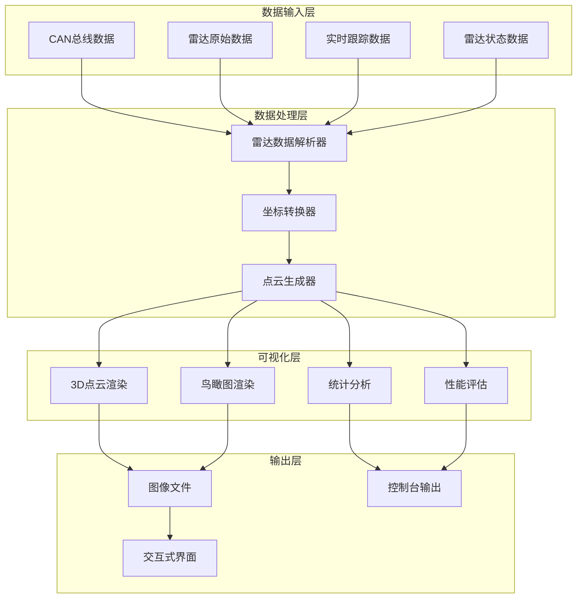
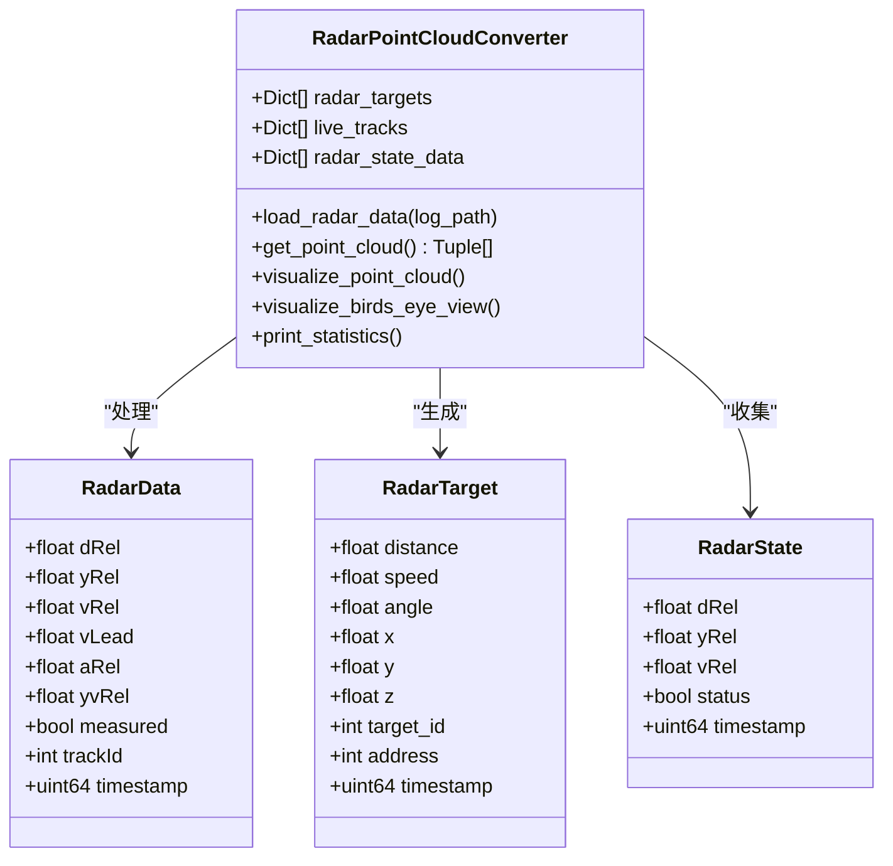
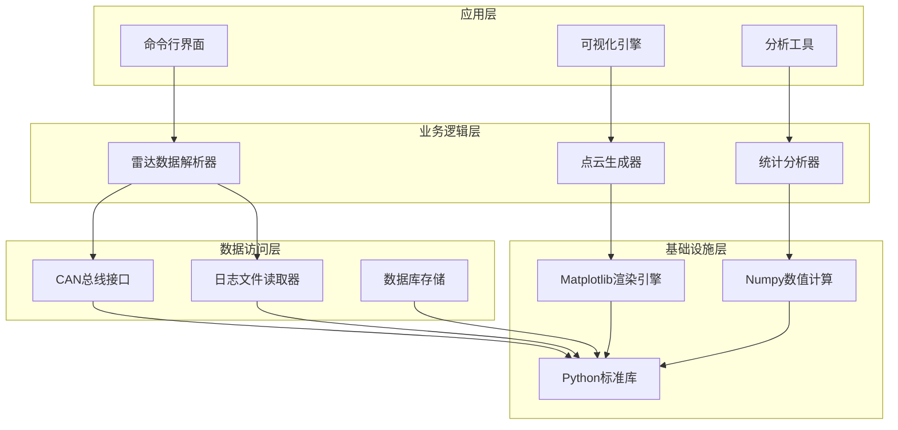
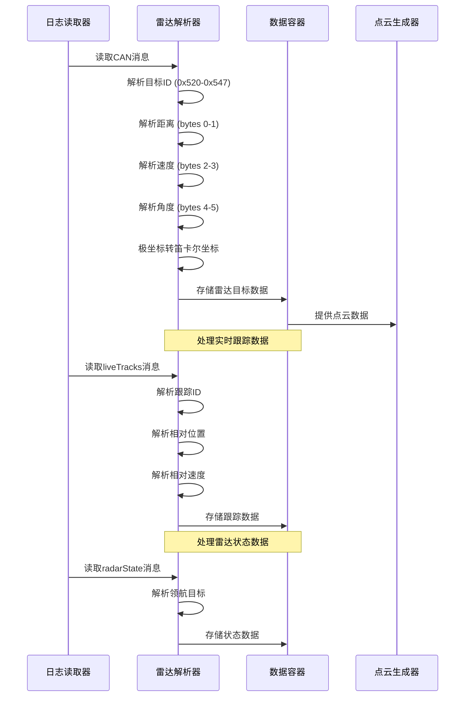
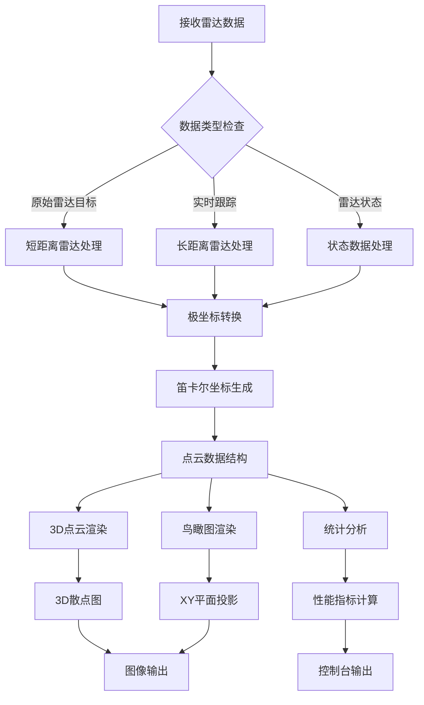
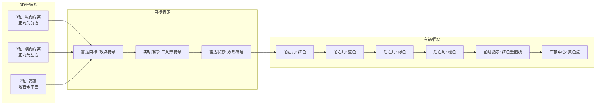
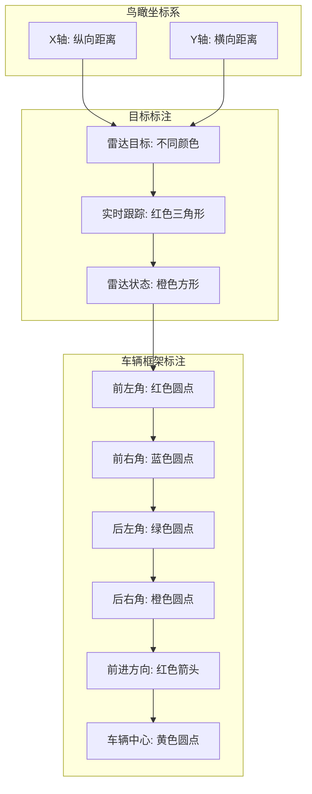
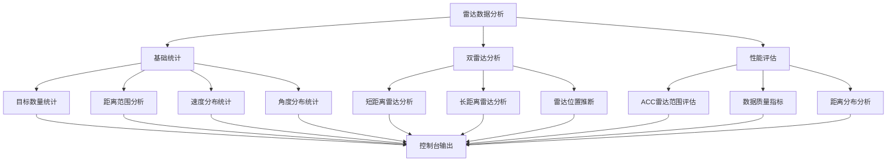
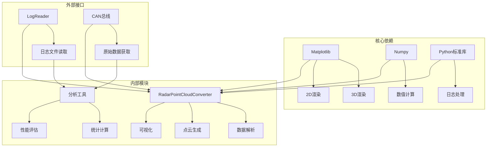

# 雷达点云生成与可视化

<cite>
**本文档引用的文件**
- [radar_pointcloud_visualizer.py](file://radar_pointcloud_visualizer.py)
- [radar_to_pointcloud.py](file://radar_to_pointcloud.py)
- [analyze_acc_radar_pointcloud.py](file://tools/analyze_acc_radar_pointcloud.py)
- [ENHANCED_BYD_RADAR_VISUALIZATION_README.md](file://ENHANCED_BYD_RADAR_VISUALIZATION_README.md)
- [ENHANCED_CORNER_MARKERS_AND_DIRECTION_INDICATOR_README.md](file://ENHANCED_CORNER_MARKERS_AND_DIRECTION_INDICATOR_README.md)
- [radard.py](file://selfdrive/controls/radard.py)
- [radar_interface.py](file://opendbc_repo/opendbc/car/byd/radar_interface.py)
- [radar_interface.py](file://opendbc_repo/opendbc/car/toyota/radar_interface.py)
- [radar_interface.py](file://opendbc_repo/opendbc/car/ford/radar_interface.py)
- [_radar_common.py](file://opendbc_repo/opendbc/dbc/generator/tesla/_radar_common.py)
</cite>

## 目录
1. [简介](#简介)
2. [项目结构](#项目结构)
3. [核心组件](#核心组件)
4. [架构概览](#架构概览)
5. [详细组件分析](#详细组件分析)
6. [依赖关系分析](#依赖关系分析)
7. [性能考虑](#性能考虑)
8. [故障排除指南](#故障排除指南)
9. [结论](#结论)
10. [附录](#附录)

## 简介

本项目是一个完整的雷达点云生成与可视化系统，专门针对BYD车辆的雷达数据进行处理和展示。该系统能够将CAN总线上的雷达原始数据转换为三维点云，并提供多种可视化模式来帮助工程师分析和调试雷达系统。

系统的核心特性包括：
- **双雷达系统支持**：同时处理短距离（0x520-0x547）和长距离（0x590-0x5AF）雷达数据
- **多源数据融合**：整合原始雷达目标、实时跟踪数据和雷达状态信息
- **高级分析功能**：提供ACC雷达性能评估、距离分布分析和数据质量指标
- **丰富的可视化选项**：3D点云视图、鸟瞰图和增强的车辆框架标注

## 项目结构

项目采用模块化设计，主要包含以下核心模块：



**图表来源**
- [radar_pointcloud_visualizer.py:1-722](file://radar_pointcloud_visualizer.py#L1-L722)
- [radar_to_pointcloud.py:1-291](file://radar_to_pointcloud.py#L1-L291)

**章节来源**
- [radar_pointcloud_visualizer.py:1-722](file://radar_pointcloud_visualizer.py#L1-L722)
- [radar_to_pointcloud.py:1-291](file://radar_to_pointcloud.py#L1-L291)

## 核心组件

### 数据结构设计

系统采用统一的数据结构来组织雷达点云数据，确保不同来源的数据能够一致地表示和处理：



**图表来源**
- [radar_pointcloud_visualizer.py:24-126](file://radar_pointcloud_visualizer.py#L24-L126)

### 坐标系对齐与转换

系统实现了从极坐标到笛卡尔坐标的精确转换，确保雷达数据在三维空间中的正确表示：

| 参数 | 符号 | 单位 | 描述 | 转换公式 |
|------|------|------|------|----------|
| 目标距离 | dRel | 米 | 相对目标的纵向距离 | x = dRel × cos(θ) |
| 横向偏移 | yRel | 米 | 相对车辆的横向距离 | y = dRel × sin(θ) |
| 相对速度 | vRel | m/s | 相对目标的速度 | vLead = vRel + vEgo |
| 加速度 | aRel | m/s² | 相对加速度 | aRel = NaN |
| 横向速度 | yvRel | m/s | 横向速度 | yvRel = 0 |

**章节来源**
- [radar_pointcloud_visualizer.py:90-126](file://radar_pointcloud_visualizer.py#L90-L126)
- [radard.py:31-123](file://selfdrive/controls/radard.py#L31-L123)

## 架构概览

系统采用分层架构设计，确保各个组件之间的职责清晰分离：



**图表来源**
- [radar_pointcloud_visualizer.py:1-722](file://radar_pointcloud_visualizer.py#L1-L722)
- [analyze_acc_radar_pointcloud.py:1-482](file://tools/analyze_acc_radar_pointcloud.py#L1-L482)

## 详细组件分析

### 雷达数据解析器

数据解析器负责从CAN总线和日志文件中提取雷达数据，并进行必要的格式转换：



**图表来源**
- [radar_pointcloud_visualizer.py:33-126](file://radar_pointcloud_visualizer.py#L33-L126)

### 点云生成与渲染

点云生成器将解析后的数据转换为三维点云格式，并提供多种渲染选项：



**图表来源**
- [radar_pointcloud_visualizer.py:121-258](file://radar_pointcloud_visualizer.py#L121-L258)
- [radar_pointcloud_visualizer.py:260-374](file://radar_pointcloud_visualizer.py#L260-L374)

### 可视化引擎

系统提供了两种主要的可视化模式，每种都有其特定的应用场景：

#### 3D点云视图

3D点云视图提供了最直观的雷达数据展示方式，特别适合分析目标的空间分布：



**图表来源**
- [radar_pointcloud_visualizer.py:196-246](file://radar_pointcloud_visualizer.py#L196-L246)

#### 鸟瞰图

鸟瞰图为用户提供了一个从上方观察的视角，便于理解目标的相对位置关系：



**图表来源**
- [radar_pointcloud_visualizer.py:323-363](file://radar_pointcloud_visualizer.py#L323-L363)

**章节来源**
- [radar_pointcloud_visualizer.py:128-374](file://radar_pointcloud_visualizer.py#L128-L374)

### 统计分析与性能评估

系统内置了全面的统计分析功能，用于评估雷达系统的性能和数据质量：



**图表来源**
- [radar_pointcloud_visualizer.py:376-621](file://radar_pointcloud_visualizer.py#L376-L621)

**章节来源**
- [radar_pointcloud_visualizer.py:376-682](file://radar_pointcloud_visualizer.py#L376-L682)

## 依赖关系分析

系统依赖关系清晰，主要依赖包括：



**图表来源**
- [radar_pointcloud_visualizer.py:1-22](file://radar_pointcloud_visualizer.py#L1-L22)
- [analyze_acc_radar_pointcloud.py:1-17](file://tools/analyze_acc_radar_pointcloud.py#L1-L17)

**章节来源**
- [radar_pointcloud_visualizer.py:1-22](file://radar_pointcloud_visualizer.py#L1-L22)
- [analyze_acc_radar_pointcloud.py:1-17](file://tools/analyze_acc_radar_pointcloud.py#L1-L17)

## 性能考虑

### 内存优化策略

系统采用了多种内存优化技术来处理大规模雷达数据：

1. **增量数据处理**：逐帧处理雷达数据，避免一次性加载所有数据
2. **数据结构优化**：使用列表和字典组合，减少内存占用
3. **条件过滤**：只保留有效数据，过滤掉异常值和噪声
4. **延迟计算**：按需计算统计数据，避免不必要的计算开销

### 渲染性能优化

为了提高可视化性能，系统实现了以下优化：

1. **批量渲染**：使用numpy数组进行批量数据操作
2. **缓存机制**：缓存计算结果，避免重复计算
3. **自适应采样**：根据数据密度调整点云密度
4. **异步渲染**：支持非阻塞渲染模式

### 大数据量处理

对于大型日志文件，系统提供了以下处理策略：

1. **分段处理**：将大文件分割为小段进行处理
2. **进度监控**：显示处理进度和剩余时间
3. **错误恢复**：支持断点续传和错误恢复
4. **资源限制**：设置内存和CPU使用上限

## 故障排除指南

### 常见问题及解决方案

| 问题类型 | 症状 | 可能原因 | 解决方案 |
|----------|------|----------|----------|
| 数据导入失败 | 导入错误或空数据 | 环境配置问题或文件路径错误 | 检查openpilot环境和文件路径 |
| 无数据显示 | 图像空白或控制台无输出 | 雷达数据不存在或格式不匹配 | 验证CAN消息地址范围 |
| 性能问题 | 处理缓慢或内存不足 | 数据量过大或系统资源限制 | 使用分段处理或增加系统资源 |
| 显示异常 | 图像模糊或坐标错误 | 坐标转换或缩放设置问题 | 检查坐标系设置和缩放因子 |

### 调试工具

系统提供了多种调试工具来帮助用户诊断问题：

1. **统计输出**：详细的雷达数据统计信息
2. **性能分析**：运行时性能指标监控
3. **数据验证**：雷达数据格式验证
4. **可视化调试**：逐步调试可视化过程

**章节来源**
- [ENHANCED_BYD_RADAR_VISUALIZATION_README.md:130-161](file://ENHANCED_BYD_RADAR_VISUALIZATION_README.md#L130-L161)

## 结论

本雷达点云生成与可视化系统为BYD车辆的雷达数据分析提供了完整的解决方案。系统具有以下优势：

1. **功能完整性**：涵盖了从数据解析到可视化的完整流程
2. **扩展性强**：模块化设计支持功能扩展和定制
3. **性能优异**：优化的算法和数据结构确保高效处理
4. **用户体验好**：直观的界面和丰富的可视化选项

该系统不仅适用于雷达数据的分析和调试，还可以作为其他车辆雷达系统的参考实现。通过持续的功能改进和性能优化，该系统将在自动驾驶和辅助驾驶领域发挥重要作用。

## 附录

### 使用示例

#### 基础使用
```bash
# 显示统计信息
python radar_pointcloud_visualizer.py /path/to/rlog.zst --stats

# 3D点云可视化
python radar_pointcloud_visualizer.py /path/to/rlog.zst --pointcloud

# 鸟瞰图可视化
python radar_pointcloud_visualizer.py /path/to/rlog.zst --birds-eye
```

#### 高级分析
```bash
# 性能分析
python radar_pointcloud_visualizer.py /path/to/rlog.zst --performance

# 保存图像
python radar_pointcloud_visualizer.py /path/to/rlog.zst --pointcloud --save-plots
```

### 参数说明

| 参数 | 类型 | 默认值 | 描述 |
|------|------|--------|------|
| log_path | 字符串 | 必需 | 日志文件路径 |
| --pointcloud | 标志 | False | 显示3D点云视图 |
| --birds-eye | 标志 | False | 显示鸟瞰图 |
| --stats | 标志 | False | 显示统计信息 |
| --performance | 标志 | False | 显示性能分析 |
| --save-plots | 标志 | False | 保存图像文件 |

### 技术规格

- **支持的雷达类型**：BYD短距离和长距离雷达
- **数据格式**：CAN总线消息和日志文件
- **输出格式**：PNG图像和控制台文本
- **系统要求**：Python 3.7+，openpilot环境
- **内存要求**：根据数据量动态调整