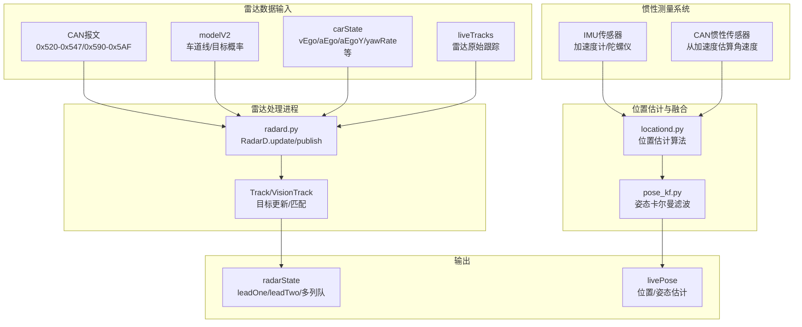
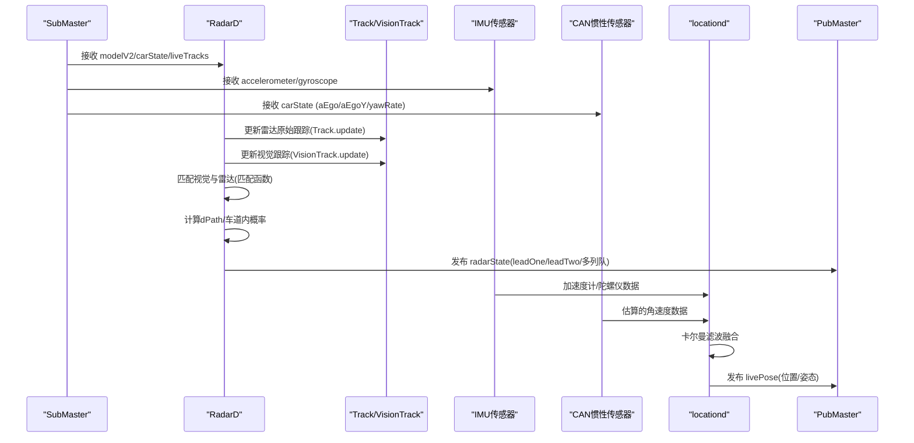
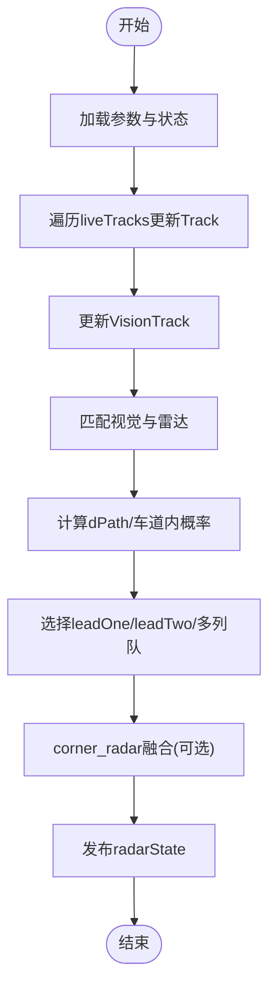
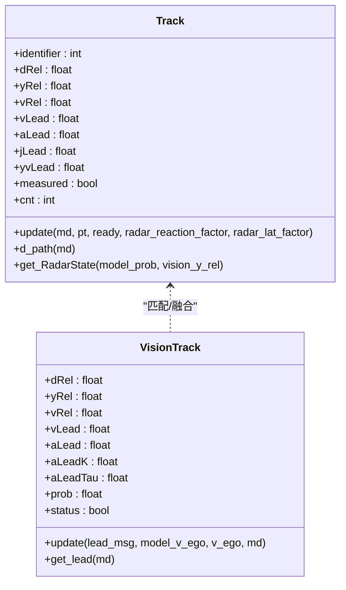
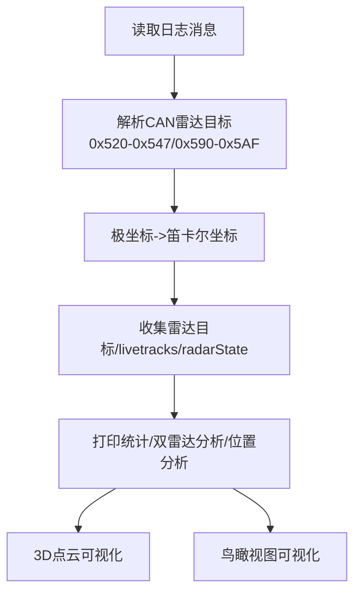
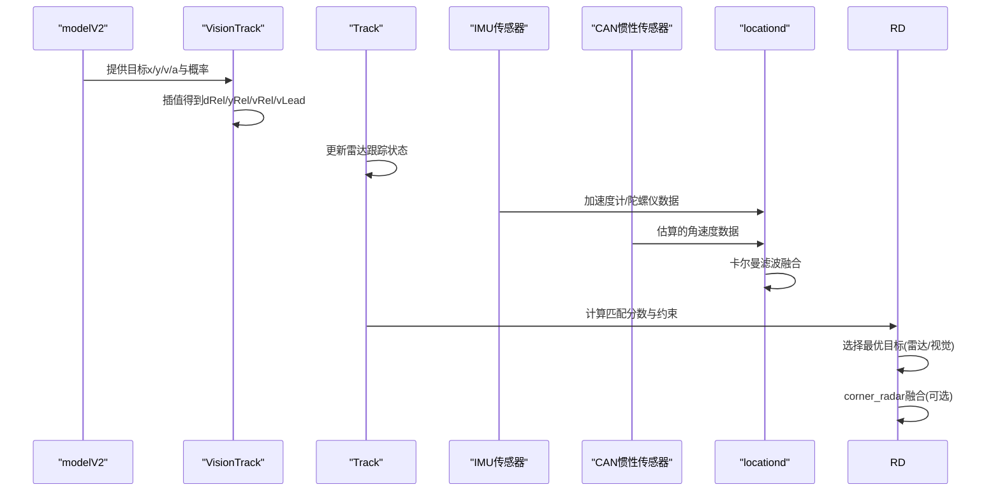
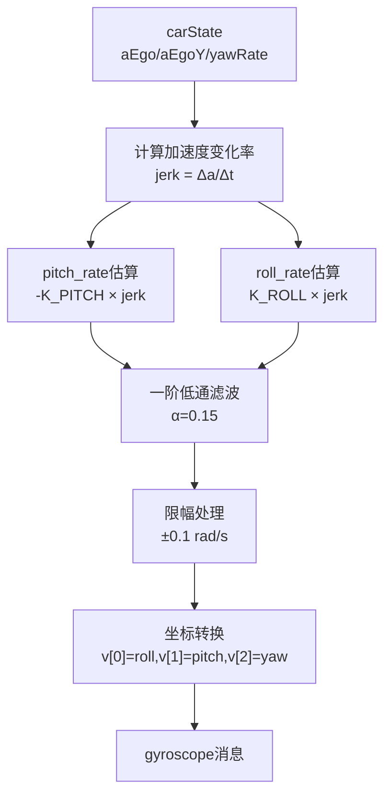
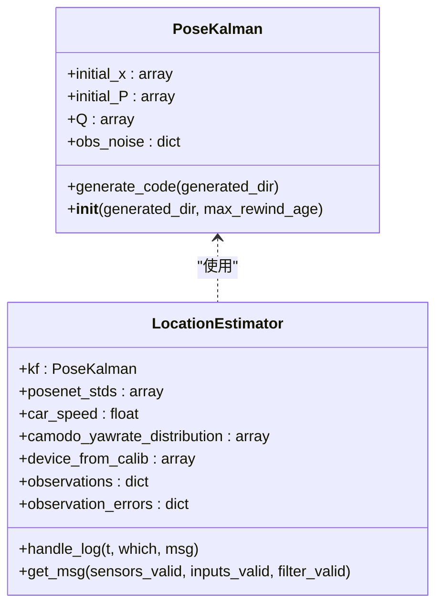
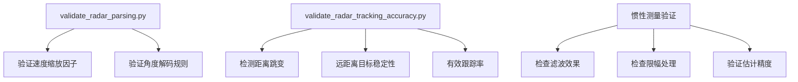
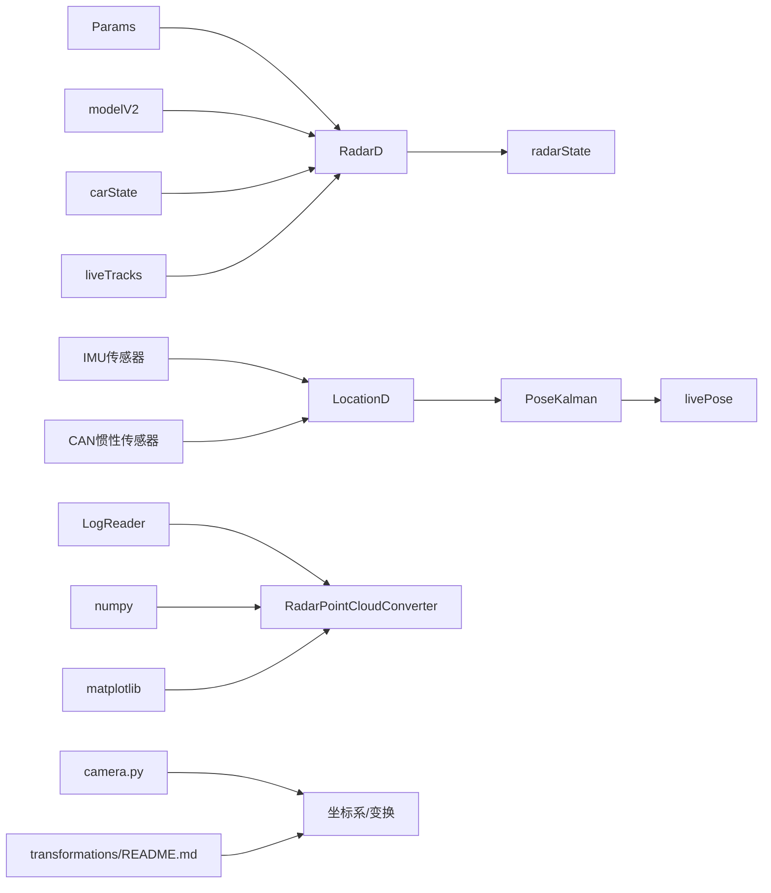

# 传感器数据处理

<cite>
**本文引用的文件**
- [radard.py](file://selfdrive/controls/radard.py)
- [radar_pointcloud_visualizer.py](file://radar_pointcloud_visualizer.py)
- [radar_to_pointcloud.py](file://radar_to_pointcloud.py)
- [validate_radar_parsing.py](file://validate_radar_parsing.py)
- [validate_radar_tracking_accuracy.py](file://tools/validate_radar_tracking_accuracy.py)
- [camera.py](file://common/transformations/camera.py)
- [README.md](file://common/transformations/README.md)
- [simple_kalman.py](file://common/simple_kalman.py)
- [locationd.py](file://selfdrive/locationd/locationd.py)
- [pose_kf.py](file://selfdrive/locationd/models/pose_kf.py)
- [sensord.py](file://system/sensord/sensord.py)
- [sensord_can.cc](file://system/sensord_can/sensord_can.cc)
- [universal_can_sensor.cc](file://system/sensord_can/sensors/universal_can_sensor.cc)
- [universal_can_sensor.h](file://system/sensord_can/sensors/universal_can_sensor.h)
- [paramsd.py](file://selfdrive/locationd/paramsd.py)
- [car_kf.py](file://selfdrive/locationd/models/car_kf.py)
- [analyze_sensors.py](file://tools/analyze_sensors.py)
</cite>

## 更新摘要
**所做更改**
- 新增CAN传感器系统惯性测量能力章节，详细说明从加速度变化率估算缺失的3轴陀螺仪数据
- 更新位置估计与融合部分，增加pitch/roll rate估计、低通滤波和限幅处理
- 新增与locationd卡尔曼滤波器的集成改进说明
- 扩展传感器融合策略，包含IMU数据的处理与验证
- 增强了CAN惯性传感器功能的实现细节，包括从加速度变化率估算pitch/roll rate的算法
- 改进了3轴陀螺仪数据的完整性处理

## 目录
1. [简介](#简介)
2. [项目结构](#项目结构)
3. [核心组件](#核心组件)
4. [架构总览](#架构总览)
5. [详细组件分析](#详细组件分析)
6. [依赖关系分析](#依赖关系分析)
7. [性能考量](#性能考量)
8. [故障排查指南](#故障排查指南)
9. [结论](#结论)
10. [附录](#附录)

## 简介
本文件面向"传感器数据处理"模块，聚焦雷达信号处理、目标跟踪与融合、点云分析与轨迹预测、以及数据验证工具的使用。文档以自车雷达为核心，结合摄像头与IMU（通过模型输出）进行多源信息融合，提供从底层CAN报文解析到上层radarState发布的完整链路说明，并给出参数配置、返回值语义、常见问题与解决方案，帮助初学者快速上手，同时为有经验的开发者提供足够的技术深度。

**更新** 新增CAN传感器系统惯性测量能力，包括从加速度变化率估算缺失的3轴陀螺仪数据，涵盖pitch/roll rate估计、低通滤波和限幅处理，以及与locationd卡尔曼滤波器的集成改进。

## 项目结构
围绕雷达数据处理的关键文件与职责如下：
- 自车雷达处理进程：负责接收模型输出、车辆状态与雷达原始跟踪，计算并发布radarState
- 雷达数据可视化与统计：将CAN雷达目标转换为点云，支持3D与鸟瞰视图，输出统计与性能评估
- 雷达解析与验证：验证速度缩放因子、角度解码规则，评估解析准确性
- 跟踪稳定性验证：基于日志分析radarState目标跟踪的稳定性与连续性
- 传感器变换与坐标系：提供相机内参、设备帧与模型帧等参考系转换基础
- **惯性测量系统**：通过CAN总线估算3轴陀螺仪数据，与IMU传感器协同工作

**图表来源**
- [radard.py:411-482](file://selfdrive/controls/radard.py#L411-L482)
- [locationd.py:51-202](file://selfdrive/locationd/locationd.py#L51-L202)
- [sensord_can.cc:95-161](file://system/sensord_can/sensord_can.cc#L95-L161)

**章节来源**
- [radard.py:411-482](file://selfdrive/controls/radard.py#L411-L482)
- [radar_pointcloud_visualizer.py:37-120](file://radar_pointcloud_visualizer.py#L37-L120)
- [radar_to_pointcloud.py:31-111](file://radar_to_pointcloud.py#L31-L111)
- [locationd.py:51-202](file://selfdrive/locationd/locationd.py#L51-L202)
- [sensord_can.cc:95-161](file://system/sensord_can/sensord_can.cc#L95-L161)

## 核心组件
- RadarD：雷达处理主类，聚合雷达原始跟踪、模型输出与车辆状态，维护目标轨迹集合，最终生成radarState
- Track：单目标状态机，维护相对位置、速度、加速度、侧向速度、未来位姿估计、车道内概率等
- VisionTrack：视觉目标跟踪器，与雷达目标进行匹配与融合
- RadarPointCloudConverter：雷达数据到点云转换与可视化工具，支持3D与鸟瞰视图，统计与性能分析
- **位置估计算法**：基于多传感器融合的位置估计，包括IMU数据处理和卡尔曼滤波
- **惯性测量传感器**：从CAN总线数据估算3轴陀螺仪数据，包括pitch/roll rate估计
- 验证工具：雷达解析准确性验证、跟踪稳定性验证

**章节来源**
- [radard.py:31-123](file://selfdrive/controls/radard.py#L31-L123)
- [radard.py:251-298](file://selfdrive/controls/radard.py#L251-L298)
- [radard.py:386-482](file://selfdrive/controls/radard.py#L386-L482)
- [locationd.py:51-202](file://selfdrive/locationd/locationd.py#L51-L202)
- [pose_kf.py:29-107](file://selfdrive/locationd/models/pose_kf.py#L29-L107)
- [universal_can_sensor.h:7-60](file://system/sensord_can/sensors/universal_can_sensor.h#L7-L60)

## 架构总览
雷达数据处理链路由"输入—处理—融合—输出"构成：
- 输入：CAN雷达目标（短距/长距）、模型V2（车道线/目标概率）、carState（车速、加速度、偏航率）、liveTracks（雷达原始跟踪）、IMU传感器数据
- 处理：RadarD.update按帧更新目标状态，计算dPath/in_lane概率，决定是否选择雷达或视觉目标
- 融合：通过match_vision_to_track将视觉目标与雷达轨迹匹配；corner_radar在特定条件下融合角部雷达信息
- **惯性测量**：从CAN总线的加速度数据估算pitch/roll rate，与IMU数据融合
- **位置估计**：locationd使用多传感器观测数据，通过卡尔曼滤波估计车辆姿态和位置
- 输出：构造radarState，包含leadOne/leadTwo及左右/中心多列队目标，以及livePose位置姿态估计

**图表来源**
- [radard.py:411-482](file://selfdrive/controls/radard.py#L411-L482)
- [locationd.py:256-333](file://selfdrive/locationd/locationd.py#L256-L333)
- [universal_can_sensor.cc:44-90](file://system/sensord_can/sensors/universal_can_sensor.cc#L44-L90)

**章节来源**
- [radard.py:411-620](file://selfdrive/controls/radard.py#L411-L620)
- [locationd.py:256-333](file://selfdrive/locationd/locationd.py#L256-L333)

## 详细组件分析

### 雷达处理主流程（RadarD）
- 参数与状态
  - 从Params读取EnableRadarTracks、EnableCornerRadar、RadarLatFactor、RadarReactionFactor
  - 维护v_ego历史、tracks字典、vision_tracks列表、radar_state消息
- 关键步骤
  - 从liveTracks遍历雷达原始跟踪，按trackId构建/更新Track
  - 若模型可用且概率达标，更新VisionTrack并尝试与雷达匹配
  - 计算dPath与车道内概率，筛选有效目标，生成leadOne/leadTwo与多列队
  - corner_radar在特定条件下融合角部雷达信息
  - 发布radarState，包含mdMonoTime、radarErrors、carStateMonoTime等

**图表来源**
- [radard.py:411-482](file://selfdrive/controls/radard.py#L411-L482)
- [radard.py:484-529](file://selfdrive/controls/radard.py#L484-L529)
- [radard.py:531-620](file://selfdrive/controls/radard.py#L531-L620)

**章节来源**
- [radard.py:404-482](file://selfdrive/controls/radard.py#L404-L482)
- [radard.py:484-620](file://selfdrive/controls/radard.py#L484-L620)

### 目标跟踪与匹配（Track/VisionTrack）
- Track
  - 维护dRel/yRel/vRel/aLead/jLead/yvLead/measured/cnt等
  - 通过FirstOrderFilter管理aLead的衰减时间常数
  - 计算dPath与in_lane_prob，预测未来位姿（yRel_future/dRel_future），考虑雷达反应因子与横向因子
  - 提供get_RadarState导出字段（含radarTrackId/modelProb/fcw等）
- VisionTrack
  - 基于模型V2的目标预测（x/y/v/a），插值dRel/yRel并计算vRel/vLead
  - 对速度/加速度采用指数滑动平滑，结合模型置信度调整权重
  - 维护aLeadTau，学习恒定加速度特性

**图表来源**
- [radard.py:31-123](file://selfdrive/controls/radard.py#L31-L123)
- [radard.py:251-384](file://selfdrive/controls/radard.py#L251-L384)

**章节来源**
- [radard.py:31-123](file://selfdrive/controls/radard.py#L31-L123)
- [radard.py:251-384](file://selfdrive/controls/radard.py#L251-L384)

### 点云分析与可视化（雷达数据到点云）
- 数据来源
  - CAN雷达目标（0x520-0x547短距、0x590-0x5AF长距）
  - liveTracks（雷达原始跟踪）
  - radarState（已融合后的leadOne等）
- 功能
  - 将极坐标（距离/角度）转笛卡尔坐标（x/y/z），默认z=0
  - 支持3D点云与鸟瞰视图，标注车辆轮廓与方向
  - 输出统计信息（目标数量、距离/速度/角度范围、有效率）
  - 双雷达系统分析（短距/长距分别统计）
  - 雷达位置分析（按CAN地址分组，推断前后左右/角落位置）
  - 性能评估（最大探测距离、距离分布、ACC适用性）

**图表来源**
- [radar_pointcloud_visualizer.py:37-120](file://radar_pointcloud_visualizer.py#L37-L120)
- [radar_pointcloud_visualizer.py:128-374](file://radar_pointcloud_visualizer.py#L128-L374)
- [radar_pointcloud_visualizer.py:376-682](file://radar_pointcloud_visualizer.py#L376-L682)

**章节来源**
- [radar_pointcloud_visualizer.py:37-120](file://radar_pointcloud_visualizer.py#L37-L120)
- [radar_pointcloud_visualizer.py:128-374](file://radar_pointcloud_visualizer.py#L128-L374)
- [radar_pointcloud_visualizer.py:376-682](file://radar_pointcloud_visualizer.py#L376-L682)

### 传感器融合策略（摄像头+雷达+IMU）
- 融合原则
  - 当模型可用且概率达标时，优先使用模型预测（VisionTrack）作为纵向状态
  - 雷达提供横向与相对速度信息，Track计算dPath与车道内概率，辅助判断目标是否在本车道
  - 通过laplacian_pdf计算雷达与视觉目标的匹配分数，综合距离/横向/速度约束
  - **IMU数据融合**：加速度计提供线性加速度信息，陀螺仪提供角速度信息，通过卡尔曼滤波融合
  - **CAN惯性传感器**：从CAN总线的纵向/横向加速度估算pitch/roll rate，补充缺失的3轴陀螺仪数据
- 角部雷达融合（corner_radar）
  - 在特定条件下（如左右横向距离小于阈值），将角部雷达信息融合进radarState，提高近车场景稳定性

**图表来源**
- [radard.py:130-223](file://selfdrive/controls/radard.py#L130-L223)
- [locationd.py:97-202](file://selfdrive/locationd/locationd.py#L97-L202)
- [universal_can_sensor.cc:44-90](file://system/sensord_can/sensors/universal_can_sensor.cc#L44-L90)

**章节来源**
- [radard.py:130-223](file://selfdrive/controls/radard.py#L130-L223)
- [locationd.py:97-202](file://selfdrive/locationd/locationd.py#L97-L202)
- [universal_can_sensor.cc:44-90](file://system/sensord_can/sensors/universal_can_sensor.cc#L44-L90)

### 惯性测量系统（CAN传感器）
**更新** 增强了CAN惯性传感器功能，新增从加速度变化率估算pitch/roll rate的算法

- **系统组成**
  - UniversalYawSensor：从carState数据估算pitch/roll rate
  - UniversalAccelSensor：提供3轴加速度数据
  - sensord_can：CAN传感器守护进程，管理传感器初始化和数据发布
- **pitch/roll rate估计算法**
  - 利用纵向加速度(aEgo)和横向加速度(aEgoY)的变化率（jerk）估算角速度
  - 比例系数：K_PITCH = 0.002（制动jerk → 俯仰角速度），K_ROLL = 0.0015（转向jerk → 横滚角速度）
  - 公式：pitch_rate = -K_PITCH × (ΔaEgo/Δt)，roll_rate = K_ROLL × (ΔaEgoY/Δt)
- **信号处理**
  - 一阶低通滤波（α = 0.15，截止频率≈2.4Hz @100Hz采样）
  - 限幅处理：±0.1 rad/s（乘用车正常范围）
- **数据转换**
  - carState → gyroscope：v[0]=roll, v[1]=pitch, v[2]=yaw（经过locationd转换为[-v[2],-v[1],-v[0]]）

**图表来源**
- [universal_can_sensor.cc:44-90](file://system/sensord_can/sensors/universal_can_sensor.cc#L44-L90)
- [universal_can_sensor.cc:116-146](file://system/sensord_can/sensors/universal_can_sensor.cc#L116-L146)

**章节来源**
- [universal_can_sensor.cc:44-90](file://system/sensord_can/sensors/universal_can_sensor.cc#L44-L90)
- [universal_can_sensor.cc:116-146](file://system/sensord_can/sensors/universal_can_sensor.cc#L116-L146)
- [sensord_can.cc:95-161](file://system/sensord_can/sensord_can.cc#L95-L161)

### 位置估计与融合（locationd）
**更新** 增强了与惯性测量系统的集成

- **多传感器观测**
  - PHONE_ACCEL：加速度计观测
  - PHONE_GYRO：陀螺仪观测（含CAN估算数据）
  - CAMERA_ODO_TRANSLATION：相机里程计平移观测
  - CAMERA_ODO_ROTATION：相机里程计旋转观测
- **卡尔曼滤波状态**
  - NED_ORIENTATION：东北天坐标系下的欧拉角（roll, pitch, yaw）
  - DEVICE_VELOCITY：设备坐标系下的速度
  - ANGULAR_VELOCITY：设备坐标系下的角速度（roll, pitch, yaw速率）
  - GYRO_BIAS：陀螺仪偏置
  - ACCELERATION：设备坐标系下的加速度
  - ACCEL_BIAS：加速度计偏置
- **观测方程**
  - h_gyro_sym = angular_velocity + gyro_bias（陀螺仪观测）
  - h_acc_sym = device_from_ned * gravity + acceleration + centripetal_acceleration + acc_bias（加速度观测）
  - h_phone_rot_sym = angular_velocity（纯旋转观测）
  - h_relative_motion_sym = velocity（相对运动观测）

**图表来源**
- [pose_kf.py:29-107](file://selfdrive/locationd/models/pose_kf.py#L29-L107)
- [locationd.py:51-202](file://selfdrive/locationd/locationd.py#L51-L202)

**章节来源**
- [pose_kf.py:29-107](file://selfdrive/locationd/models/pose_kf.py#L29-L107)
- [locationd.py:51-202](file://selfdrive/locationd/locationd.py#L51-L202)

### 数据验证工具
- 雷达解析准确性验证
  - 对比原始DBC定义与实测数据，修正速度缩放因子（0.01→0.001）与角度解码规则
  - 验证距离解析一致性，输出对比表
- 雷达跟踪稳定性验证
  - 基于radarState日志分析目标距离跳变、远距离目标稳定性、有效跟踪率
  - 生成跟踪稳定性曲线，标记远距离目标区间
- **惯性测量验证**
  - 验证CAN估算的pitch/roll rate与IMU数据的一致性
  - 检查低通滤波和限幅处理的效果
  - 评估位置估计的准确性

**图表来源**
- [validate_radar_parsing.py:66-108](file://validate_radar_parsing.py#L66-L108)
- [validate_radar_tracking_accuracy.py:20-105](file://tools/validate_radar_tracking_accuracy.py#L20-L105)

**章节来源**
- [validate_radar_parsing.py:66-108](file://validate_radar_parsing.py#L66-L108)
- [validate_radar_tracking_accuracy.py:20-105](file://tools/validate_radar_tracking_accuracy.py#L20-L105)

## 依赖关系分析
- RadarD依赖
  - Params：读取EnableRadarTracks/EnableCornerRadar/RadarLatFactor/RadarReactionFactor
  - modelV2：提供车道线、目标概率、速度估计
  - carState：提供vEgo
  - liveTracks：提供雷达原始跟踪
  - log.RadarState：构造输出消息
- **位置估计依赖**
  - accelerometer/gyroscope：IMU传感器数据
  - carState：CAN总线的加速度和偏航率数据
  - cameraOdometry：相机里程计数据
  - PoseKalman：姿态卡尔曼滤波器
- 可视化工具依赖
  - tools.lib.logreader：读取日志
  - numpy/matplotlib：点云与统计分析
- 变换与坐标系
  - camera.py：相机内参、设备帧/相机帧等
  - README.md：参考系说明（Device/Car/Model/NED等）

**图表来源**
- [radard.py:404-482](file://selfdrive/controls/radard.py#L404-L482)
- [locationd.py:256-333](file://selfdrive/locationd/locationd.py#L256-L333)
- [radar_pointcloud_visualizer.py:16-21](file://radar_pointcloud_visualizer.py#L16-L21)
- [camera.py:1-47](file://common/transformations/camera.py#L1-L47)
- [README.md:10-31](file://common/transformations/README.md#L10-L31)

**章节来源**
- [radard.py:404-482](file://selfdrive/controls/radard.py#L404-L482)
- [locationd.py:256-333](file://selfdrive/locationd/locationd.py#L256-L333)
- [radar_pointcloud_visualizer.py:16-21](file://radar_pointcloud_visualizer.py#L16-L21)
- [camera.py:1-47](file://common/transformations/camera.py#L1-L47)
- [README.md:10-31](file://common/transformations/README.md#L10-L31)

## 性能考量
- 实时性
  - RadarD运行在低优先级实时线程，避免阻塞控制回路
  - 仅在modelV2到达时才更新雷达状态，减少无效计算
  - **惯性测量**：CAN传感器以100Hz频率运行，低通滤波确保信号平滑
- 计算复杂度
  - Track/VisionTrack均为O(N)目标处理；匹配阶段为O(N^2)最坏，但通过阈值与先验限制实际开销
  - **位置估计**：卡尔曼滤波计算复杂度适中，适合实时应用
- 内存占用
  - 维护固定长度的历史车速队列与目标字典，避免无限增长
  - **惯性测量**：仅保存必要的历史数据用于jerk计算
- 稳定性
  - corner_radar在近车场景提升稳定性，降低误检
  - aLeadTau随加速度变化动态调整，抑制噪声
  - **低通滤波和限幅**：确保惯性测量数据的稳定性和安全性

## 故障排查指南
- 雷达解析异常（速度过大/不合理）
  - 现象：速度值异常偏大，超出物理范围
  - 排查：确认速度缩放因子是否为0.001而非0.01；检查角度解码是否按(b4-128)+(b5-128)*0.1
  - 工具：使用validate_radar_parsing.py进行对比验证
- 角度异常（超出合理范围）
  - 现象：角度不在[-180°,180°]
  - 排查：确认按特殊规则解码；检查字节顺序与符号位
- 跟踪不稳定（频繁跳变/丢失）
  - 现象：radarState目标距离出现大幅跳变或长时间无效
  - 排查：查看validate_radar_tracking_accuracy.py输出的跳变统计与远距离目标稳定性
  - 建议：适当增大RadarReactionFactor/RadarLatFactor，启用corner_radar
- 视觉-雷达不匹配
  - 现象：目标在雷达与视觉间频繁切换
  - 排查：检查模型概率阈值、匹配分数计算、距离/速度约束
  - 建议：提高模型概率阈值或调整匹配权重
- **惯性测量异常**
  - 现象：pitch/roll rate估算值异常波动或饱和
  - 排查：检查CAN总线数据质量，验证jerk计算的合理性
  - 建议：调整低通滤波参数，检查限幅设置，验证IMU数据同步性
- **位置估计漂移**
  - 现象：livePose姿态角持续漂移
  - 排查：检查相机里程计数据质量，验证IMU校准状态
  - 建议：重新校准IMU，检查观测噪声参数设置

**章节来源**
- [validate_radar_parsing.py:66-108](file://validate_radar_parsing.py#L66-L108)
- [validate_radar_tracking_accuracy.py:133-147](file://tools/validate_radar_tracking_accuracy.py#L133-L147)
- [radard.py:130-223](file://selfdrive/controls/radard.py#L130-L223)
- [universal_can_sensor.cc:44-90](file://system/sensord_can/sensors/universal_can_sensor.cc#L44-L90)
- [locationd.py:97-202](file://selfdrive/locationd/locationd.py#L97-L202)

## 结论
本模块以RadarD为核心，结合Track/VisionTrack实现了鲁棒的雷达目标跟踪与融合，配合点云可视化与稳定性验证工具，形成从底层解析到上层输出的完整闭环。**新增的CAN惯性测量系统**通过从加速度变化率估算pitch/roll rate，有效补充了缺失的3轴陀螺仪数据，与IMU传感器协同工作，显著提升了位置估计的精度和鲁棒性。通过参数化控制（反应因子/横向因子/角部雷达开关）与匹配策略，可在不同场景下平衡精度与稳定性。建议在部署前使用验证工具进行解析与跟踪评估，并根据实车数据微调参数。

## 附录

### 参数与配置项
- EnableRadarTracks：启用雷达跟踪模式（整型）
- EnableCornerRadar：启用角部雷达融合（整型）
- RadarLatFactor：横向因子（浮点，内部乘以0.01）
- RadarReactionFactor：反应因子（浮点，内部乘以0.01）
- **CAN惯性传感器配置**：
  - enable_yaw：启用偏航率传感器（布尔，默认true）
  - enable_accel：启用加速度传感器（布尔，默认true）
  - verbose：详细输出模式（布尔，默认false）

**章节来源**
- [radard.py:405-418](file://selfdrive/controls/radard.py#L405-L418)
- [sensord_can.cc:22-28](file://system/sensord_can/sensord_can.cc#L22-L28)

### 返回值与消息字段（radarState）
- leadOne/leadTwo：目标状态字典，包含dRel/yRel/vRel/vLead/aLead/jLead/vLat/status等
- leadsLeft/leadsRight/leadsCenter/leadsCutIn：按区域分类的目标列表
- leadsLeft2/leadsRight2：按最小间距筛选的候选目标对
- leadLeft/leadRight/leadCenter/leadCutIn：最终选择的主导航目标
- mdMonoTime/radarErrors/carStateMonoTime：时间戳与错误标志

**章节来源**
- [radard.py:447-482](file://selfdrive/controls/radard.py#L447-L482)
- [radard.py:531-620](file://selfdrive/controls/radard.py#L531-L620)

### 惯性测量系统参数
- **pitch_rate估算参数**：
  - K_PITCH = 0.002：制动jerk到俯仰角速度的比例系数
  - K_ROLL = 0.0015：转向jerk到横滚角速度的比例系数
- **滤波参数**：
  - α = 0.15：一阶低通滤波系数
  - 截止频率≈2.4Hz @100Hz采样
- **限幅范围**：±0.1 rad/s（乘用车正常范围）
- **坐标系转换**：v[0]=roll, v[1]=pitch, v[2]=yaw（经locationd转换为[-v[2],-v[1],-v[0]]）

**章节来源**
- [universal_can_sensor.cc:57-79](file://system/sensord_can/sensors/universal_can_sensor.cc#L57-L79)
- [universal_can_sensor.cc:134-143](file://system/sensord_can/sensors/universal_can_sensor.cc#L134-L143)

### 坐标系与参考框架
- Device/Car/Model/NED等参考系说明，便于理解radarState中的相对位置与方向
- 相机内参与设备帧转换，有助于将视觉与雷达在同一空间下对齐
- **惯性测量坐标系**：设备坐标系（X-纵向，Y-横向，Z-垂直），与车辆坐标系一致

**章节来源**
- [README.md:10-31](file://common/transformations/README.md#L10-L31)
- [camera.py:1-47](file://common/transformations/camera.py#L1-L47)
- [universal_can_sensor.cc:235-247](file://system/sensord_can/sensors/universal_can_sensor.cc#L235-L247)

### 传感器融合策略扩展
- **多传感器融合架构**：
  - IMU传感器：提供高频率的加速度和角速度测量
  - CAN惯性传感器：提供补充的角速度估计，降低对物理陀螺仪的依赖
  - 相机里程计：提供相对运动观测，校正累积误差
  - 雷达传感器：提供长距离目标观测，增强环境感知
- **融合算法**：
  - 使用扩展卡尔曼滤波（EKF）融合多源观测数据
  - 自适应调整观测噪声协方差，平衡不同传感器的可靠性
  - 实施数据有效性检查和异常检测机制

**章节来源**
- [locationd.py:62-64](file://selfdrive/locationd/locationd.py#L62-L64)
- [pose_kf.py:55-58](file://selfdrive/locationd/models/pose_kf.py#L55-L58)
- [paramsd.py:98-118](file://selfdrive/locationd/paramsd.py#L98-L118)

### 惯性测量验证工具
- **CAN惯性传感器验证**
  - 分析gyroscope消息中的pitch/roll/yaw速率
  - 检查滤波效果和限幅处理
  - 验证与IMU数据的一致性
- **加速度计验证**
  - 分析acceleration消息中的X/Y/Z轴加速度
  - 验证静止时的偏移情况
  - 检查LiveParameters中的角度稳定性

**章节来源**
- [analyze_sensors.py:152-186](file://tools/analyze_sensors.py#L152-L186)
- [universal_can_sensor.cc:116-146](file://system/sensord_can/sensors/universal_can_sensor.cc#L116-L146)