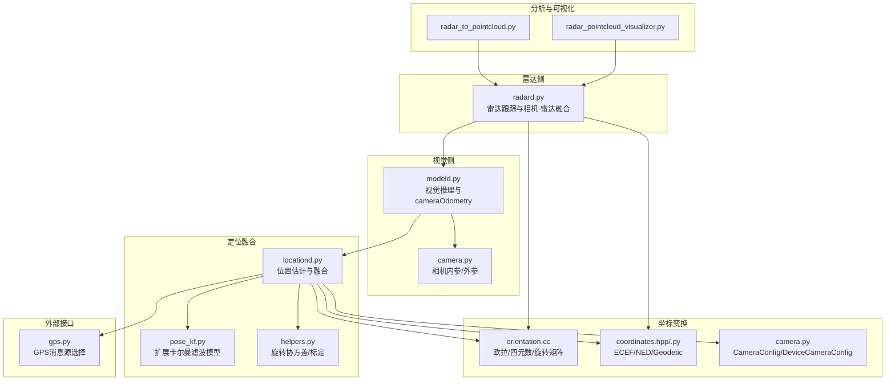
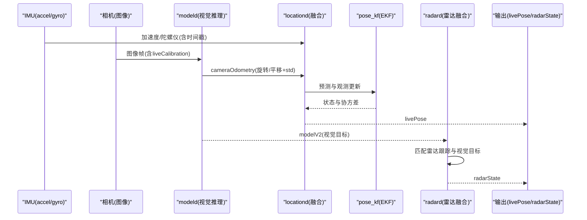
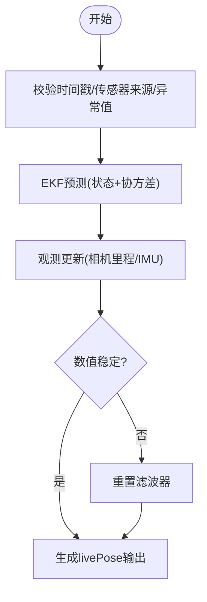
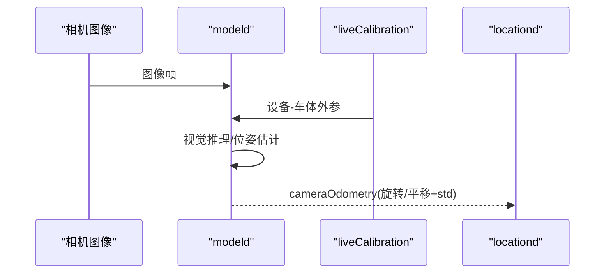
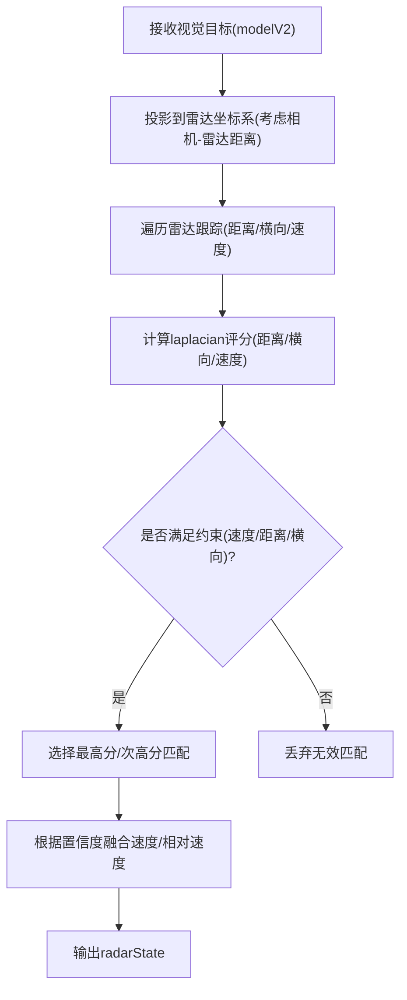
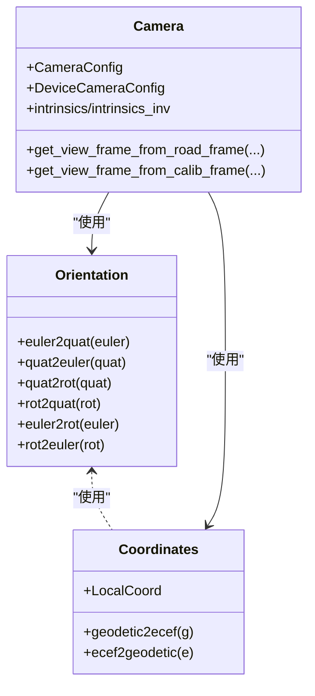
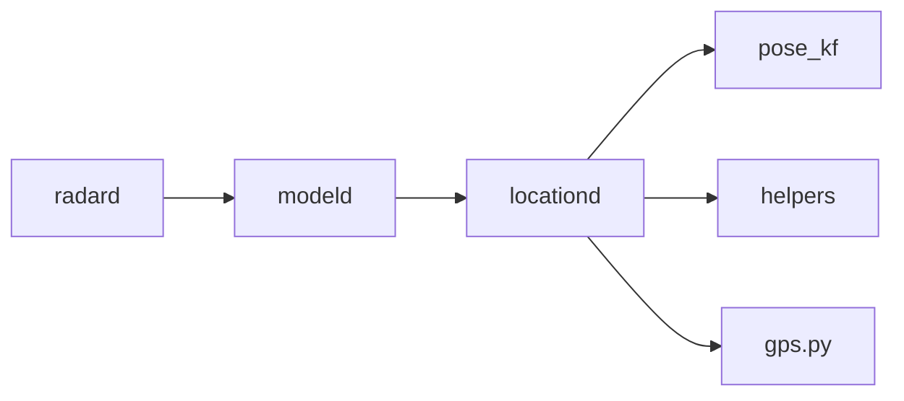

# 传感器融合策略

<cite>
**本文引用的文件**
- [locationd.py](file://selfdrive/locationd/locationd.py)
- [pose_kf.py](file://selfdrive/locationd/models/pose_kf.py)
- [helpers.py](file://selfdrive/locationd/helpers.py)
- [radard.py](file://selfdrive/controls/radard.py)
- [modeld.py](file://selfdrive/modeld/modeld.py)
- [camera.py](file://common/transformations/camera.py)
- [orientation.cc](file://common/transformations/orientation.cc)
- [coordinates.hpp](file://common/transformations/coordinates.hpp)
- [coordinates.py](file://common/transformations/coordinates.py)
- [README.md](file://common/transformations/README.md)
- [simple_kalman.py](file://common/simple_kalman.py)
- [test_simple_kalman.py](file://common/tests/test_simple_kalman.py)
- [radar_pointcloud_visualizer.py](file://radar_pointcloud_visualizer.py)
- [radar_to_pointcloud.py](file://radar_to_pointcloud.py)
- [gps.py](file://common/gps.py)
</cite>

## 目录
1. [引言](#引言)
2. [项目结构](#项目结构)
3. [核心组件](#核心组件)
4. [架构总览](#架构总览)
5. [详细组件分析](#详细组件分析)
6. [依赖分析](#依赖分析)
7. [性能考虑](#性能考虑)
8. [故障排查指南](#故障排查指南)
9. [结论](#结论)
10. [附录：参数与评估](#附录参数与评估)

## 引言
本文件面向“传感器融合策略”模块，系统性阐述多传感器数据融合的实现策略，覆盖摄像头、雷达与IMU数据的时空对齐与坐标变换、不确定性建模、视觉-雷达融合、以及定位系统（GPS、IMU、视觉里程）的组合策略。文档以代码库中的真实实现为依据，提供可操作的参数说明、算法选择与性能评估方法，并给出与其他组件的集成关系与常见问题的解决方案。

## 项目结构
围绕融合策略的关键目录与文件如下：
- 自身定位与融合
  - selfdrive/locationd：位置估计与融合主流程，负责IMU、相机里程与标定信息的融合
  - selfdrive/locationd/models：扩展卡尔曼滤波模型定义与生成
  - selfdrive/locationd/helpers：旋转协方差、标定工具等辅助能力
- 视觉与雷达融合
  - selfdrive/modeld：视觉模型推理与相机位姿输出（cameraOdometry）
  - selfdrive/controls/radard：雷达目标跟踪与相机-雷达融合
- 坐标变换与标定
  - common/transformations：相机内外参、设备/车体/地理坐标系转换、欧拉角/四元数/旋转矩阵互转
- 雷达可视化与分析
  - radar_pointcloud_visualizer.py、radar_to_pointcloud.py：雷达点云可视化与分析
- GPS服务选择
  - common/gps.py：根据硬件可用性选择GPS消息源

图表来源
- [locationd.py:1-333](file://selfdrive/locationd/locationd.py#L1-L333)
- [pose_kf.py:1-112](file://selfdrive/locationd/models/pose_kf.py#L1-L112)
- [helpers.py:1-184](file://selfdrive/locationd/helpers.py#L1-L184)
- [radard.py:130-224](file://selfdrive/controls/radard.py#L130-L224)
- [modeld.py:360-438](file://selfdrive/modeld/modeld.py#L360-L438)
- [camera.py:1-47](file://common/transformations/camera.py#L1-L47)
- [orientation.cc:1-143](file://common/transformations/orientation.cc#L1-L143)
- [coordinates.hpp:1-43](file://common/transformations/coordinates.hpp#L1-L43)
- [coordinates.py:1-19](file://common/transformations/coordinates.py#L1-L19)
- [radar_pointcloud_visualizer.py:120-149](file://radar_pointcloud_visualizer.py#L120-L149)
- [radar_to_pointcloud.py:101-130](file://radar_to_pointcloud.py#L101-L130)
- [gps.py:1-8](file://common/gps.py#L1-L8)

章节来源
- [locationd.py:1-333](file://selfdrive/locationd/locationd.py#L1-L333)
- [pose_kf.py:1-112](file://selfdrive/locationd/models/pose_kf.py#L1-L112)
- [helpers.py:1-184](file://selfdrive/locationd/helpers.py#L1-L184)
- [radard.py:130-224](file://selfdrive/controls/radard.py#L130-L224)
- [modeld.py:360-438](file://selfdrive/modeld/modeld.py#L360-L438)
- [camera.py:1-47](file://common/transformations/camera.py#L1-L47)
- [orientation.cc:1-143](file://common/transformations/orientation.cc#L1-L143)
- [coordinates.hpp:1-43](file://common/transformations/coordinates.hpp#L1-L43)
- [coordinates.py:1-19](file://common/transformations/coordinates.py#L1-L19)
- [radar_pointcloud_visualizer.py:120-149](file://radar_pointcloud_visualizer.py#L120-L149)
- [radar_to_pointcloud.py:101-130](file://radar_to_pointcloud.py#L101-L130)
- [gps.py:1-8](file://common/gps.py#L1-L8)

## 核心组件
- 位置估计与融合（locationd）
  - 融合输入：手机IMU（加速度、陀螺仪）、相机里程（旋转/平移）、liveCalibration（设备-车体标定）
  - 融合输出：livePose（NED姿态、设备速度、角速度、加速度等）
  - 关键机制：基于扩展卡尔曼滤波（EKF）的状态预测与观测更新，对观测噪声与状态噪声进行建模
- 视觉推理与相机里程（modeld）
  - 输出cameraOdometry（旋转、平移及其标准差），用于驱动位置融合
  - 通过liveCalibration提供的设备-车体外参，将相机观测转换至设备坐标系
- 雷达跟踪与相机-雷达融合（radard）
  - 将视觉目标（modelV2.leadsV3）与雷达跟踪（liveTracks）进行概率匹配与几何约束
  - 基于laplacian概率密度函数对距离、横向偏移、速度进行评分，选择最优匹配
- 坐标变换与标定（transformations）
  - 提供ECEF/NED/Geodetic之间的转换、设备/车体/视图坐标系之间的变换
  - 提供欧拉角/四元数/旋转矩阵互转，支持相机内参矩阵与外参矩阵的构造
- 雷达可视化与分析
  - 将CAN解析出的极坐标雷达数据转换为笛卡尔坐标并可视化，辅助融合调试与验证
- GPS服务选择
  - 根据硬件可用性自动选择GPS消息源（内部或外部）

章节来源
- [locationd.py:51-202](file://selfdrive/locationd/locationd.py#L51-L202)
- [pose_kf.py:20-106](file://selfdrive/locationd/models/pose_kf.py#L20-L106)
- [helpers.py:46-51](file://selfdrive/locationd/helpers.py#L46-L51)
- [radard.py:130-224](file://selfdrive/controls/radard.py#L130-L224)
- [modeld.py:360-438](file://selfdrive/modeld/modeld.py#L360-L438)
- [camera.py:1-47](file://common/transformations/camera.py#L1-L47)
- [orientation.cc:1-143](file://common/transformations/orientation.cc#L1-L143)
- [coordinates.hpp:1-43](file://common/transformations/coordinates.hpp#L1-L43)
- [coordinates.py:1-19](file://common/transformations/coordinates.py#L1-L19)
- [radar_pointcloud_visualizer.py:120-149](file://radar_pointcloud_visualizer.py#L120-L149)
- [radar_to_pointcloud.py:51-73](file://radar_to_pointcloud.py#L51-L73)
- [gps.py:1-8](file://common/gps.py#L1-L8)

## 架构总览
下图展示了从传感器输入到融合输出的端到端流程，以及各组件间的交互关系。

图表来源
- [locationd.py:97-202](file://selfdrive/locationd/locationd.py#L97-L202)
- [pose_kf.py:29-106](file://selfdrive/locationd/models/pose_kf.py#L29-L106)
- [modeld.py:400-438](file://selfdrive/modeld/modeld.py#L400-L438)
- [radard.py:421-475](file://selfdrive/controls/radard.py#L421-L475)

## 详细组件分析

### 组件A：位置估计与融合（locationd + pose_kf + helpers）
- 状态与观测
  - 状态向量包含NED姿态（roll/pitch/yaw）、设备速度、角速度、陀螺仪偏置、加速度、加速度偏置
  - 观测类型：手机加速度、手机陀螺仪、相机里程旋转、相机里程平移
- 预测与更新
  - 使用扩展卡尔曼滤波（EKF）进行状态预测与观测更新
  - 对相机里程的旋转/平移观测，使用设备-车体标定矩阵进行坐标变换，并放大其噪声以避免时相关噪声导致过度自信
- 不确定性建模
  - 观测噪声与过程噪声在模型中显式配置
  - 通过旋转协方差与旋转标准差传播，保证姿态与速度的不确定性一致
- 输入校验与鲁棒性
  - 时间戳与传感器来源校验、异常值检测（加速度/角速度幅值阈值）、滤波器数值稳定性检查（非有限值重置）

图表来源
- [locationd.py:97-202](file://selfdrive/locationd/locationd.py#L97-L202)
- [pose_kf.py:29-106](file://selfdrive/locationd/models/pose_kf.py#L29-L106)
- [helpers.py:46-51](file://selfdrive/locationd/helpers.py#L46-L51)

章节来源
- [locationd.py:51-202](file://selfdrive/locationd/locationd.py#L51-L202)
- [pose_kf.py:20-106](file://selfdrive/locationd/models/pose_kf.py#L20-L106)
- [helpers.py:46-51](file://selfdrive/locationd/helpers.py#L46-L51)

### 组件B：视觉推理与相机里程（modeld）
- 相机内参与外参
  - 通过liveCalibration提供的设备-车体外参，结合相机内参（DeviceCameraConfig/CameraConfig）构造视图坐标系到车体/设备坐标系的变换
- 相机里程输出
  - 输出cameraOdometry（旋转、平移及其标准差），作为位置融合的观测输入
- 时序与同步
  - 与视觉模型推理周期协调，确保cameraOdometry与模型输出的时间戳对齐

图表来源
- [modeld.py:360-438](file://selfdrive/modeld/modeld.py#L360-L438)
- [camera.py:1-47](file://common/transformations/camera.py#L1-L47)

章节来源
- [modeld.py:360-438](file://selfdrive/modeld/modeld.py#L360-L438)
- [camera.py:1-47](file://common/transformations/camera.py#L1-L47)

### 组件C：雷达跟踪与相机-雷达融合（radard）
- 几何与概率匹配
  - 将视觉目标（modelV2.leadsV3）投影到雷达坐标系，结合雷达跟踪（liveTracks）进行匹配
  - 使用laplacian概率密度函数对距离、横向偏移、速度进行评分，选择最高分匹配；同时考虑横向偏移放宽场景（如切入）
- 权重与融合
  - 根据视觉目标置信度动态调整模型速度与雷达相对速度的融合权重
  - 在低速/静止场景下，对潜在前车目标进行宽松判定，提升鲁棒性
- 输出
  - 生成radarState，包含leadOne/leadTwo等目标状态

图表来源
- [radard.py:130-224](file://selfdrive/controls/radard.py#L130-L224)
- [radard.py:315-342](file://selfdrive/controls/radard.py#L315-L342)

章节来源
- [radard.py:130-224](file://selfdrive/controls/radard.py#L130-L224)
- [radard.py:315-342](file://selfdrive/controls/radard.py#L315-L342)

### 组件D：坐标变换与标定（transformations）
- 坐标系
  - 支持ECEF、NED、Geodetic、Device、Calibrated、Car、View、Camera、Normalized Camera、Model、Normalized Model等
- 变换实现
  - 提供欧拉角/四元数/旋转矩阵互转，支持LocalCoord在NED/ECEF/Geodetic之间的转换
  - 相机内参矩阵（K）与外参矩阵（视图坐标系到车体/设备坐标系）构造
- 实践要点
  - 使用设备-车体外参将相机里程转换到设备坐标系，再进入融合流程
  - 注意不同坐标系的约定差异（如Device/View的轴方向）

图表来源
- [orientation.cc:1-143](file://common/transformations/orientation.cc#L1-L143)
- [coordinates.hpp:1-43](file://common/transformations/coordinates.hpp#L1-L43)
- [coordinates.py:1-19](file://common/transformations/coordinates.py#L1-L19)
- [camera.py:1-47](file://common/transformations/camera.py#L1-L47)
- [README.md:10-22](file://common/transformations/README.md#L10-L22)

章节来源
- [orientation.cc:1-143](file://common/transformations/orientation.cc#L1-L143)
- [coordinates.hpp:1-43](file://common/transformations/coordinates.hpp#L1-L43)
- [coordinates.py:1-19](file://common/transformations/coordinates.py#L1-L19)
- [camera.py:1-47](file://common/transformations/camera.py#L1-L47)
- [README.md:10-22](file://common/transformations/README.md#L10-L22)

### 组件E：雷达可视化与分析
- 功能
  - 将CAN解析的雷达极坐标数据转换为笛卡尔坐标，生成3D点云与鸟瞰图
  - 支持按雷达地址分类与统计，辅助融合调试与覆盖率评估
- 应用
  - 结合radard输出，验证雷达目标在空间中的分布与一致性

章节来源
- [radar_pointcloud_visualizer.py:120-149](file://radar_pointcloud_visualizer.py#L120-L149)
- [radar_to_pointcloud.py:51-73](file://radar_to_pointcloud.py#L51-L73)
- [radar_to_pointcloud.py:101-130](file://radar_to_pointcloud.py#L101-L130)

## 依赖分析
- 组件耦合
  - locationd依赖pose_kf的EKF模型与helpers的旋转协方差工具
  - modeld输出cameraOdometry供locationd使用，同时依赖liveCalibration进行外参标定
  - radard依赖modeld输出的视觉目标与自身雷达跟踪，进行跨模态匹配
- 外部依赖
  - 硬件GPS服务选择由gps.py根据可用性决定
- 循环依赖
  - 当前模块未发现循环依赖

图表来源
- [locationd.py:263-266](file://selfdrive/locationd/locationd.py#L263-L266)
- [modeld.py:276-277](file://selfdrive/modeld/modeld.py#L276-L277)
- [radard.py:707-709](file://selfdrive/controls/radard.py#L707-L709)
- [gps.py:1-8](file://common/gps.py#L1-L8)

章节来源
- [locationd.py:263-266](file://selfdrive/locationd/locationd.py#L263-L266)
- [modeld.py:276-277](file://selfdrive/modeld/modeld.py#L276-L277)
- [radard.py:707-709](file://selfdrive/controls/radard.py#L707-L709)
- [gps.py:1-8](file://common/gps.py#L1-L8)

## 性能考虑
- 实时性
  - 各进程采用实时优先级配置，确保关键传感器与视觉/雷达处理的时序要求
- 协方差传播与噪声建模
  - 通过合理的观测噪声与过程噪声设置，平衡响应速度与稳态误差
  - 对相机里程的噪声进行适度放大，避免时相关噪声导致过度自信
- 数值稳定性
  - 对非有限值进行检测与滤波器重置，防止发散
- 参数敏感性
  - 设备-车体标定误差会直接影响相机里程到设备坐标系的转换，进而影响融合精度

## 故障排查指南
- livePose不可用或不稳定
  - 检查传感器时间戳与来源校验是否通过
  - 关注加速度/角速度幅值是否超过阈值
  - 观察相机里程的标准差是否异常增大（可能触发std_spike判断）
- radarState目标缺失或误匹配
  - 检查视觉目标置信度与速度范围约束
  - 调整横向偏移放宽阈值以适配切入场景
- 坐标系不一致导致融合漂移
  - 确认liveCalibration提供的设备-车体外参有效且稳定
  - 核对相机内参与外参矩阵构造是否正确
- GPS消息源选择错误
  - 确认硬件可用性标志，确保使用正确的GPS消息源

章节来源
- [locationd.py:97-202](file://selfdrive/locationd/locationd.py#L97-L202)
- [helpers.py:230-237](file://selfdrive/locationd/helpers.py#L230-L237)
- [radard.py:130-224](file://selfdrive/controls/radard.py#L130-L224)
- [gps.py:1-8](file://common/gps.py#L1-L8)

## 结论
该融合策略以扩展卡尔曼滤波为核心，将IMU、相机里程与视觉目标进行统一建模与融合，辅以严格的输入校验与不确定性建模，实现了高鲁棒性的定位输出。雷达与视觉的跨模态融合通过概率评分与几何约束完成，兼顾了低速场景下的稳健性与高速场景下的响应速度。坐标变换与标定模块提供了清晰的框架，确保多传感器在同一参考系下协同工作。

## 附录：参数与评估
- 融合参数（示例）
  - 观测噪声（示例）：相机里程旋转/平移、手机加速度、手机陀螺仪
  - 过程噪声（示例）：姿态、速度、角速度、偏置等
  - 标定噪声放大系数（示例）：旋转×10、平移×2
- 算法选择
  - 使用扩展卡尔曼滤波（EKF）进行状态估计
  - 使用laplacian概率密度函数进行跨模态匹配评分
  - 使用First Order Filter进行帧丢失检测与平滑
- 性能评估
  - livePose输出的协方差与有效性标志
  - radarState目标的匹配分数与置信度
  - 雷达点云可视化与覆盖率统计
- 代码路径参考
  - [融合主流程:288-328](file://selfdrive/locationd/locationd.py#L288-L328)
  - [EKF模型定义:29-106](file://selfdrive/locationd/models/pose_kf.py#L29-L106)
  - [相机里程输出:404-437](file://selfdrive/modeld/modeld.py#L404-L437)
  - [相机-雷达匹配:130-224](file://selfdrive/controls/radard.py#L130-L224)
  - [坐标变换与标定:1-47](file://common/transformations/camera.py#L1-L47)
  - [雷达可视化:120-149](file://radar_pointcloud_visualizer.py#L120-L149)
  - [GPS服务选择:1-8](file://common/gps.py#L1-L8)

章节来源
- [locationd.py:288-328](file://selfdrive/locationd/locationd.py#L288-L328)
- [pose_kf.py:29-106](file://selfdrive/locationd/models/pose_kf.py#L29-L106)
- [modeld.py:404-437](file://selfdrive/modeld/modeld.py#L404-L437)
- [radard.py:130-224](file://selfdrive/controls/radard.py#L130-L224)
- [camera.py:1-47](file://common/transformations/camera.py#L1-L47)
- [radar_pointcloud_visualizer.py:120-149](file://radar_pointcloud_visualizer.py#L120-L149)
- [gps.py:1-8](file://common/gps.py#L1-L8)