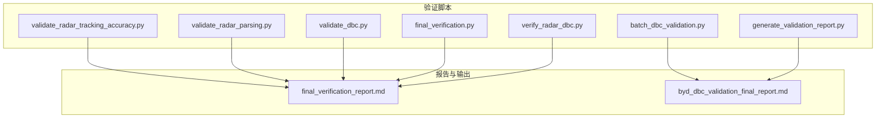
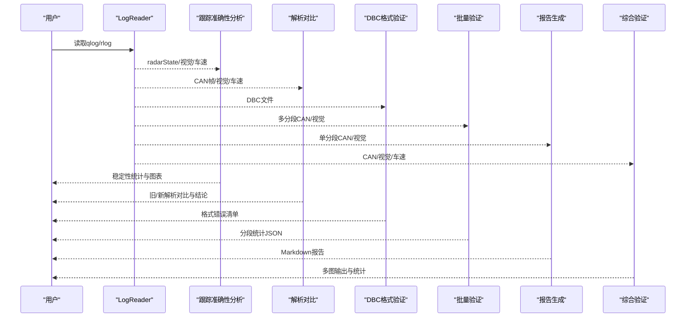
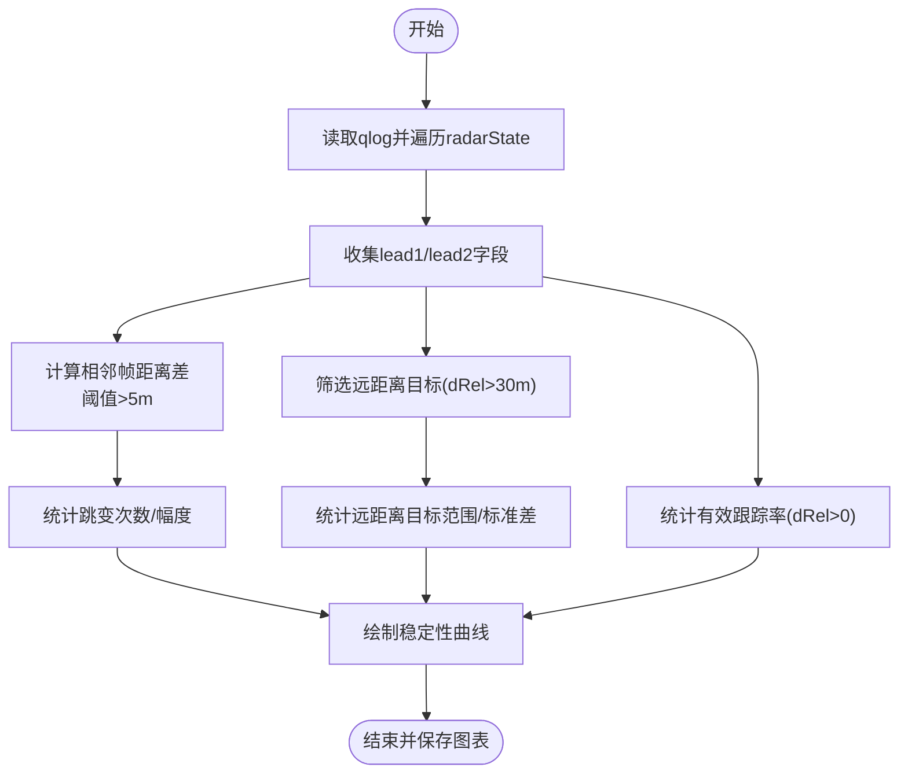
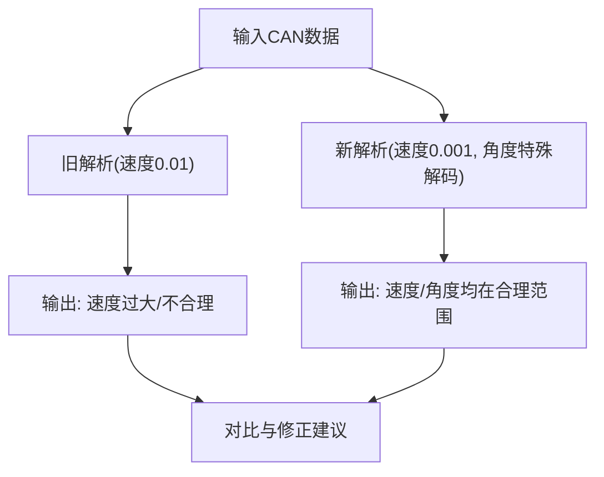
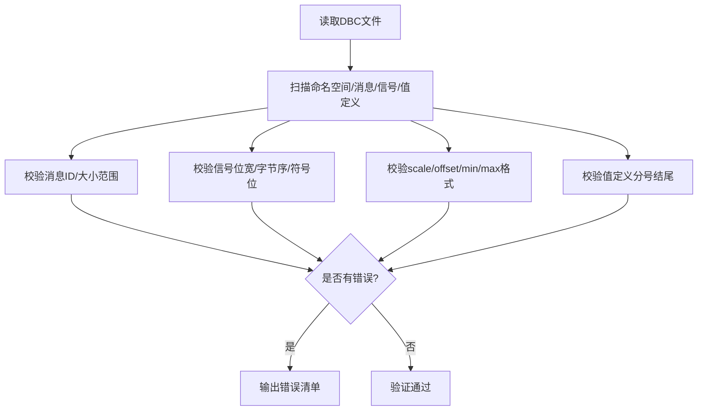
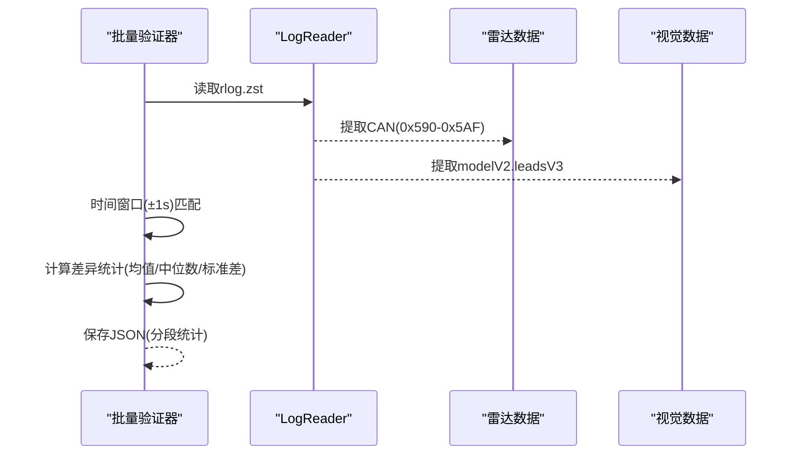
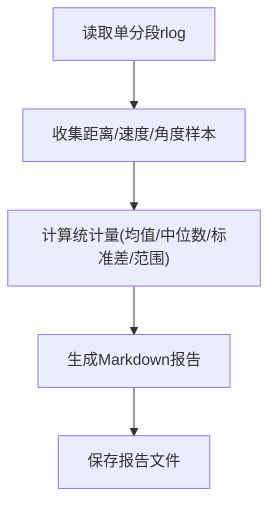
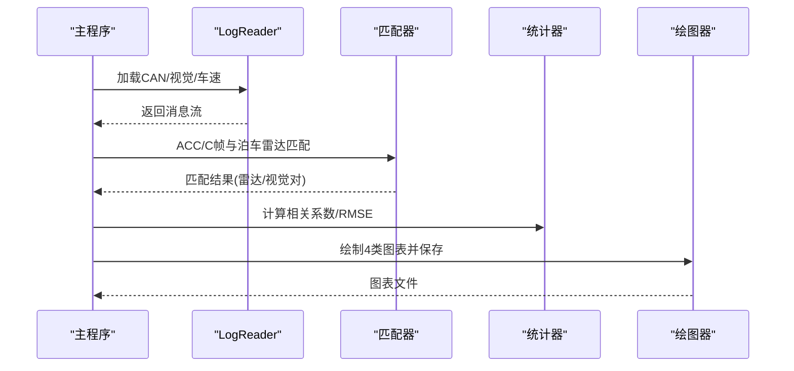
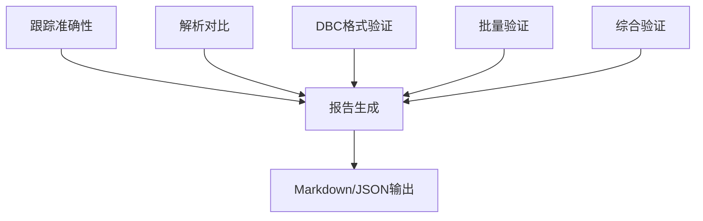

# 数据验证工具

<cite>
**本文引用的文件**
- [tools/validate_radar_tracking_accuracy.py](file://tools/validate_radar_tracking_accuracy.py)
- [validate_radar_parsing.py](file://validate_radar_parsing.py)
- [validate_dbc.py](file://validate_dbc.py)
- [tools/batch_dbc_validation.py](file://tools/batch_dbc_validation.py)
- [tools/generate_validation_report.py](file://tools/generate_validation_report.py)
- [final_verification.py](file://final_verification.py)
- [tools/verify_radar_dbc.py](file://tools/verify_radar_dbc.py)
- [final_verification_report.md](file://final_verification_report.md)
- [byd_dbc_validation_final_report.md](file://byd_dbc_validation_final_report.md)
</cite>

## 目录
1. [简介](#简介)
2. [项目结构](#项目结构)
3. [核心组件](#核心组件)
4. [架构总览](#架构总览)
5. [详细组件分析](#详细组件分析)
6. [依赖关系分析](#依赖关系分析)
7. [性能考量](#性能考量)
8. [故障排查指南](#故障排查指南)
9. [结论](#结论)
10. [附录](#附录)

## 简介
本文件面向“数据验证工具模块”，系统化阐述雷达跟踪准确性验证、DBC文件验证、批量验证与回归检测、以及验证报告生成与可视化展示。文档既提供面向初学者的入门说明，也给出面向高级开发者的实现细节、参数阈值与评估标准，帮助读者快速上手并深入理解各验证脚本的工作原理与扩展方式。

## 项目结构
验证工具主要分布在以下位置：
- 雷达跟踪准确性验证：tools/validate_radar_tracking_accuracy.py
- 雷达解析与DBC对比：validate_radar_parsing.py
- DBC格式验证：validate_dbc.py
- 批量DBC验证与统计：tools/batch_dbc_validation.py
- 报告生成：tools/generate_validation_report.py
- 最终验证与修复效果确认：final_verification.py
- 综合雷达DBC验证（含多图输出）：tools/verify_radar_dbc.py
- 验证报告样例：final_verification_report.md、byd_dbc_validation_final_report.md

**图表来源**
- [tools/validate_radar_tracking_accuracy.py:1-227](file://tools/validate_radar_tracking_accuracy.py#L1-L227)
- [validate_radar_parsing.py:1-128](file://validate_radar_parsing.py#L1-L128)
- [validate_dbc.py:1-196](file://validate_dbc.py#L1-L196)
- [tools/batch_dbc_validation.py:1-151](file://tools/batch_dbc_validation.py#L1-L151)
- [tools/generate_validation_report.py:1-180](file://tools/generate_validation_report.py#L1-L180)
- [final_verification.py:1-151](file://final_verification.py#L1-L151)
- [tools/verify_radar_dbc.py:1-468](file://tools/verify_radar_dbc.py#L1-L468)
- [final_verification_report.md:1-107](file://final_verification_report.md#L1-L107)
- [byd_dbc_validation_final_report.md:1-62](file://byd_dbc_validation_final_report.md#L1-L62)

**章节来源**
- [tools/validate_radar_tracking_accuracy.py:1-227](file://tools/validate_radar_tracking_accuracy.py#L1-L227)
- [validate_radar_parsing.py:1-128](file://validate_radar_parsing.py#L1-L128)
- [validate_dbc.py:1-196](file://validate_dbc.py#L1-L196)
- [tools/batch_dbc_validation.py:1-151](file://tools/batch_dbc_validation.py#L1-L151)
- [tools/generate_validation_report.py:1-180](file://tools/generate_validation_report.py#L1-L180)
- [final_verification.py:1-151](file://final_verification.py#L1-L151)
- [tools/verify_radar_dbc.py:1-468](file://tools/verify_radar_dbc.py#L1-L468)
- [final_verification_report.md:1-107](file://final_verification_report.md#L1-L107)
- [byd_dbc_validation_final_report.md:1-62](file://byd_dbc_validation_final_report.md#L1-L62)

## 核心组件
- 雷达跟踪准确性验证：基于qlog中的radarState消息，统计目标持续性、远距离稳定性、距离跳变与有效跟踪率，并绘制稳定性曲线。
- 雷达解析与DBC对比：对比原始DBC定义与实际解析代码，重点修正速度缩放因子与角度解码规则，给出系统行为分析与性能评估。
- DBC格式验证：对DBC文件进行语法与结构验证，检查消息ID、信号位宽、字节序、符号位、标度/偏移、最小最大值等。
- 批量DBC验证：遍历多分段，计算雷达与视觉数据的时间窗口匹配差异，输出距离/速度/角度的均值、中位数、标准差等统计量。
- 报告生成：对单分段进行统计分析，生成可读性强的Markdown报告，包含距离/速度/角度的统计摘要与结论。
- 最终验证：对比旧/新解析方法，量化修正效果，评估ACC雷达性能并给出建议。
- 综合雷达DBC验证：加载CAN、视觉、车速数据，匹配雷达与视觉目标，计算相关系数与RMSE，生成4类图表并保存。

**章节来源**
- [tools/validate_radar_tracking_accuracy.py:20-227](file://tools/validate_radar_tracking_accuracy.py#L20-L227)
- [validate_radar_parsing.py:66-128](file://validate_radar_parsing.py#L66-L128)
- [validate_dbc.py:10-196](file://validate_dbc.py#L10-L196)
- [tools/batch_dbc_validation.py:13-151](file://tools/batch_dbc_validation.py#L13-L151)
- [tools/generate_validation_report.py:13-180](file://tools/generate_validation_report.py#L13-L180)
- [final_verification.py:58-151](file://final_verification.py#L58-L151)
- [tools/verify_radar_dbc.py:78-468](file://tools/verify_radar_dbc.py#L78-L468)

## 架构总览
验证流程自底向上分为三层：
- 数据采集层：LogReader读取qlog/rlog，提取CAN、modelV2、carState等消息。
- 分析处理层：按任务拆分，分别执行跟踪稳定性、解析对比、DBC格式、批量统计、综合匹配与报告生成。
- 可视化与报告层：Matplotlib绘图、JSON/Mardown输出，形成可追溯的验证证据链。

**图表来源**
- [tools/validate_radar_tracking_accuracy.py:32-104](file://tools/validate_radar_tracking_accuracy.py#L32-L104)
- [validate_radar_parsing.py:66-128](file://validate_radar_parsing.py#L66-L128)
- [validate_dbc.py:10-196](file://validate_dbc.py#L10-L196)
- [tools/batch_dbc_validation.py:13-151](file://tools/batch_dbc_validation.py#L13-L151)
- [tools/generate_validation_report.py:13-180](file://tools/generate_validation_report.py#L13-L180)
- [tools/verify_radar_dbc.py:78-468](file://tools/verify_radar_dbc.py#L78-L468)

## 详细组件分析

### 雷达跟踪准确性验证
- 输入：qlog.zst中的radarState消息
- 关键逻辑：
  - 收集leadOne/leadTwo的dRel/vRel/yRel/status/valid
  - 计算相邻帧间距离跳变，阈值>5m即标记为跳变事件
  - 远距离目标（dRel>30m）统计标准差衡量稳定性
  - 计算有效跟踪率（dRel>0的比例）
  - 绘制时间序列与阈值线，保存图像
- 输出：统计摘要、图表、结论
- 评估标准：
  - 跳变次数与平均/最大跳变幅度
  - 远距离目标的标准差越小越好
  - 有效跟踪率越高越好
  - 无显著跳变或平均跳变<10m视为稳定

**图表来源**
- [tools/validate_radar_tracking_accuracy.py:32-104](file://tools/validate_radar_tracking_accuracy.py#L32-L104)
- [tools/validate_radar_tracking_accuracy.py:158-220](file://tools/validate_radar_tracking_accuracy.py#L158-L220)

**章节来源**
- [tools/validate_radar_tracking_accuracy.py:20-227](file://tools/validate_radar_tracking_accuracy.py#L20-L227)

### 雷达解析与DBC对比
- 目标：修正速度缩放因子与角度解码规则，使解析结果符合物理范围
- 方法：
  - 原始解析：速度使用0.01缩放；角度按DBC定义(0.1偏移)
  - 修正解析：速度使用0.001缩放；角度采用(b4-128)+(b5-128)*0.1
  - 对比不同解析方法在示例数据上的差异
- 结论：修正后速度范围合理，角度范围合理，距离解析符合DBC

**图表来源**
- [validate_radar_parsing.py:10-64](file://validate_radar_parsing.py#L10-L64)
- [validate_radar_parsing.py:66-128](file://validate_radar_parsing.py#L66-L128)

**章节来源**
- [validate_radar_parsing.py:1-128](file://validate_radar_parsing.py#L1-L128)

### DBC格式验证
- 功能：验证DBC文件的语法与结构，包括消息定义、信号定义、值定义、传输节点等
- 关键检查点：
  - 消息ID范围与消息大小
  - 信号起始位/长度、字节序、符号位
  - 标度/偏移、最小/最大值合法性
  - 值定义必须以分号结尾
- 输出：错误清单或“验证通过”

**图表来源**
- [validate_dbc.py:10-196](file://validate_dbc.py#L10-L196)

**章节来源**
- [validate_dbc.py:1-196](file://validate_dbc.py#L1-L196)

### 批量DBC验证与回归检测
- 输入：多分段rlog.zst
- 方法：
  - 提取ACC长距雷达(0x590-0x5AF)与视觉modelV2的leadsV3
  - 以1秒时间窗口匹配雷达与视觉数据
  - 计算距离/速度/角度差异的均值、中位数、标准差
  - 逐分段输出统计，聚合为JSON文件
- 输出：分段级统计JSON，便于回归检测与趋势分析

**图表来源**
- [tools/batch_dbc_validation.py:13-151](file://tools/batch_dbc_validation.py#L13-L151)

**章节来源**
- [tools/batch_dbc_validation.py:1-151](file://tools/batch_dbc_validation.py#L1-L151)

### 报告生成机制
- 输入：单分段rlog.zst
- 方法：
  - 统计距离/速度/角度的均值、中位数、标准差、范围
  - 生成Markdown报告，包含验证结论
- 输出：Markdown报告文件

**图表来源**
- [tools/generate_validation_report.py:13-180](file://tools/generate_validation_report.py#L13-L180)

**章节来源**
- [tools/generate_validation_report.py:1-180](file://tools/generate_validation_report.py#L1-L180)

### 综合雷达DBC验证（含多图）
- 输入：路线ID与分段数
- 方法：
  - 加载ACC/C帧、泊车雷达、视觉、车速数据
  - 将雷达目标与视觉目标匹配，计算距离/速度相关性与RMSE
  - 生成4类图表：距离时序、相关散点、点云、鸟瞰图
- 输出：图表PNG与统计摘要

**图表来源**
- [tools/verify_radar_dbc.py:78-468](file://tools/verify_radar_dbc.py#L78-L468)

**章节来源**
- [tools/verify_radar_dbc.py:1-468](file://tools/verify_radar_dbc.py#L1-L468)

## 依赖关系分析
- 工具间耦合：
  - 批量验证与报告生成共享统计口径，便于回归对比
  - 综合验证与跟踪准确性验证互补：前者强调跨模态一致性，后者强调时序稳定性
  - DBC格式验证为其他验证提供前置保障
- 外部依赖：
  - Matplotlib用于图表生成
  - NumPy用于统计计算
  - openpilot.tools.lib.logreader用于日志读取

**图表来源**
- [tools/validate_radar_tracking_accuracy.py:20-227](file://tools/validate_radar_tracking_accuracy.py#L20-L227)
- [validate_radar_parsing.py:66-128](file://validate_radar_parsing.py#L66-L128)
- [validate_dbc.py:10-196](file://validate_dbc.py#L10-L196)
- [tools/batch_dbc_validation.py:13-151](file://tools/batch_dbc_validation.py#L13-L151)
- [tools/generate_validation_report.py:13-180](file://tools/generate_validation_report.py#L13-L180)
- [tools/verify_radar_dbc.py:78-468](file://tools/verify_radar_dbc.py#L78-L468)

**章节来源**
- [tools/validate_radar_tracking_accuracy.py:1-227](file://tools/validate_radar_tracking_accuracy.py#L1-L227)
- [validate_radar_parsing.py:1-128](file://validate_radar_parsing.py#L1-L128)
- [validate_dbc.py:1-196](file://validate_dbc.py#L1-L196)
- [tools/batch_dbc_validation.py:1-151](file://tools/batch_dbc_validation.py#L1-L151)
- [tools/generate_validation_report.py:1-180](file://tools/generate_validation_report.py#L1-L180)
- [tools/verify_radar_dbc.py:1-468](file://tools/verify_radar_dbc.py#L1-L468)

## 性能考量
- 时间复杂度：
  - 跟踪准确性：O(N)遍历radarState消息，O(N)绘图
  - 批量验证：O(M+N)匹配雷达与视觉（M为雷达样本数，N为视觉样本数），统计O(1)每分段
  - 综合验证：匹配与统计同上，绘图O(K)（K为匹配对数）
- 内存占用：
  - 主要受样本集合大小影响，建议分段处理避免内存峰值过高
- I/O优化：
  - 使用zstd压缩的日志文件，注意磁盘I/O瓶颈
  - 批量验证输出JSON便于后续离线分析

## 故障排查指南
- qlog/rlog缺失或路径错误
  - 症状：脚本报错提示文件不存在
  - 处理：确认路径与分段命名一致
- 无视觉/车速数据
  - 症状：综合验证提示无视觉数据或无车速数据
  - 处理：检查日志完整性或选择包含对应消息的分段
- 匹配失败或统计为空
  - 症状：匹配对数为0或统计量NaN
  - 处理：调整时间窗口（默认1秒）、检查传感器同步与消息过滤条件
- DBC格式错误
  - 症状：报错显示某行格式不合法
  - 处理：对照DBC规范修正消息/信号/值定义格式
- 图表无法显示（headless环境）
  - 症状：无GUI环境时报错
  - 处理：使用脚本提供的保存选项或切换到带GUI环境

**章节来源**
- [tools/validate_radar_tracking_accuracy.py:24-31](file://tools/validate_radar_tracking_accuracy.py#L24-L31)
- [tools/verify_radar_dbc.py:439-445](file://tools/verify_radar_dbc.py#L439-L445)
- [validate_dbc.py:167-178](file://validate_dbc.py#L167-L178)

## 结论
本验证工具体系覆盖了从单帧解析、时序稳定性、跨模态一致性到批量回归检测与可视化报告的全链路能力。通过明确的阈值与评估标准，结合可复现的脚本与报告模板，能够高效定位雷达数据解析与DBC定义中的问题，并为后续优化提供量化依据。

## 附录

### 参数与阈值设置
- 距离跳变阈值：>5m（跟踪稳定性）
- 远距离目标阈值：>30m（稳定性分析）
- 平均跳变阈值：<10m（稳定性结论）
- 时间窗口：±1秒（批量验证匹配）
- 速度缩放因子修正：由0.01改为0.001（解析对比）

**章节来源**
- [tools/validate_radar_tracking_accuracy.py:67-74](file://tools/validate_radar_tracking_accuracy.py#L67-L74)
- [tools/validate_radar_tracking_accuracy.py:123-131](file://tools/validate_radar_tracking_accuracy.py#L123-L131)
- [validate_radar_parsing.py:94-108](file://validate_radar_parsing.py#L94-L108)
- [tools/batch_dbc_validation.py:61-77](file://tools/batch_dbc_validation.py#L61-L77)

### 评估标准
- 跟踪稳定性：远距离目标标准差越小越好；无显著跳变或平均跳变<10m
- 解析准确性：速度/角度在合理物理范围内；距离解析符合DBC定义
- 跨模态一致性：距离/速度相关系数接近1；RMSE较小；系统偏差可接受
- 批量回归：分段统计指标稳定，异常分段可定位并修复

**章节来源**
- [tools/validate_radar_tracking_accuracy.py:200-220](file://tools/validate_radar_tracking_accuracy.py#L200-L220)
- [validate_radar_parsing.py:114-124](file://validate_radar_parsing.py#L114-L124)
- [tools/verify_radar_dbc.py:217-250](file://tools/verify_radar_dbc.py#L217-L250)
- [byd_dbc_validation_final_report.md:8-27](file://byd_dbc_validation_final_report.md#L8-L27)

### 使用示例（路径指引）
- 雷达跟踪准确性验证
  - 运行：[tools/validate_radar_tracking_accuracy.py:222-227](file://tools/validate_radar_tracking_accuracy.py#L222-L227)
  - 输入：qlog.zst（示例路径见脚本内注释）
- 雷达解析对比
  - 运行：[validate_radar_parsing.py:126-128](file://validate_radar_parsing.py#L126-L128)
- DBC格式验证
  - 运行：[validate_dbc.py:180-196](file://validate_dbc.py#L180-L196)
  - 示例：python3 validate_dbc.py byd_radar.dbc
- 批量DBC验证
  - 运行：[tools/batch_dbc_validation.py:140-151](file://tools/batch_dbc_validation.py#L140-L151)
  - 示例：python3 batch_dbc_validation.py .comma/00000101--d3eb058bd0
- 报告生成
  - 运行：[tools/generate_validation_report.py:165-180](file://tools/generate_validation_report.py#L165-L180)
  - 示例：python3 generate_validation_report.py .comma/00000101--d3eb058bd0--12 byd_dbc_validation.md
- 综合雷达DBC验证
  - 运行：[tools/verify_radar_dbc.py:421-468](file://tools/verify_radar_dbc.py#L421-L468)
  - 示例：python3 tools/verify_radar_dbc.py 0000010a --segs 5 --out /tmp/radar_plots

**章节来源**
- [tools/validate_radar_tracking_accuracy.py:222-227](file://tools/validate_radar_tracking_accuracy.py#L222-L227)
- [validate_radar_parsing.py:126-128](file://validate_radar_parsing.py#L126-L128)
- [validate_dbc.py:180-196](file://validate_dbc.py#L180-L196)
- [tools/batch_dbc_validation.py:140-151](file://tools/batch_dbc_validation.py#L140-L151)
- [tools/generate_validation_report.py:165-180](file://tools/generate_validation_report.py#L165-L180)
- [tools/verify_radar_dbc.py:421-468](file://tools/verify_radar_dbc.py#L421-L468)