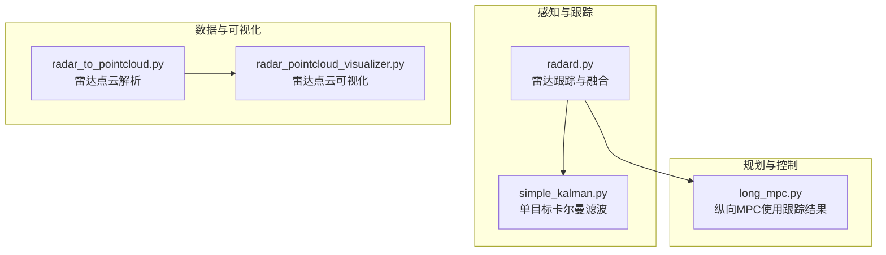
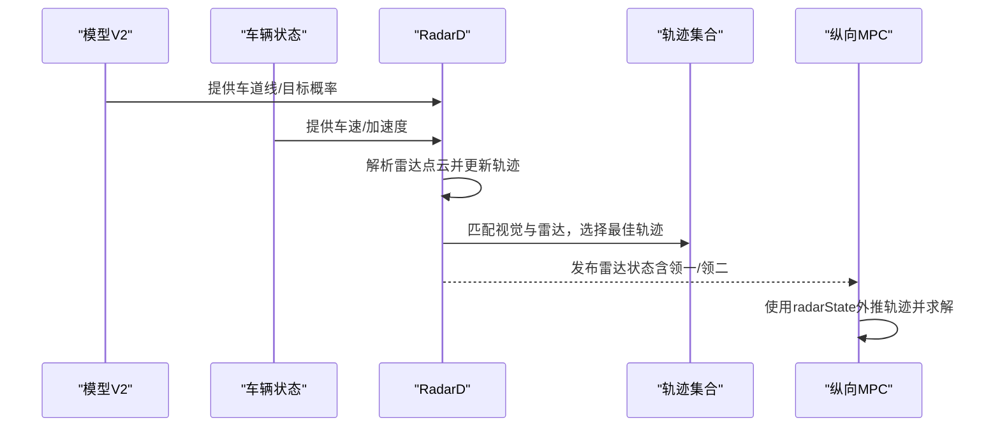
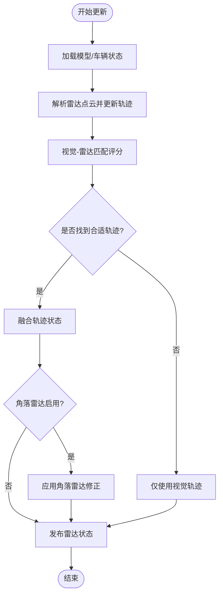
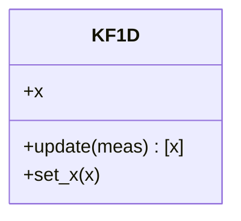
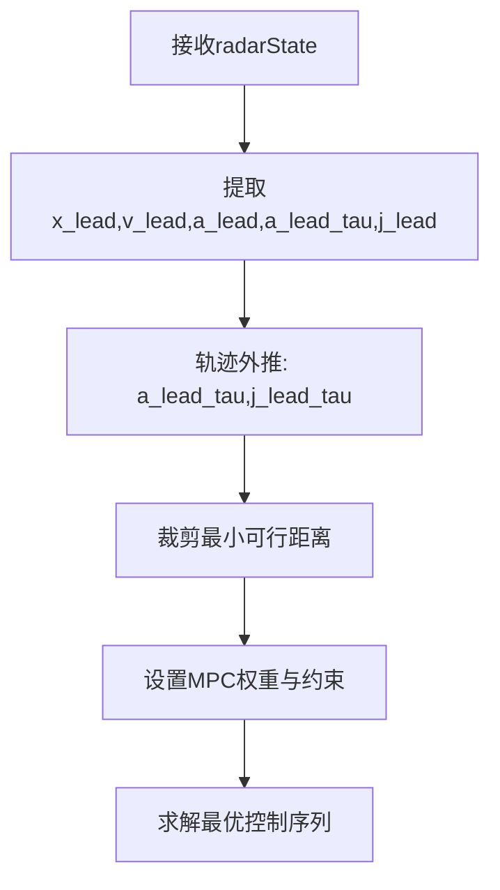
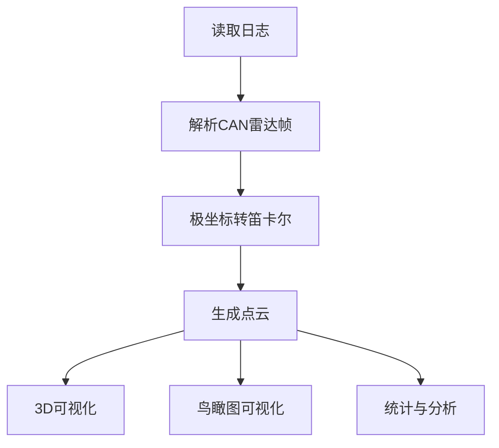
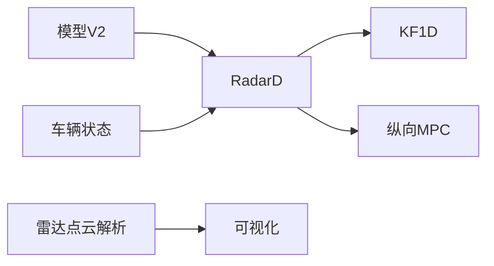

# 目标跟踪算法

<cite>
**本文引用的文件**
- [selfdrive/controls/radard.py](file://selfdrive/controls/radard.py)
- [common/simple_kalman.py](file://common/simple_kalman.py)
- [selfdrive/controls/lib/longitudinal_mpc_lib/long_mpc.py](file://selfdrive/controls/lib/longitudinal_mpc_lib/long_mpc.py)
- [radar_to_pointcloud.py](file://radar_to_pointcloud.py)
- [radar_pointcloud_visualizer.py](file://radar_pointcloud_visualizer.py)
</cite>

## 目录
1. [简介](#简介)
2. [项目结构](#项目结构)
3. [核心组件](#核心组件)
4. [架构总览](#架构总览)
5. [详细组件分析](#详细组件分析)
6. [依赖关系分析](#依赖关系分析)
7. [性能考量](#性能考量)
8. [故障排查指南](#故障排查指南)
9. [结论](#结论)
10. [附录](#附录)

## 简介
本文件面向多目标跟踪（MOT）与融合感知中的目标跟踪模块，聚焦于雷达与视觉信息的融合跟踪、轨迹预测与状态估计、目标关联策略、轨迹管理（初始化/维持/终止）、以及点云数据的解析与可视化。文档以代码库中的实际实现为依据，提供可操作的参数说明、性能指标与优化建议，并给出与其他控制子系统的集成关系。

## 项目结构
围绕目标跟踪的关键代码主要分布在以下位置：
- 雷达跟踪与融合：selfdrive/controls/radard.py
- 单目标卡尔曼滤波：common/simple_kalman.py
- 融合跟踪结果在纵向MPC中的使用：selfdrive/controls/lib/longitudinal_mpc_lib/long_mpc.py
- 雷达点云解析与可视化：radar_to_pointcloud.py、radar_pointcloud_visualizer.py

图表来源
- [selfdrive/controls/radard.py:1-722](file://selfdrive/controls/radard.py#L1-L722)
- [common/simple_kalman.py:1-55](file://common/simple_kalman.py#L1-L55)
- [selfdrive/controls/lib/longitudinal_mpc_lib/long_mpc.py:241-353](file://selfdrive/controls/lib/longitudinal_mpc_lib/long_mpc.py#L241-L353)
- [radar_to_pointcloud.py:1-291](file://radar_to_pointcloud.py#L1-L291)
- [radar_pointcloud_visualizer.py:1-722](file://radar_pointcloud_visualizer.py#L1-L722)

章节来源
- [selfdrive/controls/radard.py:1-722](file://selfdrive/controls/radard.py#L1-L722)
- [common/simple_kalman.py:1-55](file://common/simple_kalman.py#L1-L55)
- [selfdrive/controls/lib/longitudinal_mpc_lib/long_mpc.py:241-353](file://selfdrive/controls/lib/longitudinal_mpc_lib/long_mpc.py#L241-L353)
- [radar_to_pointcloud.py:1-291](file://radar_to_pointcloud.py#L1-L291)
- [radar_pointcloud_visualizer.py:1-722](file://radar_pointcloud_visualizer.py#L1-L722)

## 核心组件
- 雷达跟踪器（RadarD）：负责维护多目标轨迹集合，执行目标与视觉模型的匹配与选择，计算车道内概率与未来状态，输出雷达状态消息。
- 单目标卡尔曼滤波（KF1D）：提供预计算增益的离散卡尔曼滤波，用于速度/加速度状态估计。
- 纵向MPC：消费radarState中的领车信息，进行轨迹外推与约束求解，保障安全跟车。
- 雷达点云转换与可视化：解析CAN中的雷达目标数据，生成笛卡尔坐标点云并进行3D/鸟瞰图可视化。

章节来源
- [selfdrive/controls/radard.py:386-722](file://selfdrive/controls/radard.py#L386-L722)
- [common/simple_kalman.py:14-55](file://common/simple_kalman.py#L14-L55)
- [selfdrive/controls/lib/longitudinal_mpc_lib/long_mpc.py:320-353](file://selfdrive/controls/lib/longitudinal_mpc_lib/long_mpc.py#L320-L353)
- [radar_to_pointcloud.py:23-178](file://radar_to_pointcloud.py#L23-L178)
- [radar_pointcloud_visualizer.py:24-374](file://radar_pointcloud_visualizer.py#L24-L374)

## 架构总览
雷达跟踪模块通过订阅模型与车辆状态，结合雷达点云与视觉模型的概率，完成目标关联与轨迹管理；随后将融合后的领车状态发布给控制系统使用。

图表来源
- [selfdrive/controls/radard.py:411-475](file://selfdrive/controls/radard.py#L411-L475)
- [selfdrive/controls/lib/longitudinal_mpc_lib/long_mpc.py:320-353](file://selfdrive/controls/lib/longitudinal_mpc_lib/long_mpc.py#L320-L353)

## 详细组件分析

### 雷达跟踪与融合（RadarD）
- 多轨迹维护：按trackId维护轨迹字典，新增/删除轨迹，统计有效轨迹数量。
- 视觉-雷达匹配：基于拉普拉斯概率密度函数对距离、横向偏移、速度进行评分，采用“最近邻+二次候选”策略，结合速度/距离合理性与概率阈值选择最佳轨迹。
- 车道内概率与未来状态：根据模型提供的车道线，计算dPath与in-lane概率，预测未来状态用于剪枝与选优。
- 低速/侧向切入处理：支持低速潜在静止目标优先选择、侧向切入检测与cut-in计数。
- 角落雷达（可选）：在特定条件下用角部雷达信息修正或补充领车状态。
- 输出：生成radarState消息，包含领一、领二及左右/中心/切入候选列表。

图表来源
- [selfdrive/controls/radard.py:411-529](file://selfdrive/controls/radard.py#L411-L529)

章节来源
- [selfdrive/controls/radard.py:31-123](file://selfdrive/controls/radard.py#L31-L123)
- [selfdrive/controls/radard.py:125-223](file://selfdrive/controls/radard.py#L125-L223)
- [selfdrive/controls/radard.py:225-383](file://selfdrive/controls/radard.py#L225-L383)
- [selfdrive/controls/radard.py:386-722](file://selfdrive/controls/radard.py#L386-L722)

### 单目标卡尔曼滤波（KF1D）
- 状态空间：位置与速度（或速度与加速度）作为状态变量。
- 更新流程：使用预计算增益进行状态转移与观测更新，返回后验状态。
- 参数：需要预先计算增益矩阵，依赖过程噪声与观测噪声协方差。

图表来源
- [common/simple_kalman.py:14-55](file://common/simple_kalman.py#L14-L55)

章节来源
- [common/simple_kalman.py:1-55](file://common/simple_kalman.py#L1-L55)

### 纵向MPC中的轨迹使用
- 轨迹外推：基于领车速度/加速度与加速度衰减时间常数，计算未来轨迹。
- 安全约束：裁剪可能的碰撞距离，限制速度/加速度上下界，避免MPC发散。
- 参数：跟随时间、期望距离、危险系数等。

图表来源
- [selfdrive/controls/lib/longitudinal_mpc_lib/long_mpc.py:320-353](file://selfdrive/controls/lib/longitudinal_mpc_lib/long_mpc.py#L320-L353)

章节来源
- [selfdrive/controls/lib/longitudinal_mpc_lib/long_mpc.py:241-353](file://selfdrive/controls/lib/longitudinal_mpc_lib/long_mpc.py#L241-L353)

### 雷达点云解析与可视化
- 数据解析：从CAN消息中提取目标距离、相对速度、角度，转换为笛卡尔坐标。
- 可视化：支持3D点云与鸟瞰图，标注车辆轮廓与方向，便于分析雷达覆盖与目标分布。
- 统计分析：提供距离/速度/角度分布、双雷达系统分析、雷达位置推断等。

图表来源
- [radar_to_pointcloud.py:31-178](file://radar_to_pointcloud.py#L31-L178)
- [radar_pointcloud_visualizer.py:33-374](file://radar_pointcloud_visualizer.py#L33-L374)

章节来源
- [radar_to_pointcloud.py:1-291](file://radar_to_pointcloud.py#L1-L291)
- [radar_pointcloud_visualizer.py:1-722](file://radar_pointcloud_visualizer.py#L1-L722)

## 依赖关系分析
- RadarD依赖模型提供的车道线与目标概率，依赖FirstOrderFilter与参数服务，输出radarState供MPC消费。
- 单目标卡尔曼滤波作为通用工具被雷达跟踪与视觉轨迹平滑使用。
- 纵向MPC直接消费radarState，不直接依赖雷达原始点云。

图表来源
- [selfdrive/controls/radard.py:1-722](file://selfdrive/controls/radard.py#L1-L722)
- [common/simple_kalman.py:1-55](file://common/simple_kalman.py#L1-L55)
- [selfdrive/controls/lib/longitudinal_mpc_lib/long_mpc.py:241-353](file://selfdrive/controls/lib/longitudinal_mpc_lib/long_mpc.py#L241-L353)
- [radar_to_pointcloud.py:1-291](file://radar_to_pointcloud.py#L1-L291)
- [radar_pointcloud_visualizer.py:1-722](file://radar_pointcloud_visualizer.py#L1-L722)

章节来源
- [selfdrive/controls/radard.py:1-722](file://selfdrive/controls/radard.py#L1-L722)
- [common/simple_kalman.py:1-55](file://common/simple_kalman.py#L1-L55)
- [selfdrive/controls/lib/longitudinal_mpc_lib/long_mpc.py:241-353](file://selfdrive/controls/lib/longitudinal_mpc_lib/long_mpc.py#L241-L353)
- [radar_to_pointcloud.py:1-291](file://radar_to_pointcloud.py#L1-L291)
- [radar_pointcloud_visualizer.py:1-722](file://radar_pointcloud_visualizer.py#L1-L722)

## 性能考量
- 匹配评分与阈值：距离/速度/横向偏移的拉普拉斯概率评分与合理区间，直接影响误配率与漏检率。
- 车道内概率：dPath与in-lane概率用于剪枝，减少无效候选，提升实时性。
- 低速/切入鲁棒性：低速潜在静止目标优先策略与切入计数机制，平衡稳定与灵敏度。
- 参数调节：雷达反应因子、横向因子、corner雷达开关等参数对跟踪稳定性与响应速度有显著影响。
- 可视化与统计：通过点云可视化与统计分析辅助定位雷达盲区、覆盖不足等问题。

## 故障排查指南
- 领车丢失/闪烁
  - 检查视觉概率阈值与匹配评分边界，适当放宽或收紧阈值。
  - 关注低速/切入场景下的轨迹选择逻辑，确认cut-in计数与低速优先策略是否触发。
  - 参考路径：[selfdrive/controls/radard.py:125-223](file://selfdrive/controls/radard.py#L125-L223)
- 轨迹漂移/发散
  - 检查雷达反应因子与横向因子，避免过大的横向预测导致轨迹漂移。
  - 在MPC中确认最小可行距离裁剪与加速度上限设置。
  - 参考路径：[selfdrive/controls/radard.py:45-72](file://selfdrive/controls/radard.py#L45-L72)、[selfdrive/controls/lib/longitudinal_mpc_lib/long_mpc.py:344-353](file://selfdrive/controls/lib/longitudinal_mpc_lib/long_mpc.py#L344-L353)
- 角落雷达异常
  - 检查corner雷达启用标志与左右横向/纵向距离输入，确认修正逻辑未引入错误。
  - 参考路径：[selfdrive/controls/radard.py:650-694](file://selfdrive/controls/radard.py#L650-L694)
- 雷达覆盖不足
  - 使用点云可视化与统计分析检查短/长距雷达覆盖情况，识别缺失地址与角度分布。
  - 参考路径：[radar_pointcloud_visualizer.py:449-621](file://radar_pointcloud_visualizer.py#L449-L621)

章节来源
- [selfdrive/controls/radard.py:45-72](file://selfdrive/controls/radard.py#L45-L72)
- [selfdrive/controls/lib/longitudinal_mpc_lib/long_mpc.py:344-353](file://selfdrive/controls/lib/longitudinal_mpc_lib/long_mpc.py#L344-L353)
- [radar_pointcloud_visualizer.py:449-621](file://radar_pointcloud_visualizer.py#L449-L621)

## 结论
该目标跟踪模块以雷达为主、视觉为辅，通过概率评分与车道内一致性约束实现稳健的目标关联与轨迹管理；配合MPC的轨迹外推与安全约束，形成完整的闭环。通过参数调节与可视化分析，可在不同工况下获得稳定可靠的多目标跟踪能力。

## 附录
- 算法参数与默认值
  - 领车加速度衰减时间常数：参考默认值与反应因子缩放。
  - 匹配评分：拉普拉斯概率密度函数的尺度参数与速度/距离/横向偏移的合理区间。
  - 视觉概率阈值：随状态变化的动态阈值，兼顾稳定与灵敏。
  - 角落雷达：横向/纵向距离输入与启用标志。
  - 参考路径：
    - [selfdrive/controls/radard.py:18-29](file://selfdrive/controls/radard.py#L18-L29)
    - [selfdrive/controls/radard.py:125-223](file://selfdrive/controls/radard.py#L125-L223)
    - [selfdrive/controls/radard.py:417-419](file://selfdrive/controls/radard.py#L417-L419)
    - [selfdrive/controls/radard.py:650-694](file://selfdrive/controls/radard.py#L650-L694)
- 性能指标
  - 轨迹有效性计数（cnt）、车道内概率（in-lane）、切入计数（cut-in count）。
  - 参考路径：[selfdrive/controls/radard.py:31-123](file://selfdrive/controls/radard.py#L31-L123)
- 优化策略
  - 动态调整匹配阈值与评分权重，结合场景自适应（高速/低速/切入）。
  - 利用点云统计分析指导雷达布置与标定。
  - 参考路径：[radar_pointcloud_visualizer.py:376-447](file://radar_pointcloud_visualizer.py#L376-L447)