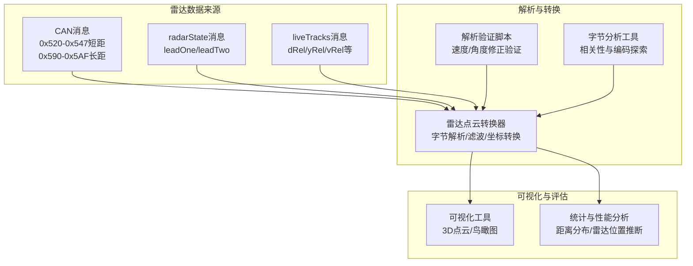
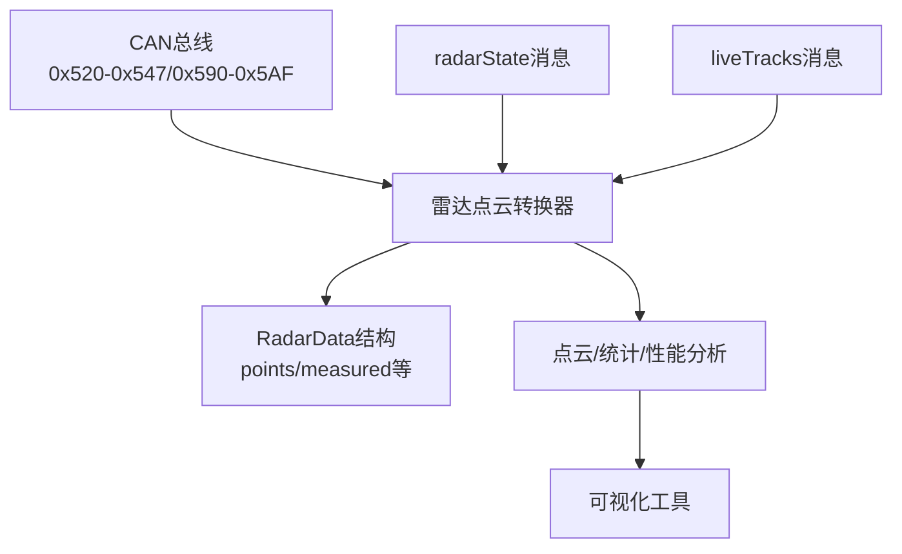
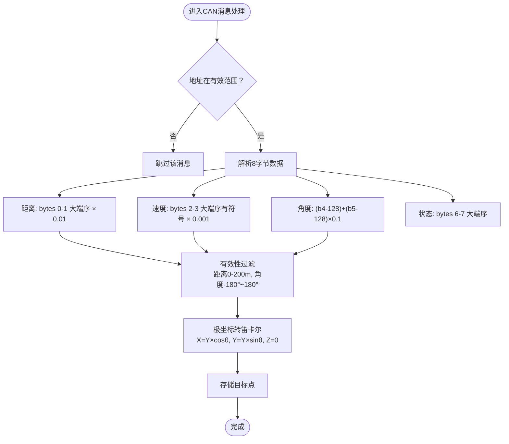
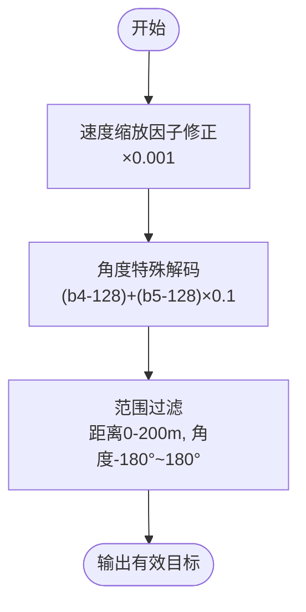
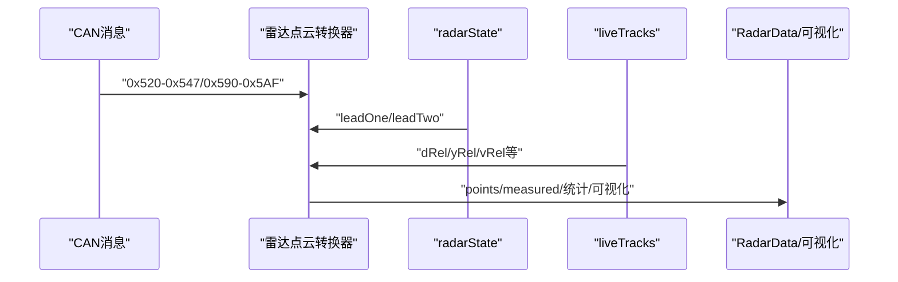
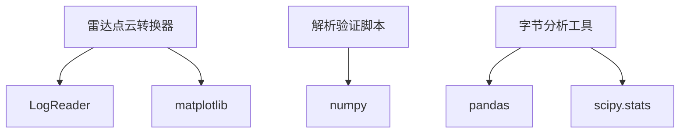

# 雷达信号处理

<cite>
**本文引用的文件**
- [雷达点云转换器（增强版）](file://radar_pointcloud_visualizer.py)
- [雷达点云转换器（基础版）](file://radar_to_pointcloud.py)
- [BYD雷达解析验证脚本](file://validate_radar_parsing.py)
- [综合雷达分析脚本](file://comprehensive_radar_analysis.py)
- [BYD雷达字节深度分析](file://tools/analyze_byd_radar_bytes_deep.py)
- [BYD雷达字节分析](file://tools/analyze_radar_bytes.py)
- [BYD雷达接口实现](file://opendbc_repo/opendbc/car/byd/radar_interface.py)
- [BYD雷达可视化说明（增强版）](file://ENHANCED_BYD_RADAR_VISUALIZATION_README.md)
- [BYD雷达可视化说明（更新版）](file://UPDATED_BYD_RADAR_VISUALIZATION_README.md)
</cite>

## 目录
1. [简介](#简介)
2. [项目结构](#项目结构)
3. [核心组件](#核心组件)
4. [架构总览](#架构总览)
5. [详细组件分析](#详细组件分析)
6. [依赖关系分析](#依赖关系分析)
7. [性能考量](#性能考量)
8. [故障排查指南](#故障排查指南)
9. [结论](#结论)
10. [附录](#附录)

## 简介
本文件面向雷达信号处理模块，聚焦BYD雷达信号的解析与点云生成流程，涵盖CAN总线数据提取、字节级分析、信号解码、点云构建、坐标系转换、校准与滤波、以及与系统其他组件的集成关系。文档以仓库现有实现为依据，结合实测数据分析，给出可操作的参数说明、配置项、返回值与常见问题解决方案，并提供可视化与性能评估工具的使用指导。

## 项目结构
围绕雷达信号处理，本仓库包含以下关键文件与工具：
- 雷达数据解析与可视化
  - 增强版雷达点云转换器：支持短/长距雷达、实时跟踪与雷达状态融合、统计与性能分析、雷达位置推断等。
  - 基础版雷达点云转换器：仅解析短距雷达目标，输出3D点云与鸟瞰图。
- 雷达解析验证与分析
  - 解析验证脚本：对比DBC定义与实测修正后的解析方法，验证速度与角度修正的合理性。
  - 综合分析脚本：对比DBC、接口实现与可视化工具，总结解析优化成果。
  - 字节级分析工具：探索RADAR_TRACK消息中各字节与相对距离/横向偏移的关系，验证编码规则。
- 雷达接口实现
  - BYD雷达接口：基于DBC与CAN解析，输出RadarData结构化点云。
- 文档与使用说明
  - 可视化使用说明：增强版与更新版README，明确数据格式、命令行参数与可视化解读。

**图表来源**
- [雷达点云转换器（增强版）:33-120](file://radar_pointcloud_visualizer.py#L33-L120)
- [雷达点云转换器（基础版）:31-112](file://radar_to_pointcloud.py#L31-L112)
- [BYD雷达解析验证脚本:10-64](file://validate_radar_parsing.py#L10-L64)
- [BYD雷达字节深度分析:14-124](file://tools/analyze_byd_radar_bytes_deep.py#L14-L124)
- [BYD雷达字节分析:18-91](file://tools/analyze_radar_bytes.py#L18-L91)

**章节来源**
- [雷达点云转换器（增强版）:33-120](file://radar_pointcloud_visualizer.py#L33-L120)
- [雷达点云转换器（基础版）:31-112](file://radar_to_pointcloud.py#L31-L112)
- [BYD雷达解析验证脚本:66-108](file://validate_radar_parsing.py#L66-L108)
- [综合雷达分析脚本:122-154](file://comprehensive_radar_analysis.py#L122-L154)
- [BYD雷达字节深度分析:14-124](file://tools/analyze_byd_radar_bytes_deep.py#L14-L124)
- [BYD雷达字节分析:18-91](file://tools/analyze_radar_bytes.py#L18-L91)

## 核心组件
- 雷达点云转换器（增强版）
  - 功能：解析短/长距雷达目标、实时跟踪与雷达状态，生成3D点云与鸟瞰图，输出统计与性能分析。
  - 关键流程：CAN消息过滤→字节解析→物理量换算→笛卡尔坐标转换→可视化/统计。
- 雷达点云转换器（基础版）
  - 功能：解析短距雷达目标，输出3D点云与鸟瞰图，打印统计信息。
- 解析验证脚本
  - 功能：对比原始DBC解析与实测修正解析，验证速度与角度修正的合理性。
- 字节分析工具
  - 功能：探索各字节与相对距离/横向偏移的线性关系，验证编码规则。
- 雷达接口实现
  - 功能：基于DBC与CAN解析，输出RadarData结构化点云。

**章节来源**
- [雷达点云转换器（增强版）:24-120](file://radar_pointcloud_visualizer.py#L24-L120)
- [雷达点云转换器（基础版）:23-112](file://radar_to_pointcloud.py#L23-L112)
- [BYD雷达解析验证脚本:10-64](file://validate_radar_parsing.py#L10-L64)
- [BYD雷达接口实现:8-56](file://opendbc_repo/opendbc/car/byd/radar_interface.py#L8-L56)

## 架构总览
雷达信号处理在系统中的位置如下：
- 数据来源：CAN消息（短/长距雷达）、radarState、liveTracks。
- 解析层：字节解析、物理量换算、滤波与异常值剔除。
- 表示层：点云生成、可视化、统计与性能评估。
- 集成点：与openpilot的RadarData结构对接，供上层控制与感知模块使用。

**图表来源**
- [雷达点云转换器（增强版）:39-120](file://radar_pointcloud_visualizer.py#L39-L120)
- [雷达点云转换器（基础版）:37-112](file://radar_to_pointcloud.py#L37-L112)
- [BYD雷达接口实现:31-55](file://opendbc_repo/opendbc/car/byd/radar_interface.py#L31-L55)

## 详细组件分析

### 字节级解析与信号解码
- 短距雷达（0x520-0x547）
  - 每消息8字节，典型字段：
    - 距离：bytes 0-1，大端序，缩放因子0.01。
    - 速度：bytes 2-3，大端序，有符号，缩放因子0.01（基础版）或0.001（增强版）。
    - 角度：bytes 4-5，大端序，有符号；采用特殊解码公式：(b4-128)+(b5-128)*0.1。
    - 状态：bytes 6-7，大端序。
  - 有效范围过滤：距离0-200m，角度-180°至180°。
- 长距雷达（0x590-0x5AF）
  - 同样8字节布局，但速度缩放因子修正为0.001，角度同样采用特殊解码。
  - 用于ACC与碰撞预警，最大检测距离可达100m以上（评估标准）。

**图表来源**
- [雷达点云转换器（增强版）:44-88](file://radar_pointcloud_visualizer.py#L44-L88)
- [雷达点云转换器（基础版）:43-82](file://radar_to_pointcloud.py#L43-L82)
- [BYD雷达解析验证脚本:39-64](file://validate_radar_parsing.py#L39-L64)

**章节来源**
- [雷达点云转换器（增强版）:44-88](file://radar_pointcloud_visualizer.py#L44-L88)
- [雷达点云转换器（基础版）:43-82](file://radar_to_pointcloud.py#L43-L82)
- [BYD雷达解析验证脚本:39-64](file://validate_radar_parsing.py#L39-L64)
- [BYD雷达可视化说明（增强版）:83-101](file://ENHANCED_BYD_RADAR_VISUALIZATION_README.md#L83-L101)
- [BYD雷达可视化说明（更新版）:91-101](file://UPDATED_BYD_RADAR_VISUALIZATION_README.md#L91-L101)

### 点云生成与坐标系转换
- 坐标系约定
  - X轴：纵向距离（前进方向）。
  - Y轴：横向距离（左侧为负，右侧为正）。
  - Z轴：高度（地面水平，设为0）。
- 转换方法
  - 由极坐标（距离、角度）转换为笛卡尔坐标（X、Y、Z）。
  - 可视化时叠加车辆轮廓与方向指示，便于理解相对位置。

**图表来源**
- [雷达点云转换器（增强版）:71-76](file://radar_pointcloud_visualizer.py#L71-L76)
- [雷达点云转换器（基础版）:65-69](file://radar_to_pointcloud.py#L65-L69)

**章节来源**
- [雷达点云转换器（增强版）:71-76](file://radar_pointcloud_visualizer.py#L71-L76)
- [雷达点云转换器（基础版）:65-69](file://radar_to_pointcloud.py#L65-L69)

### 校准与滤波算法
- 速度缩放因子修正
  - 基于实测数据分析，速度缩放因子从0.01修正为0.001，避免异常高值（如325m/s）。
- 角度特殊解码
  - 采用(b4-128)+(b5-128)*0.1，将角度限制在合理范围（-180°~180°）。
- 异常值处理
  - 距离范围过滤（0-200m），角度范围过滤（-180°~180°）。
  - 实时跟踪与雷达状态的范围约束（如dRel、yRel合理范围）。

**图表来源**
- [BYD雷达解析验证脚本:50-57](file://validate_radar_parsing.py#L50-L57)
- [雷达点云转换器（增强版）:69-70](file://radar_pointcloud_visualizer.py#L69-L70)

**章节来源**
- [BYD雷达解析验证脚本:66-108](file://validate_radar_parsing.py#L66-L108)
- [综合雷达分析脚本:122-154](file://comprehensive_radar_analysis.py#L122-L154)
- [雷达点云转换器（增强版）:69-70](file://radar_pointcloud_visualizer.py#L69-L70)

### 与系统组件的关系
- 与openpilot雷达接口对接
  - 输出RadarData结构，包含points数组与measured标记，供上层模块使用。
- 与radarState/liveTracks融合
  - 可视化与统计中同时展示雷达状态与实时跟踪，便于交叉验证。

**图表来源**
- [雷达点云转换器（增强版）:39-120](file://radar_pointcloud_visualizer.py#L39-L120)
- [BYD雷达接口实现:31-55](file://opendbc_repo/opendbc/car/byd/radar_interface.py#L31-L55)

**章节来源**
- [雷达点云转换器（增强版）:39-120](file://radar_pointcloud_visualizer.py#L39-L120)
- [BYD雷达接口实现:31-55](file://opendbc_repo/opendbc/car/byd/radar_interface.py#L31-L55)

## 依赖关系分析
- 组件耦合
  - 雷达点云转换器依赖日志读取器（LogReader）与matplotlib进行可视化。
  - 解析验证与字节分析脚本依赖numpy/pandas/scipy进行统计与相关性分析。
- 外部依赖
  - openpilot工具链（tools.lib.logreader）。
  - 数学与可视化库（numpy、matplotlib、pandas、scipy）。

**图表来源**
- [雷达点云转换器（增强版）:17-21](file://radar_pointcloud_visualizer.py#L17-L21)
- [雷达点云转换器（基础版）:16-20](file://radar_to_pointcloud.py#L16-L20)
- [BYD雷达解析验证脚本:6-8](file://validate_radar_parsing.py#L6-L8)
- [BYD雷达字节深度分析:6-11](file://tools/analyze_byd_radar_bytes_deep.py#L6-L11)
- [BYD雷达字节分析:11-15](file://tools/analyze_radar_bytes.py#L11-L15)

**章节来源**
- [雷达点云转换器（增强版）:17-21](file://radar_pointcloud_visualizer.py#L17-L21)
- [雷达点云转换器（基础版）:16-20](file://radar_to_pointcloud.py#L16-L20)
- [BYD雷达解析验证脚本:6-8](file://validate_radar_parsing.py#L6-L8)
- [BYD雷达字节深度分析:6-11](file://tools/analyze_byd_radar_bytes_deep.py#L6-L11)
- [BYD雷达字节分析:11-15](file://tools/analyze_radar_bytes.py#L11-L15)

## 性能考量
- 解析效率
  - 单帧CAN消息遍历与字节解析为O(N)（N为目标数量）。
  - 可视化渲染受点数影响，建议在大规模数据时启用保存模式或降采样。
- 数据质量
  - 通过范围过滤与特殊解码提升鲁棒性，减少异常值对后续模块的影响。
- 评估指标
  - 距离分布统计、最大检测距离、短/长距雷达覆盖率、雷达位置推断与缺失雷达识别。

[本节为通用性能讨论，不直接分析具体文件]

## 故障排查指南
- 速度异常偏大
  - 症状：速度达到数百米每秒。
  - 原因：速度缩放因子仍使用0.01。
  - 解决：确认使用0.001缩放因子（增强版已默认修正）。
- 角度异常偏大
  - 症状：角度超过数千度。
  - 原因：未采用特殊解码公式。
  - 解决：使用(b4-128)+(b5-128)*0.1。
- 距离异常偏大
  - 症状：距离超过数百米。
  - 原因：未进行范围过滤。
  - 解决：启用距离0-200m过滤。
- 可视化无数据
  - 症状：3D点云/鸟瞰图为空。
  - 原因：日志路径错误或数据未采集。
  - 解决：检查日志路径与数据完整性；确认命令行参数正确。

**章节来源**
- [BYD雷达解析验证脚本:93-124](file://validate_radar_parsing.py#L93-L124)
- [综合雷达分析脚本:157-181](file://comprehensive_radar_analysis.py#L157-L181)
- [雷达点云转换器（增强版）:69-70](file://radar_pointcloud_visualizer.py#L69-L70)

## 结论
本模块基于实测数据分析，对BYD雷达的解析方法进行了经验修正，确保速度与角度在物理合理范围内，并通过范围过滤与特殊解码提升鲁棒性。增强版工具进一步整合实时跟踪与雷达状态，提供统计与性能评估能力，有助于ACC雷达能力评估与雷达位置推断。建议在生产环境中统一使用增强版解析与可视化流程，并结合字节分析工具持续验证编码一致性。

[本节为总结性内容，不直接分析具体文件]

## 附录

### 参数与返回值说明
- 命令行参数（增强版）
  - --pointcloud：显示3D点云。
  - --birds-eye：显示鸟瞰图。
  - --stats：仅输出统计信息。
  - --performance：输出详细性能分析。
  - --save-plots：保存图像至PNG文件。
- 返回值
  - 雷达点云转换器内部维护雷达目标列表、实时跟踪列表与雷达状态列表，用于可视化与统计。
  - 雷达接口实现输出RadarData结构，包含points数组与measured标记。

**章节来源**
- [雷达点云转换器（增强版）:683-722](file://radar_pointcloud_visualizer.py#L683-L722)
- [BYD雷达接口实现:31-55](file://opendbc_repo/opendbc/car/byd/radar_interface.py#L31-L55)

### 使用示例与参考路径
- 基础使用
  - 加载日志并打印统计：[雷达点云转换器（基础版）:259-291](file://radar_to_pointcloud.py#L259-L291)
- 增强功能
  - 3D点云与鸟瞰图：[雷达点云转换器（增强版）:128-374](file://radar_pointcloud_visualizer.py#L128-L374)
  - 性能分析与雷达位置推断：[雷达点云转换器（增强版）:622-682](file://radar_pointcloud_visualizer.py#L622-L682)
- 解析验证
  - 原始与修正解析对比：[BYD雷达解析验证脚本:66-108](file://validate_radar_parsing.py#L66-L108)
- 字节分析
  - 与yRel/dRel相关性探索：[BYD雷达字节深度分析:126-219](file://tools/analyze_byd_radar_bytes_deep.py#L126-L219)
  - byte2/byte3与横向偏移关系：[BYD雷达字节分析:189-238](file://tools/analyze_radar_bytes.py#L189-L238)