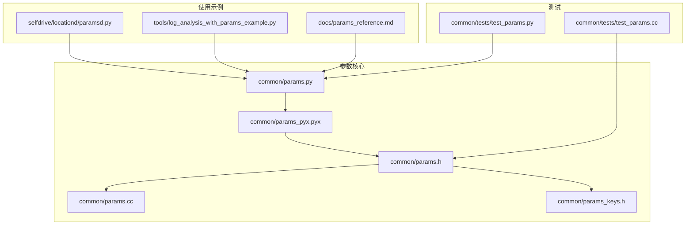
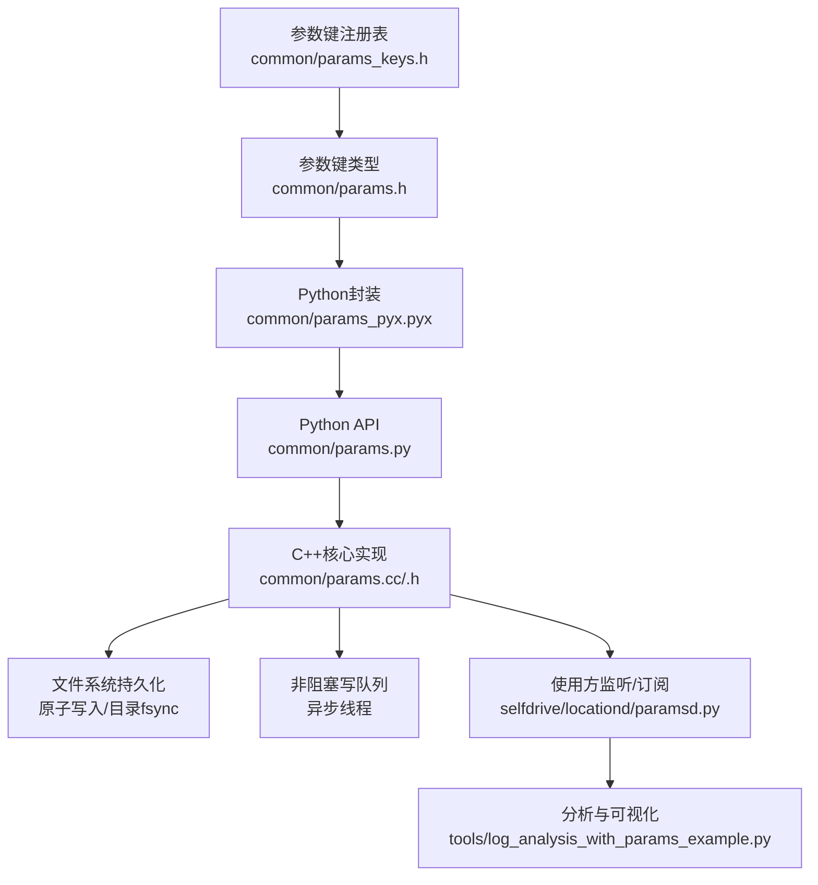
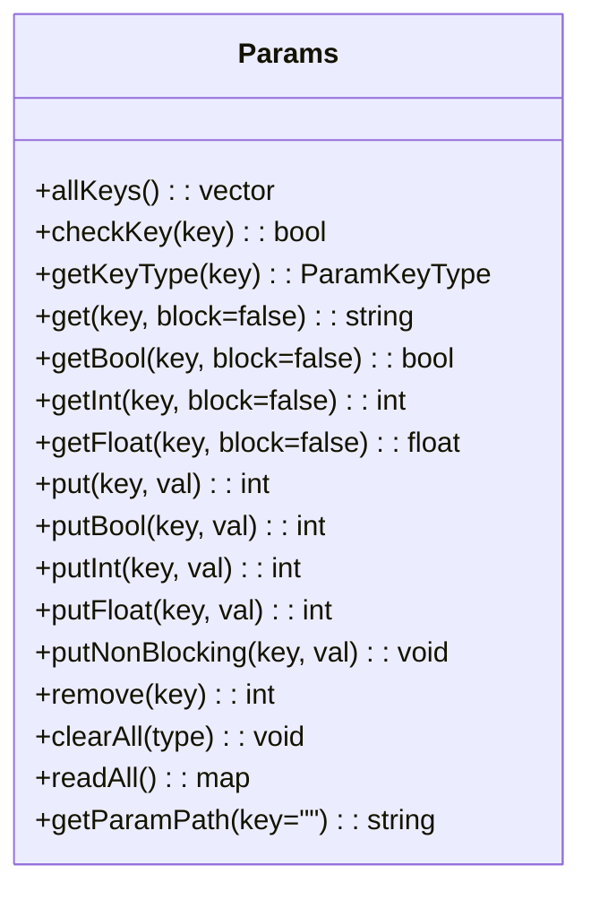
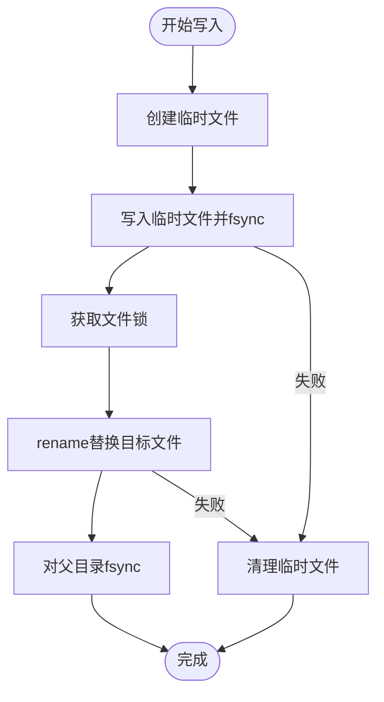
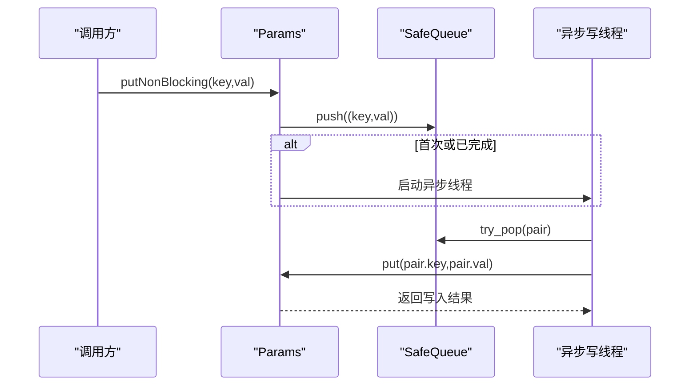
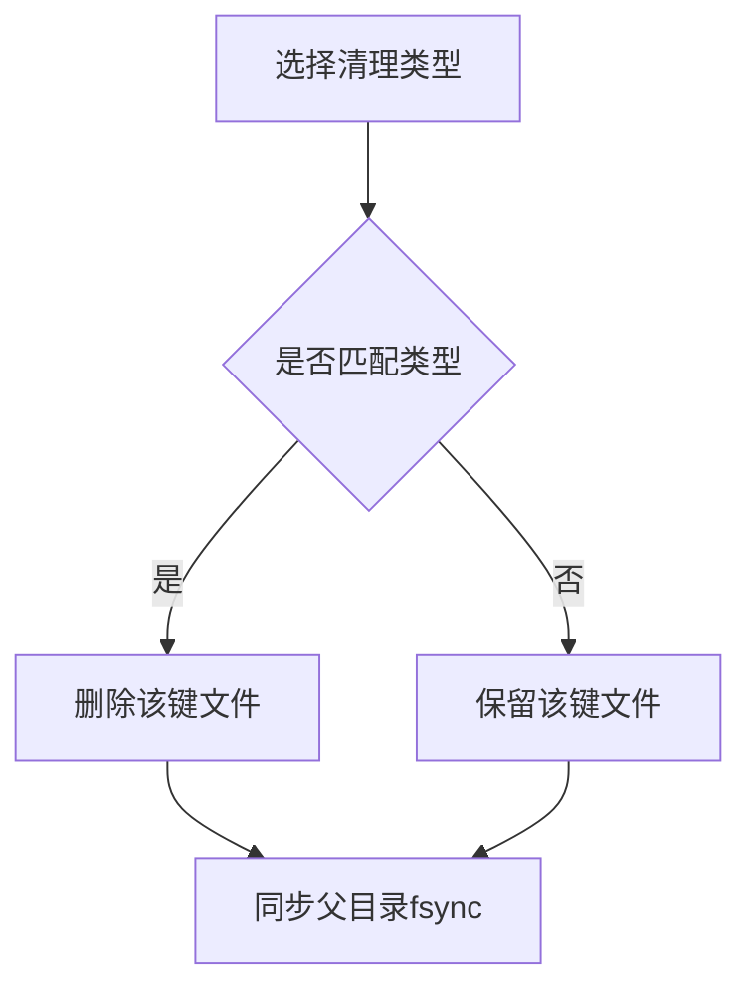
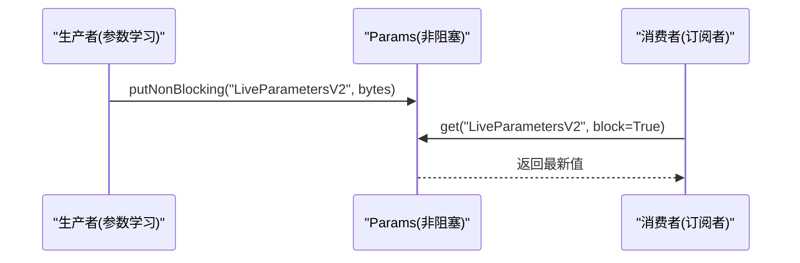
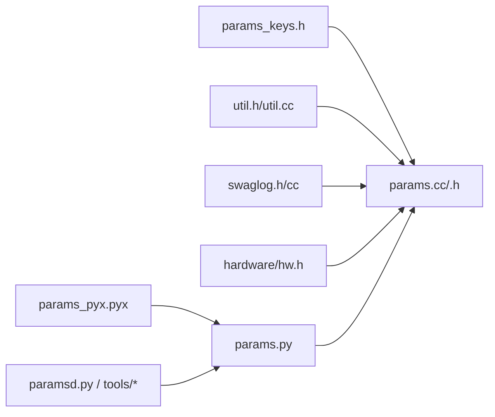

# 动态参数调整

<cite>
**本文引用的文件**   
- [common/params.h](file://common/params.h)
- [common/params.cc](file://common/params.cc)
- [common/params_keys.h](file://common/params_keys.h)
- [common/params_pyx.pyx](file://common/params_pyx.pyx)
- [common/params.py](file://common/params.py)
- [common/tests/test_params.py](file://common/tests/test_params.py)
- [common/tests/test_params.cc](file://common/tests/test_params.cc)
- [selfdrive/locationd/paramsd.py](file://selfdrive/locationd/paramsd.py)
- [tools/log_analysis_with_params_example.py](file://tools/log_analysis_with_params_example.py)
- [docs/params_reference.md](file://docs/params_reference.md)
</cite>

## 目录
1. [简介](#简介)
2. [项目结构](#项目结构)
3. [核心组件](#核心组件)
4. [架构总览](#架构总览)
5. [详细组件分析](#详细组件分析)
6. [依赖分析](#依赖分析)
7. [性能考量](#性能考量)
8. [故障排查指南](#故障排查指南)
9. [结论](#结论)
10. [附录](#附录)

## 简介
本文件围绕“动态参数调整”能力，系统阐述运行时参数修改的实现机制与使用方法，涵盖以下关键主题：
- 运行时参数修改：支持阻塞与非阻塞写入，确保原子落盘与一致性
- 缓存管理与持久化：基于文件系统的键值存储，带锁与目录同步保障
- 接口规范与类型系统：统一的参数键类型与访问辅助函数
- 参数变更通知与监听：通过非阻塞写队列与订阅机制实现低耦合更新
- 优先级与覆盖规则：参数键类型定义了生命周期清理策略
- 安全性与异常处理：文件锁、原子写入、信号中断处理与错误码
- 性能影响与最佳实践：批量写入、非阻塞写、避免频繁写入
- 与系统状态同步：参数迁移、跨进程共享与内存参数空间

## 项目结构
与动态参数调整直接相关的代码主要分布在以下模块：
- C++核心实现：参数读写、原子写入、文件锁、异步写队列
- Python封装：Cython桥接、类型与异常、便捷API
- 键定义：参数键及其生命周期类型
- 使用示例：定位参数服务、日志分析工具、参数参考文档

**图表来源**
- [common/params.h:1-93](file://common/params.h#L1-L93)
- [common/params.cc:1-235](file://common/params.cc#L1-L235)
- [common/params_keys.h:1-311](file://common/params_keys.h#L1-L311)
- [common/params_pyx.pyx:1-164](file://common/params_pyx.pyx#L1-L164)
- [common/params.py:1-19](file://common/params.py#L1-L19)
- [selfdrive/locationd/paramsd.py:1-316](file://selfdrive/locationd/paramsd.py#L1-L316)
- [tools/log_analysis_with_params_example.py:1-287](file://tools/log_analysis_with_params_example.py#L1-L287)
- [docs/params_reference.md:1-365](file://docs/params_reference.md#L1-L365)
- [common/tests/test_params.py:1-110](file://common/tests/test_params.py#L1-L110)
- [common/tests/test_params.cc:1-28](file://common/tests/test_params.cc#L1-L28)

**章节来源**
- [common/params.h:1-93](file://common/params.h#L1-L93)
- [common/params.cc:1-235](file://common/params.cc#L1-L235)
- [common/params_keys.h:1-311](file://common/params_keys.h#L1-L311)
- [common/params_pyx.pyx:1-164](file://common/params_pyx.pyx#L1-L164)
- [common/params.py:1-19](file://common/params.py#L1-L19)
- [selfdrive/locationd/paramsd.py:1-316](file://selfdrive/locationd/paramsd.py#L1-L316)
- [tools/log_analysis_with_params_example.py:1-287](file://tools/log_analysis_with_params_example.py#L1-L287)
- [docs/params_reference.md:1-365](file://docs/params_reference.md#L1-L365)
- [common/tests/test_params.py:1-110](file://common/tests/test_params.py#L1-L110)
- [common/tests/test_params.cc:1-28](file://common/tests/test_params.cc#L1-L28)

## 核心组件
- Params类（C++）：提供参数键检查、读取、写入、删除、清空、路径查询与非阻塞写队列；内部采用临时文件+rename原子写入与目录fsync保证持久化。
- 参数键类型（枚举）：定义参数生命周期与清理策略，如持久化、管理器启动清理、上下路切换清理等。
- Python封装（Cython）：将C++接口暴露为Python类，提供便捷的get/put系列方法与非阻塞写接口，并在阻塞读取时处理信号中断。
- 键注册表：集中声明所有参数键及其类型，用于键校验与清理策略。

**章节来源**
- [common/params.h:12-93](file://common/params.h#L12-L93)
- [common/params.cc:122-191](file://common/params.cc#L122-L191)
- [common/params_pyx.pyx:43-164](file://common/params_pyx.pyx#L43-L164)
- [common/params_keys.h:6-311](file://common/params_keys.h#L6-L311)

## 架构总览
动态参数调整由“键注册—类型系统—读写接口—持久化层—使用方”构成闭环。键注册表决定参数生命周期；读写接口提供统一访问；持久化层确保原子落盘；使用方通过订阅或轮询获取最新参数。

**图表来源**
- [common/params_keys.h:6-311](file://common/params_keys.h#L6-L311)
- [common/params.h:12-20](file://common/params.h#L12-L20)
- [common/params_pyx.pyx:43-164](file://common/params_pyx.pyx#L43-L164)
- [common/params.py:1-19](file://common/params.py#L1-L19)
- [common/params.cc:227-234](file://common/params.cc#L227-L234)
- [selfdrive/locationd/paramsd.py:285-311](file://selfdrive/locationd/paramsd.py#L285-L311)
- [tools/log_analysis_with_params_example.py:62-84](file://tools/log_analysis_with_params_example.py#L62-L84)

## 详细组件分析

### Params类与接口规范
- 键检查与类型：checkKey/getKeyType用于验证键存在并查询类型。
- 读取：get/getBool/getInt/getFloat提供便捷访问；block=true时阻塞等待直至可读。
- 写入：put/putBool/putInt/putFloat提供阻塞写入；putNonBlocking/非标量变体用于非阻塞写。
- 清理：clearAll按类型批量清理；remove删除单键；readAll读取目录下全部键值。
- 路径：getParamPath拼接参数文件路径；支持自定义根路径。

**图表来源**
- [common/params.h:22-93](file://common/params.h#L22-L93)

**章节来源**
- [common/params.h:22-93](file://common/params.h#L22-L93)

### 原子写入与持久化
- 临时文件+rename：先写临时文件，fsync确保落盘，再rename替换目标文件，最后对父目录fsync，保证原子性与持久化。
- 文件锁：写入期间持有锁，避免并发写冲突。
- 目录同步：写入后同步父目录，确保元数据一致。

**图表来源**
- [common/params.cc:122-158](file://common/params.cc#L122-L158)

**章节来源**
- [common/params.cc:122-158](file://common/params.cc#L122-L158)

### 非阻塞写队列与异步线程
- 非阻塞写：putNonBlocking将键值对入队，按需启动异步线程消费队列。
- 队列消费：异步线程循环从队列取出键值对，调用阻塞写入，保证最终一致性。
- 线程生命周期：析构时等待future完成，断言队列为空。

**图表来源**
- [common/params.cc:219-234](file://common/params.cc#L219-L234)
- [common/params.h:83-92](file://common/params.h#L83-L92)

**章节来源**
- [common/params.cc:219-234](file://common/params.cc#L219-L234)
- [common/params.h:83-92](file://common/params.h#L83-L92)

### 参数键类型与覆盖规则
- 生命周期类型：
  - PERSISTENT：持久化，不自动清理
  - CLEAR_ON_MANAGER_START：管理器启动时清理
  - CLEAR_ON_ONROAD_TRANSITION：上下路切换时清理
  - CLEAR_ON_OFFROAD_TRANSITION：离路/上路切换时清理
  - DONT_LOG：不记录日志
  - DEVELOPMENT_ONLY：仅开发用途
- 清理策略：clearAll按类型过滤并删除对应键，同时清理不在键表中的文件，保持目录整洁。

**图表来源**
- [common/params.cc:198-217](file://common/params.cc#L198-L217)
- [common/params.h:12-20](file://common/params.h#L12-L20)

**章节来源**
- [common/params.cc:198-217](file://common/params.cc#L198-L217)
- [common/params.h:12-20](file://common/params.h#L12-L20)

### 参数变更通知与监听
- 非阻塞写作为“发布者”：使用方通过putNonBlocking发布变更。
- 阻塞读作为“订阅者”：在需要时调用get(key, block=True)等待新值。
- 实际应用示例：
  - paramsd中定期将估计的车辆参数写回LiveParametersV2，供其他模块订阅。
  - 日志分析工具在阻塞读取CarParams以确保参数一致性。

**图表来源**
- [selfdrive/locationd/paramsd.py:301-311](file://selfdrive/locationd/paramsd.py#L301-L311)
- [common/params.cc:170-191](file://common/params.cc#L170-L191)

**章节来源**
- [selfdrive/locationd/paramsd.py:285-311](file://selfdrive/locationd/paramsd.py#L285-L311)
- [common/params.cc:170-191](file://common/params.cc#L170-L191)

### 参数优先级与覆盖规则
- 键注册表集中定义每个键的类型，类型决定其生命周期与清理时机。
- 覆盖规则：同一键的多次写入以最近一次为准；clearAll按类型批量覆盖。
- 开发与生产隔离：DEVELOPMENT_ONLY键仅用于开发环境，避免污染生产状态。

**章节来源**
- [common/params_keys.h:6-311](file://common/params_keys.h#L6-L311)
- [common/params.h:12-20](file://common/params.h#L12-L20)

### 使用方法与接口规范（Python）
- 创建实例：from openpilot.common.params import Params
- 基本操作：
  - 读取：get/get_bool/get_int/get_float
  - 写入：put/put_bool/put_int/put_float
  - 非阻塞：put_nonblocking/put_bool_nonblocking/put_int_nonblocking/put_float_nonblocking
  - 其他：remove/clear_all/all_keys/get_param_path/check_key
- 阻塞读取：当block=True时，遇到SIGINT/SIGTERM会返回空值并抛出KeyboardInterrupt异常。

**章节来源**
- [common/params_pyx.pyx:68-164](file://common/params_pyx.pyx#L68-L164)
- [common/params.py:1-19](file://common/params.py#L1-L19)

### 实际示例：运行时安全修改参数
- 命令行脚本：通过check_key校验键是否存在，再执行put写入。
- 日志分析：在阻塞读取CarParams确保参数一致性，避免因参数缺失导致分析偏差。
- 参数服务：paramsd周期性写入LiveParametersV2，供订阅者阻塞读取。

**章节来源**
- [common/params.py:6-19](file://common/params.py#L6-L19)
- [tools/log_analysis_with_params_example.py:62-84](file://tools/log_analysis_with_params_example.py#L62-L84)
- [selfdrive/locationd/paramsd.py:301-311](file://selfdrive/locationd/paramsd.py#L301-L311)

## 依赖分析
- 组件耦合：
  - C++核心实现依赖键注册表与工具库，提供线程安全与原子写入。
  - Python封装依赖C++实现，暴露类型与异常，简化调用。
  - 使用方通过Python API与C++实现解耦，支持多进程与跨模块共享。
- 外部依赖：
  - 文件系统：临时文件、rename、fsync、目录同步
  - 信号处理：阻塞读取时的中断处理
  - 异步线程：非阻塞写队列消费

**图表来源**
- [common/params.cc:1-16](file://common/params.cc#L1-L16)
- [common/params.h:1-11](file://common/params.h#L1-L11)
- [common/params_pyx.pyx:7-35](file://common/params_pyx.pyx#L7-L35)
- [selfdrive/locationd/paramsd.py:1-18](file://selfdrive/locationd/paramsd.py#L1-L18)
- [tools/log_analysis_with_params_example.py:1-20](file://tools/log_analysis_with_params_example.py#L1-L20)

**章节来源**
- [common/params.cc:1-16](file://common/params.cc#L1-L16)
- [common/params.h:1-11](file://common/params.h#L1-L11)
- [common/params_pyx.pyx:7-35](file://common/params_pyx.pyx#L7-L35)
- [selfdrive/locationd/paramsd.py:1-18](file://selfdrive/locationd/paramsd.py#L1-L18)
- [tools/log_analysis_with_params_example.py:1-20](file://tools/log_analysis_with_params_example.py#L1-L20)

## 性能考量
- 写入成本：
  - 阻塞写入：每次写入涉及临时文件、fsync与rename，IO开销较高，应避免高频写。
  - 非阻塞写入：通过队列与异步线程降低主线程阻塞，适合高吞吐场景。
- 读取成本：
  - 阻塞读取：在等待期间占用CPU轮询，建议仅在必要时使用。
  - 非阻塞读取：立即返回，适合轮询与事件驱动场景。
- 清理成本：
  - clearAll遍历目录并删除匹配键，建议在系统空闲时段执行。
- 最佳实践：
  - 将参数写入合并为批处理，减少fsync次数
  - 使用非阻塞写入，配合阻塞读取的订阅模式
  - 避免在实时路径上频繁写入，优先使用内存参数空间（如/dev/shm/params）

[本节为通用指导，无需特定文件来源]

## 故障排查指南
- 键不存在异常：check_key失败抛出UnknownKeyName，确认键是否在params_keys.h中注册。
- 阻塞读取中断：SIGINT/SIGTERM触发后返回空值并抛出KeyboardInterrupt，检查调用栈与信号处理。
- 写入失败：put返回负值，检查磁盘空间、权限与文件锁状态。
- 非阻塞写未生效：确认异步线程已启动且队列未被提前销毁；在析构时等待future完成。
- 参数未清理：确认键类型是否匹配，或手动调用clearAll指定类型。

**章节来源**
- [common/params_pyx.pyx:40-41](file://common/params_pyx.pyx#L40-L41)
- [common/params_pyx.pyx:68-82](file://common/params_pyx.pyx#L68-L82)
- [common/params.cc:122-158](file://common/params.cc#L122-L158)
- [common/params.cc:99-104](file://common/params.cc#L99-L104)
- [common/tests/test_params.py:51-62](file://common/tests/test_params.py#L51-L62)
- [common/tests/test_params.cc:6-27](file://common/tests/test_params.cc#L6-L27)

## 结论
动态参数调整通过“键类型+原子写入+非阻塞队列+阻塞订阅”的组合，在保证一致性与可靠性的同时，提供了灵活的运行时参数修改能力。合理使用非阻塞写与阻塞读的订阅模式，可显著降低对实时性的干扰；结合参数键类型与清理策略，可实现参数生命周期的精细化管理。

[本节为总结，无需特定文件来源]

## 附录
- 参数参考与常用参数速查：参见参数参考文档，包含参数分类、读取方法与修改建议。
- 使用示例脚本：命令行参数设置脚本、日志分析工具展示了参数读取与阻塞读取的正确用法。

**章节来源**
- [docs/params_reference.md:1-365](file://docs/params_reference.md#L1-L365)
- [common/params.py:6-19](file://common/params.py#L6-L19)
- [tools/log_analysis_with_params_example.py:62-84](file://tools/log_analysis_with_params_example.py#L62-L84)