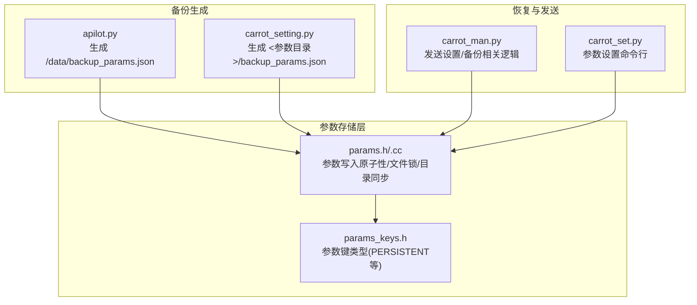
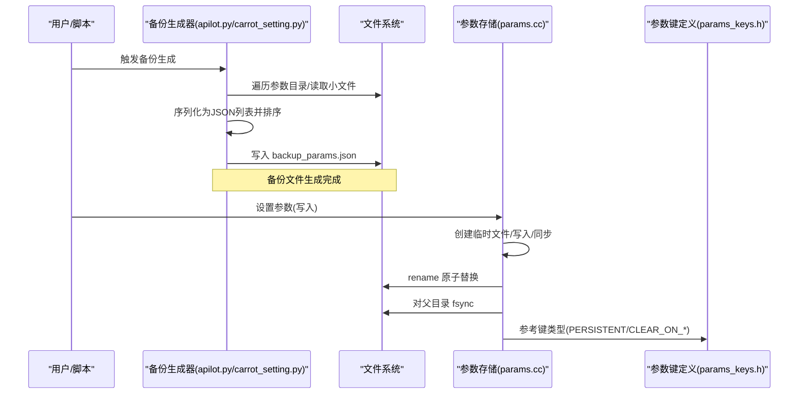
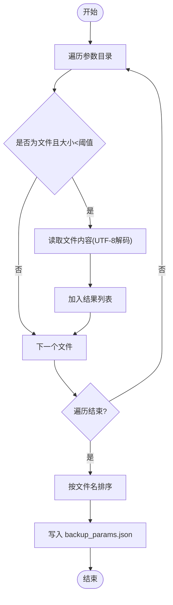
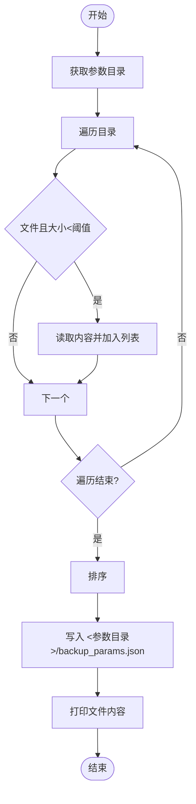
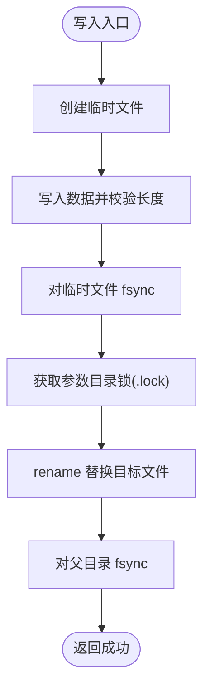
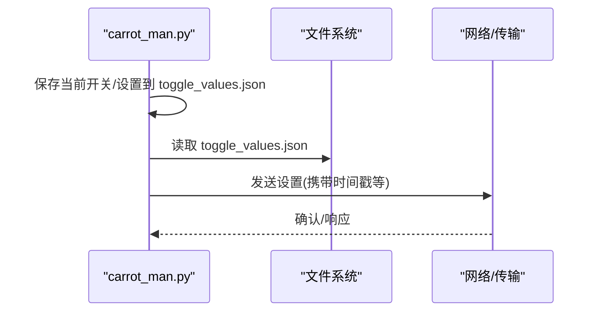
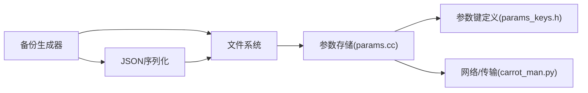

# 参数备份恢复

<cite>
**本文引用的文件**
- [selfdrive/apilot.py](file://selfdrive/apilot.py)
- [selfdrive/carrot_setting.py](file://selfdrive/carrot_setting.py)
- [common/params.cc](file://common/params.cc)
- [common/params.h](file://common/params.h)
- [common/params.py](file://common/params.py)
- [common/params_keys.h](file://common/params_keys.h)
- [selfdrive/carrot/carrot_man.py](file://selfdrive/carrot/carrot_man.py)
- [selfdrive/carrot_set.py](file://selfdrive/carrot_set.py)
</cite>

## 目录
1. [简介](#简介)
2. [项目结构](#项目结构)
3. [核心组件](#核心组件)
4. [架构总览](#架构总览)
5. [详细组件分析](#详细组件分析)
6. [依赖关系分析](#依赖关系分析)
7. [性能考量](#性能考量)
8. [故障排查指南](#故障排查指南)
9. [结论](#结论)
10. [附录](#附录)

## 简介
本文件围绕“参数备份与恢复”能力进行系统化技术说明，重点覆盖以下方面：
- 备份机制：backup_params.json 文件的生成逻辑、文件格式与内容结构
- 触发条件与执行流程：何时生成备份、如何写入、路径与命名规则
- 恢复流程：从备份文件读取并回写参数的可行性与注意事项
- 数据校验与完整性：参数存储与读取的原子性、锁机制与目录同步
- 错误处理与异常：常见失败场景与定位方法
- 备份策略与定期备份建议：基于现有实现给出实践建议
- 手动管理与故障恢复：备份文件的手动操作与恢复步骤

## 项目结构
与参数备份恢复直接相关的核心文件与职责如下：
- 备份生成脚本
  - [selfdrive/apilot.py](file://selfdrive/apilot.py)：从固定目录读取参数文件并生成 backup_params.json
  - [selfdrive/carrot_setting.py](file://selfdrive/carrot_setting.py)：使用参数模块获取参数目录，生成同名备份文件
- 参数读写与存储
  - [common/params.cc](file://common/params.cc)、[common/params.h](file://common/params.h)：参数写入的原子性、文件锁与目录同步
  - [common/params.py](file://common/params.py)：Python 层参数工具入口
  - [common/params_keys.h](file://common/params_keys.h)：参数键类型与持久化策略（如 PERSISTENT）
- 恢复与发送
  - [selfdrive/carrot/carrot_man.py](file://selfdrive/carrot/carrot_man.py)：包含发送设置与备份相关逻辑（toggle_values.json），可作为恢复参考
  - [selfdrive/carrot_set.py](file://selfdrive/carrot_set.py)：参数设置命令行工具，可用于恢复单个参数

**图表来源**
- [selfdrive/apilot.py:1-23](file://selfdrive/apilot.py#L1-L23)
- [selfdrive/carrot_setting.py:1-28](file://selfdrive/carrot_setting.py#L1-L28)
- [common/params.cc:122-159](file://common/params.cc#L122-L159)
- [common/params.h:22-54](file://common/params.h#L22-L54)
- [common/params_keys.h:12-302](file://common/params_keys.h#L12-L302)
- [selfdrive/carrot/carrot_man.py:839-849](file://selfdrive/carrot/carrot_man.py#L839-L849)
- [selfdrive/carrot_set.py:1-14](file://selfdrive/carrot_set.py#L1-L14)

**章节来源**
- [selfdrive/apilot.py:1-23](file://selfdrive/apilot.py#L1-L23)
- [selfdrive/carrot_setting.py:1-28](file://selfdrive/carrot_setting.py#L1-L28)
- [common/params.cc:122-159](file://common/params.cc#L122-L159)
- [common/params.h:22-54](file://common/params.h#L22-L54)
- [common/params_keys.h:12-302](file://common/params_keys.h#L12-L302)
- [selfdrive/carrot/carrot_man.py:839-849](file://selfdrive/carrot/carrot_man.py#L839-L849)
- [selfdrive/carrot_set.py:1-14](file://selfdrive/carrot_set.py#L1-L14)

## 核心组件
- 备份生成器
  - 固定路径版本：扫描固定目录下的参数文件，过滤极小尺寸文件，生成 JSON 列表并排序，输出到根目录
  - 参数目录版本：通过参数模块获取参数目录，生成同名备份文件
- 参数存储层
  - 写入采用临时文件 + rename 的原子写法，并对父目录 fsync，配合文件锁保证并发安全
  - 支持按键类型清理参数，支持非阻塞批量写入队列
- 恢复与发送
  - 存在发送设置与备份相关逻辑，便于理解恢复后的应用行为
  - 提供命令行工具用于设置单个参数键值

**章节来源**
- [selfdrive/apilot.py:1-23](file://selfdrive/apilot.py#L1-L23)
- [selfdrive/carrot_setting.py:1-28](file://selfdrive/carrot_setting.py#L1-L28)
- [common/params.cc:122-159](file://common/params.cc#L122-L159)
- [common/params.cc:198-217](file://common/params.cc#L198-L217)
- [common/params.cc:219-234](file://common/params.cc#L219-L234)
- [selfdrive/carrot/carrot_man.py:839-849](file://selfdrive/carrot/carrot_man.py#L839-L849)
- [selfdrive/carrot_set.py:1-14](file://selfdrive/carrot_set.py#L1-L14)

## 架构总览
下图展示了从“备份生成”到“参数存储”的端到端流程，以及恢复侧的参考路径。

**图表来源**
- [selfdrive/apilot.py:1-23](file://selfdrive/apilot.py#L1-L23)
- [selfdrive/carrot_setting.py:1-28](file://selfdrive/carrot_setting.py#L1-L28)
- [common/params.cc:122-159](file://common/params.cc#L122-L159)
- [common/params_keys.h:12-302](file://common/params_keys.h#L12-L302)

## 详细组件分析

### 备份生成器（apilot.py）
- 输入与过滤
  - 固定扫描路径：参数目录
  - 过滤条件：仅处理文件且大小小于阈值
- 输出
  - JSON 数组，元素为对象，包含文件名与内容
  - 结果按文件名排序后写入根目录备份文件
- 特点
  - 仅收集“小文件”，避免大文件或二进制数据进入备份
  - 输出为纯文本内容，便于人工审阅

**图表来源**
- [selfdrive/apilot.py:10-22](file://selfdrive/apilot.py#L10-L22)

**章节来源**
- [selfdrive/apilot.py:1-23](file://selfdrive/apilot.py#L1-L23)

### 备份生成器（carrot_setting.py）
- 输入与过滤
  - 使用参数模块获取参数目录
  - 过滤条件与上述一致
- 输出
  - 同名备份文件位于参数目录内
  - 生成后可直接打印文件内容进行核对

**图表来源**
- [selfdrive/carrot_setting.py:6-27](file://selfdrive/carrot_setting.py#L6-L27)

**章节来源**
- [selfdrive/carrot_setting.py:1-28](file://selfdrive/carrot_setting.py#L1-L28)

### 参数存储与原子写入（params.cc）
- 原子写入流程
  - 创建临时文件 → 写入数据 → fsync → 获取文件锁 → rename 替换目标 → 对父目录 fsync
- 并发与一致性
  - 使用文件锁保护关键路径
  - 清理接口支持按键类型删除，同时清理未登记的文件
- 非阻塞写入
  - 异步队列 + 异步线程，提升吞吐

**图表来源**
- [common/params.cc:122-159](file://common/params.cc#L122-L159)

**章节来源**
- [common/params.cc:122-159](file://common/params.cc#L122-L159)
- [common/params.cc:198-217](file://common/params.cc#L198-L217)
- [common/params.cc:219-234](file://common/params.cc#L219-L234)

### 参数键类型与持久化策略（params_keys.h）
- 关键枚举
  - PERSISTENT：持久化参数
  - CLEAR_ON_MANAGER_START/CLEAR_ON_ONROAD_TRANSITION/CLEAR_ON_OFFROAD_TRANSITION：启动/状态切换时清除
- 影响
  - 备份文件中包含的键值，其生命周期受此策略影响
  - 恢复时需结合业务语义决定是否需要保留

**章节来源**
- [common/params_keys.h:12-302](file://common/params_keys.h#L12-L302)

### 恢复与发送参考（carrot_man.py）
- 发送设置
  - 存在保存并发送“toggle_values.json”的逻辑，可作为恢复后应用状态的一致性参考
- 备份相关
  - 代码中存在对备份文件的引用，体现恢复流程在上层组件中的落地方式

**图表来源**
- [selfdrive/carrot/carrot_man.py:839-849](file://selfdrive/carrot/carrot_man.py#L839-L849)

**章节来源**
- [selfdrive/carrot/carrot_man.py:839-849](file://selfdrive/carrot/carrot_man.py#L839-L849)

### 参数设置命令行（carrot_set.py）
- 功能
  - 通过命令行设置指定参数键值
  - 适合对单个参数进行恢复或验证

**章节来源**
- [selfdrive/carrot_set.py:1-14](file://selfdrive/carrot_set.py#L1-L14)

## 依赖关系分析
- 备份生成器依赖文件系统遍历与 JSON 序列化
- 参数存储层依赖原子写入与文件锁，确保并发安全
- 恢复侧依赖参数读写能力与网络/传输通道
- 键类型定义贯穿备份与恢复，决定参数生命周期

**图表来源**
- [selfdrive/apilot.py:1-23](file://selfdrive/apilot.py#L1-L23)
- [selfdrive/carrot_setting.py:1-28](file://selfdrive/carrot_setting.py#L1-L28)
- [common/params.cc:122-159](file://common/params.cc#L122-L159)
- [common/params_keys.h:12-302](file://common/params_keys.h#L12-L302)
- [selfdrive/carrot/carrot_man.py:839-849](file://selfdrive/carrot/carrot_man.py#L839-L849)

**章节来源**
- [selfdrive/apilot.py:1-23](file://selfdrive/apilot.py#L1-L23)
- [selfdrive/carrot_setting.py:1-28](file://selfdrive/carrot_setting.py#L1-L28)
- [common/params.cc:122-159](file://common/params.cc#L122-L159)
- [common/params_keys.h:12-302](file://common/params_keys.h#L12-L302)
- [selfdrive/carrot/carrot_man.py:839-849](file://selfdrive/carrot/carrot_man.py#L839-L849)

## 性能考量
- 备份生成
  - 仅处理小文件，避免大文件带来的 IO 压力
  - JSON 写入为一次性落盘，顺序写入有利于磁盘性能
- 参数写入
  - 原子写入 + fsync，确保可靠性但会增加 IO 开销
  - 非阻塞写入通过异步队列降低主线程阻塞
- 建议
  - 在设备空闲时段执行备份
  - 控制备份频率，避免频繁 fsync 导致寿命损耗

[本节为通用性能讨论，无需具体文件引用]

## 故障排查指南
- 备份文件为空或缺失
  - 检查参数目录是否存在、权限是否正确
  - 确认过滤条件（文件大小阈值）是否过于严格
- 备份文件内容乱码
  - 仅读取可解码为 UTF-8 的内容；二进制或不可解码内容会被忽略
- 写入失败
  - 查看参数写入返回码与日志，确认临时文件创建、fsync、rename 是否成功
  - 检查参数目录锁是否被占用
- 恢复后参数未生效
  - 确认键类型策略（如 CLEAR_ON_MANAGER_START）是否导致参数被清理
  - 使用命令行工具逐键验证

**章节来源**
- [common/params.cc:122-159](file://common/params.cc#L122-L159)
- [common/params.cc:198-217](file://common/params.cc#L198-L217)
- [selfdrive/carrot_set.py:1-14](file://selfdrive/carrot_set.py#L1-L14)

## 结论
- 备份机制通过“小文件过滤 + 文本内容收集 + JSON 序列化”实现，简单可靠
- 参数存储采用原子写入与文件锁，保障并发与一致性
- 恢复可通过命令行工具或上层组件的设置发送逻辑实现
- 建议结合键类型策略制定备份与恢复策略，定期执行并验证

[本节为总结性内容，无需具体文件引用]

## 附录

### 备份文件格式与内容结构
- 文件名
  - 固定路径版本：/data/backup_params.json
  - 参数目录版本：<参数目录>/backup_params.json
- 结构
  - JSON 数组，元素为对象，包含字段：文件名、内容
  - 结果按文件名升序排列
- 生成条件
  - 仅收集“文件且大小小于阈值”的参数文件
  - 内容以 UTF-8 解码，无法解码的内容将被忽略

**章节来源**
- [selfdrive/apilot.py:5-22](file://selfdrive/apilot.py#L5-L22)
- [selfdrive/carrot_setting.py:6-27](file://selfdrive/carrot_setting.py#L6-L27)

### 触发条件与执行流程
- 触发条件
  - 用户手动运行备份脚本
  - 上层组件在特定事件（如 onroad、异常）时触发发送设置
- 执行流程
  - 备份：遍历 → 过滤 → 读取 → 排序 → 写入
  - 恢复：逐键设置或通过发送逻辑恢复整体状态

**章节来源**
- [selfdrive/apilot.py:10-22](file://selfdrive/apilot.py#L10-L22)
- [selfdrive/carrot_setting.py:10-27](file://selfdrive/carrot_setting.py#L10-L27)
- [selfdrive/carrot/carrot_man.py:886-895](file://selfdrive/carrot/carrot_man.py#L886-L895)

### 数据验证与完整性检查
- 写入原子性
  - 临时文件 + rename + fsync + 目录 fsync
- 并发控制
  - 文件锁保护关键路径
- 清理策略
  - 支持按键类型清理，兼顾历史参数的清理

**章节来源**
- [common/params.cc:122-159](file://common/params.cc#L122-L159)
- [common/params.cc:198-217](file://common/params.cc#L198-L217)

### 存储位置与命名规则
- 位置
  - 固定路径：/data/backup_params.json
  - 参数目录：参数目录/backup_params.json
- 命名
  - 统一使用 backup_params.json

**章节来源**
- [selfdrive/apilot.py:5-6](file://selfdrive/apilot.py#L5-L6)
- [selfdrive/carrot_setting.py:6-8](file://selfdrive/carrot_setting.py#L6-L8)

### 备份策略与定期备份建议
- 策略选择
  - 优先备份 PERSISTENT 类型参数，避免易丢失键被纳入
  - 对于 CLEAR_ON_MANAGER_START 的键，应在启动后再次备份
- 定期备份
  - 建议在每日/每周固定时间执行备份
  - 备份前确保无大规模参数写入

**章节来源**
- [common/params_keys.h:12-302](file://common/params_keys.h#L12-L302)

### 手动管理与故障恢复指南
- 备份文件管理
  - 备份完成后可直接查看 JSON 内容，核对键与值
- 恢复步骤
  - 单键恢复：使用参数设置命令行工具
  - 批量恢复：根据备份 JSON 逐键写入
- 故障恢复
  - 若参数被自动清理，可在合适时机重新导入
  - 如遇写入失败，检查磁盘空间与权限

**章节来源**
- [selfdrive/carrot_set.py:1-14](file://selfdrive/carrot_set.py#L1-L14)
- [common/params.cc:122-159](file://common/params.cc#L122-L159)