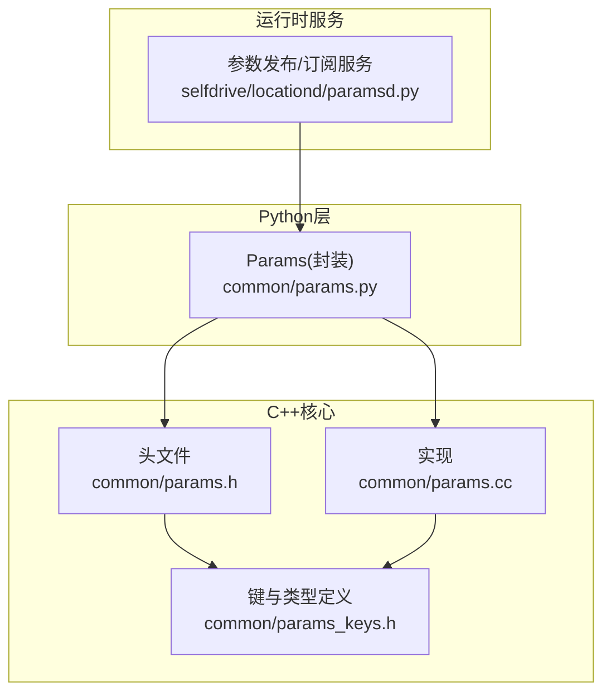
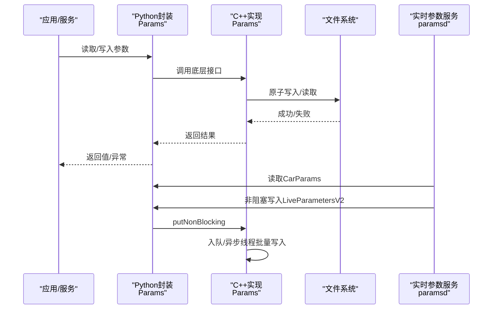
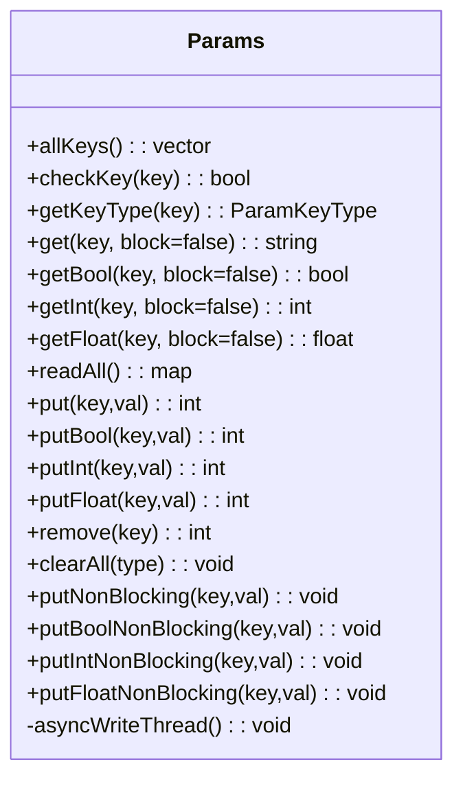
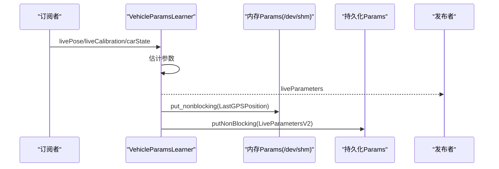
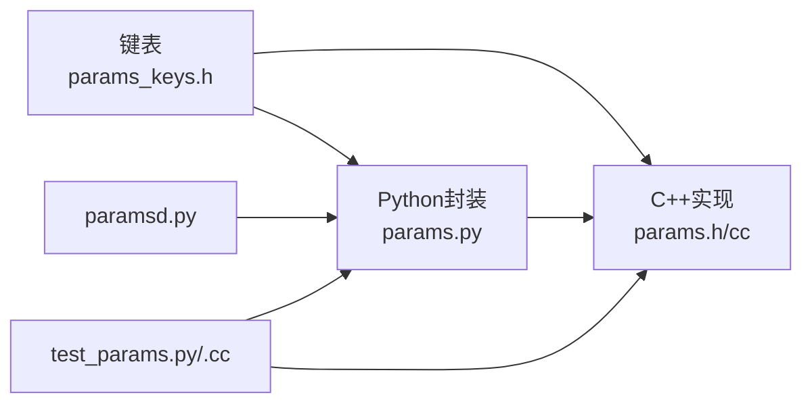

# 参数管理系统

<cite>
**本文引用的文件**
- [common/params.py](file://common/params.py)
- [common/params.h](file://common/params.h)
- [common/params.cc](file://common/params.cc)
- [common/params_keys.h](file://common/params_keys.h)
- [selfdrive/locationd/paramsd.py](file://selfdrive/locationd/paramsd.py)
- [common/tests/test_params.py](file://common/tests/test_params.py)
- [common/tests/test_params.cc](file://common/tests/test_params.cc)
- [docs/params_reference.md](file://docs/params_reference.md)
- [check_follow_issue.py](file://check_follow_issue.py)
</cite>

## 目录
1. [简介](#简介)
2. [项目结构](#项目结构)
3. [核心组件](#核心组件)
4. [架构总览](#架构总览)
5. [详细组件分析](#详细组件分析)
6. [依赖关系分析](#依赖关系分析)
7. [性能考量](#性能考量)
8. [故障排查指南](#故障排查指南)
9. [结论](#结论)
10. [附录](#附录)

## 简介
本文件面向“参数管理系统”的使用者与维护者，系统性阐述参数配置的实现细节、调用关系、接口与领域模型；深入解释动态参数调整的工作原理（含实时修改与持久化）、参数备份与恢复机制、参数验证与默认值管理，并给出来自实际代码库的示例路径与最佳实践。文档兼顾初学者易懂与资深工程师所需的技术深度。

## 项目结构
参数管理由三层组成：
- Python层封装：对外暴露统一的参数读写接口与类型转换辅助函数，便于上层模块直接使用。
- C++核心实现：提供原子落盘写入、非阻塞批量写入、目录锁与同步保障等关键能力。
- 键值与类别定义：集中声明所有参数键、参数类型（如持久化、随启动清理等）以及默认值策略。

图表来源
- [common/params.py:1-19](file://common/params.py#L1-L19)
- [common/params.h:22-93](file://common/params.h#L22-L93)
- [common/params.cc:94-234](file://common/params.cc#L94-L234)
- [common/params_keys.h:6-311](file://common/params_keys.h#L6-L311)
- [selfdrive/locationd/paramsd.py:1-316](file://selfdrive/locationd/paramsd.py#L1-L316)

章节来源
- [common/params.py:1-19](file://common/params.py#L1-L19)
- [common/params.h:22-93](file://common/params.h#L22-L93)
- [common/params.cc:94-234](file://common/params.cc#L94-L234)
- [common/params_keys.h:6-311](file://common/params_keys.h#L6-L311)
- [selfdrive/locationd/paramsd.py:1-316](file://selfdrive/locationd/paramsd.py#L1-L316)

## 核心组件
- 参数键与类型定义
  - 维护一个全局的键到类型位掩码映射，用于标识参数的生命周期与可见性规则（如持久化、随管理器启动清理、随上下电过渡清理等）。
  - 示例路径：[common/params_keys.h:6-311](file://common/params_keys.h#L6-L311)

- C++参数类（原子写入、非阻塞队列、目录锁）
  - 提供 get/put/remove/readAll/clearAll 等核心接口。
  - 写入采用临时文件+rename+fsync的原子写法，确保崩溃不破坏一致性。
  - 非阻塞写入通过内部队列与异步线程批量落盘，降低高频写入开销。
  - 目录级锁保证并发安全。
  - 示例路径：
    - [common/params.h:22-93](file://common/params.h#L22-L93)
    - [common/params.cc:122-159](file://common/params.cc#L122-L159)
    - [common/params.cc:219-234](file://common/params.cc#L219-L234)
    - [common/params.cc:198-217](file://common/params.cc#L198-L217)

- Python封装（类型转换、命令行工具）
  - 对外暴露 get/put/get_bool/get_int/get_float 等便捷方法。
  - 命令行支持直接查询/设置单个参数，便于调试。
  - 示例路径：[common/params.py:1-19](file://common/params.py#L1-L19)

- 实时参数学习与持久化（paramsd）
  - 从传感器与标定数据中估计车辆动力学参数，并周期性写回持久化存储。
  - 提供参数迁移与回退逻辑，保证兼容性。
  - 示例路径：[selfdrive/locationd/paramsd.py:206-316](file://selfdrive/locationd/paramsd.py#L206-L316)

章节来源
- [common/params_keys.h:6-311](file://common/params_keys.h#L6-L311)
- [common/params.h:22-93](file://common/params.h#L22-L93)
- [common/params.cc:122-159](file://common/params.cc#L122-L159)
- [common/params.cc:198-217](file://common/params.cc#L198-L217)
- [common/params.cc:219-234](file://common/params.cc#L219-L234)
- [common/params.py:1-19](file://common/params.py#L1-L19)
- [selfdrive/locationd/paramsd.py:206-316](file://selfdrive/locationd/paramsd.py#L206-L316)

## 架构总览
参数系统围绕“键-值-类型”三元组构建，通过统一的键表与类型位掩码实现参数的生命周期管理与访问控制。C++实现负责底层原子落盘与并发安全，Python封装提供高层易用接口与命令行工具。实时参数学习服务在运行时持续估计并更新关键参数，再通过非阻塞写入持久化。

图表来源
- [common/params.h:42-81](file://common/params.h#L42-L81)
- [common/params.cc:122-159](file://common/params.cc#L122-L159)
- [common/params.cc:219-234](file://common/params.cc#L219-L234)
- [selfdrive/locationd/paramsd.py:277-311](file://selfdrive/locationd/paramsd.py#L277-L311)

## 详细组件分析

### 参数键与类型体系
- 键表集中定义了所有参数键与其类型属性，典型类型包括：
  - PERSISTENT：持久化，重启后保留
  - CLEAR_ON_MANAGER_START：随管理器启动清理
  - CLEAR_ON_ONROAD_TRANSITION / CLEAR_ON_OFFROAD_TRANSITION：随上下电状态切换清理
  - DONT_LOG：不参与日志输出
  - DEVELOPMENT_ONLY：开发用途，不对外暴露
- 示例路径：[common/params_keys.h:6-311](file://common/params_keys.h#L6-L311)

章节来源
- [common/params_keys.h:6-311](file://common/params_keys.h#L6-L311)

### C++参数类（Params）
- 主要职责
  - 原子写入：临时文件+fsync+rename，避免部分写入
  - 目录锁：防止并发删除/重命名导致的竞态
  - 非阻塞写入：队列+异步线程，吞吐更高
  - 清理策略：按类型批量删除，连同未登记键一并清理
- 关键接口与行为
  - get/put/remove/readAll/clearAll
  - getBool/getInt/getFloat 辅助解析
  - get(block) 支持阻塞等待
- 示例路径：
  - [common/params.h:22-93](file://common/params.h#L22-L93)
  - [common/params.cc:122-159](file://common/params.cc#L122-L159)
  - [common/params.cc:161-168](file://common/params.cc#L161-L168)
  - [common/params.cc:170-191](file://common/params.cc#L170-L191)
  - [common/params.cc:193-196](file://common/params.cc#L193-L196)
  - [common/params.cc:198-217](file://common/params.cc#L198-L217)
  - [common/params.cc:219-234](file://common/params.cc#L219-L234)

图表来源
- [common/params.h:22-93](file://common/params.h#L22-L93)

章节来源
- [common/params.h:22-93](file://common/params.h#L22-L93)
- [common/params.cc:122-159](file://common/params.cc#L122-L159)
- [common/params.cc:161-168](file://common/params.cc#L161-L168)
- [common/params.cc:170-191](file://common/params.cc#L170-L191)
- [common/params.cc:193-196](file://common/params.cc#L193-L196)
- [common/params.cc:198-217](file://common/params.cc#L198-L217)
- [common/params.cc:219-234](file://common/params.cc#L219-L234)

### Python封装与命令行工具
- 封装特性
  - 类型转换：get_bool/get_int/get_float
  - 命令行：支持查询/设置单个参数，便于快速验证
- 示例路径：[common/params.py:1-19](file://common/params.py#L1-L19)

章节来源
- [common/params.py:1-19](file://common/params.py#L1-L19)

### 实时参数学习与持久化（paramsd）
- 功能概述
  - 从 livePose/liveCalibration/carState 等消息估计车辆参数（如转向比、悬架刚度、角度偏置等），生成 liveParameters 消息。
  - 将估计结果写入 LiveParametersV2，并周期性持久化。
  - 提供参数迁移逻辑，兼容旧版键。
- 关键流程
  - 迁移：若存在旧键则迁移到新键
  - 初始化：优先从上次路线的参数与CarParams恢复，否则使用默认值
  - 持久化：每固定帧间隔非阻塞写入
- 示例路径：[selfdrive/locationd/paramsd.py:206-316](file://selfdrive/locationd/paramsd.py#L206-L316)

图表来源
- [selfdrive/locationd/paramsd.py:267-316](file://selfdrive/locationd/paramsd.py#L267-L316)

章节来源
- [selfdrive/locationd/paramsd.py:206-316](file://selfdrive/locationd/paramsd.py#L206-L316)

### 参数验证与默认值管理
- 键校验
  - 通过 checkKey 与 getKeyType 在读写前进行键合法性检查，未知键抛出异常。
- 默认值策略
  - getBool/getInt/getFloat 提供默认值（空值时返回 0/False/0.0），便于上层逻辑无需显式判断。
- 测试覆盖
  - 单测验证未知键抛错、阻塞读取、非ASCII值、非阻塞写入等场景。
- 示例路径：
  - [common/params.h:30-54](file://common/params.h#L30-L54)
  - [common/tests/test_params.py:51-63](file://common/tests/test_params.py#L51-L63)
  - [common/tests/test_params.py:43-50](file://common/tests/test_params.py#L43-L50)
  - [common/tests/test_params.py:85-102](file://common/tests/test_params.py#L85-L102)

章节来源
- [common/params.h:30-54](file://common/params.h#L30-L54)
- [common/tests/test_params.py:51-63](file://common/tests/test_params.py#L51-L63)
- [common/tests/test_params.py:43-50](file://common/tests/test_params.py#L43-L50)
- [common/tests/test_params.py:85-102](file://common/tests/test_params.py#L85-L102)

### 动态参数调整与持久化
- 实时修改
  - 上层服务可直接调用 put/putNonBlocking 修改参数，立即生效或异步落盘。
- 生命周期清理
  - clearAll 按类型批量清理，确保系统在特定事件（如上下电、管理器重启）后回到预期状态。
- 示例路径：
  - [common/params.cc:198-217](file://common/params.cc#L198-L217)
  - [common/params.cc:219-234](file://common/params.cc#L219-L234)

章节来源
- [common/params.cc:198-217](file://common/params.cc#L198-L217)
- [common/params.cc:219-234](file://common/params.cc#L219-L234)

### 备份与恢复机制
- 迁移与回退
  - paramsd 中提供从旧键到新键的迁移逻辑，失败时回退并清理旧键，保证兼容性与一致性。
- 建议流程
  - 在升级前读取关键参数（如 LiveParametersV2、CarParams），升级后验证迁移结果。
- 示例路径：[selfdrive/locationd/paramsd.py:206-223](file://selfdrive/locationd/paramsd.py#L206-L223)

章节来源
- [selfdrive/locationd/paramsd.py:206-223](file://selfdrive/locationd/paramsd.py#L206-L223)

### 参数验证与默认值管理（补充）
- 文档参考
  - 参考参数清单与常用参数速查，便于在分析日志或调参时快速定位键与取值范围。
- 示例路径：[docs/params_reference.md:90-365](file://docs/params_reference.md#L90-L365)

章节来源
- [docs/params_reference.md:90-365](file://docs/params_reference.md#L90-L365)

## 依赖关系分析
- Python封装依赖C++实现，二者通过绑定桥接；键表被C++与Python共同使用。
- 实时参数服务依赖Python封装与Cereal消息协议，周期性写回持久化。
- 测试覆盖C++与Python两层，验证原子写入、非阻塞写入、阻塞读取、键校验等关键路径。

图表来源
- [common/params_keys.h:6-311](file://common/params_keys.h#L6-L311)
- [common/params.py:1-19](file://common/params.py#L1-L19)
- [common/params.h:22-93](file://common/params.h#L22-L93)
- [common/params.cc:94-234](file://common/params.cc#L94-L234)
- [selfdrive/locationd/paramsd.py:1-316](file://selfdrive/locationd/paramsd.py#L1-L316)
- [common/tests/test_params.py:1-110](file://common/tests/test_params.py#L1-L110)
- [common/tests/test_params.cc:1-28](file://common/tests/test_params.cc#L1-L28)

章节来源
- [common/params_keys.h:6-311](file://common/params_keys.h#L6-L311)
- [common/params.py:1-19](file://common/params.py#L1-L19)
- [common/params.h:22-93](file://common/params.h#L22-L93)
- [common/params.cc:94-234](file://common/params.cc#L94-L234)
- [selfdrive/locationd/paramsd.py:1-316](file://selfdrive/locationd/paramsd.py#L1-L316)
- [common/tests/test_params.py:1-110](file://common/tests/test_params.py#L1-L110)
- [common/tests/test_params.cc:1-28](file://common/tests/test_params.cc#L1-L28)

## 性能考量
- 原子写入成本
  - 临时文件+fsync+rename 的原子写入具备强一致性，但系统调用次数较多。适合关键参数的低频变更。
- 非阻塞批量写入
  - putNonBlocking + 异步线程可显著降低高频写入的阻塞开销，适用于实时参数服务等场景。
- 目录锁与并发
  - 目录级锁避免并发删除/重命名冲突，但会带来串行化开销。建议合并写入批次以减少锁竞争。
- 建议
  - 对于高频参数，优先使用非阻塞写入并合并更新。
  - 对于关键参数，仍采用同步写入以确保一致性。

## 故障排查指南
- 未知键错误
  - 现象：读取/写入未知键抛出异常。
  - 排查：确认键是否在键表中，或是否拼写错误。
  - 参考：[common/tests/test_params.py:51-63](file://common/tests/test_params.py#L51-L63)
- 阻塞读取无效
  - 现象：get(key, block=True) 一直返回空。
  - 排查：确认写入端已成功写入，或检查是否存在并发写入被覆盖。
  - 参考：[common/params.cc:170-191](file://common/params.cc#L170-L191)
- 非阻塞写入未生效
  - 现象：立即读取不到最新值。
  - 排查：非阻塞写入需要异步线程处理队列，稍后生效；必要时改用同步写入。
  - 参考：[common/params.cc:219-234](file://common/params.cc#L219-L234)
- 参数清理后丢失
  - 现象：系统重启或上下电后某些参数消失。
  - 排查：确认参数类型是否包含对应清理标志；必要时改为持久化。
  - 参考：[common/params_keys.h:6-311](file://common/params_keys.h#L6-L311)
- 实时参数未持久化
  - 现象：断电后参数恢复为默认值。
  - 排查：确认 paramsd 是否正常运行，是否周期性写入 LiveParametersV2；检查磁盘空间与权限。
  - 参考：[selfdrive/locationd/paramsd.py:308-311](file://selfdrive/locationd/paramsd.py#L308-L311)

章节来源
- [common/tests/test_params.py:51-63](file://common/tests/test_params.py#L51-L63)
- [common/params.cc:170-191](file://common/params.cc#L170-L191)
- [common/params.cc:219-234](file://common/params.cc#L219-L234)
- [common/params_keys.h:6-311](file://common/params_keys.h#L6-L311)
- [selfdrive/locationd/paramsd.py:308-311](file://selfdrive/locationd/paramsd.py#L308-L311)

## 结论
参数管理系统通过“键-值-类型”三位一体的设计，在保证强一致性的前提下提供了灵活的生命周期管理与高效的非阻塞写入能力。配合实时参数学习与迁移机制，系统能够在运行时动态调整关键参数并持久化保存。对于使用者而言，建议优先采用非阻塞写入与类型化清理策略；对于维护者，应关注键表完整性与迁移逻辑的健壮性。

## 附录

### 常用参数与使用示例（参考）
- 参数读取与批量读取示例
  - 参考：[docs/params_reference.md:12-88](file://docs/params_reference.md#L12-L88)
- 参数修改建议（横向/纵向控制）
  - 参考：[docs/params_reference.md:311-335](file://docs/params_reference.md#L311-L335)
- 参数列表与速查
  - 参考：[docs/params_reference.md:336-365](file://docs/params_reference.md#L336-L365)

### 跟车参数诊断脚本（示例）
- 诊断漏跟车问题时，可参考该脚本列出关键参数并分析其影响。
  - 参考：[check_follow_issue.py:18-46](file://check_follow_issue.py#L18-L46)