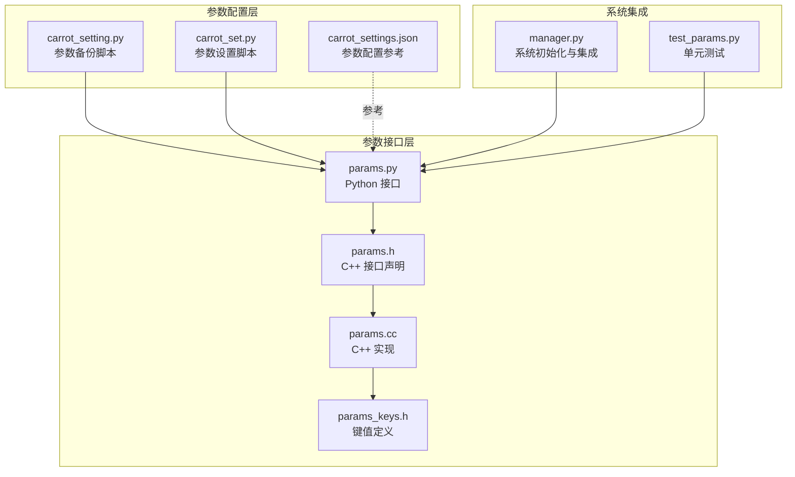
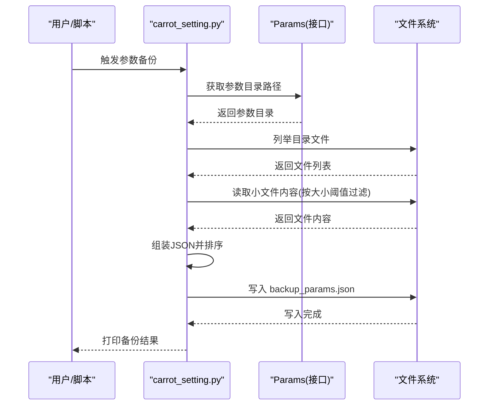
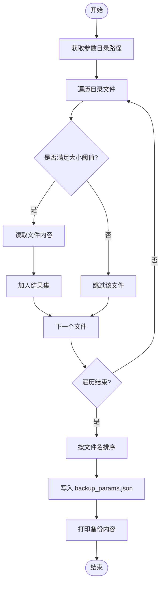
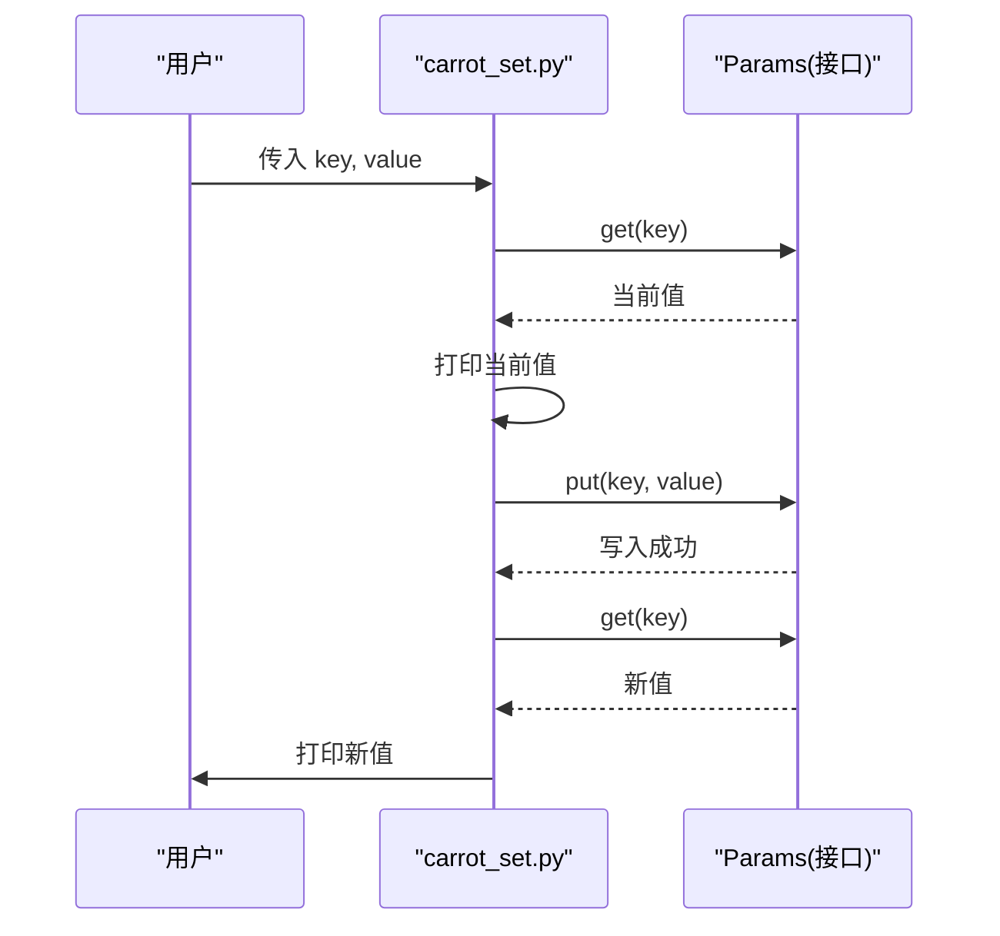
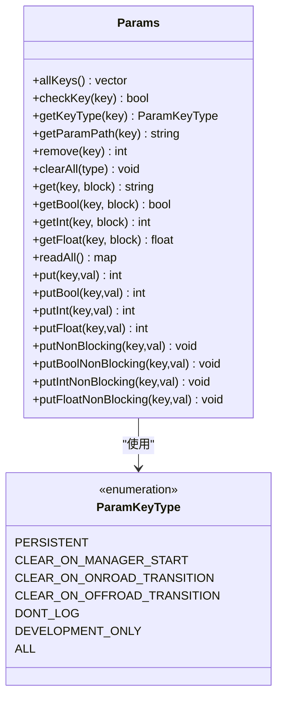
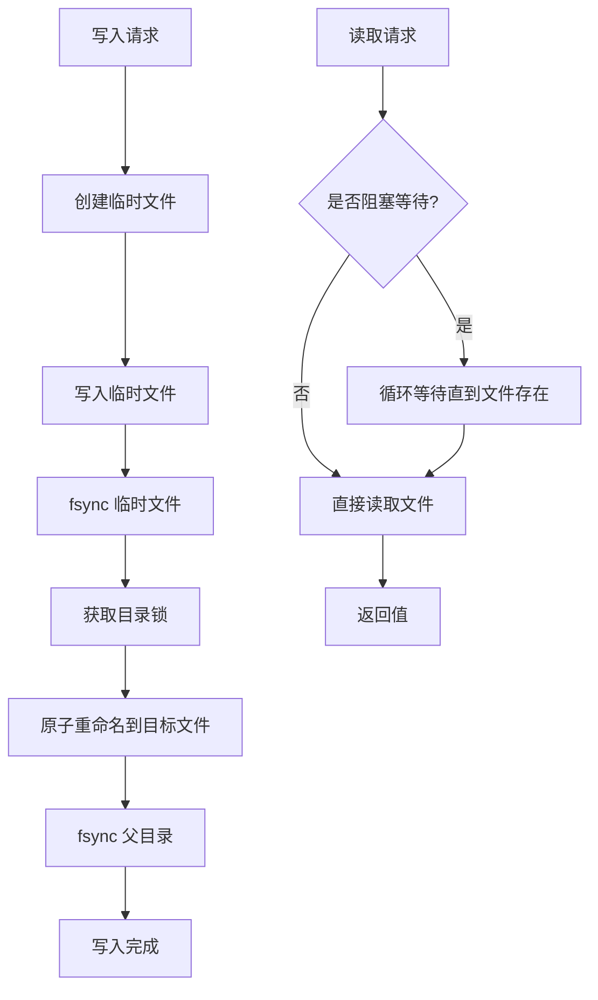
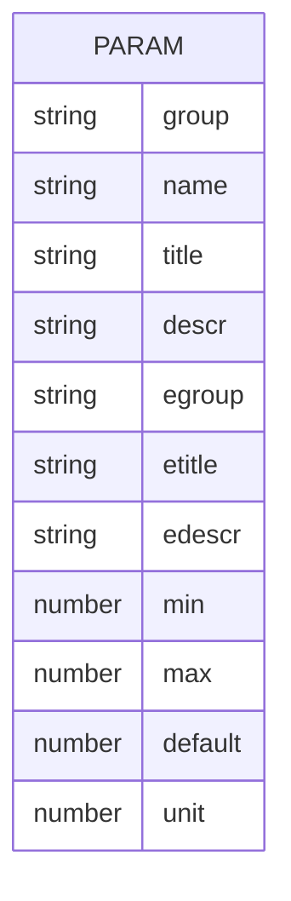
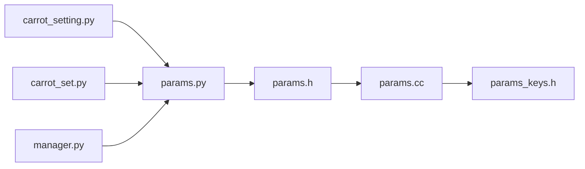

# 参数配置详解

<cite>
**本文档引用的文件**
- [selfdrive/carrot_setting.py](file://selfdrive/carrot_setting.py)
- [selfdrive/carrot_set.py](file://selfdrive/carrot_set.py)
- [selfdrive/carrot_settings.json](file://selfdrive/carrot_settings.json)
- [common/params.py](file://common/params.py)
- [common/params.h](file://common/params.h)
- [common/params.cc](file://common/params.cc)
- [common/params_keys.h](file://common/params_keys.h)
- [system/manager/manager.py](file://system/manager/manager.py)
- [common/tests/test_params.py](file://common/tests/test_params.py)
</cite>

## 目录
1. [简介](#简介)
2. [项目结构](#项目结构)
3. [核心组件](#核心组件)
4. [架构总览](#架构总览)
5. [详细组件分析](#详细组件分析)
6. [依赖关系分析](#依赖关系分析)
7. [性能考量](#性能考量)
8. [故障排查指南](#故障排查指南)
9. [结论](#结论)
10. [附录](#附录)

## 简介
本文件面向参数配置系统，围绕 Carrot2 项目的参数键值定义、配置文件格式与存储机制进行深入解析，并重点阐述 carrot_setting.py 中参数备份功能的实现细节（参数读取、过滤与导出流程）。同时，文档覆盖参数数据结构与命名规范、参数文件的组织方式与路径管理、参数与系统其他组件的集成关系，以及最佳实践与常见错误规避方法。文中所有技术细节均以仓库源码为依据，配合图示帮助读者快速建立对参数系统的整体认知。

## 项目结构
参数配置相关的关键文件分布如下：
- 备份与设置脚本：selfdrive/carrot_setting.py、selfdrive/carrot_set.py
- 参数定义与键值清单：common/params_keys.h
- 参数读写接口：common/params.py、common/params.h、common/params.cc
- 参数配置参考：selfdrive/carrot_settings.json
- 系统集成点：system/manager/manager.py
- 测试用例：common/tests/test_params.py

**图表来源**
- [selfdrive/carrot_setting.py:1-28](file://selfdrive/carrot_setting.py#L1-L28)
- [selfdrive/carrot_set.py:1-15](file://selfdrive/carrot_set.py#L1-L15)
- [selfdrive/carrot_settings.json:1-200](file://selfdrive/carrot_settings.json#L1-L200)
- [common/params.py:1-19](file://common/params.py#L1-L19)
- [common/params.h:22-92](file://common/params.h#L22-L92)
- [common/params.cc:94-235](file://common/params.cc#L94-L235)
- [common/params_keys.h:6-311](file://common/params_keys.h#L6-L311)
- [system/manager/manager.py:368-374](file://system/manager/manager.py#L368-L374)
- [common/tests/test_params.py:1-110](file://common/tests/test_params.py#L1-L110)

**章节来源**
- [selfdrive/carrot_setting.py:1-28](file://selfdrive/carrot_setting.py#L1-L28)
- [selfdrive/carrot_set.py:1-15](file://selfdrive/carrot_set.py#L1-L15)
- [selfdrive/carrot_settings.json:1-200](file://selfdrive/carrot_settings.json#L1-L200)
- [common/params.py:1-19](file://common/params.py#L1-L19)
- [common/params.h:22-92](file://common/params.h#L22-L92)
- [common/params.cc:94-235](file://common/params.cc#L94-L235)
- [common/params_keys.h:6-311](file://common/params_keys.h#L6-L311)
- [system/manager/manager.py:368-374](file://system/manager/manager.py#L368-L374)
- [common/tests/test_params.py:1-110](file://common/tests/test_params.py#L1-L110)

## 核心组件
- 参数键值定义与类型：通过键值表统一声明参数名及其生命周期/清理策略等属性，确保参数在不同运行场景下的行为一致。
- 参数读写接口：提供 Python/C++ 双栈接口，支持阻塞/非阻塞读取、类型转换、批量读取与清理等能力。
- 参数备份与设置工具：提供参数目录扫描、内容读取与 JSON 导出的自动化脚本；提供命令行参数设置工具。
- 配置参考文件：集中描述参数分组、标题、描述、单位、默认值与有效范围，便于用户理解与配置。

**章节来源**
- [common/params_keys.h:6-311](file://common/params_keys.h#L6-L311)
- [common/params.py:1-19](file://common/params.py#L1-L19)
- [common/params.h:22-92](file://common/params.h#L22-L92)
- [common/params.cc:106-235](file://common/params.cc#L106-L235)
- [selfdrive/carrot_setting.py:1-28](file://selfdrive/carrot_setting.py#L1-L28)
- [selfdrive/carrot_set.py:1-15](file://selfdrive/carrot_set.py#L1-L15)
- [selfdrive/carrot_settings.json:1-200](file://selfdrive/carrot_settings.json#L1-L200)

## 架构总览
参数系统采用“键值定义 + 文件存储 + 接口访问”的分层架构。键值定义位于 C++ 头文件中，运行时由 Python 包装器暴露给上层应用；参数值以文件形式存放在参数目录下，路径由环境变量与前缀组合决定；系统组件通过统一接口读写参数，保证一致性与可靠性。

**图表来源**
- [selfdrive/carrot_setting.py:6-27](file://selfdrive/carrot_setting.py#L6-L27)
- [common/params.h:33-35](file://common/params.h#L33-L35)
- [common/params.cc:170-196](file://common/params.cc#L170-L196)

**章节来源**
- [selfdrive/carrot_setting.py:1-28](file://selfdrive/carrot_setting.py#L1-L28)
- [common/params.h:33-35](file://common/params.h#L33-L35)
- [common/params.cc:170-196](file://common/params.cc#L170-L196)

## 详细组件分析

### 参数备份脚本 carrot_setting.py
该脚本负责从参数目录读取参数文件，过滤小文件，组装为 JSON 并导出到 backup_params.json，最后打印备份结果。其关键流程如下：

- 获取参数目录路径：通过接口获取参数根路径，拼接输出文件路径。
- 遍历目录：列出参数目录下所有文件，过滤空文件或超小文件（以字节大小为阈值）。
- 读取内容：逐个读取文件内容，编码处理后加入结果集。
- 排序与导出：按文件名排序，写入 JSON 文件。
- 输出结果：读取并打印备份文件内容。

**图表来源**
- [selfdrive/carrot_setting.py:12-27](file://selfdrive/carrot_setting.py#L12-L27)

**章节来源**
- [selfdrive/carrot_setting.py:1-28](file://selfdrive/carrot_setting.py#L1-L28)

### 参数设置脚本 carrot_set.py
该脚本提供命令行参数设置能力，支持传入键与值，打印当前值与新值，便于快速验证与调试。

- 解析参数：从命令行读取键与值。
- 查询当前值：调用接口查询当前值并打印。
- 写入新值：调用接口写入新值。
- 验证写入：再次查询并打印新值。

**图表来源**
- [selfdrive/carrot_set.py:5-11](file://selfdrive/carrot_set.py#L5-L11)
- [common/params.py:10-18](file://common/params.py#L10-L18)

**章节来源**
- [selfdrive/carrot_set.py:1-15](file://selfdrive/carrot_set.py#L1-L15)
- [common/params.py:10-18](file://common/params.py#L10-L18)

### 参数键值定义与类型
参数键值在头文件中集中定义，包含键名与其属性（如生命周期、是否记录日志、开发模式限制等）。这些键值被参数接口层使用，确保参数在不同运行阶段的行为符合预期。

- 键值属性枚举：定义了持久化、启动清理、道路/非道路切换清理、不记录日志、仅开发模式等类型。
- 键值表：包含大量参数键，涵盖导航、驾驶模式、按钮设置、纵向/横向控制等子系统。
- Carrot 特定键：包含与 Carrot2 功能相关的键，如纵向个性、巡航控制、转向与速度控制等。

**图表来源**
- [common/params.h:12-20](file://common/params.h#L12-L20)
- [common/params.h:22-92](file://common/params.h#L22-L92)

**章节来源**
- [common/params_keys.h:6-311](file://common/params_keys.h#L6-L311)
- [common/params.h:12-92](file://common/params.h#L12-L92)

### 参数读写接口与实现
- Python 接口：封装 C++ Params 类，提供便捷的 get/put 方法与命令行入口。
- C++ 接口：定义键类型、路径生成、读写与清理等核心方法。
- 实现要点：
  - 路径生成：根据环境变量与前缀生成参数目录路径。
  - 写入原子性：临时文件 + fsync + 原子重命名，确保写入安全。
  - 清理策略：按键类型批量删除，支持清理未注册文件。
  - 阻塞/非阻塞：支持阻塞读取等待与异步写入队列。

**图表来源**
- [common/params.cc:122-158](file://common/params.cc#L122-L158)
- [common/params.cc:170-190](file://common/params.cc#L170-L190)

**章节来源**
- [common/params.py:1-19](file://common/params.py#L1-L19)
- [common/params.h:22-92](file://common/params.h#L22-L92)
- [common/params.cc:94-235](file://common/params.cc#L94-L235)

### 参数配置参考 carrot_settings.json
该文件以 JSON 形式描述参数的分组、名称、标题、描述、英文对照、单位、默认值与有效范围，是用户配置参数的重要参考。例如：
- 分组与名称：用于界面显示与分类。
- 标题与描述：中英文双语说明参数含义与影响。
- 单位与默认值：提供数值缩放与初始值。
- 有效范围：限定参数可接受的最小/最大值。

**图表来源**
- [selfdrive/carrot_settings.json:1-200](file://selfdrive/carrot_settings.json#L1-L200)

**章节来源**
- [selfdrive/carrot_settings.json:1-200](file://selfdrive/carrot_settings.json#L1-L200)

### 系统集成点
- 管理器初始化：在系统启动时，管理器会向参数目录写入多个品牌/车型支持文件，确保参数目录存在且内容最新。
- 参数路径：通过接口获取参数目录名称，用于复制/迁移等操作。

**章节来源**
- [system/manager/manager.py:368-374](file://system/manager/manager.py#L368-L374)
- [system/manager/helpers.py:55-57](file://system/manager/helpers.py#L55-L57)

## 依赖关系分析
参数系统各组件之间的依赖关系如下：
- carrot_setting.py 依赖 Params 接口以获取参数目录路径与读取文件。
- carrot_set.py 依赖 Params 接口以读取/写入参数。
- Params 接口由 Python 包装器暴露，底层实现位于 C++。
- C++ 实现依赖键值表与路径工具，确保参数目录存在并按约定生成路径。
- 系统组件（如管理器）通过参数接口写入/读取参数，形成闭环。

**图表来源**
- [selfdrive/carrot_setting.py](file://selfdrive/carrot_setting.py#L4)
- [selfdrive/carrot_set.py](file://selfdrive/carrot_set.py#L3)
- [common/params.py](file://common/params.py#L1)
- [common/params.h:22-92](file://common/params.h#L22-L92)
- [common/params.cc:94-235](file://common/params.cc#L94-L235)
- [common/params_keys.h:6-311](file://common/params_keys.h#L6-L311)
- [system/manager/manager.py:368-374](file://system/manager/manager.py#L368-L374)

**章节来源**
- [selfdrive/carrot_setting.py:1-28](file://selfdrive/carrot_setting.py#L1-L28)
- [selfdrive/carrot_set.py:1-15](file://selfdrive/carrot_set.py#L1-L15)
- [common/params.py:1-19](file://common/params.py#L1-L19)
- [common/params.h:22-92](file://common/params.h#L22-L92)
- [common/params.cc:94-235](file://common/params.cc#L94-L235)
- [common/params_keys.h:6-311](file://common/params_keys.h#L6-L311)
- [system/manager/manager.py:368-374](file://system/manager/manager.py#L368-L374)

## 性能考量
- 写入原子性：通过临时文件 + 原子重命名 + fsync，确保写入可靠性，但可能带来额外的磁盘 IO 开销。
- 非阻塞写入：异步写入队列减少主线程阻塞，适合高频写入场景。
- 目录锁：写入过程中对参数目录加锁，避免并发写入导致的竞态。
- 过滤策略：备份脚本对小文件进行过滤，减少无效读取与 JSON 数据量。

[本节为通用性能讨论，无需具体文件分析]

## 故障排查指南
- 参数不存在：当访问未知键时抛出异常，需确认键是否在键值表中定义。
- 写入失败：检查磁盘空间、权限与目录锁状态；必要时重试或重启进程。
- 阻塞读取无响应：确认目标文件是否存在，或取消阻塞模式。
- 备份结果为空：检查参数目录是否存在、是否有足够权限读取，以及小文件阈值是否过高。
- 清理策略误删：确认键类型与清理时机，避免误删持久化参数。

**章节来源**
- [common/tests/test_params.py:51-63](file://common/tests/test_params.py#L51-L63)
- [common/params.cc:122-158](file://common/params.cc#L122-L158)
- [common/params.cc:170-190](file://common/params.cc#L170-L190)
- [selfdrive/carrot_setting.py:14-20](file://selfdrive/carrot_setting.py#L14-L20)

## 结论
参数配置系统通过清晰的键值定义、可靠的读写接口与完善的生命周期管理，为 Carrot2 的各项功能提供了稳定支撑。备份脚本与设置脚本进一步提升了参数管理的便利性与可观测性。遵循命名规范、合理选择键类型与清理策略、结合测试用例进行验证，是保障参数系统稳定运行的关键。

[本节为总结性内容，无需具体文件分析]

## 附录

### 参数键值命名规范
- 建议使用清晰的英文标识，便于跨语言与国际化。
- 使用前缀区分模块（如 LONG、LAT、BUTN、CRUISE 等），提升可读性与维护性。
- 对于 Carrot 特定参数，建议以 Carrot 前缀或明确分组标识，避免与其他模块冲突。

[本节为通用规范说明，无需具体文件分析]

### 参数文件组织与路径管理
- 参数目录路径由环境变量与前缀组合生成，可通过接口获取。
- 备份脚本将参数目录下的小文件内容导出为 JSON，便于离线备份与审计。
- 系统组件在启动时向参数目录写入品牌/车型支持文件，确保参数目录完整性。

**章节来源**
- [common/params.h:33-35](file://common/params.h#L33-L35)
- [system/manager/manager.py:368-374](file://system/manager/manager.py#L368-L374)
- [selfdrive/carrot_setting.py:6-8](file://selfdrive/carrot_setting.py#L6-L8)

### 可用参数选项与默认值示例
以下参数来自配置参考文件，展示了参数分组、名称、默认值与有效范围的典型结构（示例字段）：
- 分组：如“纵向控制”、“横向控制”、“按钮设置”等。
- 名称：参数键名，如 CarrotCruiseDecel、AutoCurveSpeedFactor 等。
- 默认值与范围：如默认值、最小/最大值、单位等。
- 描述：中英文对照说明参数作用与影响。

**章节来源**
- [selfdrive/carrot_settings.json:1-200](file://selfdrive/carrot_settings.json#L1-L200)

### 最佳实践与常见错误规避
- 在修改参数前先备份：使用备份脚本生成 JSON 备份，便于回滚。
- 使用设置脚本验证：通过命令行设置与读取，快速验证参数生效。
- 遵循键类型与清理策略：避免将需要持久化的参数设置为启动即清空类型。
- 控制写入频率：高频写入优先考虑非阻塞写入，降低主线程压力。
- 注意小文件阈值：备份脚本对小文件进行过滤，确保备份效率与准确性。

**章节来源**
- [selfdrive/carrot_setting.py:12-20](file://selfdrive/carrot_setting.py#L12-L20)
- [selfdrive/carrot_set.py:5-11](file://selfdrive/carrot_set.py#L5-L11)
- [common/params.cc:219-234](file://common/params.cc#L219-L234)