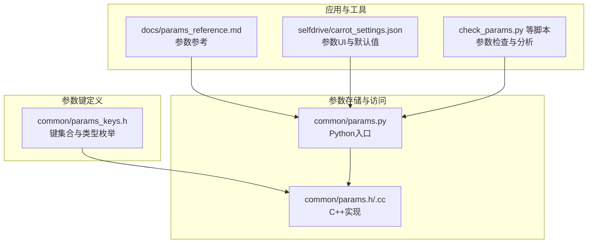
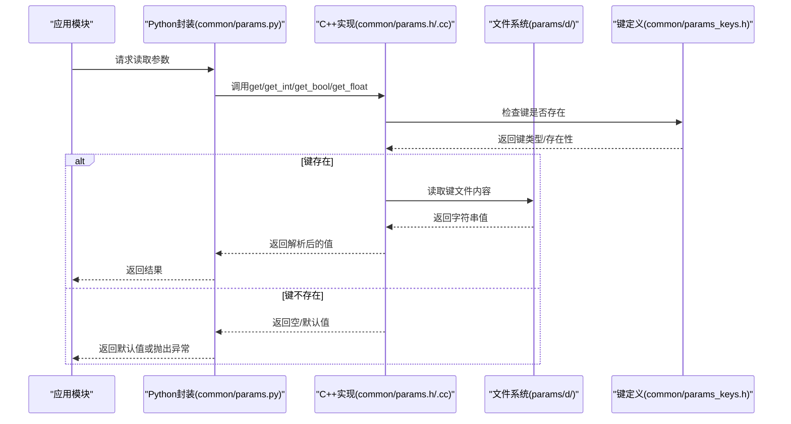
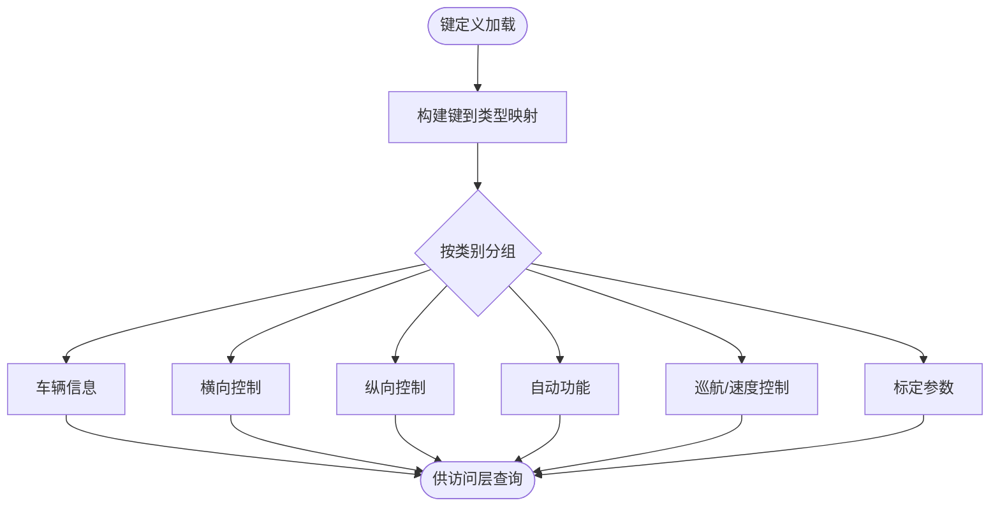
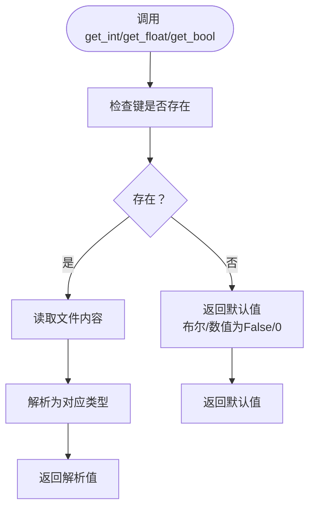
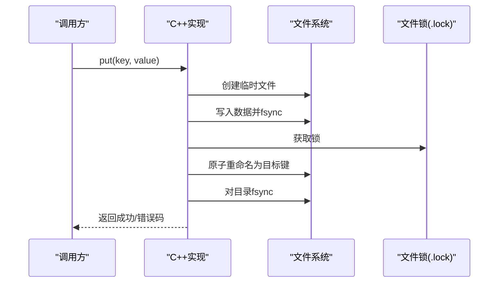
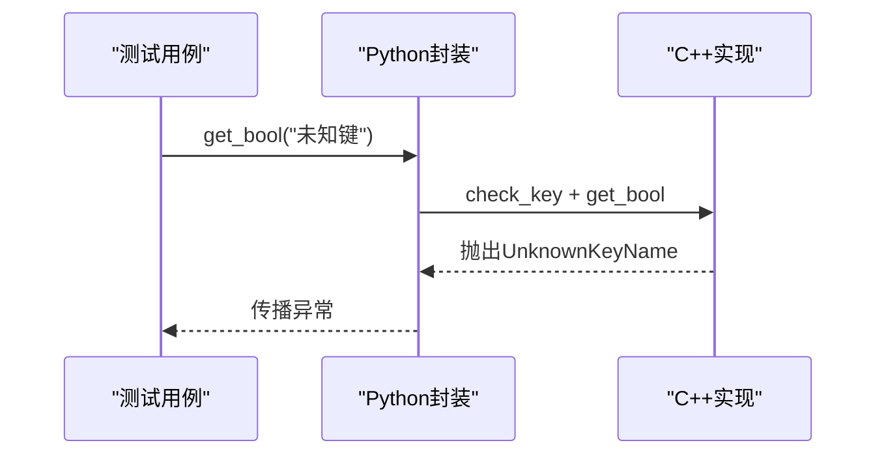
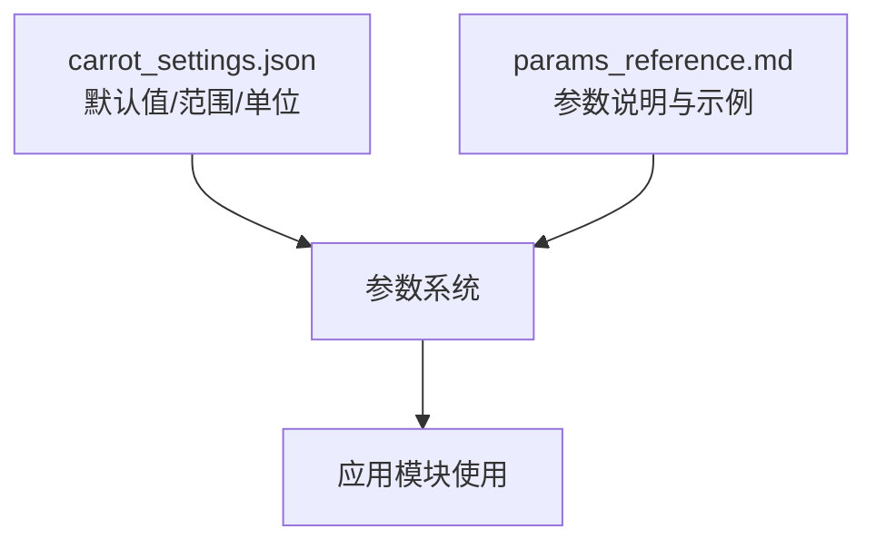
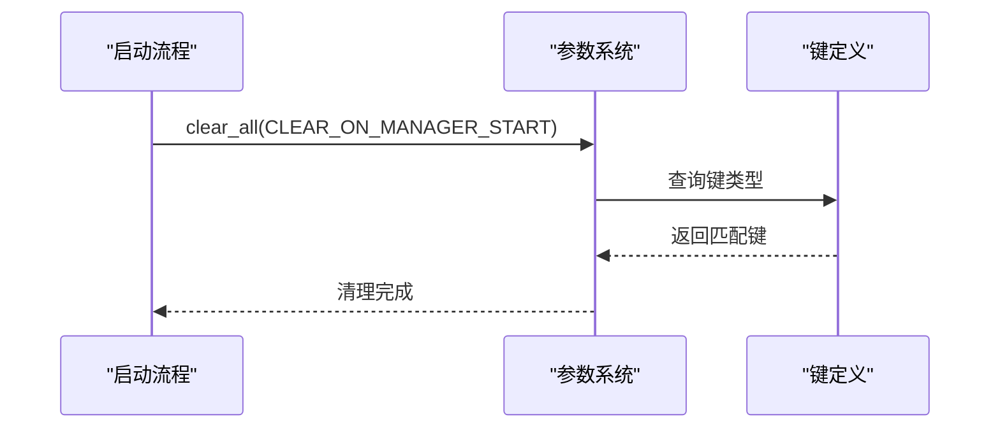

# 参数验证与默认值

<cite>
**本文引用的文件**
- [common/params.h](file://common/params.h)
- [common/params.cc](file://common/params.cc)
- [common/params.py](file://common/params.py)
- [common/params_keys.h](file://common/params_keys.h)
- [common/tests/test_params.py](file://common/tests/test_params.py)
- [docs/params_reference.md](file://docs/params_reference.md)
- [selfdrive/carrot_settings.json](file://selfdrive/carrot_settings.json)
- [check_params.py](file://check_params.py)
- [AGENTS.md](file://AGENTS.md)
- [check_mode_seg12.py](file://check_mode_seg12.py)
- [check_speed_mode.py](file://check_speed_mode.py)
- [check_speed_mode_error.py](file://check_speed_mode_error.py)
</cite>

## 目录
1. [简介](#简介)
2. [项目结构](#项目结构)
3. [核心组件](#核心组件)
4. [架构总览](#架构总览)
5. [详细组件分析](#详细组件分析)
6. [依赖分析](#依赖分析)
7. [性能考虑](#性能考虑)
8. [故障排查指南](#故障排查指南)
9. [结论](#结论)
10. [附录](#附录)

## 简介
本文件聚焦于参数验证与默认值管理机制，覆盖以下方面：
- 参数验证机制：键存在性检查、类型转换与默认值策略、阻塞读取与并发安全。
- 默认值应用：缺失键时的回退逻辑（数值/布尔默认为0或False）。
- 规则与约束：参数键集合、生命周期清理策略（如启动清空）、开发专用参数。
- 参数缺失处理：当键不存在时的行为与异常抛出策略。
- 启动集成：参数在系统启动阶段的加载与清理流程。
- 诊断与修复：常见配置错误的定位与修复方法。

## 项目结构
参数系统由三层组成：
- 键定义层：集中声明所有可用参数键及其生命周期属性。
- 存储与访问层：提供线程安全的读写接口、阻塞读取、批量读取与清理。
- 应用层：业务模块通过统一接口读取参数并进行控制逻辑决策。

**图表来源**
- [common/params_keys.h:6-311](file://common/params_keys.h#L6-L311)
- [common/params.h:22-54](file://common/params.h#L22-L54)
- [common/params.cc:122-148](file://common/params.cc#L122-L148)
- [common/params.py:1-19](file://common/params.py#L1-L19)
- [docs/params_reference.md:1-365](file://docs/params_reference.md#L1-L365)
- [selfdrive/carrot_settings.json:1-800](file://selfdrive/carrot_settings.json#L1-L800)
- [check_params.py:1-69](file://check_params.py#L1-L69)

**章节来源**
- [common/params_keys.h:6-311](file://common/params_keys.h#L6-L311)
- [common/params.h:22-54](file://common/params.h#L22-L54)
- [common/params.cc:122-148](file://common/params.cc#L122-L148)
- [common/params.py:1-19](file://common/params.py#L1-L19)
- [docs/params_reference.md:1-365](file://docs/params_reference.md#L1-L365)
- [selfdrive/carrot_settings.json:1-800](file://selfdrive/carrot_settings.json#L1-L800)
- [check_params.py:1-69](file://check_params.py#L1-L69)

## 核心组件
- 参数键集合与类型
  - 键集合在头文件中集中声明，包含参数名到生命周期类型的映射。
  - 生命周期类型用于控制参数在特定事件（如启动、上下线等）是否被清理。
- 参数访问类
  - 提供键存在性检查、按类型读取（字符串、布尔、整数、浮点）、阻塞读取、批量读取、清理等能力。
  - 写入采用原子落盘流程，确保持久化一致性。
- Python封装
  - 提供简单命令行与程序入口，支持读取与写入参数，并在键未知时抛出异常。

**章节来源**
- [common/params_keys.h:6-311](file://common/params_keys.h#L6-L311)
- [common/params.h:22-54](file://common/params.h#L22-L54)
- [common/params.cc:122-148](file://common/params.cc#L122-L148)
- [common/params.py:1-19](file://common/params.py#L1-L19)

## 架构总览
参数系统围绕“键定义—存储—访问—应用”展开，形成如下交互：

**图表来源**
- [common/params.py:1-19](file://common/params.py#L1-L19)
- [common/params.h:42-53](file://common/params.h#L42-L53)
- [common/params.cc:114-120](file://common/params.cc#L114-L120)
- [common/params_keys.h:6-311](file://common/params_keys.h#L6-L311)

## 详细组件分析

### 组件A：参数键定义与生命周期
- 键集合
  - 以键名到生命周期标志位的映射形式组织，涵盖车辆信息、横向/纵向控制、自动功能、巡航/速度控制、标定参数等类别。
- 生命周期类型
  - 持久化（PERSISTENT）
  - 启动清空（CLEAR_ON_MANAGER_START）
  - 上路/下路切换清空（CLEAR_ON_ONROAD_TRANSITION、CLEAR_ON_OFFROAD_TRANSITION）
  - 不记录日志（DONT_LOG）
  - 开发专用（DEVELOPMENT_ONLY）

**图表来源**
- [common/params_keys.h:6-311](file://common/params_keys.h#L6-L311)

**章节来源**
- [common/params_keys.h:6-311](file://common/params_keys.h#L6-L311)

### 组件B：参数读取与默认值策略
- 类型转换与默认值
  - 字符串：直接返回文件内容。
  - 布尔：字符串"1"视为True，否则为False；缺失键返回False。
  - 整数/浮点：缺失键返回0或0.0；非数字字符串将触发转换异常。
- 阻塞读取
  - 支持阻塞式读取，等待其他写入完成后再返回最新值。
- 批量读取
  - 提供一次性读取全部键值的能力，便于诊断与导出。

**图表来源**
- [common/params.h:42-53](file://common/params.h#L42-L53)

**章节来源**
- [common/params.h:42-53](file://common/params.h#L42-L53)

### 组件C：参数写入与持久化
- 原子写入流程
  - 临时文件写入 → fsync → 加锁 → 原子重命名 → 对目录fsync，确保落盘一致性。
- 清理策略
  - 按生命周期类型批量清理，例如启动时清空CLEAR_ON_MANAGER_START键。

**图表来源**
- [common/params.cc:122-148](file://common/params.cc#L122-L148)

**章节来源**
- [common/params.cc:122-148](file://common/params.cc#L122-L148)

### 组件D：参数验证与异常处理
- 键存在性验证
  - 读取/写入前先检查键是否在键表中，不在则抛出UnknownKeyName异常。
- 测试覆盖
  - 包含键不存在时的异常路径、阻塞读取、布尔值兼容（字符串"1"/"0"）等场景。

**图表来源**
- [common/params.py:10-11](file://common/params.py#L10-L11)
- [common/tests/test_params.py:51-62](file://common/tests/test_params.py#L51-L62)

**章节来源**
- [common/params.py:10-11](file://common/params.py#L10-L11)
- [common/tests/test_params.py:51-62](file://common/tests/test_params.py#L51-L62)

### 组件E：参数默认值与范围约束（UI与文档）
- UI默认值来源
  - 参数UI配置文件提供每个参数的默认值、最小值、最大值与单位，便于用户直观设置。
- 文档参考
  - 参数参考文档给出常用参数的类型、说明与示例，辅助日志分析与参数调优。

**图表来源**
- [selfdrive/carrot_settings.json:1-800](file://selfdrive/carrot_settings.json#L1-L800)
- [docs/params_reference.md:1-365](file://docs/params_reference.md#L1-L365)

**章节来源**
- [selfdrive/carrot_settings.json:1-800](file://selfdrive/carrot_settings.json#L1-L800)
- [docs/params_reference.md:1-365](file://docs/params_reference.md#L1-L365)

### 组件F：参数缺失与回退策略
- 缺失键回退
  - 读取不存在的键时，布尔/数值类型返回False/0，字符串返回空。
- 异常策略
  - 当键不在已知集合中时，抛出UnknownKeyName异常，避免误用未注册键。
- 实践建议
  - 在业务逻辑中对关键参数进行存在性检查与范围校验，必要时提供显式的默认分支。

**章节来源**
- [common/params.h:42-53](file://common/params.h#L42-L53)
- [common/params.py:10-11](file://common/params.py#L10-L11)
- [common/tests/test_params.py:64-67](file://common/tests/test_params.py#L64-L67)

### 组件G：参数与系统启动集成
- 启动清空
  - 启动时按生命周期类型清理相关键，保证新会话从干净状态开始。
- 日志分析集成
  - 分析脚本通过参数系统读取当前配置，结合日志进行行为解释与对比。

**图表来源**
- [common/tests/test_params.py:22-35](file://common/tests/test_params.py#L22-L35)

**章节来源**
- [common/tests/test_params.py:22-35](file://common/tests/test_params.py#L22-L35)

## 依赖分析
- 组件耦合
  - 访问层依赖键定义层；应用层仅通过访问层间接依赖键定义。
- 外部依赖
  - 文件系统与锁机制保障写入一致性；日志模块用于调试输出。
- 潜在风险
  - 键名拼写错误会导致UnknownKeyName异常；数值解析失败会触发异常。

**图表来源**
- [common/params_keys.h:6-311](file://common/params_keys.h#L6-L311)
- [common/params.h:22-54](file://common/params.h#L22-L54)
- [common/params.cc:122-148](file://common/params.cc#L122-L148)
- [common/params.py:1-19](file://common/params.py#L1-L19)

**章节来源**
- [common/params_keys.h:6-311](file://common/params_keys.h#L6-L311)
- [common/params.h:22-54](file://common/params.h#L22-L54)
- [common/params.cc:122-148](file://common/params.cc#L122-L148)
- [common/params.py:1-19](file://common/params.py#L1-L19)

## 性能考虑
- 读取路径
  - 单次键读取为O(1)查找，文件IO开销取决于磁盘性能与锁竞争。
- 写入路径
  - 原子写入涉及多次fsync与重命名，建议批量写入或合并更新以减少IO次数。
- 阻塞读取
  - 在高并发写入场景下，阻塞读取可避免脏读，但可能引入等待延迟。

[本节为通用指导，不直接分析具体文件]

## 故障排查指南
- 常见问题
  - 未知键：读取/写入未知键会抛出UnknownKeyName异常。请确认键名是否存在于键表中。
  - 数值解析失败：非数字字符串导致转换异常。请确保写入值为合法数字或布尔字符串。
  - 启动后参数丢失：某些键在启动时会被清空。若需跨会话保留，请使用PERSISTENT类型。
- 诊断步骤
  - 使用参数脚本列出当前参数与默认值，核对键名与取值范围。
  - 在日志分析中读取当前参数配置，结合控制行为进行对比。
- 修复建议
  - 修正键名拼写或添加到键表。
  - 将非法值调整至默认值/范围约束之内。
  - 如需跨启动保留，调整键类型为PERSISTENT。

**章节来源**
- [common/params.py:10-11](file://common/params.py#L10-L11)
- [common/tests/test_params.py:51-62](file://common/tests/test_params.py#L51-L62)
- [docs/params_reference.md:1-365](file://docs/params_reference.md#L1-L365)
- [selfdrive/carrot_settings.json:1-800](file://selfdrive/carrot_settings.json#L1-L800)

## 结论
参数验证与默认值管理通过“键定义—存储—访问—应用”的清晰分层实现：
- 键存在性检查与生命周期清理确保系统在不同状态下保持一致的参数基线。
- 类型转换与默认值策略为业务模块提供稳定的回退保障。
- 原子写入与阻塞读取提升可靠性与一致性。
- UI与文档提供了明确的默认值与范围约束，便于用户与开发者正确配置与排错。

[本节为总结性内容，不直接分析具体文件]

## 附录

### A. 参数键与生命周期一览（节选）
- 车辆信息与标定
  - CarName、CarParamsPersistent、CalibrationParams等，多为PERSISTENT。
- 控制参数
  - LateralTorqueKpV、LongitudinalPersonality等，多为PERSISTENT。
- 自动功能
  - AutoEngage、AutoCruiseControl等，多为PERSISTENT。
- 启动清空
  - CarParams、ControlsReady、CurrentRoute等，启动时清空。

**章节来源**
- [common/params_keys.h:6-311](file://common/params_keys.h#L6-L311)

### B. 关键参数读取示例（来自实际脚本）
- 读取速度来源参数
  - 通过参数系统读取SpeedFromPCM，用于判断速度来源逻辑。
- 日志分析集成
  - 在日志分析脚本中读取当前参数配置，结合消息流进行行为解释。

**章节来源**
- [check_mode_seg12.py:10-10](file://check_mode_seg12.py#L10-L10)
- [check_speed_mode.py:10-10](file://check_speed_mode.py#L10-L10)
- [check_speed_mode_error.py:9-9](file://check_speed_mode_error.py#L9-L9)
- [AGENTS.md:432-442](file://AGENTS.md#L432-L442)

### C. 参数默认值与范围（来自UI与文档）
- UI默认值
  - 每个参数提供默认值、最小值、最大值与单位，便于快速设置。
- 文档参考
  - 参数参考文档给出类型、说明与示例，辅助调参与日志分析。

**章节来源**
- [selfdrive/carrot_settings.json:1-800](file://selfdrive/carrot_settings.json#L1-L800)
- [docs/params_reference.md:1-365](file://docs/params_reference.md#L1-L365)