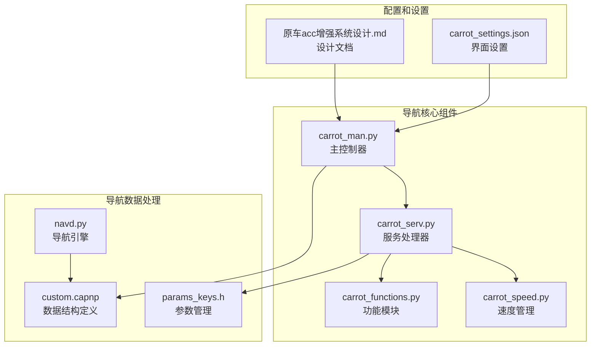
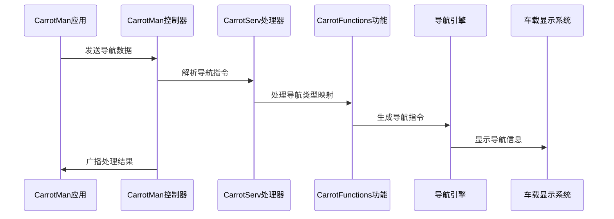
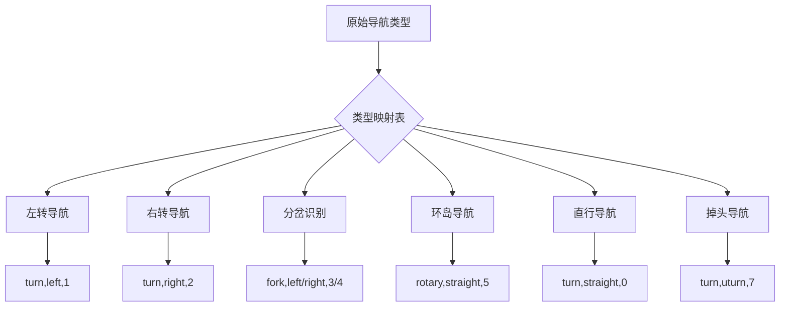
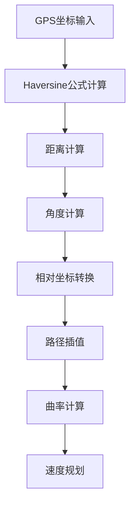
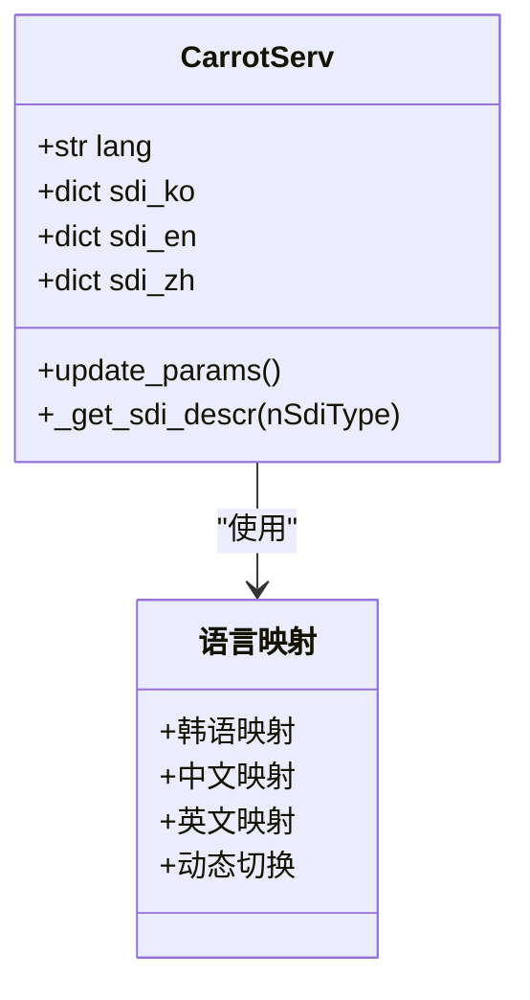
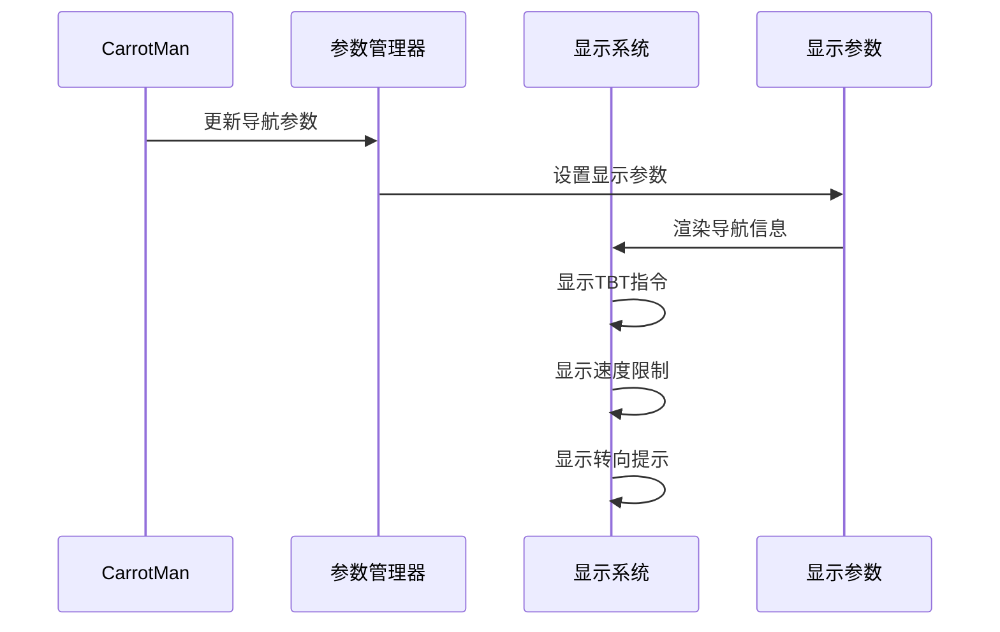
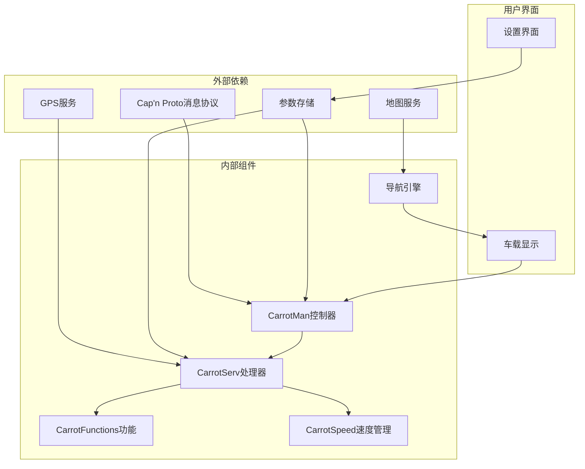

# TBT导航集成

<cite>
**本文档引用的文件**
- [custom.capnp](file://cereal/custom.capnp)
- [carrot_man.py](file://selfdrive/carrot/carrot_man.py)
- [carrot_serv.py](file://selfdrive/carrot/carrot_serv.py)
- [carrot_functions.py](file://selfdrive/carrot/carrot_functions.py)
- [carrot_speed.py](file://selfdrive/carrot/carrot_speed.py)
- [navd.py](file://selfdrive/navd/navd.py)
- [carrot_settings.json](file://selfdrive/carrot_settings.json)
- [params_keys.h](file://common/params_keys.h)
- [原车acc增强系统设计.md](file://原车acc增强系统设计.md)
</cite>

## 目录
1. [简介](#简介)
2. [项目结构](#项目结构)
3. [核心组件](#核心组件)
4. [架构概览](#架构概览)
5. [详细组件分析](#详细组件分析)
6. [依赖关系分析](#依赖关系分析)
7. [性能考虑](#性能考虑)
8. [故障排除指南](#故障排除指南)
9. [结论](#结论)

## 简介

TBT（Turn-by-Turn）导航集成功能是openpilot系统中的重要组成部分，负责处理来自CarrotMan Android导航应用的导航数据，并将其转换为车载控制系统可以理解和执行的导航指令。该功能实现了完整的导航数据获取、解析、转换和显示机制，包括导航指令格式转换、语义理解、导航类型映射、距离和角度计算、与车载显示系统的集成以及多语言支持。

本系统采用分布式架构设计，通过消息总线实现各组件间的解耦通信，支持实时导航数据处理和多语言本地化功能。系统能够处理各种复杂的导航场景，包括弯道引导、分岔识别、环岛导航等，并提供智能的速度控制和转向提示生成功能。

## 项目结构

TBT导航集成功能主要分布在以下目录和文件中：

**图表来源**
- [carrot_man.py:204-255](file://selfdrive/carrot/carrot_man.py#L204-L255)
- [carrot_serv.py:83-200](file://selfdrive/carrot/carrot_serv.py#L83-L200)
- [custom.capnp:14-48](file://cereal/custom.capnp#L14-L48)

**章节来源**
- [carrot_man.py:1-100](file://selfdrive/carrot/carrot_man.py#L1-L100)
- [carrot_serv.py:1-100](file://selfdrive/carrot/carrot_serv.py#L1-L100)

## 核心组件

### CarrotMan 主控制器

CarrotMan类是TBT导航系统的核心控制器，负责协调各个子系统的运行和数据交换。其主要职责包括：

- **消息处理**：接收和处理来自CarrotMan Android应用的导航数据
- **数据广播**：将处理后的导航信息广播给车载系统
- **路径规划**：计算最优行驶路径和速度曲线
- **实时监控**：监控导航状态并进行相应的调整

### CarrotServ 服务处理器

CarrotServ类专门处理导航服务相关的功能，包括：

- **导航类型映射**：将原始导航类型转换为系统可识别的格式
- **多语言支持**：提供韩语、中文、英语的导航文本本地化
- **GPS数据处理**：处理GPS坐标和航向角数据
- **速度限制管理**：管理各种速度限制和控制模式

### 导航数据结构定义

通过Cap'n Proto协议定义的CarrotMan消息结构，包含以下关键字段：

| 字段名 | 类型 | 单位 | 说明 |
|--------|------|------|------|
| activeCarrot | Int32 | - | 激活状态：0=未激活, 1=CarrotMan激活, 2=SDI激活, 3=减速激活, 4=路段激活, 5=颠簸路段, 6=限速激活 |
| xTurnInfo | Int32 | - | 转弯类型：-1=无转弯, 0=直行, 1=左转, 2=右转, 3=掉头, 4=左前方, 5=右前方, 6=环岛 |
| xDistToTurn | Int32 | 米 | 到转弯点距离 |
| vTurnSpeed | Int32 | km/h | 转弯建议速度（250表示无效/未知） |
| szTBTMainText | Text | - | TBT导航指引文本 |

**章节来源**
- [custom.capnp:14-48](file://cereal/custom.capnp#L14-L48)
- [carrot_serv.py:24-78](file://selfdrive/carrot/carrot_serv.py#L24-L78)

## 架构概览

TBT导航集成系统采用分层架构设计，实现了高度模块化的组件分离：

**图表来源**
- [carrot_man.py:342-406](file://selfdrive/carrot/carrot_man.py#L342-L406)
- [carrot_serv.py:336-402](file://selfdrive/carrot/carrot_serv.py#L336-L402)
- [navd.py:222-311](file://selfdrive/navd/navd.py#L222-L311)

系统架构的关键特点：

1. **消息驱动**：所有组件通过消息总线进行通信
2. **实时处理**：支持20Hz的数据处理频率
3. **多语言支持**：内置韩语、中文、英语本地化
4. **模块化设计**：各组件职责明确，易于维护和扩展

## 详细组件分析

### 导航类型映射系统

导航类型映射系统是TBT功能的核心组件，负责将原始导航数据转换为系统可理解的格式：

**图表来源**
- [carrot_serv.py:24-78](file://selfdrive/carrot/carrot_serv.py#L24-L78)
- [carrot_serv.py:338-396](file://selfdrive/carrot/carrot_serv.py#L338-L396)

导航类型映射表包含以下关键映射关系：

| 原始类型 | 导航类型 | 方向 | 速度限制 |
|----------|----------|------|----------|
| 12,16 | turn | left/right | 1/2 |
| 13,19 | turn | right/left | 2/1 |
| 7,6 | fork | left/right | 3/4 |
| 131-142 | rotary | slight left/right | 5 |
| 14 | turn | uturn | 7 |
| 201 | arrive | straight | 8 |

**章节来源**
- [carrot_serv.py:24-78](file://selfdrive/carrot/carrot_serv.py#L24-L78)
- [carrot_serv.py:338-396](file://selfdrive/carrot/carrot_serv.py#L338-L396)

### 距离和角度计算算法

系统实现了精确的距离和角度计算算法，用于处理GPS坐标转换和路径规划：

**图表来源**
- [carrot_man.py:63-77](file://selfdrive/carrot/carrot_man.py#L63-L77)
- [carrot_man.py:153-156](file://selfdrive/carrot/carrot_man.py#L153-L156)

关键算法实现：

1. **Haversine公式**：用于计算两点间的大圆距离
2. **最近点计算**：找到路径上距离当前位置最近的点
3. **角度计算**：基于经纬度差值计算航向角
4. **坐标转换**：将GPS坐标转换为车辆坐标系下的相对坐标

**章节来源**
- [carrot_man.py:63-77](file://selfdrive/carrot/carrot_man.py#L63-L77)
- [carrot_man.py:80-98](file://selfdrive/carrot/carrot_man.py#L80-L98)
- [carrot_man.py:153-156](file://selfdrive/carrot/carrot_man.py#L153-L156)

### 多语言支持实现

系统提供了完整的多语言支持，包括韩语、中文、英语三种语言：

**图表来源**
- [carrot_serv.py:201-237](file://selfdrive/carrot/carrot_serv.py#L201-L237)
- [carrot_serv.py:403-621](file://selfdrive/carrot/carrot_serv.py#L403-L621)

语言设置优先级：
1. LanguageSetting参数（最高优先级）
2. UI语言设置
3. 系统默认语言（英语）

**章节来源**
- [carrot_serv.py:201-237](file://selfdrive/carrot/carrot_serv.py#L201-L237)
- [carrot_serv.py:403-621](file://selfdrive/carrot/carrot_serv.py#L403-L621)

### 与车载显示系统的集成

导航数据通过多种方式与车载显示系统集成：

**图表来源**
- [carrot_man.py:583-625](file://selfdrive/carrot/carrot_man.py#L583-L625)
- [carrot_settings.json:1058-1155](file://selfdrive/carrot_settings.json#L1058-L1155)

集成的关键参数包括：
- 显示调试信息
- 显示时间信息
- 显示路径信息
- 显示设备状态
- 屏幕亮度调节

**章节来源**
- [carrot_man.py:583-625](file://selfdrive/carrot/carrot_man.py#L583-L625)
- [carrot_settings.json:1058-1155](file://selfdrive/carrot_settings.json#L1058-L1155)

## 依赖关系分析

TBT导航集成系统具有清晰的依赖关系结构：

**图表来源**
- [carrot_man.py:15-28](file://selfdrive/carrot/carrot_man.py#L15-L28)
- [carrot_serv.py:13-22](file://selfdrive/carrot/carrot_serv.py#L13-L22)
- [navd.py:11-22](file://selfdrive/navd/navd.py#L11-L22)

**章节来源**
- [carrot_man.py:15-28](file://selfdrive/carrot/carrot_man.py#L15-L28)
- [carrot_serv.py:13-22](file://selfdrive/carrot/carrot_serv.py#L13-L22)

## 性能考虑

TBT导航集成系统在设计时充分考虑了性能优化：

### 实时性能
- **处理频率**：支持20Hz的实时数据处理
- **内存管理**：使用高效的缓存机制减少重复计算
- **算法优化**：采用近似算法平衡精度和性能

### 存储优化
- **参数存储**：使用共享内存存储高频访问参数
- **数据压缩**：导航速度表采用gzip压缩存储
- **缓存策略**：实现智能缓存避免重复计算

### 网络通信
- **广播机制**：使用UDP广播减少网络开销
- **数据压缩**：导航数据采用JSON格式压缩传输
- **错误处理**：实现健壮的网络异常处理机制

## 故障排除指南

### 常见问题及解决方案

**导航数据不更新**
1. 检查CarrotMan应用连接状态
2. 验证网络配置和防火墙设置
3. 确认消息总线通信正常

**导航类型识别错误**
1. 检查导航类型映射表配置
2. 验证原始导航数据格式
3. 确认语言设置正确

**显示异常**
1. 检查显示参数设置
2. 验证车载显示系统状态
3. 确认字体和图标资源加载

**性能问题**
1. 监控系统资源使用情况
2. 检查缓存命中率
3. 优化算法参数配置

**章节来源**
- [carrot_man.py:394-406](file://selfdrive/carrot/carrot_man.py#L394-L406)
- [carrot_serv.py:647-722](file://selfdrive/carrot/carrot_serv.py#L647-L722)

## 结论

TBT导航集成功能通过精心设计的架构和算法实现了完整的导航数据处理和显示功能。系统具有以下优势：

1. **模块化设计**：清晰的组件分离便于维护和扩展
2. **实时性能**：支持高频率数据处理满足车载应用需求
3. **多语言支持**：提供完整的国际化本地化功能
4. **鲁棒性**：完善的错误处理和异常恢复机制
5. **可配置性**：丰富的参数配置满足不同应用场景

该系统为openpilot平台提供了强大的导航能力，为用户提供了准确、及时的导航信息服务。通过持续的优化和改进，系统将继续提升用户体验和安全性。