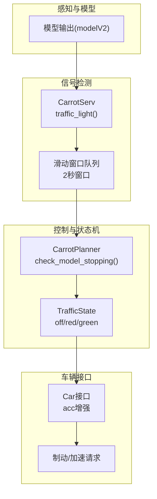
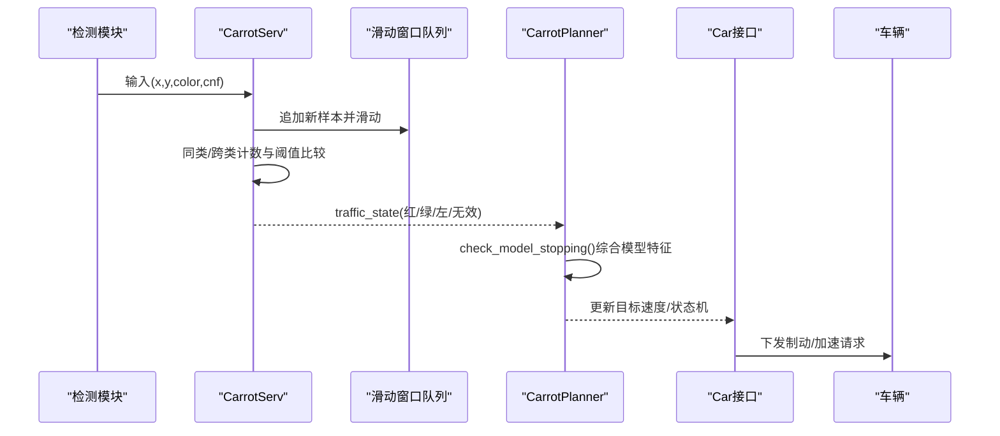
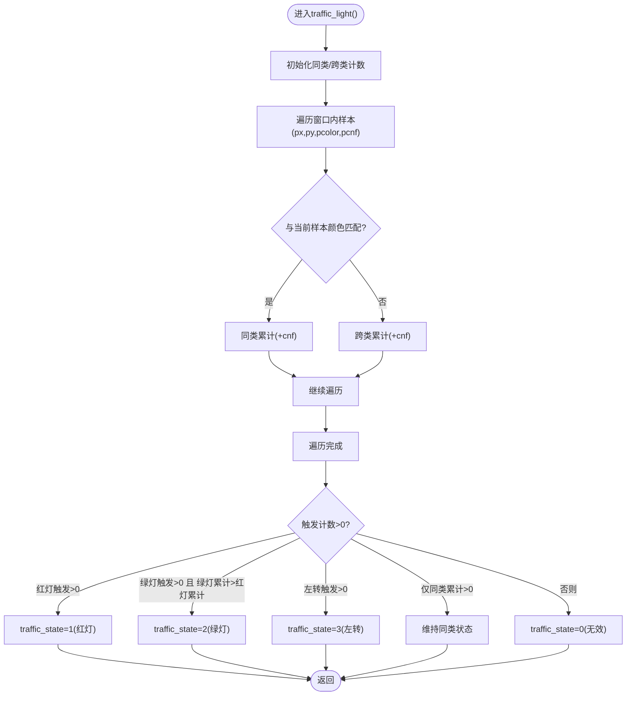
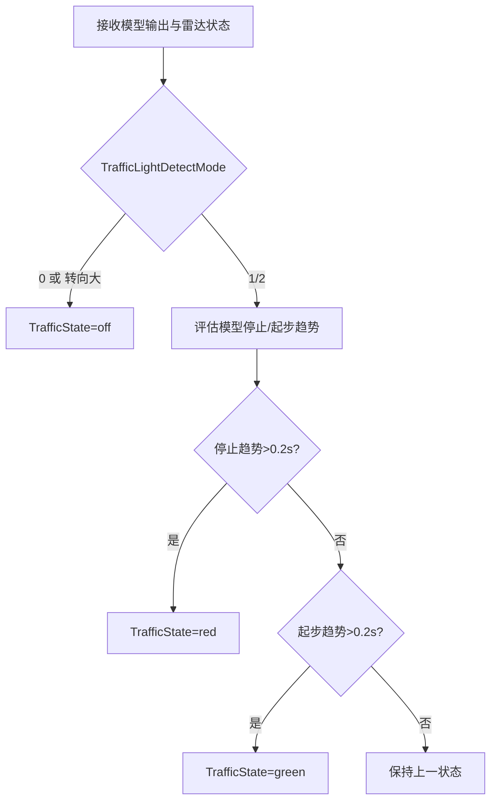
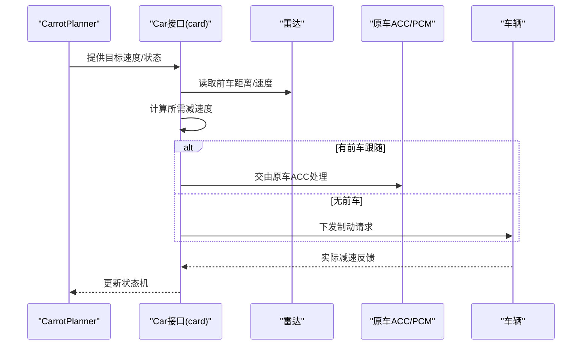
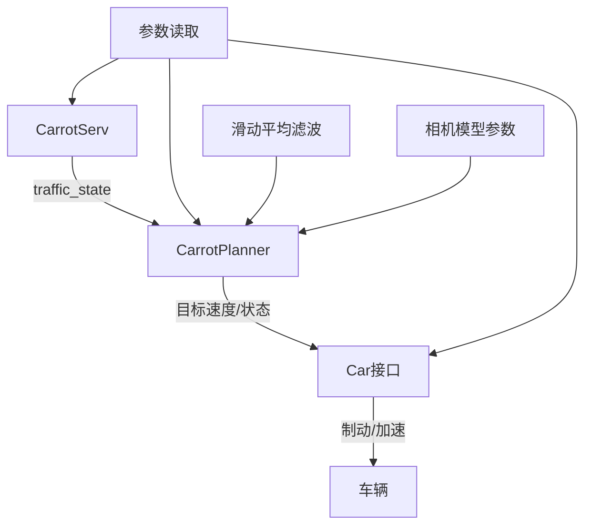

# 交通信号检测

<cite>
**本文引用的文件**
- [selfdrive/carrot/carrot_functions.py](file://selfdrive/carrot/carrot_functions.py)
- [selfdrive/carrot/carrot_serv.py](file://selfdrive/carrot/carrot_serv.py)
- [selfdrive/carrot/carrot_man.py](file://selfdrive/carrot/carrot_man.py)
- [selfdrive/car/card.py](file://selfdrive/car/card.py)
- [原车acc增强系统设计.md](file://原车acc增强系统设计.md)
- [docs/byd_radar_vehicle_control.md](file://docs/byd_radar_vehicle_control.md)
- [common/stat_live.py](file://common/stat_live.py)
- [common/transformations/model.py](file://common/transformations/model.py)
- [selfdrive/controls/lib/desire_helper.py](file://selfdrive/controls/lib/desire_helper.py)
</cite>

## 目录
1. [简介](#简介)
2. [项目结构](#项目结构)
3. [核心组件](#核心组件)
4. [架构总览](#架构总览)
5. [详细组件分析](#详细组件分析)
6. [依赖分析](#依赖分析)
7. [性能考虑](#性能考虑)
8. [故障排查指南](#故障排查指南)
9. [结论](#结论)
10. [附录](#附录)

## 简介
本技术文档围绕“交通信号检测”功能展开，聚焦于基于摄像头模型的红绿灯识别与状态判断流程，涵盖颜色识别、形状检测、置信度评估、多帧融合与误检过滤、时序处理与状态切换机制、以及与车辆制动系统的协调控制策略。文档以代码库中的实际实现为依据，提供参数配置、处理延迟与误检率控制的参考，并给出可视化图示帮助理解。

## 项目结构
交通信号检测涉及多个子系统协同：
- 模型侧：通过模型输出的位置、速度、概率等特征辅助判断
- 信号检测侧：基于carrot_serv维护的队列与置信度聚合，输出traffic_state
- 控制决策侧：carrot_functions根据traffic_state驱动纵向控制与状态机
- 车辆接口侧：card对检测结果进行融合与安全约束，下发制动请求
- 参数与工具：参数读取、移动平均滤波、相机模型参数等

图表来源
- [selfdrive/carrot/carrot_serv.py:175-317](file://selfdrive/carrot/carrot_serv.py#L175-L317)
- [selfdrive/carrot/carrot_functions.py:286-484](file://selfdrive/carrot/carrot_functions.py#L286-L484)
- [selfdrive/car/card.py:291-383](file://selfdrive/car/card.py#L291-L383)

章节来源
- [selfdrive/carrot/carrot_serv.py:175-317](file://selfdrive/carrot/carrot_serv.py#L175-L317)
- [selfdrive/carrot/carrot_functions.py:286-484](file://selfdrive/carrot/carrot_functions.py#L286-L484)
- [selfdrive/car/card.py:291-383](file://selfdrive/car/card.py#L291-L383)

## 核心组件
- CarrotServ：维护2秒滑动窗口，对输入的(x,y,color,cnf)进行聚合同类/跨类计数，输出traffic_state（红/绿/左转/无效）
- CarrotPlanner：基于模型输出的轨迹、速度、横向偏移等，结合检测模式与状态机，更新TrafficState并驱动纵向行为
- Car接口（card）：在BYD平台下，将检测结果与前车雷达、导航限速、弯道限速等融合，计算制动/加速请求
- 参数与工具：TrafficLightDetectMode、滑动平均滤波、相机模型参数等

章节来源
- [selfdrive/carrot/carrot_serv.py:175-317](file://selfdrive/carrot/carrot_serv.py#L175-L317)
- [selfdrive/carrot/carrot_functions.py:120-182](file://selfdrive/carrot/carrot_functions.py#L120-L182)
- [selfdrive/car/card.py:291-383](file://selfdrive/car/card.py#L291-L383)

## 架构总览
交通信号检测的端到端流程如下：
- 输入：来自检测模块的(x,y,color,cnf)序列
- 聚合：滑动窗口内同类/跨类累计，比较触发阈值
- 判断：根据触发与累计结果设定traffic_state
- 决策：CarrotPlanner依据traffic_state与模型特征更新纵向状态机
- 执行：Car接口在安全前提下下发制动/加速

图表来源
- [selfdrive/carrot/carrot_serv.py:268-317](file://selfdrive/carrot/carrot_serv.py#L268-L317)
- [selfdrive/carrot/carrot_functions.py:286-484](file://selfdrive/carrot/carrot_functions.py#L286-L484)
- [selfdrive/car/card.py:291-383](file://selfdrive/car/card.py#L291-L383)

## 详细组件分析

### 组件A：信号检测与状态聚合（CarrotServ）
- 滑动窗口：2秒窗口，每0.1秒推进一次，窗口长度约20项
- 聚合规则：
  - 同类触发计数（如红灯触发计数）> 0，则判定为红灯
  - 绿灯触发计数 > 0 且绿灯累计 > 红灯累计，则判定为绿灯
  - 存在左转触发计数则判定为左转
  - 若仅有同类累计，则维持该状态
  - 否则判定为无效
- 输出：traffic_state ∈ {0:无效, 1:红灯, 2:绿灯, 3:左转}

图表来源
- [selfdrive/carrot/carrot_serv.py:268-317](file://selfdrive/carrot/carrot_serv.py#L268-L317)

章节来源
- [selfdrive/carrot/carrot_serv.py:175-317](file://selfdrive/carrot/carrot_serv.py#L175-L317)

### 组件B：模型驱动的停止/起步判断（CarrotPlanner）
- 输入：模型轨迹x、速度v、横向偏移y、雷达前车信息
- 判定逻辑：
  - 基于模型预测的停止/起步趋势，结合速度与横向偏移阈值
  - 当停止趋势持续一定时间（如>0.2秒）判定为红灯；起步趋势持续一定时间（如>0.2秒）判定为绿灯
  - TrafficLightDetectMode控制检测模式：0=关闭，1=仅停止，2=停止+起步
  - 转向角度过大时关闭检测，避免误判
- 输出：TrafficState（off/red/green）

图表来源
- [selfdrive/carrot/carrot_functions.py:286-484](file://selfdrive/carrot/carrot_functions.py#L286-L484)

章节来源
- [selfdrive/carrot/carrot_functions.py:120-182](file://selfdrive/carrot/carrot_functions.py#L120-L182)
- [selfdrive/carrot/carrot_functions.py:286-484](file://selfdrive/carrot/carrot_functions.py#L286-L484)

### 组件C：与车辆制动系统的协调控制（BYD平台）
- 融合维度：
  - 交通信号状态（红/绿/左）
  - 前车雷达（距离、相对速度）
  - 导航限速/弯道限速
  - 驾驶员干预（油门/刹车/转向扭矩/转向灯）
- 制动策略：
  - 红灯且无前车接近时，按安全距离与减速度计算制动
  - 绿灯恢复时，采用置信度过滤（连续多帧绿灯比例>阈值）再恢复
  - 与原车ACC协同：有前车跟随时由原车ACC处理；无前车时由外挂介入
- 参数配置：
  - traffic_light_distance：红灯检测作用距离阈值
  - TrafficStopDistanceAdjust：停止距离修正
  - Decel曲线参数：decel_k_base/sqrt/quad等

图表来源
- [selfdrive/car/card.py:291-383](file://selfdrive/car/card.py#L291-L383)
- [selfdrive/carrot/carrot_functions.py:320-383](file://selfdrive/carrot/carrot_functions.py#L320-L383)

章节来源
- [selfdrive/car/card.py:291-383](file://selfdrive/car/card.py#L291-L383)
- [selfdrive/carrot/carrot_functions.py:320-383](file://selfdrive/carrot/carrot_functions.py#L320-L383)

### 组件D：多帧数据融合与误检过滤
- 滑动窗口：2秒窗口，0.1秒步进，窗口长度约20项
- 聚合指标：同类触发计数、同类累计、跨类触发计数、跨类累计
- 误检过滤：
  - 红灯触发计数>0且绿灯累计不及红灯累计时，判定为红灯
  - 绿灯触发计数>0且绿灯累计>红灯累计时，判定为绿灯
  - 左转触发计数>0时，优先判定为左转
  - 无有效触发时，判定为无效
- 置信度：可通过连续帧绿灯比例（如>80%）作为恢复判定阈值

章节来源
- [selfdrive/carrot/carrot_serv.py:175-317](file://selfdrive/carrot/carrot_serv.py#L175-L317)
- [原车acc增强系统设计.md:487-495](file://原车acc增强系统设计.md#L487-L495)

### 组件E：参数与工具
- TrafficLightDetectMode：0=关闭，1=仅停止，2=停止+起步
- TrafficStopDistanceAdjust：停止距离修正系数
- 滑动平均滤波：用于平滑模型输出与速度估计
- 相机模型参数：用于坐标变换与投影（与视觉检测相关）

章节来源
- [selfdrive/carrot/carrot_functions.py:120-182](file://selfdrive/carrot/carrot_functions.py#L120-L182)
- [common/stat_live.py:1-57](file://common/stat_live.py#L1-L57)
- [common/transformations/model.py:1-70](file://common/transformations/model.py#L1-L70)

## 依赖分析
- CarrotServ依赖滑动窗口队列与颜色/置信度输入，输出traffic_state
- CarrotPlanner依赖模型输出与参数，输出TrafficState并影响纵向状态机
- Car接口在BYD平台下，将检测结果与雷达、导航限速融合，计算制动/加速
- 参数读取与工具函数贯穿上述模块，保证一致性与稳定性

图表来源
- [selfdrive/carrot/carrot_serv.py:175-317](file://selfdrive/carrot/carrot_serv.py#L175-L317)
- [selfdrive/carrot/carrot_functions.py:120-182](file://selfdrive/carrot/carrot_functions.py#L120-L182)
- [selfdrive/car/card.py:291-383](file://selfdrive/car/card.py#L291-L383)
- [common/stat_live.py:1-57](file://common/stat_live.py#L1-L57)
- [common/transformations/model.py:1-70](file://common/transformations/model.py#L1-L70)

章节来源
- [selfdrive/carrot/carrot_serv.py:175-317](file://selfdrive/carrot/carrot_serv.py#L175-L317)
- [selfdrive/carrot/carrot_functions.py:120-182](file://selfdrive/carrot/carrot_functions.py#L120-L182)
- [selfdrive/car/card.py:291-383](file://selfdrive/car/card.py#L291-L383)
- [common/stat_live.py:1-57](file://common/stat_live.py#L1-L57)
- [common/transformations/model.py:1-70](file://common/transformations/model.py#L1-L70)

## 性能考虑
- 处理延迟：滑动窗口步进0.1秒，2秒窗口约20帧；模型评估周期通常更高（如DT_MDL≈0.01~0.02秒）
- 误检率控制：通过跨类计数与同类累计比较，降低颜色误判；通过连续帧绿灯比例阈值过滤恢复误判
- 融合策略：在无前车场景下，优先使用检测结果；有前车场景下交由原车ACC，减少冲突
- 参数调优：TrafficLightDetectMode、traffic_light_distance、TrafficStopDistanceAdjust等参数直接影响响应速度与安全性

## 故障排查指南
- 红绿灯误判
  - 检查滑动窗口内的同类/跨类计数是否异常
  - 确认颜色与置信度输入是否合理
  - 验证TrafficLightDetectMode是否被意外设为0
- 绿灯恢复不生效
  - 检查连续绿灯比例是否超过阈值
  - 确认驾驶员干预检测未触发
- 制动不足或过度
  - 检查前车距离与相对速度是否在合理范围
  - 核对Decel曲线参数与安全距离修正
- 参数缺失或异常
  - 确认参数读取路径与默认值
  - 检查滑动平均滤波器的初始化与更新

章节来源
- [selfdrive/carrot/carrot_serv.py:175-317](file://selfdrive/carrot/carrot_serv.py#L175-L317)
- [selfdrive/carrot/carrot_functions.py:120-182](file://selfdrive/carrot/carrot_functions.py#L120-L182)
- [selfdrive/car/card.py:291-383](file://selfdrive/car/card.py#L291-L383)

## 结论
本功能通过“滑动窗口+跨类计数”的信号检测与“模型趋势+参数控制”的状态机相结合，实现了鲁棒的红绿灯识别与控制。在BYD平台上，通过与原车ACC的协作与安全约束，确保了在无前车场景下的智能减速与绿灯恢复，在有前车场景下由原车ACC接管，兼顾安全性与法规合规。

## 附录
- 关键参数参考
  - TrafficLightDetectMode：0/1/2
  - traffic_light_distance：红灯检测作用距离阈值
  - TrafficStopDistanceAdjust：停止距离修正
  - Decel曲线参数：decel_k_base/sqrt/quad
- 相关实现路径
  - [selfdrive/carrot/carrot_serv.py:175-317](file://selfdrive/carrot/carrot_serv.py#L175-L317)
  - [selfdrive/carrot/carrot_functions.py:120-182](file://selfdrive/carrot/carrot_functions.py#L120-L182)
  - [selfdrive/car/card.py:291-383](file://selfdrive/car/card.py#L291-L383)
  - [原车acc增强系统设计.md:473-519](file://原车acc增强系统设计.md#L473-L519)