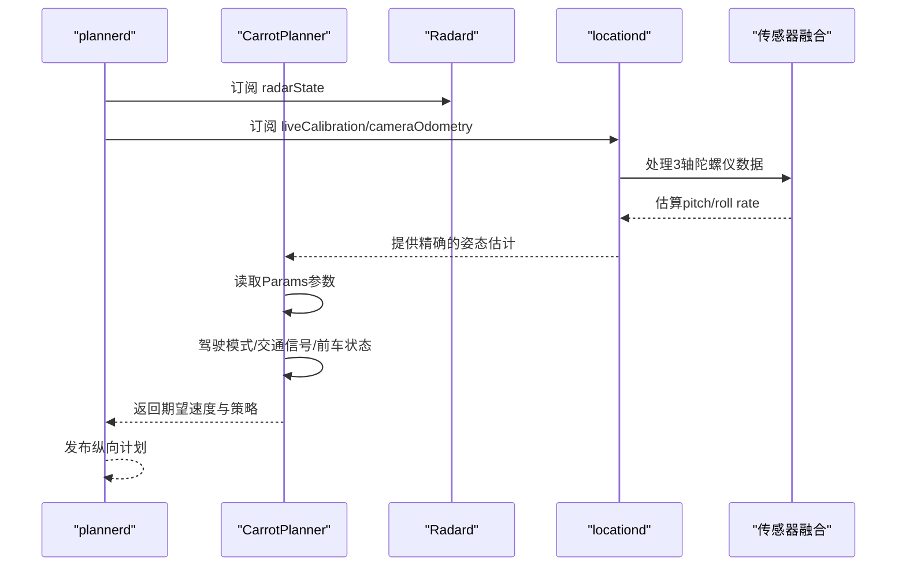
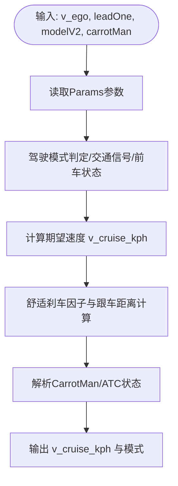
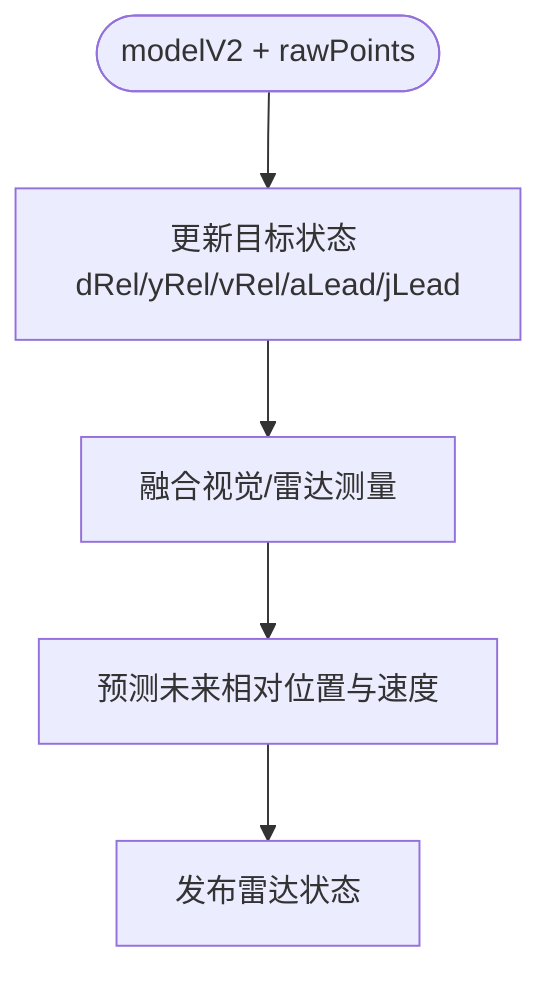
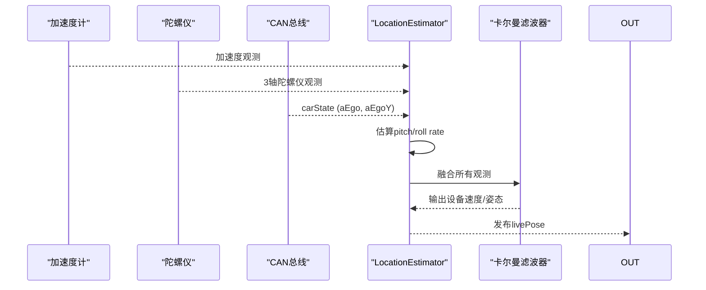
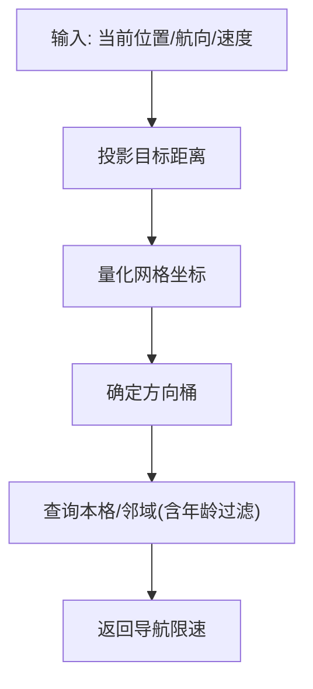
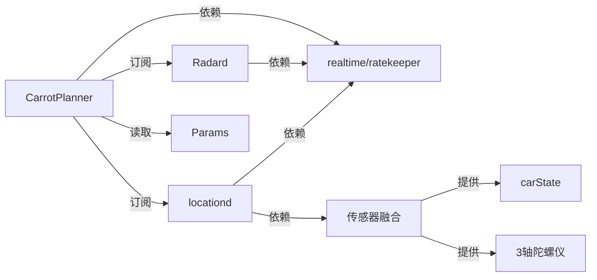

# 多源速度融合

<cite>
**本文引用的文件**
- [selfdrive/carrot/carrot_functions.py](file://selfdrive/carrot/carrot_functions.py)
- [selfdrive/carrot/carrot_speed.py](file://selfdrive/carrot/carrot_speed.py)
- [selfdrive/controls/radard.py](file://selfdrive/controls/radard.py)
- [selfdrive/controls/plannerd.py](file://selfdrive/controls/plannerd.py)
- [selfdrive/locationd/locationd.py](file://selfdrive/locationd/locationd.py)
- [selfdrive/locationd/helpers.py](file://selfdrive/locationd/helpers.py)
- [selfdrive/locationd/models/pose_kf.py](file://selfdrive/locationd/models/pose_kf.py)
- [system/sensord_can/sensors/universal_can_sensor.cc](file://system/sensord_can/sensors/universal_can_sensor.cc)
- [system/sensord/sensors/lsm6ds3_gyro.py](file://system/sensord/sensors/lsm6ds3_gyro.py)
- [system/sensord_wt/sensors/wt_gyro.cc](file://system/sensord_wt/sensors/wt_gyro.cc)
- [common/realtime.py](file://common/realtime.py)
- [common/util.h](file://common/util.h)
- [common/ratekeeper.cc](file://common/ratekeeper.cc)
- [check_carrot_man.py](file://check_carrot_man.py)
- [deep_signal_analysis.py](file://deep_signal_analysis.py)
- [radar_pointcloud_visualizer.py](file://radar_pointcloud_visualizer.py)
- [simulate_laneless_integral_fix.py](file://simulate_laneless_integral_fix.py)
- [check_all_curves.py](file://check_all_curves.py)
- [selfdrive/locationd/test/test_locationd_scenarios.py](file://selfdrive/locationd/test/test_locationd_scenarios.py)
</cite>

## 更新摘要
**变更内容**
- 更新了locationd卡尔曼滤波器部分，反映现在能够使用完整的3轴陀螺仪数据（包括估算的pitch/roll rate）
- 新增了传感器数据融合机制的详细说明
- 增强了车辆动力学估计准确性的描述
- 添加了pitch/roll rate估算算法的实现细节
- 更新了3轴陀螺仪数据融合算法的完整实现

## 目录
1. [引言](#引言)
2. [项目结构](#项目结构)
3. [核心组件](#核心组件)
4. [架构总览](#架构总览)
5. [详细组件分析](#详细组件分析)
6. [依赖关系分析](#依赖关系分析)
7. [性能考量](#性能考量)
8. [故障排查指南](#故障排查指南)
9. [结论](#结论)
10. [附录](#附录)

## 引言
本文件围绕"多源速度融合"能力，系统阐述导航速度、雷达检测速度与车辆状态速度的融合算法与实现，覆盖权重分配、数据校正、GPS位置估算与轨迹预测、可靠性评估与异常处理、不同驾驶场景适配、与CarrotPlanner的协调机制以及实时性要求。文中结合实际代码路径与模块，提供可追溯的参考来源，并给出参数配置与性能指标建议。

**更新** 本版本特别关注locationd卡尔曼滤波器现在能够使用完整的3轴陀螺仪数据（包括估算的pitch/roll rate），显著改善了车辆动力学估计的准确性和收敛性。通过carState中的纵向加速度(aEgo)和横向加速度(aEgoY)估算俯仰/横滚角速度，补全了3轴陀螺仪数据。

## 项目结构
多源速度融合涉及以下关键子系统：
- CarrotPlanner：纵向控制决策与速度目标生成，负责融合导航与模型感知的速度信息，输出期望巡航速度与跟车策略。
- Radard：雷达目标跟踪与状态发布，提供前车相对距离、速度、加速度等信息。
- Locationd：基于传感器与相机里程计的位姿估计，输出设备速度与姿态，支撑轨迹预测与位置延迟补偿。
- 参数与实时性：通过Params读取运行时参数，通过实时调度与速率控制保障系统稳定性。

```mermaid
graph TB
subgraph "纵向控制"
CP["CarrotPlanner<br/>速度融合与目标生成"]
PL["plannerd<br/>进程入口与订阅"]
end
subgraph "感知与融合"
RD["Radard<br/>雷达目标跟踪与状态"]
GPS["locationd<br/>位姿与速度估计"]
SENS["传感器融合<br/>3轴陀螺仪数据"]
END
subgraph "参数与实时性"
PM["Params<br/>运行时参数"]
RT["realtime.py<br/>优先级与时钟"]
RK["ratekeeper.*<br/>速率控制"]
end
PL --> CP
PL --> RD
PL --> GPS
CP --> PM
CP --> RT
RD --> RT
GPS --> RT
GPS --> SENS
SENS --> RT
CP --> RK
```

**图表来源**
- [selfdrive/controls/plannerd.py:13-28](file://selfdrive/controls/plannerd.py#L13-L28)
- [selfdrive/carrot/carrot_functions.py:49-522](file://selfdrive/carrot/carrot_functions.py#L49-L522)
- [selfdrive/controls/radard.py:45-383](file://selfdrive/controls/radard.py#L45-L383)
- [selfdrive/locationd/locationd.py:256-333](file://selfdrive/locationd/locationd.py#L256-L333)
- [system/sensord_can/sensors/universal_can_sensor.cc:44-89](file://system/sensord_can/sensors/universal_can_sensor.cc#L44-L89)
- [common/realtime.py:13-42](file://common/realtime.py#L13-L42)
- [common/ratekeeper.cc:9-40](file://common/ratekeeper.cc#L9-L40)

**章节来源**
- [selfdrive/controls/plannerd.py:13-28](file://selfdrive/controls/plannerd.py#L13-L28)
- [selfdrive/carrot/carrot_functions.py:49-522](file://selfdrive/carrot/carrot_functions.py#L49-L522)
- [selfdrive/controls/radard.py:45-383](file://selfdrive/controls/radard.py#L45-L383)
- [selfdrive/locationd/locationd.py:256-333](file://selfdrive/locationd/locationd.py#L256-L333)
- [system/sensord_can/sensors/universal_can_sensor.cc:44-89](file://system/sensord_can/sensors/universal_can_sensor.cc#L44-L89)
- [common/realtime.py:13-42](file://common/realtime.py#L13-L42)
- [common/ratekeeper.cc:9-40](file://common/ratekeeper.cc#L9-L40)

## 核心组件
- CarrotPlanner：负责根据当前车速、前车状态、模型预测与导航限速，动态计算期望巡航速度与跟车距离，支持多种驾驶模式与个性化的舒适刹车因子。
- Radard：维护雷达目标跟踪器，融合视觉与雷达信息，输出带置信度的状态，用于速度融合与跟车策略。
- Locationd：基于相机里程计与IMU观测的卡尔曼滤波，输出设备速度与姿态，支撑轨迹预测与位置延迟补偿。**更新** 现在能够使用完整的3轴陀螺仪数据，包括通过加速度变化率估算的pitch/roll rate，显著提升车辆动力学估计准确性。
- 参数与实时性：通过Params读取个性化参数，通过实时调度与速率控制保障系统稳定与低延迟。

**章节来源**
- [selfdrive/carrot/carrot_functions.py:49-522](file://selfdrive/carrot/carrot_functions.py#L49-L522)
- [selfdrive/controls/radard.py:45-383](file://selfdrive/controls/radard.py#L45-L383)
- [selfdrive/locationd/locationd.py:51-238](file://selfdrive/locationd/locationd.py#L51-L238)
- [system/sensord_can/sensors/universal_can_sensor.cc:44-89](file://system/sensord_can/sensors/universal_can_sensor.cc#L44-L89)
- [common/realtime.py:13-42](file://common/realtime.py#L13-L42)

## 架构总览
多源速度融合在plannerd进程中完成，订阅radarState与modelV2等消息，调用CarrotPlanner进行速度融合与目标生成，再将纵向计划发送至下游执行。



**图表来源**
- [selfdrive/controls/plannerd.py:13-28](file://selfdrive/controls/plannerd.py#L13-L28)
- [selfdrive/carrot/carrot_functions.py:346-522](file://selfdrive/carrot/carrot_functions.py#L346-L522)
- [selfdrive/controls/radard.py:421-454](file://selfdrive/controls/radard.py#L421-L454)
- [selfdrive/locationd/locationd.py:256-333](file://selfdrive/locationd/locationd.py#L256-L333)
- [system/sensord_can/sensors/universal_can_sensor.cc:44-89](file://system/sensord_can/sensors/universal_can_sensor.cc#L44-L89)

## 详细组件分析

### CarrotPlanner：速度融合与目标生成
- 参数更新与个性化
  - 通过Params周期性读取个性化参数，如驾驶模式、跟车间隔、舒适刹车、限速调节等，动态调整加速上限与跟车行为。
  - 支持多种驾驶模式（经济/安全/正常/高速），并根据拥堵检测自动切换。
- 速度目标生成
  - 结合导航限速、模型预测速度、雷达前车状态与交通信号，计算期望巡航速度与最小跟车距离。
  - 在不同场景下采用不同的tFollow与jerk_factor，保证舒适性与安全性。
- 与CarrotMan/ATC的协调
  - 解析carrotMan中的交通信号状态与转向提示，触发或抑制起步动作，实现与导航系统的协同。
- 实时性与稳定性
  - 使用移动平均与阈值判断，避免误触发；在软驻留与用户干预时，快速进入停止态。



**图表来源**
- [selfdrive/carrot/carrot_functions.py:143-184](file://selfdrive/carrot/carrot_functions.py#L143-L184)
- [selfdrive/carrot/carrot_functions.py:346-522](file://selfdrive/carrot/carrot_functions.py#L346-L522)
- [check_carrot_man.py:56-98](file://check_carrot_man.py#L56-L98)

**章节来源**
- [selfdrive/carrot/carrot_functions.py:143-184](file://selfdrive/carrot/carrot_functions.py#L143-L184)
- [selfdrive/carrot/carrot_functions.py:346-522](file://selfdrive/carrot/carrot_functions.py#L346-L522)
- [check_carrot_man.py:56-98](file://check_carrot_man.py#L56-L98)

### Radard：雷达目标跟踪与状态发布
- 目标状态更新
  - 维护dRel/yRel/vRel/aLead/jLead等状态，融合视觉与雷达测量，计算未来相对位置与速度。
  - 对加速度与加加速度进行阈值处理，学习恒定加速度特性，提升稳定性。
- 状态发布
  - 输出带置信度的雷达状态，供CarrotPlanner与纵向控制器使用。



**图表来源**
- [selfdrive/controls/radard.py:45-383](file://selfdrive/controls/radard.py#L45-L383)
- [selfdrive/controls/radard.py:421-454](file://selfdrive/controls/radard.py#L421-L454)

**章节来源**
- [selfdrive/controls/radard.py:45-383](file://selfdrive/controls/radard.py#L45-L383)
- [selfdrive/controls/radard.py:421-454](file://selfdrive/controls/radard.py#L421-L454)

### Locationd：GPS位置估算与轨迹预测
- 卡尔曼滤波融合
  - 融合IMU（加速度/角速度）、相机里程计旋转与平移观测，估计设备速度与姿态。
  - 提供输入有效性检查与传感器存活检测，避免异常输入污染滤波。
- **更新** 3轴陀螺仪数据融合
  - 现在能够使用完整的3轴陀螺仪数据，包括通过加速度变化率估算的pitch/roll rate。
  - 通过carState中的纵向加速度(aEgo)和横向加速度(aEgoY)估算俯仰/横滚角速度，补全3轴陀螺仪数据。
  - 使用悬挂动力学关系建立jerk与角速度的比例关系，提高车辆姿态估计的准确性。
- 轨迹预测与位置延迟补偿
  - 基于设备速度与姿态，结合航向与速度进行位置外推，为速度融合提供参考。
  - 通过liveCalibration进行设备-载体标定修正，提高估计精度。



**图表来源**
- [selfdrive/locationd/locationd.py:97-202](file://selfdrive/locationd/locationd.py#L97-L202)
- [selfdrive/locationd/helpers.py:120-177](file://selfdrive/locationd/helpers.py#L120-L177)
- [system/sensord_can/sensors/universal_can_sensor.cc:44-89](file://system/sensord_can/sensors/universal_can_sensor.cc#L44-L89)

**章节来源**
- [selfdrive/locationd/locationd.py:97-202](file://selfdrive/locationd/locationd.py#L97-L202)
- [selfdrive/locationd/helpers.py:120-177](file://selfdrive/locationd/helpers.py#L120-L177)
- [system/sensord_can/sensors/universal_can_sensor.cc:44-89](file://system/sensord_can/sensors/universal_can_sensor.cc#L44-L89)

### CarrotSpeed：导航速度表与轨迹预测
- 导航速度表
  - 基于经纬度量化网格与方向桶，存储与查询导航限速，支持gzip压缩与邻居查询。
  - 查询时对邻域老旧数据进行年龄阈值过滤，保证预测稳定性。
- 轨迹预测
  - 根据当前速度与航向，沿目标方向投影一定距离，查询导航限速作为参考。



**图表来源**
- [selfdrive/carrot/carrot_speed.py:248-278](file://selfdrive/carrot/carrot_speed.py#L248-L278)
- [selfdrive/carrot/carrot_speed.py:181-246](file://selfdrive/carrot/carrot_speed.py#L181-L246)

**章节来源**
- [selfdrive/carrot/carrot_speed.py:248-278](file://selfdrive/carrot/carrot_speed.py#L248-L278)
- [selfdrive/carrot/carrot_speed.py:181-246](file://selfdrive/carrot/carrot_speed.py#L181-L246)

### 不同驾驶场景下的融合策略
- 高速巡航
  - 以导航限速与雷达前车状态为主，适当增大tFollow与舒适刹车，保证稳定与安全。
- 城市驾驶
  - 更敏感地响应交通信号与前车减速，缩短跟车距离，提高响应速度。
- 复杂路况
  - 结合车道线与模型预测，降低对单一传感器的依赖，必要时采用保守策略。

**章节来源**
- [selfdrive/carrot/carrot_functions.py:199-240](file://selfdrive/carrot/carrot_functions.py#L199-L240)
- [selfdrive/carrot/carrot_functions.py:346-522](file://selfdrive/carrot/carrot_functions.py#L346-L522)

### 与CarrotPlanner的协调机制与实时性要求
- 协调机制
  - plannerd订阅radarState与modelV2，调用CarrotPlanner生成纵向计划；CarrotPlanner内部解析carrotMan与导航限速，输出期望速度。
- 实时性要求
  - plannerd与radard使用统一优先级与时钟，保证控制回路稳定；通过Params参数化实现在线调参。

**章节来源**
- [selfdrive/controls/plannerd.py:13-28](file://selfdrive/controls/plannerd.py#L13-L28)
- [common/realtime.py:13-42](file://common/realtime.py#L13-L42)
- [common/ratekeeper.cc:9-40](file://common/ratekeeper.cc#L9-L40)

## 依赖关系分析
- 组件耦合
  - CarrotPlanner依赖Params与实时常量，依赖radarState与modelV2进行融合。
  - Radard与locationd分别提供独立的观测源，plannerd进行融合与决策。
  - **更新** locationd现在依赖多种传感器源，包括3轴陀螺仪和carState数据。
- 外部依赖
  - 参数系统（Params）用于运行时配置；实时调度（realtime/ratekeeper）保障系统稳定性。



**图表来源**
- [selfdrive/carrot/carrot_functions.py:346-522](file://selfdrive/carrot/carrot_functions.py#L346-L522)
- [selfdrive/controls/radard.py:421-454](file://selfdrive/controls/radard.py#L421-L454)
- [selfdrive/locationd/locationd.py:256-333](file://selfdrive/locationd/locationd.py#L256-L333)
- [system/sensord_can/sensors/universal_can_sensor.cc:44-89](file://system/sensord_can/sensors/universal_can_sensor.cc#L44-L89)
- [common/realtime.py:13-42](file://common/realtime.py#L13-L42)
- [common/ratekeeper.cc:9-40](file://common/ratekeeper.cc#L9-L40)

**章节来源**
- [selfdrive/carrot/carrot_functions.py:346-522](file://selfdrive/carrot/carrot_functions.py#L346-L522)
- [selfdrive/controls/radard.py:421-454](file://selfdrive/controls/radard.py#L421-L454)
- [selfdrive/locationd/locationd.py:256-333](file://selfdrive/locationd/locationd.py#L256-L333)
- [system/sensord_can/sensors/universal_can_sensor.cc:44-89](file://system/sensord_can/sensors/universal_can_sensor.cc#L44-L89)
- [common/realtime.py:13-42](file://common/realtime.py#L13-L42)
- [common/ratekeeper.cc:9-40](file://common/ratekeeper.cc#L9-L40)

## 性能考量
- 速率控制
  - 控制循环步长DT_MDL与DT_CTRL固定，确保纵向与横向控制的时序一致性。
- 内存与I/O
  - CarrotSpeed使用gzip压缩与参数持久化，降低I/O开销；网格查询与邻居扫描在合理范围内限制半径。
- 传感器健康度
  - locationd对输入进行严格校验与存活检测，避免异常数据污染滤波。
- **更新** 3轴陀螺仪数据质量
  - 通过pitch/roll rate估算算法，提高车辆姿态估计的准确性，减少滤波器发散风险。
  - 使用交叉误差检查机制，确保陀螺仪与相机里程计数据的一致性。

**章节来源**
- [common/util.h:33-49](file://common/util.h#L33-L49)
- [common/ratekeeper.cc:9-40](file://common/ratekeeper.cc#L9-L40)
- [selfdrive/carrot/carrot_speed.py:312-345](file://selfdrive/carrot/carrot_speed.py#L312-L345)
- [selfdrive/locationd/locationd.py:97-202](file://selfdrive/locationd/locationd.py#L97-L202)
- [system/sensord_can/sensors/universal_can_sensor.cc:44-89](file://system/sensord_can/sensors/universal_can_sensor.cc#L44-L89)

## 故障排查指南
- 参数相关
  - 检查Params中与速度融合相关的参数键值，确认是否正确下发与生效。
- 数据质量
  - 使用信号分析脚本对CAN信号进行统计与周期性分析，识别异常波动。
- 雷达质量
  - 使用雷达可视化工具评估检测范围与质量指标，辅助定位异常。
- 积分漂移与弯道性能
  - 使用积分修复分析脚本评估直道积分漂移与弯道性能变化，验证修复效果。
- 弯道场景
  - 使用弯道分析脚本统计高速过弯与低速过弯比例，指导参数调优。
- **更新** 3轴陀螺仪数据问题
  - 检查carState中的纵向和横向加速度数据是否有效，确保pitch/roll rate估算正常工作。
  - 监控陀螺仪与相机里程计的交叉误差，及时发现传感器不一致问题。

**章节来源**
- [deep_signal_analysis.py:410-452](file://deep_signal_analysis.py#L410-L452)
- [radar_pointcloud_visualizer.py:649-681](file://radar_pointcloud_visualizer.py#L649-L681)
- [simulate_laneless_integral_fix.py:248-365](file://simulate_laneless_integral_fix.py#L248-L365)
- [check_all_curves.py:12-52](file://check_all_curves.py#L12-L52)
- [system/sensord_can/sensors/universal_can_sensor.cc:44-89](file://system/sensord_can/sensors/universal_can_sensor.cc#L44-L89)

## 结论
多源速度融合通过CarrotPlanner整合导航限速、雷达前车状态与模型预测，结合Params参数化与实时调度，在不同驾驶场景下实现安全、舒适与高效的纵向控制。Locationd提供的位姿与速度估计为轨迹预测与位置延迟补偿提供了基础，Radard则提供了可靠的前车状态观测。**更新** 特别是现在能够使用完整的3轴陀螺仪数据（包括通过加速度变化率估算的pitch/roll rate），显著提升了车辆动力学估计的准确性和滤波器的收敛性，进一步增强了整个系统的鲁棒性。

## 附录

### 速度融合算法与参数调优要点
- 权重分配
  - 导航限速权重：由CarrotSpeed查询结果与Params中的导航限速系数共同决定。
  - 雷达前车权重：由radarState中的置信度与状态稳定性决定。
  - 模型预测权重：由modelV2的速度与位置分布决定。
- 数据校正机制
  - Radard对加速度与加加速度进行阈值处理，学习恒定加速度特性，减少抖动。
  - locationd对输入进行严格校验与存活检测，避免异常数据污染。
  - **更新** 3轴陀螺仪数据融合：通过carState数据估算pitch/roll rate，提高姿态估计准确性。
- 位置延迟补偿与运动状态判断
  - 通过设备速度与姿态进行位置外推，结合航向与速度进行延迟补偿。
  - 使用移动平均与阈值判断，识别静止、起步与减速状态。
- 可靠性评估与异常处理
  - Params参数化评估指标，结合历史数据与邻居查询进行质量评估。
  - 对异常输入进行衰减与丢弃，保持滤波稳定性。
  - **更新** 交叉误差检查：监控陀螺仪与相机里程计数据的一致性。
- 不同场景应用
  - 高速：增大tFollow与舒适刹车，降低对前车微小扰动的响应。
  - 城市：更敏感地响应红绿灯与前车减速，缩短跟车距离。
  - 复杂：结合车道线与模型预测，必要时采用保守策略。

**章节来源**
- [selfdrive/carrot/carrot_functions.py:199-240](file://selfdrive/carrot/carrot_functions.py#L199-L240)
- [selfdrive/controls/radard.py:345-383](file://selfdrive/controls/radard.py#L345-L383)
- [selfdrive/locationd/locationd.py:97-202](file://selfdrive/locationd/locationd.py#L97-L202)
- [selfdrive/carrot/carrot_speed.py:248-278](file://selfdrive/carrot/carrot_speed.py#L248-L278)
- [system/sensord_can/sensors/universal_can_sensor.cc:44-89](file://system/sensord_can/sensors/universal_can_sensor.cc#L44-L89)

### 3轴陀螺仪数据融合算法详解
- **更新** pitch/roll rate估算原理
  - 利用carState中的纵向加速度(aEgo)和横向加速度(aEgoY)的时间变化率（jerk）估算车体姿态角速度。
  - 建立悬挂动力学关系：pitch_rate = -K_PITCH × long_jerk，roll_rate = K_ROLL × lat_jerk。
  - 比例系数K_PITCH ≈ 0.002，K_ROLL ≈ 0.0015，反映制动和转向对车体姿态的影响。
- **更新** 数据融合流程
  - 从carState获取aEgo和aEgoY，计算时间间隔dt。
  - 计算long_jerk和lat_jerk，得到原始pitch_rate和roll_rate。
  - 应用一阶低通滤波和平滑处理，限制在合理范围内（±0.1 rad/s）。
  - 将估算的pitch/roll rate与陀螺仪数据融合，提供完整的3轴角速度观测。
- **更新** 质量保证机制
  - 交叉误差检查：比较陀螺仪测量值与估算值的差异，超过阈值则降低权重。
  - 传感器健康监测：监控carState数据的有效性，确保估算算法正常工作。
  - 动态权重调整：根据传感器质量和滤波器状态自适应调整观测权重。
- **更新** 传感器实现细节
  - UniversalYawSensor：从carState提取aEgo和aEgoY，计算pitch/roll rate。
  - UniversalAccelSensor：提供3轴加速度数据，支持重力补偿。
  - 多种陀螺仪传感器支持：LSM6DS3、WT等，确保系统冗余。

**章节来源**
- [system/sensord_can/sensors/universal_can_sensor.cc:44-89](file://system/sensord_can/sensors/universal_can_sensor.cc#L44-L89)
- [system/sensord/sensors/lsm6ds3_gyro.py:59-83](file://system/sensord/sensors/lsm6ds3_gyro.py#L59-83)
- [system/sensord_wt/sensors/wt_gyro.cc:56-71](file://system/sensord_wt/sensors/wt_gyro.cc#L56-71)
- [selfdrive/locationd/locationd.py:128-143](file://selfdrive/locationd/locationd.py#L128-L143)

### 测试与验证
- **更新** 位置估计测试场景
  - 测试场景包括陀螺仪离线、加速度计离线、传感器定时问题等。
  - 验证滤波器在各种异常情况下的稳定性与恢复能力。
  - 监控yaw_rate、roll等关键指标的变化趋势。

**章节来源**
- [selfdrive/locationd/test/test_locationd_scenarios.py:1-191](file://selfdrive/locationd/test/test_locationd_scenarios.py#L1-L191)