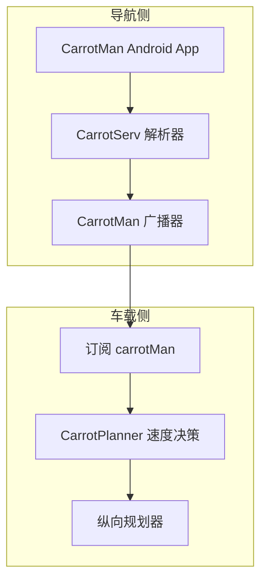
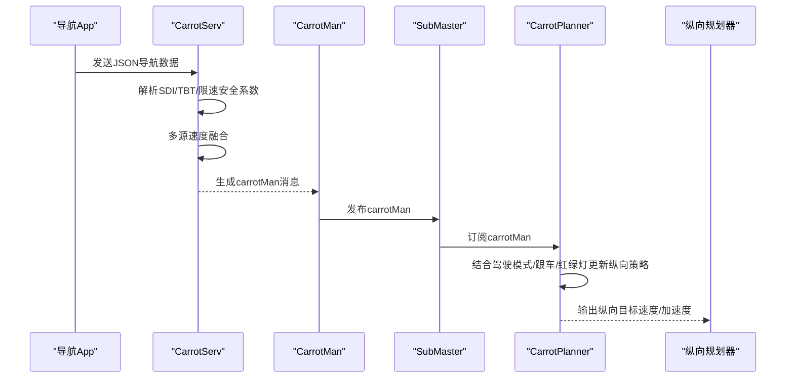
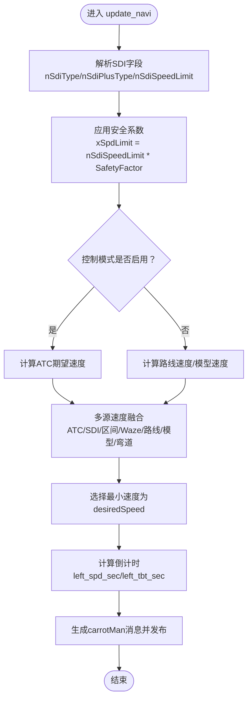
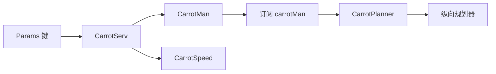

# 导航限速处理

<cite>
**本文引用的文件**
- [carrot_serv.py](file://selfdrive/carrot/carrot_serv.py)
- [carrot_man.py](file://selfdrive/carrot/carrot_man.py)
- [carrot_functions.py](file://selfdrive/carrot/carrot_functions.py)
- [carrot_speed.py](file://selfdrive/carrot/carrot_speed.py)
- [longitudinal_planner.py](file://selfdrive/controls/lib/longitudinal_planner.py)
- [params_keys.h](file://common/params_keys.h)
- [selfdrive/carrot_settings.json](file://selfdrive/carrot_settings.json)
- [原车acc增强系统设计.md](file://原车acc增强系统设计.md)
- [原车acc增强系统重构文档.md](file://原车acc增强系统重构文档.md)
</cite>

## 目录
1. [简介](#简介)
2. [项目结构](#项目结构)
3. [核心组件](#核心组件)
4. [架构总览](#架构总览)
5. [详细组件分析](#详细组件分析)
6. [依赖关系分析](#依赖关系分析)
7. [性能考量](#性能考量)
8. [故障排查指南](#故障排查指南)
9. [结论](#结论)
10. [附录](#附录)

## 简介
本技术文档围绕导航限速处理功能展开，系统性阐述从导航数据获取、解析与处理，到TBT（Turn-by-Turn）导航数据转换、SDI（Speed Detection Information）限速标志识别与分类、距离计算，再到限速安全系数应用、与CarrotPlanner速度控制的集成关系。文档提供来自真实代码库的实现路径与参数配置说明，帮助读者快速理解并定位问题。

## 项目结构
导航限速处理涉及以下关键模块：
- 数据来源与协议：CarrotMan Android导航App通过UDP广播/单播提供导航与限速信息，服务端由CarrotServ解析并生成carrotMan消息。
- 数据处理链路：CarrotServ负责SDI与TBT解析、限速安全系数应用、多源速度融合，最终输出carrotMan消息；CarrotMan负责广播与可视化；CarrotPlanner消费carrotMan并参与纵向控制决策。
- 参数配置：大量限速控制参数通过Params键管理，支持运行时调整。

图表来源
- [carrot_serv.py:861-1102](file://selfdrive/carrot/carrot_serv.py#L861-L1102)
- [carrot_man.py:320-407](file://selfdrive/carrot/carrot_man.py#L320-L407)
- [carrot_functions.py:346-521](file://selfdrive/carrot/carrot_functions.py#L346-L521)

章节来源
- [carrot_serv.py:861-1102](file://selfdrive/carrot/carrot_serv.py#L861-L1102)
- [carrot_man.py:320-407](file://selfdrive/carrot/carrot_man.py#L320-L407)
- [carrot_functions.py:346-521](file://selfdrive/carrot/carrot_functions.py#L346-L521)

## 核心组件
- CarrotServ：负责SDI/TBT数据解析、限速安全系数应用、多源速度融合、倒计时计算与carrotMan消息生成。
- CarrotMan：负责carrotMan消息广播、可视化路径与参数同步。
- CarrotPlanner：消费carrotMan，结合驾驶模式、跟车状态、红绿灯等，参与纵向控制策略。
- CarrotSpeed：用于存储与查询“未来目标速度”（基于历史采样与邻域查询）。

章节来源
- [carrot_serv.py:83-237](file://selfdrive/carrot/carrot_serv.py#L83-L237)
- [carrot_man.py:204-260](file://selfdrive/carrot/carrot_man.py#L204-L260)
- [carrot_functions.py:49-135](file://selfdrive/carrot/carrot_functions.py#L49-L135)
- [carrot_speed.py:63-92](file://selfdrive/carrot/carrot_speed.py#L63-L92)

## 架构总览
导航限速处理的关键流程如下：
1. CarrotServ从导航App接收JSON数据，解析SDI与TBT字段，计算限速与距离。
2. 应用限速安全系数与控制模式，进行多源速度融合（ATC、SDI/HDA、区间测速、摄像头、路线速度、模型预测、弯道速度等）。
3. 生成carrotMan消息，包含限速类型、限速值、距离、倒计时、目标速度与来源等。
4. CarrotMan广播消息，供CarrotPlanner订阅并参与纵向控制。
5. CarrotPlanner根据carrotMan与当前状态（跟车、红绿灯、驾驶模式）更新纵向目标速度与跟车距离。

图表来源
- [carrot_serv.py:861-1102](file://selfdrive/carrot/carrot_serv.py#L861-L1102)
- [carrot_man.py:320-407](file://selfdrive/carrot/carrot_man.py#L320-L407)
- [carrot_functions.py:346-521](file://selfdrive/carrot/carrot_functions.py#L346-L521)
- [longitudinal_planner.py:143-283](file://selfdrive/controls/lib/longitudinal_planner.py#L143-L283)

## 详细组件分析

### CarrotServ：导航限速数据解析与处理
- SDI限速识别与分类
  - 支持固定/移动摄像头、区间测速、信号违规、减速带等多种类型，依据nSdiType/nSdiPlusType进行分类。
  - 区间测速与移动摄像头在autoNaviSpeedCtrlMode下有不同的处理策略。
  - 限速安全系数通过AutoNaviSpeedSafetyFactor应用于nSdiSpeedLimit，得到xSpdLimit。
- TBT（Turn-by-Turn）导航数据转换
  - 将导航指令类型映射为内部枚举（如左转、右转、环岛、到达等），并计算到转弯点的距离与下一指令。
  - 自动转向控制（ATC）根据距离与限速计算期望速度，并生成atcType/atcSpeed/atcDist。
- 多源速度融合
  - 速度来源包括：ATC、区间测速、信号摄像头、Waze摄像头、路线速度、模型预测速度、弯道速度等。
  - 选择最小值作为最终desiredSpeed，并记录来源desireSource。
- 倒计时与提醒
  - 根据当前速度与剩余距离计算限速/转弯倒计时left_spd_sec/left_tbt_sec，并映射到carrot_left_sec用于UI提醒。

图表来源
- [carrot_serv.py:623-1008](file://selfdrive/carrot/carrot_serv.py#L623-L1008)

章节来源
- [carrot_serv.py:623-1008](file://selfdrive/carrot/carrot_serv.py#L623-L1008)

### CarrotMan：消息广播与可视化
- 负责carrotMan消息的组装与广播，包含位置、速度、限速、TBT、倒计时、目标速度与来源等字段。
- 同步网络地址、版本信息，支持与导航App的双向通信。
- 提供可视化路径（naviPaths）与速度表（CarrotSpeedViz）内存参数。

章节来源
- [carrot_man.py:583-625](file://selfdrive/carrot/carrot_man.py#L583-L625)
- [carrot_man.py:320-407](file://selfdrive/carrot/carrot_man.py#L320-L407)

### CarrotPlanner：与CarrotMan的集成与纵向控制
- 订阅carrotMan，读取desiredSpeed与desiredSource，结合驾驶模式（Eco/Safe/Normal/High）、跟车状态、红绿灯等更新纵向目标。
- 通过get_carrot_accel根据当前速度与驾驶模式限制纵向加速度。
- 在ACC模式下，纵向规划器会使用CarrotPlanner提供的目标速度与加速度限制。

章节来源
- [carrot_functions.py:346-521](file://selfdrive/carrot/carrot_functions.py#L346-L521)
- [longitudinal_planner.py:143-283](file://selfdrive/controls/lib/longitudinal_planner.py#L143-L283)

### CarrotSpeed：未来目标速度查询与存储
- 提供add_sample/query_target/query_target_dist等接口，基于当前位置、航向与 lookahead 距离查询未来目标速度。
- 支持邻域查询与老化阈值，用于在导航限速变化时平滑过渡。

章节来源
- [carrot_speed.py:181-278](file://selfdrive/carrot/carrot_speed.py#L181-L278)

## 依赖关系分析
导航限速处理的关键依赖关系如下：
- CarrotServ依赖Params键读取限速控制参数（AutoNaviSpeedCtrlMode、AutoNaviSpeedSafetyFactor、AutoNaviSpeedDecelRate等）。
- CarrotServ与CarrotMan通过消息总线交互，CarrotPlanner订阅carrotMan并参与纵向控制。
- CarrotSpeed为导航限速处理提供“未来目标速度”的查询能力，辅助CarrotServ进行速度融合。

图表来源
- [carrot_serv.py:201-220](file://selfdrive/carrot/carrot_serv.py#L201-L220)
- [carrot_functions.py:346-521](file://selfdrive/carrot/carrot_functions.py#L346-L521)
- [carrot_speed.py:63-92](file://selfdrive/carrot/carrot_speed.py#L63-L92)

章节来源
- [carrot_serv.py:201-220](file://selfdrive/carrot/carrot_serv.py#L201-L220)
- [carrot_functions.py:346-521](file://selfdrive/carrot/carrot_functions.py#L346-L521)
- [carrot_speed.py:63-92](file://selfdrive/carrot/carrot_speed.py#L63-L92)

## 性能考量
- 限速安全系数与控制模式对实时性影响较小，主要开销在于多源速度融合与倒计时计算。
- CarrotSpeed的邻域查询与老化阈值在高密度限速区域可能增加CPU负载，可通过合理设置neighbor_ring与老化阈值平衡精度与性能。
- 纵向规划器在ACC模式下使用CarrotPlanner提供的加速度上限，有助于减少纵向抖动与提升舒适性。

## 故障排查指南
常见问题与解决方案：
- 限速识别不生效
  - 检查AutoNaviSpeedCtrlMode与AutoNaviSpeedSafetyFactor参数是否正确设置。
  - 确认CarrotServ处于active_carrot > 1状态，且xSpdType有效。
- 区间测速/移动摄像头未触发
  - 确认nSdiType/nSdiPlusType与nSdiSpeedLimit/nSdiDist是否正确传入。
  - 检查autoNaviSpeedCtrlMode是否允许对应类型的限速。
- 弯道/路线速度与导航限速冲突
  - 检查TurnSpeedControlMode与MapTurnSpeedFactor/ModelTurnSpeedFactor设置。
  - 确认desiredSource是否符合预期（如atc、hda、route、model等）。
- 纵向控制不响应导航限速
  - 检查CarrotPlanner是否正确订阅carrotMan，desiredSpeed是否被CarrotPlanner采纳。
  - 确认驾驶模式与comfort_brake因子未过度抑制减速。

章节来源
- [carrot_serv.py:623-1008](file://selfdrive/carrot/carrot_serv.py#L623-L1008)
- [carrot_functions.py:346-521](file://selfdrive/carrot/carrot_functions.py#L346-L521)
- [原车acc增强系统设计.md:161-182](file://原车acc增强系统设计.md#L161-L182)

## 结论
导航限速处理通过CarrotServ对SDI/TBT数据进行解析与融合，结合限速安全系数与多种速度来源，生成carrotMan消息并驱动CarrotPlanner的纵向控制。该机制在保证安全性的同时兼顾舒适性，并通过参数化配置满足不同场景需求。建议在部署时关注参数一致性与实时性权衡，确保限速识别与响应的稳定性。

## 附录

### 关键参数与含义
- AutoNaviSpeedCtrlMode：限速控制模式（0/1/2/3），决定是否启用区间测速/摄像头等。
- AutoNaviSpeedSafetyFactor：限速安全系数（百分比），用于将nSdiSpeedLimit缩放为xSpdLimit。
- AutoNaviSpeedDecelRate：限速减速率（m/s²），用于计算安全距离与速度。
- AutoNaviSpeedCtrlEnd：限速控制提前时间（秒），用于倒计时与提醒。
- AutoRoadSpeedLimitOffset：道路限速偏移（km/h），在特定模式下叠加至nRoadLimitSpeed。
- TurnSpeedControlMode：弯道/路线速度控制模式（1/2/3/4），决定是否融合路线速度与模型预测速度。
- MapTurnSpeedFactor/ModelTurnSpeedFactor：路线与模型速度的融合权重。
- ComfortBrake：舒适制动力，受驾驶模式因子影响。

章节来源
- [params_keys.h:178-189](file://common/params_keys.h#L178-L189)
- [selfdrive/carrot_settings.json:1751-1800](file://selfdrive/carrot_settings.json#L1751-L1800)
- [carrot_serv.py:201-220](file://selfdrive/carrot/carrot_serv.py#L201-L220)
- [carrot_functions.py:176-182](file://selfdrive/carrot/carrot_functions.py#L176-L182)

### 返回值与字段说明（摘自导航数据字典）
- nRoadLimitSpeed：道路限速（km/h）
- xSpdType：限速类型（-1/0/1/2/3/…）
- xSpdLimit：具体限速值（km/h）
- xSpdDist：到限速点距离（m）
- xSpdCountDown：限速倒计时（秒）
- xTurnInfo/xTurnInfoNext：转弯类型（-1/0/1/2/…）
- xDistToTurn/xDistToTurnNext：到转弯点距离（m）
- vTurnSpeed：转弯建议速度（km/h）
- desiredSpeed：目标速度（km/h）
- desiredSource：速度来源（atc/road/vturn/route/model/cam/…）

章节来源
- [原车acc增强系统设计.md:50-82](file://原车acc增强系统设计.md#L50-L82)
- [原车acc增强系统设计.md:122-127](file://原车acc增强系统设计.md#L122-L127)