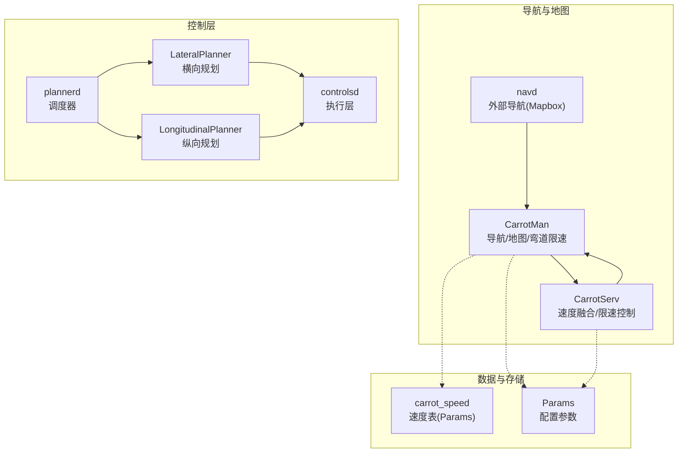
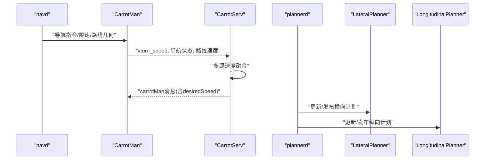
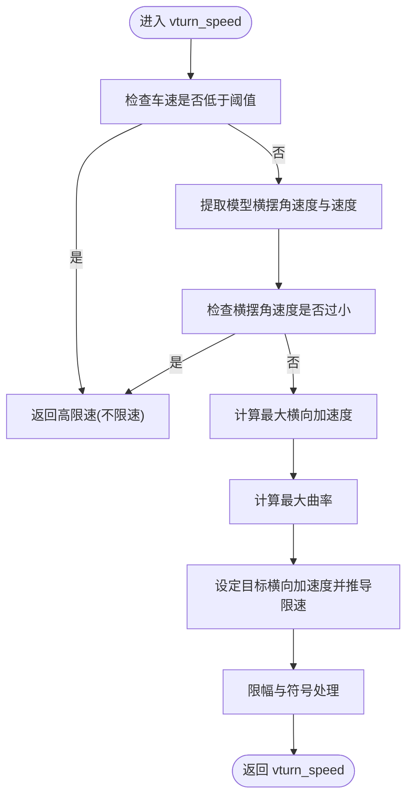
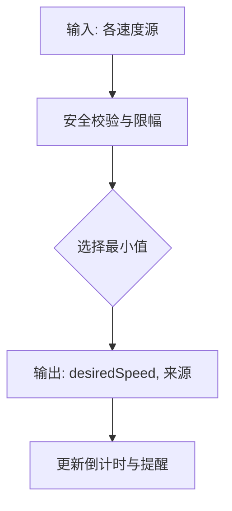
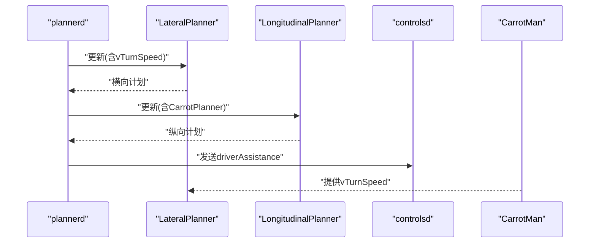
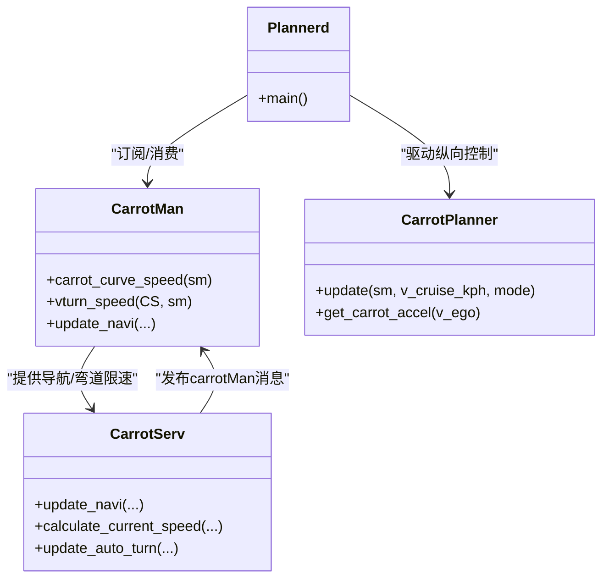
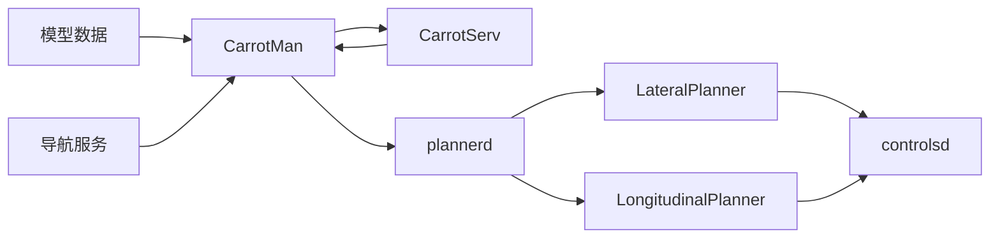

# 导航集成模块

<cite>
**本文档引用的文件**
- [carrot_functions.py](file://selfdrive/carrot/carrot_functions.py)
- [carrot_man.py](file://selfdrive/carrot/carrot_man.py)
- [carrot_serv.py](file://selfdrive/carrot/carrot_serv.py)
- [carrot_speed.py](file://selfdrive/carrot/carrot_speed.py)
- [plannerd.py](file://selfdrive/controls/plannerd.py)
- [lateral_planner.py](file://selfdrive/controls/lib/lateral_planner.py)
- [longitudinal_planner.py](file://selfdrive/controls/lib/longitudinal_planner.py)
- [controlsd.py](file://selfdrive/controls/controlsd.py)
- [navd.py](file://selfdrive/navd/navd.py)
- [params_keys.h](file://common/params_keys.h)
</cite>

## 目录
1. [简介](#简介)
2. [项目结构](#项目结构)
3. [核心组件](#核心组件)
4. [架构总览](#架构总览)
5. [详细组件分析](#详细组件分析)
6. [依赖关系分析](#依赖关系分析)
7. [性能考虑](#性能考虑)
8. [故障排查指南](#故障排查指南)
9. [结论](#结论)
10. [附录](#附录)

## 简介
本文件面向导航集成模块，系统性阐述导航限速处理、弯道限速计算、多源速度融合策略，以及与CarrotPlanner的集成协调机制。文档基于实际代码库进行深入分析，提供接口定义、配置参数、返回值说明、调用流程图与类关系图，并给出常见问题与解决方案，兼顾初学者与资深开发者的阅读需求。

## 项目结构
导航集成模块主要由以下子系统构成：
- CarrotMan：导航与地图数据处理、弯道限速计算、导航指令解析与广播
- CarrotServ：导航速度融合引擎、限速/红绿灯/区间测速等控制逻辑
- CarrotPlanner：纵向控制与驾驶模式决策，与CarrotServ协同
- Plannerd：调度器，驱动横向/纵向规划器与CarrotPlanner
- navd：外部导航服务对接（Mapbox），提供导航指令与限速
- carrot_speed：速度表（Params后端）用于多源速度融合的辅助数据

图表来源
- [carrot_man.py:204-260](file://selfdrive/carrot/carrot_man.py#L204-L260)
- [carrot_serv.py:83-200](file://selfdrive/carrot/carrot_serv.py#L83-L200)
- [navd.py:30-90](file://selfdrive/navd/navd.py#L30-L90)
- [plannerd.py:13-48](file://selfdrive/controls/plannerd.py#L13-L48)
- [lateral_planner.py:85-161](file://selfdrive/controls/lib/lateral_planner.py#L85-L161)
- [longitudinal_planner.py:162-182](file://selfdrive/controls/lib/longitudinal_planner.py#L162-L182)
- [controlsd.py:164-192](file://selfdrive/controls/controlsd.py#L164-L192)
- [carrot_speed.py:63-90](file://selfdrive/carrot/carrot_speed.py#L63-L90)
- [params_keys.h:171-195](file://common/params_keys.h#L171-L195)

章节来源
- [carrot_man.py:204-260](file://selfdrive/carrot/carrot_man.py#L204-L260)
- [carrot_serv.py:83-200](file://selfdrive/carrot/carrot_serv.py#L83-L200)
- [navd.py:30-90](file://selfdrive/navd/navd.py#L30-L90)
- [plannerd.py:13-48](file://selfdrive/controls/plannerd.py#L13-L48)

## 核心组件
- CarrotMan：负责导航数据接收、地图路径曲率计算、弯道限速vturn_speed生成、导航指令解析与广播，向CarrotServ提供实时导航状态与速度建议。
- CarrotServ：负责多源速度融合（导航限速、区间测速、红绿灯、弯道限速、路线速度、模型预测速度），并发布carrotMan消息供控制层消费。
- CarrotPlanner：纵向控制与驾驶模式决策，读取carrotMan.desiredSpeed并结合驾驶模式、雷达与车辆状态进行纵向约束。
- Plannerd：统一调度横向/纵向规划器与CarrotPlanner，形成闭环控制。
- navd：与外部导航服务交互，提供导航指令、限速与路线几何信息。
- carrot_speed：基于Params的速度表，支持多方向桶存储与查询，辅助速度融合与可视化。

章节来源
- [carrot_functions.py:49-120](file://selfdrive/carrot/carrot_functions.py#L49-L120)
- [carrot_man.py:1035-1091](file://selfdrive/carrot/carrot_man.py#L1035-L1091)
- [carrot_serv.py:860-1100](file://selfdrive/carrot/carrot_serv.py#L860-L1100)
- [plannerd.py:25-44](file://selfdrive/controls/plannerd.py#L25-L44)
- [navd.py:320-392](file://selfdrive/navd/navd.py#L320-L392)
- [carrot_speed.py:63-120](file://selfdrive/carrot/carrot_speed.py#L63-L120)

## 架构总览
导航集成模块采用“感知-融合-决策-执行”的分层架构：
- 感知层：CarrotMan从模型与导航源提取曲率、限速、红绿灯、区间测速等信息
- 融合层：CarrotServ将多源速度进行融合，得到最终目标速度desiredSpeed
- 决策层：CarrotPlanner根据desiredSpeed与驾驶模式生成纵向约束
- 执行层：Lateral/Longitudinal Planner与controlsd完成轨迹与纵向控制

图表来源
- [navd.py:222-311](file://selfdrive/navd/navd.py#L222-L311)
- [carrot_man.py:348-354](file://selfdrive/carrot/carrot_man.py#L348-L354)
- [carrot_serv.py:860-1100](file://selfdrive/carrot/carrot_serv.py#L860-L1100)
- [plannerd.py:30-44](file://selfdrive/controls/plannerd.py#L30-L44)

## 详细组件分析

### 弯道限速计算（CarrotMan.vturn_speed）
- 输入：模型提供的横摆角速度与纵向速度，结合车辆速度与参数因子
- 处理：
  - 低速阈值过滤，避免低速时模型数据不稳定导致的剧烈跳变
  - 计算最大横向加速度与对应曲率，设定目标横向加速度，推导限速
  - 应用曲率敏感度与激进度参数，得到vturn_speed（km/h）
- 输出：vturn_speed（km/h），负值表示左转，正值表示右转；接近0表示直道或不适用

图表来源
- [carrot_man.py:1050-1091](file://selfdrive/carrot/carrot_man.py#L1050-L1091)

章节来源
- [carrot_man.py:1035-1091](file://selfdrive/carrot/carrot_man.py#L1035-L1091)

### 多源速度融合（CarrotServ.update_navi）
- 融合来源：
  - 自动转向控制（ATC）：根据导航提示提前降速
  - 区间测速/红绿灯/摄像头：基于距离与安全时间计算当前允许速度
  - 道路限速：来自CarState或导航服务
  - 路线速度：基于地图路径曲率计算的推荐速度
  - 模型预测速度：模型输出的弯道速度
  - 弯道限速：CarrotMan计算的vturn_speed
- 融合策略：
  - 对各来源速度进行安全校验与限幅
  - 选择最小值作为最终desiredSpeed
  - 记录速度来源与倒计时提醒

图表来源
- [carrot_serv.py:974-1008](file://selfdrive/carrot/carrot_serv.py#L974-L1008)

章节来源
- [carrot_serv.py:860-1100](file://selfdrive/carrot/carrot_serv.py#L860-L1100)

### 与CarrotPlanner的集成（plannerd与控制层）
- plannerd订阅carrotMan，将vTurnSpeed注入横向规划器，驱动路径偏移与曲率规划
- CarrotPlanner读取carrotMan.desiredSpeed，结合驾驶模式、雷达与车辆状态生成纵向约束
- controlsd根据横向/纵向计划与车辆状态执行控制

图表来源
- [plannerd.py:30-44](file://selfdrive/controls/plannerd.py#L30-L44)
- [lateral_planner.py:85-161](file://selfdrive/controls/lib/lateral_planner.py#L85-L161)
- [longitudinal_planner.py:162-182](file://selfdrive/controls/lib/longitudinal_planner.py#L162-L182)
- [controlsd.py:164-192](file://selfdrive/controls/controlsd.py#L164-L192)

章节来源
- [plannerd.py:25-44](file://selfdrive/controls/plannerd.py#L25-L44)
- [lateral_planner.py:85-161](file://selfdrive/controls/lib/lateral_planner.py#L85-L161)
- [longitudinal_planner.py:162-182](file://selfdrive/controls/lib/longitudinal_planner.py#L162-L182)
- [controlsd.py:164-192](file://selfdrive/controls/controlsd.py#L164-L192)

### 类关系与职责

图表来源
- [carrot_man.py:1035-1091](file://selfdrive/carrot/carrot_man.py#L1035-L1091)
- [carrot_serv.py:860-1100](file://selfdrive/carrot/carrot_serv.py#L860-L1100)
- [carrot_functions.py:49-120](file://selfdrive/carrot/carrot_functions.py#L49-L120)
- [plannerd.py:13-48](file://selfdrive/controls/plannerd.py#L13-L48)

章节来源
- [carrot_man.py:1035-1091](file://selfdrive/carrot/carrot_man.py#L1035-L1091)
- [carrot_serv.py:860-1100](file://selfdrive/carrot/carrot_serv.py#L860-L1100)
- [carrot_functions.py:49-120](file://selfdrive/carrot/carrot_functions.py#L49-L120)
- [plannerd.py:13-48](file://selfdrive/controls/plannerd.py#L13-L48)

## 依赖关系分析
- CarrotMan依赖模型数据（orientationRate/velocity）、导航几何（地图路径）与参数
- CarrotServ依赖CarrotMan输出、导航指令、区间测速、红绿灯检测与参数
- Plannerd依赖CarrotPlanner与横向/纵向规划器
- controlsd依赖横向/纵向计划与车辆状态

图表来源
- [carrot_man.py:348-354](file://selfdrive/carrot/carrot_man.py#L348-L354)
- [carrot_serv.py:860-1100](file://selfdrive/carrot/carrot_serv.py#L860-L1100)
- [plannerd.py:25-44](file://selfdrive/controls/plannerd.py#L25-L44)
- [lateral_planner.py:85-161](file://selfdrive/controls/lib/lateral_planner.py#L85-L161)
- [longitudinal_planner.py:162-182](file://selfdrive/controls/lib/longitudinal_planner.py#L162-L182)
- [controlsd.py:164-192](file://selfdrive/controls/controlsd.py#L164-L192)

章节来源
- [carrot_man.py:348-354](file://selfdrive/carrot/carrot_man.py#L348-L354)
- [carrot_serv.py:860-1100](file://selfdrive/carrot/carrot_serv.py#L860-L1100)
- [plannerd.py:25-44](file://selfdrive/controls/plannerd.py#L25-L44)

## 性能考虑
- 曲率计算与速度融合采用滑动窗口与参数化阈值，避免低速与直道误触发
- 速度融合选择最小值策略，确保安全冗余
- carrot_speed使用8方向桶与邻域查询，减少存储与查询开销
- 参数化控制（因子/激进度/安全系数）支持不同驾驶风格与场景

## 故障排查指南
- 弯道限速异常（频繁跳变或不生效）
  - 检查车速阈值与横摆角速度阈值设置
  - 确认模型数据有效性与参数因子
- 速度融合结果与预期不符
  - 核对各来源权重与限幅参数（区间测速、红绿灯、限速、路线速度、模型速度、弯道限速）
  - 关注carrotMan.desiredSource与倒计时提醒
- 导航指令未生效
  - 检查navd是否正常推送导航指令与限速
  - 确认CarrotServ处于激活状态（active_carrot > 0）

章节来源
- [carrot_man.py:1050-1091](file://selfdrive/carrot/carrot_man.py#L1050-L1091)
- [carrot_serv.py:974-1008](file://selfdrive/carrot/carrot_serv.py#L974-L1008)
- [navd.py:222-311](file://selfdrive/navd/navd.py#L222-L311)

## 结论
导航集成模块通过CarrotMan与CarrotServ实现了从导航与模型数据到速度融合与控制指令的完整链路。弯道限速计算基于模型横摆角速度与目标横向加速度，多源速度融合确保了在复杂场景下的安全性与舒适性。与CarrotPlanner的协同使得纵向控制能够根据导航意图与环境约束进行自适应调整，整体架构清晰、扩展性强。

## 附录

### 接口与返回值
- CarrotMan.vturn_speed(CS, sm) → vturn_speed: km/h（负值左转，正值右转）
- CarrotServ.update_navi(...) → 更新carrotMan消息字段（含desiredSpeed、xSpdLimit、xDistToTurn等）
- CarrotPlanner.update(...) → 返回v_cruise_kph（受desiredSpeed与驾驶模式影响）

章节来源
- [carrot_man.py:1050-1091](file://selfdrive/carrot/carrot_man.py#L1050-L1091)
- [carrot_serv.py:1062-1100](file://selfdrive/carrot/carrot_serv.py#L1062-L1100)
- [carrot_functions.py:346-521](file://selfdrive/carrot/carrot_functions.py#L346-L521)

### 配置参数（节选）
- 弯道限速相关：AutoCurveSpeedFactor、AutoCurveSpeedAggressiveness、AutoCurveSpeedLowerLimit
- 导航速度控制：AutoNaviSpeedCtrlEnd、AutoNaviSpeedCtrlMode、AutoNaviSpeedSafetyFactor、AutoNaviSpeedDecelRate、TurnSpeedControlMode、MapTurnSpeedFactor
- 区间测速与红绿灯：AutoNaviSpeedBumpSpeed、AutoNaviSpeedBumpTime、AutoNaviCountDownMode
- 驾驶模式与纵向：MyDrivingMode、MyDrivingModeAuto、ComfortBrake、StopDistanceCarrot等

章节来源
- [params_keys.h:171-195](file://common/params_keys.h#L171-L195)
- [carrot_serv.py:201-220](file://selfdrive/carrot/carrot_serv.py#L201-L220)
- [carrot_man.py:1036-1038](file://selfdrive/carrot/carrot_man.py#L1036-L1038)
- [carrot_functions.py:143-184](file://selfdrive/carrot/carrot_functions.py#L143-L184)