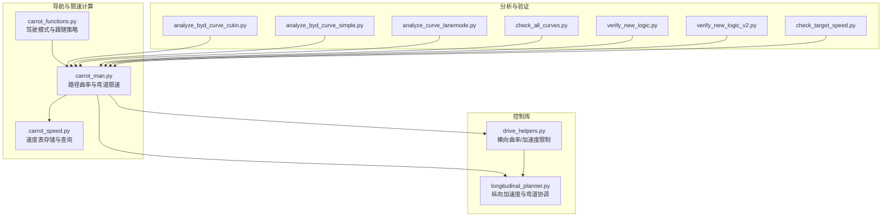
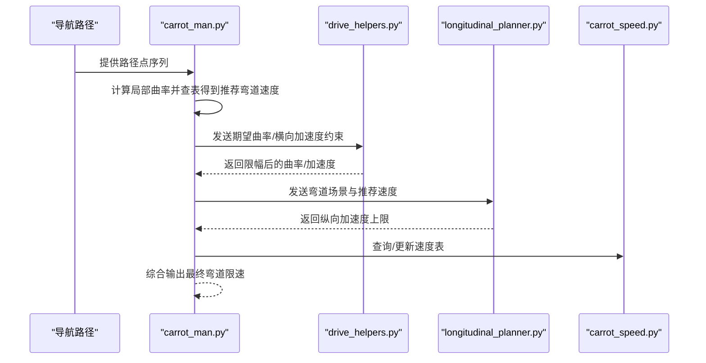
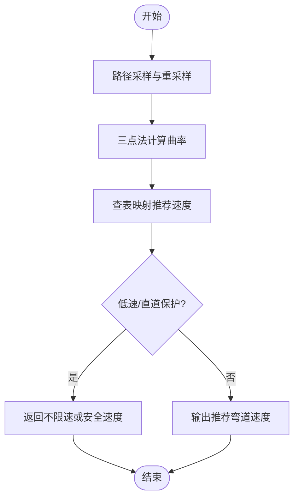
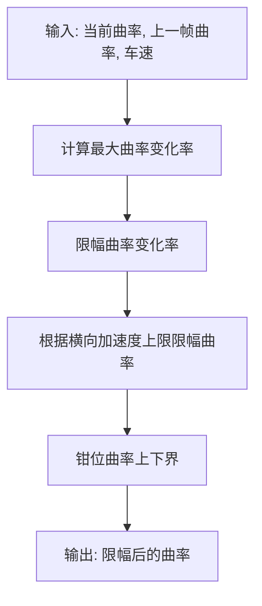
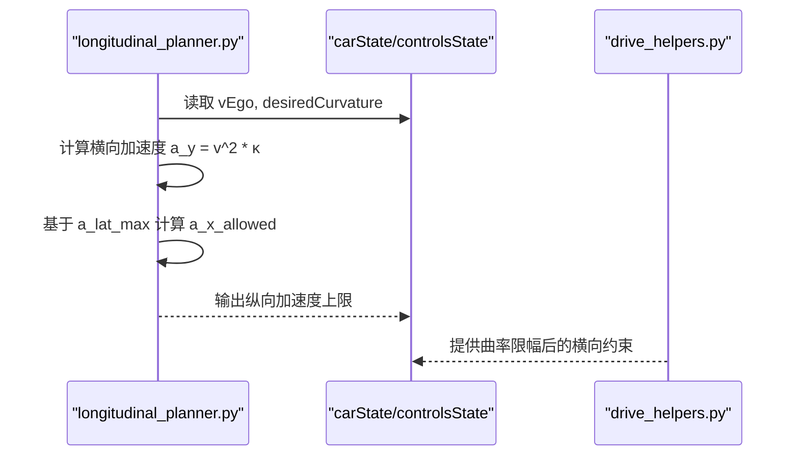
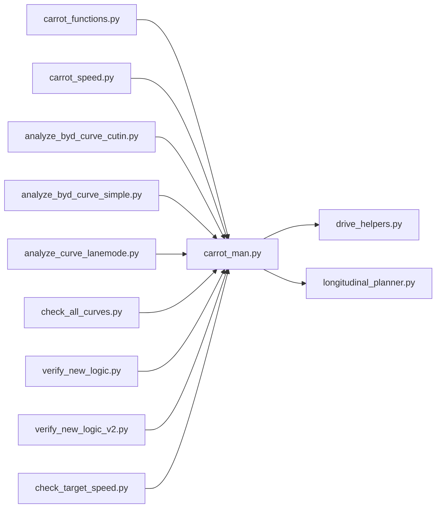

# 弯道限速计算

<cite>
**本文引用的文件**
- [selfdrive/carrot/carrot_man.py](file://selfdrive/carrot/carrot_man.py)
- [selfdrive/carrot/carrot_functions.py](file://selfdrive/carrot/carrot_functions.py)
- [selfdrive/carrot/carrot_speed.py](file://selfdrive/carrot/carrot_speed.py)
- [selfdrive/controls/lib/drive_helpers.py](file://selfdrive/controls/lib/drive_helpers.py)
- [selfdrive/controls/lib/longitudinal_planner.py](file://selfdrive/controls/lib/longitudinal_planner.py)
- [tools/analyze_byd_curve_cutin.py](file://tools/analyze_byd_curve_cutin.py)
- [tools/analyze_byd_curve_simple.py](file://tools/analyze_byd_curve_simple.py)
- [tools/analyze_curve_lanemode.py](file://tools/analyze_curve_lanemode.py)
- [check_all_curves.py](file://check_all_curves.py)
- [verify_new_logic.py](file://verify_new_logic.py)
- [verify_new_logic_v2.py](file://verify_new_logic_v2.py)
- [check_target_speed.py](file://check_target_speed.py)
- [原车acc增强系统设计.md](file://原车acc增强系统设计.md)
</cite>

## 目录
1. [简介](#简介)
2. [项目结构](#项目结构)
3. [核心组件](#核心组件)
4. [架构总览](#架构总览)
5. [详细组件分析](#详细组件分析)
6. [依赖关系分析](#依赖关系分析)
7. [性能考量](#性能考量)
8. [故障排查指南](#故障排查指南)
9. [结论](#结论)
10. [附录](#附录)

## 简介
本技术文档围绕“弯道限速计算”功能展开，系统阐述了从道路几何特征提取、曲率计算、弯道类型识别，到弯道限速决策与纵向/横向加速度平衡、与转向控制系统的协调机制，并结合实际代码库中的实现与分析脚本，给出可操作的配置参数、阈值设置与性能优化方法。

## 项目结构
与弯道限速计算直接相关的模块主要分布在以下位置：
- 自动驾驶控制与导航融合层：carrot_man、carrot_functions、carrot_speed
- 控制库：drive_helpers（横向曲率约束）、longitudinal_planner（纵向加速度与弯道协调）
- 工具与分析：多份针对 BYD 车型与弯道场景的分析脚本
- 设计文档：原车 ACC 增强系统设计文档中对弯道限速的公式与修复要点

图表来源
- [selfdrive/carrot/carrot_man.py:1-120](file://selfdrive/carrot/carrot_man.py#L1-L120)
- [selfdrive/carrot/carrot_functions.py:1-120](file://selfdrive/carrot/carrot_functions.py#L1-L120)
- [selfdrive/carrot/carrot_speed.py:1-120](file://selfdrive/carrot/carrot_speed.py#L1-L120)
- [selfdrive/controls/lib/drive_helpers.py:1-120](file://selfdrive/controls/lib/drive_helpers.py#L1-L120)
- [selfdrive/controls/lib/longitudinal_planner.py:1-120](file://selfdrive/controls/lib/longitudinal_planner.py#L1-L120)
- [tools/analyze_byd_curve_cutin.py:1-120](file://tools/analyze_byd_curve_cutin.py#L1-L120)
- [tools/analyze_byd_curve_simple.py:1-120](file://tools/analyze_byd_curve_simple.py#L1-L120)
- [tools/analyze_curve_lanemode.py:1-120](file://tools/analyze_curve_lanemode.py#L1-L120)
- [check_all_curves.py:1-60](file://check_all_curves.py#L1-L60)
- [verify_new_logic.py:1-60](file://verify_new_logic.py#L1-L60)
- [verify_new_logic_v2.py:60-103](file://verify_new_logic_v2.py#L60-L103)
- [check_target_speed.py:43-49](file://check_target_speed.py#L43-L49)

章节来源
- [selfdrive/carrot/carrot_man.py:1-120](file://selfdrive/carrot/carrot_man.py#L1-L120)
- [selfdrive/carrot/carrot_functions.py:1-120](file://selfdrive/carrot/carrot_functions.py#L1-L120)
- [selfdrive/carrot/carrot_speed.py:1-120](file://selfdrive/carrot/carrot_speed.py#L1-L120)
- [selfdrive/controls/lib/drive_helpers.py:1-120](file://selfdrive/controls/lib/drive_helpers.py#L1-L120)
- [selfdrive/controls/lib/longitudinal_planner.py:1-120](file://selfdrive/controls/lib/longitudinal_planner.py#L1-L120)

## 核心组件
- 路径曲率与弯道限速计算（carrot_man.py）
  - 基于导航路径采样点，使用三点法向量叉积计算曲率
  - 采用查表法将曲率映射为推荐弯道速度
  - 对低速与直道场景进行保护性处理，避免不适用场景下的异常限速
- 横向加速度与曲率限制（drive_helpers.py）
  - 依据车速与允许横向加速度，对曲率变化率与绝对值进行限幅
  - 考虑横摆角速度、滚动补偿与最大曲率差，确保横向稳定性
- 纵向加速度与弯道协调（longitudinal_planner.py）
  - 在弯道场景下根据横向加速度对纵向加速度上限进行折减
  - 与纵向 MPC/加速限制协同，避免弯道中纵向加速导致侧滑/失稳
- 驾驶模式与跟随策略（carrot_functions.py）
  - 提供驾驶模式因子、跟车时间间隔等参数，间接影响弯道限速的保守程度
- 速度表存储与查询（carrot_speed.py）
  - 以参数形式持久化存储速度表，支持按经纬度、航向与前瞻距离查询目标限速
- 分析与验证工具
  - BYD 车型内切压线分析、弯道事件检测、曲线场景统计与新逻辑验证脚本

章节来源
- [selfdrive/carrot/carrot_man.py:180-220](file://selfdrive/carrot/carrot_man.py#L180-L220)
- [selfdrive/controls/lib/drive_helpers.py:78-101](file://selfdrive/controls/lib/drive_helpers.py#L78-L101)
- [selfdrive/controls/lib/longitudinal_planner.py:57-84](file://selfdrive/controls/lib/longitudinal_planner.py#L57-L84)
- [selfdrive/carrot/carrot_functions.py:186-198](file://selfdrive/carrot/carrot_functions.py#L186-L198)
- [selfdrive/carrot/carrot_speed.py:181-246](file://selfdrive/carrot/carrot_speed.py#L181-L246)
- [tools/analyze_byd_curve_cutin.py:1-120](file://tools/analyze_byd_curve_cutin.py#L1-L120)
- [tools/analyze_byd_curve_simple.py:1-120](file://tools/analyze_byd_curve_simple.py#L1-L120)
- [tools/analyze_curve_lanemode.py:1-120](file://tools/analyze_curve_lanemode.py#L1-L120)
- [check_all_curves.py:1-60](file://check_all_curves.py#L1-L60)
- [verify_new_logic.py:1-60](file://verify_new_logic.py#L1-L60)
- [verify_new_logic_v2.py:60-103](file://verify_new_logic_v2.py#L60-L103)
- [check_target_speed.py:43-49](file://check_target_speed.py#L43-L49)

## 架构总览
弯道限速计算贯穿“感知-建模-决策-控制”的闭环：
- 导航路径采样与曲率计算：carrot_man 从导航坐标中提取路径点，计算局部曲率并映射为推荐弯道速度
- 限速保护与修正：对低速/直道场景进行保护，避免不适用场景下的异常限速
- 横向稳定性约束：drive_helpers 基于最大横向加速度与车速对曲率进行限幅
- 纵向协调：longitudinal_planner 在弯道中对纵向加速度上限进行折减，防止纵向加速引发侧滑
- 参数与策略：carrot_functions 提供驾驶模式与跟车策略参数；carrot_speed 提供速度表的存储与查询能力
- 分析与验证：通过多类分析脚本对弯道事件、横向加速度、内切压线等问题进行诊断与验证

图表来源
- [selfdrive/carrot/carrot_man.py:520-581](file://selfdrive/carrot/carrot_man.py#L520-L581)
- [selfdrive/controls/lib/drive_helpers.py:78-101](file://selfdrive/controls/lib/drive_helpers.py#L78-L101)
- [selfdrive/controls/lib/longitudinal_planner.py:57-84](file://selfdrive/controls/lib/longitudinal_planner.py#L57-L84)
- [selfdrive/carrot/carrot_speed.py:248-278](file://selfdrive/carrot/carrot_speed.py#L248-L278)

## 详细组件分析

### 路径曲率与弯道限速计算（carrot_man.py）
- 道路几何特征提取
  - 通过导航路径采样点，使用三点法向量叉积计算曲率
  - 对路径进行重采样与插值，保证曲率计算的稳定性
- 曲率计算与映射
  - 使用查表法将曲率映射为推荐弯道速度，兼顾不同曲率等级的安全速度
  - 对低速与直道场景进行保护，避免不适用场景下的异常限速
- 弯道类型识别与处理
  - 基于曲率绝对值与持续时间，识别急弯、缓弯与连续弯道
  - 对不同曲率区间采用不同的减速比例策略（参考验证脚本）

图表来源
- [selfdrive/carrot/carrot_man.py:520-581](file://selfdrive/carrot/carrot_man.py#L520-L581)
- [selfdrive/carrot/carrot_man.py:180-220](file://selfdrive/carrot/carrot_man.py#L180-L220)

章节来源
- [selfdrive/carrot/carrot_man.py:180-220](file://selfdrive/carrot/carrot_man.py#L180-L220)
- [selfdrive/carrot/carrot_man.py:520-581](file://selfdrive/carrot/carrot_man.py#L520-L581)

### 横向加速度与曲率限制（drive_helpers.py）
- 曲率限幅策略
  - 基于车速与允许横向加速度，对曲率变化率进行限幅
  - 对曲率绝对值进行上限/下限钳位，避免过大曲率导致侧滑
  - 考虑滚动补偿与最大曲率差，提升稳定性
- 与转向控制的协调
  - 通过对曲率的限幅，间接约束转向执行器的响应速率与幅度

图表来源
- [selfdrive/controls/lib/drive_helpers.py:78-101](file://selfdrive/controls/lib/drive_helpers.py#L78-L101)

章节来源
- [selfdrive/controls/lib/drive_helpers.py:78-101](file://selfdrive/controls/lib/drive_helpers.py#L78-L101)

### 纵向加速度与弯道协调（longitudinal_planner.py）
- 弯道纵向加速度折减
  - 在弯道中根据横向加速度对纵向加速度上限进行折减，避免纵向加速导致侧滑
  - 与纵向 MPC/加速限制协同，确保纵向控制稳定
- 与横向控制的耦合
  - 通过 desiredCurvature 获取当前弯道曲率，据此调整纵向加速度上限

图表来源
- [selfdrive/controls/lib/longitudinal_planner.py:57-84](file://selfdrive/controls/lib/longitudinal_planner.py#L57-L84)
- [selfdrive/controls/lib/longitudinal_planner.py:168-171](file://selfdrive/controls/lib/longitudinal_planner.py#L168-L171)

章节来源
- [selfdrive/controls/lib/longitudinal_planner.py:57-84](file://selfdrive/controls/lib/longitudinal_planner.py#L57-L84)
- [selfdrive/controls/lib/longitudinal_planner.py:168-171](file://selfdrive/controls/lib/longitudinal_planner.py#L168-L171)

### 弯道类型识别与处理
- 急弯/缓弯/连续弯道
  - 通过曲率绝对值阈值区分急弯与缓弯
  - 通过持续时间判断连续弯道
- 减速比例策略
  - 不同曲率区间采用不同的减速比例，避免过度减速或不足

章节来源
- [verify_new_logic_v2.py:77-84](file://verify_new_logic_v2.py#L77-L84)

### 弯道限速与车辆动态性能的关系
- 纵向与横向加速度平衡
  - 弯道中横向加速度与纵向加速度共同决定车辆稳定性边界
  - 通过横向加速度上限对纵向加速度进行折减，确保安全裕度
- 与转向控制系统的协调
  - 通过曲率限幅与横向加速度约束，避免转向响应过激导致的内切压线

章节来源
- [selfdrive/controls/lib/longitudinal_planner.py:57-84](file://selfdrive/controls/lib/longitudinal_planner.py#L57-L84)
- [selfdrive/controls/lib/drive_helpers.py:78-101](file://selfdrive/controls/lib/drive_helpers.py#L78-L101)

### 与转向控制系统的协调机制
- 曲率限幅与转向响应
  - drive_helpers 对曲率变化率与绝对值进行限幅，避免转向执行器响应过激
- 弯道场景下的转向与纵向配合
  - carrot_man 输出推荐弯道速度，longitudinal_planner 在弯道中对纵向加速度进行折减，二者协同保障稳定性

章节来源
- [selfdrive/controls/lib/drive_helpers.py:78-101](file://selfdrive/controls/lib/drive_helpers.py#L78-L101)
- [selfdrive/controls/lib/longitudinal_planner.py:57-84](file://selfdrive/controls/lib/longitudinal_planner.py#L57-L84)

### 配置参数、阈值与性能优化
- 路径曲率与速度映射
  - 查表参数：V_CURVE_LOOKUP_BP/V_CRUVE_LOOKUP_VALS
  - 保护阈值：低速/直道保护，避免异常限速
- 横向加速度与曲率限制
  - 最大横向加速度、曲率变化率上限、曲率上下限
- 纵向加速度折减
  - 弯道横向加速度上限、纵向加速度上限折减策略
- 参数与策略
  - 驾驶模式因子、跟车时间间隔、自动导航减速率等

章节来源
- [selfdrive/carrot/carrot_man.py:43-58](file://selfdrive/carrot/carrot_man.py#L43-L58)
- [selfdrive/controls/lib/drive_helpers.py:15-18](file://selfdrive/controls/lib/drive_helpers.py#L15-L18)
- [selfdrive/controls/lib/longitudinal_planner.py:28-31](file://selfdrive/controls/lib/longitudinal_planner.py#L28-L31)
- [selfdrive/carrot/carrot_functions.py:177-182](file://selfdrive/carrot/carrot_functions.py#L177-L182)

## 依赖关系分析
- carrot_man 依赖 drive_helpers 的曲率限幅能力与 longitudinal_planner 的纵向加速度折减能力
- carrot_functions 提供驾驶模式与跟车策略参数，间接影响弯道限速的保守程度
- carrot_speed 提供速度表的存储与查询，支撑导航限速的落地

图表来源
- [selfdrive/carrot/carrot_man.py:1-120](file://selfdrive/carrot/carrot_man.py#L1-L120)
- [selfdrive/controls/lib/drive_helpers.py:1-120](file://selfdrive/controls/lib/drive_helpers.py#L1-L120)
- [selfdrive/controls/lib/longitudinal_planner.py:1-120](file://selfdrive/controls/lib/longitudinal_planner.py#L1-L120)
- [selfdrive/carrot/carrot_functions.py:1-120](file://selfdrive/carrot/carrot_functions.py#L1-L120)
- [selfdrive/carrot/carrot_speed.py:1-120](file://selfdrive/carrot/carrot_speed.py#L1-L120)
- [tools/analyze_byd_curve_cutin.py:1-120](file://tools/analyze_byd_curve_cutin.py#L1-L120)
- [tools/analyze_byd_curve_simple.py:1-120](file://tools/analyze_byd_curve_simple.py#L1-L120)
- [tools/analyze_curve_lanemode.py:1-120](file://tools/analyze_curve_lanemode.py#L1-L120)
- [check_all_curves.py:1-60](file://check_all_curves.py#L1-L60)
- [verify_new_logic.py:1-60](file://verify_new_logic.py#L1-L60)
- [verify_new_logic_v2.py:60-103](file://verify_new_logic_v2.py#L60-L103)
- [check_target_speed.py:43-49](file://check_target_speed.py#L43-L49)

## 性能考量
- 计算复杂度
  - 路径曲率计算与查表映射为 O(n)，其中 n 为采样点数量
  - 横向/纵向限幅与折减为 O(1)
- 实时性
  - 采样与计算周期需与控制周期匹配，避免引入额外延迟
- 稳定性
  - 通过曲率变化率与绝对值限幅，减少高频扰动
  - 在低速/直道场景下提供保护，避免误触发

## 故障排查指南
- BYD 车型内切压线问题
  - 使用 analyze_byd_curve_cutin.py 与 analyze_byd_curve_simple.py 检测横向加速度与方向盘扭矩
  - 关注横向加速度峰值与方向盘扭矩峰值，评估横向控制参数是否过激
- 弯道事件检测与统计
  - 使用 analyze_curve_lanemode.py 识别弯道事件、切换点与车道中心偏移
- 新逻辑验证
  - 使用 verify_new_logic.py 与 verify_new_logic_v2.py 验证基于横向加速度的安全速度计算
- 目标速度问题分析
  - 使用 check_target_speed.py 分析原公式与新公式的差异，定位目标速度异常

章节来源
- [tools/analyze_byd_curve_cutin.py:1-120](file://tools/analyze_byd_curve_cutin.py#L1-L120)
- [tools/analyze_byd_curve_simple.py:1-120](file://tools/analyze_byd_curve_simple.py#L1-L120)
- [tools/analyze_curve_lanemode.py:1-120](file://tools/analyze_curve_lanemode.py#L1-L120)
- [verify_new_logic.py:1-60](file://verify_new_logic.py#L1-L60)
- [verify_new_logic_v2.py:60-103](file://verify_new_logic_v2.py#L60-L103)
- [check_target_speed.py:43-49](file://check_target_speed.py#L43-L49)

## 结论
弯道限速计算通过“路径曲率提取—推荐速度映射—横向/纵向约束—参数与策略调节”的闭环实现，既保证了安全性，又兼顾了舒适性与实时性。通过对 BYD 车型内切压线问题的分析与新逻辑验证，进一步完善了低速/直道场景的保护机制与减速比例策略。建议在实际部署中结合车辆动态特性与驾驶模式，动态调整横向加速度上限与减速策略，持续优化弯道稳定性与乘客体验。

## 附录
- 弯道限速公式与修复要点（来自设计文档）
  - 推荐弯道速度 = min(√(最大横向加速度 × 曲率半径), 道路限速 × 0.8, 当前巡航速度 − 5km/h)
  - 修复要点：低速不计算、直道不计算、最小曲率保护、方向性处理

章节来源
- [原车acc增强系统设计.md:195-202](file://原车acc增强系统设计.md#L195-L202)
- [原车acc增强系统设计.md:824-868](file://原车acc增强系统设计.md#L824-L868)