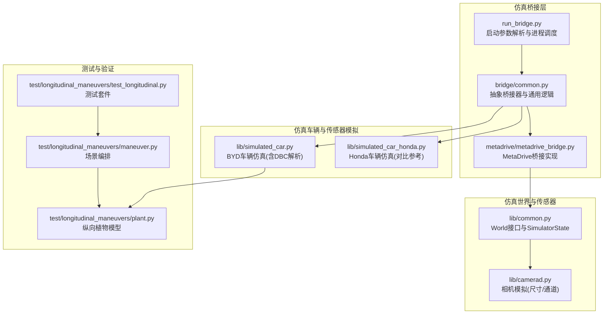
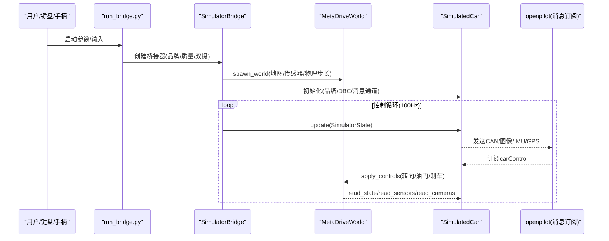
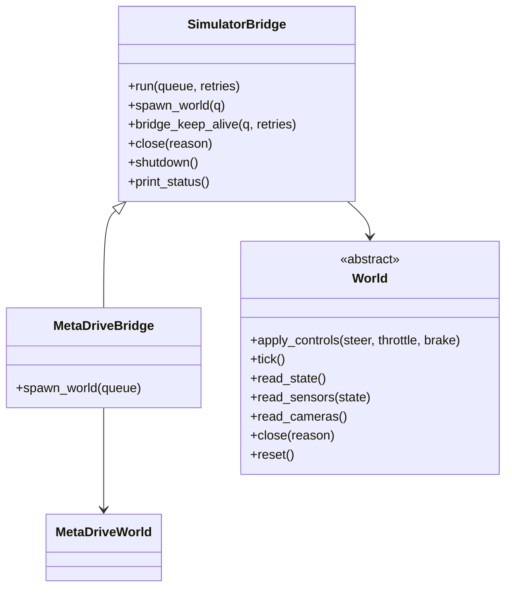
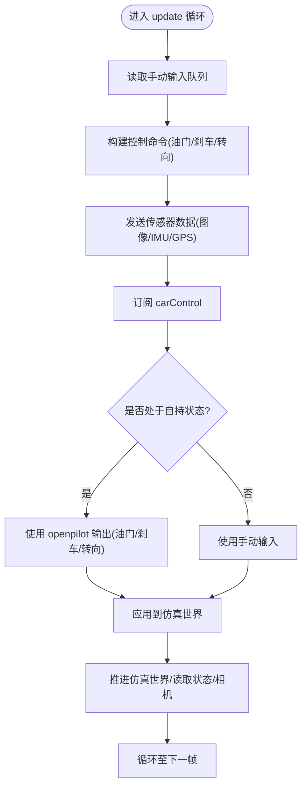
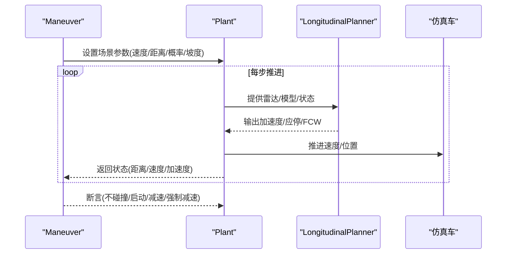
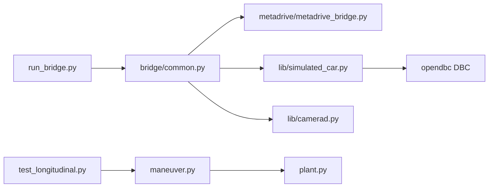

# 仿真工具

<cite>
**本文引用的文件**
- [tools/sim/README.md](file://tools/sim/README.md)
- [tools/sim/run_bridge.py](file://tools/sim/run_bridge.py)
- [tools/sim/bridge/common.py](file://tools/sim/bridge/common.py)
- [tools/sim/bridge/metadrive/metadrive_bridge.py](file://tools/sim/bridge/metadrive/metadrive_bridge.py)
- [tools/sim/lib/common.py](file://tools/sim/lib/common.py)
- [tools/sim/lib/simulated_car.py](file://tools/sim/lib/simulated_car.py)
- [tools/sim/lib/simulated_car_honda.py](file://tools/sim/lib/simulated_car_honda.py)
- [selfdrive/test/longitudinal_maneuvers/plant.py](file://selfdrive/test/longitudinal_maneuvers/plant.py)
- [selfdrive/test/longitudinal_maneuvers/maneuver.py](file://selfdrive/test/longitudinal_maneuvers/maneuver.py)
- [selfdrive/test/longitudinal_maneuvers/test_longitudinal.py](file://selfdrive/test/longitudinal_maneuvers/test_longitudinal.py)
- [selfdrive/controls/lib/longcontrol.py](file://selfdrive/controls/lib/longcontrol.py)
- [selfdrive/controls/lib/longitudinal_mpc_lib/long_mpc.py](file://selfdrive/controls/lib/longitudinal_mpc_lib/long_mpc.py)
- [selfdrive/controls/lib/latcontrol_torque.py](file://selfdrive/controls/lib/latcontrol_torque.py)
- [simulate_laneless_integral_fix.py](file://simulate_laneless_integral_fix.py)
</cite>

## 目录
1. [简介](#简介)
2. [项目结构](#项目结构)
3. [核心组件](#核心组件)
4. [架构总览](#架构总览)
5. [详细组件分析](#详细组件分析)
6. [依赖关系分析](#依赖关系分析)
7. [性能考量](#性能考量)
8. [故障排查指南](#故障排查指南)
9. [结论](#结论)
10. [附录](#附录)

## 简介
本文件面向“仿真工具”的使用者与开发者，系统化阐述仿真系统的实现细节、仿真架构与策略，以及如何在仿真环境中搭建与配置车辆仿真环境、生成驾驶与测试场景、运行仿真测试。文档还解释了仿真桥接器的工作机制与扩展方法，覆盖纵向操控仿真与动态测试的实现要点，并给出与真实系统的集成关系说明。文中所有技术细节均基于仓库中的实际源码进行分析与溯源。

## 项目结构
仿真子系统主要由以下部分组成：
- 仿真桥接层：负责连接仿真引擎与 openpilot 的消息通道，管理世界状态、传感器与控制指令的交互。
- 仿真世界与传感器：封装仿真引擎（如 MetaDrive）的场景、地图、相机等。
- 仿真车辆与传感器模拟：向 openpilot 发送 CAN/图像/IMU/GPS 等仿真数据，接收控制指令并驱动仿真世界。
- 测试与验证：提供纵向操控的仿真平台与多种驾驶场景测试用例。

**图表来源**
- [tools/sim/run_bridge.py:1-66](file://tools/sim/run_bridge.py#L1-L66)
- [tools/sim/bridge/common.py:40-212](file://tools/sim/bridge/common.py#L40-L212)
- [tools/sim/bridge/metadrive/metadrive_bridge.py:50-96](file://tools/sim/bridge/metadrive/metadrive_bridge.py#L50-L96)
- [tools/sim/lib/common.py:37-101](file://tools/sim/lib/common.py#L37-L101)
- [tools/sim/lib/simulated_car.py:108-236](file://tools/sim/lib/simulated_car.py#L108-L236)
- [tools/sim/lib/simulated_car_honda.py:12-112](file://tools/sim/lib/simulated_car_honda.py#L12-L112)
- [selfdrive/test/longitudinal_maneuvers/plant.py:14-185](file://selfdrive/test/longitudinal_maneuvers/plant.py#L14-L185)
- [selfdrive/test/longitudinal_maneuvers/maneuver.py:5-84](file://selfdrive/test/longitudinal_maneuvers/maneuver.py#L5-L84)
- [selfdrive/test/longitudinal_maneuvers/test_longitudinal.py:8-192](file://selfdrive/test/longitudinal_maneuvers/test_longitudinal.py#L8-L192)

**章节来源**
- [tools/sim/README.md:1-50](file://tools/sim/README.md#L1-L50)
- [tools/sim/run_bridge.py:1-66](file://tools/sim/run_bridge.py#L1-L66)

## 核心组件
- 仿真桥接器（SimulatorBridge 抽象类）：统一管理仿真生命周期、速率控制、传感器与车辆线程、手动输入队列、世界状态同步与退出流程。
- MetaDrive 桥接器（MetaDriveBridge）：具体实现，负责构建仿真地图、传感器配置、物理步长与渲染开关。
- 仿真世界（World 抽象类）：定义 apply_controls/tick/read_state/read_sensors/read_cameras/close/reset 等接口。
- 仿真车辆（SimulatedCar）：按品牌（默认 BYD）构造 CAN 消息与 DBC 解析器，向 openpilot 发送 CAN/图像/IMU/GPS 等；接收 carControl 并驱动仿真世界。
- 纵向控制与 MPC 参数：提供纵向个性化的跟随距离、舒适制动、时间窗等参数，支撑仿真测试场景。
- 纵向植物模型（Plant）：在测试中模拟“被控对象”，根据雷达/模型输入输出加速度与状态，供纵向控制器验证。
- 场景编排（Maneuver）：通过分段函数定义相对目标车速、概率、巡航设定等，形成可重复的测试场景。
- 测试套件（TestLongitudinalControl）：组合多种场景，断言不碰撞、启动/减速行为等。

**章节来源**
- [tools/sim/bridge/common.py:40-212](file://tools/sim/bridge/common.py#L40-L212)
- [tools/sim/bridge/metadrive/metadrive_bridge.py:50-96](file://tools/sim/bridge/metadrive/metadrive_bridge.py#L50-L96)
- [tools/sim/lib/common.py:64-101](file://tools/sim/lib/common.py#L64-L101)
- [tools/sim/lib/simulated_car.py:108-236](file://tools/sim/lib/simulated_car.py#L108-L236)
- [selfdrive/controls/lib/longitudinal_mpc_lib/long_mpc.py:50-88](file://selfdrive/controls/lib/longitudinal_mpc_lib/long_mpc.py#L50-L88)
- [selfdrive/test/longitudinal_maneuvers/plant.py:14-185](file://selfdrive/test/longitudinal_maneuvers/plant.py#L14-L185)
- [selfdrive/test/longitudinal_maneuvers/maneuver.py:5-84](file://selfdrive/test/longitudinal_maneuvers/maneuver.py#L5-L84)
- [selfdrive/test/longitudinal_maneuvers/test_longitudinal.py:8-192](file://selfdrive/test/longitudinal_maneuvers/test_longitudinal.py#L8-L192)

## 架构总览
仿真系统采用“桥接器-世界-车辆-测试”分层架构：
- 桥接器负责进程与线程管理、速率控制、手动输入与仿真世界交互。
- 世界负责物理仿真推进、传感器读取与图像采集。
- 车辆负责向 openpilot 发送仿真数据（CAN/图像/IMU/GPS），并从 carControl 推导实际控制量。
- 测试层通过 Plant 与 Maneuver 构建场景，验证纵向控制策略与鲁棒性。

**图表来源**
- [tools/sim/run_bridge.py:22-66](file://tools/sim/run_bridge.py#L22-L66)
- [tools/sim/bridge/common.py:106-212](file://tools/sim/bridge/common.py#L106-L212)
- [tools/sim/bridge/metadrive/metadrive_bridge.py:62-96](file://tools/sim/bridge/metadrive/metadrive_bridge.py#L62-L96)
- [tools/sim/lib/simulated_car.py:299-800](file://tools/sim/lib/simulated_car.py#L299-L800)

## 详细组件分析

### 仿真桥接器与世界接口
- 抽象桥接器（SimulatorBridge）：统一管理速率控制、手动输入队列、世界生命周期、线程与退出事件；提供 run/spawn_world/_run 等核心流程。
- 世界接口（World）：定义 apply_controls/tick/read_state/read_sensors/read_cameras/close/reset 等抽象方法，便于替换不同仿真引擎。
- MetaDrive 桥接器（MetaDriveBridge）：根据配置启用渲染、设置传感器（道路/广角）、地图与物理步长，创建 MetaDriveWorld 实例。

**图表来源**
- [tools/sim/bridge/common.py:40-104](file://tools/sim/bridge/common.py#L40-L104)
- [tools/sim/bridge/metadrive/metadrive_bridge.py:50-96](file://tools/sim/bridge/metadrive/metadrive_bridge.py#L50-L96)
- [tools/sim/lib/common.py:64-101](file://tools/sim/lib/common.py#L64-L101)

**章节来源**
- [tools/sim/bridge/common.py:40-120](file://tools/sim/bridge/common.py#L40-L120)
- [tools/sim/bridge/metadrive/metadrive_bridge.py:50-96](file://tools/sim/bridge/metadrive/metadrive_bridge.py#L50-L96)
- [tools/sim/lib/common.py:64-101](file://tools/sim/lib/common.py#L64-L101)

### 仿真车辆与传感器模拟（BYD/Honda）
- BYD 仿真（SimulatedCar）：初始化 CANPacker/CANParser，按 DBC 定义构造多总线消息（ESC/MPC），周期性发送 EPS/CARSPEED/PEDAL/PCM_BUTTONS/RADAR_MRR 等；解析 CAN 以验证信号可用性；向 openpilot 发送 carParams、CAN、pandaStates、selfdriveState 等消息。
- Honda 仿真（SimulatedCar）：提供对比参考，展示不同品牌的 CAN 消息集合与发送策略。
- 传感器模拟：SimulatedSensors 将世界状态转换为图像帧并通过消息通道发送。

**图表来源**
- [tools/sim/bridge/common.py:126-212](file://tools/sim/bridge/common.py#L126-L212)
- [tools/sim/lib/simulated_car.py:299-800](file://tools/sim/lib/simulated_car.py#L299-L800)

**章节来源**
- [tools/sim/lib/simulated_car.py:108-236](file://tools/sim/lib/simulated_car.py#L108-L236)
- [tools/sim/lib/simulated_car.py:299-800](file://tools/sim/lib/simulated_car.py#L299-L800)
- [tools/sim/lib/simulated_car_honda.py:12-112](file://tools/sim/lib/simulated_car_honda.py#L12-L112)

### 纵向操控仿真与动态测试
- 纵向植物模型（Plant）：发布 radarState/controlsState/selfdriveState/carState/longitudinalPlan 等消息，驱动纵向规划器，输出加速度与应停状态，推进仿真车速与位置。
- 场景编排（Maneuver）：通过分段函数定义目标车速、概率、巡航设定、坡度与油门允许概率，形成多样化测试场景。
- 测试套件（TestLongitudinalControl）：组合多种场景，断言不碰撞、启动/减速行为、强制减速停止等。

**图表来源**
- [selfdrive/test/longitudinal_maneuvers/maneuver.py:31-84](file://selfdrive/test/longitudinal_maneuvers/maneuver.py#L31-L84)
- [selfdrive/test/longitudinal_maneuvers/plant.py:60-175](file://selfdrive/test/longitudinal_maneuvers/plant.py#L60-L175)
- [selfdrive/test/longitudinal_maneuvers/test_longitudinal.py:186-192](file://selfdrive/test/longitudinal_maneuvers/test_longitudinal.py#L186-L192)

**章节来源**
- [selfdrive/test/longitudinal_maneuvers/plant.py:14-185](file://selfdrive/test/longitudinal_maneuvers/plant.py#L14-L185)
- [selfdrive/test/longitudinal_maneuvers/maneuver.py:5-84](file://selfdrive/test/longitudinal_maneuvers/maneuver.py#L5-L84)
- [selfdrive/test/longitudinal_maneuvers/test_longitudinal.py:8-192](file://selfdrive/test/longitudinal_maneuvers/test_longitudinal.py#L8-L192)

### 仿真参数与配置选项
- 运行参数（run_bridge.py）：支持 --joystick/--high_quality/--dual_camera/--car_brand/--disable_debug 等。
- 桥接器配置（MetaDriveBridge）：地图、传感器、渲染、交通密度、物理步长等。
- 车辆参数（SimulatedCar）：品牌选择、DBC 文件、消息频率、CAN 字段映射与校验。
- 纵向参数（long_mpc.py）：时间窗、舒适制动、跟随距离、个性化的跟车时间等。

**章节来源**
- [tools/sim/run_bridge.py:26-66](file://tools/sim/run_bridge.py#L26-L66)
- [tools/sim/bridge/metadrive/metadrive_bridge.py:70-96](file://tools/sim/bridge/metadrive/metadrive_bridge.py#L70-L96)
- [tools/sim/lib/simulated_car.py:237-291](file://tools/sim/lib/simulated_car.py#L237-L291)
- [selfdrive/controls/lib/longitudinal_mpc_lib/long_mpc.py:50-88](file://selfdrive/controls/lib/longitudinal_mpc_lib/long_mpc.py#L50-L88)

## 依赖关系分析
- 模块耦合：
  - run_bridge.py 仅依赖桥接器入口，便于扩展其他仿真引擎。
  - SimulatorBridge 统一调度 World/SimulatedCar/SimulatedSensors 线程，降低耦合。
  - SimulatedCar 依赖 DBC 与 CAN 解析器，与 openpilot 消息通道解耦。
- 外部依赖：
  - MetaDrive 引擎（通过 metadrive_bridge）。
  - cereal 消息通道与 opendbc DBC。
- 潜在风险：
  - DBC 解析器初始化失败时的降级处理（模拟类）。
  - 传感器/图像通道的 CUDA 能力与渲染开关影响性能。

**图表来源**
- [tools/sim/run_bridge.py:12-20](file://tools/sim/run_bridge.py#L12-L20)
- [tools/sim/bridge/common.py:106-120](file://tools/sim/bridge/common.py#L106-L120)
- [tools/sim/bridge/metadrive/metadrive_bridge.py:62-96](file://tools/sim/bridge/metadrive/metadrive_bridge.py#L62-L96)
- [tools/sim/lib/simulated_car.py:108-130](file://tools/sim/lib/simulated_car.py#L108-L130)
- [selfdrive/test/longitudinal_maneuvers/test_longitudinal.py:181-192](file://selfdrive/test/longitudinal_maneuvers/test_longitudinal.py#L181-L192)
- [selfdrive/test/longitudinal_maneuvers/maneuver.py:31-42](file://selfdrive/test/longitudinal_maneuvers/maneuver.py#L31-L42)
- [selfdrive/test/longitudinal_maneuvers/plant.py:21-27](file://selfdrive/test/longitudinal_maneuvers/plant.py#L21-L27)

**章节来源**
- [tools/sim/bridge/common.py:106-120](file://tools/sim/bridge/common.py#L106-L120)
- [tools/sim/lib/simulated_car.py:108-130](file://tools/sim/lib/simulated_car.py#L108-L130)
- [selfdrive/test/longitudinal_maneuvers/test_longitudinal.py:181-192](file://selfdrive/test/longitudinal_maneuvers/test_longitudinal.py#L181-L192)

## 性能考量
- 物理步长与帧率：MetaDriveBridge 中设置 physics_world_step_size 与 TICKS_PER_FRAME，直接影响仿真实时性与稳定性。
- 渲染与传感器：开启渲染与双目相机会显著增加 GPU/CPU 开销；可通过 --high_quality/--dual_camera 控制。
- 速率控制：SimulatorBridge 使用 Ratekeeper 控制主循环节奏，避免过载。
- CAN 消息频率：不同消息按需发送（如 BCM/EPB 按固定频率），减少冗余。
- 测试场景：通过 TrafficDensity=0 关闭交通，降低复杂度。

**章节来源**
- [tools/sim/bridge/metadrive/metadrive_bridge.py:89-93](file://tools/sim/bridge/metadrive/metadrive_bridge.py#L89-L93)
- [tools/sim/bridge/common.py:48-49](file://tools/sim/bridge/common.py#L48-L49)
- [tools/sim/lib/simulated_car.py:388-401](file://tools/sim/lib/simulated_car.py#L388-L401)

## 故障排查指南
- 无法启动仿真：
  - 检查 run_bridge.py 的参数与环境变量（--disable-debug 默认启用禁用调试输出）。
  - 确认 MetaDriveBridge 的地图与传感器配置是否正确。
- openpilot 未响应：
  - 确认 SimulatedCar 已发送 carParams 与 CAN 消息。
  - 检查 DBC 解析器初始化与消息可用性（调试打印）。
- 控制异常或不稳定：
  - 调整物理步长与帧率，降低 --high_quality 或关闭 --dual_camera。
  - 检查纵向参数（停止距离、舒适制动、个性化的跟车时间）。
- 积分漂移与车道保持异常：
  - 参考 laneless 积分修复模拟脚本，定位直道上的积分项异常并进行抑制策略验证。

**章节来源**
- [tools/sim/run_bridge.py:36-66](file://tools/sim/run_bridge.py#L36-L66)
- [tools/sim/bridge/metadrive/metadrive_bridge.py:70-96](file://tools/sim/bridge/metadrive/metadrive_bridge.py#L70-L96)
- [tools/sim/lib/simulated_car.py:209-236](file://tools/sim/lib/simulated_car.py#L209-L236)
- [selfdrive/controls/lib/longitudinal_mpc_lib/long_mpc.py:50-88](file://selfdrive/controls/lib/longitudinal_mpc_lib/long_mpc.py#L50-L88)
- [simulate_laneless_integral_fix.py:207-246](file://simulate_laneless_integral_fix.py#L207-L246)

## 结论
该仿真工具通过“桥接器-世界-车辆-测试”的清晰分层，实现了与 openpilot 的紧密集成与可扩展的仿真能力。BYD/Honda 的仿真车辆与 CAN 消息模拟为纵向与横向控制提供了稳定输入；纵向植物模型与场景编排则为动态测试提供了系统化验证手段。通过合理的参数配置与性能优化，可在保证实时性的前提下完成复杂场景的仿真验证。

## 附录

### 快速开始与常用命令
- 启动 openpilot（本地）：参考 tools/sim/README.md 中的说明。
- 启动仿真桥接器：执行 run_bridge.py，默认使用 BYD 车型，支持键盘/手柄输入与双摄配置。

**章节来源**
- [tools/sim/README.md:6-50](file://tools/sim/README.md#L6-L50)
- [tools/sim/run_bridge.py:22-66](file://tools/sim/run_bridge.py#L22-L66)

### 纵向控制参数与策略
- 个性化参数：根据个性化的跟随时间与舒适制动系数调整纵向行为。
- 状态机与 PID：纵向控制包含启动/停止/保持等状态，结合 PID 与限幅实现平滑控制。

**章节来源**
- [selfdrive/controls/lib/longitudinal_mpc_lib/long_mpc.py:50-88](file://selfdrive/controls/lib/longitudinal_mpc_lib/long_mpc.py#L50-L88)
- [selfdrive/controls/lib/longcontrol.py:54-99](file://selfdrive/controls/lib/longcontrol.py#L54-L99)

### 横向控制参数与定制
- 扭矩型横向控制支持自定义参数（比例/积分/微分/摩擦等），可通过参数键进行在线调节。

**章节来源**
- [selfdrive/controls/lib/latcontrol_torque.py:145-165](file://selfdrive/controls/lib/latcontrol_torque.py#L145-L165)