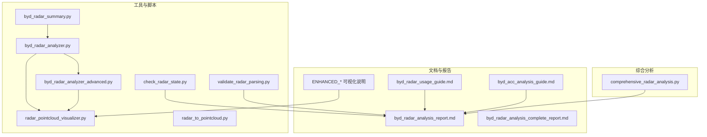
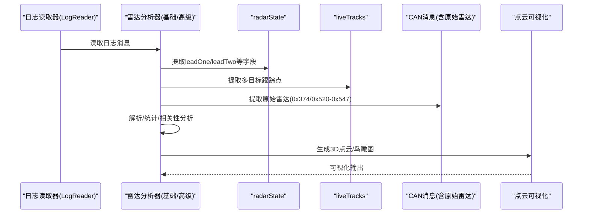
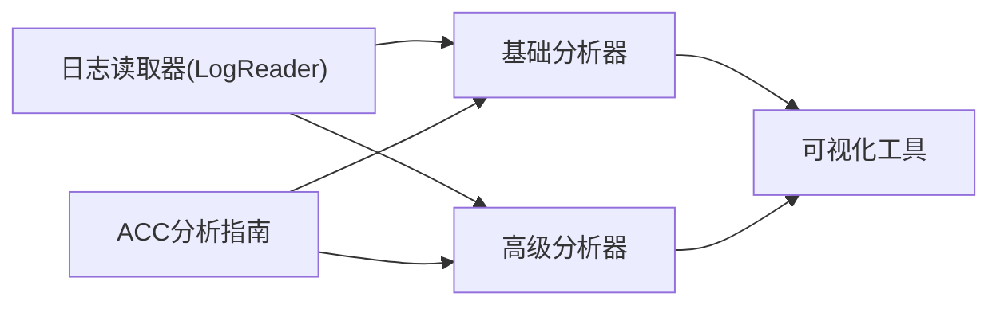

# 分析工具

<cite>
**本文引用的文件**
- [byd_radar_analyzer.py](file://tools/byd_radar_analyzer.py)
- [byd_radar_summary.py](file://tools/byd_radar_summary.py)
- [byd_radar_analyzer_advanced.py](file://tools/byd_radar_analyzer_advanced.py)
- [byd_radar_usage_guide.md](file://tools/byd_radar_usage_guide.md)
- [byd_acc_analysis_guide.md](file://docs/byd_acc_analysis_guide.md)
- [byd_radar_analysis_report.md](file://tools/byd_radar_analysis_report.md)
- [byd_radar_analysis_complete_report.md](file://tools/byd_radar_analysis_complete_report.md)
- [check_radar_state.py](file://tools/check_radar_state.py)
- [validate_radar_parsing.py](file://validate_radar_parsing.py)
- [radar_pointcloud_visualizer.py](file://radar_pointcloud_visualizer.py)
- [radar_to_pointcloud.py](file://radar_to_pointcloud.py)
- [comprehensive_radar_analysis.py](file://comprehensive_radar_analysis.py)
- [ENHANCED_VISUALIZATION_FEATURES_README.md](file://ENHANCED_VISUALIZATION_FEATURES_README.md)
- [ENHANCED_RECTANGULAR_VEHICLE_FRAME_README.md](file://ENHANCED_RECTANGULAR_VEHICLE_FRAME_README.md)
- [ENHANCED_CORNER_MARKERS_AND_DIRECTION_INDICATOR_README.md](file://ENHANCED_CORNER_MARKERS_AND_DIRECTION_INDICATOR_README.md)
</cite>

## 目录
1. [简介](#简介)
2. [项目结构](#项目结构)
3. [核心组件](#核心组件)
4. [架构总览](#架构总览)
5. [详细组件分析](#详细组件分析)
6. [依赖分析](#依赖分析)
7. [性能考虑](#性能考虑)
8. [故障排查指南](#故障排查指南)
9. [结论](#结论)
10. [附录](#附录)

## 简介
本文件面向雷达数据分析与验证的使用者与开发者，系统化梳理 BYD 雷达数据分析工具链，涵盖信号解析、目标识别、轨迹跟踪、点云可视化、校准与验证流程，并结合实际日志与 DBC 文件，给出可操作的分析步骤、参数配置与常见问题解决方案。文档既适合初学者快速上手，也为有经验的开发者提供深入的技术细节与最佳实践。

## 项目结构
围绕 BYD 雷达分析的核心工具主要分布在 tools 与 docs 目录中，配合可视化脚本与分析报告，形成“采集-解析-分析-可视化-验证”的闭环。

图示来源
- [byd_radar_summary.py:1-108](file://tools/byd_radar_summary.py#L1-L108)
- [byd_radar_analyzer.py:1-243](file://tools/byd_radar_analyzer.py#L1-L243)
- [byd_radar_analyzer_advanced.py:1-337](file://tools/byd_radar_analyzer_advanced.py#L1-L337)
- [check_radar_state.py:1-121](file://tools/check_radar_state.py#L1-L121)
- [validate_radar_parsing.py:66-108](file://validate_radar_parsing.py#L66-L108)
- [radar_pointcloud_visualizer.py:247-387](file://radar_pointcloud_visualizer.py#L247-L387)
- [radar_to_pointcloud.py:153-188](file://radar_to_pointcloud.py#L153-L188)
- [byd_radar_usage_guide.md:1-75](file://tools/byd_radar_usage_guide.md#L1-L75)
- [byd_radar_analysis_report.md:1-86](file://tools/byd_radar_analysis_report.md#L1-L86)
- [byd_radar_analysis_complete_report.md:1-99](file://tools/byd_radar_analysis_complete_report.md#L1-L99)
- [byd_acc_analysis_guide.md:1-260](file://docs/byd_acc_analysis_guide.md#L1-L260)
- [ENHANCED_VISUALIZATION_FEATURES_README.md:35-72](file://ENHANCED_VISUALIZATION_FEATURES_README.md#L35-L72)
- [comprehensive_radar_analysis.py:1-196](file://comprehensive_radar_analysis.py#L1-L196)

章节来源
- [byd_radar_summary.py:1-108](file://tools/byd_radar_summary.py#L1-L108)
- [byd_radar_analyzer.py:1-243](file://tools/byd_radar_analyzer.py#L1-L243)
- [byd_radar_analyzer_advanced.py:1-337](file://tools/byd_radar_analyzer_advanced.py#L1-L337)
- [byd_radar_usage_guide.md:1-75](file://tools/byd_radar_usage_guide.md#L1-L75)
- [byd_radar_analysis_report.md:1-86](file://tools/byd_radar_analysis_report.md#L1-L86)
- [byd_radar_analysis_complete_report.md:1-99](file://tools/byd_radar_analysis_complete_report.md#L1-L99)
- [byd_acc_analysis_guide.md:1-260](file://docs/byd_acc_analysis_guide.md#L1-L260)
- [check_radar_state.py:1-121](file://tools/check_radar_state.py#L1-L121)
- [validate_radar_parsing.py:66-108](file://validate_radar_parsing.py#L66-L108)
- [radar_pointcloud_visualizer.py:247-387](file://radar_pointcloud_visualizer.py#L247-L387)
- [radar_to_pointcloud.py:153-188](file://radar_to_pointcloud.py#L153-L188)
- [ENHANCED_VISUALIZATION_FEATURES_README.md:35-72](file://ENHANCED_VISUALIZATION_FEATURES_README.md#L35-L72)
- [comprehensive_radar_analysis.py:1-196](file://comprehensive_radar_analysis.py#L1-L196)

## 核心组件
- BYD 雷达数据解析器（基础版）：按日志提取 radarState、liveTracks、can 等消息，统计与可视化，导出 CSV。
- BYD 雷达数据解析器（高级版）：对比原始 CAN 与 processed 数据，解析原始目标字段，分析误差与相关性。
- 雷达数据摘要工具：快速统计消息数量、有效目标比例与关键指标范围。
- 雷达状态检查工具：验证 radarState 字段内容与解析合理性。
- 雷达解析验证工具：对比不同解析策略的准确性，验证 DBC 定义与实际数据一致性。
- 点云可视化工具：将雷达目标投影到 3D 点云与鸟瞰图，叠加车辆框与方向指示，便于空间感知分析。
- BYD ACC 分析指南：说明原车 ACC 与 openpilot 的协作机制、消息识别与减速逻辑，指导日志分析。

章节来源
- [byd_radar_analyzer.py:21-243](file://tools/byd_radar_analyzer.py#L21-L243)
- [byd_radar_analyzer_advanced.py:18-337](file://tools/byd_radar_analyzer_advanced.py#L18-L337)
- [byd_radar_summary.py:13-108](file://tools/byd_radar_summary.py#L13-L108)
- [check_radar_state.py:16-121](file://tools/check_radar_state.py#L16-L121)
- [validate_radar_parsing.py:66-108](file://validate_radar_parsing.py#L66-L108)
- [radar_pointcloud_visualizer.py:247-387](file://radar_pointcloud_visualizer.py#L247-L387)
- [byd_acc_analysis_guide.md:12-260](file://docs/byd_acc_analysis_guide.md#L12-L260)

## 架构总览
下图展示了 BYD 雷达数据从采集到可视化的端到端流程，以及与 DBC/解析策略的耦合关系。

图示来源
- [byd_radar_analyzer.py:30-92](file://tools/byd_radar_analyzer.py#L30-L92)
- [byd_radar_analyzer_advanced.py:28-96](file://tools/byd_radar_analyzer_advanced.py#L28-L96)
- [radar_pointcloud_visualizer.py:260-387](file://radar_pointcloud_visualizer.py#L260-L387)

## 详细组件分析

### BYD 雷达数据解析器（基础版）
- 功能要点
  - 从日志中抽取 radarState、liveTracks、can 三类消息。
  - 统计 lead 检测率、距离/速度分布、轨迹唯一性与测量比例。
  - 可选绘制时间序列与散点图，导出 CSV。
- 关键输入/输出
  - 输入：日志路径（rlog.zst/qlog.zst）。
  - 输出：控制台统计、可选图表、CSV 文件。
- 使用建议
  - 先运行摘要工具确认消息覆盖率，再用基础分析器做快速评估，最后用高级分析器做深入对比。

章节来源
- [byd_radar_analyzer.py:30-243](file://tools/byd_radar_analyzer.py#L30-L243)

### BYD 雷达数据解析器（高级版）
- 功能要点
  - 解析原始 CAN 雷达帧（0x374/0x520-0x547），对比 processed radarState 与 liveTracks。
  - 分析目标 ID 分布、有效性比例、距离/横向分布与相关性。
  - 生成性能洞察与错误状态统计。
- 关键输入/输出
  - 输入：日志路径。
  - 输出：控制台对比分析、相关性洞察、性能总结。
- 使用建议
  - 优先关注 processed 数据（radarState/liveTracks）；原始数据用于交叉验证与异常定位。

章节来源
- [byd_radar_analyzer_advanced.py:28-337](file://tools/byd_radar_analyzer_advanced.py#L28-L337)

### 雷达数据摘要工具
- 功能要点
  - 快速统计各类消息数量、有效目标比例、关键指标范围。
  - 给出“聚焦 processed 数据”的结论与后续建议。
- 使用建议
  - 作为首次分析的入口，快速判断数据质量与可用性。

章节来源
- [byd_radar_summary.py:13-108](file://tools/byd_radar_summary.py#L13-L108)

### 雷达状态检查工具
- 功能要点
  - 验证 radarState 中 leadOne/leadTwo 字段是否存在、是否有效。
  - 对比新旧解析方法，验证物理合理性（距离/速度/角度范围）。
- 使用建议
  - 在解析策略变更后，用该工具快速回归验证。

章节来源
- [check_radar_state.py:16-121](file://tools/check_radar_state.py#L16-L121)

### 雷达解析验证工具
- 功能要点
  - 对比不同解析策略（如小端序 vs 大端序、线性 vs 特殊角度解码）。
  - 验证 DBC 定义与实际数据的一致性。
- 使用建议
  - 作为 DBC 开发与解析策略制定的依据。

章节来源
- [validate_radar_parsing.py:66-108](file://validate_radar_parsing.py#L66-L108)

### 点云可视化工具
- 功能要点
  - 将雷达目标投影到 3D 点云与鸟瞰图，叠加车辆框与方向指示。
  - 支持保存图片，便于报告与演示。
- 使用建议
  - 结合 enhanced 文档，启用角点标记与方向指示，提升空间感知清晰度。

章节来源
- [radar_pointcloud_visualizer.py:247-387](file://radar_pointcloud_visualizer.py#L247-L387)
- [ENHANCED_VISUALIZATION_FEATURES_README.md:35-72](file://ENHANCED_VISUALIZATION_FEATURES_README.md#L35-L72)
- [ENHANCED_RECTANGULAR_VEHICLE_FRAME_README.md:36-76](file://ENHANCED_RECTANGULAR_VEHICLE_FRAME_README.md#L36-L76)
- [ENHANCED_CORNER_MARKERS_AND_DIRECTION_INDICATOR_README.md:31-68](file://ENHANCED_CORNER_MARKERS_AND_DIRECTION_INDICATOR_README.md#L31-L68)

### BYD ACC 分析指南
- 功能要点
  - 说明原车 ACC 与 openpilot 的协作机制（acc_enhance）。
  - 给出日志读取流程、关键消息类型与字段、减速场景识别与参数设置。
- 使用建议
  - 分析 BYD 车辆纵向控制时，结合 radarState 与 carrotMan/导航限速数据，定位减速触发与退出逻辑。

章节来源
- [byd_acc_analysis_guide.md:12-260](file://docs/byd_acc_analysis_guide.md#L12-L260)

## 依赖分析
- 组件内聚与耦合
  - 基础/高级分析器均依赖日志读取器，分别侧重 processed 与原始数据的对比。
  - 可视化工具独立于解析逻辑，仅消费雷达目标数据。
  - ACC 分析指南与雷达解析工具互补，分别面向纵向控制与环境感知。
- 外部依赖
  - 日志读取器（LogReader）、Matplotlib、Pandas、NumPy 等。
- 潜在循环依赖
  - 未见循环依赖；各模块职责清晰，数据流单向。

图示来源
- [byd_radar_analyzer.py:17-34](file://tools/byd_radar_analyzer.py#L17-L34)
- [byd_radar_analyzer_advanced.py:15-32](file://tools/byd_radar_analyzer_advanced.py#L15-L32)
- [radar_pointcloud_visualizer.py:247-387](file://radar_pointcloud_visualizer.py#L247-L387)
- [byd_acc_analysis_guide.md:12-260](file://docs/byd_acc_analysis_guide.md#L12-L260)

## 性能考虑
- 数据规模与内存占用
  - 大型日志中 radarState/liveTracks/can 数量可观，建议分段读取与增量处理。
- I/O 与绘图
  - 可视化保存图片时注意 DPI 与尺寸，避免内存峰值过高。
- 解析效率
  - 优先使用 processed 数据（radarState/liveTracks）进行统计与分析，减少原始帧解析开销。
- 并行化
  - 可将不同分段的日志分析任务并行执行，缩短整体耗时。

## 故障排查指南
- 症状：原始 CAN 雷达数据无效
  - 排查：确认 DBC 定义与实际数据格式是否一致；关注 IsValid 标志与异常值。
  - 解决：以 processed 数据为主，原始数据用于交叉验证。
- 症状：雷达状态字段缺失或为空
  - 排查：检查 radarState 消息的 leadOne/leadTwo 字段是否存在 status；确认日志片段完整性。
  - 解决：扩大日志范围或更换日志源。
- 症状：可视化中目标集中在固定距离
  - 排查：检查 dRel 是否被截断或标记为无效；核对坐标系与范围设置。
  - 解决：过滤无效距离，调整绘图范围。
- 症状：解析结果不合理（距离/速度/角度越界）
  - 排查：确认字节序（大端序 vs 小端序）与缩放因子；验证特殊角度解码公式。
  - 解决：采用经验证的解析策略，复核 DBC 定义。

章节来源
- [byd_radar_analysis_report.md:51-57](file://tools/byd_radar_analysis_report.md#L51-L57)
- [check_radar_state.py:78-121](file://tools/check_radar_state.py#L78-L121)
- [validate_radar_parsing.py:66-108](file://validate_radar_parsing.py#L66-L108)
- [radar_pointcloud_visualizer.py:247-387](file://radar_pointcloud_visualizer.py#L247-L387)

## 结论
本工具链以 processed 数据为核心，结合原始数据对比与可视化手段，实现了对 BYD 雷达系统的全面分析与验证。通过规范化的日志读取、解析与可视化流程，能够高效识别异常信号、评估系统性能，并为 DBC 完善与控制算法优化提供可靠依据。

## 附录

### BYD 雷达数据工作原理与接口
- 原始雷达数据（新增）
  - 地址范围：0x520-0x547（每个地址对应一个独立目标）
  - 消息格式：8 字节；字段包含距离、速度、角度、状态
- 已有雷达数据
  - 地址：0x374（884）；经 ECU 处理后的雷达数据
- processed 雷达数据
  - radarState：包含 leadOne/leadTwo 等目标的相对距离、速度、状态等
  - liveTracks：多目标跟踪点集合

章节来源
- [byd_radar_usage_guide.md:7-36](file://tools/byd_radar_usage_guide.md#L7-L36)
- [byd_radar_analysis_complete_report.md:9-26](file://tools/byd_radar_analysis_complete_report.md#L9-L26)

### 目标识别与轨迹跟踪
- 目标识别
  - 通过 processed 数据（radarState）识别前车目标；必要时结合原始数据进行交叉验证。
- 轨迹跟踪
  - 使用 liveTracks 的 trackId 区分多个目标；统计测量比例与距离分布。

章节来源
- [byd_radar_analyzer.py:65-80](file://tools/byd_radar_analyzer.py#L65-L80)
- [byd_radar_analyzer_advanced.py:70-85](file://tools/byd_radar_analyzer_advanced.py#L70-L85)

### 点云可视化工具使用方法与配置
- 命令行选项
  - --pointcloud：生成 3D 点云图
  - --birds-eye：生成鸟瞰图
  - --save-plots：保存图片至文件
- 可视化增强
  - 启用角点标记与方向指示，提升空间感知清晰度；叠加车辆矩形框与标签。

章节来源
- [radar_pointcloud_visualizer.py:260-387](file://radar_pointcloud_visualizer.py#L260-L387)
- [ENHANCED_VISUALIZATION_FEATURES_README.md:41-55](file://ENHANCED_VISUALIZATION_FEATURES_README.md#L41-L55)
- [ENHANCED_RECTANGULAR_VEHICLE_FRAME_README.md:50-64](file://ENHANCED_RECTANGULAR_VEHICLE_FRAME_README.md#L50-L64)
- [ENHANCED_CORNER_MARKERS_AND_DIRECTION_INDICATOR_README.md:54-68](file://ENHANCED_CORNER_MARKERS_AND_DIRECTION_INDICATOR_README.md#L54-L68)

### 雷达校准与验证工具实现机制
- 校准思路
  - 以 processed 数据为基准，对比原始帧字段（距离/速度/角度）与 DBC 定义，修正解析策略。
- 验证流程
  - 使用样例数据对比不同解析方法，验证物理合理性与 DBC 一致性。
  - 通过雷达状态检查工具确认字段存在性与有效性。

章节来源
- [validate_radar_parsing.py:66-108](file://validate_radar_parsing.py#L66-L108)
- [check_radar_state.py:78-121](file://tools/check_radar_state.py#L78-L121)
- [comprehensive_radar_analysis.py:11-41](file://comprehensive_radar_analysis.py#L11-L41)

### 实际代码示例（路径索引）
- 基础雷达分析
  - [byd_radar_analyzer.py:213-243](file://tools/byd_radar_analyzer.py#L213-L243)
- 高级雷达分析
  - [byd_radar_analyzer_advanced.py:319-337](file://tools/byd_radar_analyzer_advanced.py#L319-L337)
- 雷达状态检查
  - [check_radar_state.py:16-121](file://tools/check_radar_state.py#L16-L121)
- 解析策略验证
  - [validate_radar_parsing.py:66-108](file://validate_radar_parsing.py#L66-L108)
- 点云可视化
  - [radar_pointcloud_visualizer.py:260-387](file://radar_pointcloud_visualizer.py#L260-L387)

### 配置参数与输出格式
- 基础分析器
  - 参数：日志路径、--plot、--export
  - 输出：控制台统计、可选图表、CSV 文件
- 高级分析器
  - 参数：日志路径
  - 输出：控制台对比分析、相关性洞察、性能总结
- 可视化工具
  - 参数：--pointcloud、--birds-eye、--save-plots
  - 输出：PNG 图片（3D 点云/鸟瞰图）

章节来源
- [byd_radar_analyzer.py:213-243](file://tools/byd_radar_analyzer.py#L213-L243)
- [byd_radar_analyzer_advanced.py:319-337](file://tools/byd_radar_analyzer_advanced.py#L319-L337)
- [radar_pointcloud_visualizer.py:260-387](file://radar_pointcloud_visualizer.py#L260-L387)

### 与雷达系统的集成关系
- 数据来源
  - radarState：processed 雷达状态，openpilot 内部使用
  - liveTracks：多目标跟踪，用于融合与决策
  - can：原始雷达帧（0x374/0x520-0x547），用于交叉验证与 DBC 开发
- 控制协同
  - BYD 车辆纵向控制通过原车 ACC 与 openpilot 的 acc_enhance 协作实现，需结合 carrotMan 与导航限速数据进行分析。

章节来源
- [byd_acc_analysis_guide.md:12-260](file://docs/byd_acc_analysis_guide.md#L12-L260)
- [byd_radar_analysis_report.md:41-63](file://tools/byd_radar_analysis_report.md#L41-L63)