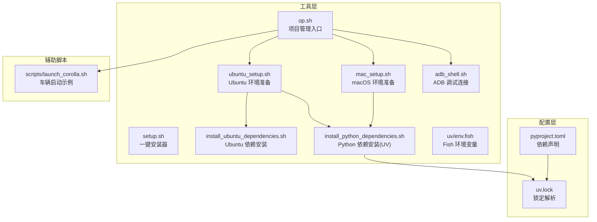
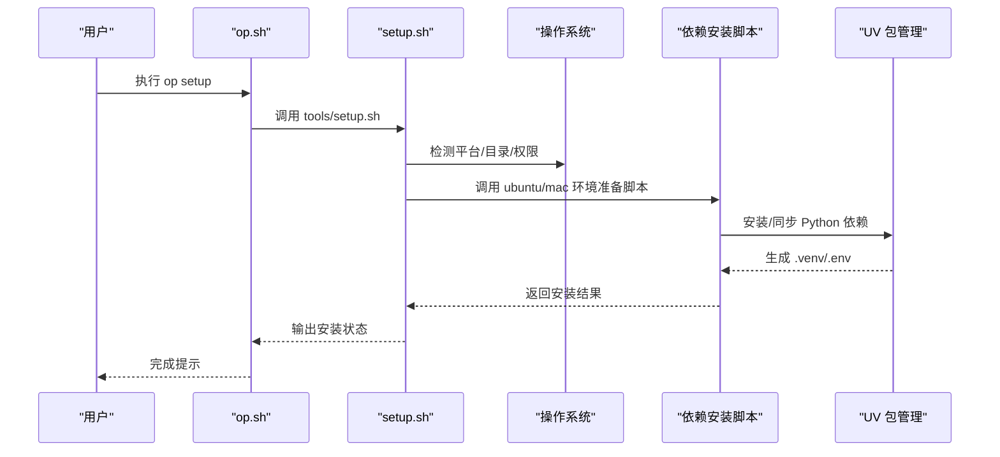
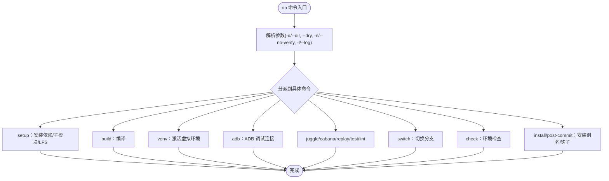
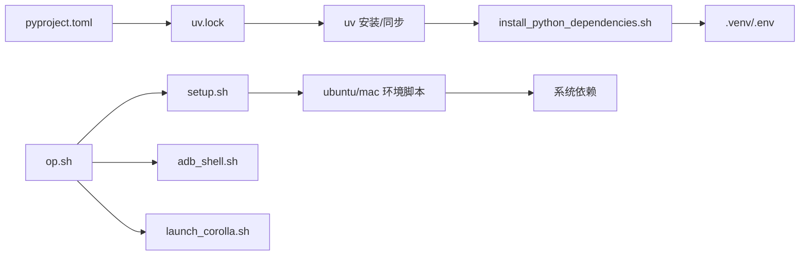

# 实用脚本

<cite>
**本文档引用的文件**
- [tools/setup.sh](file://tools/setup.sh)
- [tools/ubuntu_setup.sh](file://tools/ubuntu_setup.sh)
- [tools/mac_setup.sh](file://tools/mac_setup.sh)
- [tools/install_ubuntu_dependencies.sh](file://tools/install_ubuntu_dependencies.sh)
- [tools/install_python_dependencies.sh](file://tools/install_python_dependencies.sh)
- [tools/op.sh](file://tools/op.sh)
- [tools/adb_shell.sh](file://tools/adb_shell.sh)
- [tools/uv/env.fish](file://tools/uv/env.fish)
- [pyproject.toml](file://pyproject.toml)
- [uv.lock](file://uv.lock)
- [scripts/launch_corolla.sh](file://scripts/launch_corolla.sh)
</cite>

## 目录
1. [简介](#简介)
2. [项目结构](#项目结构)
3. [核心组件](#核心组件)
4. [架构总览](#架构总览)
5. [详细组件分析](#详细组件分析)
6. [依赖关系分析](#依赖关系分析)
7. [性能考虑](#性能考虑)
8. [故障排除指南](#故障排除指南)
9. [结论](#结论)
10. [附录](#附录)

## 简介
本文件面向实用脚本的使用者与维护者，系统性梳理了仓库中的环境搭建、UV 包管理、ADB 调试与设备连接、以及常用辅助脚本的实现细节与使用方法。文档以“可操作、可落地”为目标，既适合初学者快速上手，也为有经验的开发者提供足够的技术深度与参考路径。

## 项目结构
实用脚本主要分布在以下位置：
- tools：环境安装与项目管理脚本（Ubuntu/macOS 安装、Python 依赖安装、UV 配置、op 工具入口等）
- scripts：通用辅助脚本（如特定车辆启动脚本、CI/测试辅助等）
- 根目录配置：pyproject.toml（项目依赖定义）、uv.lock（锁定的依赖解析）

**图表来源**
- [tools/op.sh:1-477](file://tools/op.sh#L1-L477)
- [tools/setup.sh:1-190](file://tools/setup.sh#L1-L190)
- [tools/ubuntu_setup.sh:1-11](file://tools/ubuntu_setup.sh#L1-L11)
- [tools/mac_setup.sh:1-100](file://tools/mac_setup.sh#L1-L100)
- [tools/install_ubuntu_dependencies.sh:1-139](file://tools/install_ubuntu_dependencies.sh#L1-L139)
- [tools/install_python_dependencies.sh:1-45](file://tools/install_python_dependencies.sh#L1-L45)
- [tools/adb_shell.sh:1-9](file://tools/adb_shell.sh#L1-L9)
- [tools/uv/env.fish:1-5](file://tools/uv/env.fish#L1-L5)
- [pyproject.toml:1-268](file://pyproject.toml#L1-L268)
- [uv.lock:1-625](file://uv.lock#L1-L625)
- [scripts/launch_corolla.sh:1-8](file://scripts/launch_corolla.sh#L1-L8)

**章节来源**
- [tools/op.sh:1-477](file://tools/op.sh#L1-L477)
- [tools/setup.sh:1-190](file://tools/setup.sh#L1-L190)
- [tools/ubuntu_setup.sh:1-11](file://tools/ubuntu_setup.sh#L1-L11)
- [tools/mac_setup.sh:1-100](file://tools/mac_setup.sh#L1-L100)
- [tools/install_ubuntu_dependencies.sh:1-139](file://tools/install_ubuntu_dependencies.sh#L1-L139)
- [tools/install_python_dependencies.sh:1-45](file://tools/install_python_dependencies.sh#L1-L45)
- [tools/adb_shell.sh:1-9](file://tools/adb_shell.sh#L1-L9)
- [tools/uv/env.fish:1-5](file://tools/uv/env.fish#L1-L5)
- [pyproject.toml:1-268](file://pyproject.toml#L1-L268)
- [uv.lock:1-625](file://uv.lock#L1-L625)
- [scripts/launch_corolla.sh:1-8](file://scripts/launch_corolla.sh#L1-L8)

## 核心组件
- 环境安装器：一键安装 openpilot 及其依赖，支持交互式与非交互式模式，自动检测平台并调用对应安装脚本。
- op 工具：统一入口，封装检查环境、安装依赖、构建、测试、仿真、ADB 连接等常用命令。
- Ubuntu/macOS 环境准备：分别通过 ubuntu_setup.sh 与 mac_setup.sh 组合安装系统依赖与 Python 依赖。
- Python 依赖安装：install_python_dependencies.sh 自动处理 UV 安装与同步，并生成 .env。
- ADB 调试：adb_shell.sh 提供一键进入设备 shell 的交互体验。
- UV 包管理：pyproject.toml 声明依赖，uv.lock 锁定解析，tools/uv/env.fish 确保 PATH 中优先使用用户级二进制。
- 辅助脚本：如 scripts/launch_corolla.sh 展示如何设置环境变量并启动 openpilot。

**章节来源**
- [tools/setup.sh:1-190](file://tools/setup.sh#L1-L190)
- [tools/op.sh:1-477](file://tools/op.sh#L1-L477)
- [tools/ubuntu_setup.sh:1-11](file://tools/ubuntu_setup.sh#L1-L11)
- [tools/mac_setup.sh:1-100](file://tools/mac_setup.sh#L1-L100)
- [tools/install_ubuntu_dependencies.sh:1-139](file://tools/install_ubuntu_dependencies.sh#L1-L139)
- [tools/install_python_dependencies.sh:1-45](file://tools/install_python_dependencies.sh#L1-L45)
- [tools/adb_shell.sh:1-9](file://tools/adb_shell.sh#L1-L9)
- [tools/uv/env.fish:1-5](file://tools/uv/env.fish#L1-L5)
- [pyproject.toml:1-268](file://pyproject.toml#L1-L268)
- [uv.lock:1-625](file://uv.lock#L1-L625)
- [scripts/launch_corolla.sh:1-8](file://scripts/launch_corolla.sh#L1-L8)

## 架构总览
op 工具作为统一入口，按需调用各子脚本完成环境检查、依赖安装、构建与运行。UV 作为包管理器负责 Python 依赖的安装与同步，确保跨平台一致性。

**图表来源**
- [tools/op.sh:201-260](file://tools/op.sh#L201-L260)
- [tools/setup.sh:158-190](file://tools/setup.sh#L158-L190)
- [tools/ubuntu_setup.sh:1-11](file://tools/ubuntu_setup.sh#L1-L11)
- [tools/mac_setup.sh:1-100](file://tools/mac_setup.sh#L1-L100)
- [tools/install_python_dependencies.sh:1-45](file://tools/install_python_dependencies.sh#L1-L45)

**章节来源**
- [tools/op.sh:201-260](file://tools/op.sh#L201-L260)
- [tools/setup.sh:158-190](file://tools/setup.sh#L158-L190)

## 详细组件分析

### 环境安装器（tools/setup.sh）
- 功能概述：提供交互式/非交互式安装流程，自动检测平台与目录，克隆 openpilot 并委托 op.sh 完成后续步骤。
- 关键流程：
  - 检查 stdin 是否可用，决定是否进入交互模式
  - 询问或默认 openpilot 安装目录，校验目标目录合法性
  - 检查 git 可用性，必要时尝试克隆
  - 调用 op.sh install 与 post-commit 钩子安装
  - 通过 Sentry 上报事件类型与日志摘要（失败时）
- 使用建议：
  - 非交互模式：确保 OPENPILOT_ROOT 已正确设置
  - 失败时查看日志文件（op.sh 支持 --log 参数），结合 Sentry 事件类型定位问题

**章节来源**
- [tools/setup.sh:1-190](file://tools/setup.sh#L1-L190)
- [tools/op.sh:443-477](file://tools/op.sh#L443-L477)

### op 工具（tools/op.sh）
- 功能概述：统一入口，封装环境检查、依赖安装、构建、测试、仿真、ADB 连接、分支切换等常用命令。
- 主要命令：
  - setup：安装依赖、拉取子模块、拉取 LFS 文件
  - check：仅检查环境（git、OS、Python 版本、虚拟环境）
  - build：在 PC 使用 scons，在 AGNOS 使用系统构建脚本
  - venv：激活虚拟环境并启动交互 shell
  - adb：打开 ADB shell 并预设路径与权限
  - juggle/cabana/replay/test/lint：运行相应工具
  - install/post-commit：安装 op 别名与提交钩子
  - switch：干净切换到指定分支
- 参数与行为：
  - -d/--dir：指定 openpilot 根目录
  - --dry：仅打印将要执行的命令，不实际运行
  - -n/--no-verify：跳过环境检查
  - -l/--log：输出错误日志到文件，便于 Sentry 上报

**图表来源**
- [tools/op.sh:443-477](file://tools/op.sh#L443-L477)

**章节来源**
- [tools/op.sh:1-477](file://tools/op.sh#L1-L477)

### Ubuntu 环境准备（tools/ubuntu_setup.sh）
- 功能概述：组合调用 Ubuntu 依赖安装与 Python 依赖安装脚本，适配 Docker 构建场景。
- 依赖安装要点：
  - 自动检测 sudo 权限，必要时提示安装 sudo
  - 识别 /etc/os-release，限定 Ubuntu 版本（jammy/kinetic/noble/focal）
  - 安装系统依赖包（编译工具链、Qt、FFmpeg、OpenCL/Vulkan、USB/串口等）
  - 配置 udev 规则（panda/jungle 设备）
- 注意事项：
  - 非支持版本会给出警告并允许继续（可选）
  - 需要网络访问以下载软件包

**章节来源**
- [tools/ubuntu_setup.sh:1-11](file://tools/ubuntu_setup.sh#L1-L11)
- [tools/install_ubuntu_dependencies.sh:1-139](file://tools/install_ubuntu_dependencies.sh#L1-L139)

### macOS 环境准备（tools/mac_setup.sh）
- 功能概述：通过 Homebrew 安装系统依赖，处理 OpenSSL、Qt、Python 依赖链接与环境变量。
- 依赖安装要点：
  - 自动检测并安装/更新 Homebrew
  - 使用 Brewfile 安装核心依赖（Qt5、FFmpeg、OpenCL、USB/串口等）
  - 设置 LDFLAGS/CPPFLAGS 以适配 zlib/openssl 编译后端
  - 强制链接 Qt5（若系统默认 Qt6）
- 注意事项：
  - 首次安装可能较慢（Homebrew 更新与依赖下载）
  - 完成后需要重新加载 shell 配置

**章节来源**
- [tools/mac_setup.sh:1-100](file://tools/mac_setup.sh#L1-L100)

### Python 依赖安装（tools/install_python_dependencies.sh）
- 功能概述：自动安装/更新 UV，使用 uv sync --frozen --all-extras 同步依赖，生成 .env。
- 关键逻辑：
  - 若未检测到 uv，按架构选择复制内置二进制或通过安装脚本安装
  - 更新 uv（可选，兼容 brew 安装）
  - 使用 uv sync --frozen --all-extras 同步所有依赖
  - 安装额外包（xattr、flask）
  - 激活 .venv 并写入 .env（含平台特定导出）
- 与 UV 的关系：
  - 依赖解析由 uv.lock 决定，确保跨平台一致性
  - .env 中包含 PYTHONPATH 与平台特定变量

**章节来源**
- [tools/install_python_dependencies.sh:1-45](file://tools/install_python_dependencies.sh#L1-L45)
- [uv.lock:1-625](file://uv.lock#L1-L625)
- [pyproject.toml:1-268](file://pyproject.toml#L1-L268)

### ADB 调试脚本（tools/adb_shell.sh）
- 功能概述：通过 expect 自动化 ADB shell 登录，进入 openpilot 数据目录并切换到 comma 用户。
- 使用场景：
  - 快速登录设备进行日志查看、临时修改或调试
  - 配合 op adb 一键进入设备 shell
- 注意事项：
  - 需要已启用开发者选项与 ADB 授权
  - 设备需连接到同一网络或 USB 调试已开启

**章节来源**
- [tools/adb_shell.sh:1-9](file://tools/adb_shell.sh#L1-L9)
- [tools/op.sh:292-295](file://tools/op.sh#L292-L295)

### UV 包管理工具（tools/uv/env.fish）
- 功能概述：确保 ~/.local/bin 在 PATH 中，优先使用用户级安装的二进制（如 uv）。
- 适用场景：
  - Fish shell 用户确保 UV 可用
  - 与 install_python_dependencies.sh 协同工作
- 注意事项：
  - 其他 shell（bash/zsh）通过其他方式注入 PATH（见安装脚本）

**章节来源**
- [tools/uv/env.fish:1-5](file://tools/uv/env.fish#L1-L5)
- [tools/install_python_dependencies.sh:1-45](file://tools/install_python_dependencies.sh#L1-L45)

### 辅助脚本示例（scripts/launch_corolla.sh）
- 功能概述：设置指纹与跳过固件查询标志，直接启动 openpilot。
- 使用场景：
  - 快速验证特定车辆模型的启动流程
  - CI 或演示环境的便捷入口
- 注意事项：
  - 该脚本仅作为示例，实际使用需根据目标车辆调整环境变量

**章节来源**
- [scripts/launch_corolla.sh:1-8](file://scripts/launch_corolla.sh#L1-L8)

## 依赖关系分析
- 依赖声明与锁定：
  - pyproject.toml 声明核心依赖与可选依赖（testing/dev/docs/tools）
  - uv.lock 锁定解析，确保不同平台一致的依赖树
- 包管理器：
  - uv 作为包管理器，配合 install_python_dependencies.sh 完成安装与同步
- 系统依赖：
  - Ubuntu/macOS 分别通过各自安装脚本安装系统级依赖
- 工具链集成：
  - op.sh 将上述组件串联为统一入口，提供命令式操作体验

**图表来源**
- [pyproject.toml:1-268](file://pyproject.toml#L1-L268)
- [uv.lock:1-625](file://uv.lock#L1-L625)
- [tools/install_python_dependencies.sh:1-45](file://tools/install_python_dependencies.sh#L1-L45)
- [tools/op.sh:1-477](file://tools/op.sh#L1-L477)
- [tools/setup.sh:1-190](file://tools/setup.sh#L1-L190)
- [tools/ubuntu_setup.sh:1-11](file://tools/ubuntu_setup.sh#L1-L11)
- [tools/mac_setup.sh:1-100](file://tools/mac_setup.sh#L1-L100)
- [tools/adb_shell.sh:1-9](file://tools/adb_shell.sh#L1-L9)
- [scripts/launch_corolla.sh:1-8](file://scripts/launch_corolla.sh#L1-L8)

**章节来源**
- [pyproject.toml:1-268](file://pyproject.toml#L1-L268)
- [uv.lock:1-625](file://uv.lock#L1-L625)
- [tools/install_python_dependencies.sh:1-45](file://tools/install_python_dependencies.sh#L1-L45)
- [tools/op.sh:1-477](file://tools/op.sh#L1-L477)
- [tools/setup.sh:1-190](file://tools/setup.sh#L1-L190)

## 性能考虑
- 依赖安装阶段：
  - Ubuntu/macOS 安装脚本会并行拉取与安装大量系统依赖，首次运行耗时较长
  - uv 同步使用 frozen 解析，避免重复解析开销
- 构建阶段：
  - op build 在 PC 使用 scons，可通过 -jN 指定并发数
  - AGNOS 环境下使用系统构建脚本，注意内存限制
- 网络与缓存：
  - Git LFS 与子模块拉取可能受网络影响，建议在稳定网络环境下执行
  - UV 缓存与 pip 超时设置有助于提升安装稳定性

[本节为通用指导，无需特定文件引用]

## 故障排除指南
- 安装器无法交互：
  - 症状：非交互模式下提示 stdin 不可用
  - 处理：确保以交互方式运行，或显式设置 OPENPILOT_ROOT
  - 参考：[tools/setup.sh:70-78](file://tools/setup.sh#L70-L78)
- Ubuntu 版本不兼容：
  - 症状：提示不支持的 Ubuntu 版本
  - 处理：升级到支持版本（jammy/kinetic/noble/focal），或在确认风险后继续
  - 参考：[tools/install_ubuntu_dependencies.sh:96-111](file://tools/install_ubuntu_dependencies.sh#L96-L111)
- macOS Qt 链接冲突：
  - 症状：系统默认 Qt6 与项目需求冲突
  - 处理：按提示执行 brew unlink/qt@6 && brew link qt@5
  - 参考：[tools/mac_setup.sh:75-94](file://tools/mac_setup.sh#L75-L94)
- Python 版本不匹配：
  - 症状：提示需要满足 pyproject.toml 中的版本范围
  - 处理：安装符合要求的 Python 版本
  - 参考：[tools/op.sh:145-166](file://tools/op.sh#L145-L166)
- ADB 连接失败：
  - 症状：无法进入设备 shell
  - 处理：确认开发者选项、USB 调试与授权；检查 adb 状态
  - 参考：[tools/adb_shell.sh:1-9](file://tools/adb_shell.sh#L1-L9)
- UV 安装失败：
  - 症状：找不到 uv 或安装异常
  - 处理：手动安装或复制内置二进制；确保 ~/.local/bin 在 PATH 中
  - 参考：[tools/install_python_dependencies.sh:11-28](file://tools/install_python_dependencies.sh#L11-L28), [tools/uv/env.fish:1-5](file://tools/uv/env.fish#L1-L5)

**章节来源**
- [tools/setup.sh:70-78](file://tools/setup.sh#L70-L78)
- [tools/install_ubuntu_dependencies.sh:96-111](file://tools/install_ubuntu_dependencies.sh#L96-L111)
- [tools/mac_setup.sh:75-94](file://tools/mac_setup.sh#L75-L94)
- [tools/op.sh:145-166](file://tools/op.sh#L145-L166)
- [tools/adb_shell.sh:1-9](file://tools/adb_shell.sh#L1-L9)
- [tools/install_python_dependencies.sh:11-28](file://tools/install_python_dependencies.sh#L11-L28)
- [tools/uv/env.fish:1-5](file://tools/uv/env.fish#L1-L5)

## 结论
本实用脚本体系以 op 为核心入口，结合环境安装器与平台化依赖安装脚本，实现了从环境准备到依赖安装、再到日常开发与调试的全链路自动化。UV 与锁定文件确保了跨平台依赖的一致性。通过合理使用这些脚本，可以显著降低环境搭建成本、减少人为错误，并提升开发与运维效率。

[本节为总结性内容，无需特定文件引用]

## 附录
- 常用命令速查：
  - op setup：安装依赖、子模块、LFS 文件
  - op check：检查环境（git、OS、Python、虚拟环境）
  - op build -j4：并行构建
  - op venv：激活虚拟环境
  - op adb：ADB 调试连接
  - op lint/test/replay/cabana/juggle：运行相应工具
  - op install/post-commit：安装别名与提交钩子
  - op switch origin <branch>：干净切换分支
- 参考文件路径：
  - [tools/op.sh:384-440](file://tools/op.sh#L384-L440)
  - [tools/setup.sh:158-190](file://tools/setup.sh#L158-L190)
  - [tools/install_ubuntu_dependencies.sh:21-139](file://tools/install_ubuntu_dependencies.sh#L21-L139)
  - [tools/install_python_dependencies.sh:1-45](file://tools/install_python_dependencies.sh#L1-L45)
  - [tools/adb_shell.sh:1-9](file://tools/adb_shell.sh#L1-L9)
  - [pyproject.toml:1-268](file://pyproject.toml#L1-L268)
  - [uv.lock:1-625](file://uv.lock#L1-L625)

[本节为补充信息，无需特定文件引用]