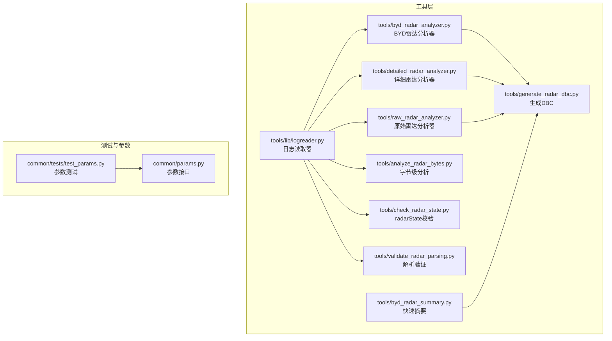
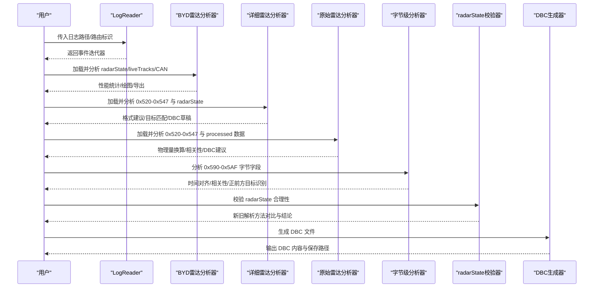
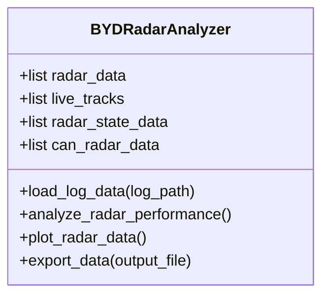
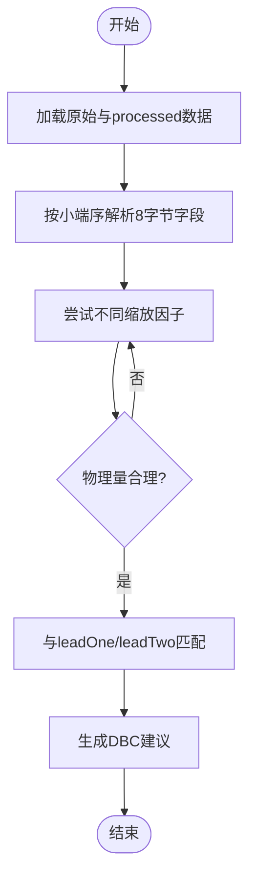
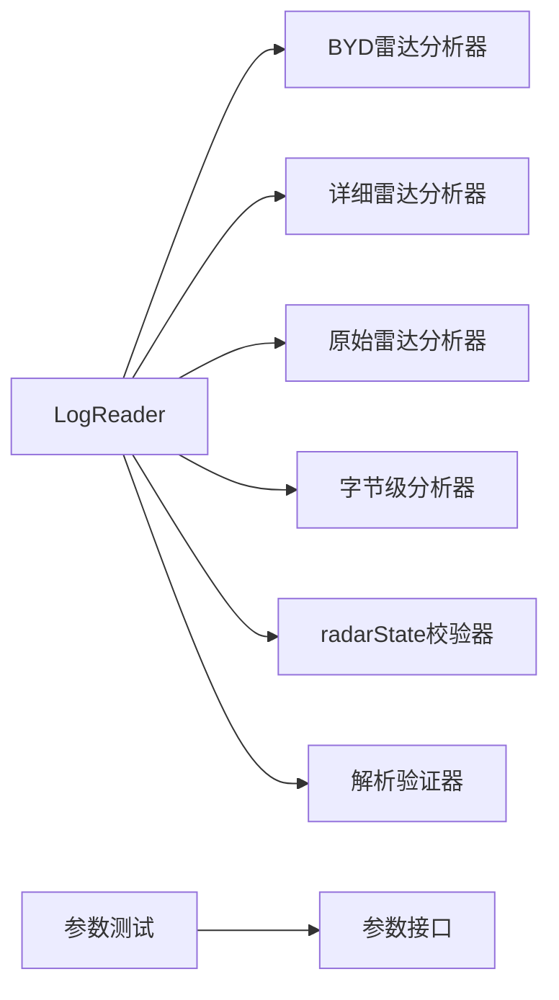

# 开发工具集

<cite>
**本文引用的文件**
- [tools/byd_radar_analyzer.py](file://tools/byd_radar_analyzer.py)
- [tools/detailed_radar_analyzer.py](file://tools/detailed_radar_analyzer.py)
- [tools/raw_radar_analyzer.py](file://tools/raw_radar_analyzer.py)
- [tools/analyze_radar_bytes.py](file://tools/analyze_radar_bytes.py)
- [tools/check_radar_state.py](file://tools/check_radar_state.py)
- [tools/byd_radar_summary.py](file://tools/byd_radar_summary.py)
- [tools/generate_radar_dbc.py](file://tools/generate_radar_dbc.py)
- [tools/validate_radar_parsing.py](file://tools/validate_radar_parsing.py)
- [tools/lib/logreader.py](file://tools/lib/logreader.py)
- [common/tests/test_params.py](file://common/tests/test_params.py)
- [common/params.py](file://common/params.py)
</cite>

## 目录
1. [简介](#简介)
2. [项目结构](#项目结构)
3. [核心组件](#核心组件)
4. [架构总览](#架构总览)
5. [详细组件分析](#详细组件分析)
6. [依赖分析](#依赖分析)
7. [性能考虑](#性能考虑)
8. [故障排查指南](#故障排查指南)
9. [结论](#结论)
10. [附录](#附录)

## 简介
本文件面向开发工具集，聚焦于雷达数据分析工具、测试框架与调试工具的实现与使用。内容涵盖：
- 雷达数据分析工具链：从日志读取、原始数据解析、性能评估到可视化与报告生成
- 测试框架：单元测试、集成测试与参数校验
- 调试工具：日志解析、字段验证、参数读写与快速验证
- 配置选项、参数与返回值说明
- 与开发流程的关系及常见问题解决方案

## 项目结构
开发工具主要位于 tools 目录，围绕日志读取器 LogReader 提供统一的数据入口，并通过多个专用分析脚本完成不同层次的雷达数据洞察。

**图表来源**
- [tools/lib/logreader.py:257-329](file://tools/lib/logreader.py#L257-L329)
- [tools/byd_radar_analyzer.py:21-243](file://tools/byd_radar_analyzer.py#L21-L243)
- [tools/detailed_radar_analyzer.py:12-183](file://tools/detailed_radar_analyzer.py#L12-L183)
- [tools/raw_radar_analyzer.py:12-181](file://tools/raw_radar_analyzer.py#L12-L181)
- [tools/analyze_radar_bytes.py:18-246](file://tools/analyze_radar_bytes.py#L18-L246)
- [tools/check_radar_state.py:16-121](file://tools/check_radar_state.py#L16-L121)
- [tools/byd_radar_summary.py:13-108](file://tools/byd_radar_summary.py#L13-L108)
- [tools/generate_radar_dbc.py:7-86](file://tools/generate_radar_dbc.py#L7-L86)
- [tools/validate_radar_parsing.py:10-76](file://tools/validate_radar_parsing.py#L10-L76)
- [common/tests/test_params.py:9-110](file://common/tests/test_params.py#L9-L110)
- [common/params.py:1-19](file://common/params.py#L1-L19)

**章节来源**
- [tools/lib/logreader.py:257-329](file://tools/lib/logreader.py#L257-L329)
- [tools/byd_radar_analyzer.py:21-243](file://tools/byd_radar_analyzer.py#L21-L243)
- [tools/detailed_radar_analyzer.py:12-183](file://tools/detailed_radar_analyzer.py#L12-L183)
- [tools/raw_radar_analyzer.py:12-181](file://tools/raw_radar_analyzer.py#L12-L181)
- [tools/analyze_radar_bytes.py:18-246](file://tools/analyze_radar_bytes.py#L18-L246)
- [tools/check_radar_state.py:16-121](file://tools/check_radar_state.py#L16-L121)
- [tools/byd_radar_summary.py:13-108](file://tools/byd_radar_summary.py#L13-L108)
- [tools/generate_radar_dbc.py:7-86](file://tools/generate_radar_dbc.py#L7-L86)
- [tools/validate_radar_parsing.py:10-76](file://tools/validate_radar_parsing.py#L10-L76)
- [common/tests/test_params.py:9-110](file://common/tests/test_params.py#L9-L110)
- [common/params.py:1-19](file://common/params.py#L1-L19)

## 核心组件
- 日志读取器 LogReader：支持 rlog/qlog 的多源自动选择、压缩格式解压、按类型过滤与时间序列转换，是所有分析工具的数据入口。
- BYD 雷达分析器：从日志提取 radarState、liveTracks、CAN 原始消息，执行性能统计、可视化与导出。
- 详细/原始雷达分析器：聚焦 0x520–0x547 原始雷达帧与 processed radarState 的映射关系，提出 DBC 定义建议。
- 字节级分析器：针对特定地址范围（如 0x590–0x5AF）的字节字段进行时序与相关性分析。
- radarState 校验器：验证解析后 radarState 的合理性与一致性。
- 快速摘要与 DBC 生成：输出关键指标与生成 DBC 文件，便于后续集成。
- 参数测试与参数接口：提供参数存取、类型转换与并发读写的测试用例与接口封装。

**章节来源**
- [tools/lib/logreader.py:257-329](file://tools/lib/logreader.py#L257-L329)
- [tools/byd_radar_analyzer.py:21-243](file://tools/byd_radar_analyzer.py#L21-L243)
- [tools/detailed_radar_analyzer.py:12-183](file://tools/detailed_radar_analyzer.py#L12-L183)
- [tools/raw_radar_analyzer.py:12-181](file://tools/raw_radar_analyzer.py#L12-L181)
- [tools/analyze_radar_bytes.py:18-246](file://tools/analyze_radar_bytes.py#L18-L246)
- [tools/check_radar_state.py:16-121](file://tools/check_radar_state.py#L16-L121)
- [tools/byd_radar_summary.py:13-108](file://tools/byd_radar_summary.py#L13-L108)
- [tools/generate_radar_dbc.py:7-86](file://tools/generate_radar_dbc.py#L7-L86)
- [common/tests/test_params.py:9-110](file://common/tests/test_params.py#L9-L110)
- [common/params.py:1-19](file://common/params.py#L1-L19)

## 架构总览
下图展示工具链的调用关系与数据流：

**图表来源**
- [tools/lib/logreader.py:257-329](file://tools/lib/logreader.py#L257-L329)
- [tools/byd_radar_analyzer.py:30-240](file://tools/byd_radar_analyzer.py#L30-L240)
- [tools/detailed_radar_analyzer.py:19-173](file://tools/detailed_radar_analyzer.py#L19-L173)
- [tools/raw_radar_analyzer.py:19-171](file://tools/raw_radar_analyzer.py#L19-L171)
- [tools/analyze_radar_bytes.py:18-246](file://tools/analyze_radar_bytes.py#L18-L246)
- [tools/check_radar_state.py:16-121](file://tools/check_radar_state.py#L16-L121)
- [tools/generate_radar_dbc.py:7-86](file://tools/generate_radar_dbc.py#L7-L86)

## 详细组件分析

### 组件A：BYD雷达分析器（BYDRadarAnalyzer）
- 功能职责
  - 从日志中提取 radarState、liveTracks、CAN 原始消息
  - 统计 lead 检测率、距离范围、轨迹唯一性与测量比例
  - 可选绘制时间序列与散点图，导出轨迹 CSV
- 关键接口
  - load_log_data(log_path)：加载并解析指定日志
  - analyze_radar_performance()：性能统计与指标输出
  - plot_radar_data()：绘制四类子图（lead距离、轨迹随时间、横向位置vs距离、相对速度vs距离）
  - export_data(output_file)：导出轨迹数据
- 处理逻辑要点
  - radarState 中 leadOne/leadTwo 的状态位决定有效检测
  - liveTracks 中 trackId 唯一性用于目标跟踪稳定性评估
  - CAN 地址 0x374（884）作为 RADAR_MRR 原始帧入口
- 性能与复杂度
  - 时间复杂度近似 O(N)（逐消息遍历），空间复杂度 O(N)（缓存消息）
  - 绘图阶段对 DataFrame 的操作为 O(M)（M 为轨迹点数）

**图表来源**
- [tools/byd_radar_analyzer.py:21-243](file://tools/byd_radar_analyzer.py#L21-L243)

**章节来源**
- [tools/byd_radar_analyzer.py:21-243](file://tools/byd_radar_analyzer.py#L21-L243)

### 组件B：详细雷达分析器（DetailedRadarAnalyzer）
- 功能职责
  - 解析 0x520–0x547 原始雷达帧，尝试多种字节解析与缩放策略
  - 将原始数据与 processed radarState 的 leadOne/leadTwo 进行匹配
  - 输出建议的 DBC 定义
- 关键接口
  - load_data()：按类型收集原始与 processed 数据
  - analyze_raw_format()：多策略解析与合理性检查
  - find_matching_targets()：基于均值距离/速度匹配 leadOne/leadTwo
  - suggest_correct_dbc()：生成 DBC 定义草稿
  - run_analysis()：串行执行上述步骤
- 处理逻辑要点
  - 使用 struct.unpack 小端序解析 8 字节字段
  - 尝试不同缩放因子（如 0.1、0.01、0.1 度单位）得到合理物理量
  - 与 radarState 的 dRel/vRel 进行阈值匹配，定位目标

**图表来源**
- [tools/detailed_radar_analyzer.py:50-173](file://tools/detailed_radar_analyzer.py#L50-L173)

**章节来源**
- [tools/detailed_radar_analyzer.py:12-183](file://tools/detailed_radar_analyzer.py#L12-L183)

### 组件C：原始雷达分析器（RawRadarAnalyzer）
- 功能职责
  - 对 0x520–0x547 原始雷达帧进行格式分析与物理量换算
  - 对比 processed radarState 与原始帧，寻找关联
  - 分析 0x374 与 0x520–0x547 的消息数量关系
  - 提供建议的 DBC 定义
- 关键接口
  - analyze_raw_radar_format()：打印原始样本与换算结果
  - compare_with_processed_data()：打印 processed 数据字段
  - find_correlation()：统计两类消息数量
  - suggest_dbc_definition()：输出 DBC 草案
  - run_analysis()：顺序执行以上步骤

**章节来源**
- [tools/raw_radar_analyzer.py:12-181](file://tools/raw_radar_analyzer.py#L12-L181)

### 组件D：字节级分析器（analyze_radar_bytes）
- 功能职责
  - 分析 0x590–0x5AF 区间字节字段变化，寻找与 leadOne/leadTwo 的对应关系
  - 对比 processed radarState 与 CAN 原始帧的时间戳，计算长/横向距离并与 yRel 关联
  - 计算相关系数，识别正前方目标
- 关键接口
  - analyze_segment(segment_path)：主流程（解析 CAN/radarState、对比、相关性分析）
- 处理逻辑要点
  - 通过时间窗口对齐，计算 long_dist、lat_dist 并与 dRel/yRel 比较
  - 使用相关系数筛选与 leadTwo 最匹配的目标

**章节来源**
- [tools/analyze_radar_bytes.py:18-246](file://tools/analyze_radar_bytes.py#L18-L246)

### 组件E：radarState 校验器（check_radar_state）
- 功能职责
  - 读取 qlog 中 radarState，打印 leadOne/leadTwo 的关键字段
  - 对比新旧解析方法（大小端序与特殊角度解码）的合理性
- 关键接口
  - check_radar_state()：扫描并打印有效消息
  - test_new_parsing_method()：新旧方法对比与结论

**章节来源**
- [tools/check_radar_state.py:16-121](file://tools/check_radar_state.py#L16-L121)

### 组件F：快速摘要与 DBC 生成
- 快速摘要（byd_radar_summary.py）
  - 统计消息类型与有效检测数量，给出关键发现与后续建议
- DBC 生成（generate_radar_dbc.py）
  - 生成包含 RADAR_MRR 与 0x520–0x547 目标的 DBC 文件

**章节来源**
- [tools/byd_radar_summary.py:13-108](file://tools/byd_radar_summary.py#L13-L108)
- [tools/generate_radar_dbc.py:7-86](file://tools/generate_radar_dbc.py#L7-L86)

### 组件G：参数测试与参数接口
- 参数测试（common/tests/test_params.py）
  - 覆盖 put/get、布尔转换、阻塞/非阻塞读取、清理策略、未知键异常等场景
- 参数接口（common/params.py）
  - 提供命令行访问 Params 的便捷入口

**章节来源**
- [common/tests/test_params.py:9-110](file://common/tests/test_params.py#L9-L110)
- [common/params.py:1-19](file://common/params.py#L1-L19)

## 依赖分析
- 工具与日志读取器
  - 所有分析脚本均依赖 tools/lib/logreader.py 提供统一的日志读取能力
- 工具间的耦合
  - 低耦合：各分析器独立运行，仅共享日志读取器
  - 数据共享：通过日志事件类型（radarState/liveTracks/can）进行数据抽取
- 外部依赖
  - NumPy、Pandas、Matplotlib 用于统计与可视化
  - struct 用于二进制解析
  - pytest 用于参数模块测试

**图表来源**
- [tools/lib/logreader.py:257-329](file://tools/lib/logreader.py#L257-L329)
- [tools/byd_radar_analyzer.py:21-243](file://tools/byd_radar_analyzer.py#L21-L243)
- [tools/detailed_radar_analyzer.py:12-183](file://tools/detailed_radar_analyzer.py#L12-L183)
- [tools/raw_radar_analyzer.py:12-181](file://tools/raw_radar_analyzer.py#L12-L181)
- [tools/analyze_radar_bytes.py:18-246](file://tools/analyze_radar_bytes.py#L18-L246)
- [tools/check_radar_state.py:16-121](file://tools/check_radar_state.py#L16-L121)
- [tools/validate_radar_parsing.py:10-76](file://tools/validate_radar_parsing.py#L10-L76)
- [common/tests/test_params.py:9-110](file://common/tests/test_params.py#L9-L110)
- [common/params.py:1-19](file://common/params.py#L1-L19)

**章节来源**
- [tools/lib/logreader.py:257-329](file://tools/lib/logreader.py#L257-L329)
- [common/tests/test_params.py:9-110](file://common/tests/test_params.py#L9-L110)

## 性能考虑
- 日志读取
  - 支持 rlog/qlog 自动回退与压缩格式（zst/bz2）解压，避免重复下载与本地存储压力
  - 提供按类型过滤与时间序列转换，减少内存占用
- 分析器性能
  - 采用单次遍历收集数据，避免多次 IO
  - 绘图阶段按需生成，避免不必要的计算
- 多进程
  - LogReader 提供 run_across_segments 接口，可在批量处理时并行加速

[本节为通用指导，不直接分析具体文件]

## 故障排查指南
- 日志读取失败
  - 确认日志路径存在且扩展名为 .zst 或 .bz2；若缺失 rlog，则自动回退至 qlog
  - 若网络源不可用，检查内部源可用性或切换到其他来源
- 数据为空或指标异常
  - radarState 中 leadOne/leadTwo 的 status 为 0 表示无效检测，需检查传感器状态与滤波逻辑
  - liveTracks 中 dRel 超过阈值（如 200m）应视为异常，检查原始帧解析与缩放因子
- DBC 解析不一致
  - 使用 validate_radar_parsing.py 对比原始帧与 processed 数据，确认缩放因子与字节序
  - 通过字节级分析器检查特定地址范围的字段与 yRel 的相关性
- 参数读写问题
  - 使用参数测试覆盖阻塞/非阻塞读取、布尔转换与未知键异常场景
  - 通过命令行参数接口快速验证键值读写

**章节来源**
- [tools/lib/logreader.py:120-144](file://tools/lib/logreader.py#L120-L144)
- [tools/validate_radar_parsing.py:10-76](file://tools/validate_radar_parsing.py#L10-L76)
- [tools/analyze_radar_bytes.py:18-246](file://tools/analyze_radar_bytes.py#L18-L246)
- [common/tests/test_params.py:9-110](file://common/tests/test_params.py#L9-L110)

## 结论
本工具集围绕日志读取器构建，形成从原始数据解析、processed 数据对比、可视化与报告生成到 DBC 定义与参数测试的完整闭环。通过模块化设计与清晰的接口，既满足初学者快速上手，又为资深开发者提供深入分析与优化空间。

[本节为总结性内容，不直接分析具体文件]

## 附录

### A. 配置选项、参数与返回值
- BYD雷达分析器
  - 输入：日志路径（rlog.zst/qlog.zst）
  - 参数：--plot（绘图）、--export（CSV导出路径）
  - 返回：控制台统计输出、可选图像与 CSV 文件
- 详细/原始雷达分析器
  - 输入：日志路径
  - 输出：控制台解析结果、目标匹配建议、DBC 草案
- 字节级分析器
  - 输入：分段目录（包含 rlog.zst/qlog.zst）
  - 输出：控制台样本与相关性分析、正前方目标识别
- radarState 校验器
  - 输入：固定 qlog 路径（可修改）
  - 输出：radarState 字段摘要与新旧解析方法对比
- 参数测试
  - 覆盖 put/get、布尔转换、阻塞/非阻塞读取、清理策略与异常处理

**章节来源**
- [tools/byd_radar_analyzer.py:213-240](file://tools/byd_radar_analyzer.py#L213-L240)
- [tools/detailed_radar_analyzer.py:168-173](file://tools/detailed_radar_analyzer.py#L168-L173)
- [tools/raw_radar_analyzer.py:165-171](file://tools/raw_radar_analyzer.py#L165-L171)
- [tools/analyze_radar_bytes.py:240-246](file://tools/analyze_radar_bytes.py#L240-L246)
- [tools/check_radar_state.py:119-121](file://tools/check_radar_state.py#L119-L121)
- [common/tests/test_params.py:9-110](file://common/tests/test_params.py#L9-L110)

### B. 与开发流程的关系
- 数据采集与预处理：使用 LogReader 读取日志，按需过滤与排序
- 验证与回归：通过参数测试与 radarState 校验器进行回归验证
- 设计与实现：利用详细/原始雷达分析器与字节级分析器完善 DBC 与解析逻辑
- 报告与交付：通过快速摘要与 DBC 生成器输出阶段性成果

[本节为流程性说明，不直接分析具体文件]