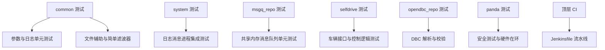
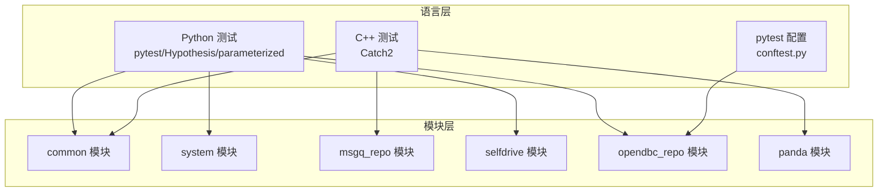
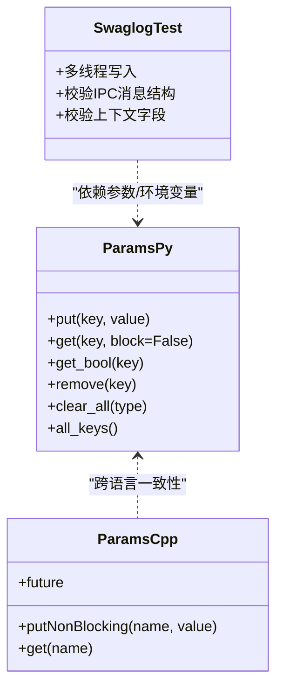
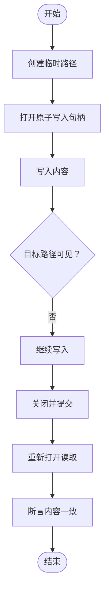
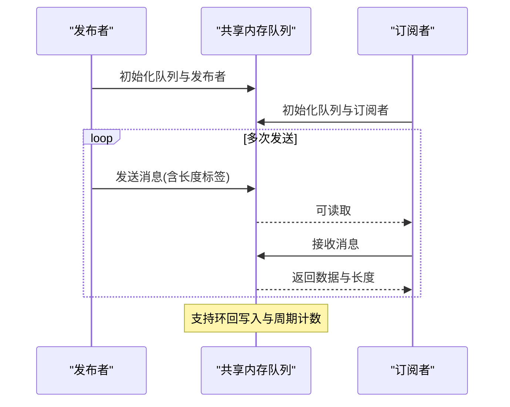
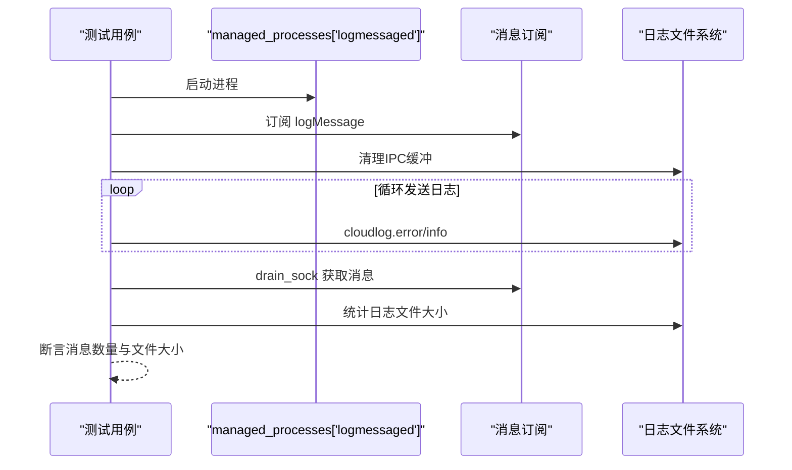
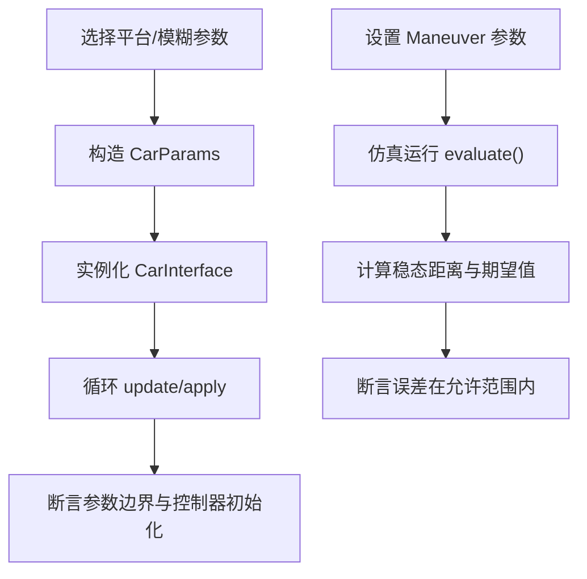
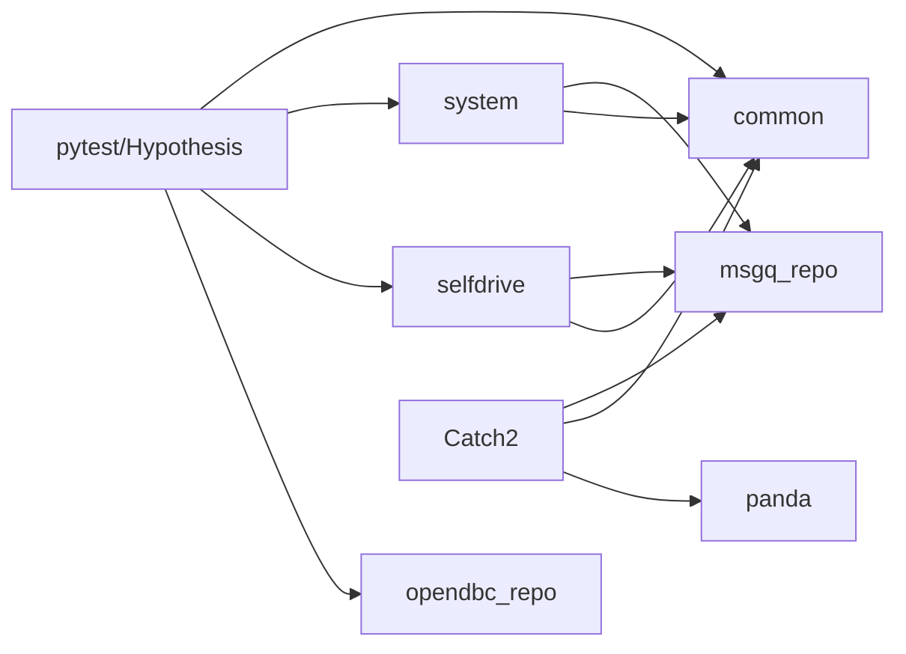

# 测试框架

<cite>
**本文引用的文件**
- [README.md](file://README.md)
- [common/tests/test_params.py](file://common/tests/test_params.py)
- [common/tests/test_params.cc](file://common/tests/test_params.cc)
- [common/tests/test_simple_kalman.py](file://common/tests/test_simple_kalman.py)
- [common/tests/test_file_helpers.py](file://common/tests/test_file_helpers.py)
- [common/tests/test_swaglog.cc](file://common/tests/test_swaglog.cc)
- [system/tests/test_logmessaged.py](file://system/tests/test_logmessaged.py)
- [msgq_repo/msgq/msgq_tests.cc](file://msgq_repo/msgq/msgq_tests.cc)
- [selfdrive/car/tests/test_car_interfaces.py](file://selfdrive/car/tests/test_car_interfaces.py)
- [selfdrive/controls/tests/test_following_distance.py](file://selfdrive/controls/tests/test_following_distance.py)
- [opendbc_repo/conftest.py](file://opendbc_repo/conftest.py)
- [Jenkinsfile](file://Jenkinsfile)
- [panda/Jenkinsfile](file://panda/Jenkinsfile)
</cite>

## 目录
1. [简介](#简介)
2. [项目结构](#项目结构)
3. [核心组件](#核心组件)
4. [架构总览](#架构总览)
5. [详细组件分析](#详细组件分析)
6. [依赖分析](#依赖分析)
7. [性能考虑](#性能考虑)
8. [故障排查指南](#故障排查指南)
9. [结论](#结论)
10. [附录](#附录)

## 简介
本测试文档面向该代码库的测试体系，系统性阐述测试框架的实现细节、测试架构与策略，覆盖单元测试、集成测试与性能基准测试，并结合实际代码示例说明如何编写测试用例、运行测试套件与分析结果。文档同时给出测试配置选项、断言方法、自动化与持续集成实践，以及常见问题的解决方案，兼顾初学者与有经验开发者的阅读需求。

## 项目结构
该仓库采用多模块并行的测试组织方式：
- common：通用工具与服务的单元测试，涵盖参数存储、日志、简单滤波器等。
- system：系统级进程与消息通道的集成测试，如日志消息分发、IPC 等。
- msgq_repo：消息队列（共享内存）的 C++ 单元测试，验证收发、环形缓冲、融合模式等。
- selfdrive：自动驾驶相关模块的测试，包括车辆接口、纵向控制跟随距离仿真等。
- opendbc_repo：DBC 解析与校验的测试，配合 pytest 配置。
- panda：底层安全控制器相关测试与 CI 配置。
- 顶层：Jenkinsfile 提供持续集成流水线定义。

**章节来源**
- [README.md:111-121](file://README.md#L111-L121)

## 核心组件
- 参数与日志测试：验证参数存储的原子写入、阻塞/非阻塞读取、布尔值解析与清理策略；验证日志系统在多线程下的结构完整性与上下文字段。
- 文件辅助测试：验证原子写入行为，确保临时文件阶段不暴露目标路径。
- 消息队列测试：覆盖对齐、初始化、发送/接收、环回写入、订阅者失效、多订阅者、融合模式、慢订阅者丢弃等场景。
- 系统集成测试：验证 logmessaged 进程通过 IPC 分发日志消息，以及大消息处理与日志文件大小约束。
- 自动驾驶模块测试：车辆接口一致性与控制逻辑稳定性；纵向跟随距离仿真与期望值比较。
- DBC 测试：基于 pytest 的配置入口，驱动 opendbc 的各类解析与异常测试。
- 持续集成：顶层与 panda 的 Jenkinsfile 定义构建、测试与硬件在环流程。

**章节来源**
- [common/tests/test_params.py:1-110](file://common/tests/test_params.py#L1-L110)
- [common/tests/test_params.cc:1-28](file://common/tests/test_params.cc#L1-L28)
- [common/tests/test_swaglog.cc:1-89](file://common/tests/test_swaglog.cc#L1-L89)
- [common/tests/test_file_helpers.py:1-20](file://common/tests/test_file_helpers.py#L1-L20)
- [msgq_repo/msgq/msgq_tests.cc:1-425](file://msgq_repo/msgq/msgq_tests.cc#L1-L425)
- [system/tests/test_logmessaged.py:1-56](file://system/tests/test_logmessaged.py#L1-L56)
- [selfdrive/car/tests/test_car_interfaces.py:1-101](file://selfdrive/car/tests/test_car_interfaces.py#L1-L101)
- [selfdrive/controls/tests/test_following_distance.py:1-41](file://selfdrive/controls/tests/test_following_distance.py#L1-L41)
- [opendbc_repo/conftest.py](file://opendbc_repo/conftest.py)

## 架构总览
测试体系由“语言层”和“模块层”构成：
- 语言层：Python（pytest/Hypothesis/parameterized）、C++（Catch2）、配置（conftest.py）。
- 模块层：common、system、msgq_repo、selfdrive、opendbc_repo、panda。
- 通信与数据流：日志通过 IPC 发送到 logmessaged；消息队列使用共享内存；车辆接口与控制逻辑通过仿真输入驱动。

**图表来源**
- [common/tests/test_params.py:1-110](file://common/tests/test_params.py#L1-L110)
- [msgq_repo/msgq/msgq_tests.cc:1-425](file://msgq_repo/msgq/msgq_tests.cc#L1-L425)
- [opendbc_repo/conftest.py](file://opendbc_repo/conftest.py)

## 详细组件分析

### 参数与日志测试（common）
- 参数存储（Python）：覆盖 put/get、非 ASCII 内容、按键类型清理、阻塞/非阻塞读取、布尔值解析、未知键异常、列出所有键等。
- 参数存储（C++）：验证非阻塞写入的异步完成与最终一致性。
- 日志系统（C++）：多线程并发写入，校验 IPC 消息结构、级别、文件名、函数名、行号、上下文字段（daemon、dongle_id、dirty、version、device）。

**图表来源**
- [common/tests/test_params.py:1-110](file://common/tests/test_params.py#L1-L110)
- [common/tests/test_params.cc:1-28](file://common/tests/test_params.cc#L1-L28)
- [common/tests/test_swaglog.cc:1-89](file://common/tests/test_swaglog.cc#L1-L89)

**章节来源**
- [common/tests/test_params.py:1-110](file://common/tests/test_params.py#L1-L110)
- [common/tests/test_params.cc:1-28](file://common/tests/test_params.cc#L1-L28)
- [common/tests/test_swaglog.cc:1-89](file://common/tests/test_swaglog.cc#L1-L89)

### 文件辅助测试（common）
- 原子写入：在写入期间目标路径不可见，落盘后可读取到完整内容；使用临时目录与唯一文件名避免竞态。

**图表来源**
- [common/tests/test_file_helpers.py:1-20](file://common/tests/test_file_helpers.py#L1-L20)

**章节来源**
- [common/tests/test_file_helpers.py:1-20](file://common/tests/test_file_helpers.py#L1-L20)

### 消息队列测试（msgq_repo）
- 关键场景：对齐计算、消息初始化、发布/订阅生命周期、环回写入与周期计数、订阅者失效、多订阅者一致性、融合模式、慢订阅者丢弃统计。
- 断言点：写指针/读指针位置、消息体一致性、标签标记、读有效位变化。

**图表来源**
- [msgq_repo/msgq/msgq_tests.cc:238-272](file://msgq_repo/msgq/msgq_tests.cc#L238-L272)
- [msgq_repo/msgq/msgq_tests.cc:392-424](file://msgq_repo/msgq/msgq_tests.cc#L392-L424)

**章节来源**
- [msgq_repo/msgq/msgq_tests.cc:1-425](file://msgq_repo/msgq/msgq_tests.cc#L1-L425)

### 系统集成测试（system）
- logmessaged：启动进程，订阅 logMessage，发送错误/信息日志，断言消息数量与日志文件存在；验证大消息被丢弃且日志文件大小在合理范围。

**图表来源**
- [system/tests/test_logmessaged.py:17-29](file://system/tests/test_logmessaged.py#L17-L29)
- [system/tests/test_logmessaged.py:34-55](file://system/tests/test_logmessaged.py#L34-L55)

**章节来源**
- [system/tests/test_logmessaged.py:1-56](file://system/tests/test_logmessaged.py#L1-L56)

### 自动驾驶模块测试（selfdrive）
- 车辆接口一致性：遍历平台与模糊参数，构造 CarParams 并实例化 CarInterface，进行多次 update/apply，断言质量边界与控制器初始化。
- 纵向跟随距离仿真：基于 Maneuver 仿真不同驾驶性格与是否端到端，计算稳态跟车距离并与期望值比较，允许一定误差比例。

**图表来源**
- [selfdrive/car/tests/test_car_interfaces.py:36-101](file://selfdrive/car/tests/test_car_interfaces.py#L36-L101)
- [selfdrive/controls/tests/test_following_distance.py:11-40](file://selfdrive/controls/tests/test_following_distance.py#L11-L40)

**章节来源**
- [selfdrive/car/tests/test_car_interfaces.py:1-101](file://selfdrive/car/tests/test_car_interfaces.py#L1-L101)
- [selfdrive/controls/tests/test_following_distance.py:1-41](file://selfdrive/controls/tests/test_following_distance.py#L1-L41)

### DBC 测试（opendbc_repo）
- 使用 pytest 配置入口统一加载 opendbc 的各类测试（校验、解析、异常），便于集中管理与并行执行。

**章节来源**
- [opendbc_repo/conftest.py](file://opendbc_repo/conftest.py)

## 依赖分析
- 测试运行时依赖：
  - Python：pytest、Hypothesis、parameterized、cereal、opendbc。
  - C++：Catch2、共享内存、ZeroMQ（日志 IPC）。
- 模块间耦合：
  - common 为 system 与 selfdrive 提供基础能力（参数、日志、文件辅助）。
  - msgq_repo 为 system 与 selfdrive 提供高性能消息通道。
  - opendbc_repo 为 selfdrive 的车辆接口提供 DBC 数据支撑。
- 外部依赖与集成点：
  - Jenkinsfile 定义构建与测试步骤，支持硬件在环与覆盖率收集。

**图表来源**
- [common/tests/test_params.py:1-110](file://common/tests/test_params.py#L1-L110)
- [msgq_repo/msgq/msgq_tests.cc:1-425](file://msgq_repo/msgq/msgq_tests.cc#L1-L425)
- [system/tests/test_logmessaged.py:1-56](file://system/tests/test_logmessaged.py#L1-L56)
- [selfdrive/car/tests/test_car_interfaces.py:1-101](file://selfdrive/car/tests/test_car_interfaces.py#L1-L101)
- [opendbc_repo/conftest.py](file://opendbc_repo/conftest.py)

## 性能考虑
- 消息队列性能：
  - 环回写入与周期计数减少拷贝与锁竞争，适合高吞吐场景。
  - 融合模式与慢订阅者丢弃策略降低背压风险。
- 日志性能：
  - 多线程并发写入需注意 IPC 带宽与磁盘 IO；大消息会被丢弃以保护系统稳定性。
- 控制逻辑仿真：
  - 使用模糊生成器与参数化组合，快速覆盖边界条件，避免昂贵的真实硬件测试。

[本节为通用指导，无需具体文件来源]

## 故障排查指南
- 参数读取阻塞问题
  - 确认调用 get(key, block=True) 是否等待预期；检查非阻塞写入是否已完成（future 完成）。
  - 参考：[common/tests/test_params.py:43-52](file://common/tests/test_params.py#L43-L52)、[common/tests/test_params.cc:6-27](file://common/tests/test_params.cc#L6-L27)
- 日志 IPC 不可见或字段缺失
  - 检查 MANAGER_DAEMON、DONGLE_ID、dirty 环境变量；确认 IPC 地址绑定与连接顺序。
  - 参考：[common/tests/test_swaglog.cc:74-88](file://common/tests/test_swaglog.cc#L74-L88)
- 大日志消息导致丢弃
  - 系统对超大消息会丢弃并记录文件大小；调整消息大小或拆分策略。
  - 参考：[system/tests/test_logmessaged.py:43-55](file://system/tests/test_logmessaged.py#L43-L55)
- 消息队列读取无效
  - 检查订阅者读指针与写指针状态、周期计数与标签标记；确认订阅者及时消费。
  - 参考：[msgq_repo/msgq/msgq_tests.cc:179-213](file://msgq_repo/msgq/msgq_tests.cc#L179-L213)
- 车辆接口参数越界
  - 检查质量断言（质量边界、轮距、重心、最大侧向加速度等）；必要时调整模糊参数范围。
  - 参考：[selfdrive/car/tests/test_car_interfaces.py:48-70](file://selfdrive/car/tests/test_car_interfaces.py#L48-L70)
- 纵向跟随距离误差过大
  - 调整误差比例或仿真时间；核对驾驶性格与端到端开关。
  - 参考：[selfdrive/controls/tests/test_following_distance.py:35-40](file://selfdrive/controls/tests/test_following_distance.py#L35-L40)

**章节来源**
- [common/tests/test_params.py:43-52](file://common/tests/test_params.py#L43-L52)
- [common/tests/test_params.cc:6-27](file://common/tests/test_params.cc#L6-L27)
- [common/tests/test_swaglog.cc:74-88](file://common/tests/test_swaglog.cc#L74-L88)
- [system/tests/test_logmessaged.py:43-55](file://system/tests/test_logmessaged.py#L43-L55)
- [msgq_repo/msgq/msgq_tests.cc:179-213](file://msgq_repo/msgq/msgq_tests.cc#L179-L213)
- [selfdrive/car/tests/test_car_interfaces.py:48-70](file://selfdrive/car/tests/test_car_interfaces.py#L48-L70)
- [selfdrive/controls/tests/test_following_distance.py:35-40](file://selfdrive/controls/tests/test_following_distance.py#L35-L40)

## 结论
该测试框架以模块化与语言分层的方式覆盖从通用工具到系统集成的关键路径，结合 Catch2 与 pytest 的强大力量，既保证了单元测试的严谨性，也保障了集成测试的可靠性。通过 Jenkinsfile 的持续集成与硬件在环流程，确保代码变更在多维度场景下得到验证。建议在新增模块时遵循现有测试组织方式，优先补充单元测试，再逐步扩展集成与性能测试。

[本节为总结，无需具体文件来源]

## 附录

### 测试运行与配置
- 运行 Python 测试
  - 使用 pytest 执行 common、system、selfdrive 等目录中的测试文件。
  - 参考：[common/tests/test_params.py:1-110](file://common/tests/test_params.py#L1-L110)、[system/tests/test_logmessaged.py:1-56](file://system/tests/test_logmessaged.py#L1-L56)
- 运行 C++ 测试
  - 使用 Catch2 编译并执行 msgq 与 common 的 C++ 测试。
  - 参考：[msgq_repo/msgq/msgq_tests.cc:1-425](file://msgq_repo/msgq/msgq_tests.cc#L1-L425)、[common/tests/test_swaglog.cc:1-89](file://common/tests/test_swaglog.cc#L1-L89)
- DBC 测试配置
  - 通过 conftest.py 统一加载 opendbc 的测试集合。
  - 参考：[opendbc_repo/conftest.py](file://opendbc_repo/conftest.py)
- 持续集成
  - 顶层与 panda 的 Jenkinsfile 定义构建、测试与硬件在环流程。
  - 参考：[Jenkinsfile](file://Jenkinsfile)、[panda/Jenkinsfile](file://panda/Jenkinsfile)

**章节来源**
- [common/tests/test_params.py:1-110](file://common/tests/test_params.py#L1-L110)
- [system/tests/test_logmessaged.py:1-56](file://system/tests/test_logmessaged.py#L1-L56)
- [msgq_repo/msgq/msgq_tests.cc:1-425](file://msgq_repo/msgq/msgq_tests.cc#L1-L425)
- [common/tests/test_swaglog.cc:1-89](file://common/tests/test_swaglog.cc#L1-L89)
- [opendbc_repo/conftest.py](file://opendbc_repo/conftest.py)
- [Jenkinsfile](file://Jenkinsfile)
- [panda/Jenkinsfile](file://panda/Jenkinsfile)