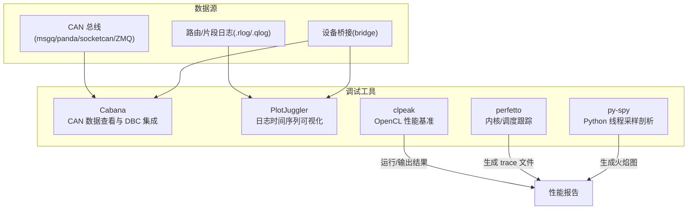
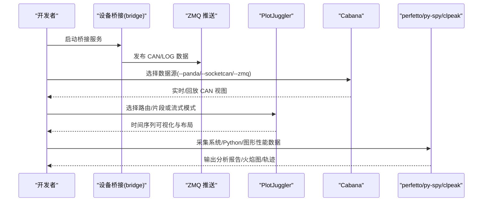
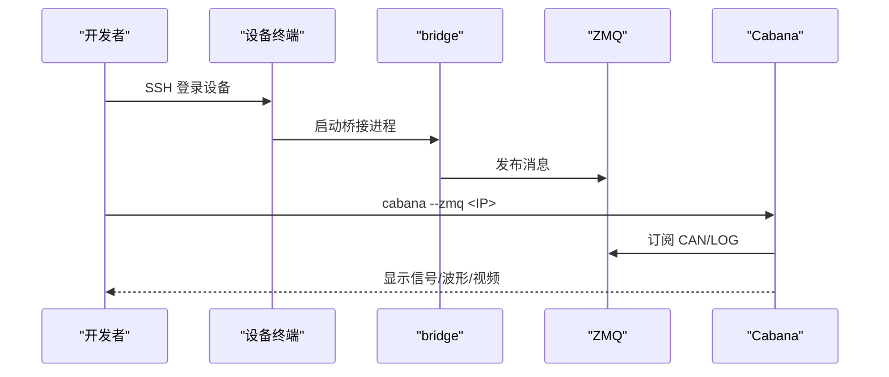
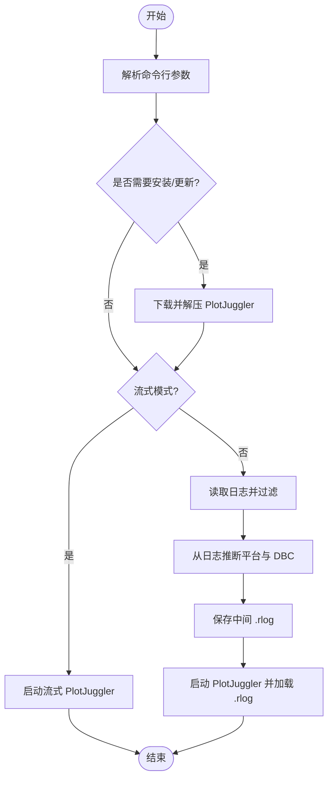
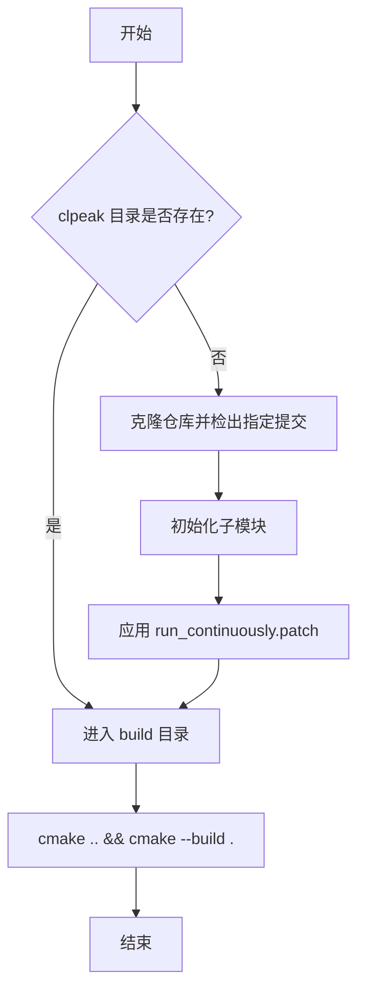
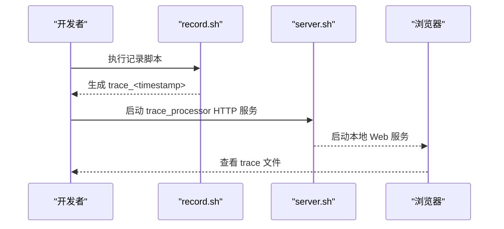
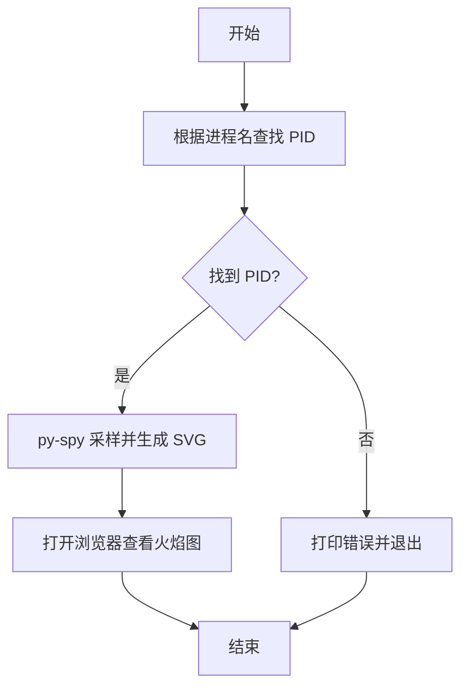
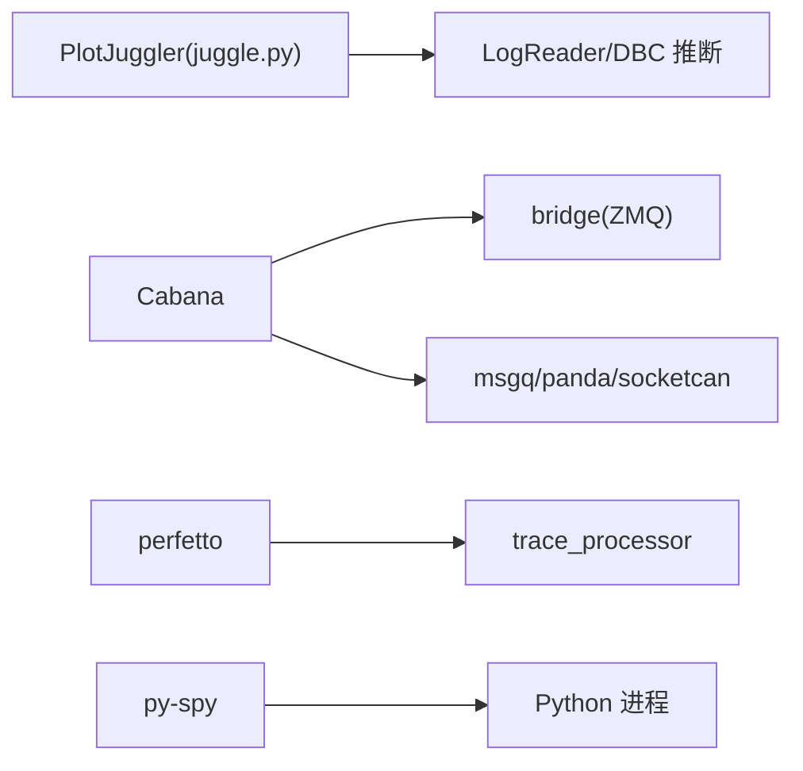

# 调试工具

<cite>
**本文引用的文件**
- [tools/README.md](file://tools/README.md)
- [tools/cabana/README.md](file://tools/cabana/README.md)
- [tools/plotjuggler/README.md](file://tools/plotjuggler/README.md)
- [tools/plotjuggler/juggle.py](file://tools/plotjuggler/juggle.py)
- [tools/profiling/clpeak/build.sh](file://tools/profiling/clpeak/build.sh)
- [tools/profiling/clpeak/run_continuously.patch](file://tools/profiling/clpeak/run_continuously.patch)
- [tools/profiling/perfetto/record.sh](file://tools/profiling/perfetto/record.sh)
- [tools/profiling/perfetto/server.sh](file://tools/profiling/perfetto/server.sh)
- [tools/profiling/py-spy/profile.sh](file://tools/profiling/py-spy/profile.sh)
</cite>

## 目录
1. [简介](#简介)
2. [项目结构](#项目结构)
3. [核心组件](#核心组件)
4. [架构总览](#架构总览)
5. [详细组件分析](#详细组件分析)
6. [依赖关系分析](#依赖关系分析)
7. [性能考量](#性能考量)
8. [故障排除指南](#故障排除指南)
9. [结论](#结论)
10. [附录](#附录)

## 简介
本文件面向自动驾驶与智能驾驶系统（openpilot）的开发者与测试工程师，系统化梳理仓库中提供的调试工具链：CAN 总线分析工具 Cabana、日志时间序列可视化工具 PlotJuggler，以及性能分析工具链（clpeak、perfetto、py-spy）。文档从架构与数据流角度出发，结合具体脚本与命令行参数，给出可操作的使用步骤、最佳实践、常见问题排查与优化建议，并通过图示帮助不同层次的读者快速上手。

## 项目结构
tools 目录下集中了多种调试与分析工具，按功能可分为三类：
- 实时/离线数据可视化与回放：cabana、plotjuggler
- 性能分析工具链：clpeak、perfetto、py-spy
- 其他辅助工具与脚本：replay、sim、scripts 等

图表来源
- [tools/README.md:62-78](file://tools/README.md#L62-L78)
- [tools/cabana/README.md:1-99](file://tools/cabana/README.md#L1-L99)
- [tools/plotjuggler/README.md:1-75](file://tools/plotjuggler/README.md#L1-L75)

章节来源
- [tools/README.md:1-78](file://tools/README.md#L1-L78)

## 核心组件
- Cabana：用于查看与编辑 DBC、回放与实时查看 CAN 消息，支持多路摄像头与多种数据源接入。
- PlotJuggler：解析 openpilot 日志并可视化时间序列，支持布局模板与流式模式。
- 性能分析工具链：clpeak（OpenCL）、perfetto（内核/调度跟踪）、py-spy（Python 线程采样）。

章节来源
- [tools/cabana/README.md:1-99](file://tools/cabana/README.md#L1-L99)
- [tools/plotjuggler/README.md:1-75](file://tools/plotjuggler/README.md#L1-L75)

## 架构总览
下图展示了典型调试工作流：从设备桥接、日志采集到可视化与性能剖析的整体路径。

图表来源
- [tools/cabana/README.md:61-79](file://tools/cabana/README.md#L61-L79)
- [tools/plotjuggler/README.md:47-56](file://tools/plotjuggler/README.md#L47-L56)

## 详细组件分析

### Cabana 组件分析
Cabana 是一个强大的 CAN 数据查看与 DBC 编辑工具，支持多种数据源与摄像头叠加显示，便于在真实/仿真场景下进行信号级调试。

- 主要特性
  - 支持 DBC 文件加载与保存，直接对接 opendbc。
  - 多数据源接入：msgq、panda、socketcan、ZMQ。
  - 实时/回放缓冲与本地日志目录管理。
  - 可选加载多个摄像头通道以辅助感知调试。

- 关键命令行参数
  - --demo：使用内置演示路由。
  - --qcam/--ecam：加载前置/广角摄像头。
  - --msgq/--panda/--panda-serial/--socketcan/--zmq：指定数据源。
  - --data_dir：本地路由目录。
  - --no-vipc：不输出视频。
  - --dbc：显式指定 DBC 文件。

- 使用流程（基于仓库文档）
  1) 设备侧启动桥接服务，确保 CAN/LOG 通过 ZMQ 发布。
  2) 在笔记本上以 --zmq 方式连接设备 IP。
  3) 若需实时分析，可在菜单“工具 -> 设置”中调整本地日志目录。
  4) 断开设备后，使用“流选择器 -> 浏览本地路由”回放历史。

图表来源
- [tools/cabana/README.md:61-79](file://tools/cabana/README.md#L61-L79)

章节来源
- [tools/cabana/README.md:1-99](file://tools/cabana/README.md#L1-L99)

### PlotJuggler 组件分析
PlotJuggler 用于解析 openpilot 日志并进行时间序列可视化，支持自动推断 DBC、布局模板与流式模式。

- 安装与运行
  - 安装：执行安装脚本下载 PlotJuggler 并放置插件。
  - 运行：支持传入路由/片段名称、段数、布局、是否解析 CAN、是否流式等参数。

- 关键参数
  - --demo：使用内置演示路由。
  - --can：解析 CAN 数据。
  - --stream：启用流式模式。
  - --layout：指定布局 XML。
  - --install：安装/更新 PlotJuggler 与插件。
  - --dbc：显式指定 DBC 名称（未指定则从日志推断）。
  - --no-migration：跳过日志迁移。

- 内部流程（脚本逻辑）
  - 解析输入参数，必要时自动安装 PlotJuggler。
  - 若非流式：读取日志、过滤不需要的数据类型、推断平台与 DBC、保存中间 .rlog、启动 PlotJuggler。
  - 若流式：直接启动 PlotJuggler 并设置缓冲大小与插件目录。

图表来源
- [tools/plotjuggler/juggle.py:105-140](file://tools/plotjuggler/juggle.py#L105-L140)
- [tools/plotjuggler/juggle.py:59-103](file://tools/plotjuggler/juggle.py#L59-L103)

章节来源
- [tools/plotjuggler/README.md:1-75](file://tools/plotjuggler/README.md#L1-L75)
- [tools/plotjuggler/juggle.py:1-140](file://tools/plotjuggler/juggle.py#L1-L140)

### 性能分析工具链

#### clpeak（OpenCL 性能基准）
- 用途：测量 OpenCL 设备的峰值带宽与计算能力，常用于 GPU/加速器性能评估。
- 构建与补丁
  - 自动克隆仓库、检出特定提交、初始化子模块。
  - 应用持续运行补丁以支持连续测试场景。
  - 使用 cmake 构建。

图表来源
- [tools/profiling/clpeak/build.sh:1-23](file://tools/profiling/clpeak/build.sh#L1-L23)
- [tools/profiling/clpeak/run_continuously.patch:1-14](file://tools/profiling/clpeak/run_continuously.patch#L1-L14)

章节来源
- [tools/profiling/clpeak/build.sh:1-23](file://tools/profiling/clpeak/build.sh#L1-L23)
- [tools/profiling/clpeak/run_continuously.patch:1-14](file://tools/profiling/clpeak/run_continuously.patch#L1-L14)

#### perfetto（内核/调度跟踪）
- 用途：收集系统调度、CPU/内核事件，生成 trace 文件并在本地服务器查看。
- 关键脚本
  - record.sh：以 sudo 权限运行 tracebox，输出带时间戳的 trace 文件并修改属主。
  - server.sh：下载 trace_processor 并启动 HTTP 服务，便于浏览器查看。

图表来源
- [tools/profiling/perfetto/record.sh:1-9](file://tools/profiling/perfetto/record.sh#L1-L9)
- [tools/profiling/perfetto/server.sh:1-7](file://tools/profiling/perfetto/server.sh#L1-L7)

章节来源
- [tools/profiling/perfetto/record.sh:1-9](file://tools/profiling/perfetto/record.sh#L1-L9)
- [tools/profiling/perfetto/server.sh:1-7](file://tools/profiling/perfetto/server.sh#L1-L7)

#### py-spy（Python 线程采样剖析）
- 用途：对运行中的 Python 进程进行采样，生成火焰图，定位热点函数与阻塞点。
- 工作流程
  - 根据进程名查找 PID（忽略自身）。
  - 使用 py-spy 对目标 PID 进行采样，输出 SVG 火焰图并自动打开浏览器。

图表来源
- [tools/profiling/py-spy/profile.sh:1-22](file://tools/profiling/py-spy/profile.sh#L1-L22)

章节来源
- [tools/profiling/py-spy/profile.sh:1-22](file://tools/profiling/py-spy/profile.sh#L1-L22)

## 依赖关系分析
- PlotJuggler 依赖 openpilot 的日志读取与 DBC 推断逻辑；其安装脚本会根据平台下载对应二进制包。
- Cabana 依赖设备桥接服务（bridge）通过 ZMQ 提供实时数据；也可从 msgq/panda/socketcan 直接读取。
- perfetto 依赖系统内核跟踪能力与 tracebox/trace_processor；py-spy 依赖系统权限与 Python 进程存在。

图表来源
- [tools/plotjuggler/juggle.py:13-18](file://tools/plotjuggler/juggle.py#L13-L18)
- [tools/cabana/README.md:61-79](file://tools/cabana/README.md#L61-L79)
- [tools/profiling/perfetto/server.sh:1-7](file://tools/profiling/perfetto/server.sh#L1-7)
- [tools/profiling/py-spy/profile.sh:1-22](file://tools/profiling/py-spy/profile.sh#L1-L22)

## 性能考量
- 采样时长与频率：perfetto 与 py-spy 的采样时长应覆盖典型工况，避免过短导致统计偏差。
- 缓冲区大小：PlotJuggler 的流式缓冲区大小影响实时性与内存占用，需根据数据速率调优。
- DBC 推断准确性：若日志中缺少 carParams，DBC 推断可能失败，需手动指定 --dbc。
- 权限与依赖：perfetto 需要 sudo 权限，py-spy 需要对目标进程的访问权限，确保正确安装与授权。

## 故障排除指南
- PlotJuggler 无法启动或版本过低
  - 现象：提示版本过低或缺失二进制。
  - 处理：执行安装脚本自动下载最新版本；确认网络可达 GitHub Releases。
  - 参考：[tools/plotjuggler/README.md:7-10](file://tools/plotjuggler/README.md#L7-L10)，[tools/plotjuggler/juggle.py:127-134](file://tools/plotjuggler/juggle.py#L127-L134)
- DBC 推断失败
  - 现象：无法从日志推断平台与 DBC。
  - 处理：使用 --dbc 显式指定 DBC 名称；检查日志中 carParams 是否存在。
  - 参考：[tools/plotjuggler/juggle.py:89-98](file://tools/plotjuggler/juggle.py#L89-L98)
- Cabana 无法连接设备
  - 现象：--zmq 无法获取数据或断连。
  - 处理：确认设备端 bridge 正常运行；笔记本连接同一网络；检查防火墙与端口。
  - 参考：[tools/cabana/README.md:61-72](file://tools/cabana/README.md#L61-L72)
- perfetto 无输出或权限不足
  - 现象：tracebox 报错或生成文件属主异常。
  - 处理：以 sudo 运行 record.sh；确保内核跟踪模块可用；使用 server.sh 启动本地查看。
  - 参考：[tools/profiling/perfetto/record.sh:1-9](file://tools/profiling/perfetto/record.sh#L1-L9)，[tools/profiling/perfetto/server.sh:1-7](file://tools/profiling/perfetto/server.sh#L1-L7)
- py-spy 无法找到进程
  - 现象：找不到匹配的 Python 进程 PID。
  - 处理：确认进程名正确且进程正在运行；检查权限；尝试使用完整命令行参数。
  - 参考：[tools/profiling/py-spy/profile.sh:6-18](file://tools/profiling/py-spy/profile.sh#L6-L18)

章节来源
- [tools/plotjuggler/README.md:7-10](file://tools/plotjuggler/README.md#L7-L10)
- [tools/plotjuggler/juggle.py:89-98](file://tools/plotjuggler/juggle.py#L89-L98)
- [tools/cabana/README.md:61-72](file://tools/cabana/README.md#L61-L72)
- [tools/profiling/perfetto/record.sh:1-9](file://tools/profiling/perfetto/record.sh#L1-L9)
- [tools/profiling/perfetto/server.sh:1-7](file://tools/profiling/perfetto/server.sh#L1-L7)
- [tools/profiling/py-spy/profile.sh:6-18](file://tools/profiling/py-spy/profile.sh#L6-L18)

## 结论
本文件基于仓库内的工具脚本与文档，系统化梳理了 openpilot 调试工具链的使用方式与实现要点。通过 Cabana 的 CAN 视图、PlotJuggler 的日志可视化与布局定制，以及 perfetto/py-spy/clpeak 的系统/Python/图形性能剖析，开发者可以高效地定位问题、分析瓶颈并优化系统行为。建议在日常开发中结合流式模式与布局模板提升效率，并在遇到环境差异时优先检查依赖与权限。

## 附录
- 快速参考
  - PlotJuggler：安装与运行参见 [tools/plotjuggler/README.md:7-10](file://tools/plotjuggler/README.md#L7-L10) 与 [tools/plotjuggler/juggle.py:105-140](file://tools/plotjuggler/juggle.py#L105-L140)。
  - Cabana：数据源与示例参见 [tools/cabana/README.md:61-79](file://tools/cabana/README.md#L61-L79)。
  - perfetto：记录与查看参见 [tools/profiling/perfetto/record.sh:1-9](file://tools/profiling/perfetto/record.sh#L1-L9) 与 [tools/profiling/perfetto/server.sh:1-7](file://tools/profiling/perfetto/server.sh#L1-L7)。
  - py-spy：采样与火焰图参见 [tools/profiling/py-spy/profile.sh:1-22](file://tools/profiling/py-spy/profile.sh#L1-L22)。
  - clpeak：构建与补丁参见 [tools/profiling/clpeak/build.sh:1-23](file://tools/profiling/clpeak/build.sh#L1-L23) 与 [tools/profiling/clpeak/run_continuously.patch:1-14](file://tools/profiling/clpeak/run_continuously.patch#L1-L14)。