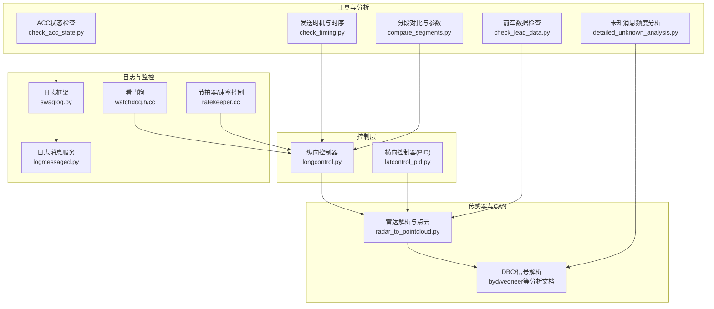
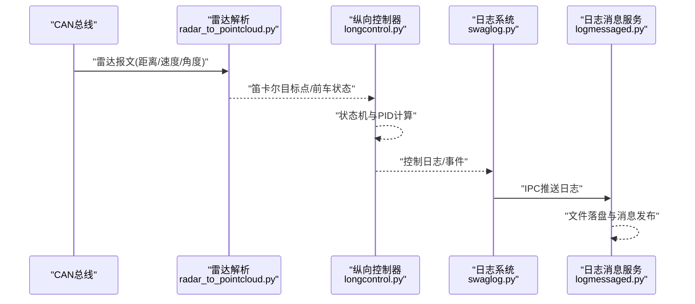
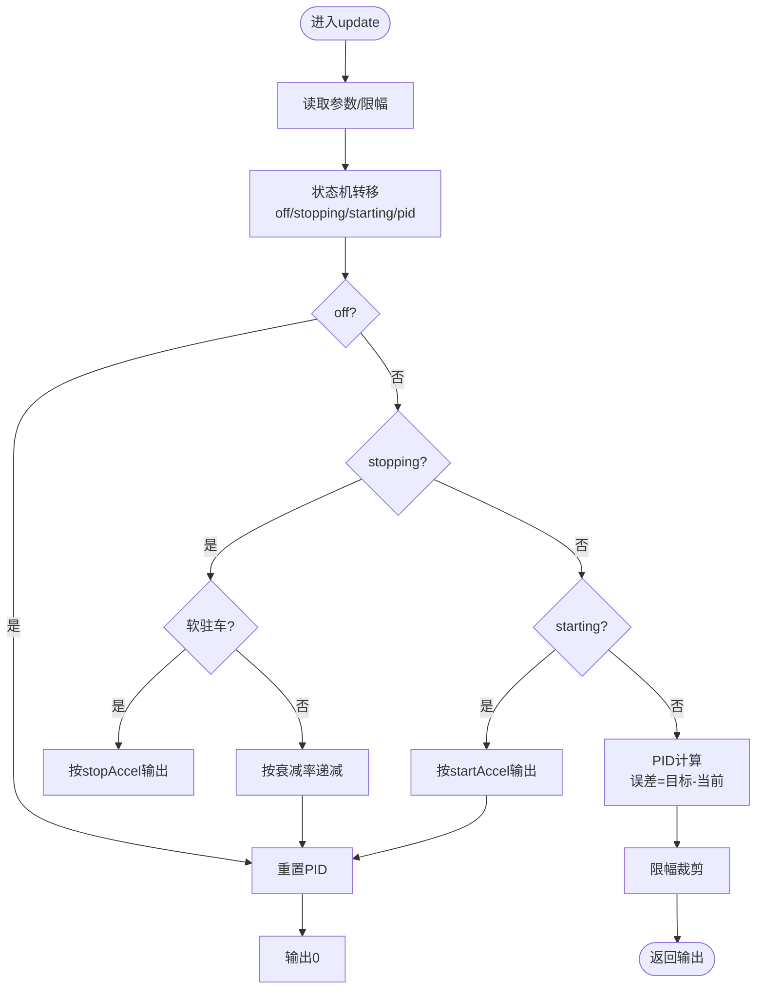
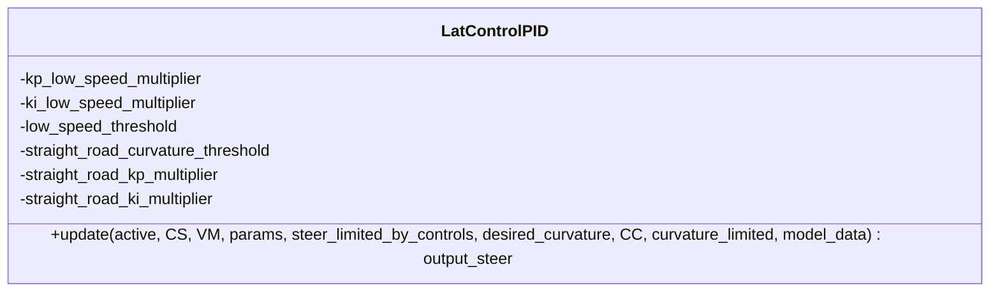
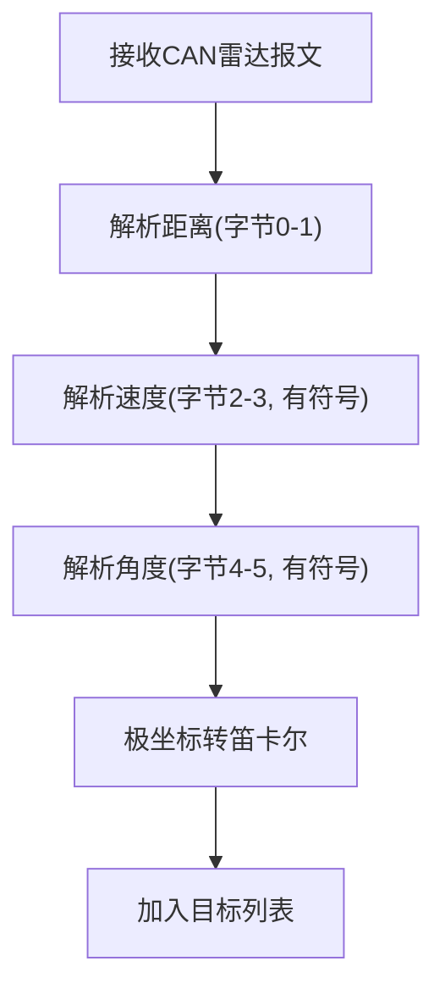
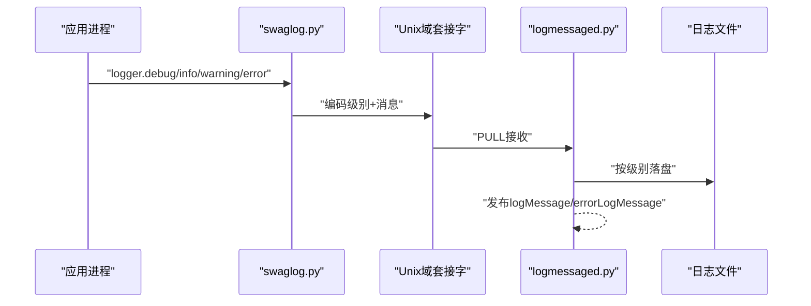
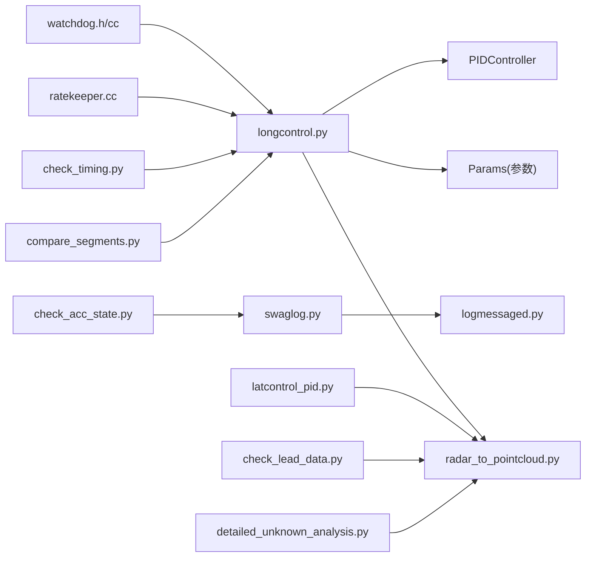

# 故障排除指南

<cite>
**本文引用的文件**
- [README.md](file://README.md)
- [docs/SAFETY.md](file://docs/SAFETY.md)
- [selfdrive/controls/lib/longcontrol.py](file://selfdrive/controls/lib/longcontrol.py)
- [selfdrive/controls/lib/latcontrol_pid.py](file://selfdrive/controls/lib/latcontrol_pid.py)
- [common/swaglog.py](file://common/swaglog.py)
- [system/logmessaged.py](file://system/logmessaged.py)
- [common/watchdog.h](file://common/watchdog.h)
- [common/watchdog.cc](file://common/watchdog.cc)
- [common/ratekeeper.cc](file://common/ratekeeper.cc)
- [common/swaglog.h](file://common/swaglog.h)
- [ACC_RADAR_ANALYSIS_FINDINGS.md](file://ACC_RADAR_ANALYSIS_FINDINGS.md)
- [BYD_RADAR_ANALYSIS_CONCLUSION.md](file://BYD_RADAR_ANALYSIS_CONCLUSION.md)
- [check_acc_state.py](file://check_acc_state.py)
- [check_lead_data.py](file://check_lead_data.py)
- [check_timing.py](file://check_timing.py)
- [compare_segments.py](file://compare_segments.py)
- [detailed_unknown_analysis.py](file://detailed_unknown_analysis.py)
- [radar_to_pointcloud.py](file://radar_to_pointcloud.py)
</cite>

## 目录
1. [简介](#简介)
2. [项目结构](#项目结构)
3. [核心组件](#核心组件)
4. [架构总览](#架构总览)
5. [详细组件分析](#详细组件分析)
6. [依赖关系分析](#依赖关系分析)
7. [性能考量](#性能考量)
8. [故障排除指南](#故障排除指南)
9. [结论](#结论)
10. [附录](#附录)

## 简介
本指南面向Carrot2-v9-ACC项目的使用者与维护者，聚焦于常见问题的定位与解决，涵盖CAN通信问题、传感器数据异常、控制算法失效等场景。文档提供调试技巧与工具使用方法（日志分析、性能监控、系统诊断），解释性能优化最佳实践（参数调优、算法优化、资源管理），并给出标准化的故障排除流程与标准操作程序（SOP）。文中所有技术细节均来源于仓库内的实际代码与分析文档，便于初学者理解的同时也为有经验的开发者提供深入参考。

## 项目结构
Carrot2-v9-ACC是一个基于openpilot生态的自适应巡航增强实现，围绕纵向控制（ACC）、横向控制（车道保持/居中）以及CAN总线通信展开。与ACC相关的典型模块包括：
- 控制层：纵向控制器、横向控制器
- 传感器与CAN：雷达解析、CAN消息解析与转发
- 日志与监控：本地日志、IPC日志转发、看门狗与节拍器
- 工具链：日志分析脚本、雷达可视化与验证工具

图示来源
- [selfdrive/controls/lib/longcontrol.py:54-137](file://selfdrive/controls/lib/longcontrol.py#L54-L137)
- [selfdrive/controls/lib/latcontrol_pid.py:8-83](file://selfdrive/controls/lib/latcontrol_pid.py#L8-L83)
- [radar_to_pointcloud.py:51-73](file://radar_to_pointcloud.py#L51-L73)
- [common/swaglog.py:126-145](file://common/swaglog.py#L126-L145)
- [system/logmessaged.py:12-66](file://system/logmessaged.py#L12-L66)
- [common/watchdog.h:5-6](file://common/watchdog.h#L5-L6)
- [common/watchdog.cc:9-12](file://common/watchdog.cc#L9-L12)
- [common/ratekeeper.cc:1-40](file://common/ratekeeper.cc#L1-L40)
- [check_acc_state.py:14-56](file://check_acc_state.py#L14-L56)
- [check_lead_data.py:14-105](file://check_lead_data.py#L14-L105)
- [check_timing.py:40-57](file://check_timing.py#L40-L57)
- [compare_segments.py:43-56](file://compare_segments.py#L43-L56)
- [detailed_unknown_analysis.py:188-224](file://detailed_unknown_analysis.py#L188-L224)

章节来源
- [README.md:1-144](file://README.md#L1-L144)

## 核心组件
- 纵向控制器（ACC）：负责纵向加速度输出与状态机切换，依据目标速度/加速度与雷达/模型提供的前车信息计算输出。
- 横向控制器（Lateral PID）：基于期望曲率与当前转向角误差，采用速度与路况自适应的PID参数，抑制低速振荡与直道不稳定。
- 日志系统：统一日志格式与输出，支持文件轮转、IPC转发至消息总线，便于远程查看与发布。
- 看门狗与节拍器：看门狗写入共享内存标记进程存活；节拍器保证周期性任务按预期速率执行，超时打印告警。
- 雷达解析与可视化：解析CAN雷达报文，转换为笛卡尔坐标点云，辅助检测范围与数据合理性验证。

章节来源
- [selfdrive/controls/lib/longcontrol.py:54-137](file://selfdrive/controls/lib/longcontrol.py#L54-L137)
- [selfdrive/controls/lib/latcontrol_pid.py:8-83](file://selfdrive/controls/lib/latcontrol_pid.py#L8-L83)
- [common/swaglog.py:126-145](file://common/swaglog.py#L126-L145)
- [system/logmessaged.py:12-66](file://system/logmessaged.py#L12-L66)
- [common/watchdog.h:5-6](file://common/watchdog.h#L5-L6)
- [common/watchdog.cc:9-12](file://common/watchdog.cc#L9-L12)
- [common/ratekeeper.cc:1-40](file://common/ratekeeper.cc#L1-L40)
- [radar_to_pointcloud.py:51-73](file://radar_to_pointcloud.py#L51-L73)

## 架构总览
下图展示从CAN到控制输出的关键路径，以及日志与监控的贯穿：

图示来源
- [radar_to_pointcloud.py:51-73](file://radar_to_pointcloud.py#L51-L73)
- [selfdrive/controls/lib/longcontrol.py:76-137](file://selfdrive/controls/lib/longcontrol.py#L76-L137)
- [common/swaglog.py:126-145](file://common/swaglog.py#L126-L145)
- [system/logmessaged.py:12-66](file://system/logmessaged.py#L12-L66)

## 详细组件分析

### 纵向控制器（ACC）分析
纵向控制器实现状态机与PID控制，依据目标轨迹与当前状态输出加速度指令，并处理软驻车、起动加速、停止减速等场景。

图示来源
- [selfdrive/controls/lib/longcontrol.py:14-52](file://selfdrive/controls/lib/longcontrol.py#L14-L52)
- [selfdrive/controls/lib/longcontrol.py:76-137](file://selfdrive/controls/lib/longcontrol.py#L76-L137)

章节来源
- [selfdrive/controls/lib/longcontrol.py:54-137](file://selfdrive/controls/lib/longcontrol.py#L54-L137)

### 横向控制器（Lateral PID）分析
横向控制器基于期望曲率与当前转向角误差，采用速度与直道条件自适应调整PID参数，降低低速振荡与直道发散风险。

图示来源
- [selfdrive/controls/lib/latcontrol_pid.py:8-83](file://selfdrive/controls/lib/latcontrol_pid.py#L8-L83)

章节来源
- [selfdrive/controls/lib/latcontrol_pid.py:8-83](file://selfdrive/controls/lib/latcontrol_pid.py#L8-L83)

### 雷达解析与点云生成
雷达解析将CAN报文中的距离、速度、角度字段按协议解析为笛卡尔坐标，用于可视化与检测范围评估。

图示来源
- [radar_to_pointcloud.py:51-73](file://radar_to_pointcloud.py#L51-L73)

章节来源
- [radar_to_pointcloud.py:51-73](file://radar_to_pointcloud.py#L51-L73)

### 日志系统与IPC转发
日志系统通过文件轮转与IPC推送，将运行期日志统一收集并发布到消息总线，便于远程查看与告警。

图示来源
- [common/swaglog.py:126-145](file://common/swaglog.py#L126-L145)
- [system/logmessaged.py:12-66](file://system/logmessaged.py#L12-L66)

章节来源
- [common/swaglog.py:126-145](file://common/swaglog.py#L126-L145)
- [system/logmessaged.py:12-66](file://system/logmessaged.py#L12-L66)

## 依赖关系分析
- 控制层依赖传感器/雷达提供的状态与目标信息，参数通过Params读取，PID控制器受限幅约束。
- 日志系统被多模块依赖，日志消息服务负责IPC接收与落盘。
- 看门狗与节拍器分别保障进程存活标记与周期性任务节奏。
- 工具链脚本依赖日志读取器，用于定位状态异常、前车数据缺失或发送时机异常等问题。

图示来源
- [selfdrive/controls/lib/longcontrol.py:54-137](file://selfdrive/controls/lib/longcontrol.py#L54-L137)
- [selfdrive/controls/lib/latcontrol_pid.py:8-83](file://selfdrive/controls/lib/latcontrol_pid.py#L8-L83)
- [common/swaglog.py:126-145](file://common/swaglog.py#L126-L145)
- [system/logmessaged.py:12-66](file://system/logmessaged.py#L12-L66)
- [common/watchdog.h:5-6](file://common/watchdog.h#L5-L6)
- [common/watchdog.cc:9-12](file://common/watchdog.cc#L9-L12)
- [common/ratekeeper.cc:1-40](file://common/ratekeeper.cc#L1-L40)
- [check_acc_state.py:14-56](file://check_acc_state.py#L14-L56)
- [check_lead_data.py:14-105](file://check_lead_data.py#L14-L105)
- [check_timing.py:40-57](file://check_timing.py#L40-L57)
- [compare_segments.py:43-56](file://compare_segments.py#L43-L56)
- [detailed_unknown_analysis.py:188-224](file://detailed_unknown_analysis.py#L188-L224)

章节来源
- [selfdrive/controls/lib/longcontrol.py:54-137](file://selfdrive/controls/lib/longcontrol.py#L54-L137)
- [selfdrive/controls/lib/latcontrol_pid.py:8-83](file://selfdrive/controls/lib/latcontrol_pid.py#L8-L83)
- [common/swaglog.py:126-145](file://common/swaglog.py#L126-L145)
- [system/logmessaged.py:12-66](file://system/logmessaged.py#L12-L66)
- [common/watchdog.h:5-6](file://common/watchdog.h#L5-L6)
- [common/watchdog.cc:9-12](file://common/watchdog.cc#L9-L12)
- [common/ratekeeper.cc:1-40](file://common/ratekeeper.cc#L1-L40)
- [check_acc_state.py:14-56](file://check_acc_state.py#L14-L56)
- [check_lead_data.py:14-105](file://check_lead_data.py#L14-L105)
- [check_timing.py:40-57](file://check_timing.py#L40-L57)
- [compare_segments.py:43-56](file://compare_segments.py#L43-L56)
- [detailed_unknown_analysis.py:188-224](file://detailed_unknown_analysis.py#L188-L224)

## 性能考量
- 参数调优
  - 纵向：通过参数读取与周期性刷新，动态调整停止加速度与PID参数，避免频繁硬切。
  - 横向：低速与直道场景自适应降低P/I增益，减少振荡与方向盘抖动。
- 算法优化
  - 速率控制：使用节拍器保证控制循环稳定，超时打印滞后告警，便于识别卡顿。
  - 日志吞吐：IPC优先，避免阻塞磁盘I/O；设置合理的轮转阈值与备份数量。
- 资源管理
  - 看门狗定期写入，配合进程管理器判定存活状态。
  - 合理的线程亲和与实时优先级设置可提升确定性（见通用工具头文件）。

章节来源
- [selfdrive/controls/lib/longcontrol.py:84-94](file://selfdrive/controls/lib/longcontrol.py#L84-L94)
- [selfdrive/controls/lib/latcontrol_pid.py:58-71](file://selfdrive/controls/lib/latcontrol_pid.py#L58-L71)
- [common/ratekeeper.cc:17-40](file://common/ratekeeper.cc#L17-L40)
- [common/swaglog.py:20-65](file://common/swaglog.py#L20-L65)
- [common/watchdog.cc:9-12](file://common/watchdog.cc#L9-L12)
- [common/swaglog.h:18-34](file://common/swaglog.h#L18-L34)

## 故障排除指南

### 一、CAN通信问题排查
- 现象
  - ACC命令未发送或发送时机异常
  - 前车数据缺失或不一致
  - 雷达报文解析异常或范围不合理
- 排查步骤
  1) 使用发送时机与时序脚本检查MPC ACC_CMD帧间隔与帧计数，确认是否通过sendcan发送。
  2) 对比不同分段的sendcan与CAN总线帧分布，核对参数（如SpeedFromPCM）。
  3) 若雷达解析异常，检查速度/角度缩放因子与字节序，确保在合理物理范围内。
- 工具与脚本
  - 发送时机与时序：[check_timing.py:40-57](file://check_timing.py#L40-L57)
  - 分段对比与参数：[compare_segments.py:43-56](file://compare_segments.py#L43-L56)
  - 雷达解析修正与范围评估：[ACC_RADAR_ANALYSIS_FINDINGS.md:20-48](file://ACC_RADAR_ANALYSIS_FINDINGS.md#L20-L48)、[BYD_RADAR_ANALYSIS_CONCLUSION.md:14-22](file://BYD_RADAR_ANALYSIS_CONCLUSION.md#L14-L22)

章节来源
- [check_timing.py:40-57](file://check_timing.py#L40-L57)
- [compare_segments.py:43-56](file://compare_segments.py#L43-L56)
- [ACC_RADAR_ANALYSIS_FINDINGS.md:20-48](file://ACC_RADAR_ANALYSIS_FINDINGS.md#L20-L48)
- [BYD_RADAR_ANALYSIS_CONCLUSION.md:14-22](file://BYD_RADAR_ANALYSIS_CONCLUSION.md#L14-L22)

### 二、传感器数据异常排查
- 现象
  - 前车距离/相对速度异常跳变
  - 静止状态下前车数据仍存在
  - 雷达点云分布异常或目标数量骤降
- 排查步骤
  1) 使用前车数据检查脚本，筛选静止时间段，观察modelV2与radarState中的前车状态与距离变化。
  2) 对比modelV2与radarState来源，确认数据一致性与来源差异。
  3) 结合雷达解析脚本，验证距离/速度/角度在物理合理范围。
- 工具与脚本
  - 前车数据检查：[check_lead_data.py:14-105](file://check_lead_data.py#L14-L105)
  - 雷达解析与点云：[radar_to_pointcloud.py:51-73](file://radar_to_pointcloud.py#L51-L73)

章节来源
- [check_lead_data.py:14-105](file://check_lead_data.py#L14-L105)
- [radar_to_pointcloud.py:51-73](file://radar_to_pointcloud.py#L51-L73)

### 三、控制算法失效排查
- 现象
  - ACC启停异常或频繁抖动
  - 横向控制在低速/直道发散
  - 输出加速度超出限幅或无响应
- 排查步骤
  1) 检查纵向状态机转移条件与停止/起动逻辑，确认软驻车与停止加速度参数。
  2) 校验PID参数读取与限幅设置，关注参数刷新周期。
  3) 检查横向PID参数自适应逻辑，确认低速与直道阈值设置。
- 工具与脚本
  - 纵向控制逻辑：[selfdrive/controls/lib/longcontrol.py:14-52](file://selfdrive/controls/lib/longcontrol.py#L14-L52)
  - 横向PID参数自适应：[selfdrive/controls/lib/latcontrol_pid.py:58-71](file://selfdrive/controls/lib/latcontrol_pid.py#L58-L71)

章节来源
- [selfdrive/controls/lib/longcontrol.py:14-52](file://selfdrive/controls/lib/longcontrol.py#L14-L52)
- [selfdrive/controls/lib/longcontrol.py:84-94](file://selfdrive/controls/lib/longcontrol.py#L84-L94)
- [selfdrive/controls/lib/latcontrol_pid.py:58-71](file://selfdrive/controls/lib/latcontrol_pid.py#L58-L71)

### 四、日志分析与系统诊断
- 日志收集与发布
  - 应用侧通过日志框架输出，IPC推送至日志消息服务，后者负责落盘与消息发布。
  - 当日志过大或解码异常时，日志消息服务会记录警告并发布错误消息。
- 诊断要点
  - 查看IPC连接状态与消息队列积压
  - 检查文件轮转策略与备份数量
  - 关注ERROR及以上级别的日志，结合错误消息定位问题
- 工具与脚本
  - 日志框架与IPC：[common/swaglog.py:126-145](file://common/swaglog.py#L126-L145)
  - 日志消息服务：[system/logmessaged.py:12-66](file://system/logmessaged.py#L12-L66)

章节来源
- [common/swaglog.py:126-145](file://common/swaglog.py#L126-L145)
- [system/logmessaged.py:12-66](file://system/logmessaged.py#L12-L66)

### 五、性能监控与系统健康检查
- 性能监控
  - 使用节拍器监控控制循环是否滞后，识别周期性任务卡顿。
  - 通过日志级别与输出通道，区分普通信息与严重告警。
- 系统健康检查
  - 看门狗定时写入，确认进程存活标记正常。
  - 参数读取与PID刷新周期检查，避免参数陈旧导致控制异常。
- 工具与脚本
  - 节拍器：[common/ratekeeper.cc:17-40](file://common/ratekeeper.cc#L17-L40)
  - 看门狗接口：[common/watchdog.h:5-6](file://common/watchdog.h#L5-L6)、[common/watchdog.cc:9-12](file://common/watchdog.cc#L9-L12)

章节来源
- [common/ratekeeper.cc:17-40](file://common/ratekeeper.cc#L17-L40)
- [common/watchdog.h:5-6](file://common/watchdog.h#L5-L6)
- [common/watchdog.cc:9-12](file://common/watchdog.cc#L9-L12)

### 六、预防性维护与标准操作程序（SOP）
- 预防性维护
  - 定期校准雷达解析参数（缩放因子、字节序），确保物理合理性。
  - 检查参数读取与PID刷新策略，避免参数老化。
  - 监控日志大小与轮转策略，防止磁盘空间耗尽。
- SOP（以“雷达解析异常”为例）
  1) 复现问题并采集一段日志
  2) 使用雷达解析脚本与点云生成工具验证数据范围
  3) 核对速度/角度缩放因子与字节序
  4) 更新解析参数并回归测试
  5) 观察日志与控制输出，确认恢复
- 工具与脚本
  - 雷达解析与范围评估：[ACC_RADAR_ANALYSIS_FINDINGS.md:20-48](file://ACC_RADAR_ANALYSIS_FINDINGS.md#L20-L48)
  - 雷达点云生成：[radar_to_pointcloud.py:51-73](file://radar_to_pointcloud.py#L51-L73)

章节来源
- [ACC_RADAR_ANALYSIS_FINDINGS.md:20-48](file://ACC_RADAR_ANALYSIS_FINDINGS.md#L20-L48)
- [radar_to_pointcloud.py:51-73](file://radar_to_pointcloud.py#L51-L73)

## 结论
本指南基于Carrot2-v9-ACC的实际代码与分析文档，提供了从CAN通信、传感器数据到控制算法与日志监控的全链路故障排除方法。通过参数调优、算法优化与资源管理，可显著提升ACC系统的稳定性与安全性。建议在开发与运维中遵循SOP，结合日志与工具链进行系统化诊断与预防性维护。

## 附录
- 安全注意事项
  - ACC与ALC系统为被动失效安全系统，驾驶员必须随时接管；系统无任何用途的适销性担保。
  - 开发与使用需符合相关法规与行业标准（如ISO26262）。
- 参考文档
  - [docs/SAFETY.md:1-37](file://docs/SAFETY.md#L1-L37)

章节来源
- [docs/SAFETY.md:1-37](file://docs/SAFETY.md#L1-L37)