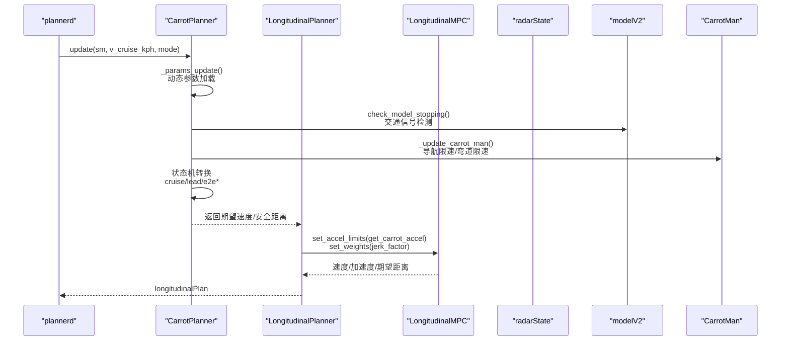
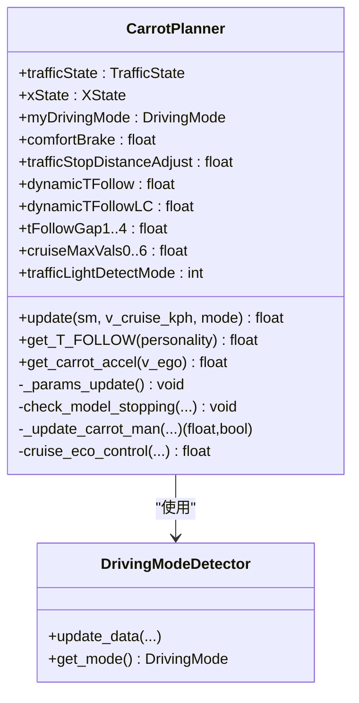
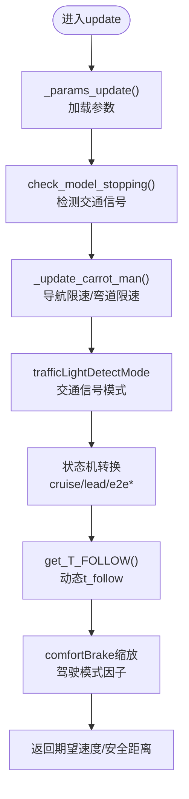
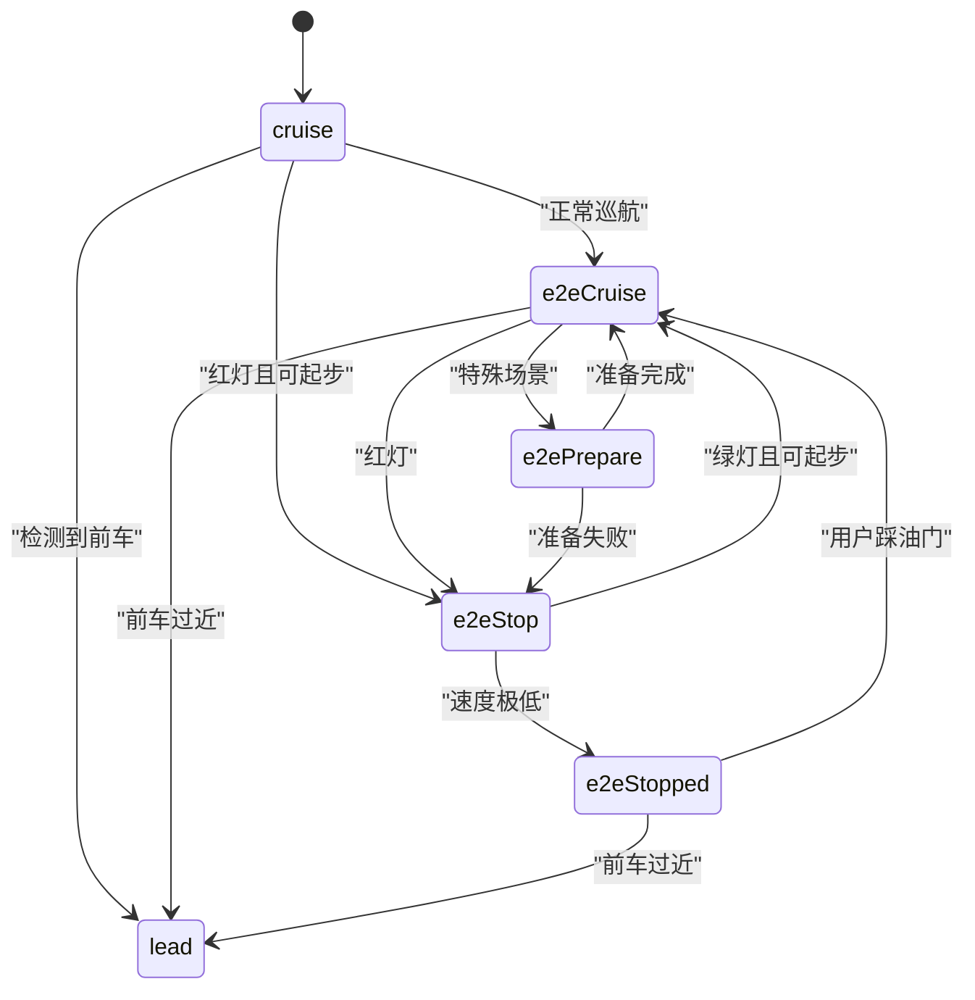
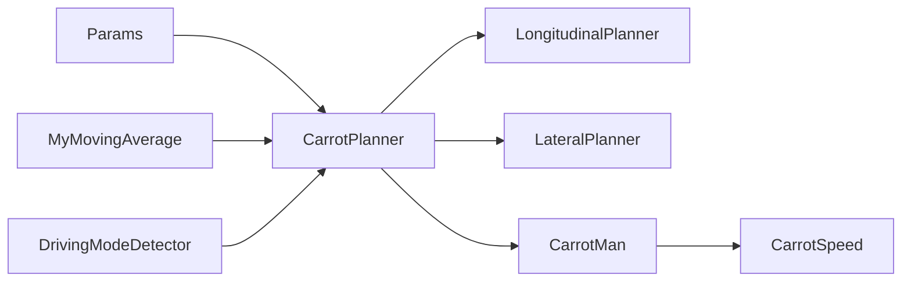

# CarrotPlanner核心算法

<cite>
**本文档引用的文件**
- [carrot_functions.py](file://selfdrive/carrot/carrot_functions.py)
- [carrot_man.py](file://selfdrive/carrot/carrot_man.py)
- [carrot_speed.py](file://selfdrive/carrot/carrot_speed.py)
- [longitudinal_planner.py](file://selfdrive/controls/lib/longitudinal_planner.py)
- [long_mpc.py](file://selfdrive/controls/lib/longitudinal_mpc_lib/long_mpc.py)
- [lateral_planner.py](file://selfdrive/controls/lib/lateral_planner.py)
- [plannerd.py](file://selfdrive/controls/plannerd.py)
- [carrot_settings.json](file://selfdrive/carrot_settings.json)
- [carrot_setting.py](file://selfdrive/carrot_setting.py)
</cite>

## 目录
1. [简介](#简介)
2. [项目结构](#项目结构)
3. [核心组件](#核心组件)
4. [架构总览](#架构总览)
5. [详细组件分析](#详细组件分析)
6. [依赖关系分析](#依赖关系分析)
7. [性能考虑](#性能考虑)
8. [故障排除指南](#故障排除指南)
9. [结论](#结论)
10. [附录](#附录)

## 简介
本文件面向CarrotPlanner核心算法的技术文档，聚焦于纵向控制算法、状态机设计与控制策略。内容涵盖：
- CarrotPlanner类的实现细节与状态机逻辑
- 纵向控制算法（跟车距离控制、速度调节、ACC增强机制）
- 动态跟车时间间隔计算、舒适制动参数与驾驶模式因子
- 状态机在cruise、lead、e2eCruise、e2eStop、e2ePrepare、e2eStopped之间的转换条件
- 参数更新机制、交通信号检测与用户控制处理
- 配置选项、参数与返回值说明
- 与系统其他组件的集成关系
- 常见问题与解决方案

## 项目结构
CarrotPlanner位于selfdrive/carrot目录，是纵向控制链路中的关键节点，负责根据模型预测、雷达信息与导航限速等输入，输出期望速度与安全距离，并驱动状态机切换。

```mermaid
graph TB
subgraph "Carrot模块"
CF["CarrotPlanner<br/>纵向状态机与参数管理"]
CM["CarrotMan<br/>导航与限速数据"]
CS["CarrotSpeed<br/>速度表缓存"]
end
subgraph "控制链路"
LP["LongitudinalPlanner<br/>纵向规划器"]
MPC["LongitudinalMPC<br/>MPC求解器"]
LAT["LateralPlanner<br/>横向规划器"]
PL["plannerd<br/>调度器"]
end
subgraph "传感器与模型"
RAD["radarState<br/>前车雷达"]
MOD["modelV2<br/>轨迹预测"]
CAR["carState<br/>车辆状态"]
end
PL --> CF
CF --> LP
LP --> MPC
CF <-- RAD
CF <-- MOD
CF <-- CAR
CF --> CM
CM --> CS
LAT --> CAR
```

**图表来源**
- [carrot_functions.py:49-522](file://selfdrive/carrot/carrot_functions.py#L49-L522)
- [carrot_man.py:204-625](file://selfdrive/carrot/carrot_man.py#L204-L625)
- [carrot_speed.py:63-402](file://selfdrive/carrot/carrot_speed.py#L63-L402)
- [longitudinal_planner.py:85-283](file://selfdrive/controls/lib/longitudinal_planner.py#L85-L283)
- [long_mpc.py:364-429](file://selfdrive/controls/lib/longitudinal_mpc_lib/long_mpc.py#L364-L429)
- [lateral_planner.py:34-221](file://selfdrive/controls/lib/lateral_planner.py#L34-L221)
- [plannerd.py:13-28](file://selfdrive/controls/plannerd.py#L13-L28)

**章节来源**
- [carrot_functions.py:49-522](file://selfdrive/carrot/carrot_functions.py#L49-L522)
- [carrot_man.py:204-625](file://selfdrive/carrot/carrot_man.py#L204-L625)
- [plannerd.py:13-28](file://selfdrive/controls/plannerd.py#L13-L28)

## 核心组件
- CarrotPlanner：纵向状态机与参数管理的核心，负责状态转换、动态跟车时间间隔、舒适制动与驾驶模式因子应用、交通信号检测与用户控制处理。
- CarrotMan：提供导航限速、弯道限速、交通信号状态、ATC（自动转向控制）等信息。
- CarrotSpeed：基于GPS/Heading的速度表缓存，用于目标速度查询与可视化。
- LongitudinalPlanner/MPC：将CarrotPlanner的状态与参数转化为纵向轨迹与加速度限制。
- LateralPlanner：横向控制，受CarrotMan提供的弯道限速影响。
- plannerd：系统调度器，组装消息并启动各模块。

**章节来源**
- [carrot_functions.py:49-522](file://selfdrive/carrot/carrot_functions.py#L49-L522)
- [carrot_man.py:204-625](file://selfdrive/carrot/carrot_man.py#L204-L625)
- [carrot_speed.py:63-402](file://selfdrive/carrot/carrot_speed.py#L63-L402)
- [longitudinal_planner.py:85-283](file://selfdrive/controls/lib/longitudinal_planner.py#L85-L283)
- [lateral_planner.py:34-221](file://selfdrive/controls/lib/lateral_planner.py#L34-L221)
- [plannerd.py:13-28](file://selfdrive/controls/plannerd.py#L13-L28)

## 架构总览
CarrotPlanner作为纵向控制的“决策中枢”，在每帧更新中：
- 读取并更新参数（驾驶模式、跟车时间间隔、舒适制动等）
- 分析模型预测与雷达数据，判断交通信号状态
- 结合CarrotMan提供的导航限速与弯道限速，计算期望速度
- 根据状态机逻辑决定e2eCruise/e2eStop/e2ePrepare/e2eStopped等状态
- 将状态与参数传递给LongitudinalPlanner/MPC，生成纵向轨迹



**图表来源**
- [plannerd.py:13-28](file://selfdrive/controls/plannerd.py#L13-L28)
- [carrot_functions.py:346-522](file://selfdrive/carrot/carrot_functions.py#L346-L522)
- [longitudinal_planner.py:162-182](file://selfdrive/controls/lib/longitudinal_planner.py#L162-L182)
- [long_mpc.py:364-429](file://selfdrive/controls/lib/longitudinal_mpc_lib/long_mpc.py#L364-L429)

## 详细组件分析

### CarrotPlanner类详解
- 状态枚举XState：lead、cruise、e2eCruise、e2eStop、e2ePrepare、e2eStopped
- 驾驶模式枚举DrivingMode：Eco、Safe、Normal、High
- 交通状态TrafficState：off、red、green
- 关键参数：
  - 动态跟车时间间隔：tFollowGap1~4、dynamicTFollow、dynamicTFollowLC
  - 舒适制动：comfortBrake、trafficStopDistanceAdjust
  - 驾驶模式因子：myEcoModeFactor、mySafeModeFactor、myHighModeFactor
  - 跟车最大加速度：A_CRUISE_MAX_BP_CARROT + cruiseMaxVals0~6
  - 交通信号检测模式：trafficLightDetectMode
  - 其他：eco_over_speed、autoNaviSpeedDecelRate、j_lead_factor等



**图表来源**
- [carrot_functions.py:49-542](file://selfdrive/carrot/carrot_functions.py#L49-L542)

**章节来源**
- [carrot_functions.py:49-522](file://selfdrive/carrot/carrot_functions.py#L49-L522)

### 纵向控制算法与ACC增强机制
- 动态跟车时间间隔计算：
  - get_T_FOLLOW根据驾驶个性（moreRelaxed/relaxed/standard/aggressive）选择基准时间间隔
  - 在Safe模式下降低jerk_factor以提升舒适性
  - 动态调整：跟随前车时根据相对加速度与期望跟车距离微调t_follow；变道时缩短t_follow并提高激进程度
- 舒适制动参数：
  - comfortBrake作为基础舒适减速度，结合驾驶模式因子mySafeFactor进行缩放
  - trafficStopDistanceAdjust用于根据速度动态调整停车缓冲
- ACC增强机制：
  - 结合CarrotMan提供的导航限速与弯道限速，若当前速度超过目标速度则施加负加速度
  - 与原车按键模式兼容：在非openpilot纵向控制场景下，仍可通过acc_cmd发送增强加速度



**图表来源**
- [carrot_functions.py:346-522](file://selfdrive/carrot/carrot_functions.py#L346-L522)

**章节来源**
- [carrot_functions.py:199-240](file://selfdrive/carrot/carrot_functions.py#L199-L240)
- [carrot_functions.py:494-519](file://selfdrive/carrot/carrot_functions.py#L494-L519)

### 状态机设计与转换逻辑
状态机在以下条件下转换：
- e2eStopped：软驻车激活或用户刹车；当绿灯且非强制停留时转为e2eCruise
- e2eStop：检测到红灯且满足起步条件；若速度降至极低值则进入e2eStopped
- e2ePrepare：在某些场景下短暂准备，随后进入e2eCruise或e2eStop
- lead：检测到前车且距离过近
- cruise/e2eCruise：常规巡航或增强巡航，受导航限速与交通信号影响



**图表来源**
- [carrot_functions.py:420-484](file://selfdrive/carrot/carrot_functions.py#L420-L484)

**章节来源**
- [carrot_functions.py:420-484](file://selfdrive/carrot/carrot_functions.py#L420-L484)

### 参数更新机制与配置选项
- 参数分批加载：每10帧轮询一次，按批次读取不同类别参数（驾驶模式、动态跟车、加速度上限、舒适制动、交通信号等）
- 配置项举例（来源于carrot_settings.json）：
  - TFollowGap1~4：不同级别的时间跟车间隔
  - DynamicTFollow/DynamicTFollowLC：基于距离的动态跟车调整
  - CruiseMaxVals0~6：不同速度区间的最大加速度
  - TrafficStopDistanceAdjust：交通停止距离调整
  - JLeadFactor3：前车加速度对跟车行为的影响因子
  - MyDrivingMode/MyDrivingModeAuto：驾驶模式与自动检测
  - TrafficLightDetectMode：交通信号检测模式（关闭/仅停止/停止与起步）

**章节来源**
- [carrot_functions.py:143-184](file://selfdrive/carrot/carrot_functions.py#L143-L184)
- [carrot_settings.json:1516-1560](file://selfdrive/carrot_settings.json#L1516-L1560)

### 交通信号检测与用户控制处理
- 交通信号检测：
  - 基于模型预测轨迹的减速意图识别，结合前车距离与侧偏约束判断是否需要停车
  - 考虑弯道与驾驶员打方向角度，避免误判
- 用户控制：
  - 驾驶员踩刹车/油门时清空用户自定义停止距离
  - 用户自定义停止距离生效期间，强制e2eStop/e2eStopped状态

**章节来源**
- [carrot_functions.py:247-289](file://selfdrive/carrot/carrot_functions.py#L247-L289)
- [carrot_functions.py:489-493](file://selfdrive/carrot/carrot_functions.py#L489-L493)

### 与系统其他组件的关系
- 与LongitudinalPlanner/MPC：
  - LongitudinalPlanner在ACC模式下调用get_carrot_accel设置加速度上限
  - LongitudinalMPC使用get_T_FOLLOW得到的t_follow与comfortBrake计算安全距离
- 与LateralPlanner：
  - LateralPlanner读取CarrotMan的vTurnSpeed作为弯道限速参考
- 与CarrotMan/CarrotSpeed：
  - CarrotMan提供导航限速、交通信号状态、ATC信息
  - CarrotSpeed提供目标速度查询与可视化

**章节来源**
- [longitudinal_planner.py:162-182](file://selfdrive/controls/lib/longitudinal_planner.py#L162-L182)
- [long_mpc.py:364-429](file://selfdrive/controls/lib/longitudinal_mpc_lib/long_mpc.py#L364-L429)
- [lateral_planner.py:85-103](file://selfdrive/controls/lib/lateral_planner.py#L85-L103)
- [carrot_man.py:583-625](file://selfdrive/carrot/carrot_man.py#L583-L625)
- [carrot_speed.py:248-278](file://selfdrive/carrot/carrot_speed.py#L248-L278)

## 依赖关系分析
- CarrotPlanner依赖：
  - Params参数系统：动态参数加载
  - MyMovingAverage滤波器：平滑停止距离与速度
  - DrivingModeDetector：根据拥堵状态自动切换驾驶模式
- 与控制链路耦合：
  - 与LongitudinalPlanner/MPC紧密耦合，参数直接影响MPC求解权重与边界
  - 与LateralPlanner弱耦合，主要通过CarrotMan提供的限速信息



**图表来源**
- [carrot_functions.py:50-142](file://selfdrive/carrot/carrot_functions.py#L50-L142)
- [carrot_man.py:204-260](file://selfdrive/carrot/carrot_man.py#L204-L260)
- [carrot_speed.py:63-90](file://selfdrive/carrot/carrot_speed.py#L63-L90)

**章节来源**
- [carrot_functions.py:50-142](file://selfdrive/carrot/carrot_functions.py#L50-L142)

## 性能考虑
- 参数更新频率：每10帧批量读取参数，避免频繁I/O
- 滤波器使用：MyMovingAverage用于平滑停止距离与速度，减少抖动
- 动态t_follow：在跟随与变道场景下分别调整，平衡安全性与舒适性
- 驾驶模式因子：根据拥堵状态自动切换，提升整体稳定性

## 故障排除指南
- 状态机异常切换：
  - 检查trafficLightDetectMode与check_model_stopping逻辑，确保交通信号检测正确
  - 确认soft_hold_active与user_stop_distance未相互干扰
- 跟车距离过大：
  - 调整TFollowGap1~4与DynamicTFollow参数
  - 检查cruiseMaxVals0~6与驾驶模式因子
- 舒适制动不足：
  - 提高comfortBrake与trafficStopDistanceAdjust
  - Safe模式下jerk_factor已降低，如需更激进可调整驾驶模式
- 导航限速不生效：
  - 确认CarrotMan提供的desiredSpeed有效且小于200
  - 检查eco_over_speed与eco_target_speed逻辑

**章节来源**
- [carrot_functions.py:143-184](file://selfdrive/carrot/carrot_functions.py#L143-L184)
- [carrot_functions.py:247-289](file://selfdrive/carrot/carrot_functions.py#L247-L289)
- [carrot_functions.py:325-344](file://selfdrive/carrot/carrot_functions.py#L325-L344)

## 结论
CarrotPlanner通过状态机与动态参数协同，实现了在复杂交通场景下的纵向控制：在保证安全的前提下，依据导航限速、前车状态与交通信号智能调节期望速度与跟车距离。其参数化设计与驾驶模式因子使系统在不同工况下具备良好的适应性与舒适性。

## 附录
- 参数备份工具：carrot_setting.py可导出参数快照至backup_params.json，便于问题排查与版本对比
- 配置项参考：carrot_settings.json包含完整的参数组与默认值，建议结合实际车辆特性进行微调

**章节来源**
- [carrot_setting.py:1-28](file://selfdrive/carrot_setting.py#L1-L28)
- [carrot_settings.json:1-200](file://selfdrive/carrot_settings.json#L1-L200)