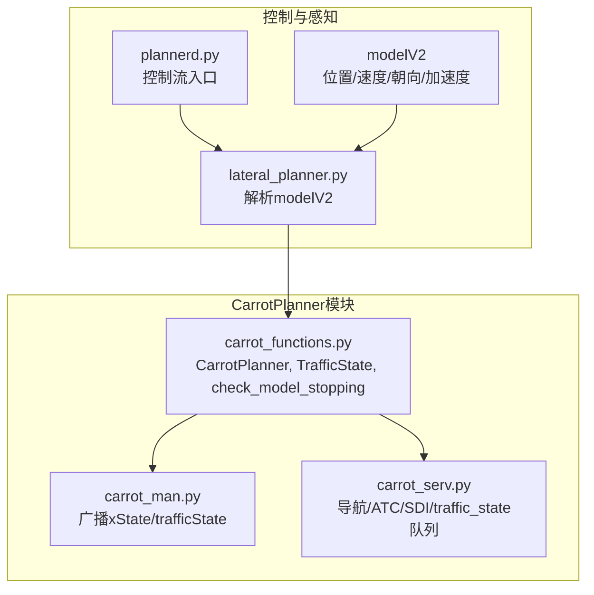
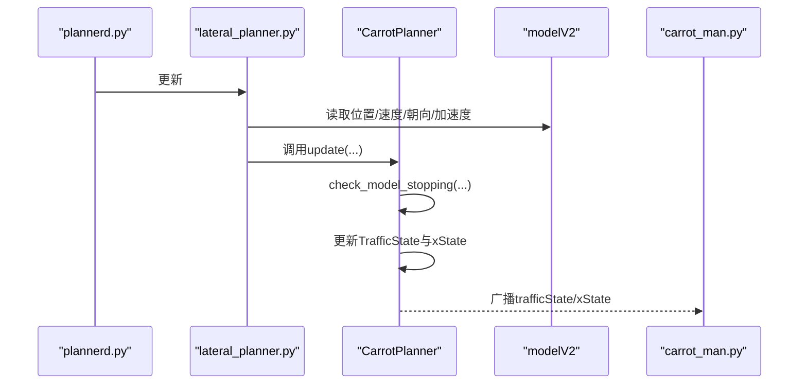
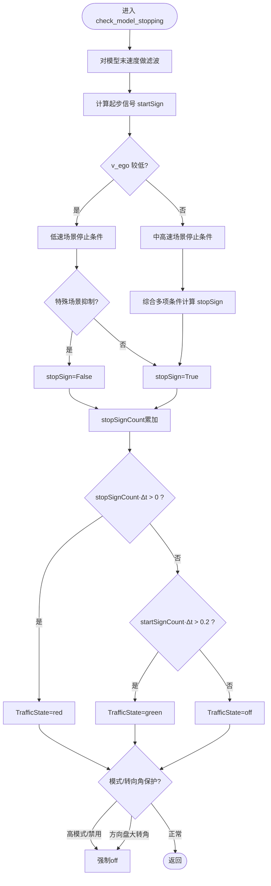
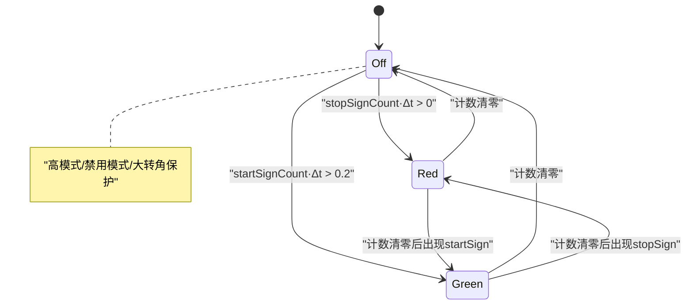
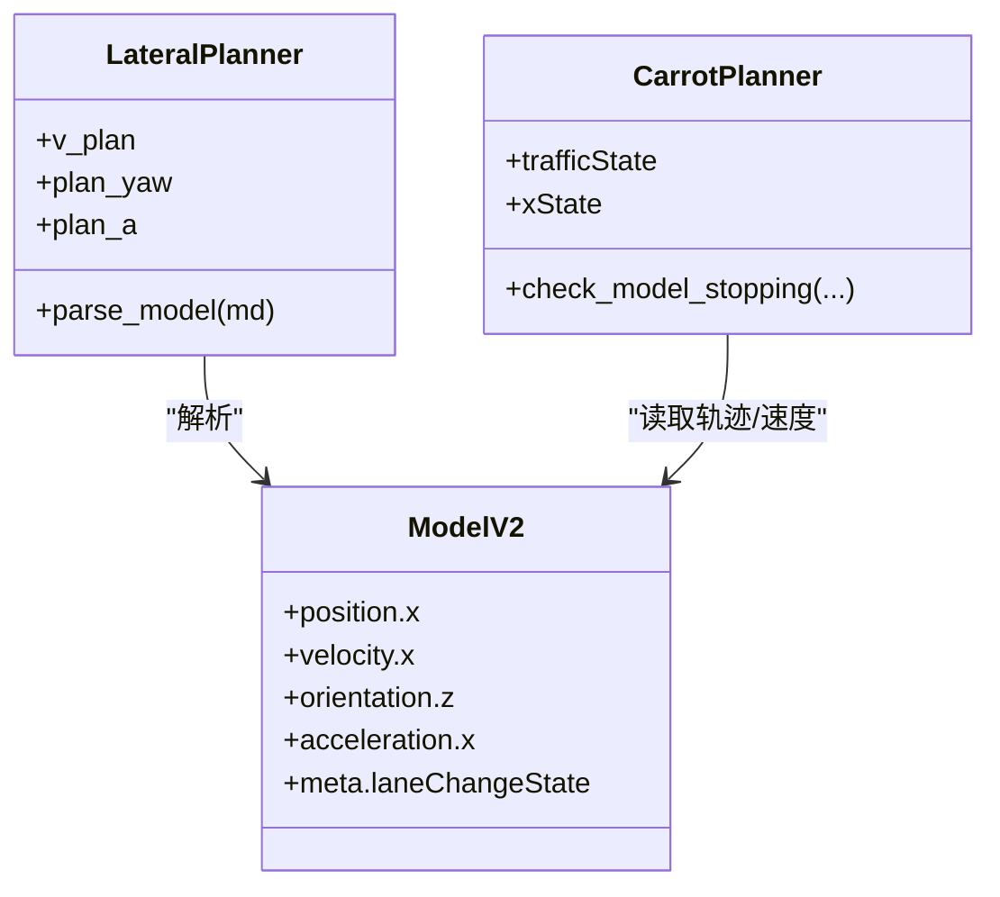
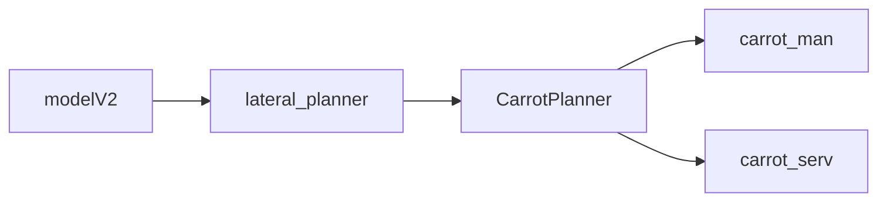

# 交通信号检测

<cite>
**本文引用的文件**
- [carrot_functions.py](file://selfdrive/carrot/carrot_functions.py)
- [carrot_man.py](file://selfdrive/carrot/carrot_man.py)
- [carrot_serv.py](file://selfdrive/carrot/carrot_serv.py)
- [plannerd.py](file://selfdrive/controls/plannerd.py)
- [lateral_planner.py](file://selfdrive/controls/lib/lateral_planner.py)
- [log.capnp](file://cereal/log.capnp)
- [legacy.capnp](file://cereal/legacy.capnp)
</cite>

## 目录
1. [简介](#简介)
2. [项目结构](#项目结构)
3. [核心组件](#核心组件)
4. [架构总览](#架构总览)
5. [详细组件分析](#详细组件分析)
6. [依赖关系分析](#依赖关系分析)
7. [性能考量](#性能考量)
8. [故障排查指南](#故障排查指南)
9. [结论](#结论)
10. [附录](#附录)

## 简介
本文件面向CarrotPlanner交通信号检测系统，聚焦于以下目标：
- 深入解析check_model_stopping方法中的红绿灯检测算法，包括模型预测停止距离、速度阈值判断与状态计数机制
- 详述TrafficState枚举的状态变化逻辑，涵盖off、red到green的转换条件
- 解释与摄像头模型（modelV2）的集成方式，以及laneChangeState对检测的影响
- 记录交通信号检测模式配置、检测精度与误判处理策略
- 提供检测效果评估与参数调优指南

## 项目结构
CarrotPlanner位于selfdrive/carrot目录下，核心文件包括：
- carrot_functions.py：包含CarrotPlanner类、TrafficState枚举、check_model_stopping等关键逻辑
- carrot_man.py：对外广播xState、trafficState等状态，供上层显示与交互使用
- carrot_serv.py：负责导航、ATC、SDI等辅助功能，并维护内部traffic_state队列
- plannerd.py与lateral_planner.py：控制流入口与横向规划器，消费modelV2并驱动CarrotPlanner
- cereal/log.capnp与cereal/legacy.capnp：定义modelV2与元数据结构

图表来源
- [carrot_functions.py:247-446](file://selfdrive/carrot/carrot_functions.py#L247-L446)
- [carrot_man.py:583-625](file://selfdrive/carrot/carrot_man.py#L583-L625)
- [carrot_serv.py:268-318](file://selfdrive/carrot/carrot_serv.py#L268-L318)
- [plannerd.py:30-47](file://selfdrive/controls/plannerd.py#L30-L47)
- [lateral_planner.py:105-130](file://selfdrive/controls/lib/lateral_planner.py#L105-L130)
- [log.capnp:1097-1111](file://cereal/log.capnp#L1097-L1111)

章节来源
- [carrot_functions.py:247-446](file://selfdrive/carrot/carrot_functions.py#L247-L446)
- [carrot_man.py:583-625](file://selfdrive/carrot/carrot_man.py#L583-L625)
- [carrot_serv.py:268-318](file://selfdrive/carrot/carrot_serv.py#L268-L318)
- [plannerd.py:30-47](file://selfdrive/controls/plannerd.py#L30-L47)
- [lateral_planner.py:105-130](file://selfdrive/controls/lib/lateral_planner.py#L105-L130)
- [log.capnp:1097-1111](file://cereal/log.capnp#L1097-L1111)

## 核心组件
- CarrotPlanner：负责纵向控制与交通信号检测，核心方法为check_model_stopping
- TrafficState：红绿灯状态枚举，off=0、red=1、green=2
- carrot_man：将xState与trafficState广播至UI与上层应用
- carrot_serv：维护内部traffic_state队列，支持外部命令触发
- 控制流：plannerd与lateral_planner消费modelV2，调用CarrotPlanner.update

章节来源
- [carrot_functions.py:37-44](file://selfdrive/carrot/carrot_functions.py#L37-L44)
- [carrot_functions.py:49-142](file://selfdrive/carrot/carrot_functions.py#L49-L142)
- [carrot_man.py:583-625](file://selfdrive/carrot/carrot_man.py#L583-L625)
- [carrot_serv.py:176-318](file://selfdrive/carrot/carrot_serv.py#L176-L318)
- [plannerd.py:30-47](file://selfdrive/controls/plannerd.py#L30-L47)
- [lateral_planner.py:105-130](file://selfdrive/controls/lib/lateral_planner.py#L105-L130)

## 架构总览
CarrotPlanner通过解析modelV2中的位置、速度、朝向与加速度，结合当前车速、加速度与雷达距离，判定是否需要减速或起步。该判定结果以TrafficState形式影响纵向控制状态机，最终决定xState（e2eStop/e2eCruise等）。

图表来源
- [plannerd.py:30-47](file://selfdrive/controls/plannerd.py#L30-L47)
- [lateral_planner.py:105-130](file://selfdrive/controls/lib/lateral_planner.py#L105-L130)
- [carrot_functions.py:346-521](file://selfdrive/carrot/carrot_functions.py#L346-L521)
- [carrot_man.py:583-625](file://selfdrive/carrot/carrot_man.py#L583-L625)

## 详细组件分析

### check_model_stopping算法详解
该方法基于模型预测轨迹与当前状态，综合速度、横向偏移与相对距离，给出“停止”或“起步”的信号，并通过计数器实现状态平滑切换。

- 输入参数
  - v_cruise：期望巡航速度（可能被carrotMan.desiredSpeed限制）
  - v、v_ego、a_ego：模型预测速度序列、当前车速、当前加速度
  - model_x、y：模型预测轨迹终点位置与横向偏移
  - d_rel：前车距离（若无前车则使用较大值）

- 关键步骤
  - 速度滤波与起步信号：对模型末速度进行移动平均，若末速度大于阈值或大于初始速度+2，则认为存在起步趋势
  - 停止条件（stopSign）：
    - 静止或低速场景：模型预测终点距离小于阈值且模型速度较低
    - 正常行驶场景（低至中等速度）：模型终点距离小于前车距离-3m、小于速度插值阈值、模型速度低或小于初始速度的0.7倍、横向偏移绝对值小于阈值
    - 特殊处理：若非零巡航且处于e2eCruise且存在明显减速意图，则抑制stopSign，避免将“模型减速”误判为“信号灯”
  - 计数器与状态切换：
    - stopSign持续计数，超过0秒即判定为红灯（TrafficState.red）
    - 起步信号持续计数超过0.2秒则判定为绿灯（TrafficState.green）
    - 否则为无效/未知（TrafficState.off）

- 与模式配置的关系
  - 当驾驶模式为High或检测模式为关闭时，强制将TrafficState设为off
  - 当方向盘转角过大时，强制off，防止误判

图表来源
- [carrot_functions.py:247-289](file://selfdrive/carrot/carrot_functions.py#L247-L289)

章节来源
- [carrot_functions.py:247-289](file://selfdrive/carrot/carrot_functions.py#L247-L289)

### TrafficState状态变化逻辑
TrafficState用于表达当前红绿灯状态，其变化由check_model_stopping的计数器与外部模式共同决定：

- off（0）
  - 默认状态
  - 当检测模式为High或TrafficLightDetectMode为0时，强制设为off
  - 当方向盘转角过大时，强制设为off

- red（1）
  - stopSignCount持续计数超过0秒
  - 通常表示“需要减速/停车”的信号灯场景

- green（2）
  - startSignCount持续计数超过0.2秒
  - 表示“可以起步”的信号灯场景

- 状态机与xState联动
  - 当处于e2eStopped或e2eStop时，收到green且满足条件会触发起步事件
  - 在某些条件下，TrafficState.green会触发事件通知（如“trafficSignGreen”）

图表来源
- [carrot_functions.py:283-288](file://selfdrive/carrot/carrot_functions.py#L283-L288)
- [carrot_functions.py:414-417](file://selfdrive/carrot/carrot_functions.py#L414-L417)

章节来源
- [carrot_functions.py:283-288](file://selfdrive/carrot/carrot_functions.py#L283-L288)
- [carrot_functions.py:414-417](file://selfdrive/carrot/carrot_functions.py#L414-L417)

### 与摄像头模型（modelV2）的集成
- lateral_planner解析modelV2，提取位置、速度、朝向、加速度等，供CarrotPlanner使用
- CarrotPlanner从modelV2中读取：
  - 位置：x[-1]（终点横向位置）
  - 速度：v[-1]（终点速度）、v_ego（当前车速）
  - 朝向与加速度：用于速度估计与轨迹分析
- modelV2.meta中的laneChangeState会影响Desire状态，间接影响CarrotPlanner的决策（例如动态跟随距离与急刹因子）

图表来源
- [lateral_planner.py:105-130](file://selfdrive/controls/lib/lateral_planner.py#L105-L130)
- [carrot_functions.py:400-402](file://selfdrive/carrot/carrot_functions.py#L400-L402)
- [log.capnp:1097-1111](file://cereal/log.capnp#L1097-L1111)

章节来源
- [lateral_planner.py:105-130](file://selfdrive/controls/lib/lateral_planner.py#L105-L130)
- [carrot_functions.py:400-402](file://selfdrive/carrot/carrot_functions.py#L400-L402)
- [log.capnp:1097-1111](file://cereal/log.capnp#L1097-L1111)

### carrot_serv中的外部交通信号检测
carrot_serv维护一个长度为约2秒的队列，用于聚合外部命令触发的红绿灯状态，实现更稳健的判定：
- traffic_light函数根据队列中历史状态与当前输入，计算红色/绿色/左转触发的概率累计
- 若红色触发累计超过阈值，设置traffic_state=1（红灯）
- 若绿色触发累计超过阈值且超过红色累计，设置traffic_state=2（绿灯）
- 左转触发对应traffic_state=3，用于特定场景

该机制可与CarrotPlanner的内部检测互补，减少误判。

章节来源
- [carrot_serv.py:176-318](file://selfdrive/carrot/carrot_serv.py#L176-L318)

### carrot_man的状态广播
carrot_man从selfdriveState与longitudinalPlan读取xState与trafficState，并将其广播给上层应用与UI。这使得外部系统能够实时观察CarrotPlanner的决策状态。

章节来源
- [carrot_man.py:583-625](file://selfdrive/carrot/carrot_man.py#L583-L625)

## 依赖关系分析
- CarrotPlanner依赖modelV2提供的轨迹与速度信息
- CarrotPlanner的状态变化影响xState，进而影响纵向控制策略
- carrot_serv提供外部交通信号检测的补充，与CarrotPlanner形成互补
- carrot_man负责状态外播，便于调试与可视化

图表来源
- [lateral_planner.py:105-130](file://selfdrive/controls/lib/lateral_planner.py#L105-L130)
- [carrot_functions.py:346-521](file://selfdrive/carrot/carrot_functions.py#L346-L521)
- [carrot_man.py:583-625](file://selfdrive/carrot/carrot_man.py#L583-L625)
- [carrot_serv.py:176-318](file://selfdrive/carrot/carrot_serv.py#L176-L318)

章节来源
- [lateral_planner.py:105-130](file://selfdrive/controls/lib/lateral_planner.py#L105-L130)
- [carrot_functions.py:346-521](file://selfdrive/carrot/carrot_functions.py#L346-L521)
- [carrot_man.py:583-625](file://selfdrive/carrot/carrot_man.py#L583-L625)
- [carrot_serv.py:176-318](file://selfdrive/carrot/carrot_serv.py#L176-L318)

## 性能考量
- 计数器平滑：通过DT_MDL累积计数，避免瞬时噪声导致的状态抖动
- 模式保护：高驾驶模式与禁用模式强制off，避免误触发
- 转向角保护：方向盘大角度时off，避免在变道/过弯时误判
- 滤波：对模型末速度进行移动平均，降低短期波动影响

## 故障排查指南
- 症状：频繁红绿灯误判
  - 检查TrafficLightDetectMode是否为0（禁用）
  - 检查方向盘转角是否过大
  - 检查vFilter与stopSign/startSign阈值是否合理
- 症状：长时间不识别绿灯
  - 检查startSignCount阈值（需≥0.2秒）
  - 检查是否存在前车导致的起步抑制
- 症状：与carrot_serv外部检测冲突
  - 检查traffic_light队列长度与触发阈值
  - 确认外部命令格式与参数

章节来源
- [carrot_functions.py:414-417](file://selfdrive/carrot/carrot_functions.py#L414-L417)
- [carrot_functions.py:283-288](file://selfdrive/carrot/carrot_functions.py#L283-L288)
- [carrot_serv.py:176-318](file://selfdrive/carrot/carrot_serv.py#L176-L318)

## 结论
CarrotPlanner的交通信号检测以modelV2为输入，通过速度与轨迹的综合判断，配合计数器与模式保护，实现了鲁棒的红绿灯状态判定。与carrot_serv的外部检测机制互补，进一步提升可靠性。通过合理配置检测模式与阈值，可在不同场景下取得良好效果。

## 附录

### 参数与配置要点
- TrafficLightDetectMode：0=禁用，1=仅停止，2=停止+起步
- MyDrivingMode：Eco/Safe/Normal/High，影响舒适刹车与目标速度
- StopDistanceCarrot、TFollowGap系列参数：影响纵向跟随与舒适刹车
- TrafficStopDistanceAdjust：红绿灯停车距离调整

章节来源
- [carrot_functions.py:160-182](file://selfdrive/carrot/carrot_functions.py#L160-L182)
- [carrot_functions.py:199-213](file://selfdrive/carrot/carrot_functions.py#L199-L213)