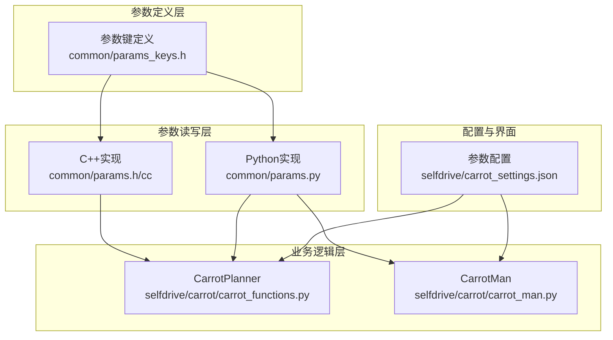
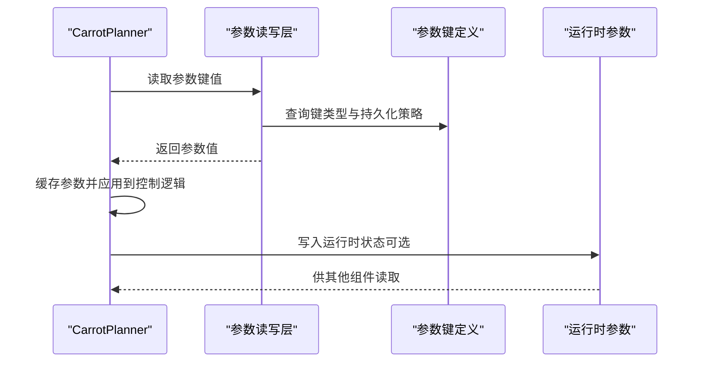
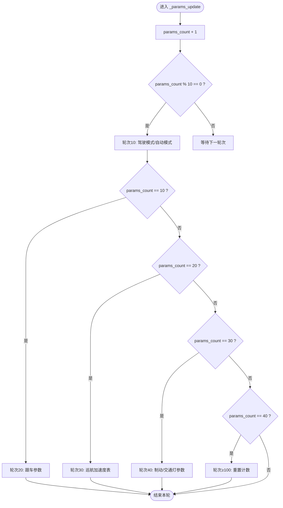
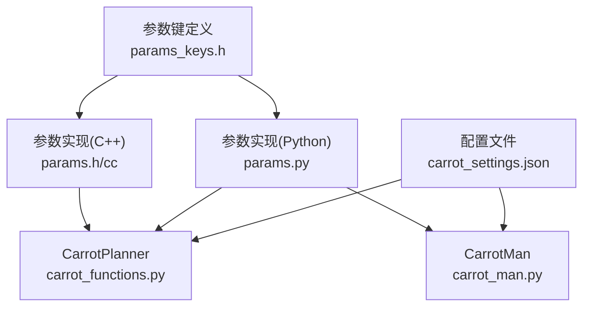

# 参数管理系统

<cite>
**本文引用的文件**
- [carrot_functions.py](file://selfdrive/carrot/carrot_functions.py)
- [params_keys.h](file://common/params_keys.h)
- [params.h](file://common/params.h)
- [params.cc](file://common/params.cc)
- [params.py](file://common/params.py)
- [carrot_settings.json](file://selfdrive/carrot_settings.json)
- [carrot_man.py](file://selfdrive/carrot/carrot_man.py)
- [check_follow_issue.py](file://check_follow_issue.py)
</cite>

## 目录
1. [简介](#简介)
2. [项目结构](#项目结构)
3. [核心组件](#核心组件)
4. [架构总览](#架构总览)
5. [详细组件分析](#详细组件分析)
6. [依赖分析](#依赖分析)
7. [性能考虑](#性能考虑)
8. [故障排除指南](#故障排除指南)
9. [结论](#结论)
10. [附录](#附录)

## 简介
本文件面向CarrotPlanner参数管理系统，围绕_params_update方法的参数轮询机制进行深入解析，涵盖参数更新频率、分类加载与缓存策略，并对关键参数类别（驾驶模式、跟车、制动、模式因子等）的作用机理、动态调整与实时生效策略进行系统化说明。同时提供参数配置指南、默认值说明与调优建议，帮助用户在不同场景下安全、高效地调整纵向控制行为。

## 项目结构
CarrotPlanner参数管理涉及以下关键模块：
- 参数键定义与类型：在C++头文件中集中声明，明确参数持久化与生命周期策略
- 参数读写实现：C++与Python双栈实现，支持阻塞/非阻塞读取与内存参数
- CarrotPlanner参数轮询：在纵向规划器中周期性读取并应用参数
- 配置界面与默认值：通过JSON配置文件提供可视化设置与默认值
- 运行时参数写入：通过CarrotMan将运行时状态写入内存参数，供其他组件读取

**图表来源**
- [params_keys.h:125-210](file://common/params_keys.h#L125-L210)
- [params.h:22-54](file://common/params.h#L22-L54)
- [params.cc](file://common/params.cc)
- [params.py](file://common/params.py)
- [carrot_functions.py:49-140](file://selfdrive/carrot/carrot_functions.py#L49-L140)
- [carrot_settings.json:1600-1630](file://selfdrive/carrot_settings.json#L1600-L1630)

**章节来源**
- [params_keys.h:125-210](file://common/params_keys.h#L125-L210)
- [params.h:22-54](file://common/params.h#L22-L54)
- [params.py](file://common/params.py)
- [carrot_functions.py:49-140](file://selfdrive/carrot/carrot_functions.py#L49-L140)
- [carrot_settings.json:1600-1630](file://selfdrive/carrot_settings.json#L1600-L1630)

## 核心组件
- 参数键与类型：集中于头文件，定义参数的生命周期（如持久化、随启动清除等），确保参数在不同进程间的一致性
- 参数读写类：提供统一的读取接口（字符串/整数/浮点），支持阻塞与非阻塞读取，以及批量读取
- CarrotPlanner参数轮询：在_update循环中按帧计数进行参数分类加载，实现参数的分批更新与缓存
- CarrotMan运行时参数：将运行时状态写入内存参数，供其他组件快速读取

**章节来源**
- [params_keys.h:125-210](file://common/params_keys.h#L125-L210)
- [params.h:22-54](file://common/params.h#L22-L54)
- [carrot_functions.py:143-185](file://selfdrive/carrot/carrot_functions.py#L143-L185)
- [carrot_man.py:205-260](file://selfdrive/carrot/carrot_man.py#L205-L260)

## 架构总览
参数管理采用“键定义—读写实现—业务应用—运行时写入”的分层架构。参数键在编译期确定类型与生命周期；运行时通过统一的读写接口访问；业务模块按需读取并缓存；部分运行时状态写入内存参数以供跨进程共享。

**图表来源**
- [carrot_functions.py:143-185](file://selfdrive/carrot/carrot_functions.py#L143-L185)
- [params_keys.h:125-210](file://common/params_keys.h#L125-L210)
- [params.h:22-54](file://common/params.h#L22-L54)
- [carrot_man.py:320-380](file://selfdrive/carrot/carrot_man.py#L320-L380)

## 详细组件分析

### 参数轮询机制：_params_update
_params_update负责在纵向规划循环中按帧计数进行参数分类加载与缓存，实现低频读取与高频应用的平衡。

- 更新频率与计数
  - params_count自增，每10帧为一个轮次
  - 在不同轮次（10、20、30、40、≥100）分别加载不同类别的参数
  - 100帧周期结束后重置计数，形成稳定的轮询节奏

- 分类加载策略
  - 轮次10：加载驾驶模式相关参数（含自动模式切换）
  - 轮次20：加载跟车时间间隔参数与动态跟车系数
  - 轮次30：加载巡航最大加速度分段表
  - 轮次40：加载停车距离、交通灯检测模式、舒适制动等
  - 轮次≥100：重置计数，继续下一轮

- 实时生效策略
  - 参数读取后直接赋值到类成员变量，后续逻辑直接使用缓存值
  - 驾驶模式与自动模式切换通过标志位控制，避免频繁切换抖动

**图表来源**
- [carrot_functions.py:143-185](file://selfdrive/carrot/carrot_functions.py#L143-L185)

**章节来源**
- [carrot_functions.py:143-185](file://selfdrive/carrot/carrot_functions.py#L143-L185)

### 参数键与类型：生命周期与持久化
参数键在头文件中集中定义，明确参数的生命周期与持久化策略，确保参数在不同进程与场景下的正确性。

- 关键参数键示例
  - MyDrivingMode、MyDrivingModeAuto：驾驶模式与自动模式
  - TFollowGap系列、DynamicTFollow、DynamicTFollowLC：跟车参数
  - StopDistanceCarrot、ComfortBrake、JLeadFactor3：制动与跟车因子
  - AutoNaviSpeedDecelRate、TrafficLightDetectMode：导航与信号控制

- 生命周期策略
  - PERSISTENT：持久化存储，重启后保留
  - CLEAR_ON_MANAGER_START：管理器启动时清除
  - CLEAR_ON_ONROAD_TRANSITION：上路转换时清除
  - CLEAR_ON_OFFROAD_TRANSITION：下路转换时清除

**章节来源**
- [params_keys.h:125-210](file://common/params_keys.h#L125-L210)
- [params_keys.h:242-247](file://common/params_keys.h#L242-L247)
- [params_keys.h:190-195](file://common/params_keys.h#L190-L195)

### 参数读写实现：C++与Python双栈
- C++实现（params.h/cc）
  - 提供统一的读取接口（字符串/整数/浮点），支持阻塞与非阻塞读取
  - 支持批量读取与键类型查询，便于系统级参数管理
- Python实现（params.py）
  - 与C++实现保持一致的接口语义，便于业务逻辑层使用

**章节来源**
- [params.h:22-54](file://common/params.h#L22-L54)
- [params.cc](file://common/params.cc)
- [params.py](file://common/params.py)

### 运行时参数写入：CarrotMan
CarrotMan将运行时状态写入内存参数，供其他组件快速读取，实现跨进程共享。

- 写入内容
  - 网络地址、车速、导航状态等运行时信息
  - 通过非阻塞写入保证实时性

- 读取路径
  - 其他组件通过参数读写层读取内存参数，实现状态共享

**章节来源**
- [carrot_man.py:320-380](file://selfdrive/carrot/carrot_man.py#L320-L380)
- [carrot_man.py:460-476](file://selfdrive/carrot/carrot_man.py#L460-L476)

### 参数配置指南与默认值
- 配置入口
  - 通过carrot_settings.json提供图形化配置界面与默认值
- 关键参数组
  - 驾驶模式：MyDrivingMode、MyDrivingModeAuto
  - 跟车参数：TFollowGap系列、DynamicTFollow、DynamicTFollowLC
  - 制动参数：StopDistanceCarrot、ComfortBrake、JLeadFactor3
  - 导航与信号：AutoNaviSpeedDecelRate、TrafficLightDetectMode

- 默认值参考
  - 驾驶模式：MyDrivingMode默认为普通模式
  - 跟车参数：各TFollowGap默认值在配置文件中定义
  - 制动参数：ComfortBrake、StopDistanceCarrot等默认值在配置文件中定义

**章节来源**
- [carrot_settings.json:1600-1630](file://selfdrive/carrot_settings.json#L1600-L1630)
- [carrot_settings.json:1080-1140](file://selfdrive/carrot_settings.json#L1080-L1140)
- [carrot_settings.json:1710-1720](file://selfdrive/carrot_settings.json#L1710-L1720)

### 参数动态调整与实时生效
- 动态调整机制
  - 驾驶模式可通过按钮或自动检测进行切换
  - 跟车参数在不同轮次按需加载，避免频繁读盘
  - 制动参数与导航参数在特定轮次加载，确保系统稳定性

- 实时生效策略
  - 参数读取后直接赋值到类成员，后续逻辑直接使用
  - 对于驾驶模式切换，通过标志位避免频繁切换抖动
  - 运行时参数通过内存参数写入，供其他组件快速读取

**章节来源**
- [carrot_functions.py:143-185](file://selfdrive/carrot/carrot_functions.py#L143-L185)
- [carrot_functions.py:346-521](file://selfdrive/carrot/carrot_functions.py#L346-L521)
- [carrot_man.py:320-380](file://selfdrive/carrot/carrot_man.py#L320-L380)

## 依赖分析
参数管理的依赖关系清晰，遵循“键定义—读写实现—业务应用—运行时写入”的分层设计。

**图表来源**
- [params_keys.h:125-210](file://common/params_keys.h#L125-L210)
- [params.h:22-54](file://common/params.h#L22-L54)
- [params.py](file://common/params.py)
- [carrot_functions.py:49-140](file://selfdrive/carrot/carrot_functions.py#L49-L140)
- [carrot_settings.json:1600-1630](file://selfdrive/carrot_settings.json#L1600-L1630)

**章节来源**
- [params_keys.h:125-210](file://common/params_keys.h#L125-L210)
- [params.h:22-54](file://common/params.h#L22-L54)
- [params.py](file://common/params.py)
- [carrot_functions.py:49-140](file://selfdrive/carrot/carrot_functions.py#L49-L140)
- [carrot_settings.json:1600-1630](file://selfdrive/carrot_settings.json#L1600-L1630)

## 性能考虑
- 参数轮询频率
  - 每10帧为一轮，100帧为周期，降低参数读取开销
- 缓存策略
  - 参数读取后直接缓存到类成员，避免重复读取
- 非阻塞写入
  - 运行时参数采用非阻塞写入，减少对主循环的影响

[本节为通用性能讨论，不直接分析具体文件]

## 故障排除指南
- 参数未生效
  - 检查参数键是否在头文件中正确定义
  - 确认参数读写接口返回值是否正确
- 参数抖动
  - 驾驶模式切换时通过标志位避免频繁切换
  - 跟车参数在轮询周期内稳定应用
- 运行时参数不可读
  - 确认内存参数写入路径与读取路径一致
  - 检查非阻塞写入是否成功

**章节来源**
- [carrot_functions.py:143-185](file://selfdrive/carrot/carrot_functions.py#L143-L185)
- [carrot_functions.py:346-521](file://selfdrive/carrot/carrot_functions.py#L346-L521)
- [carrot_man.py:320-380](file://selfdrive/carrot/carrot_man.py#L320-L380)

## 结论
CarrotPlanner参数管理系统通过“键定义—读写实现—业务应用—运行时写入”的分层设计，实现了参数的稳定、高效与可配置。_params_update方法通过轮询机制与缓存策略，在保证参数实时性的同时降低了系统开销。针对驾驶模式、跟车、制动与导航等关键参数，系统提供了灵活的配置与默认值，满足不同场景下的纵向控制需求。

[本节为总结性内容，不直接分析具体文件]

## 附录

### 参数分类与作用说明
- 驾驶模式参数
  - MyDrivingMode：手动选择驾驶模式（经济、安全、正常、高速）
  - MyDrivingModeAuto：自动模式开关，根据拥堵条件自动切换
- 跟车参数
  - TFollowGap系列：不同驾驶性格对应的跟车时间间隔
  - DynamicTFollow、DynamicTFollowLC：动态跟车与变道时的跟车系数
- 制动参数
  - ComfortBrake：舒适制动系数
  - StopDistanceCarrot：停车距离基准
  - JLeadFactor3：前车加速度对跟车行为的影响因子
- 模式因子
  - MyEcoModeFactor、MySafeModeFactor：经济与安全模式下的加速度/制动/间隙调整因子

**章节来源**
- [carrot_functions.py:92-100](file://selfdrive/carrot/carrot_functions.py#L92-L100)
- [carrot_functions.py:102-109](file://selfdrive/carrot/carrot_functions.py#L102-L109)
- [carrot_functions.py:161-167](file://selfdrive/carrot/carrot_functions.py#L161-L167)
- [carrot_functions.py:177-182](file://selfdrive/carrot/carrot_functions.py#L177-L182)
- [check_follow_issue.py:26-30](file://check_follow_issue.py#L26-L30)

### 参数配置与调优建议
- 驾驶模式
  - 经济模式：适合长距离高速巡航，舒适制动与加速度适当下调
  - 安全模式：适合拥堵或复杂路况，缩短跟车距离与提高制动敏感度
  - 高速模式：忽略红灯，适合高速巡航，加速度适当上调
- 跟车参数
  - TFollowGap系列：根据个人驾驶习惯微调，避免过近或过远
  - DynamicTFollow：开启后可根据前车加速度动态调整跟车距离
- 制动参数
  - ComfortBrake：在湿滑或颠簸路面适当上调
  - StopDistanceCarrot：在城市拥堵或急停较多路段适当上调
- 导航与信号
  - AutoNaviSpeedDecelRate：根据实际驾驶速度与路况调整
  - TrafficLightDetectMode：根据所在地区信号灯分布选择合适模式

**章节来源**
- [carrot_settings.json:1600-1630](file://selfdrive/carrot_settings.json#L1600-L1630)
- [carrot_settings.json:1080-1140](file://selfdrive/carrot_settings.json#L1080-L1140)
- [carrot_settings.json:1710-1720](file://selfdrive/carrot_settings.json#L1710-L1720)
- [check_follow_issue.py:122-147](file://check_follow_issue.py#L122-L147)