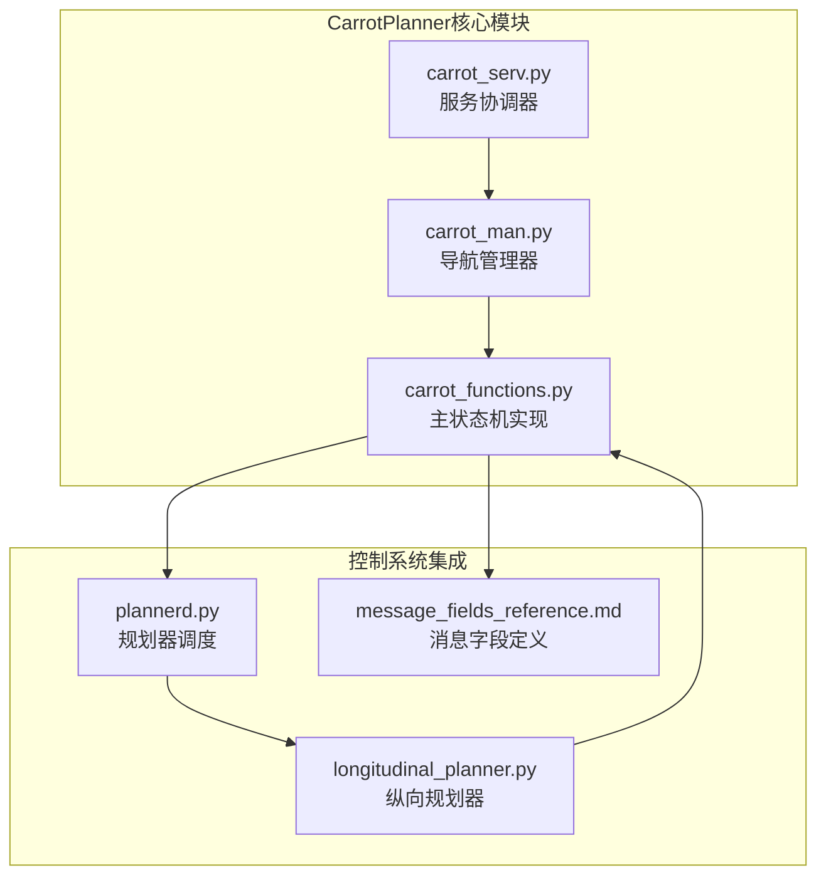
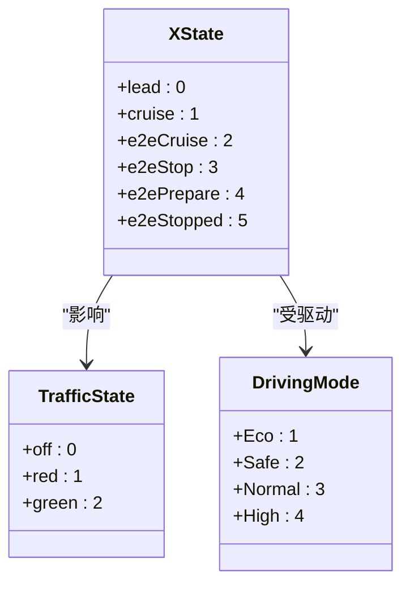
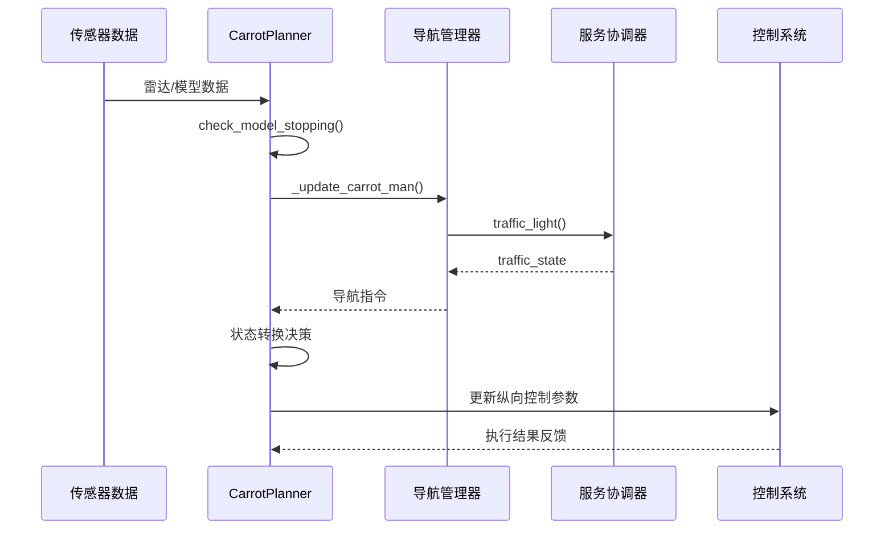
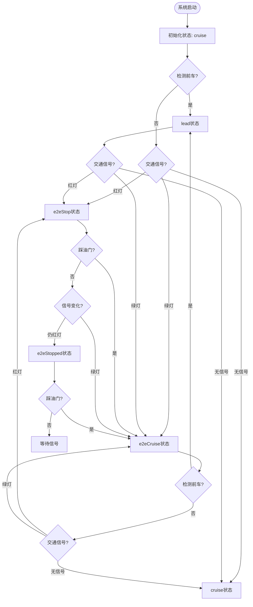
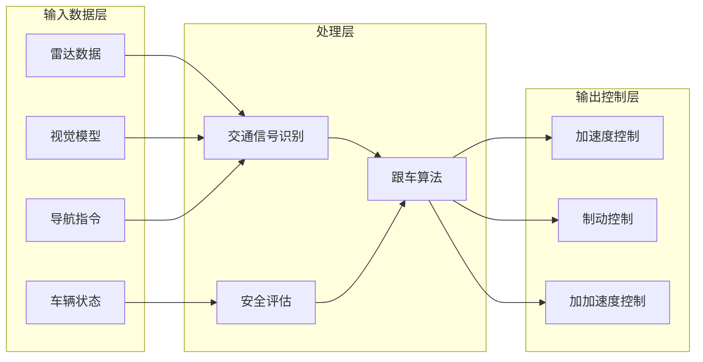
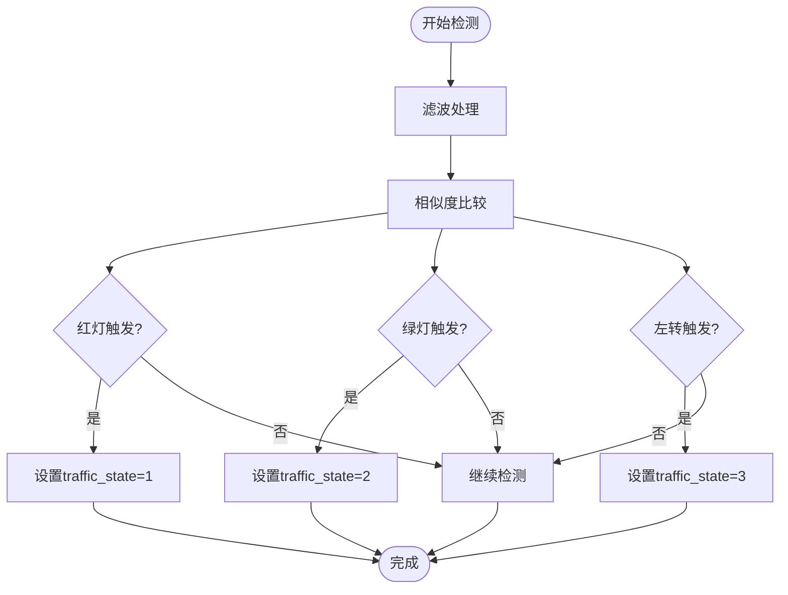

# 状态机设计

<cite>
**本文档引用的文件**
- [carrot_functions.py](file://selfdrive/carrot/carrot_functions.py)
- [carrot_man.py](file://selfdrive/carrot/carrot_man.py)
- [carrot_serv.py](file://selfdrive/carrot/carrot_serv.py)
- [plannerd.py](file://selfdrive/controls/plannerd.py)
- [longitudinal_planner.py](file://selfdrive/controls/lib/longitudinal_planner.py)
- [message_fields_reference.md](file://docs/message_fields_reference.md)
</cite>

## 目录
1. [简介](#简介)
2. [项目结构](#项目结构)
3. [核心组件](#核心组件)
4. [架构概览](#架构概览)
5. [详细组件分析](#详细组件分析)
6. [依赖关系分析](#依赖关系分析)
7. [性能考虑](#性能考虑)
8. [故障排除指南](#故障排除指南)
9. [结论](#结论)

## 简介

CarrotPlanner状态机是openpilot项目中负责纵向控制决策的核心组件，基于XState枚举实现了六个状态的智能切换机制。该状态机通过融合交通信号识别、雷达检测、用户输入和导航指令等多种数据源，实现了安全、舒适且高效的自动驾驶纵向控制。

本文档深入解析了CarrotPlanner状态机的设计理念、状态转换逻辑和实现细节，为开发者提供全面的技术参考。

## 项目结构

CarrotPlanner状态机位于selfdrive/carrot目录下，主要包含以下关键文件：



**图表来源**
- [carrot_functions.py:1-543](file://selfdrive/carrot/carrot_functions.py#L1-L543)
- [carrot_man.py:1-1115](file://selfdrive/carrot/carrot_man.py#L1-L1115)
- [carrot_serv.py:1-1347](file://selfdrive/carrot/carrot_serv.py#L1-L1347)
- [plannerd.py:1-48](file://selfdrive/controls/plannerd.py#L1-L48)
- [longitudinal_planner.py:70-283](file://selfdrive/controls/lib/longitudinal_planner.py#L70-L283)

**章节来源**
- [carrot_functions.py:1-543](file://selfdrive/carrot/carrot_functions.py#L1-L543)
- [carrot_man.py:1-1115](file://selfdrive/carrot/carrot_man.py#L1-L1115)
- [carrot_serv.py:1-1347](file://selfdrive/carrot/carrot_serv.py#L1-L1347)
- [plannerd.py:1-48](file://selfdrive/controls/plannerd.py#L1-L48)

## 核心组件

### XState枚举定义

CarrotPlanner状态机基于XState枚举定义了六个核心状态：



**图表来源**
- [carrot_functions.py:15-44](file://selfdrive/carrot/carrot_functions.py#L15-L44)

### 状态机初始化配置

状态机在初始化时建立了完整的参数体系：

| 参数类别 | 关键参数 | 默认值 | 作用说明 |
|---------|----------|--------|----------|
| 交通相关 | trafficLightDetectMode | 2 | 交通信号检测模式（Stop&Go） |
| 距离控制 | stop_distance | 6.0m | 安全跟车距离 |
| 制动参数 | comfortBrake | 2.4m/s² | 舒适制动率 |
| 跟车时距 | tFollowGap1-4 | 1.1-1.6s | 不同驾驶模式的跟车时距 |
| 动态跟随 | dynamicTFollow | 0.0 | 前车跟随动态调整系数 |

**章节来源**
- [carrot_functions.py:49-142](file://selfdrive/carrot/carrot_functions.py#L49-L142)

## 架构概览

CarrotPlanner状态机采用分层架构设计，实现了传感器数据融合、决策逻辑处理和执行控制的完整闭环：



**图表来源**
- [carrot_functions.py:247-446](file://selfdrive/carrot/carrot_functions.py#L247-L446)
- [carrot_man.py:290-323](file://selfdrive/carrot/carrot_man.py#L290-L323)
- [carrot_serv.py:268-317](file://selfdrive/carrot/carrot_serv.py#L268-L317)

## 详细组件分析

### lead状态：前车跟随模式

**触发条件：**
- 雷达检测到前车且距离小于安全阈值
- 前车相对速度小于设定值
- 当前状态不是e2eStop或e2eStopped

**行为特征：**
- 保持与前车的安全距离
- 根据前车速度调整自身速度
- 应用动态跟车时距算法

**状态转换：**
```
lead ← {e2eCruise, e2eStop, e2ePrepare, e2eStopped}
→ {lead}
```

**章节来源**
- [carrot_functions.py:475-478](file://selfdrive/carrot/carrot_functions.py#L475-L478)

### cruise状态：标准巡航模式

**触发条件：**
- 无前车检测
- 无交通信号限制
- 驾驶模式为Normal或Safe

**行为特征：**
- 维持设定巡航速度
- 基础跟车时距设置
- 标准舒适性参数

**状态转换：**
```
cruise ← {e2eCruise}
→ {lead, e2eCruise}
```

**章节来源**
- [carrot_functions.py:475-484](file://selfdrive/carrot/carrot_functions.py#L475-L484)

### e2eCruise状态：端到端巡航模式

**触发条件：**
- 系统处于端到端自动驾驶模式
- 无前车跟随需求
- 交通信号显示绿灯

**行为特征：**
- 结合视觉模型进行预测性控制
- 更激进的加速和制动策略
- 支持动态跟车时距调整

**状态转换：**
```
e2eCruise ← {lead, cruise, e2ePrepare}
→ {lead, e2eStop, e2ePrepare}
```

**章节来源**
- [carrot_functions.py:475-484](file://selfdrive/carrot/carrot_functions.py#L475-L484)

### e2eStop状态：端到端停止模式

**触发条件：**
- 交通信号变为红色
- 车辆接近停止线
- 安全制动距离不足

**行为特征：**
- 逐步减速至完全停止
- 应用增强舒适制动率
- 记录实际停止距离

**状态转换：**
```
e2eStop ← {e2eCruise}
→ {e2eStopped, e2eCruise}
```

**章节来源**
- [carrot_functions.py:440-463](file://selfdrive/carrot/carrot_functions.py#L440-L463)

### e2ePrepare状态：端到端准备模式

**触发条件：**
- 导航指示要求提前减速
- 距离交叉路口较近
- 驾驶员发出启动信号

**行为特征：**
- 提前释放油门准备减速
- 检查周围交通状况
- 准备进入e2eCruise状态

**状态转换：**
```
e2ePrepare ← {e2eCruise}
→ {e2eStop, e2eCruise}
```

**章节来源**
- [carrot_functions.py:464-474](file://selfdrive/carrot/carrot_functions.py#L464-L474)

### e2eStopped状态：端到端完全停止模式

**触发条件：**
- e2eStop状态下完全停止
- 车速降至接近0
- 交通信号仍为红色

**行为特征：**
- 保持完全静止状态
- 准备响应交通信号变化
- 等待驾驶员启动信号

**状态转换：**
```
e2eStopped ← {e2eStop}
→ {e2eCruise}
```

**章节来源**
- [carrot_functions.py:428-439](file://selfdrive/carrot/carrot_functions.py#L428-L439)

### 状态转换流程图



**图表来源**
- [carrot_functions.py:424-492](file://selfdrive/carrot/carrot_functions.py#L424-L492)

## 依赖关系分析

### 数据流依赖

CarrotPlanner状态机的数据流呈现多层次的依赖关系：



**图表来源**
- [carrot_functions.py:346-521](file://selfdrive/carrot/carrot_functions.py#L346-L521)

### 状态机决策逻辑

状态机的核心决策逻辑基于多传感器融合：

**交通信号检测算法：**


**图表来源**
- [carrot_serv.py:268-317](file://selfdrive/carrot/carrot_serv.py#L268-L317)

**章节来源**
- [carrot_functions.py:247-290](file://selfdrive/carrot/carrot_functions.py#L247-L290)
- [carrot_serv.py:268-317](file://selfdrive/carrot/carrot_serv.py#L268-L317)

## 性能考虑

### 实时性保证

CarrotPlanner状态机通过以下机制确保实时性能：

1. **参数更新机制**：每10帧更新一次参数，避免频繁的参数访问开销
2. **状态缓存**：使用移动平均滤波器减少噪声影响
3. **条件判断优化**：采用早期退出策略减少不必要的计算

### 内存管理

状态机采用高效的数据结构：
- 使用numpy数组进行向量化计算
- 移动平均滤波器支持内存复用
- 状态变量按需初始化

### 稳定性保障

**防抖机制：**
- 停止信号检测需要连续多次确认
- 启动信号检测设置延时窗口
- 交通信号状态变化需要稳定持续

**安全冗余：**
- 多传感器数据融合验证
- 紧急情况下强制进入安全状态
- 参数边界检查和异常处理

## 故障排除指南

### 常见问题诊断

**状态转换异常：**
1. 检查交通信号检测是否正常工作
2. 验证雷达数据质量
3. 确认导航指令有效性

**性能问题：**
1. 监控状态机执行时间
2. 检查参数更新频率
3. 验证滤波器设置

### 调试工具

**日志输出：**
- 状态机内部状态跟踪
- 传感器数据验证
- 参数变化记录

**监控指标：**
- 状态转换频率统计
- 计算耗时分析
- 错误率监控

**章节来源**
- [carrot_functions.py:505-521](file://selfdrive/carrot/carrot_functions.py#L505-L521)

## 结论

CarrotPlanner状态机通过精心设计的六状态架构，实现了复杂交通场景下的智能纵向控制。其核心优势包括：

1. **多源数据融合**：整合雷达、视觉模型、导航和车辆状态信息
2. **渐进式状态转换**：从标准巡航到端到端控制的平滑过渡
3. **安全优先设计**：在各种异常情况下都能保证安全状态
4. **性能优化**：通过多种机制确保实时性和稳定性

该状态机为自动驾驶系统的纵向控制提供了坚实的基础，为后续的功能扩展和优化奠定了良好的技术基础。