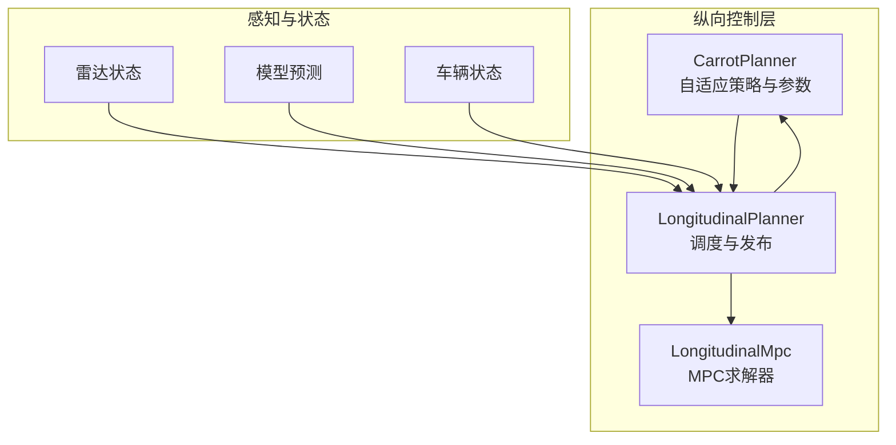
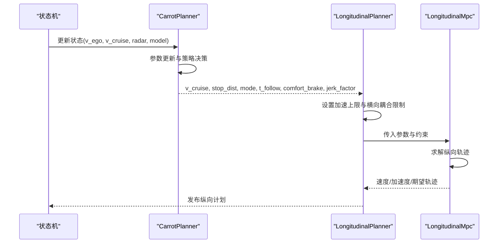
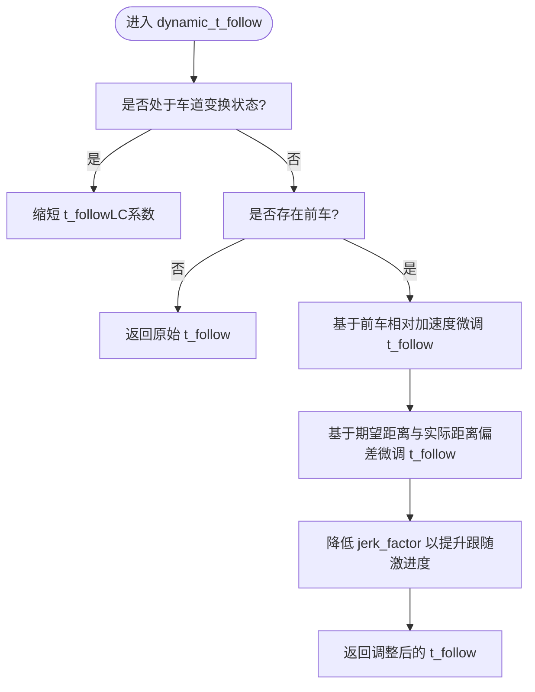
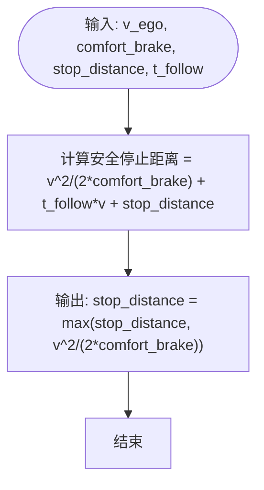
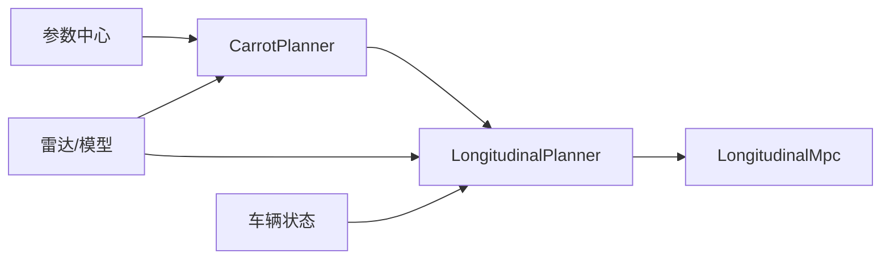

# 纵向控制算法

<cite>
**本文引用的文件**
- [carrot_functions.py](file://selfdrive/carrot/carrot_functions.py)
- [longitudinal_planner.py](file://selfdrive/controls/lib/longitudinal_planner.py)
- [long_mpc.py](file://selfdrive/controls/lib/longitudinal_mpc_lib/long_mpc.py)
- [test_longitudinal.py](file://selfdrive/test/longitudinal_maneuvers/test_longitudinal.py)
- [carcontroller.py](file://opendbc_repo/opendbc/car/hyundai/carcontroller.py)
- [bydcan.py](file://opendbc_repo/opendbc/car/byd.bak/bydcan.py)
</cite>

## 目录
1. [简介](#简介)
2. [项目结构](#项目结构)
3. [核心组件](#核心组件)
4. [架构总览](#架构总览)
5. [详细组件分析](#详细组件分析)
6. [依赖分析](#依赖分析)
7. [性能考虑](#性能考虑)
8. [故障排查指南](#故障排查指南)
9. [结论](#结论)
10. [附录](#附录)

## 简介
本文件面向CarrotPlanner纵向控制算法，系统化阐述其核心实现与工作机制，重点覆盖以下方面：
- 加速度计算与速度-加速度映射关系（get_carrot_accel）
- 跟车距离控制与动态时间间隔（get_T_FOLLOW、dynamic_t_follow）
- 速度调节机制与舒适制动参数、驾驶模式因子、动态跟随距离的综合应用
- 算法公式、参数范围与性能优化策略
- 具体代码示例路径与调试技巧

## 项目结构
纵向控制由三层协同构成：
- CarrotPlanner（自适应纵向策略与参数管理）
- LongitudinalMpc（基于MPC的轨迹求解与约束）
- LongitudinalPlanner（调度与发布）

图示来源
- [carrot_functions.py:49-521](file://selfdrive/carrot/carrot_functions.py#L49-L521)
- [longitudinal_planner.py:132-250](file://selfdrive/controls/lib/longitudinal_planner.py#L132-L250)
- [long_mpc.py:364-473](file://selfdrive/controls/lib/longitudinal_mpc_lib/long_mpc.py#L364-L473)

章节来源
- [carrot_functions.py:49-521](file://selfdrive/carrot/carrot_functions.py#L49-L521)
- [longitudinal_planner.py:132-250](file://selfdrive/controls/lib/longitudinal_planner.py#L132-L250)
- [long_mpc.py:364-473](file://selfdrive/controls/lib/longitudinal_mpc_lib/long_mpc.py#L364-L473)

## 核心组件
- CarrotPlanner：负责纵向目标速度、舒适制动、跟车时间间隔、动态跟随策略、驾驶模式因子等参数的实时更新与应用，并输出给MPC。
- LongitudinalMpc：以MPC求解纵向轨迹，结合CarrotPlanner提供的参数（舒适制动、跟车时间、动态跟随），生成加速度与期望速度序列。
- LongitudinalPlanner：统一调度CarrotPlanner与MPC，设置加速度上下限、横向加速度耦合限制、发布纵向计划。

章节来源
- [carrot_functions.py:49-521](file://selfdrive/carrot/carrot_functions.py#L49-L521)
- [longitudinal_planner.py:85-250](file://selfdrive/controls/lib/longitudinal_planner.py#L85-L250)
- [long_mpc.py:235-473](file://selfdrive/controls/lib/longitudinal_mpc_lib/long_mpc.py#L235-L473)

## 架构总览
纵向控制流程如下：
- CarrotPlanner根据当前驾驶模式、交通信号、前车状态等更新舒适制动、跟车时间、动态跟随策略等参数
- LongitudinalPlanner将CarrotPlanner的参数转换为MPC可接受的加速上限与成本权重
- LongitudinalMpc基于MPC求解纵向轨迹，确保与前车安全距离与舒适制动要求一致
- LongitudinalPlanner汇总MPC输出，发布纵向计划消息

图示来源
- [carrot_functions.py:346-521](file://selfdrive/carrot/carrot_functions.py#L346-L521)
- [longitudinal_planner.py:165-250](file://selfdrive/controls/lib/longitudinal_planner.py#L165-L250)
- [long_mpc.py:364-473](file://selfdrive/controls/lib/longitudinal_mpc_lib/long_mpc.py#L364-L473)

## 详细组件分析

### CarrotPlanner：纵向策略与参数管理
- 速度-加速度映射（get_carrot_accel）
  - 基于分段线性插值表与驾驶模式因子，将车速映射为最大允许纵向加速度
  - 驾驶模式因子：高速模式（High）提升上限，安全模式（Safe）降低上限，经济模式（Eco）采用折中系数
  - 返回值：随速度单调递增的加速度上限，受模式因子缩放

- 跟车时间间隔（get_T_FOLLOW）
  - 支持四种驾驶个性：更放松、放松、标准、激进
  - 对应的跟车时间档位（单位：百分比，实际值需乘以100得到秒数）
  - 驾驶模式影响激进度（Safe模式下激进度降低）

- 动态跟随策略（dynamic_t_follow）
  - 在车道变换期间缩短跟车时间（减少到LC档位的系数）
  - 基于前车加速度与期望跟车距离偏差进行微调，使跟车更贴合
  - 当前车存在且相对加速度为负时，适度缩短跟车时间；同时降低jerk_factor以提升跟随激进度

- 舒适制动与动态停止距离
  - 舒适制动力度（comfort_brake）与停止距离（stop_distance）综合决定安全停止距离
  - 结合交通信号识别与用户控制状态，动态调整实际停止距离

- 驾驶模式与参数更新
  - 通过参数中心周期性读取并更新：跟车时间档位、动态跟随系数、舒适制动、停止距离、驾驶模式等
  - 自动驾驶模式下根据拥堵状态切换安全模式

章节来源
- [carrot_functions.py:186-240](file://selfdrive/carrot/carrot_functions.py#L186-L240)
- [carrot_functions.py:199-214](file://selfdrive/carrot/carrot_functions.py#L199-L214)
- [carrot_functions.py:225-240](file://selfdrive/carrot/carrot_functions.py#L225-L240)
- [carrot_functions.py:143-184](file://selfdrive/carrot/carrot_functions.py#L143-L184)
- [carrot_functions.py:346-521](file://selfdrive/carrot/carrot_functions.py#L346-L521)

### LongitudinalPlanner：调度与发布
- 加速度上限设置
  - 在ACC模式下，使用CarrotPlanner提供的加速度上限
  - 考虑横向加速度耦合限制，避免转弯时纵向加速度过大

- 与MPC交互
  - 设置MPC权重（含jerk_factor与起动阶段的成本）
  - 传递当前车速、加速度与模型预测作为参考轨迹
  - 从MPC获取期望速度、加速度与期望加加速度

- 发布纵向计划
  - 输出纵向计划消息，包含速度、加速度、期望加加速度、是否应停车、事件等

章节来源
- [longitudinal_planner.py:165-250](file://selfdrive/controls/lib/longitudinal_planner.py#L165-L250)

### LongitudinalMpc：MPC求解与安全约束
- 安全距离与期望跟车距离
  - 安全停止距离：基于当前速度、舒适制动力度与停止距离计算
  - 期望跟车距离：在安全停止距离基础上，考虑前车速度的等效停止距离修正

- 动态时间间隔与危险因子
  - 使用CarrotPlanner提供的t_follow与comfort_brake
  - 根据前车加速度与期望距离偏差动态调整t_follow
  - 危险因子用于在接近前车时提升约束强度

- 求解与收敛
  - 使用Acados OCP求解器，固定预测步长与迭代次数，保证实时性
  - 对异常状态进行重置与告警

章节来源
- [long_mpc.py:90-99](file://selfdrive/controls/lib/longitudinal_mpc_lib/long_mpc.py#L90-L99)
- [long_mpc.py:387-396](file://selfdrive/controls/lib/longitudinal_mpc_lib/long_mpc.py#L387-L396)
- [long_mpc.py:403-473](file://selfdrive/controls/lib/longitudinal_mpc_lib/long_mpc.py#L403-L473)

### 算法公式与参数范围

- 速度-加速度映射（get_carrot_accel）
  - 公式要点：分段线性插值表 + 驾驶模式因子
  - 参数范围：插值表节点与对应加速度上限由参数提供；模式因子在[0.8, 1.2]区间内调整

- 跟车时间间隔（get_T_FOLLOW）
  - 公式要点：按驾驶个性返回不同档位的跟车时间
  - 参数范围：档位参数（TFollowGap1~TFollowGap4）以百分比形式存储，实际秒数为参数值/100

- 动态时间间隔（dynamic_t_follow）
  - 公式要点：基于前车加速度与期望距离偏差进行微调；车道变换时缩短
  - 参数范围：动态跟随系数（DynamicTFollow/LC）以百分比形式存储

- 安全停止距离与期望跟车距离
  - 公式要点：安全停止距离 = v^2/(2*comfort_brake) + t_follow*v + stop_distance
  - 期望跟车距离 = 安全停止距离 - 前车等效停止距离（基于前车速度与舒适制动）

章节来源
- [carrot_functions.py:186-240](file://selfdrive/carrot/carrot_functions.py#L186-L240)
- [carrot_functions.py:199-214](file://selfdrive/carrot/carrot_functions.py#L199-L214)
- [carrot_functions.py:225-240](file://selfdrive/carrot/carrot_functions.py#L225-L240)
- [long_mpc.py:90-99](file://selfdrive/controls/lib/longitudinal_mpc_lib/long_mpc.py#L90-L99)

### 关键流程图

#### 动态跟车时间间隔调整

图示来源
- [carrot_functions.py:225-240](file://selfdrive/carrot/carrot_functions.py#L225-L240)

#### 安全停止距离计算

图示来源
- [carrot_functions.py:513-518](file://selfdrive/carrot/carrot_functions.py#L513-L518)
- [long_mpc.py:90-94](file://selfdrive/controls/lib/longitudinal_mpc_lib/long_mpc.py#L90-L94)

## 依赖分析
- CarrotPlanner依赖参数中心与驾驶模式检测器，周期性更新参数并根据环境状态调整策略
- LongitudinalPlanner依赖CarrotPlanner提供的参数，同时与MPC模块紧密耦合
- LongitudinalMpc依赖MPC求解器与安全距离函数，确保轨迹满足舒适制动与跟车距离约束

图示来源
- [carrot_functions.py:143-184](file://selfdrive/carrot/carrot_functions.py#L143-L184)
- [longitudinal_planner.py:132-250](file://selfdrive/controls/lib/longitudinal_planner.py#L132-L250)
- [long_mpc.py:364-473](file://selfdrive/controls/lib/longitudinal_mpc_lib/long_mpc.py#L364-L473)

章节来源
- [carrot_functions.py:143-184](file://selfdrive/carrot/carrot_functions.py#L143-L184)
- [longitudinal_planner.py:132-250](file://selfdrive/controls/lib/longitudinal_planner.py#L132-L250)
- [long_mpc.py:364-473](file://selfdrive/controls/lib/longitudinal_mpc_lib/long_mpc.py#L364-L473)

## 性能考虑
- 实时性保障
  - MPC求解器固定迭代次数与预测步长，确保求解时间稳定
  - 权重与约束在每帧更新，避免累积误差
- 参数更新频率
  - 参数中心以固定周期读取参数，避免频繁I/O
- 横向加速度耦合限制
  - 在转弯时限制纵向加速度，避免纵向-横向耦合导致的不稳定

[本节为通用指导，无需特定文件引用]

## 故障排查指南
- 跟车过近或过远
  - 检查动态跟随参数（DynamicTFollow/LC）与档位参数（TFollowGap1~4）
  - 观察t_follow是否被动态调整（车道变换、前车加速度、期望距离偏差）
- 制动过于急促或迟缓
  - 调整舒适制动参数（comfort_brake）与停止距离（stop_distance）
  - 检查驾驶模式因子是否被自动切换至安全模式
- 车道变换时跟车过紧
  - 确认LC档位的动态跟随系数生效
  - 检查jerk_factor是否被降低以提升跟随激进度

章节来源
- [carrot_functions.py:161-167](file://selfdrive/carrot/carrot_functions.py#L161-L167)
- [carrot_functions.py:225-240](file://selfdrive/carrot/carrot_functions.py#L225-L240)
- [carrot_functions.py:497-498](file://selfdrive/carrot/carrot_functions.py#L497-L498)

## 结论
CarrotPlanner纵向控制通过“参数中心驱动 + MPC求解”的架构，在保证舒适性与安全性的前提下实现了灵活的跟车行为。get_carrot_accel提供速度-加速度映射，get_T_FOLLOW与dynamic_t_follow共同构建动态跟车时间间隔，结合舒适制动与驾驶模式因子，形成一套可调、可扩展、可验证的纵向控制方案。

[本节为总结性内容，无需特定文件引用]

## 附录

### 参数与范围对照表
- 跟车时间档位（TFollowGap1~4）：以百分比存储，实际秒数为参数值/100
- 动态跟随系数（DynamicTFollow/LC）：以百分比存储，用于动态调整t_follow
- 舒适制动（comfort_brake）：典型值约2.4~2.5 m/s²
- 停止距离（stop_distance）：典型值约6.0 m
- 驾驶模式因子：Eco（0.9）、Safe（0.8）、High（1.2）

章节来源
- [carrot_functions.py:161-167](file://selfdrive/carrot/carrot_functions.py#L161-L167)
- [carrot_functions.py:86-89](file://selfdrive/carrot/carrot_functions.py#L86-L89)
- [carrot_functions.py:96-98](file://selfdrive/carrot/carrot_functions.py#L96-L98)

### 调试技巧与示例路径
- 查看纵向计划发布字段：[longitudinal_plan发布:250-284](file://selfdrive/controls/lib/longitudinal_planner.py#L250-L284)
- 验证MPC求解状态与统计：[MPC运行与统计:489-530](file://selfdrive/controls/lib/longitudinal_mpc_lib/long_mpc.py#L489-L530)
- 参数读取与更新逻辑：[参数更新循环:143-184](file://selfdrive/carrot/carrot_functions.py#L143-L184)
- 动态跟车策略：[动态时间间隔:225-240](file://selfdrive/carrot/carrot_functions.py#L225-L240)
- 测试用例与场景验证：[纵向机动测试:1-192](file://selfdrive/test/longitudinal_maneuvers/test_longitudinal.py#L1-L192)

章节来源
- [longitudinal_planner.py:250-284](file://selfdrive/controls/lib/longitudinal_planner.py#L250-L284)
- [long_mpc.py:489-530](file://selfdrive/controls/lib/longitudinal_mpc_lib/long_mpc.py#L489-L530)
- [carrot_functions.py:143-184](file://selfdrive/carrot/carrot_functions.py#L143-L184)
- [carrot_functions.py:225-240](file://selfdrive/carrot/carrot_functions.py#L225-L240)
- [test_longitudinal.py:1-192](file://selfdrive/test/longitudinal_maneuvers/test_longitudinal.py#L1-L192)