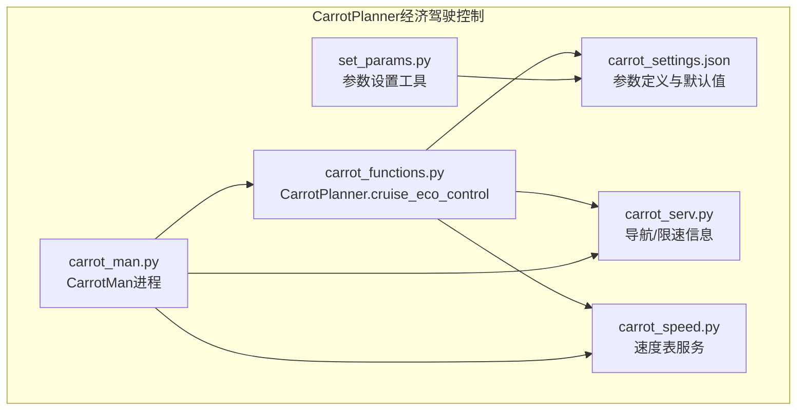
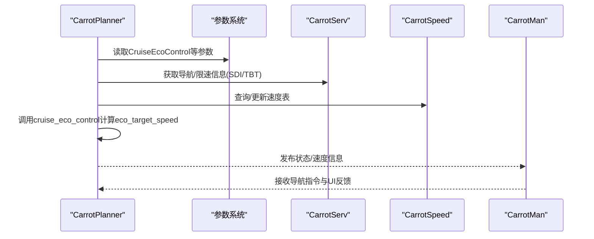
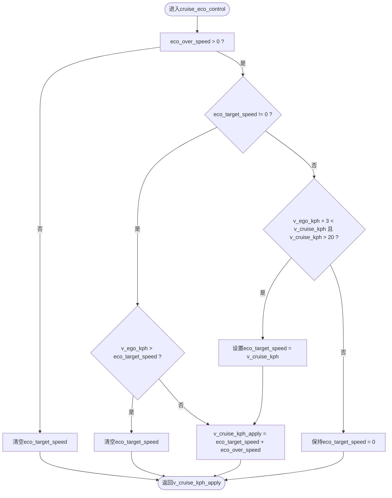
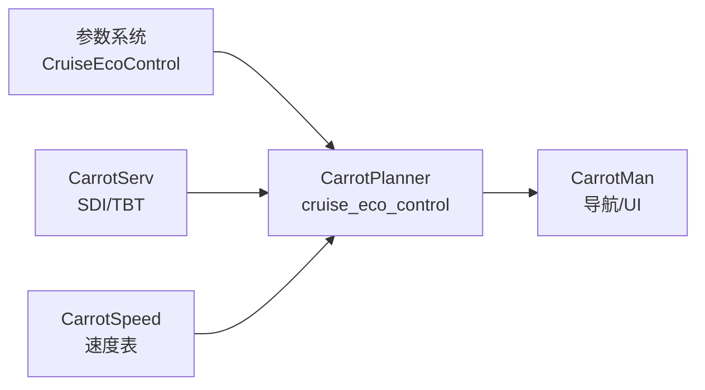

# 经济驾驶控制

<cite>
**本文档引用的文件**
- [carrot_functions.py](file://selfdrive/carrot/carrot_functions.py)
- [carrot_settings.json](file://selfdrive/carrot_settings.json)
- [carrot_serv.py](file://selfdrive/carrot/carrot_serv.py)
- [carrot_speed.py](file://selfdrive/carrot/carrot_speed.py)
- [carrot_man.py](file://selfdrive/carrot/carrot_man.py)
- [set_params.py](file://selfdrive/carrot_set.py)
</cite>

## 目录
1. [简介](#简介)
2. [项目结构](#项目结构)
3. [核心组件](#核心组件)
4. [架构总览](#架构总览)
5. [详细组件分析](#详细组件分析)
6. [依赖关系分析](#依赖关系分析)
7. [性能考虑](#性能考虑)
8. [故障排查指南](#故障排查指南)
9. [结论](#结论)
10. [附录](#附录)

## 简介
本文件面向CarrotPlanner的经济驾驶控制功能，围绕cruise_eco_control方法的油耗优化算法进行深入解析，重点说明以下内容：
- eco_over_speed参数的控制逻辑与作用边界
- eco_target_speed目标速度管理与状态机切换
- 经济模式下的速度调节策略：超速检测、目标速度设置、模式退出条件
- 经济模式与巡航控制的集成方式
- 对驾驶体验的影响与参数配置建议
- 节油效果评估与使用场景分析

## 项目结构
CarrotPlanner经济驾驶控制位于selfdrive/carrot目录下，核心文件包括：
- carrot_functions.py：包含CarrotPlanner类与cruise_eco_control算法主体
- carrot_settings.json：经济驾驶相关参数定义与默认值
- carrot_serv.py：导航与限速信息处理，辅助经济模式决策
- carrot_speed.py：速度表数据结构与查询服务
- carrot_man.py：CarrotMan进程，负责与导航/UI通信
- set_params.py：参数设置工具脚本

**图表来源**
- [carrot_functions.py:325-344](file://selfdrive/carrot/carrot_functions.py#L325-L344)
- [carrot_settings.json:290-302](file://selfdrive/carrot_settings.json#L290-L302)
- [carrot_serv.py:201-237](file://selfdrive/carrot/carrot_serv.py#L201-L237)
- [carrot_speed.py:248-278](file://selfdrive/carrot/carrot_speed.py#L248-L278)
- [carrot_man.py:342-402](file://selfdrive/carrot/carrot_man.py#L342-L402)
- [set_params.py:1-15](file://selfdrive/carrot_set.py#L1-L15)

**章节来源**
- [carrot_functions.py:1-543](file://selfdrive/carrot/carrot_functions.py#L1-L543)
- [carrot_settings.json:290-302](file://selfdrive/carrot_settings.json#L290-L302)

## 核心组件
- CarrotPlanner.cruise_eco_control：经济驾驶油耗优化算法入口，负责根据eco_over_speed与eco_target_speed动态调整目标巡航速度。
- 参数系统：通过carrot_settings.json定义CruiseEcoControl等关键参数，并由Params读取生效。
- 导航/限速辅助：carrot_serv提供SDI限速、TBT转向信息等，用于综合判断经济模式的适用性。
- 速度表服务：carrot_speed提供基于位置的速度查询与采样，支持经济模式下的速度曲线优化。

**章节来源**
- [carrot_functions.py:143-184](file://selfdrive/carrot/carrot_functions.py#L143-L184)
- [carrot_settings.json:290-302](file://selfdrive/carrot_settings.json#L290-L302)
- [carrot_serv.py:201-237](file://selfdrive/carrot/carrot_serv.py#L201-L237)
- [carrot_speed.py:248-278](file://selfdrive/carrot/carrot_speed.py#L248-L278)

## 架构总览
经济驾驶控制在CarrotPlanner.update主循环中被调用，结合驾驶模式、雷达/模型预测与导航信息，形成闭环控制：

**图表来源**
- [carrot_functions.py:346-389](file://selfdrive/carrot/carrot_functions.py#L346-L389)
- [carrot_settings.json:290-302](file://selfdrive/carrot_settings.json#L290-L302)
- [carrot_serv.py:201-237](file://selfdrive/carrot/carrot_serv.py#L201-L237)
- [carrot_speed.py:248-278](file://selfdrive/carrot/carrot_speed.py#L248-L278)
- [carrot_man.py:342-402](file://selfdrive/carrot/carrot_man.py#L342-L402)

## 详细组件分析

### 经济驾驶算法：cruise_eco_control
该方法实现“临时提升目标速度以改善HEV/EV工况下的能量回收效率”的策略，核心逻辑如下：
- 当eco_over_speed > 0时启用经济模式
- 若已存在eco_target_speed且当前v_ego_kph高于目标，则清空目标（退出经济模式）
- 否则将目标速度设置为eco_target_speed = v_cruise_kph + eco_over_speed
- 若eco_target_speed为0且满足条件（v_ego_kph + 3 < v_cruise_kph且v_cruise_kph > 20），重新设定eco_target_speed，实现“起步后自动恢复经济模式”

**图表来源**
- [carrot_functions.py:325-344](file://selfdrive/carrot/carrot_functions.py#L325-L344)

**章节来源**
- [carrot_functions.py:325-344](file://selfdrive/carrot/carrot_functions.py#L325-L344)

### 参数配置与默认值
- CruiseEcoControl：经济驾驶超速增量（单位km/h），默认值为2，范围0-10。该值直接映射到eco_over_speed，决定经济模式下目标速度的临时提升幅度。
- 参数读取路径：CarrotPlanner._params_update在每轮循环中从Params读取并应用，确保运行时可动态调整。

**章节来源**
- [carrot_settings.json:290-302](file://selfdrive/carrot_settings.json#L290-L302)
- [carrot_functions.py:177-182](file://selfdrive/carrot/carrot_functions.py#L177-L182)

### 与巡航控制的集成
- 在CarrotPlanner.update中，先调用cruise_eco_control对v_cruise_kph进行修正，再与CarrotMan提供的desiredSpeed进行取小，最终得到实际目标速度。
- 当eco_target_speed被设置后，系统会维持该目标直至v_ego_kph超过目标，从而避免频繁抖动。
- eco模式与安全模式因子协同：当DrivingMode为Eco时，mySafeFactor被设置为myEcoModeFactor，影响舒适刹车与纵向行为，间接提升经济模式下的平顺性。

**章节来源**
- [carrot_functions.py:346-394](file://selfdrive/carrot/carrot_functions.py#L346-L394)
- [carrot_functions.py:372-376](file://selfdrive/carrot/carrot_functions.py#L372-L376)

### 驾驶体验影响
- 平顺性：eco模式通过eco_over_speed的渐进式提升与目标维持，减少频繁加速/减速带来的顿挫感。
- 能效：在HEV/EV场景下，适度提升目标速度有助于电机/发动机工作在更高效区间，减少能量回收过程中的波动。
- 安全性：退出条件严格（v_ego_kph超过eco_target_speed），避免超速风险；同时与安全模式因子联动，保证紧急情况下优先安全。

**章节来源**
- [carrot_functions.py:325-344](file://selfdrive/carrot/carrot_functions.py#L325-L344)
- [carrot_functions.py:372-376](file://selfdrive/carrot/carrot_functions.py#L372-L376)

### 使用场景与效果评估
- 适用场景
  - 高速/城市快速路稳定巡航，车速持续高于目标
  - HEV/EV混合动力/纯电车型，能量回收效率敏感
  - 道路限速相对稳定、前方无频繁启停的工况
- 效果评估要点
  - 节油率：需结合实车日志与能耗数据进行统计分析（建议使用route级别对比）
  - 平顺性：可通过v_ego/v_cruise波动与eco_target_speed切换次数衡量
  - 安全性：超速事件计数与退出条件触发频率

**章节来源**
- [carrot_functions.py:325-344](file://selfdrive/carrot/carrot_functions.py#L325-L344)

## 依赖关系分析
经济驾驶控制的关键依赖链：
- 参数系统：CruiseEcoControl → eco_over_speed
- 导航/限速：SDI/TBT信息辅助判断是否适合经济模式
- 速度表：CarrotSpeed提供位置感知的速度参考，支持更精细的速度曲线
- CarrotMan：提供导航指令与UI交互，作为经济模式的外部输入源

**图表来源**
- [carrot_settings.json:290-302](file://selfdrive/carrot_settings.json#L290-L302)
- [carrot_functions.py:325-344](file://selfdrive/carrot/carrot_functions.py#L325-L344)
- [carrot_serv.py:201-237](file://selfdrive/carrot/carrot_serv.py#L201-L237)
- [carrot_speed.py:248-278](file://selfdrive/carrot/carrot_speed.py#L248-L278)
- [carrot_man.py:342-402](file://selfdrive/carrot/carrot_man.py#L342-L402)

**章节来源**
- [carrot_functions.py:325-394](file://selfdrive/carrot/carrot_functions.py#L325-L394)
- [carrot_settings.json:290-302](file://selfdrive/carrot_settings.json#L290-L302)
- [carrot_serv.py:201-237](file://selfdrive/carrot/carrot_serv.py#L201-L237)
- [carrot_speed.py:248-278](file://selfdrive/carrot/carrot_speed.py#L248-L278)
- [carrot_man.py:342-402](file://selfdrive/carrot/carrot_man.py#L342-L402)

## 性能考虑
- 参数读取频率：_params_update按帧计数周期性读取，避免高频访问Params带来的开销
- 算法复杂度：cruise_eco_control为常数时间逻辑，计算开销极低
- 速度表服务：CarrotSpeed采用网格化存储与邻域查询，适合实时场景；注意内存占用与保存频率

**章节来源**
- [carrot_functions.py:143-184](file://selfdrive/carrot/carrot_functions.py#L143-L184)
- [carrot_speed.py:248-278](file://selfdrive/carrot/carrot_speed.py#L248-L278)

## 故障排查指南
- 现象：经济模式不生效
  - 检查CruiseEcoControl是否为0（禁用经济模式）
  - 检查v_cruise_kph是否小于等于20（条件限制）
- 现象：频繁退出经济模式
  - 检查v_ego_kph是否持续超过eco_target_speed
  - 调整eco_over_speed以匹配实际车速波动
- 现象：目标速度抖动
  - 检查v_ego_kph + 3与v_cruise_kph的关系
  - 适当增大eco_over_speed以减少切换频率
- 参数调试
  - 使用set_params.py动态修改CruiseEcoControl并观察效果
  - 结合日志分析eco_target_speed变化与退出条件

**章节来源**
- [carrot_functions.py:325-344](file://selfdrive/carrot/carrot_functions.py#L325-L344)
- [set_params.py:1-15](file://selfdrive/carrot_set.py#L1-L15)

## 结论
CarrotPlanner的经济驾驶控制通过cruise_eco_control实现了“临时提升目标速度”的油耗优化策略，配合参数化配置与导航/限速信息，能够在保证安全的前提下提升能效与驾驶平顺性。建议在HEV/EV场景下启用，并结合实车数据持续优化eco_over_speed与退出条件，以达到最佳节油与体验平衡。

## 附录

### 参数配置建议
- eco_over_speed（CruiseEcoControl）：默认2km/h，适用于一般HEV工况；高速稳定路况可适当提高至3-4km/h
- v_cruise_kph门槛：建议≥20km/h，避免低速时经济模式误触发
- 退出条件：保持“v_ego_kph超过eco_target_speed”这一强约束，确保安全性

**章节来源**
- [carrot_settings.json:290-302](file://selfdrive/carrot_settings.json#L290-L302)
- [carrot_functions.py:325-344](file://selfdrive/carrot/carrot_functions.py#L325-L344)